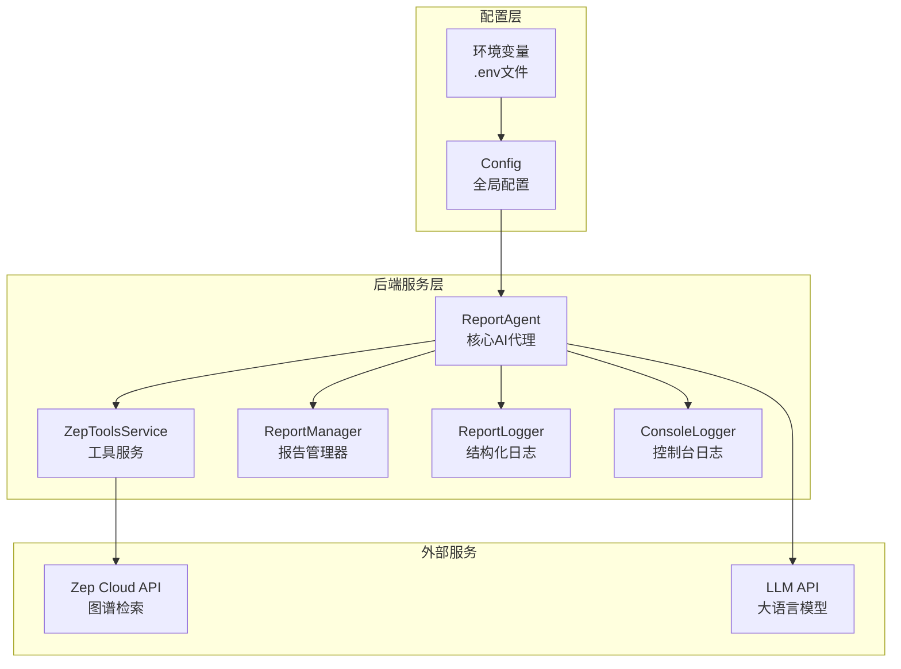
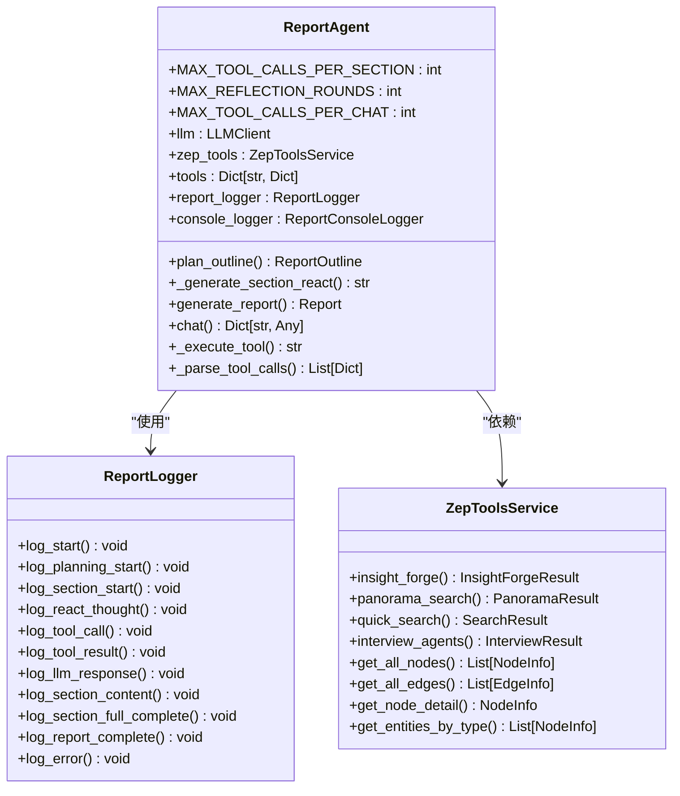
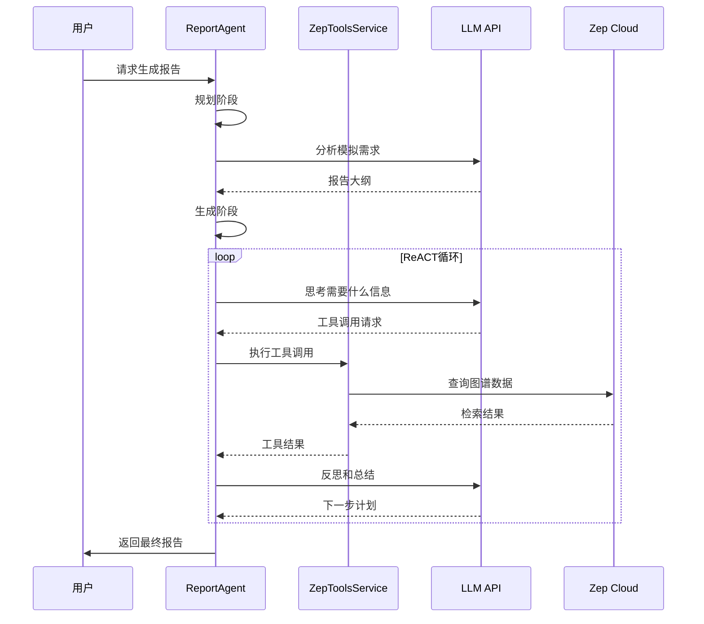
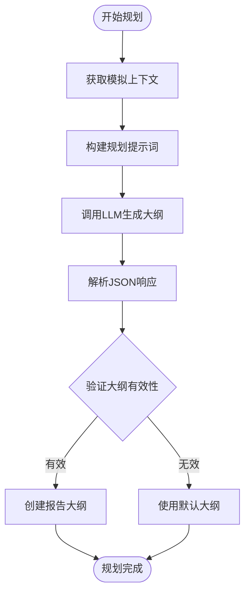
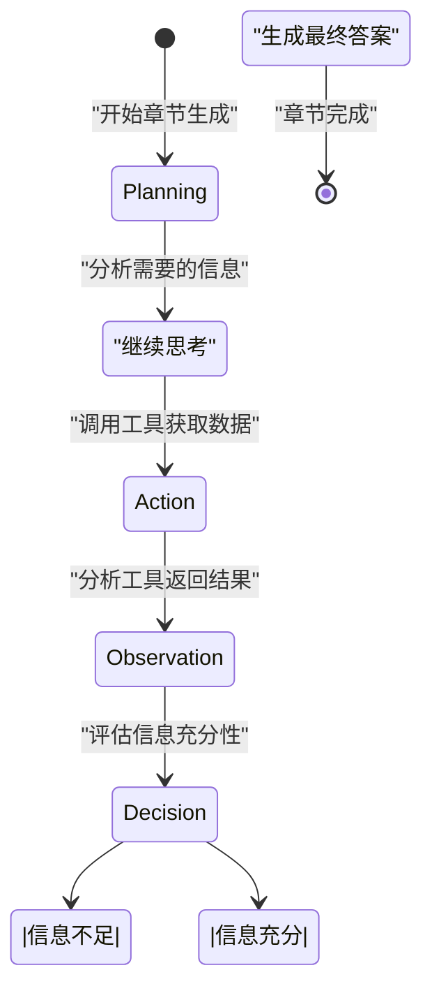
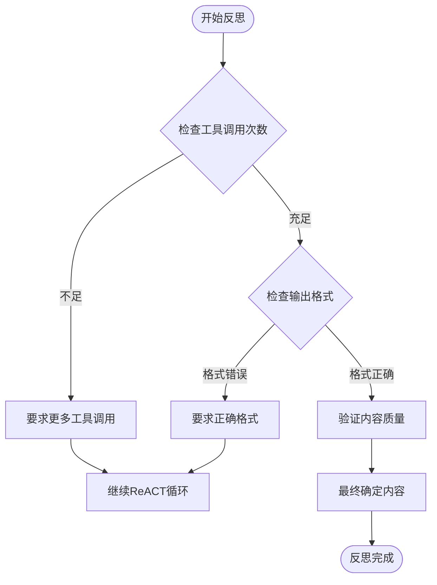
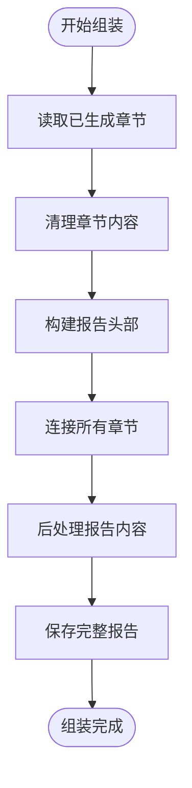
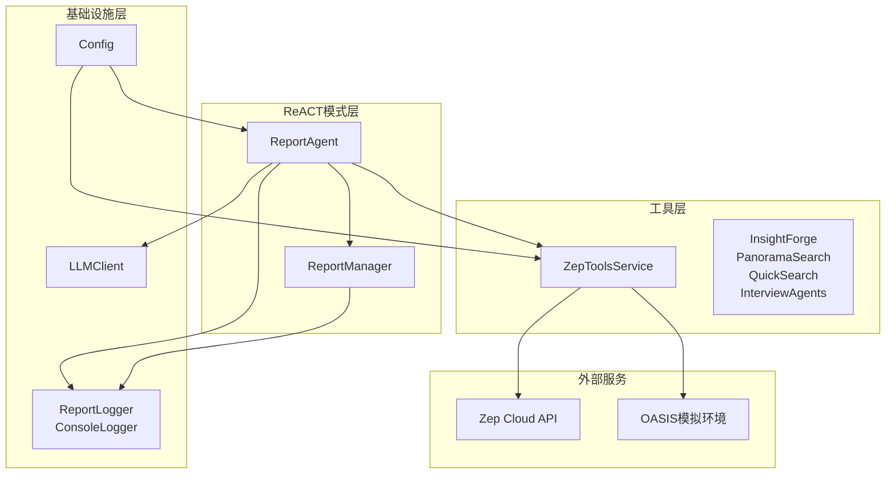
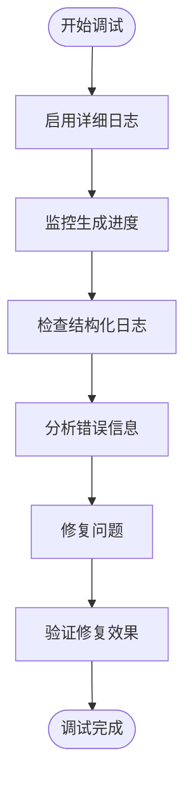

# ReACT模式机制

<cite>
**本文档引用的文件**
- [report_agent.py](file://backend/app/services/report_agent.py)
- [zep_tools.py](file://backend/app/services/zep_tools.py)
- [config.py](file://backend/app/config.py)
- [README.md](file://README.md)
</cite>

## 目录
1. [简介](#简介)
2. [项目结构](#项目结构)
3. [核心组件](#核心组件)
4. [架构概览](#架构概览)
5. [详细组件分析](#详细组件分析)
6. [依赖关系分析](#依赖关系分析)
7. [性能考虑](#性能考虑)
8. [故障排除指南](#故障排除指南)
9. [结论](#结论)

## 简介

MiroFish的ReACT模式机制是一种基于推理-行动-反思循环的智能报告生成系统。该系统通过四个核心阶段：规划阶段、生成阶段、反思阶段和最终完成阶段，实现了从模拟数据到预测报告的自动化生成过程。

ReACT模式的核心思想是让AI代理在每个决策循环中执行三个关键步骤：
- **推理（Reasoning）**：分析当前状态和目标，制定行动计划
- **行动（Acting）**：执行具体的工具调用，获取模拟数据
- **反思（Reflection）**：评估行动结果，决定下一步策略

这种机制确保了报告生成过程的严谨性和数据驱动性，避免了基于假设的主观臆测。

## 项目结构

MiroFish项目采用模块化的架构设计，ReACT模式机制主要集中在后端服务层：

**图表来源**
- [report_agent.py](file://backend/app/services/report_agent.py#L469-L530)
- [zep_tools.py](file://backend/app/services/zep_tools.py#L377-L410)
- [config.py](file://backend/app/config.py#L20-L76)

**章节来源**
- [README.md](file://README.md#L26-L88)
- [report_agent.py](file://backend/app/services/report_agent.py#L1-L32)

## 核心组件

### ReportAgent - ReACT模式核心实现

ReportAgent是ReACT模式机制的核心组件，负责协调整个报告生成过程。它继承了ReACT模式的四个核心阶段：

**图表来源**
- [report_agent.py](file://backend/app/services/report_agent.py#L469-L530)
- [report_agent.py](file://backend/app/services/report_agent.py#L306-L386)
- [zep_tools.py](file://backend/app/services/zep_tools.py#L377-L410)

### 工具系统 - 多维检索能力

ReACT模式的核心在于其强大的工具系统，提供了四种不同类型的检索工具：

| 工具名称 | 功能特性 | 使用场景 | 数据来源 |
|---------|----------|----------|----------|
| InsightForge | 深度洞察检索 | 复杂问题分析、多维度信息整合 | 图谱语义搜索、实体分析、关系链追踪 |
| PanoramaSearch | 广度搜索 | 全景视图获取、历史演变分析 | 所有节点和关系、历史/过期内容 |
| QuickSearch | 快速搜索 | 精确信息验证、简单查询 | 相关事实列表 |
| InterviewAgents | 深度采访 | 多视角观点收集、Agent真实反应 | OASIS模拟环境Agent采访 |

**章节来源**
- [report_agent.py](file://backend/app/services/report_agent.py#L530-L632)
- [zep_tools.py](file://backend/app/services/zep_tools.py#L137-L374)

## 架构概览

ReACT模式机制的整体架构体现了高度的模块化和可扩展性：

**图表来源**
- [report_agent.py](file://backend/app/services/report_agent.py#L929-L1356)
- [report_agent.py](file://backend/app/services/report_agent.py#L1358-L1564)

## 详细组件分析

### 规划阶段 - 智能大纲生成

规划阶段是ReACT模式的第一步，负责分析模拟需求并生成报告大纲：

**图表来源**
- [report_agent.py](file://backend/app/services/report_agent.py#L795-L927)

规划阶段的关键特点：
- **上下文感知**：通过`get_simulation_context`获取模拟世界的整体状态
- **结构化输出**：要求LLM输出JSON格式的大纲，确保可解析性
- **容错机制**：提供默认大纲作为回退方案

**章节来源**
- [report_agent.py](file://backend/app/services/report_agent.py#L815-L927)

### 生成阶段 - ReACT循环实现

生成阶段是ReACT模式的核心，实现了完整的推理-行动-反思循环：

**图表来源**
- [report_agent.py](file://backend/app/services/report_agent.py#L929-L1356)

#### ReACT循环的四个阶段详解

**1. 思考阶段（Thought）**
- 分析当前章节需要的信息类型
- 制定检索策略和工具选择计划
- 评估所需信息的复杂程度

**2. 行动阶段（Action）**
- 执行工具调用获取模拟数据
- 限制每轮只能调用一个工具
- 记录工具调用的详细信息

**3. 观察阶段（Observation）**
- 分析工具返回的检索结果
- 评估信息的相关性和完整性
- 识别可能的遗漏信息

**4. 决策阶段（Decision）**
- 判断是否需要更多信息
- 决定是否输出最终答案
- 调整后续的检索策略

**章节来源**
- [report_agent.py](file://backend/app/services/report_agent.py#L963-L1144)
- [report_agent.py](file://backend/app/services/report_agent.py#L1151-L1356)

### 反思阶段 - 质量保证机制

反思阶段确保报告质量的关键环节：

**图表来源**
- [report_agent.py](file://backend/app/services/report_agent.py#L1205-L1323)

反思阶段的主要功能：
- **工具调用约束**：确保每章节至少调用3次工具，最多5次
- **格式验证**：要求最终答案必须以"Final Answer:"开头
- **内容质量检查**：验证报告内容的准确性和完整性

**章节来源**
- [report_agent.py](file://backend/app/services/report_agent.py#L1205-L1323)

### 最终完成阶段 - 报告组装

最终完成阶段负责将各个章节组装成完整的报告：

**图表来源**
- [report_agent.py](file://backend/app/services/report_agent.py#L2118-L2145)

**章节来源**
- [report_agent.py](file://backend/app/services/report_agent.py#L2118-L2271)

## 依赖关系分析

ReACT模式机制的依赖关系体现了清晰的分层架构：

**图表来源**
- [report_agent.py](file://backend/app/services/report_agent.py#L495-L528)
- [zep_tools.py](file://backend/app/services/zep_tools.py#L377-L410)
- [config.py](file://backend/app/config.py#L20-L76)

### 关键参数配置

ReACT模式机制通过以下关键参数控制行为：

| 参数名称 | 默认值 | 作用域 | 描述 |
|---------|--------|--------|------|
| MAX_TOOL_CALLS_PER_SECTION | 5 | 章节生成 | 每个章节最多允许的工具调用次数 |
| MAX_REFLECTION_ROUNDS | 3 | 反思阶段 | 反思循环的最大迭代次数 |
| MAX_TOOL_CALLS_PER_CHAT | 2 | 对话模式 | 单次对话中允许的工具调用次数 |
| MIN_TOOL_CALLS | 3 | 章节生成 | 每个章节最少需要的工具调用次数 |
| MAX_ITERATIONS | 5 | ReACT循环 | ReACT循环的最大迭代次数 |

**章节来源**
- [report_agent.py](file://backend/app/services/report_agent.py#L486-L494)
- [config.py](file://backend/app/config.py#L61-L64)

## 性能考虑

ReACT模式机制在设计时充分考虑了性能优化：

### 工具调用优化
- **并发限制**：每轮只执行一个工具调用，避免过度并发
- **结果缓存**：重复的工具调用会被缓存，减少API调用次数
- **超时控制**：为每个工具调用设置合理的超时时间

### 内存管理
- **流式输出**：章节生成完成后立即保存，避免内存累积
- **内容截断**：对长结果进行截断处理，防止内存溢出
- **增量处理**：支持增量日志记录，便于监控和调试

### 错误处理
- **重试机制**：工具调用失败时自动重试，提高成功率
- **降级策略**：当外部API不可用时，使用本地降级方案
- **容错设计**：即使部分工具失败，也能继续完成报告生成

## 故障排除指南

### 常见问题及解决方案

**问题1：工具调用超时**
- **症状**：工具调用长时间无响应
- **解决方案**：检查网络连接，增加超时时间，使用降级方案

**问题2：LLM响应为空**
- **症状**：LLM返回None或空字符串
- **解决方案**：检查API密钥配置，验证模型可用性，重试请求

**问题3：报告生成中断**
- **症状**：报告生成过程中断
- **解决方案**：检查磁盘空间，验证文件权限，恢复中断的任务

**问题4：工具调用次数不足**
- **症状**：章节生成提前结束，信息不够充分
- **解决方案**：调整MIN_TOOL_CALLS参数，检查工具配置

### 调试工具

ReACT模式机制提供了完善的日志记录系统：

**图表来源**
- [report_agent.py](file://backend/app/services/report_agent.py#L306-L386)

**章节来源**
- [report_agent.py](file://backend/app/services/report_agent.py#L306-L386)

## 结论

MiroFish的ReACT模式机制通过精心设计的推理-行动-反思循环，实现了从模拟数据到预测报告的自动化生成。该机制的核心优势包括：

1. **数据驱动**：所有报告内容都基于模拟数据，确保预测的客观性和准确性
2. **可解释性**：完整的ReACT循环记录，便于追溯和审计
3. **可扩展性**：模块化的架构设计，支持新的工具和功能扩展
4. **可靠性**：完善的错误处理和容错机制，确保系统稳定性

ReACT模式机制不仅适用于MiroFish项目，其设计理念和实现方式也为其他AI应用提供了有价值的参考。通过合理配置参数和工具，开发者可以根据具体需求定制ReACT模式的应用场景。