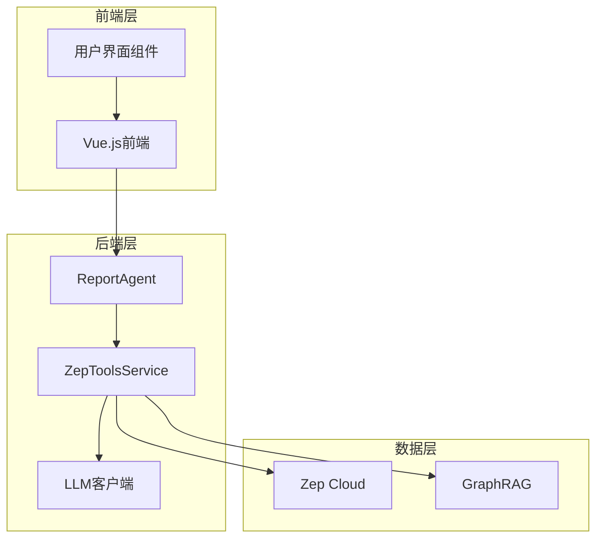
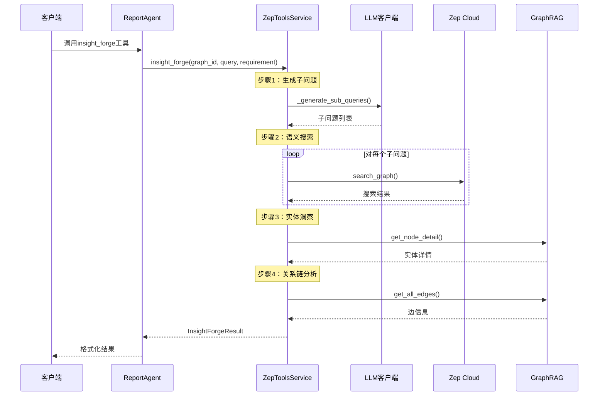
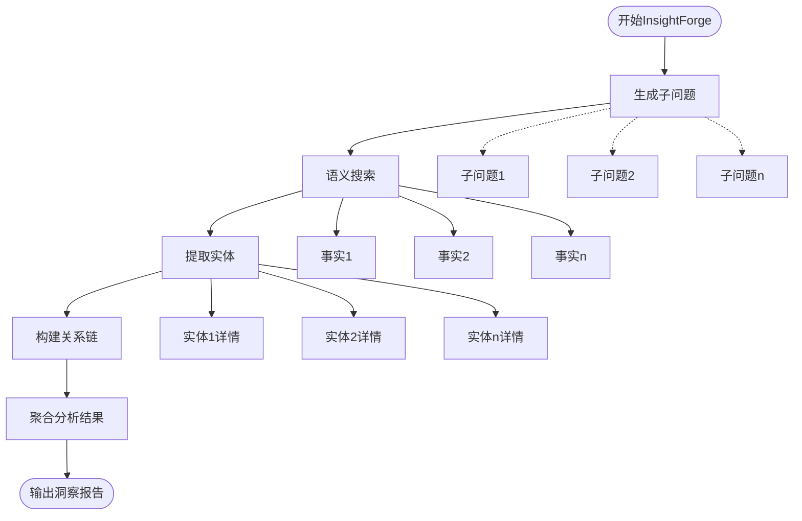
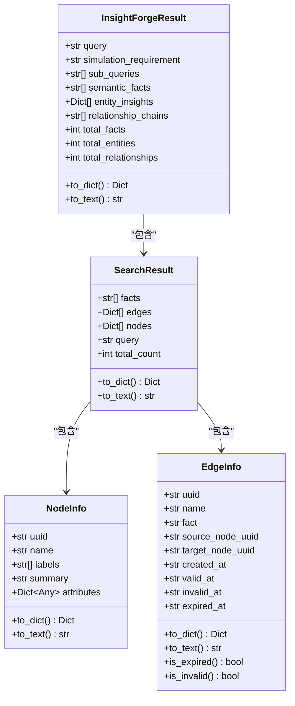
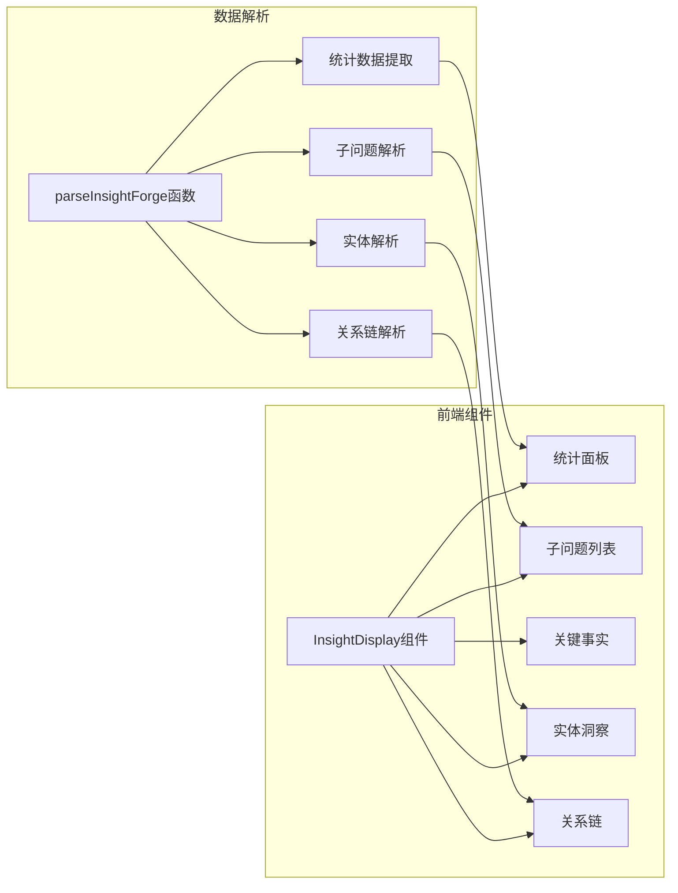
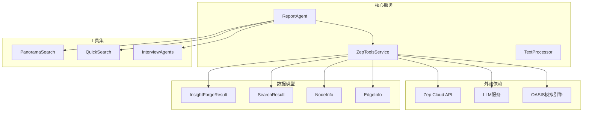

# InsightForge深度洞察检索工具

<cite>
**本文档引用的文件**
- [zep_tools.py](file://backend/app/services/zep_tools.py)
- [report_agent.py](file://backend/app/services/report_agent.py)
- [Step4Report.vue](file://frontend/src/components/Step4Report.vue)
- [README.md](file://README.md)
</cite>

## 目录
1. [简介](#简介)
2. [项目结构](#项目结构)
3. [核心组件](#核心组件)
4. [架构概览](#架构概览)
5. [详细组件分析](#详细组件分析)
6. [依赖关系分析](#依赖关系分析)
7. [性能考虑](#性能考虑)
8. [故障排除指南](#故障排除指南)
9. [结论](#结论)
10. [附录](#附录)

## 简介

InsightForge深度洞察检索工具是MiroFish项目中的核心分析组件，专为复杂问题的多维度深度分析而设计。该工具能够自动将复杂问题分解为多个子问题，进行语义搜索和关系链分析，提供全面的洞察报告。

### 主要特性

- **智能问题分解**：使用LLM将复杂问题自动分解为多个可独立检索的子问题
- **多维度检索**：同时进行语义搜索、实体洞察和关系链分析
- **深度整合**：将所有检索结果整合为完整的洞察报告
- **实时可视化**：前端提供直观的洞察结果展示界面

## 项目结构

MiroFish项目采用前后端分离架构，InsightForge工具位于后端服务层：



**图表来源**
- [zep_tools.py](file://backend/app/services/zep_tools.py#L377-L416)
- [report_agent.py](file://backend/app/services/report_agent.py#L634-L742)

**章节来源**
- [README.md](file://README.md#L81-L87)

## 核心组件

### InsightForgeResult数据结构

InsightForgeResult是InsightForge工具的核心输出数据结构，包含完整的分析结果：

| 字段名 | 类型 | 描述 | 默认值 |
|--------|------|------|--------|
| query | str | 原始查询问题 | - |
| simulation_requirement | str | 模拟需求描述 | - |
| sub_queries | List[str] | 自动生成的子问题列表 | [] |
| semantic_facts | List[str] | 语义搜索得到的关键事实 | [] |
| entity_insights | List[Dict[str, Any]] | 实体洞察信息 | [] |
| relationship_chains | List[str] | 关系链分析结果 | [] |
| total_facts | int | 事实总数统计 | 0 |
| total_entities | int | 实体总数统计 | 0 |
| total_relationships | int | 关系链总数统计 | 0 |

### ZepToolsService核心功能

ZepToolsService是InsightForge工具的主要实现类，提供以下核心功能：

- **图谱搜索**：支持语义搜索和本地关键词匹配
- **实体管理**：获取节点详情和相关边信息
- **子问题生成**：使用LLM分解复杂问题
- **结果整合**：将多维度检索结果整合为洞察报告

**章节来源**
- [zep_tools.py](file://backend/app/services/zep_tools.py#L136-L170)
- [zep_tools.py](file://backend/app/services/zep_tools.py#L377-L416)

## 架构概览

InsightForge工具采用分层架构设计，实现了高度模块化的功能组织：



**图表来源**
- [zep_tools.py](file://backend/app/services/zep_tools.py#L926-L1071)
- [report_agent.py](file://backend/app/services/report_agent.py#L651-L661)

## 详细组件分析

### InsightForge工作流程

InsightForge工具按照严格的五步流程执行深度分析：

#### 步骤1：智能问题分解
使用LLM将复杂问题分解为多个维度明确的子问题，确保每个子问题都可以在模拟环境中独立观察。

#### 步骤2：多源语义搜索
对每个子问题进行语义搜索，同时对原始问题进行补充搜索，确保不遗漏重要信息。

#### 步骤3：实体深度挖掘
从搜索结果中提取相关实体，获取实体的详细信息和相关事实，建立完整的实体画像。

#### 步骤4：关系链构建
分析实体间的关联关系，构建完整的关系链网络，揭示事件的深层联系。

#### 步骤5：结果整合输出
将所有维度的分析结果整合为结构化的洞察报告。



**图表来源**
- [zep_tools.py](file://backend/app/services/zep_tools.py#L926-L1071)

**章节来源**
- [zep_tools.py](file://backend/app/services/zep_tools.py#L926-L1071)
- [zep_tools.py](file://backend/app/services/zep_tools.py#L1073-L1124)

### 数据模型设计

InsightForge工具使用了多种数据模型来表示不同的分析维度：



**图表来源**
- [zep_tools.py](file://backend/app/services/zep_tools.py#L136-L170)
- [zep_tools.py](file://backend/app/services/zep_tools.py#L25-L53)
- [zep_tools.py](file://backend/app/services/zep_tools.py#L55-L134)

**章节来源**
- [zep_tools.py](file://backend/app/services/zep_tools.py#L25-L134)

### 前端集成与展示

前端系统提供了专门的InsightForge结果展示组件，支持结构化和原始两种显示模式：



**图表来源**
- [Step4Report.vue](file://frontend/src/components/Step4Report.vue#L542-L623)

**章节来源**
- [Step4Report.vue](file://frontend/src/components/Step4Report.vue#L260-L641)

## 依赖关系分析

InsightForge工具的依赖关系体现了清晰的分层架构：



**图表来源**
- [zep_tools.py](file://backend/app/services/zep_tools.py#L1-L22)
- [report_agent.py](file://backend/app/services/report_agent.py#L634-L742)

**章节来源**
- [zep_tools.py](file://backend/app/services/zep_tools.py#L1-L22)
- [report_agent.py](file://backend/app/services/report_agent.py#L634-L742)

## 性能考虑

### 优化策略

1. **缓存机制**：合理利用Zep Cloud的缓存能力，减少重复查询
2. **批量处理**：对实体详情获取进行批量优化，避免频繁API调用
3. **结果去重**：使用集合(set)进行事实去重，提高处理效率
4. **限制数量**：对搜索结果进行合理限制，平衡精度与性能

### 性能监控

- **日志记录**：详细的执行日志帮助识别性能瓶颈
- **超时控制**：合理的超时设置防止长时间阻塞
- **重试机制**：自动重试失败的请求，提高成功率

## 故障排除指南

### 常见问题及解决方案

| 问题类型 | 症状 | 可能原因 | 解决方案 |
|----------|------|----------|----------|
| LLM调用失败 | 子问题生成失败 | API密钥配置错误 | 检查环境变量配置 |
| Zep Cloud连接失败 | 搜索功能异常 | 网络连接问题 | 检查API密钥和网络状态 |
| 实体详情获取失败 | 实体洞察为空 | 节点UUID无效 | 验证实体UUID正确性 |
| 性能问题 | 处理速度慢 | 查询结果过多 | 调整limit参数 |

**章节来源**
- [zep_tools.py](file://backend/app/services/zep_tools.py#L418-L440)

## 结论

InsightForge深度洞察检索工具通过智能化的问题分解、多维度的检索分析和深度的整合输出，为复杂问题的分析提供了强有力的支持。其模块化的设计和清晰的架构使其具有良好的扩展性和维护性。

### 核心优势

1. **智能化程度高**：自动问题分解和多维度分析
2. **结果质量优秀**：整合多种分析维度，提供全面洞察
3. **用户体验良好**：前后端协同，提供直观的可视化展示
4. **架构设计合理**：分层清晰，便于维护和扩展

## 附录

### 使用示例

#### 基本调用方式

```python
# 后端调用示例
result = zep_tools.insight_forge(
    graph_id="your_graph_id",
    query="复杂分析问题",
    simulation_requirement="模拟需求描述"
)
```

#### 参数配置

- **graph_id**: 图谱唯一标识符
- **query**: 用户查询问题
- **simulation_requirement**: 模拟需求背景
- **report_context**: 报告上下文（可选）
- **max_sub_queries**: 最大子问题数量（默认5）

#### 返回结果解析

前端通过专门的解析函数处理InsightForge结果：

```javascript
const parsedResult = parseInsightForge(insightResult);
// 访问解析后的数据
console.log(parsedResult.stats); // 统计信息
console.log(parsedResult.entities); // 实体列表
console.log(parsedResult.relations); // 关系链
```

**章节来源**
- [report_agent.py](file://backend/app/services/report_agent.py#L651-L661)
- [Step4Report.vue](file://frontend/src/components/Step4Report.vue#L542-L623)