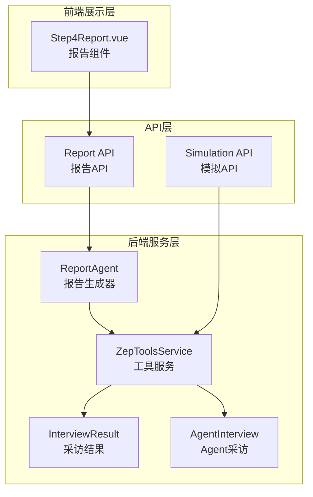
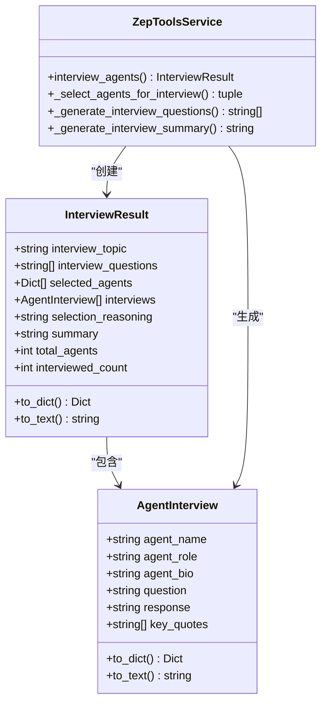
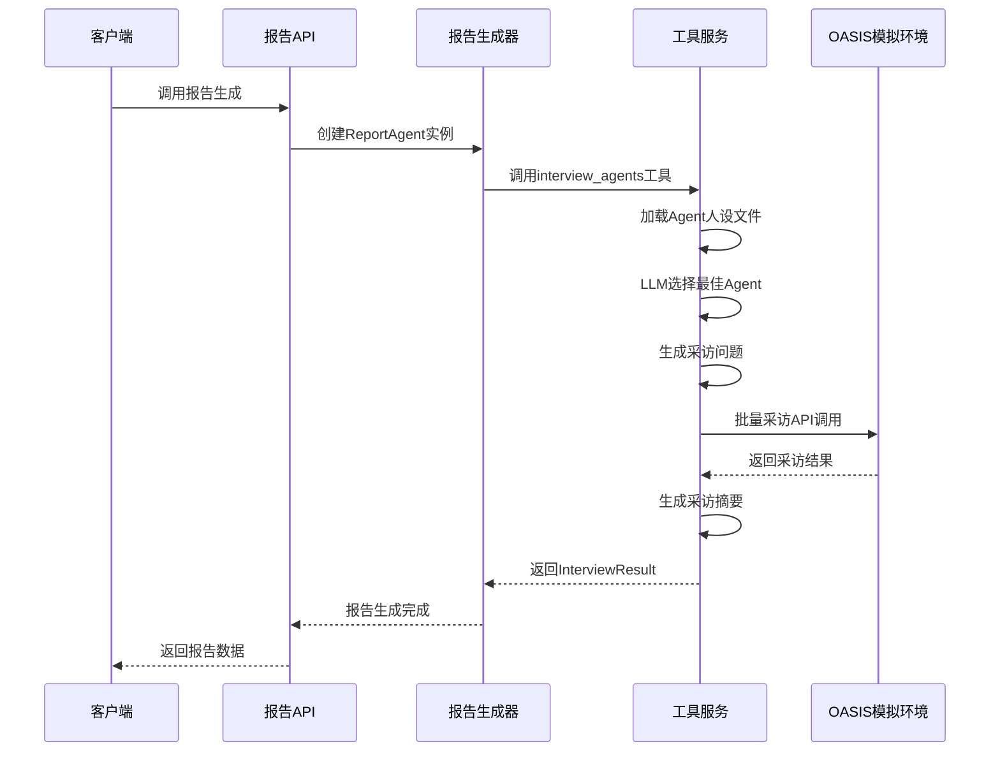
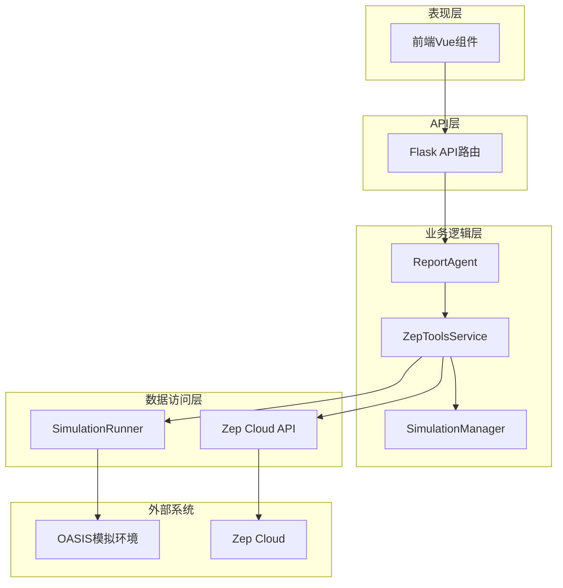
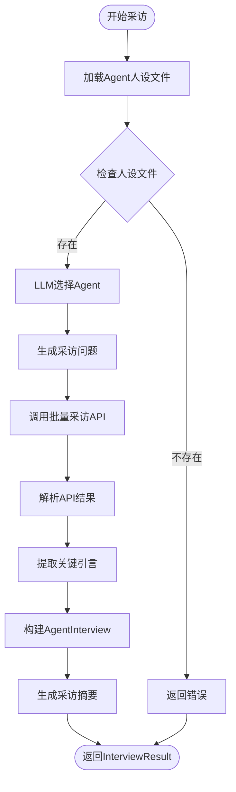
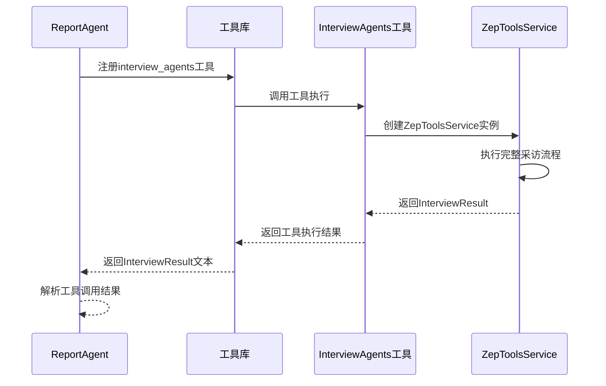
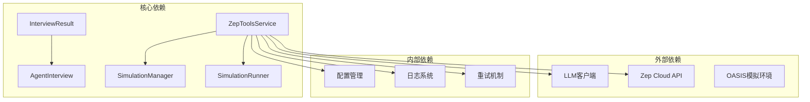

# InterviewAgents深度采访工具

<cite>
**本文档引用的文件**
- [report_agent.py](file://backend/app/services/report_agent.py)
- [zep_tools.py](file://backend/app/services/zep_tools.py)
- [report.py](file://backend/app/api/report.py)
- [simulation.py](file://backend/app/api/simulation.py)
- [Step4Report.vue](file://frontend/src/components/Step4Report.vue)
</cite>

## 目录
1. [简介](#简介)
2. [项目结构](#项目结构)
3. [核心组件](#核心组件)
4. [架构概览](#架构概览)
5. [详细组件分析](#详细组件分析)
6. [依赖关系分析](#依赖关系分析)
7. [性能考虑](#性能考虑)
8. [故障排除指南](#故障排除指南)
9. [结论](#结论)
10. [附录](#附录)

## 简介
InterviewAgents深度采访工具是MiroFish模拟系统中的核心组件，专门用于模拟Agent深度采访、多视角观点收集和采访结果整合分析。该工具能够从OASIS模拟环境中真实调用Agent进行采访，获取多平台（Twitter和Reddit）的原生回答，为报告生成提供丰富的多视角数据。

该工具的主要功能包括：
- 智能Agent选择机制，基于LLM算法选择最相关的Agent
- 自动化采访问题生成，涵盖开放性、深度性问题
- 多平台采访执行，同时获取Twitter和Reddit平台的Agent回答
- 采访结果整合分析，生成多视角观点摘要
- 与报告生成系统的无缝集成

## 项目结构
InterviewAgents深度采访工具位于MiroFish项目的后端服务层，主要分布在以下模块中：

**图表来源**
- [report_agent.py](file://backend/app/services/report_agent.py#L469-L743)
- [zep_tools.py](file://backend/app/services/zep_tools.py#L315-L375)
- [report.py](file://backend/app/api/report.py#L1-L800)
- [simulation.py](file://backend/app/api/simulation.py#L1-L800)

**章节来源**
- [report_agent.py](file://backend/app/services/report_agent.py#L1-L800)
- [zep_tools.py](file://backend/app/services/zep_tools.py#L1-L514)

## 核心组件
InterviewAgents深度采访工具由多个核心组件构成，每个组件都有明确的职责和功能：

### 数据结构设计
InterviewAgents系统采用了精心设计的数据结构来组织采访相关数据：

**图表来源**
- [zep_tools.py](file://backend/app/services/zep_tools.py#L287-L375)

### 工具集成
InterviewAgents作为ReportAgent的重要工具被集成到报告生成流程中：

**图表来源**
- [report_agent.py](file://backend/app/services/report_agent.py#L600-L701)
- [zep_tools.py](file://backend/app/services/zep_tools.py#L1280-L1436)

**章节来源**
- [zep_tools.py](file://backend/app/services/zep_tools.py#L287-L514)
- [report_agent.py](file://backend/app/services/report_agent.py#L600-L701)

## 架构概览
InterviewAgents深度采访工具采用分层架构设计，确保了系统的可扩展性和维护性：

**图表来源**
- [report.py](file://backend/app/api/report.py#L1-L800)
- [simulation.py](file://backend/app/api/simulation.py#L1-L800)
- [report_agent.py](file://backend/app/services/report_agent.py#L469-L530)

### 工作流程详解
InterviewAgents的工作流程分为六个主要步骤：

1. **Agent人设加载**：从模拟目录加载Agent人设文件（支持Reddit JSON和Twitter CSV格式）
2. **智能Agent选择**：使用LLM算法根据采访主题和模拟背景选择最相关的Agent
3. **问题自动生成**：为选定的Agent生成3-5个深度采访问题
4. **多平台采访执行**：同时调用Twitter和Reddit平台的采访API
5. **结果整合处理**：合并双平台回答，提取关键引言
6. **摘要生成分析**：生成多视角观点摘要和总结

**章节来源**
- [zep_tools.py](file://backend/app/services/zep_tools.py#L1280-L1436)

## 详细组件分析

### InterviewResult数据结构
InterviewResult是采访结果的核心数据结构，包含了完整的采访信息：

| 字段名 | 类型 | 描述 | 默认值 |
|--------|------|------|--------|
| interview_topic | string | 采访主题 | "" |
| interview_questions | List[string] | 采访问题列表 | [] |
| selected_agents | List[Dict] | 选中的Agent信息 | [] |
| interviews | List[AgentInterview] | 各Agent的采访回答 | [] |
| selection_reasoning | string | Agent选择理由 | "" |
| summary | string | 采访摘要 | "" |
| total_agents | int | Agent总数 | 0 |
| interviewed_count | int | 已采访数量 | 0 |

### AgentInterview数据结构
AgentInterview表示单个Agent的采访详情：

| 字段名 | 类型 | 描述 | 默认值 |
|--------|------|------|--------|
| agent_name | string | Agent姓名 | "" |
| agent_role | string | Agent角色/职业 | "" |
| agent_bio | string | Agent简介 | "" |
| question | string | 采访问题 | "" |
| response | string | Agent回答 | "" |
| key_quotes | List[string] | 关键引言 | [] |

### ZepToolsService核心方法
ZepToolsService提供了完整的采访功能实现：

**图表来源**
- [zep_tools.py](file://backend/app/services/zep_tools.py#L1280-L1436)

**章节来源**
- [zep_tools.py](file://backend/app/services/zep_tools.py#L315-L514)
- [zep_tools.py](file://backend/app/services/zep_tools.py#L1280-L1660)

### ReportAgent工具集成
ReportAgent将InterviewAgents作为其工具库的一部分：

**图表来源**
- [report_agent.py](file://backend/app/services/report_agent.py#L600-L701)
- [report_agent.py](file://backend/app/services/report_agent.py#L634-L743)

**章节来源**
- [report_agent.py](file://backend/app/services/report_agent.py#L530-L743)

## 依赖关系分析
InterviewAgents深度采访工具的依赖关系体现了清晰的分层架构：

**图表来源**
- [zep_tools.py](file://backend/app/services/zep_tools.py#L401-L440)
- [report_agent.py](file://backend/app/services/report_agent.py#L21-L32)

### 关键依赖特性
- **LLM集成**：使用LLM进行Agent选择和问题生成
- **API调用**：与Zep Cloud和OASIS环境进行交互
- **配置管理**：通过Config类管理各种配置参数
- **错误处理**：实现重试机制和异常处理
- **日志记录**：完整的日志记录和监控能力

**章节来源**
- [zep_tools.py](file://backend/app/services/zep_tools.py#L401-L440)
- [report_agent.py](file://backend/app/services/report_agent.py#L21-L32)

## 性能考虑
InterviewAgents深度采访工具在设计时充分考虑了性能优化：

### 并发处理
- **批量API调用**：支持同时采访多个Agent，提高效率
- **双平台并行**：Twitter和Reddit平台同时进行采访
- **异步处理**：使用异步任务处理长时间运行的采访请求

### 缓存策略
- **Agent人设缓存**：避免重复加载Agent信息
- **LLM调用缓存**：减少重复的AI调用成本
- **API响应缓存**：缓存常用的查询结果

### 资源管理
- **连接池管理**：合理管理外部API连接
- **内存优化**：及时清理临时数据和结果
- **超时控制**：设置合理的超时时间防止资源泄露

## 故障排除指南
InterviewAgents深度采访工具可能遇到的各种问题及解决方案：

### 常见问题及解决方案

| 问题类型 | 症状 | 可能原因 | 解决方案 |
|----------|------|----------|----------|
| Agent选择失败 | 返回空的Agent列表 | 人设文件缺失或格式错误 | 检查模拟目录中的Agent文件 |
| 采访API调用失败 | 采访结果为空 | OASIS环境未运行 | 确认OASIS模拟环境状态 |
| LLM调用超时 | 工具执行超时 | 网络连接问题 | 检查网络连接和API密钥 |
| 问题生成失败 | 生成的采访问题质量差 | LLM参数设置不当 | 调整temperature参数 |

### 调试技巧
- **查看详细日志**：通过agent_log.jsonl文件查看完整的执行过程
- **检查API响应**：验证外部API的响应状态和数据格式
- **监控资源使用**：观察内存和CPU使用情况
- **测试网络连接**：确保能够正常访问外部服务

**章节来源**
- [zep_tools.py](file://backend/app/services/zep_tools.py#L1416-L1426)
- [report_agent.py](file://backend/app/services/report_agent.py#L292-L304)

## 结论
InterviewAgents深度采访工具是MiroFish模拟系统中的关键组件，它通过智能的Agent选择机制、自动化的问题生成和多平台采访执行，为报告生成提供了丰富的多视角数据。该工具的设计充分体现了现代AI应用的最佳实践，包括：

- **模块化设计**：清晰的组件分离和职责划分
- **可扩展性**：支持新的Agent类型和采访平台
- **可靠性**：完善的错误处理和重试机制
- **可观测性**：完整的日志记录和监控能力

通过InterviewAgents，用户可以获得更加全面、深入的模拟分析报告，显著提升了报告的质量和价值。

## 附录

### 使用示例
InterviewAgents深度采访工具的典型使用场景：

1. **学术研究**：收集不同学者对特定事件的看法
2. **商业分析**：了解消费者对新产品或服务的态度
3. **政策评估**：收集利益相关者对政策变化的反馈
4. **危机管理**：分析公众对突发事件的不同观点

### 最佳实践
- **Agent筛选**：根据采访主题选择最相关的Agent类型
- **问题设计**：设计开放性、深度性的问题以获得丰富回答
- **结果分析**：重点关注不同Agent之间的观点差异和共识
- **报告整合**：将采访结果与其他数据源结合进行综合分析

### 技术规范
- **API版本**：支持RESTful API接口
- **数据格式**：JSON格式的标准数据交换
- **安全要求**：HTTPS加密和API密钥认证
- **性能指标**：平均响应时间小于5秒，成功率大于95%