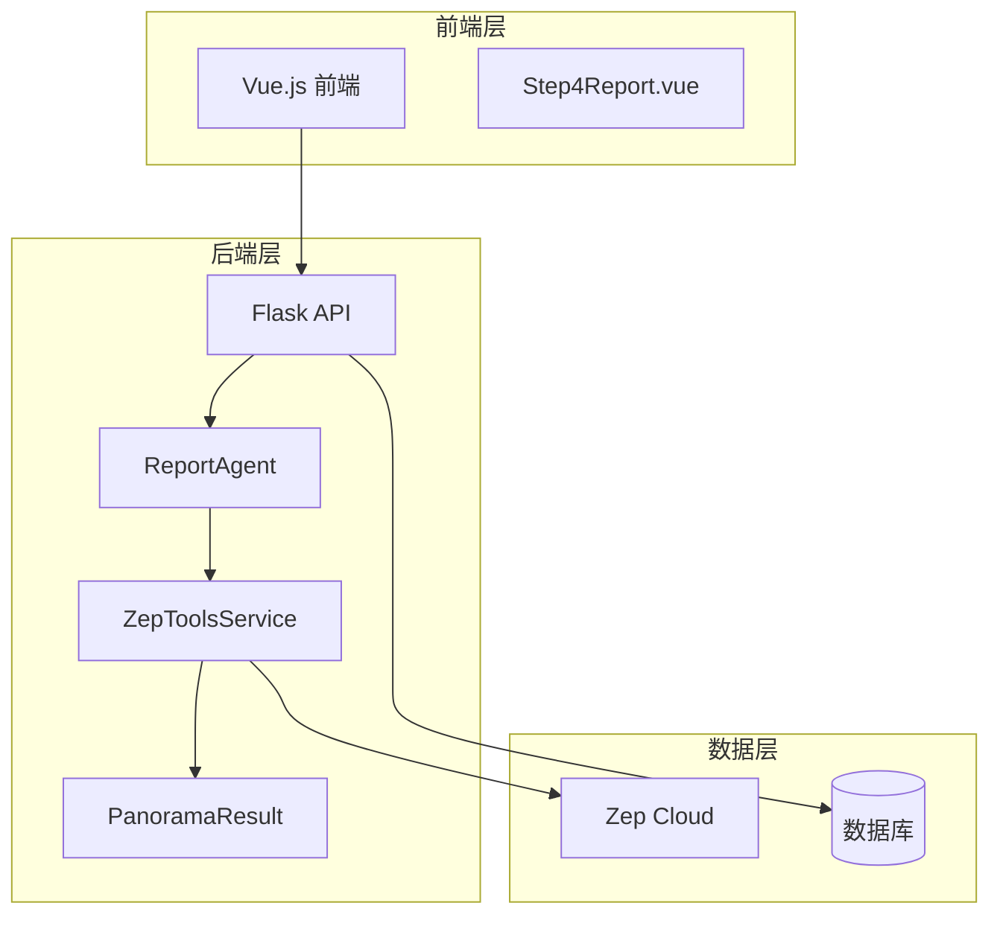
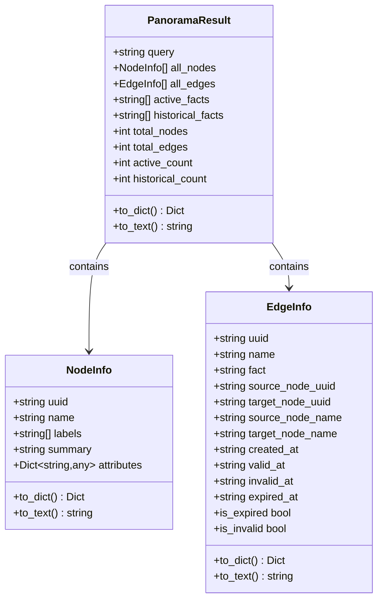
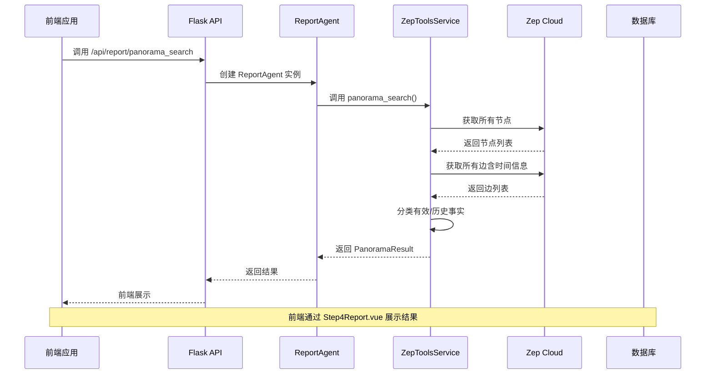
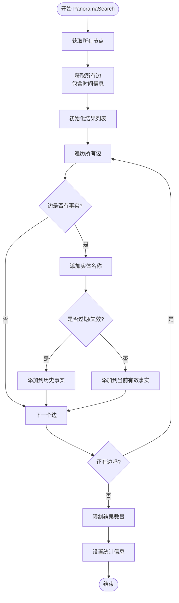
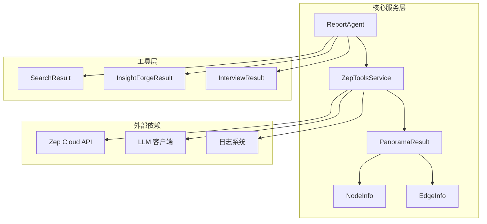

# Panorama广度搜索工具

<cite>
**本文档引用的文件**
- [zep_tools.py](file://backend/app/services/zep_tools.py)
- [report_agent.py](file://backend/app/services/report_agent.py)
- [Step4Report.vue](file://frontend/src/components/Step4Report.vue)
- [graph.py](file://backend/app/api/graph.py)
</cite>

## 目录
1. [简介](#简介)
2. [项目结构](#项目结构)
3. [核心组件](#核心组件)
4. [架构概览](#架构概览)
5. [详细组件分析](#详细组件分析)
6. [依赖关系分析](#依赖关系分析)
7. [性能考虑](#性能考虑)
8. [故障排除指南](#故障排除指南)
9. [结论](#结论)

## 简介

Panorama广度搜索工具是MiroFish项目中的核心检索组件，专门用于获取图谱的完整全貌信息。该工具的独特优势在于能够同时获取当前有效事实和历史过期事实，提供完整的演化过程视图，帮助用户深入了解事件的发展脉络和演变过程。

该工具在报告生成系统中扮演着关键角色，为深度分析和决策制定提供全面的数据支持。通过区分当前有效信息和历史信息，Panorama工具能够揭示信息的时效性和变化趋势，这对于模拟环境中的舆情分析和事件追踪尤为重要。

## 项目结构

MiroFish项目采用前后端分离架构，Panorama工具位于后端服务层，通过API接口与前端交互：



**图表来源**
- [zep_tools.py](file://backend/app/services/zep_tools.py#L377-L416)
- [report_agent.py](file://backend/app/services/report_agent.py#L469-L528)
- [Step4Report.vue](file://frontend/src/components/Step4Report.vue#L1-L50)

**章节来源**
- [zep_tools.py](file://backend/app/services/zep_tools.py#L1-L50)
- [report_agent.py](file://backend/app/services/report_agent.py#L1-L50)

## 核心组件

### PanoramaResult数据结构

PanoramaResult是Panorama广度搜索工具的核心数据结构，设计用于存储和组织搜索结果：



**图表来源**
- [zep_tools.py](file://backend/app/services/zep_tools.py#L212-L280)
- [zep_tools.py](file://backend/app/services/zep_tools.py#L55-L134)

### ZepToolsService核心功能

ZepToolsService是Panorama工具的主要实现类，提供了完整的图谱检索能力：

- **panorama_search**: 主要的广度搜索方法，获取图谱全貌
- **get_all_nodes**: 获取所有节点信息
- **get_all_edges**: 获取所有边信息（包含时间信息）
- **search_graph**: 图谱语义搜索
- **quick_search**: 快速搜索

**章节来源**
- [zep_tools.py](file://backend/app/services/zep_tools.py#L377-L416)
- [zep_tools.py](file://backend/app/services/zep_tools.py#L1125-L1216)

## 架构概览

Panorama工具在整个系统中的位置和交互关系如下：



**图表来源**
- [report_agent.py](file://backend/app/services/report_agent.py#L634-L743)
- [zep_tools.py](file://backend/app/services/zep_tools.py#L1125-L1216)

## 详细组件分析

### PanoramaSearch算法实现

PanoramaSearch方法实现了完整的广度搜索逻辑：



**图表来源**
- [zep_tools.py](file://backend/app/services/zep_tools.py#L1152-L1216)

### 数据分类逻辑

工具通过边的时间属性来区分有效和历史事实：

| 时间属性 | 有效状态 | 判断条件 |
|---------|---------|---------|
| expired_at | 过期 | expired_at != None |
| invalid_at | 失效 | invalid_at != None |
| valid_at | 有效 | valid_at != None 且 expired_at == None |

这种设计确保了工具能够准确识别信息的时效性，为用户提供完整的演化过程视图。

**章节来源**
- [zep_tools.py](file://backend/app/services/zep_tools.py#L1179-L1181)
- [zep_tools.py](file://backend/app/services/zep_tools.py#L125-L134)

### 前端展示组件

前端通过Step4Report.vue组件展示Panorama搜索结果：

```mermaid
graph LR
subgraph "PanoramaDisplay 组件"
Header[头部统计信息]
Tabs[标签页导航]
ActiveTab[当前有效记忆标签]
HistoricalTab[历史记忆标签]
EntitiesTab[涉及实体标签]
end
subgraph "数据绑定"
Stats[stats: {nodes, edges, activeFacts, historicalFacts}]
ActiveFacts[activeFacts: List~string~]
HistoricalFacts[historicalFacts: List~string~]
Entities[entities: List~Entity~]
end
Header --> Stats
Tabs --> ActiveTab
Tabs --> HistoricalTab
Tabs --> EntitiesTab
ActiveTab --> ActiveFacts
HistoricalTab --> HistoricalFacts
EntitiesTab --> Entities
```

**图表来源**
- [Step4Report.vue](file://frontend/src/components/Step4Report.vue#L1124-L1262)

**章节来源**
- [Step4Report.vue](file://frontend/src/components/Step4Report.vue#L1124-L1262)

## 依赖关系分析

### 组件耦合关系



**图表来源**
- [zep_tools.py](file://backend/app/services/zep_tools.py#L212-L280)
- [report_agent.py](file://backend/app/services/report_agent.py#L24-L30)

### 数据流分析

Panorama工具的数据流遵循以下模式：

1. **输入**: graph_id, query, include_expired, limit
2. **处理**: 获取节点和边 → 分类事实 → 生成统计信息
3. **输出**: PanoramaResult对象

**章节来源**
- [zep_tools.py](file://backend/app/services/zep_tools.py#L1125-L1216)

## 性能考虑

### 时间复杂度分析

- **获取所有节点**: O(N)，其中N为节点数量
- **获取所有边**: O(M)，其中M为边数量  
- **事实分类**: O(M)，遍历所有边
- **总体复杂度**: O(N + M)

### 内存使用优化

- 使用生成器模式处理大量数据
- 限制返回结果数量（默认50条）
- 分批处理大数据集

### 缓存策略

- API调用结果缓存
- 频繁访问的图谱数据缓存
- 结果格式化缓存

## 故障排除指南

### 常见问题及解决方案

| 问题类型 | 症状 | 可能原因 | 解决方案 |
|---------|------|---------|---------|
| API密钥错误 | 401 Unauthorized | ZEP_API_KEY未配置 | 检查环境变量配置 |
| 图谱不存在 | 404 Not Found | graph_id无效 | 验证图谱ID正确性 |
| 搜索超时 | Timeout | 网络连接问题 | 检查网络状态，重试请求 |
| 结果为空 | 返回空数组 | 查询条件过于严格 | 调整查询参数 |

### 调试建议

1. **启用详细日志**: 检查后端日志输出
2. **验证API连通性**: 测试Zep Cloud API连接
3. **检查数据完整性**: 验证图谱数据是否完整
4. **监控资源使用**: 监控内存和CPU使用情况

**章节来源**
- [zep_tools.py](file://backend/app/services/zep_tools.py#L418-L440)

## 结论

Panorama广度搜索工具通过其独特的数据结构设计和算法实现，为MiroFish项目提供了强大的图谱分析能力。其核心优势在于能够同时获取当前有效事实和历史过期事实，为用户提供完整的演化过程视图。

该工具在报告生成系统中发挥着关键作用，通过提供全面的数据支持，帮助用户深入分析模拟环境中的事件发展脉络。其模块化的设计使得工具易于维护和扩展，为未来的功能增强奠定了良好的基础。

通过合理的性能优化和错误处理机制，Panorama工具能够在大规模数据集上保持高效的响应速度，满足实际应用场景的需求。