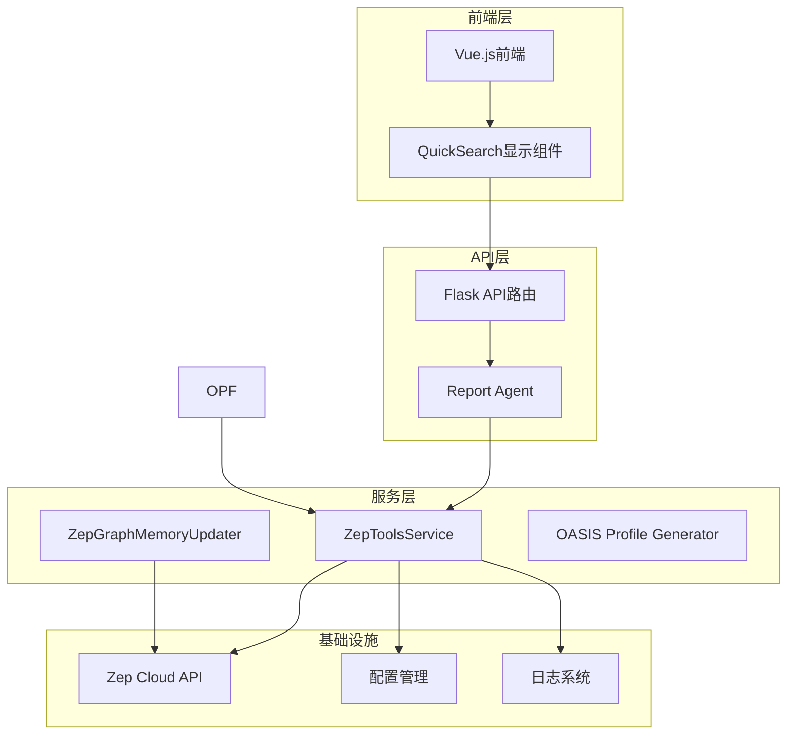
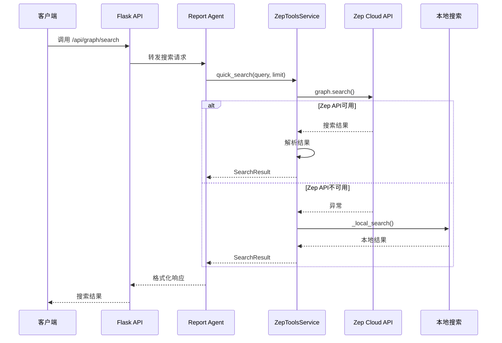
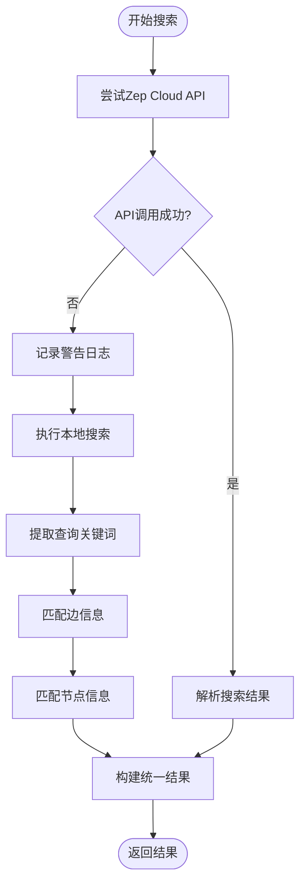
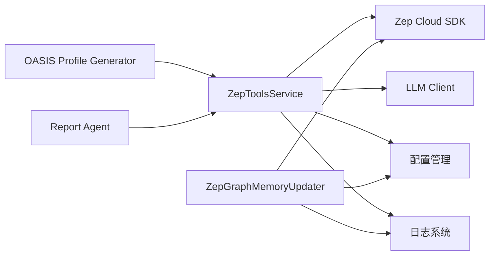

# QuickSearch快速搜索工具

<cite>
**本文档引用的文件**
- [zep_tools.py](file://backend/app/services/zep_tools.py)
- [zep_graph_memory_updater.py](file://backend/app/services/zep_graph_memory_updater.py)
- [oasis_profile_generator.py](file://backend/app/services/oasis_profile_generator.py)
- [graph.py](file://backend/app/api/graph.py)
- [report_agent.py](file://backend/app/services/report_agent.py)
- [logger.py](file://backend/app/utils/logger.py)
- [config.py](file://backend/app/config.py)
- [run.py](file://backend/run.py)
- [Step4Report.vue](file://frontend/src/components/Step4Report.vue)
</cite>

## 目录
1. [简介](#简介)
2. [项目结构](#项目结构)
3. [核心组件](#核心组件)
4. [架构概览](#架构概览)
5. [详细组件分析](#详细组件分析)
6. [依赖关系分析](#依赖关系分析)
7. [性能考虑](#性能考虑)
8. [故障排查指南](#故障排查指南)
9. [结论](#结论)
10. [附录](#附录)

## 简介
QuickSearch是MiroFish项目中的轻量级图谱搜索工具，专注于快速、稳定的图谱检索能力。该工具提供两种搜索模式：
- **语义搜索模式**：利用Zep Cloud的交叉编码器重排器，提供高质量的语义匹配
- **本地降级模式**：当云端API不可用时，自动切换到本地关键词匹配搜索

QuickSearch的核心定位是"轻量级、快速的图谱搜索解决方案"，特别适用于需要快速获取相关事实、关系和实体摘要的场景。

## 项目结构
QuickSearch工具位于后端服务层，与前端界面和API层协同工作：



**图表来源**
- [zep_tools.py](file://backend/app/services/zep_tools.py#L377-L440)
- [graph.py](file://backend/app/api/graph.py#L1-L618)
- [report_agent.py](file://backend/app/services/report_agent.py#L667-L695)

**章节来源**
- [zep_tools.py](file://backend/app/services/zep_tools.py#L1-L80)
- [graph.py](file://backend/app/api/graph.py#L1-L618)

## 核心组件
QuickSearch工具由以下核心组件构成：

### ZepToolsService
这是QuickSearch的主要服务类，提供了完整的搜索功能：

- **search_graph方法**：核心搜索方法，支持语义搜索和本地降级
- **quick_search方法**：简化的快速搜索接口
- **重试机制**：内置的指数退避重试逻辑
- **结果解析**：统一的搜索结果格式化

### 数据模型
QuickSearch使用标准化的数据结构来表示搜索结果：

- **SearchResult**：通用搜索结果容器
- **NodeInfo**：节点信息结构
- **EdgeInfo**：边信息结构

### 降级机制
当Zep Cloud API不可用时，QuickSearch会自动切换到本地搜索：
- 获取所有边和节点
- 在本地进行关键词匹配
- 计算匹配分数并排序
- 返回统一格式的结果

**章节来源**
- [zep_tools.py](file://backend/app/services/zep_tools.py#L25-L134)
- [zep_tools.py](file://backend/app/services/zep_tools.py#L441-L625)

## 架构概览
QuickSearch在整个系统中的位置和交互关系如下：



**图表来源**
- [report_agent.py](file://backend/app/services/report_agent.py#L676-L687)
- [zep_tools.py](file://backend/app/services/zep_tools.py#L441-L521)

## 详细组件分析

### search_graph方法实现细节

#### 方法签名和参数配置
```python
def search_graph(
    self, 
    graph_id: str, 
    query: str, 
    limit: int = 10,
    scope: str = "edges"
) -> SearchResult:
```

**参数说明**：
- **graph_id**：图谱唯一标识符，用于指定要搜索的目标图谱
- **query**：搜索查询字符串，支持自然语言查询
- **limit**：返回结果数量上限，默认10条
- **scope**：搜索范围，支持"edges"（边/事实）、"nodes"（节点/实体）

#### 核心调用流程
1. **日志记录**：记录搜索请求的基本信息
2. **Zep Cloud API调用**：使用交叉编码器重排器进行语义搜索
3. **结果解析**：提取边和节点信息，构建统一结果格式
4. **异常处理**：捕获API异常并触发本地降级
5. **本地搜索**：在本地进行关键词匹配搜索

#### 降级机制实现
当Zep Cloud API调用失败时，系统会自动切换到本地搜索：



**图表来源**
- [zep_tools.py](file://backend/app/services/zep_tools.py#L465-L521)
- [zep_tools.py](file://backend/app/services/zep_tools.py#L523-L625)

**章节来源**
- [zep_tools.py](file://backend/app/services/zep_tools.py#L441-L521)
- [zep_tools.py](file://backend/app/services/zep_tools.py#L523-L625)

### quick_search简化接口

QuickSearch提供了简化的快速搜索接口：

```python
def quick_search(
    self,
    graph_id: str,
    query: str,
    limit: int = 10
) -> SearchResult:
```

该方法直接调用`search_graph`方法，但固定scope为"edges"，专门用于获取相关的事实和关系。

**章节来源**
- [zep_tools.py](file://backend/app/services/zep_tools.py#L1218-L1251)

### 数据模型设计

#### SearchResult结构
```python
@dataclass
class SearchResult:
    facts: List[str]
    edges: List[Dict[str, Any]]
    nodes: List[Dict[str, Any]]
    query: str
    total_count: int
```

#### NodeInfo和EdgeInfo结构
这些结构提供了标准化的节点和边信息表示，便于前端展示和后续处理。

**章节来源**
- [zep_tools.py](file://backend/app/services/zep_tools.py#L25-L134)

## 依赖关系分析

### 外部依赖
QuickSearch主要依赖以下外部组件：



**图表来源**
- [zep_tools.py](file://backend/app/services/zep_tools.py#L16-L22)
- [zep_graph_memory_updater.py](file://backend/app/services/zep_graph_memory_updater.py#L15-L20)

### 内部依赖关系
QuickSearch与其他组件的依赖关系：

- **Report Agent**：通过工具接口调用QuickSearch
- **OASIS Profile Generator**：在实体分析中使用Zep搜索功能
- **API层**：提供RESTful接口供前端调用
- **配置管理**：读取ZEP_API_KEY等配置

**章节来源**
- [report_agent.py](file://backend/app/services/report_agent.py#L676-L687)
- [oasis_profile_generator.py](file://backend/app/services/oasis_profile_generator.py#L316-L411)

## 性能考虑

### 重试机制优化
QuickSearch实现了智能的重试机制：
- **指数退避**：每次重试间隔翻倍，最多重试3次
- **异常分类**：仅在API调用失败时触发重试
- **日志记录**：详细记录重试过程和最终结果

### 本地搜索优化
当降级到本地搜索时，系统采用了以下优化策略：
- **关键词提取**：简单的分词和关键词匹配
- **分数计算**：基于完全匹配和关键词匹配的加权评分
- **结果排序**：按匹配分数降序排列
- **限制返回数量**：避免返回过多结果影响性能

### 内存管理
- **流式处理**：避免一次性加载大量数据到内存
- **结果缓存**：对于频繁查询的结果进行适当的缓存
- **资源清理**：及时释放不再使用的资源

## 故障排查指南

### 常见问题诊断

#### Zep API连接问题
1. **检查API密钥配置**
   - 确认`.env`文件中设置了`ZEP_API_KEY`
   - 验证API密钥的有效性和权限

2. **网络连接检查**
   - 确认服务器可以访问Zep Cloud API
   - 检查防火墙和代理设置

3. **重试机制验证**
   - 查看日志中是否有重试记录
   - 确认重试间隔和次数配置正确

#### 本地搜索性能问题
1. **查询优化**
   - 简化查询语句，避免过于复杂的表达
   - 使用更精确的关键词

2. **数据量监控**
   - 监控图谱大小和查询响应时间
   - 考虑对大型图谱进行分区或索引优化

#### 结果质量评估
1. **语义搜索vs本地搜索**
   - 比较两种模式下的结果质量
   - 根据具体需求选择合适的模式

2. **结果格式验证**
   - 确认SearchResult结构完整
   - 检查数据类型和字段完整性

**章节来源**
- [config.py](file://backend/app/config.py#L35-L36)
- [logger.py](file://backend/app/utils/logger.py#L1-L127)

## 结论
QuickSearch快速搜索工具为MiroFish项目提供了可靠的图谱搜索能力。其核心优势包括：

1. **高可用性**：通过智能降级机制确保服务稳定性
2. **高性能**：优化的重试机制和本地搜索算法
3. **易用性**：简洁的API接口和标准化的数据格式
4. **可扩展性**：模块化的架构设计便于功能扩展

该工具特别适用于需要快速获取图谱相关信息的场景，如报告生成、实体分析和关系探索等。通过合理的配置和使用，可以显著提升系统的整体搜索体验和效率。

## 附录

### 使用示例和最佳实践

#### 基本使用模式
```python
# 简单的事实搜索
result = zep_tools.quick_search(
    graph_id="your-graph-id",
    query="人工智能技术发展",
    limit=15
)

# 详细的图谱搜索
result = zep_tools.search_graph(
    graph_id="your-graph-id",
    query="社交媒体对青少年的影响",
    limit=20,
    scope="edges"
)
```

#### 搜索范围选择建议
- **edges范围**：适合查找相关的事实、事件和关系
- **nodes范围**：适合查找特定的实体和节点信息
- **both范围**：适合全面的图谱探索

#### 性能优化建议
1. **合理设置limit参数**：避免返回过多结果影响性能
2. **优化查询语句**：使用简洁明确的查询表达
3. **监控重试情况**：定期检查API调用成功率
4. **缓存常用查询**：对频繁使用的查询结果进行缓存

#### 错误处理策略
1. **API降级**：当云端API不可用时自动切换到本地搜索
2. **异常记录**：详细记录搜索过程中的异常信息
3. **重试机制**：自动处理临时性的网络问题
4. **结果验证**：确保返回结果的完整性和一致性