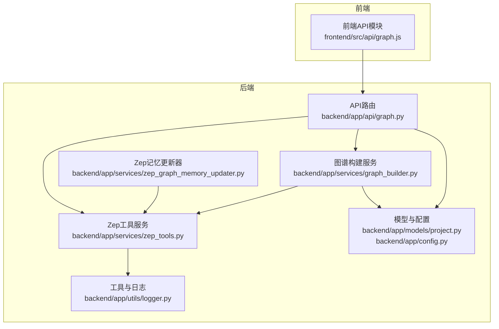
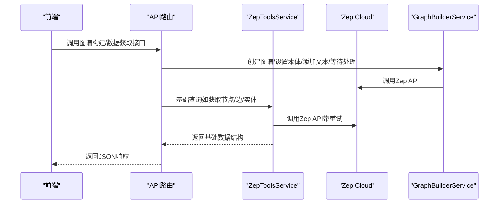
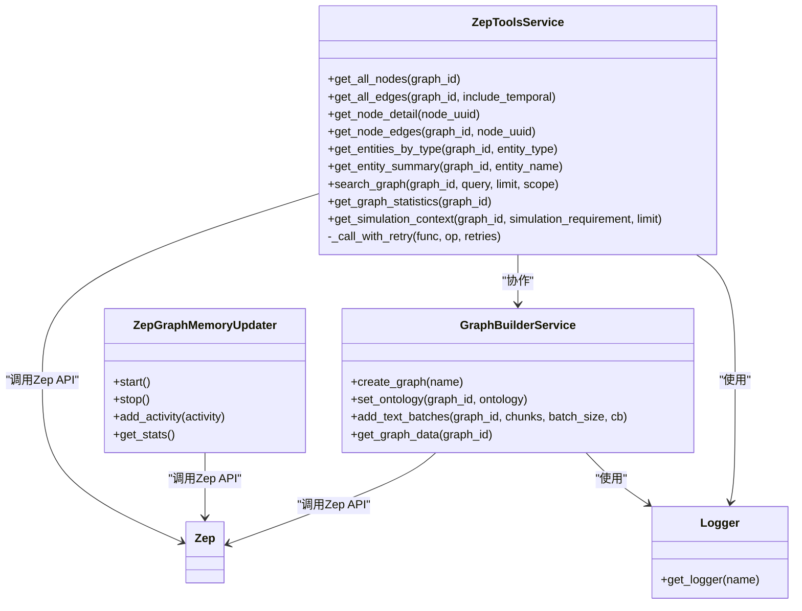

# 基础图谱操作工具

<cite>
**本文档引用的文件**
- [zep_tools.py](file://backend/app/services/zep_tools.py)
- [graph.py](file://backend/app/api/graph.py)
- [graph_builder.py](file://backend/app/services/graph_builder.py)
- [zep_graph_memory_updater.py](file://backend/app/services/zep_graph_memory_updater.py)
- [logger.py](file://backend/app/utils/logger.py)
- [config.py](file://backend/app/config.py)
- [project.py](file://backend/app/models/project.py)
- [graph.js](file://frontend/src/api/graph.js)
- [README.md](file://README.md)
</cite>

## 目录
1. [简介](#简介)
2. [项目结构](#项目结构)
3. [核心组件](#核心组件)
4. [架构总览](#架构总览)
5. [详细组件分析](#详细组件分析)
6. [依赖分析](#依赖分析)
7. [性能考量](#性能考量)
8. [故障排查指南](#故障排查指南)
9. [结论](#结论)
10. [附录](#附录)

## 简介
本文件面向“基础图谱操作工具”，聚焦于图谱查询与操作的核心能力，包括：
- get_all_nodes：获取图谱所有节点
- get_all_edges：获取图谱所有边（含时间信息）
- get_node_detail：获取单个节点详情
- get_node_edges：获取与某节点相关的所有边
- get_entities_by_type：按类型筛选实体
- get_entity_summary：获取实体关系摘要

同时，文档将深入解析数据结构设计（NodeInfo、EdgeInfo、SearchResult 等），并给出参数配置、返回值格式、使用场景、最佳实践、错误处理与性能优化建议。最后阐明这些基础工具如何支撑上层高级检索工具（如 InsightForge、PanoramaSearch、QuickSearch）与系统整体架构。

## 项目结构
后端采用分层架构：
- API 层：提供 REST 接口（如图谱构建、任务查询、数据获取）
- 服务层：封装业务逻辑（如图谱构建、Zep 工具、记忆更新）
- 工具与模型层：数据结构定义与日志、配置管理
- 前端：通过 API 模块与后端交互

图表来源
- [graph.py](file://backend/app/api/graph.py#L1-L618)
- [zep_tools.py](file://backend/app/services/zep_tools.py#L1-L1660)
- [graph_builder.py](file://backend/app/services/graph_builder.py#L1-L500)
- [zep_graph_memory_updater.py](file://backend/app/services/zep_graph_memory_updater.py#L1-L549)
- [project.py](file://backend/app/models/project.py#L1-L306)
- [config.py](file://backend/app/config.py#L1-L76)
- [logger.py](file://backend/app/utils/logger.py#L1-L127)
- [graph.js](file://frontend/src/api/graph.js#L1-L71)

章节来源
- [graph.py](file://backend/app/api/graph.py#L1-L618)
- [zep_tools.py](file://backend/app/services/zep_tools.py#L1-L1660)
- [graph_builder.py](file://backend/app/services/graph_builder.py#L1-L500)
- [zep_graph_memory_updater.py](file://backend/app/services/zep_graph_memory_updater.py#L1-L549)
- [project.py](file://backend/app/models/project.py#L1-L306)
- [config.py](file://backend/app/config.py#L1-L76)
- [logger.py](file://backend/app/utils/logger.py#L1-L127)
- [graph.js](file://frontend/src/api/graph.js#L1-L71)

## 核心组件
本节聚焦基础图谱操作工具与数据结构。

- ZepToolsService：封装基础查询与操作方法，提供重试机制、本地降级搜索、统计与上下文聚合等能力
- 数据结构：
  - SearchResult：统一的搜索结果容器（facts、edges、nodes、query、total_count）
  - NodeInfo：节点信息（uuid、name、labels、summary、attributes）
  - EdgeInfo：边信息（uuid、name、fact、source/target 节点标识，以及时间信息 created_at/valid_at/invalid_at/expired_at）

章节来源
- [zep_tools.py](file://backend/app/services/zep_tools.py#L25-L134)

## 架构总览
基础工具位于服务层，向上支撑高级检索工具，向下依赖 Zep API 与本地降级策略；API 层负责项目生命周期与图谱数据获取；图谱构建服务负责将文本分块、设置本体、批量添加并等待处理完成；记忆更新器负责将模拟 Agent 行为增量写入图谱。

图表来源
- [graph.py](file://backend/app/api/graph.py#L257-L525)
- [graph_builder.py](file://backend/app/services/graph_builder.py#L186-L494)
- [zep_tools.py](file://backend/app/services/zep_tools.py#L418-L440)

## 详细组件分析

### 基础查询与操作方法详解

- get_all_nodes(graph_id)
  - 功能：获取图谱所有节点
  - 参数：graph_id（图谱ID）
  - 返回：NodeInfo 列表
  - 使用场景：全量节点遍历、实体类型统计、实体详情预取
  - 性能要点：节点较多时建议分页或按标签过滤；注意网络往返开销
  - 错误处理：内部带重试；异常时返回空列表或抛出

- get_all_edges(graph_id, include_temporal=True)
  - 功能：获取图谱所有边，可选包含时间信息
  - 参数：graph_id、include_temporal（默认True）
  - 返回：EdgeInfo 列表（含 created_at/valid_at/invalid_at/expired_at）
  - 使用场景：关系链分析、时序关系可视化、过期/失效关系识别
  - 性能要点：边数量通常远大于节点，建议按需过滤或分批处理

- get_node_detail(node_uuid)
  - 功能：获取单个节点详情
  - 参数：node_uuid（节点UUID）
  - 返回：NodeInfo 或 None
  - 使用场景：节点详情展示、关系摘要生成
  - 错误处理：失败返回 None

- get_node_edges(graph_id, node_uuid)
  - 功能：获取与某节点相关的所有边
  - 参数：graph_id、node_uuid
  - 返回：EdgeInfo 列表
  - 使用场景：邻域关系探索、中心节点分析
  - 性能要点：当前实现为“全量边过滤”，适合中小规模图谱；大规模图谱建议使用 Zep 的节点边查询接口（如可用）

- get_entities_by_type(graph_id, entity_type)
  - 功能：按类型筛选实体
  - 参数：graph_id、entity_type（如 Student、PublicFigure）
  - 返回：NodeInfo 列表
  - 使用场景：类型统计、角色分析、专题检索
  - 注意：类型判断基于节点 labels，需确保本体定义正确

- get_entity_summary(graph_id, entity_name)
  - 功能：获取实体关系摘要（结合搜索与边信息）
  - 参数：graph_id、entity_name
  - 返回：字典（包含 entity_name、entity_info、related_facts、related_edges、total_relations）
  - 使用场景：实体概览、关系地图生成
  - 性能要点：涉及多次查询，建议缓存常用实体详情

章节来源
- [zep_tools.py](file://backend/app/services/zep_tools.py#L627-L834)

### 数据结构设计与用途

- SearchResult
  - 字段：facts、edges、nodes、query、total_count
  - 用途：统一搜索结果载体，便于上层工具（如 InsightForge、PanoramaSearch）复用
  - 方法：to_dict、to_text（供LLM理解）

- NodeInfo
  - 字段：uuid、name、labels、summary、attributes
  - 用途：节点信息标准化，便于序列化与跨模块传递
  - 方法：to_dict、to_text（用于摘要展示）

- EdgeInfo
  - 字段：uuid、name、fact、source_node_uuid/target_node_uuid、source/target_node_name、时间信息
  - 用途：边信息标准化，支持时序关系分析
  - 方法：to_dict、to_text（支持是否包含时间信息）、属性 is_expired/is_invalid

章节来源
- [zep_tools.py](file://backend/app/services/zep_tools.py#L25-L134)

### 检索与统计辅助方法

- search_graph(graph_id, query, limit, scope)
  - 功能：语义搜索（优先Zep Cloud API，失败时本地关键词匹配降级）
  - 参数：graph_id、query、limit、scope（edges/nodes/both）
  - 返回：SearchResult
  - 降级策略：本地匹配基于关键词与完全匹配分数排序

- get_graph_statistics(graph_id)
  - 功能：统计节点/边数量与类型分布
  - 返回：字典（graph_id、total_nodes、total_edges、entity_types、relation_types）

- get_simulation_context(graph_id, simulation_requirement, limit)
  - 功能：聚合与模拟需求相关的上下文（事实、统计、实体）
  - 返回：字典（simulation_requirement、related_facts、graph_statistics、entities、total_entities）

章节来源
- [zep_tools.py](file://backend/app/services/zep_tools.py#L441-L625)
- [zep_tools.py](file://backend/app/services/zep_tools.py#L836-L922)

### 与高级工具的关系

- InsightForge：基于子问题分解，多维检索、实体洞察、关系链构建，底层依赖基础查询与搜索
- PanoramaSearch：广度搜索，包含有效/历史事实分类，底层依赖 get_all_nodes/get_all_edges
- QuickSearch：轻量检索，直接调用 search_graph

章节来源
- [zep_tools.py](file://backend/app/services/zep_tools.py#L924-L1251)

### API 层与图谱数据获取

- 图谱构建接口：生成本体、创建图谱、设置本体、分批添加文本、等待处理、获取图谱数据
- 数据获取接口：获取图谱节点/边（含时间信息）、删除图谱
- 任务查询接口：异步任务状态查询

章节来源
- [graph.py](file://backend/app/api/graph.py#L119-L525)
- [graph.py](file://backend/app/api/graph.py#L562-L618)

### 图谱构建服务

- GraphBuilderService：封装图谱创建、本体设置、文本分块、批量添加、等待处理、统计信息与完整数据导出
- get_graph_data：返回 nodes/edges 详细字段（含时间戳、属性、episodes 等）

章节来源
- [graph_builder.py](file://backend/app/services/graph_builder.py#L38-L494)

### 记忆更新器（与基础工具协同）

- ZepGraphMemoryUpdater：按平台分组批量将 Agent 活动写入图谱，支持重试与统计
- 与基础工具协同：通过 get_all_nodes/get_all_edges 等方法进行图谱状态检查与可视化

章节来源
- [zep_graph_memory_updater.py](file://backend/app/services/zep_graph_memory_updater.py#L201-L471)

## 依赖分析

图表来源
- [zep_tools.py](file://backend/app/services/zep_tools.py#L377-L440)
- [graph_builder.py](file://backend/app/services/graph_builder.py#L38-L51)
- [zep_graph_memory_updater.py](file://backend/app/services/zep_graph_memory_updater.py#L231-L268)
- [logger.py](file://backend/app/utils/logger.py#L91-L104)

章节来源
- [zep_tools.py](file://backend/app/services/zep_tools.py#L377-L440)
- [graph_builder.py](file://backend/app/services/graph_builder.py#L38-L51)
- [zep_graph_memory_updater.py](file://backend/app/services/zep_graph_memory_updater.py#L231-L268)
- [logger.py](file://backend/app/utils/logger.py#L91-L104)

## 性能考量
- 重试与退避：基础查询统一使用带指数退避的重试机制，降低瞬时错误影响
- 本地降级：当 Zep Search API 不可用时，自动切换到本地关键词匹配，保障可用性
- 批量与分页：建议在大规模图谱场景中采用分批处理与缓存策略，减少网络往返
- 时间信息：EdgeInfo 支持时间字段，便于时序分析，但会增加数据体积与处理成本
- 任务异步：图谱构建采用异步任务与进度回调，避免阻塞主线程

章节来源
- [zep_tools.py](file://backend/app/services/zep_tools.py#L418-L440)
- [zep_tools.py](file://backend/app/services/zep_tools.py#L523-L625)
- [graph_builder.py](file://backend/app/services/graph_builder.py#L52-L93)

## 故障排查指南
- 配置校验：确认 LLM_API_KEY 与 ZEP_API_KEY 已正确配置
- API 可用性：检查 Zep Cloud 服务状态与配额
- 重试日志：查看日志中重试次数与延迟，定位网络波动
- 本地降级：当 Search API 失败时，确认本地关键词匹配逻辑是否正常
- 任务状态：通过任务查询接口确认图谱构建进度与错误信息

章节来源
- [config.py](file://backend/app/config.py#L66-L75)
- [graph.py](file://backend/app/api/graph.py#L529-L560)
- [logger.py](file://backend/app/utils/logger.py#L1-L127)

## 结论
基础图谱操作工具以标准化数据结构与稳健的重试/降级策略为核心，既满足日常查询需求，也为高级检索工具提供了坚实支撑。通过合理的批量与缓存策略、完善的错误处理与日志体系，能够在复杂场景中保持稳定与高效。

## 附录

### 使用场景与最佳实践
- 批量操作优化
  - 使用 get_all_nodes/get_all_edges 获取全量数据后在内存中过滤，避免多次远程调用
  - 对高频查询结果进行缓存（如实体详情）
- 错误处理
  - 基础查询已内置重试；上层调用应捕获异常并提示用户
  - 本地降级时注意性能差异，必要时调整 limit 与 scope
- 性能优化
  - 在大规模图谱中优先使用标签过滤与分页
  - 合理设置 include_temporal，仅在需要时启用时间信息
  - 使用异步任务处理图谱构建，避免阻塞

### 参数与返回值规范（示例）
- get_all_nodes(graph_id)
  - 输入：graph_id（字符串）
  - 输出：NodeInfo[]（包含 uuid/name/labels/summary/attributes）
- get_all_edges(graph_id, include_temporal=True)
  - 输入：graph_id（字符串）、include_temporal（布尔）
  - 输出：EdgeInfo[]（包含 uuid/name/fact/source/target 与时间字段）
- get_node_detail(node_uuid)
  - 输入：node_uuid（字符串）
  - 输出：NodeInfo 或 None
- get_node_edges(graph_id, node_uuid)
  - 输入：graph_id（字符串）、node_uuid（字符串）
  - 输出：EdgeInfo[]
- get_entities_by_type(graph_id, entity_type)
  - 输入：graph_id（字符串）、entity_type（字符串）
  - 输出：NodeInfo[]
- get_entity_summary(graph_id, entity_name)
  - 输入：graph_id（字符串）、entity_name（字符串）
  - 输出：字典（包含 entity_name、entity_info、related_facts、related_edges、total_relations）

章节来源
- [zep_tools.py](file://backend/app/services/zep_tools.py#L627-L834)