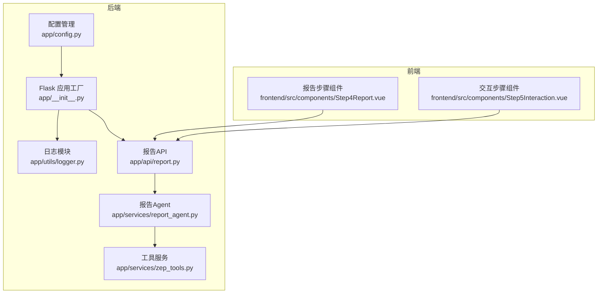
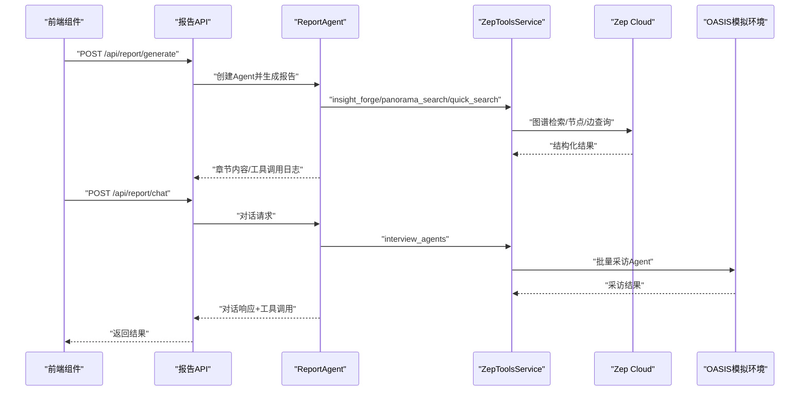
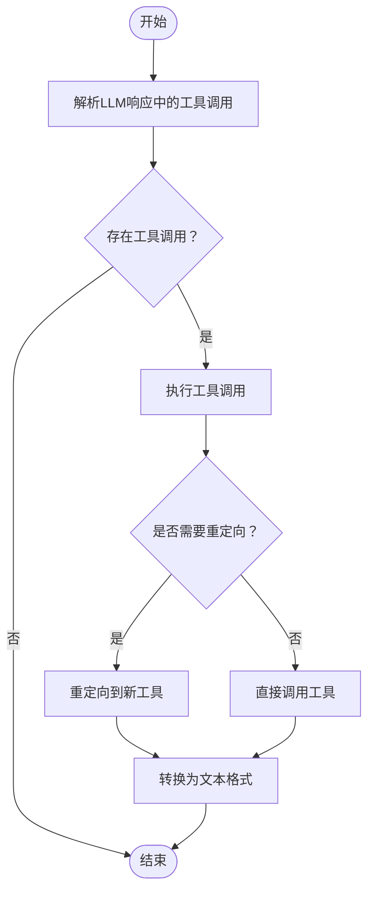
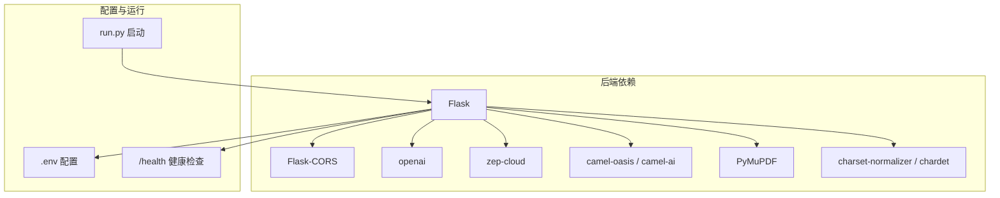

# 工具集成系统

<cite>
**本文档引用的文件**
- [README.md](file://README.md)
- [pyproject.toml](file://backend/pyproject.toml)
- [requirements.txt](file://backend/requirements.txt)
- [run.py](file://backend/run.py)
- [app/__init__.py](file://backend/app/__init__.py)
- [app/config.py](file://backend/app/config.py)
- [app/utils/logger.py](file://backend/app/utils/logger.py)
- [app/api/report.py](file://backend/app/api/report.py)
- [app/services/zep_tools.py](file://backend/app/services/zep_tools.py)
- [app/services/report_agent.py](file://backend/app/services/report_agent.py)
- [frontend/src/components/Step4Report.vue](file://frontend/src/components/Step4Report.vue)
- [frontend/src/components/Step5Interaction.vue](file://frontend/src/components/Step5Interaction.vue)
</cite>

## 目录
1. [简介](#简介)
2. [项目结构](#项目结构)
3. [核心组件](#核心组件)
4. [架构总览](#架构总览)
5. [详细组件分析](#详细组件分析)
6. [依赖关系分析](#依赖关系分析)
7. [性能考虑](#性能考虑)
8. [故障排查指南](#故障排查指南)
9. [结论](#结论)
10. [附录](#附录)

## 简介
本文件面向MiroFish的工具集成系统，聚焦四大核心工具：insight_forge深度洞察检索、panorama_search广度搜索、quick_search简单搜索与interview_agents深度采访。文档系统性阐述各工具的功能特性、参数配置、调用方式、返回结果格式、工具重定向机制与向后兼容策略，并提供最佳实践、性能优化建议与错误处理策略。同时给出工具使用示例、参数组合方案与输出格式说明，为开发者提供自定义工具扩展接口与集成指南。

## 项目结构
后端采用Flask应用工厂模式，统一注册蓝图；工具能力集中在ZepToolsService与ReportAgent中，API层负责对外暴露接口。前端通过组件展示工具配置与图标颜色，便于用户直观选择工具。

**图表来源**
- [app/__init__.py](file://backend/app/__init__.py#L19-L81)
- [app/config.py](file://backend/app/config.py#L20-L76)
- [app/utils/logger.py](file://backend/app/utils/logger.py#L30-L108)
- [app/api/report.py](file://backend/app/api/report.py#L24-L196)
- [app/services/zep_tools.py](file://backend/app/services/zep_tools.py#L377-L440)
- [app/services/report_agent.py](file://backend/app/services/report_agent.py#L469-L530)
- [frontend/src/components/Step4Report.vue](file://frontend/src/components/Step4Report.vue#L496-L540)
- [frontend/src/components/Step5Interaction.vue](file://frontend/src/components/Step5Interaction.vue#L173-L193)

**章节来源**
- [README.md](file://README.md#L81-L88)
- [app/__init__.py](file://backend/app/__init__.py#L66-L79)
- [app/api/report.py](file://backend/app/api/report.py#L24-L196)

## 核心组件
- ZepToolsService：封装图谱检索、节点/边读取、实体查询与采访等工具，提供统一的API调用与重试机制。
- ReportAgent：基于ReACT模式的报告生成Agent，内置工具定义与调用解析，支持对话中自主调用工具。
- Report API：提供报告生成、状态查询、章节获取、下载与对话等接口，贯穿工具调用链路。
- 配置与日志：集中管理LLM/Zep配置、日志输出与健康检查，保障工具调用稳定性。

**章节来源**
- [app/services/zep_tools.py](file://backend/app/services/zep_tools.py#L377-L440)
- [app/services/report_agent.py](file://backend/app/services/report_agent.py#L469-L530)
- [app/api/report.py](file://backend/app/api/report.py#L24-L196)
- [app/config.py](file://backend/app/config.py#L20-L76)
- [app/utils/logger.py](file://backend/app/utils/logger.py#L30-L108)

## 架构总览
工具调用链路从API进入，经ReportAgent解析与调度，最终由ZepToolsService访问Zep Cloud图谱与OASIS模拟环境，返回结构化结果供LLM理解与报告生成。

**图表来源**
- [app/api/report.py](file://backend/app/api/report.py#L24-L196)
- [app/services/report_agent.py](file://backend/app/services/report_agent.py#L634-L742)
- [app/services/zep_tools.py](file://backend/app/services/zep_tools.py#L441-L625)

## 详细组件分析

### insight_forge 深度洞察检索
- 功能特性
  - 自动分解复杂问题为子问题，多维度检索语义事实、实体洞察与关系链。
  - 输出包含统计信息、子问题列表、关键事实、核心实体与关系链。
- 参数配置
  - query：分析问题或话题。
  - report_context：报告章节上下文（可选，增强子问题生成）。
- 调用方式
  - ReportAgent内部调用：_execute_tool("insight_forge", ...)。
  - 返回文本格式，供LLM直接引用关键事实与实体摘要。
- 结果格式
  - InsightForgeResult.to_text()：结构化文本，包含统计、子问题、关键事实、实体与关系链。
- 使用示例
  - 分析“学生对宿舍甲醛事件的看法”：提供query与report_context，获得多维度归因与证据。
- 最佳实践
  - 在复杂章节中优先使用insight_forge，确保事实引用与上下文一致性。
  - 控制工具调用频率，避免LLM过度依赖单一工具。

**章节来源**
- [app/services/report_agent.py](file://backend/app/services/report_agent.py#L538-L560)
- [app/services/report_agent.py](file://backend/app/services/report_agent.py#L651-L661)
- [app/services/zep_tools.py](file://backend/app/services/zep_tools.py#L137-L210)

### panorama_search 广度搜索
- 功能特性
  - 获取图谱全貌，区分当前有效事实与历史/过期事实，帮助理解事件演变。
- 参数配置
  - query：搜索查询，用于相关性排序。
  - include_expired：是否包含过期/历史内容（默认True）。
- 调用方式
  - ReportAgent内部调用：_execute_tool("panorama_search", ...)。
- 结果格式
  - PanoramaResult.to_text()：包含统计、当前有效事实、历史/过期事实与涉及实体。
- 使用示例
  - “事件发展脉络”分析：开启include_expired以获取完整演变过程。
- 最佳实践
  - 在需要对比不同阶段或回顾历史时使用，注意控制输出长度以提升LLM处理效率。

**章节来源**
- [app/services/report_agent.py](file://backend/app/services/report_agent.py#L561-L582)
- [app/services/report_agent.py](file://backend/app/services/report_agent.py#L663-L674)
- [app/services/zep_tools.py](file://backend/app/services/zep_tools.py#L213-L279)

### quick_search 简单搜索
- 功能特性
  - 轻量级快速检索，适合直接信息查询与事实验证。
- 参数配置
  - query：搜索查询字符串。
  - limit：返回结果数量（可选，默认10）。
- 调用方式
  - ReportAgent内部调用：_execute_tool("quick_search", ...)。
- 结果格式
  - SearchResult.to_text()：包含查询与相关事实列表。
- 使用示例
  - “确认某具体事实是否存在”：设置较小limit，快速定位。
- 最佳实践
  - 与insight_forge配合使用，先快速验证再深入分析。

**章节来源**
- [app/services/report_agent.py](file://backend/app/services/report_agent.py#L583-L599)
- [app/services/report_agent.py](file://backend/app/services/report_agent.py#L676-L687)
- [app/services/zep_tools.py](file://backend/app/services/zep_tools.py#L25-L53)

### interview_agents 深度采访
- 功能特性
  - 调用OASIS模拟环境的真实Agent进行采访，获取多平台（Twitter/Reddit）多视角观点。
  - 自动选择与主题最相关的Agent，生成采访问题，整合关键引言与摘要。
- 参数配置
  - interview_topic：采访主题或需求描述。
  - max_agents：最多采访的Agent数量（可选，默认20）。
- 调用方式
  - ReportAgent内部调用：_execute_tool("interview_agents", ...)。
- 结果格式
  - InterviewResult.to_text()：包含选择理由、采访实录、关键引言与摘要。
- 使用示例
  - “了解不同角色对某一事件的看法”：提供interview_topic，自动筛选Agent并生成多视角报告。
- 最佳实践
  - 确保OASIS模拟环境正在运行；合理设置max_agents以平衡质量与成本。

**章节来源**
- [app/services/report_agent.py](file://backend/app/services/report_agent.py#L600-L631)
- [app/services/report_agent.py](file://backend/app/services/report_agent.py#L689-L701)
- [app/services/zep_tools.py](file://backend/app/services/zep_tools.py#L283-L374)

### 工具重定向与向后兼容
- 重定向机制
  - get_simulation_context → insight_forge：更强大的综合分析能力。
  - search_graph → quick_search：简化调用路径，保持一致行为。
- 向后兼容策略
  - 保留旧工具名但内部重定向至新工具，保证历史脚本与集成稳定。
- 前端展示
  - 工具配置包含显示名称、颜色与图标，便于用户识别与选择。

**章节来源**
- [app/services/report_agent.py](file://backend/app/services/report_agent.py#L703-L731)
- [frontend/src/components/Step4Report.vue](file://frontend/src/components/Step4Report.vue#L496-L540)
- [frontend/src/components/Step5Interaction.vue](file://frontend/src/components/Step5Interaction.vue#L173-L193)

### 工具调用流程与参数解析

**图表来源**
- [app/services/report_agent.py](file://backend/app/services/report_agent.py#L744-L783)
- [app/services/report_agent.py](file://backend/app/services/report_agent.py#L634-L742)

## 依赖关系分析
- 后端依赖
  - Flask、Flask-CORS：Web框架与跨域支持。
  - openai：统一LLM调用接口。
  - zep-cloud：图谱检索与节点/边查询。
  - camel-oasis/camel-ai：社交媒体模拟与Agent采访。
  - PyMuPDF、charset-normalizer、chardet：文件解析与编码检测。
- 配置与运行
  - 通过.env加载LLM与Zep密钥，支持Windows UTF-8输出。
  - 健康检查与CORS配置，便于前后端联调。

**图表来源**
- [pyproject.toml](file://backend/pyproject.toml#L11-L35)
- [requirements.txt](file://backend/requirements.txt#L8-L36)
- [run.py](file://backend/run.py#L25-L50)
- [app/__init__.py](file://backend/app/__init__.py#L42-L74)

**章节来源**
- [pyproject.toml](file://backend/pyproject.toml#L11-L35)
- [requirements.txt](file://backend/requirements.txt#L8-L36)
- [run.py](file://backend/run.py#L25-L50)
- [app/config.py](file://backend/app/config.py#L20-L76)

## 性能考虑
- 检索性能
  - insight_forge与panorama_search涉及大规模图谱查询，建议合理设置查询粒度与include_expired开关，避免不必要的历史数据拉取。
  - quick_search通过limit控制返回数量，降低LLM处理负担。
- 重试与降级
  - ZepToolsService提供MAX_RETRIES与指数退避重试，Search API失败时自动降级为本地关键词匹配。
- 日志与可观测性
  - ReportAgent生成agent_log.jsonl与console_log.txt，便于定位工具调用与响应细节。
- 并发与资源
  - 前端轮询章节与进度接口，避免一次性传输大量数据；后端使用异步任务生成报告，提升用户体验。

**章节来源**
- [app/services/zep_tools.py](file://backend/app/services/zep_tools.py#L418-L440)
- [app/services/zep_tools.py](file://backend/app/services/zep_tools.py#L518-L522)
- [app/services/report_agent.py](file://backend/app/services/report_agent.py#L35-L98)
- [app/api/report.py](file://backend/app/api/report.py#L564-L653)

## 故障排查指南
- 配置错误
  - LLM_API_KEY或ZEP_API_KEY缺失会导致启动失败或工具调用异常。检查.env与Config.validate()。
- 工具调用失败
  - 查看agent_log.jsonl中的tool_call与tool_result，确认参数与返回内容。
  - 若Zep Search API不可用，系统自动降级为本地搜索，检查网络与权限。
- 报告生成卡顿
  - 检查任务状态接口，确认progress与message；适当减少max_agents或limit。
- 前端无法看到工具
  - 确认工具配置（名称、颜色、图标）与后端工具定义一致。

**章节来源**
- [app/config.py](file://backend/app/config.py#L66-L75)
- [app/utils/logger.py](file://backend/app/utils/logger.py#L30-L108)
- [app/api/report.py](file://backend/app/api/report.py#L198-L267)
- [app/services/zep_tools.py](file://backend/app/services/zep_tools.py#L518-L522)

## 结论
MiroFish工具集成系统以ZepToolsService为核心，结合ReportAgent的ReACT模式，实现了从图谱检索到多视角采访的完整闭环。通过工具重定向与向后兼容策略，系统在保持稳定性的同时持续优化体验。建议开发者遵循参数规范、合理组合工具、利用日志与接口进行调试，并根据场景选择合适的工具以获得最佳性价比与准确性。

## 附录

### 工具调用最佳实践
- 复杂分析优先insight_forge，快速验证用quick_search，全貌概览用panorama_search。
- 在对话中调用interview_agents前，确保报告已完成且OASIS环境可用。
- 控制工具调用次数与参数规模，避免LLM上下文溢出。

### 参数组合方案示例
- insight_forge
  - query: "事件影响因素分析"
  - report_context: "章节背景与目标读者"
- panorama_search
  - query: "事件关键词"
  - include_expired: true
- quick_search
  - query: "具体事实核查"
  - limit: 5
- interview_agents
  - interview_topic: "不同角色对事件的看法"
  - max_agents: 10

### 输出格式说明
- 文本格式（to_text）：用于LLM直接引用，包含统计、事实、实体与关系链。
- JSON格式：用于结构化数据交换，包含节点、边与实体详情。

### 自定义工具扩展指南
- 新增工具
  - 在ZepToolsService中新增方法，封装Zep Cloud/OASIS调用。
  - 在ReportAgent.tools中注册工具描述与参数。
  - 在_execute_tool中添加分支处理与重定向逻辑。
- 集成测试
  - 通过API接口调用新工具，观察agent_log.jsonl与响应内容。
  - 确保to_text/to_dict输出符合预期。

**章节来源**
- [app/services/zep_tools.py](file://backend/app/services/zep_tools.py#L377-L440)
- [app/services/report_agent.py](file://backend/app/services/report_agent.py#L530-L632)
- [app/api/report.py](file://backend/app/api/report.py#L24-L196)