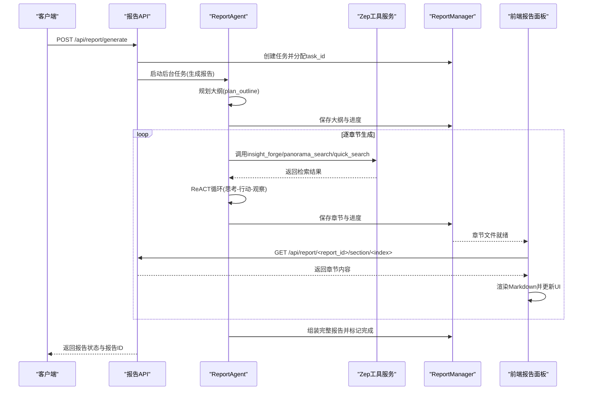
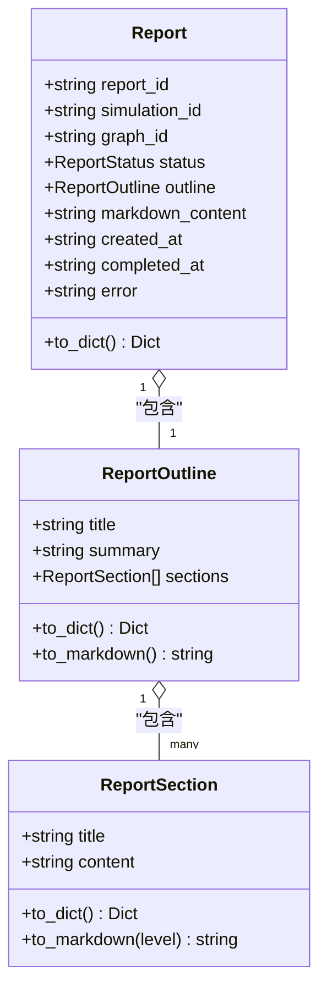
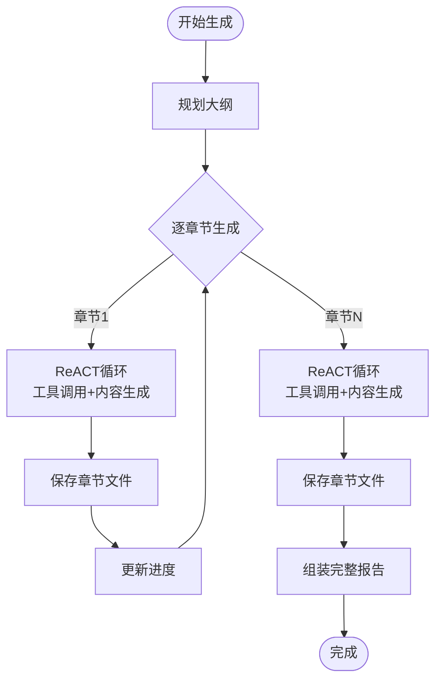
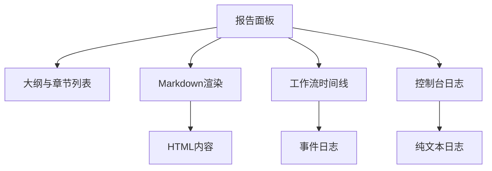
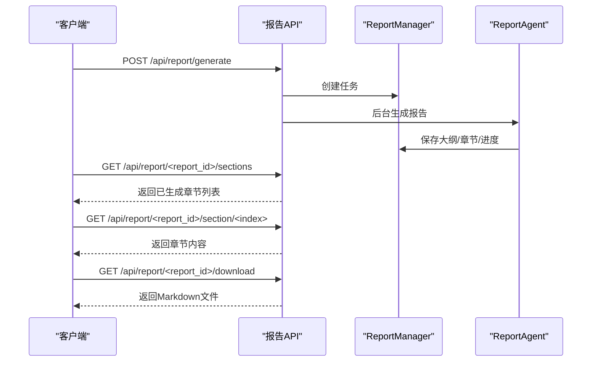
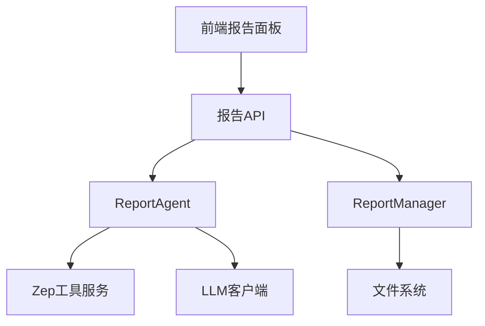

# 报告格式化输出

<cite>
**本文档引用的文件**
- [backend/app/api/report.py](file://backend/app/api/report.py)
- [backend/app/services/report_agent.py](file://backend/app/services/report_agent.py)
- [frontend/src/components/Step4Report.vue](file://frontend/src/components/Step4Report.vue)
- [frontend/src/views/ReportView.vue](file://frontend/src/views/ReportView.vue)
- [backend/app/models/project.py](file://backend/app/models/project.py)
</cite>

## 目录
1. [简介](#简介)
2. [项目结构](#项目结构)
3. [核心组件](#核心组件)
4. [架构概览](#架构概览)
5. [详细组件分析](#详细组件分析)
6. [依赖分析](#依赖分析)
7. [性能考虑](#性能考虑)
8. [故障排查指南](#故障排查指南)
9. [结论](#结论)
10. [附录](#附录)

## 简介
本文件面向MiroFish的报告格式化输出系统，系统以“未来预测报告”为核心目标，围绕报告内容的Markdown格式化、章节结构生成与样式渲染机制展开。报告生成采用ReACT（推理-行动）范式，结合多种检索工具从模拟图谱中抽取证据，形成结构化的章节内容；前端通过分章节流式渲染与工作流时间线展示，实现高质量的可视化与交互体验。

## 项目结构
后端采用Flask蓝图提供REST接口，核心业务逻辑集中在ReportAgent服务中；前端通过Vue组件负责报告面板、章节列表、工作流时间线与控制台日志展示。项目数据模型中，Project承载项目上下文，ReportAgent依赖其提供的模拟需求与图谱ID。

```mermaid
graph TB
subgraph "后端"
API["报告API<br/>/api/report"] --> Agent["ReportAgent<br/>报告生成与对话"]
Agent --> Tools["Zep工具服务<br/>检索/采访"]
Agent --> Manager["ReportManager<br/>持久化与进度"]
API --> Models["Project模型<br/>项目上下文"]
end
subgraph "前端"
View["ReportView<br/>视图容器"] --> Panel["Step4Report<br/>报告面板"]
Panel --> Timeline["工作流时间线"]
Panel --> Sections["章节列表与内容"]
Panel --> Console["控制台日志"]
end
API <- --> View
Agent <- --> Panel
```

图表来源
- [backend/app/api/report.py](file://backend/app/api/report.py#L24-L196)
- [backend/app/services/report_agent.py](file://backend/app/services/report_agent.py#L469-L529)
- [frontend/src/views/ReportView.vue](file://frontend/src/views/ReportView.vue#L50-L59)
- [frontend/src/components/Step4Report.vue](file://frontend/src/components/Step4Report.vue#L1-L100)

章节来源
- [backend/app/api/report.py](file://backend/app/api/report.py#L24-L196)
- [backend/app/services/report_agent.py](file://backend/app/services/report_agent.py#L469-L529)
- [frontend/src/views/ReportView.vue](file://frontend/src/views/ReportView.vue#L50-L59)
- [frontend/src/components/Step4Report.vue](file://frontend/src/components/Step4Report.vue#L1-L100)

## 核心组件
- 报告API层：提供报告生成、状态查询、章节获取、下载与对话接口，支持异步任务与进度回调。
- ReportAgent：实现ReACT范式的报告生成与对话能力，内置大纲规划、章节生成、工具调用与日志记录。
- ReportManager：负责报告元数据、大纲、章节、完整报告与进度的持久化与组装。
- 前端报告面板：分章节渲染Markdown内容，展示工作流时间线与控制台日志，支持章节折叠与动态刷新。
- 项目模型：提供模拟需求与图谱ID等上下文，驱动报告生成。

章节来源
- [backend/app/api/report.py](file://backend/app/api/report.py#L24-L196)
- [backend/app/services/report_agent.py](file://backend/app/services/report_agent.py#L469-L529)
- [frontend/src/components/Step4Report.vue](file://frontend/src/components/Step4Report.vue#L1-L100)
- [backend/app/models/project.py](file://backend/app/models/project.py#L26-L99)

## 架构概览
下图展示了从API请求到报告生成、章节分发与前端渲染的完整流程。



图表来源
- [backend/app/api/report.py](file://backend/app/api/report.py#L24-L196)
- [backend/app/services/report_agent.py](file://backend/app/services/report_agent.py#L1358-L1591)
- [frontend/src/components/Step4Report.vue](file://frontend/src/components/Step4Report.vue#L656-L697)

## 详细组件分析

### 数据模型与转换
- ReportOutline：包含标题、摘要与章节列表，提供字典与Markdown转换方法，用于大纲持久化与全文Markdown拼接。
- ReportSection：包含章节标题与正文，提供字典与Markdown转换方法，用于章节内容的格式化输出。
- Report：封装报告ID、模拟ID、图谱ID、状态、大纲、Markdown全文与时间戳，提供字典序列化。



图表来源
- [backend/app/services/report_agent.py](file://backend/app/services/report_agent.py#L398-L467)

章节来源
- [backend/app/services/report_agent.py](file://backend/app/services/report_agent.py#L398-L467)

### 报告生成流程与质量控制
- 大纲规划：基于模拟需求与图谱上下文，生成2-5个章节的大纲，确保内容聚焦预测发现。
- ReACT生成：每章节通过“思考-行动-观察”循环，限定工具调用次数与引用格式，保证内容来自模拟证据且结构规范。
- 进度与日志：结构化日志记录每个动作与工具调用，支持前端增量获取；控制台日志记录INFO/WARNING等纯文本输出。
- 完整性检查：章节生成完成后立即保存，前端可轮询获取已生成章节；最终组装完整报告并标记完成。



图表来源
- [backend/app/services/report_agent.py](file://backend/app/services/report_agent.py#L1456-L1564)

章节来源
- [backend/app/services/report_agent.py](file://backend/app/services/report_agent.py#L795-L928)
- [backend/app/services/report_agent.py](file://backend/app/services/report_agent.py#L929-L1357)
- [backend/app/services/report_agent.py](file://backend/app/services/report_agent.py#L1358-L1591)

### 前端渲染与样式
- 报告面板：左侧展示报告大纲与章节列表，右侧展示工作流时间线与控制台日志；支持章节折叠与动态刷新。
- 章节渲染：使用Markdown渲染引擎将章节内容转换为HTML，支持引用、列表与粗体等格式。
- 时间线与日志：展示工具调用、LLM响应与章节完成等关键事件，支持展开/折叠与参数查看。
- 响应式布局：支持图谱视图、双栏视图与工作台视图的切换。



图表来源
- [frontend/src/components/Step4Report.vue](file://frontend/src/components/Step4Report.vue#L1-L100)
- [frontend/src/components/Step4Report.vue](file://frontend/src/components/Step4Report.vue#L142-L374)

章节来源
- [frontend/src/components/Step4Report.vue](file://frontend/src/components/Step4Report.vue#L1-L100)
- [frontend/src/components/Step4Report.vue](file://frontend/src/components/Step4Report.vue#L142-L374)
- [frontend/src/views/ReportView.vue](file://frontend/src/views/ReportView.vue#L50-L59)

### API与接口流程
- 报告生成：POST /api/report/generate，返回task_id与report_id；通过GET /api/report/generate/status轮询进度。
- 章节获取：GET /api/report/<report_id>/sections与GET /api/report/<report_id>/section/<index>，支持前端增量渲染。
- 报告下载：GET /api/report/<report_id>/download，返回Markdown文件。
- 对话接口：POST /api/report/chat，支持在对话中调用工具检索。



图表来源
- [backend/app/api/report.py](file://backend/app/api/report.py#L24-L196)
- [backend/app/api/report.py](file://backend/app/api/report.py#L605-L697)
- [backend/app/api/report.py](file://backend/app/api/report.py#L393-L437)

章节来源
- [backend/app/api/report.py](file://backend/app/api/report.py#L24-L196)
- [backend/app/api/report.py](file://backend/app/api/report.py#L605-L697)
- [backend/app/api/report.py](file://backend/app/api/report.py#L393-L437)

## 依赖分析
- 后端依赖关系：API层依赖ReportAgent与ReportManager；ReportAgent依赖Zep工具服务与LLM客户端；前端依赖后端API与Markdown渲染。
- 前后端耦合点：通过分章节文件与进度文件实现解耦，前端轮询获取已生成内容，降低一次性传输压力。
- 外部集成：工具服务与模拟环境对接，确保报告内容来自真实模拟数据。



图表来源
- [backend/app/api/report.py](file://backend/app/api/report.py#L11-L18)
- [backend/app/services/report_agent.py](file://backend/app/services/report_agent.py#L24-L32)
- [frontend/src/components/Step4Report.vue](file://frontend/src/components/Step4Report.vue#L395-L400)

章节来源
- [backend/app/api/report.py](file://backend/app/api/report.py#L11-L18)
- [backend/app/services/report_agent.py](file://backend/app/services/report_agent.py#L24-L32)
- [frontend/src/components/Step4Report.vue](file://frontend/src/components/Step4Report.vue#L395-L400)

## 性能考虑
- 分章节输出：章节生成完成后立即保存，前端可边生成边渲染，减少等待时间。
- 进度回调：后端通过回调函数更新任务进度，前端轮询频率可控，避免频繁请求。
- 内容截断：对话与报告内容在必要时进行截断，防止上下文过长影响性能。
- 工具调用限制：每章节工具调用次数与迭代轮数限制，避免过度检索导致延迟。

## 故障排查指南
- 报告生成失败：检查后端日志与控制台日志，确认工具调用是否异常；查看ReportManager保存的错误信息。
- 章节缺失：确认ReportManager是否正确保存章节文件；前端轮询接口是否正确解析返回。
- 下载失败：确认报告是否存在以及Markdown文件路径是否正确；若文件不存在，后端会生成临时文件供下载。
- 对话异常：检查对话历史长度与工具调用次数限制，避免超过最大迭代轮数。

章节来源
- [backend/app/services/report_agent.py](file://backend/app/services/report_agent.py#L1566-L1590)
- [backend/app/api/report.py](file://backend/app/api/report.py#L400-L437)

## 结论
MiroFish的报告格式化输出系统通过ReACT范式与多维检索工具，实现了高质量、可追溯的未来预测报告生成。后端以分章节流式输出与结构化日志为基础，前端以工作流时间线与Markdown渲染为核心，提供了良好的可视化与交互体验。系统具备完善的质量控制与进度跟踪机制，支持多格式导出与对话增强，为后续扩展与定制提供了清晰的接口与架构基础。

## 附录

### 报告内容质量控制清单
- 工具调用：每章节至少3次、至多5次工具调用，混合使用不同工具。
- 引用规范：使用引用格式展示模拟证据，独立成段，前后空行。
- 格式规范：章节内禁止使用标题语法，使用粗体与列表组织内容。
- 连贯性：避免重复已完成章节内容，保持逻辑连贯。

章节来源
- [backend/app/services/report_agent.py](file://backend/app/services/report_agent.py#L1014-L1110)

### 报告输出与模板配置
- Markdown导出：支持完整报告与单章节下载，文件命名规范统一。
- 前端渲染：Markdown内容通过渲染引擎转换为HTML，支持引用、列表与粗体等格式。
- 自定义样式：前端组件提供CSS样式与主题色，可根据品牌需求调整。

章节来源
- [backend/app/api/report.py](file://backend/app/api/report.py#L393-L437)
- [frontend/src/components/Step4Report.vue](file://frontend/src/components/Step4Report.vue#L1-L100)

### 扩展接口与自定义输出格式
- 工具扩展：可在ReportAgent中新增工具定义，遵循参数规范与返回格式。
- 输出格式：可通过ReportManager扩展新的输出格式（如PDF、HTML），并在API层提供相应接口。
- 对话增强：在chat接口中增加工具调用与结果整合逻辑，提升问答质量。

章节来源
- [backend/app/services/report_agent.py](file://backend/app/services/report_agent.py#L530-L633)
- [backend/app/services/report_agent.py](file://backend/app/services/report_agent.py#L1592-L1728)