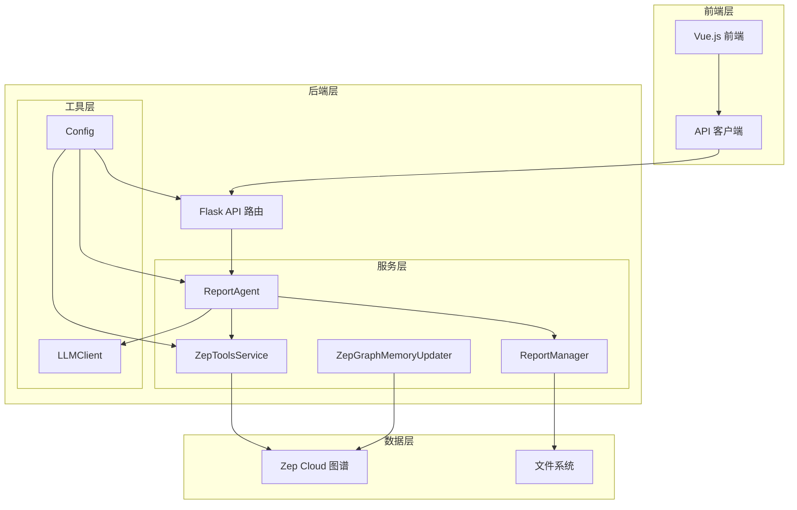
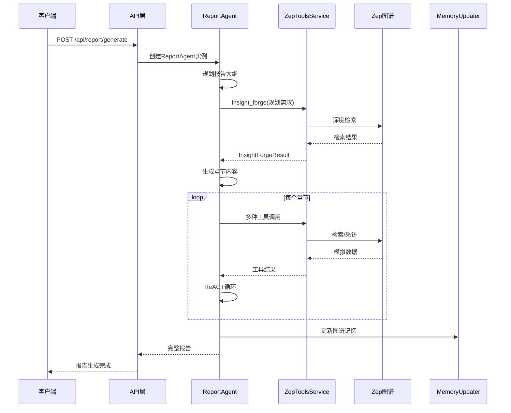
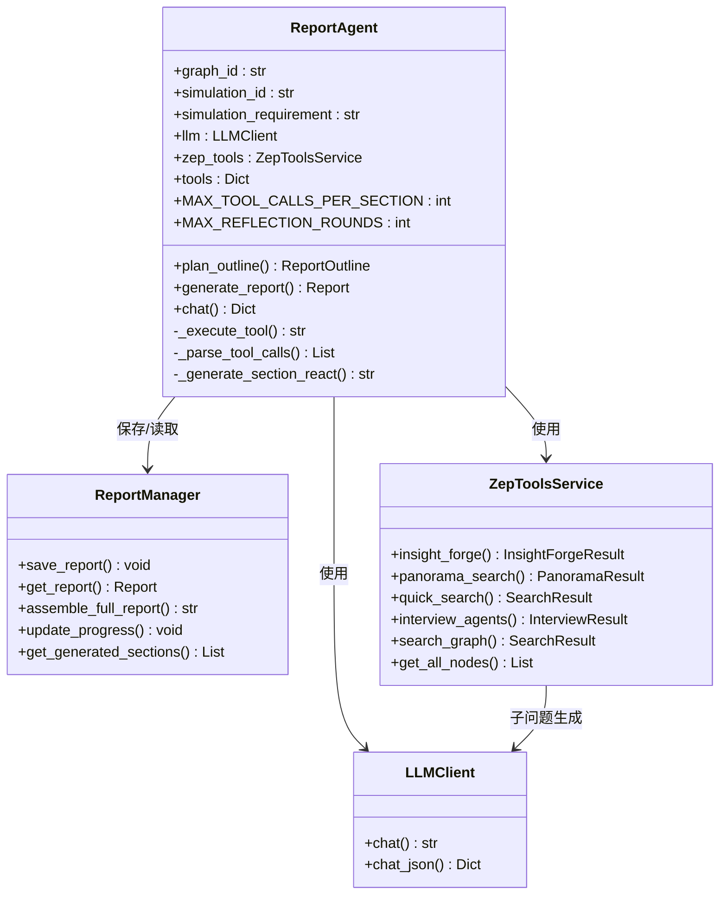
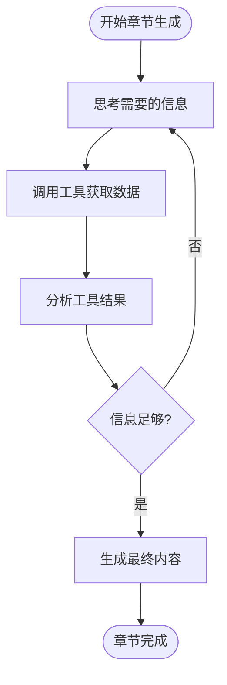
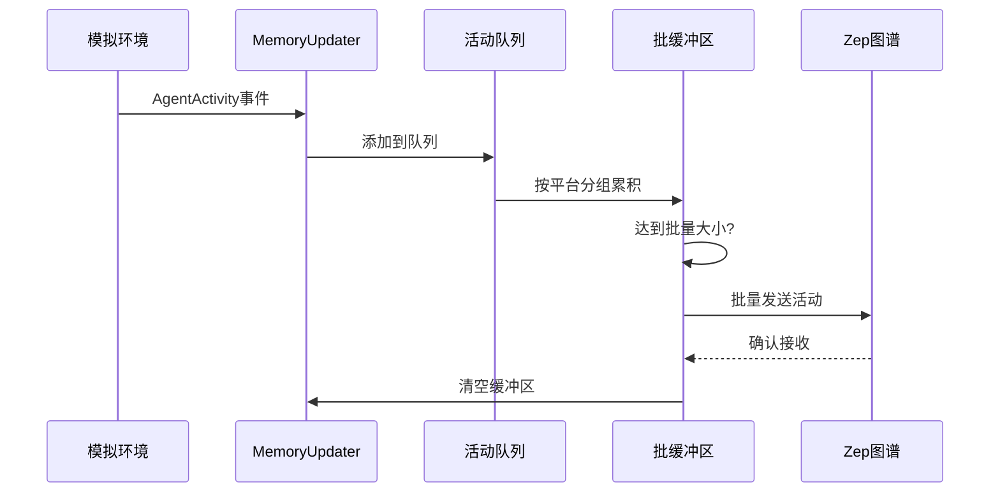
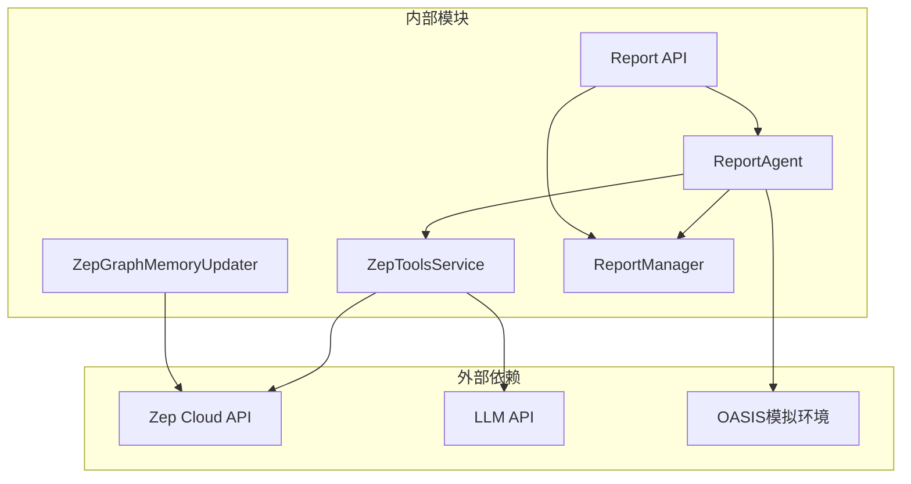

# 报告生成系统

<cite>
**本文档引用的文件**
- [report_agent.py](file://backend/app/services/report_agent.py)
- [zep_tools.py](file://backend/app/services/zep_tools.py)
- [zep_graph_memory_updater.py](file://backend/app/services/zep_graph_memory_updater.py)
- [report.py](file://backend/app/api/report.py)
- [project.py](file://backend/app/models/project.py)
- [text_processor.py](file://backend/app/services/text_processor.py)
- [llm_client.py](file://backend/app/utils/llm_client.py)
- [config.py](file://backend/app/config.py)
- [report.js](file://frontend/src/api/report.js)
- [README.md](file://README.md)
</cite>

## 目录
1. [简介](#简介)
2. [项目结构](#项目结构)
3. [核心组件](#核心组件)
4. [架构概览](#架构概览)
5. [详细组件分析](#详细组件分析)
6. [依赖关系分析](#依赖关系分析)
7. [性能考虑](#性能考虑)
8. [故障排除指南](#故障排除指南)
9. [结论](#结论)
10. [附录](#附录)

## 简介

MiroFish报告生成系统是一个基于ReACT模式的智能报告生成引擎，专门用于从模拟环境中提取预测信息并生成高质量的分析报告。该系统采用先进的多智能体技术，通过Zep图谱集成和深度交互采访功能，为用户提供全面的未来预测分析。

系统的核心特色包括：
- **ReACT推理-行动-反思循环**：通过思考、行动、观察的迭代模式生成深度分析
- **多维工具集集成**：包含深度洞察检索、广度搜索、快速检索和真实Agent采访功能
- **图谱记忆更新机制**：实时将模拟活动动态更新到Zep图谱中
- **个性化定制选项**：支持多种报告模板和格式化配置
- **内容质量控制**：严格的引用规范和证据溯源机制

## 项目结构



**图表来源**
- [report_agent.py](file://backend/app/services/report_agent.py#L469-L530)
- [zep_tools.py](file://backend/app/services/zep_tools.py#L377-L416)
- [zep_graph_memory_updater.py](file://backend/app/services/zep_graph_memory_updater.py#L201-L268)
- [report.py](file://backend/app/api/report.py#L24-L48)

**章节来源**
- [report_agent.py](file://backend/app/services/report_agent.py#L1-L50)
- [zep_tools.py](file://backend/app/services/zep_tools.py#L1-L30)
- [zep_graph_memory_updater.py](file://backend/app/services/zep_graph_memory_updater.py#L1-L30)
- [report.py](file://backend/app/api/report.py#L1-L25)

## 核心组件

### ReportAgent - 报告生成核心引擎

ReportAgent是整个报告生成系统的核心组件，采用ReACT（Reasoning + Acting）模式实现智能报告生成。其主要功能包括：

- **大纲规划**：基于模拟需求分析生成报告结构
- **章节生成**：使用ReACT循环逐章节生成内容
- **工具集成**：整合多种检索工具获取模拟数据
- **质量控制**：严格的引用规范和内容审核

### ZepToolsService - 智能检索工具集

ZepToolsService提供四个核心检索工具：
- **InsightForge**：深度洞察检索，自动分解问题并多维度检索
- **PanoramaSearch**：广度搜索，获取事件全貌和演变过程
- **QuickSearch**：快速检索，适用于简单直接的信息查询
- **InterviewAgents**：深度采访，获取真实Agent观点

### ZepGraphMemoryUpdater - 图谱记忆更新器

实时监控模拟活动并将Agent行为动态更新到Zep图谱中，支持批量发送和重试机制。

### ReportManager - 报告管理系统

负责报告的持久化存储、进度跟踪和文件管理，支持分章节输出和完整报告组装。

**章节来源**
- [report_agent.py](file://backend/app/services/report_agent.py#L469-L530)
- [zep_tools.py](file://backend/app/services/zep_tools.py#L377-L416)
- [zep_graph_memory_updater.py](file://backend/app/services/zep_graph_memory_updater.py#L201-L268)
- [report_agent.py](file://backend/app/services/report_agent.py#L1731-L1747)

## 架构概览



**图表来源**
- [report.py](file://backend/app/api/report.py#L24-L195)
- [report_agent.py](file://backend/app/services/report_agent.py#L1358-L1590)
- [zep_tools.py](file://backend/app/services/zep_tools.py#L926-L1071)

## 详细组件分析

### ReportAgent 设计架构



**图表来源**
- [report_agent.py](file://backend/app/services/report_agent.py#L469-L530)
- [report_agent.py](file://backend/app/services/report_agent.py#L1731-L1747)
- [zep_tools.py](file://backend/app/services/zep_tools.py#L377-L416)
- [llm_client.py](file://backend/app/utils/llm_client.py#L13-L33)

#### ReACT推理循环实现

ReportAgent采用严格的ReACT模式实现智能推理：

1. **Thought（思考）**：分析需要什么信息，规划检索策略
2. **Action（行动）**：调用工具获取模拟数据
3. **Observation（观察）**：分析工具返回结果
4. **Reflection（反思）**：检查内容完整性和准确性



**图表来源**
- [report_agent.py](file://backend/app/services/report_agent.py#L929-L1356)

**章节来源**
- [report_agent.py](file://backend/app/services/report_agent.py#L929-L1356)
- [report_agent.py](file://backend/app/services/report_agent.py#L1358-L1590)

### ZepToolsService 工具集集成

ZepToolsService提供四种核心检索工具，每种工具都有特定的使用场景和优势：

#### InsightForge - 深度洞察检索

InsightForge是最强大的检索工具，具有以下特点：
- 自动分解复杂问题为多个子问题
- 多维度检索模拟数据
- 整合语义搜索、实体分析、关系链追踪
- 生成深度洞察报告

#### PanoramaSearch - 广度搜索

PanoramaSearch用于获取事件全貌：
- 获取所有相关节点和关系
- 区分当前有效事实和历史/过期事实
- 帮助了解事件演变过程

#### QuickSearch - 快速检索

QuickSearch适用于简单直接的信息查询：
- 轻量级的快速检索
- 适合验证具体信息点
- 返回最相关的事实列表

#### InterviewAgents - 深度采访

InterviewAgents调用真实的OASIS模拟环境采访Agent：
- 自动读取人设文件了解Agent
- 智能选择相关Agent进行采访
- 生成采访问题并获取真实回答
- 整合多平台采访结果

**章节来源**
- [zep_tools.py](file://backend/app/services/zep_tools.py#L926-L1071)
- [zep_tools.py](file://backend/app/services/zep_tools.py#L1126-L1216)
- [zep_tools.py](file://backend/app/services/zep_tools.py#L1218-L1251)
- [zep_tools.py](file://backend/app/services/zep_tools.py#L1253-L1436)

### 图谱记忆更新机制

ZepGraphMemoryUpdater实现了模拟活动的实时记忆更新：



**图表来源**
- [zep_graph_memory_updater.py](file://backend/app/services/zep_graph_memory_updater.py#L359-L428)

**章节来源**
- [zep_graph_memory_updater.py](file://backend/app/services/zep_graph_memory_updater.py#L201-L470)

### 报告管理系统

ReportManager负责报告的完整生命周期管理：

#### 文件结构管理

报告文件采用分章节输出策略：
```
reports/{report_id}/
├── meta.json           # 报告元信息
├── outline.json        # 报告大纲
├── progress.json       # 生成进度
├── section_01.md       # 第1章节
├── section_02.md       # 第2章节
└── full_report.md      # 完整报告
```

#### 进度跟踪机制

系统提供实时进度跟踪：
- 阶段状态：pending → planning → generating → completed
- 进度百分比：0-100%
- 当前章节：显示正在生成的章节
- 已完成章节：记录已完成的章节列表

**章节来源**
- [report_agent.py](file://backend/app/services/report_agent.py#L1731-L1747)
- [report_agent.py](file://backend/app/services/report_agent.py#L2047-L2084)

## 依赖关系分析



**图表来源**
- [report_agent.py](file://backend/app/services/report_agent.py#L24-L30)
- [zep_tools.py](file://backend/app/services/zep_tools.py#L16-L22)
- [zep_graph_memory_updater.py](file://backend/app/services/zep_graph_memory_updater.py#L15-L20)

**章节来源**
- [report_agent.py](file://backend/app/services/report_agent.py#L24-L30)
- [zep_tools.py](file://backend/app/services/zep_tools.py#L16-L22)
- [zep_graph_memory_updater.py](file://backend/app/services/zep_graph_memory_updater.py#L15-L20)

## 性能考虑

### 工具调用限制

系统实施了严格的工具调用限制以确保性能和成本控制：

- **每章节工具调用上限**：默认5次，防止过度调用
- **对话中工具调用上限**：默认2次，限制交互成本
- **重试机制**：支持最多3次重试，指数退避策略
- **批量发送**：Zep图谱更新采用批量发送，减少API调用次数

### 内存管理

- **分章节输出**：避免一次性加载整个报告到内存
- **进度限制**：对话历史限制在最近10条消息
- **报告内容截断**：避免过长的上下文影响性能

### 缓存策略

- **LLM响应缓存**：对于重复查询使用缓存结果
- **图谱数据缓存**：常用查询结果缓存到本地
- **配置缓存**：避免重复读取配置文件

## 故障排除指南

### 常见问题及解决方案

#### LLM API配置问题

**症状**：报告生成失败，错误信息显示API密钥无效

**解决方案**：
1. 检查`.env`文件中的`LLM_API_KEY`配置
2. 验证API密钥的有效性和权限
3. 确认`LLM_BASE_URL`和`LLM_MODEL_NAME`配置正确

#### Zep Cloud连接问题

**症状**：工具调用失败，返回网络连接错误

**解决方案**：
1. 验证`ZEP_API_KEY`配置
2. 检查网络连接和防火墙设置
3. 确认Zep Cloud服务状态
4. 查看重试日志了解具体失败原因

#### 模拟环境未运行

**症状**：InterviewAgents功能失败，返回模拟环境未运行错误

**解决方案**：
1. 确保OASIS模拟环境正在运行
2. 检查模拟ID的正确性
3. 验证人设文件的存在和完整性
4. 确认API端点可达性

#### 报告生成卡住

**症状**：报告生成进度停滞在某个阶段

**解决方案**：
1. 检查Agent日志文件获取详细错误信息
2. 验证磁盘空间充足
3. 检查LLM API配额限制
4. 查看Zep Cloud API使用情况

**章节来源**
- [config.py](file://backend/app/config.py#L66-L74)
- [report_agent.py](file://backend/app/services/report_agent.py#L292-L303)
- [zep_tools.py](file://backend/app/services/zep_tools.py#L418-L439)

## 结论

MiroFish报告生成系统通过创新的ReACT模式和强大的工具集集成，为用户提供了一个完整的智能报告生成解决方案。系统的主要优势包括：

1. **智能化程度高**：采用ReACT模式实现真正的智能推理和决策
2. **工具集丰富**：四种核心工具满足不同场景的检索需求
3. **实时性强**：支持实时图谱记忆更新和动态内容生成
4. **可扩展性好**：模块化设计便于功能扩展和定制
5. **用户体验佳**：提供完整的进度跟踪和交互功能

该系统特别适用于需要深度分析和预测的场景，如舆情分析、市场预测、风险评估等领域。通过持续优化和扩展，MiroFish报告生成系统有望成为智能分析领域的标杆产品。

## 附录

### API接口规范

#### 报告生成接口

| 参数 | 类型 | 必填 | 描述 |
|------|------|------|------|
| simulation_id | string | 是 | 模拟ID |
| force_regenerate | boolean | 否 | 是否强制重新生成 |

#### 对话接口

| 参数 | 类型 | 必填 | 描述 |
|------|------|------|------|
| simulation_id | string | 是 | 模拟ID |
| message | string | 是 | 用户消息 |
| chat_history | array | 否 | 对话历史 |

### 配置选项

系统支持多种配置选项来满足不同需求：

- **REPORT_AGENT_MAX_TOOL_CALLS**：每章节工具调用上限（默认5）
- **REPORT_AGENT_MAX_REFLECTION_ROUNDS**：反思轮数上限（默认2）
- **REPORT_AGENT_TEMPERATURE**：LLM温度参数（默认0.5）
- **REPORT_AGENT_MAX_TOOL_CALLS_PER_CHAT**：对话中工具调用上限（默认2）

### 扩展接口

系统提供了完善的扩展接口：

1. **自定义工具集成**：通过实现工具接口添加新的检索工具
2. **报告模板定制**：支持自定义报告格式和样式
3. **分析算法扩展**：可集成新的分析算法和模型
4. **输出格式支持**：支持多种输出格式（PDF、Word、HTML等）

**章节来源**
- [config.py](file://backend/app/config.py#L61-L64)
- [report.py](file://backend/app/api/report.py#L24-L195)
- [report.js](file://frontend/src/api/report.js#L1-L52)