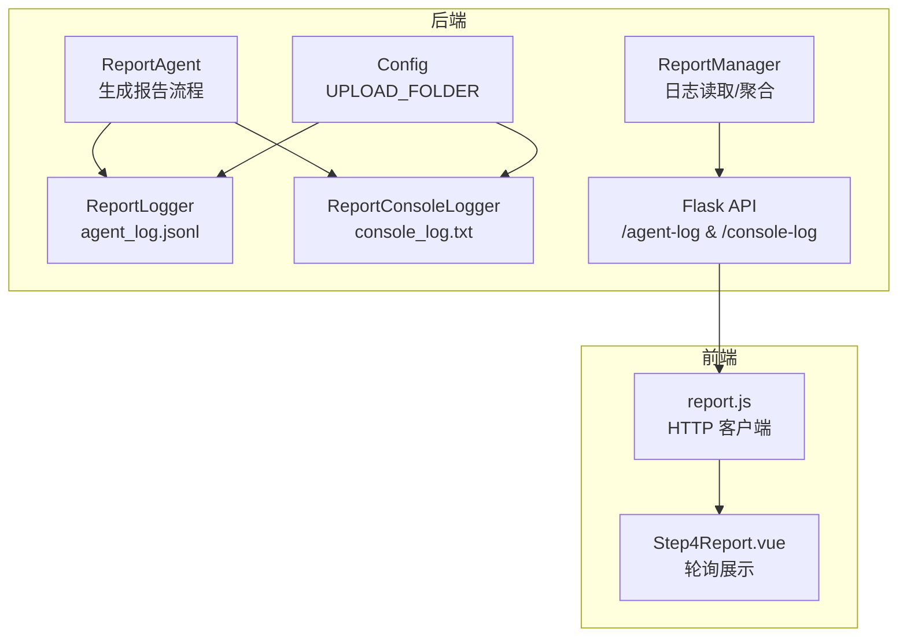
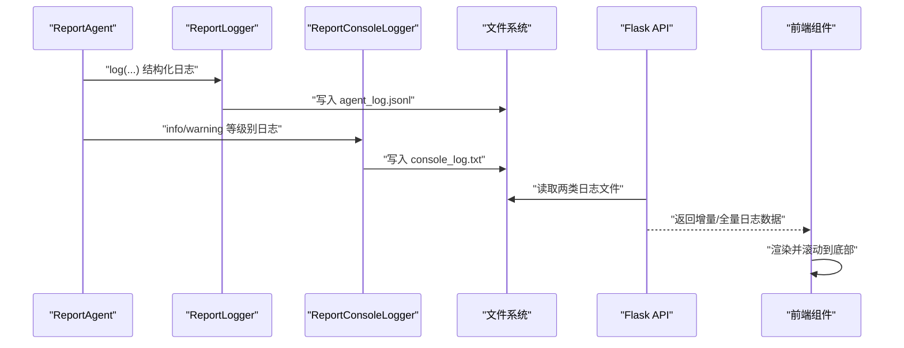
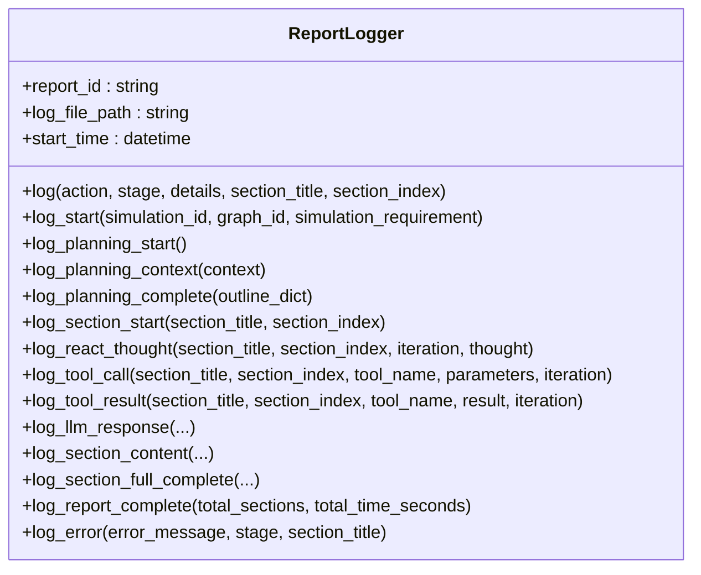
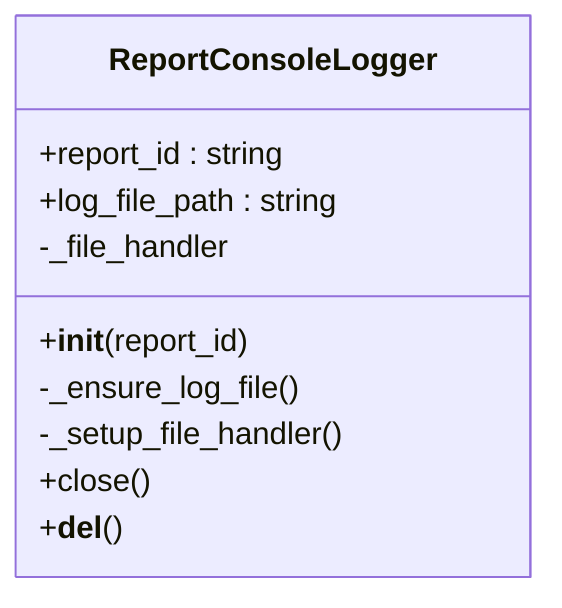
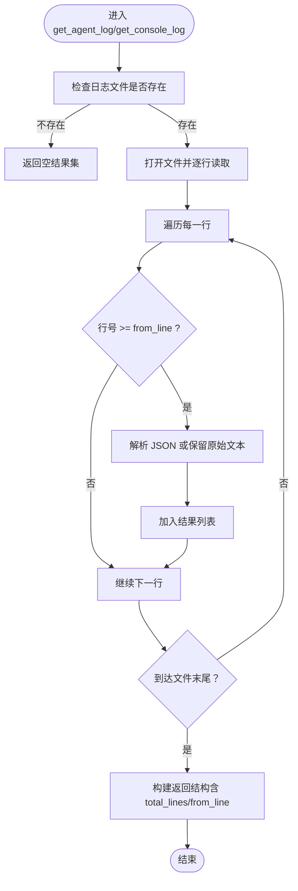
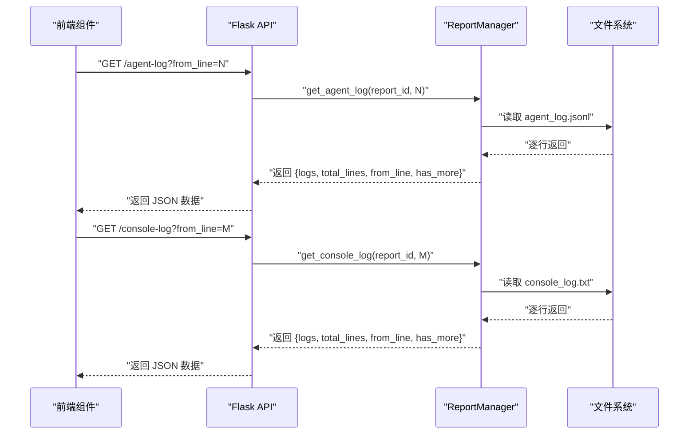
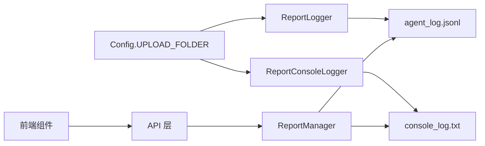

# 日志监控系统

<cite>
**本文引用的文件**
- [backend/app/services/report_agent.py](file://backend/app/services/report_agent.py)
- [backend/app/api/report.py](file://backend/app/api/report.py)
- [backend/app/utils/logger.py](file://backend/app/utils/logger.py)
- [backend/scripts/action_logger.py](file://backend/scripts/action_logger.py)
- [frontend/src/components/Step4Report.vue](file://frontend/src/components/Step4Report.vue)
- [frontend/src/api/report.js](file://frontend/src/api/report.js)
- [backend/run.py](file://backend/run.py)
- [backend/app/config.py](file://backend/app/config.py)
</cite>

## 目录
1. [简介](#简介)
2. [项目结构](#项目结构)
3. [核心组件](#核心组件)
4. [架构总览](#架构总览)
5. [详细组件分析](#详细组件分析)
6. [依赖关系分析](#依赖关系分析)
7. [性能考量](#性能考量)
8. [故障排查指南](#故障排查指南)
9. [结论](#结论)
10. [附录](#附录)

## 简介
本技术文档聚焦于 MiroFish 的日志监控系统，围绕 ReportLogger 与 ReportConsoleLogger 的设计与实现展开，系统性说明 agent_log.jsonl 与 console_log.txt 两类日志格式的差异、用途与解析方法；解释日志级别、时间戳管理与性能监控指标；提供日志分析工具、错误诊断方法与调试技巧；并给出扩展接口、自定义日志处理器以及分布式日志聚合的实现建议。

## 项目结构
日志系统主要分布在后端服务层与前端展示层：
- 后端服务层负责生成与管理两类日志文件，并通过 API 提供增量拉取能力
- 前端通过轮询接口实时展示两类日志，便于用户观察报告生成过程

图表来源
- [backend/app/services/report_agent.py](file://backend/app/services/report_agent.py#L35-L386)
- [backend/app/api/report.py](file://backend/app/api/report.py#L760-L925)
- [frontend/src/components/Step4Report.vue](file://frontend/src/components/Step4Report.vue#L2044-L2090)
- [frontend/src/api/report.js](file://frontend/src/api/report.js#L19-L35)
- [backend/app/config.py](file://backend/app/config.py#L38-L42)

章节来源
- [backend/app/services/report_agent.py](file://backend/app/services/report_agent.py#L1-L200)
- [backend/app/api/report.py](file://backend/app/api/report.py#L1-L200)
- [frontend/src/components/Step4Report.vue](file://frontend/src/components/Step4Report.vue#L2044-L2090)
- [frontend/src/api/report.js](file://frontend/src/api/report.js#L1-L51)
- [backend/app/config.py](file://backend/app/config.py#L1-L42)

## 核心组件
- ReportLogger：面向结构化日志的记录器，输出 agent_log.jsonl，每行为一条 JSON 对象，包含时间戳、耗时、动作类型、阶段、章节信息与详细内容
- ReportConsoleLogger：面向控制台风格日志的记录器，输出 console_log.txt，采用简洁格式，将 INFO/WARNING 等级别日志写入文件并附加到指定 logger
- ReportManager：提供两类日志的读取与聚合，支持 from_line 增量获取
- API 层：提供 /agent-log 与 /console-log 接口，支持增量与全量获取
- 前端轮询：前端组件定时轮询两类日志接口，增量更新界面

章节来源
- [backend/app/services/report_agent.py](file://backend/app/services/report_agent.py#L35-L386)
- [backend/app/api/report.py](file://backend/app/api/report.py#L760-L925)
- [frontend/src/components/Step4Report.vue](file://frontend/src/components/Step4Report.vue#L2044-L2090)
- [frontend/src/api/report.js](file://frontend/src/api/report.js#L19-L35)

## 架构总览
下图展示了从 ReportAgent 到两类日志文件，再到 API 与前端展示的完整链路：

图表来源
- [backend/app/services/report_agent.py](file://backend/app/services/report_agent.py#L66-L386)
- [backend/app/api/report.py](file://backend/app/api/report.py#L760-L925)
- [frontend/src/components/Step4Report.vue](file://frontend/src/components/Step4Report.vue#L2044-L2090)

## 详细组件分析

### ReportLogger（结构化日志 agent_log.jsonl）
- 设计目标：以 JSON Lines 格式记录报告生成全过程，便于机器解析与分析
- 关键字段
  - timestamp：ISO 8601 时间戳
  - elapsed_seconds：自记录器创建以来的累计耗时（秒）
  - report_id：报告标识
  - action：动作类型（如 planning_start、tool_call、llm_response、section_complete 等）
  - stage：当前阶段（planning、generating、completed）
  - section_title/section_index：章节标题与索引（可选）
  - details：详细内容字典，包含具体参数、长度、结果等
- 写入策略：追加写入，UTF-8 编码，逐条 JSON 对象
- 性能特性：无截断的完整内容记录，适合离线分析与回放

图表来源
- [backend/app/services/report_agent.py](file://backend/app/services/report_agent.py#L35-L304)

章节来源
- [backend/app/services/report_agent.py](file://backend/app/services/report_agent.py#L35-L304)

### ReportConsoleLogger（控制台风格日志 console_log.txt）
- 设计目标：将 INFO/WARNING 等级别日志以简洁格式写入 console_log.txt，便于人类阅读与快速定位问题
- 格式规范：[HH:mm:ss] LEVEL: message
- 附加范围：自动将文件处理器附加到 'mirofish.report_agent' 与 'mirofish.zep_tools' 等 logger，避免重复添加
- 生命周期：构造时创建文件处理器并附加，析构或 close() 时移除处理器并关闭

图表来源
- [backend/app/services/report_agent.py](file://backend/app/services/report_agent.py#L306-L386)

章节来源
- [backend/app/services/report_agent.py](file://backend/app/services/report_agent.py#L306-L386)

### ReportManager（日志读取与聚合）
- 提供两类日志的读取接口
  - get_agent_log(report_id, from_line)：增量读取 agent_log.jsonl，返回结构化日志数组
  - get_console_log(report_id, from_line)：增量读取 console_log.txt，返回纯文本行数组
- 支持 from_line 参数实现增量获取，避免前端重复渲染
- 读取逻辑：逐行扫描，JSON Lines 解析失败则跳过

图表来源
- [backend/app/services/report_agent.py](file://backend/app/services/report_agent.py#L1805-L1925)

章节来源
- [backend/app/services/report_agent.py](file://backend/app/services/report_agent.py#L1790-L1925)

### API 接口与前端轮询
- 结构化日志接口
  - GET /api/report/{report_id}/agent-log?from_line=...
  - GET /api/report/{report_id}/agent-log/stream（一次性全量）
- 控制台日志接口
  - GET /api/report/{report_id}/console-log?from_line=...
  - GET /api/report/{report_id}/console-log/stream（一次性全量）
- 前端轮询策略
  - Step4Report.vue 定时调用 getAgentLog 与 getConsoleLog，增量更新日志列表并滚动到底部
  - 增量参数 from_line 由后端返回，前端据此继续拉取后续日志

图表来源
- [backend/app/api/report.py](file://backend/app/api/report.py#L760-L925)
- [frontend/src/components/Step4Report.vue](file://frontend/src/components/Step4Report.vue#L2044-L2090)
- [frontend/src/api/report.js](file://frontend/src/api/report.js#L19-L35)

章节来源
- [backend/app/api/report.py](file://backend/app/api/report.py#L760-L925)
- [frontend/src/components/Step4Report.vue](file://frontend/src/components/Step4Report.vue#L2044-L2090)
- [frontend/src/api/report.js](file://frontend/src/api/report.js#L19-L35)

## 依赖关系分析
- ReportLogger/ReportConsoleLogger 依赖 Config.UPLOAD_FOLDER 确定报告目录
- ReportManager 依赖 os.path.join 与 json.loads 解析 JSON Lines
- 前端通过 report.js 统一封装 API 调用，定时轮询两类日志
- 后端统一日志配置位于 backend/app/utils/logger.py，提供通用日志器与编码处理

图表来源
- [backend/app/config.py](file://backend/app/config.py#L38-L42)
- [backend/app/services/report_agent.py](file://backend/app/services/report_agent.py#L35-L386)
- [backend/app/api/report.py](file://backend/app/api/report.py#L760-L925)

章节来源
- [backend/app/config.py](file://backend/app/config.py#L1-L42)
- [backend/app/services/report_agent.py](file://backend/app/services/report_agent.py#L35-L386)
- [backend/app/api/report.py](file://backend/app/api/report.py#L760-L925)

## 性能考量
- JSON Lines 写入：逐条追加写入，I/O 成本低；建议在高并发场景下避免频繁 fsync
- 增量拉取：前端通过 from_line 实现增量获取，减少网络与解析开销
- 时间戳与耗时：结构化日志包含 timestamp 与 elapsed_seconds，便于性能分析与瓶颈定位
- 控制台日志：采用简洁格式，解析成本低，适合实时展示与快速诊断
- 编码与平台：Windows 控制台 UTF-8 输出已在启动入口与日志器中处理，避免乱码与二次编码开销

章节来源
- [backend/app/services/report_agent.py](file://backend/app/services/report_agent.py#L62-L98)
- [backend/app/utils/logger.py](file://backend/app/utils/logger.py#L13-L24)
- [backend/run.py](file://backend/run.py#L8-L16)

## 故障排查指南
- 无法读取日志
  - 检查报告目录是否存在：agent_log.jsonl 与 console_log.txt 是否生成
  - 确认 from_line 参数是否正确传递，避免越界
- JSON 解析失败
  - ReportManager 在解析 agent_log.jsonl 时会跳过解析失败的行，确认日志文件未被外部修改
- 控制台日志为空
  - 确认 ReportConsoleLogger 已成功附加到目标 logger（'mirofish.report_agent'、'mirofish.zep_tools'）
  - 检查日志级别是否为 INFO 或以上
- 前端不刷新
  - 确认轮询间隔合理（agent 2s，console 1.5s）
  - 检查前端是否正确更新 from_line 并滚动到底部

章节来源
- [backend/app/services/report_agent.py](file://backend/app/services/report_agent.py#L1805-L1925)
- [backend/app/services/report_agent.py](file://backend/app/services/report_agent.py#L334-L386)
- [frontend/src/components/Step4Report.vue](file://frontend/src/components/Step4Report.vue#L2044-L2090)

## 结论
MiroFish 的日志监控系统通过 ReportLogger 与 ReportConsoleLogger 分别满足“机器可读”与“人类可读”的双重视角，配合 ReportManager 的增量读取与 API 层的统一暴露，实现了高效、可观测的报告生成过程。前端轮询机制进一步提升了用户体验。建议在生产环境中结合 from_line 增量策略与合理的日志级别，持续优化性能与可维护性。

## 附录

### 日志格式对比与用途
- agent_log.jsonl（结构化）
  - 适用：离线分析、性能监控、自动化告警
  - 特点：每行 JSON，包含时间戳、耗时、动作、阶段、章节与详细内容
- console_log.txt（控制台风格）
  - 适用：实时查看、快速排障、人工审计
  - 特点：简洁格式，按级别输出，便于人类阅读

章节来源
- [backend/app/services/report_agent.py](file://backend/app/services/report_agent.py#L35-L386)
- [backend/app/api/report.py](file://backend/app/api/report.py#L848-L925)

### 日志级别与时间戳管理
- 日志级别
  - 控制台日志：INFO、WARNING、ERROR 等（由 Python logging 模块提供）
  - 结构化日志：通过 details 字段承载业务语义，不改变日志级别
- 时间戳
  - 控制台日志：使用简单格式 [HH:mm:ss]
  - 结构化日志：ISO 8601 时间戳与 elapsed_seconds（自记录器创建起）

章节来源
- [backend/app/services/report_agent.py](file://backend/app/services/report_agent.py#L347-L350)
- [backend/app/services/report_agent.py](file://backend/app/services/report_agent.py#L84-L98)

### 性能监控指标建议
- 响应延迟：基于 elapsed_seconds 评估各阶段耗时
- 错误率：统计 action 为 error 的条目占比
- 吞吐量：统计单位时间内 section_complete 数量
- I/O：监控 agent_log.jsonl/console_log.txt 的写入速率与文件大小

章节来源
- [backend/app/services/report_agent.py](file://backend/app/services/report_agent.py#L280-L304)

### 日志分析工具与脚本参考
- JSON Lines 解析：使用标准库 json.loads 逐行解析 agent_log.jsonl
- 文本过滤：按级别筛选 console_log.txt 中的 INFO/WARNING/ERROR 行
- 轮询客户端：前端通过 report.js 封装的 getAgentLog/getConsoleLog 实现增量拉取

章节来源
- [backend/app/api/report.py](file://backend/app/api/report.py#L760-L925)
- [frontend/src/api/report.js](file://frontend/src/api/report.js#L19-L35)

### 错误诊断方法与调试技巧
- 快速定位：优先查看 console_log.txt 中的 ERROR/异常堆栈
- 回放分析：读取 agent_log.jsonl，按 action/section_index 重建生成流程
- 增量调试：从前端传入 from_line，逐步缩小问题区间
- 编码问题：确保 Windows 环境 UTF-8 输出配置生效

章节来源
- [backend/app/utils/logger.py](file://backend/app/utils/logger.py#L13-L24)
- [backend/run.py](file://backend/run.py#L8-L16)

### 扩展接口与自定义日志处理器
- 自定义处理器
  - 参考 ReportConsoleLogger 的文件处理器模式，可新增 UDP/TCP/数据库等处理器
  - 注意避免重复添加处理器，保持幂等性
- 分布式日志聚合
  - 建议将 agent_log.jsonl/console_log.txt 采集至集中式日志系统（如 ELK/Fluentd/Loki）
  - 通过 from_line 实现断点续传，避免重复消费
- 旧版模拟日志（兼容）
  - action_logger.py 提供 PlatformActionLogger/SimulationLogManager，可作为分布式事件日志的参考实现

章节来源
- [backend/app/services/report_agent.py](file://backend/app/services/report_agent.py#L306-L386)
- [backend/scripts/action_logger.py](file://backend/scripts/action_logger.py#L22-L197)