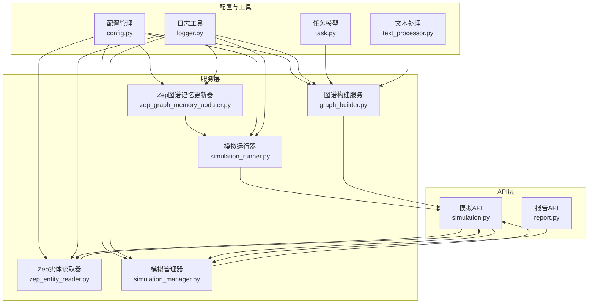
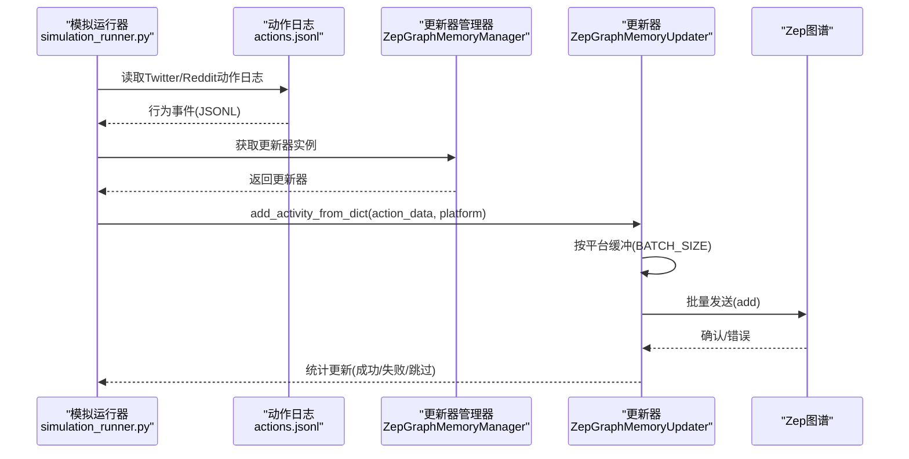
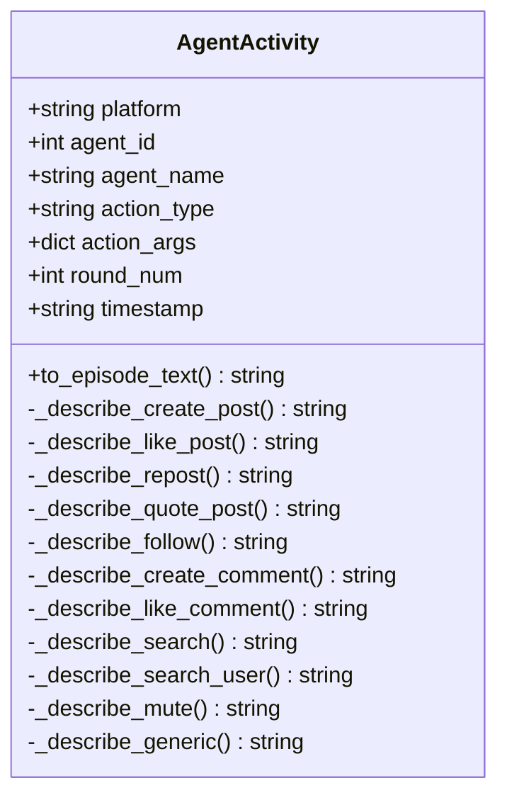
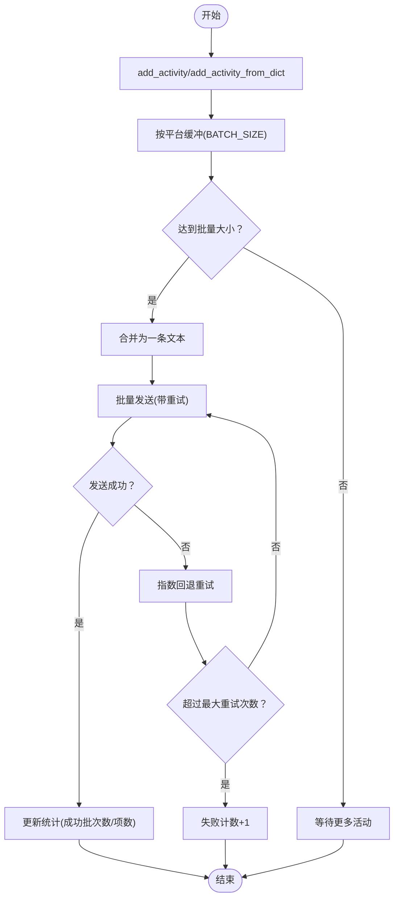
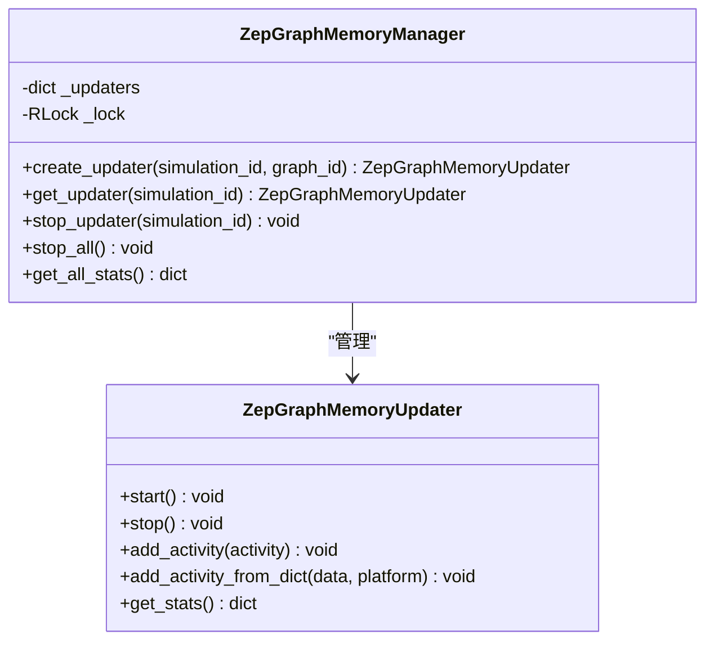
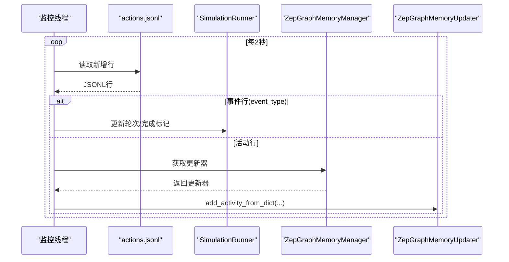
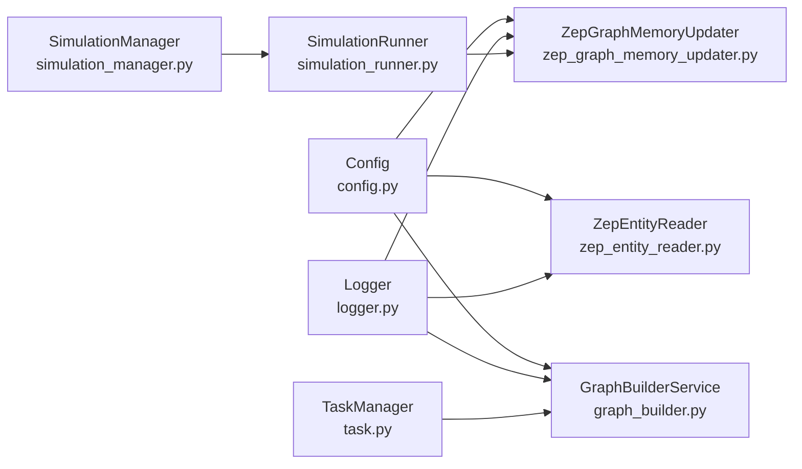

# 记忆更新机制

<cite>
**本文档引用的文件**
- [zep_graph_memory_updater.py](file://backend/app/services/zep_graph_memory_updater.py)
- [zep_entity_reader.py](file://backend/app/services/zep_entity_reader.py)
- [graph_builder.py](file://backend/app/services/graph_builder.py)
- [simulation_runner.py](file://backend/app/services/simulation_runner.py)
- [simulation_manager.py](file://backend/app/services/simulation_manager.py)
- [config.py](file://backend/app/config.py)
- [logger.py](file://backend/app/utils/logger.py)
- [task.py](file://backend/app/models/task.py)
- [text_processor.py](file://backend/app/services/text_processor.py)
- [simulation.py](file://backend/app/api/simulation.py)
- [report.py](file://backend/app/api/report.py)
</cite>

## 目录
1. [简介](#简介)
2. [项目结构](#项目结构)
3. [核心组件](#核心组件)
4. [架构概览](#架构概览)
5. [详细组件分析](#详细组件分析)
6. [依赖关系分析](#依赖关系分析)
7. [性能考虑](#性能考虑)
8. [故障排查指南](#故障排查指南)
9. [结论](#结论)
10. [附录](#附录)

## 简介
本技术文档聚焦于MiroFish项目中基于Zep图谱的记忆更新机制，系统阐述了Agent活动如何从模拟日志流中抽取、转换、批量推送至Zep图谱的完整流程。文档涵盖算法流程、更新策略、同步机制、触发条件、范围控制、冲突解决、性能优化、缓存策略、错误恢复、配置参数与监控指标，并提供扩展接口与自定义更新规则的实现指南。

## 项目结构
围绕记忆更新机制的关键文件组织如下：
- 服务层：负责与Zep交互、实体读取、图谱构建、模拟运行与监控
- 配置与工具：统一配置、日志、任务管理、文本处理
- API层：对外提供实体读取、模拟准备与运行、报告生成等接口

**图表来源**
- [zep_graph_memory_updater.py](file://backend/app/services/zep_graph_memory_updater.py#L201-L549)
- [zep_entity_reader.py](file://backend/app/services/zep_entity_reader.py#L70-L445)
- [graph_builder.py](file://backend/app/services/graph_builder.py#L38-L500)
- [simulation_runner.py](file://backend/app/services/simulation_runner.py#L195-L800)
- [simulation_manager.py](file://backend/app/services/simulation_manager.py#L114-L529)
- [config.py](file://backend/app/config.py#L20-L76)
- [logger.py](file://backend/app/utils/logger.py#L30-L127)
- [task.py](file://backend/app/models/task.py#L54-L185)
- [text_processor.py](file://backend/app/services/text_processor.py#L9-L72)
- [simulation.py](file://backend/app/api/simulation.py#L47-L160)
- [report.py](file://backend/app/api/report.py#L24-L196)

**章节来源**
- [zep_graph_memory_updater.py](file://backend/app/services/zep_graph_memory_updater.py#L1-L549)
- [simulation_runner.py](file://backend/app/services/simulation_runner.py#L1-L800)
- [config.py](file://backend/app/config.py#L1-L76)

## 核心组件
- AgentActivity：封装单条Agent活动，提供自然语言描述转换能力
- ZepGraphMemoryUpdater：负责将活动按平台分组、批量发送至Zep图谱，内置重试与统计
- ZepGraphMemoryManager：多模拟实例管理器，生命周期控制与统计聚合
- ZepEntityReader：从Zep图谱读取节点、边，筛选实体并可补充上下文
- GraphBuilderService：异步构建图谱，设置本体、分批发送文本、等待处理完成
- SimulationRunner：监控模拟进程，解析动作日志，按需触发图谱记忆更新
- SimulationManager：准备阶段自动化，生成Profile与配置，准备脚本
- 配置与工具：Config集中管理Zep API Key等；Logger统一输出；TaskManager异步任务状态

**章节来源**
- [zep_graph_memory_updater.py](file://backend/app/services/zep_graph_memory_updater.py#L23-L549)
- [zep_entity_reader.py](file://backend/app/services/zep_entity_reader.py#L70-L445)
- [graph_builder.py](file://backend/app/services/graph_builder.py#L38-L500)
- [simulation_runner.py](file://backend/app/services/simulation_runner.py#L195-L800)
- [simulation_manager.py](file://backend/app/services/simulation_manager.py#L114-L529)
- [config.py](file://backend/app/config.py#L20-L76)
- [logger.py](file://backend/app/utils/logger.py#L30-L127)
- [task.py](file://backend/app/models/task.py#L54-L185)

## 架构概览
记忆更新机制贯穿“模拟运行—日志解析—图谱更新—实体读取—报告生成”的闭环：

**图表来源**
- [simulation_runner.py](file://backend/app/services/simulation_runner.py#L478-L686)
- [zep_graph_memory_updater.py](file://backend/app/services/zep_graph_memory_updater.py#L305-L470)

## 详细组件分析

### AgentActivity：活动描述与上下文
- 职责：将原始动作数据转换为自然语言描述，便于Zep抽取实体与关系
- 关键点：
  - 支持多种动作类型（发帖、点赞、转发、评论、搜索、关注、屏蔽等）
  - 动作描述包含上下文（如帖子原文、作者名、评论内容）
  - DO_NOTHING类活动会被过滤跳过
- 复杂度：描述生成为O(1)，内存占用与action_args大小线性相关

**图表来源**
- [zep_graph_memory_updater.py](file://backend/app/services/zep_graph_memory_updater.py#L23-L199)

**章节来源**
- [zep_graph_memory_updater.py](file://backend/app/services/zep_graph_memory_updater.py#L23-L199)

### ZepGraphMemoryUpdater：批量更新与重试
- 触发条件：模拟运行期间，日志解析线程检测到有效Agent活动
- 更新策略：
  - 按平台分组（twitter/reddit）独立缓冲
  - 达到BATCH_SIZE后合并为一条文本，换行分隔多条活动
  - 发送间隔SEND_INTERVAL避免请求过快
- 同步机制：
  - 内部队列+锁保护缓冲区
  - 后台工作线程持续消费队列
  - 停止时刷新剩余活动
- 重试与错误处理：
  - 每批最多MAX_RETRIES次重试，指数回退（RETRY_DELAY秒）
  - 失败计数与统计上报
- 统计指标：总活动数、成功批次数、成功项数、失败次数、跳过次数、队列长度、各平台缓冲大小

**图表来源**
- [zep_graph_memory_updater.py](file://backend/app/services/zep_graph_memory_updater.py#L305-L470)

**章节来源**
- [zep_graph_memory_updater.py](file://backend/app/services/zep_graph_memory_updater.py#L201-L549)

### ZepGraphMemoryManager：多模拟实例管理
- 生命周期管理：创建、获取、停止、批量停止
- 线程安全：使用锁保护更新器字典
- 统计聚合：提供所有实例的统计信息

**图表来源**
- [zep_graph_memory_updater.py](file://backend/app/services/zep_graph_memory_updater.py#L473-L549)

**章节来源**
- [zep_graph_memory_updater.py](file://backend/app/services/zep_graph_memory_updater.py#L473-L549)

### SimulationRunner：日志解析与触发更新
- 监控线程：分别读取twitter/reddit/actions.jsonl
- 事件识别：round_end更新轮次与模拟时间；simulation_end标记平台完成
- 更新触发：若启用图谱记忆更新，将活动通过ZepGraphMemoryManager转发
- 进程终止：停止模拟时清理资源并停止更新器

**图表来源**
- [simulation_runner.py](file://backend/app/services/simulation_runner.py#L478-L686)

**章节来源**
- [simulation_runner.py](file://backend/app/services/simulation_runner.py#L478-L686)

### ZepEntityReader：实体读取与过滤
- 功能：读取节点、边，筛选符合预定义实体类型的节点，可补充边与关联节点信息
- 重试机制：指数回退重试，提升网络波动下的稳定性
- 应用场景：报告生成前的实体上下文获取、前端展示

**章节来源**
- [zep_entity_reader.py](file://backend/app/services/zep_entity_reader.py#L70-L445)

### GraphBuilderService：图谱构建与等待
- 异步构建：创建图谱、设置本体、分批发送文本、等待处理完成
- 进度回调：任务管理器更新进度，前端轮询获取
- 等待策略：按episode逐一查询processed状态，超时保护

**章节来源**
- [graph_builder.py](file://backend/app/services/graph_builder.py#L52-L418)

## 依赖关系分析
- 配置依赖：Config提供ZEP_API_KEY，所有Zep相关服务均依赖此配置
- 日志依赖：统一Logger输出，便于追踪更新器状态与错误
- 任务依赖：GraphBuilderService与Report API使用TaskManager进行异步任务状态管理
- 模拟集成：SimulationRunner在运行时动态启用/禁用图谱记忆更新，并通过ZepGraphMemoryManager管理更新器

**图表来源**
- [config.py](file://backend/app/config.py#L20-L76)
- [zep_graph_memory_updater.py](file://backend/app/services/zep_graph_memory_updater.py#L17-L20)
- [zep_entity_reader.py](file://backend/app/services/zep_entity_reader.py#L12-L15)
- [graph_builder.py](file://backend/app/services/graph_builder.py#L44-L49)
- [logger.py](file://backend/app/utils/logger.py#L30-L88)
- [task.py](file://backend/app/models/task.py#L54-L71)
- [simulation_runner.py](file://backend/app/services/simulation_runner.py#L21-L24)
- [simulation_manager.py](file://backend/app/services/simulation_manager.py#L15-L19)

**章节来源**
- [config.py](file://backend/app/config.py#L20-L76)
- [logger.py](file://backend/app/utils/logger.py#L30-L127)
- [task.py](file://backend/app/models/task.py#L54-L185)
- [simulation_runner.py](file://backend/app/services/simulation_runner.py#L195-L800)
- [simulation_manager.py](file://backend/app/services/simulation_manager.py#L114-L529)

## 性能考虑
- 批量策略：BATCH_SIZE=5，减少API调用次数；SEND_INTERVAL=0.5秒，避免限流
- 内存控制：按平台缓冲，不足BATCH_SIZE时在停止时刷新发送，避免内存堆积
- 网络健壮性：每批最多MAX_RETRIES次重试，指数回退降低抖动
- I/O优化：监控线程2秒间隔扫描日志，平衡实时性与CPU占用
- 并发安全：缓冲区使用锁保护，统计字段加锁访问
- 建议优化：
  - 根据Zep配额调整BATCH_SIZE与SEND_INTERVAL
  - 对高频动作类型（如LIKE/COMMENT）评估是否需要去重
  - 增加队列长度上限与背压策略，防止日志风暴

[本节为通用性能建议，不直接分析具体文件]

## 故障排查指南
- 常见错误与定位：
  - ZEP_API_KEY未配置：初始化时报错，检查.env或环境变量
  - 网络波动导致发送失败：查看重试日志与失败计数
  - 日志解析异常：监控线程捕获异常并继续运行，检查actions.jsonl权限与编码
- 日志与监控：
  - 更新器统计：total_activities、batches_sent、items_sent、failed_count、skipped_count
  - 运行状态：队列长度、各平台缓冲大小、running标志
- 恢复措施：
  - 重启更新器实例（Manager.stop_all后重建）
  - 检查Zep服务可用性与配额
  - 调整重试参数与批量大小

**章节来源**
- [zep_graph_memory_updater.py](file://backend/app/services/zep_graph_memory_updater.py#L231-L304)
- [simulation_runner.py](file://backend/app/services/simulation_runner.py#L544-L577)

## 结论
MiroFish的记忆更新机制通过“日志驱动、按平台缓冲、批量发送、指数回退”的设计，在保证实时性的同时兼顾了网络波动与吞吐限制。配合ZepEntityReader与GraphBuilderService，实现了从图谱构建到实体读取再到报告生成的完整闭环。通过ZepGraphMemoryManager实现多模拟实例的生命周期管理，满足复杂场景下的并发与隔离需求。

[本节为总结性内容，不直接分析具体文件]

## 附录

### 更新流程示例（步骤化）
- 启动模拟：SimulationRunner启动子进程并创建监控线程
- 日志解析：监控线程读取actions.jsonl，识别事件与活动
- 触发更新：若启用图谱记忆更新，将活动交由ZepGraphMemoryManager管理的更新器
- 批量发送：更新器按平台缓冲，达到BATCH_SIZE后合并发送
- 等待与统计：记录成功/失败/跳过数量，输出调试信息

**章节来源**
- [simulation_runner.py](file://backend/app/services/simulation_runner.py#L312-L577)
- [zep_graph_memory_updater.py](file://backend/app/services/zep_graph_memory_updater.py#L305-L470)

### 配置参数说明
- ZEP_API_KEY：Zep服务认证密钥（必填）
- BATCH_SIZE：每平台批量发送条数（默认5）
- SEND_INTERVAL：发送间隔秒数（默认0.5）
- MAX_RETRIES/RETRY_DELAY：批量发送重试次数与延迟（默认3次，每次递增）

**章节来源**
- [config.py](file://backend/app/config.py#L35-L36)
- [zep_graph_memory_updater.py](file://backend/app/services/zep_graph_memory_updater.py#L215-L230)

### 监控指标清单
- 更新器统计：total_activities、batches_sent、items_sent、failed_count、skipped_count、queue_size、buffer_sizes、running
- 运行状态：各平台缓冲大小、队列长度、运行标志
- 任务进度：GraphBuilderService与Report API的TaskManager进度

**章节来源**
- [zep_graph_memory_updater.py](file://backend/app/services/zep_graph_memory_updater.py#L454-L470)
- [task.py](file://backend/app/models/task.py#L106-L144)

### 扩展接口与自定义规则
- 自定义动作类型：在AgentActivity中扩展动作描述方法，支持更多业务语义
- 自定义过滤规则：在add_activity中增加过滤逻辑（如按轮次、按Agent ID、按平台）
- 自定义批量策略：调整BATCH_SIZE与SEND_INTERVAL以适配不同网络环境
- 自定义重试策略：修改MAX_RETRIES与RETRY_DELAY，或引入Jitter退避
- 自定义描述模板：在to_episode_text中加入领域特定的模板化描述

**章节来源**
- [zep_graph_memory_updater.py](file://backend/app/services/zep_graph_memory_updater.py#L23-L61)
- [zep_graph_memory_updater.py](file://backend/app/services/zep_graph_memory_updater.py#L305-L334)