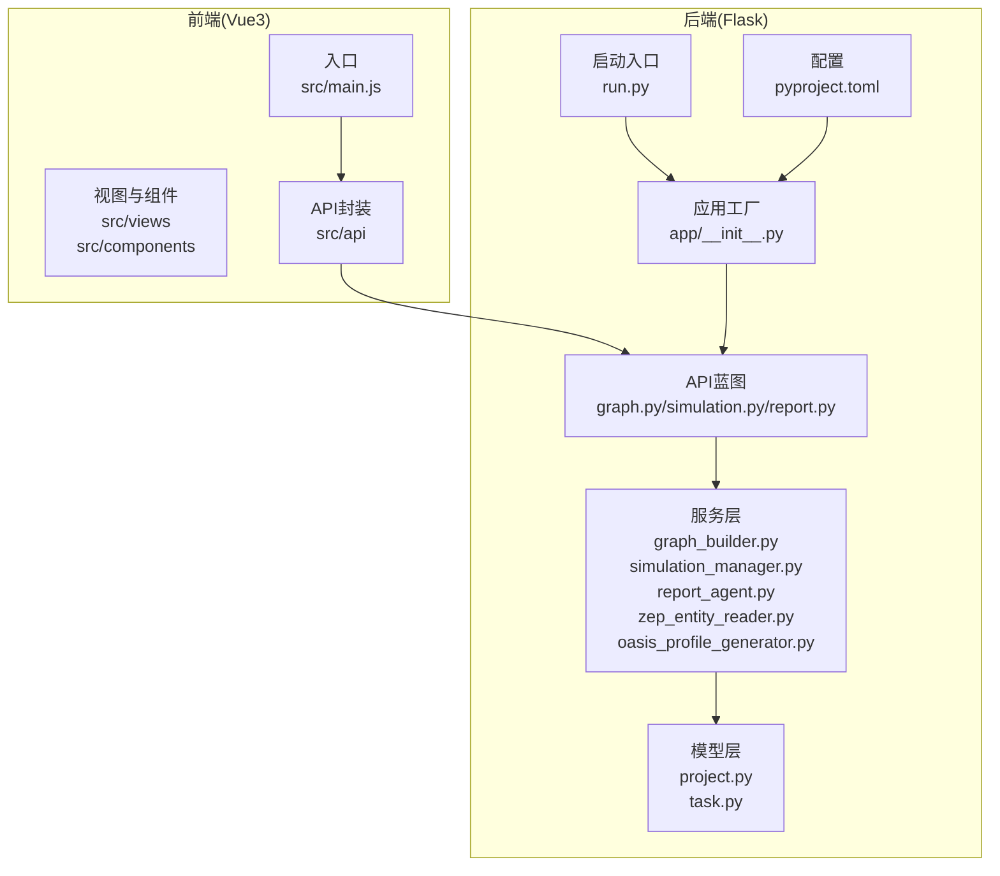
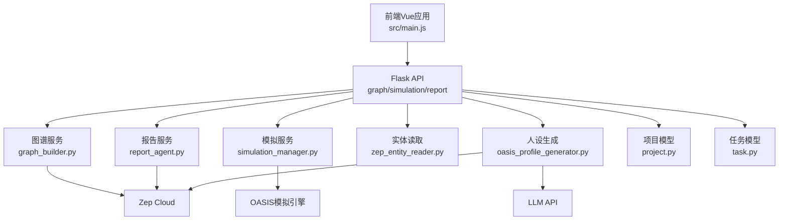
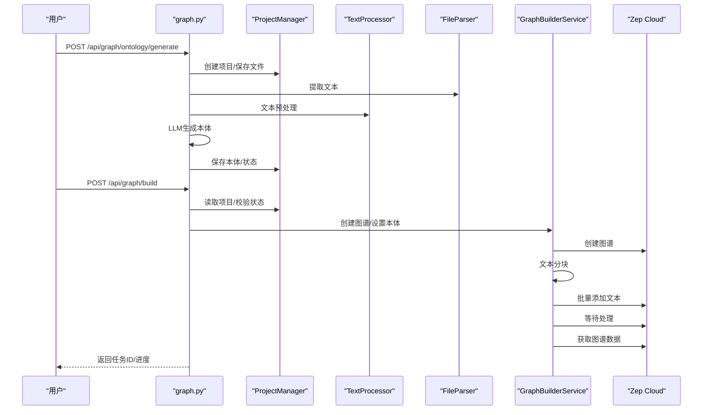
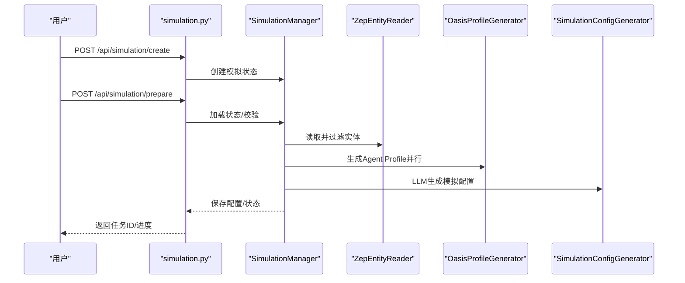
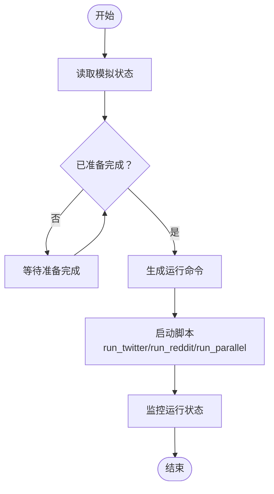
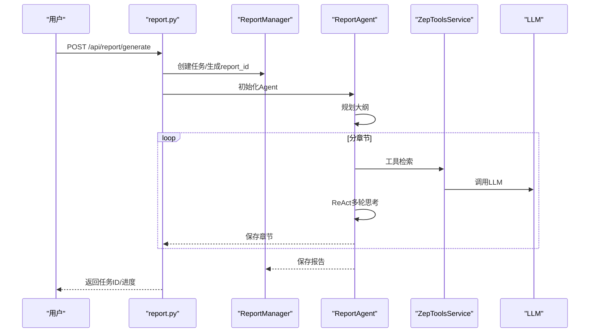
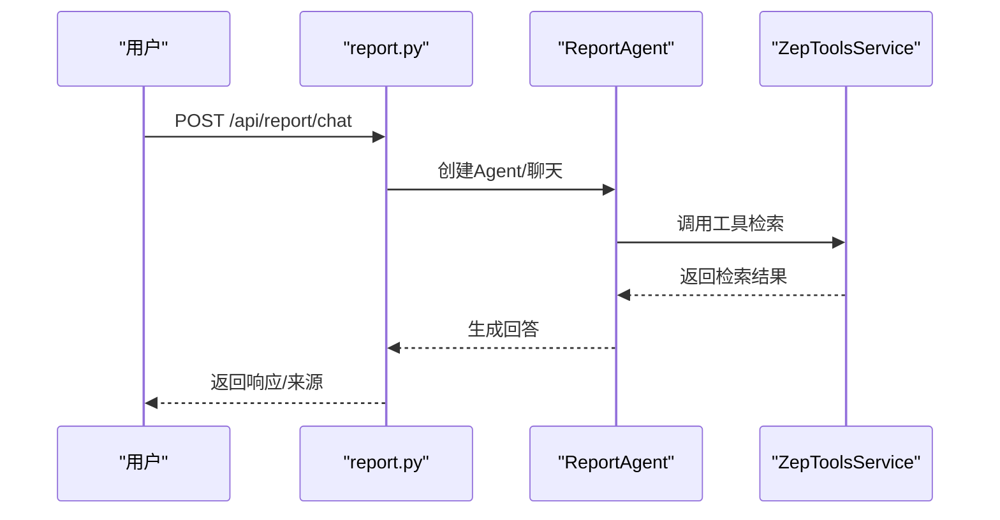
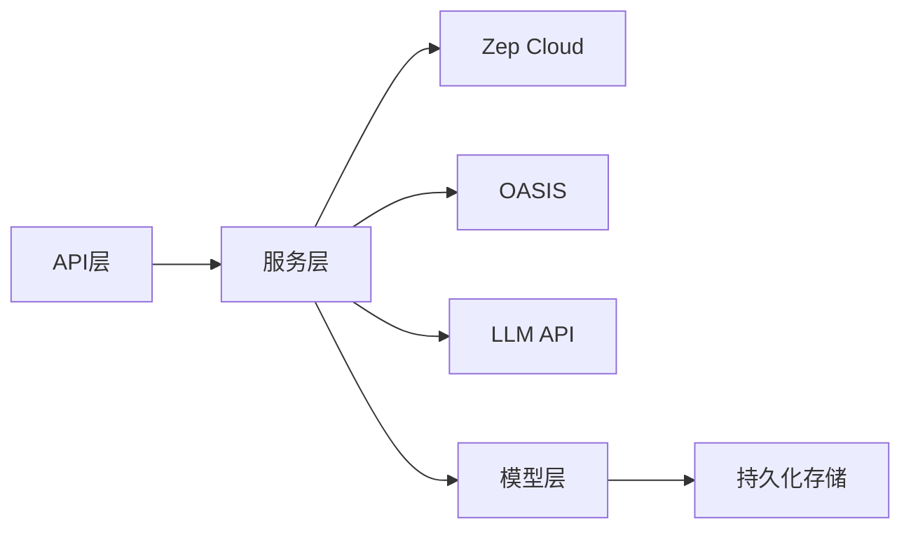

# 核心功能

<cite>
**本文档引用的文件**
- [README.md](file://README.md)
- [run.py](file://backend/run.py)
- [__init__.py](file://backend/app/__init__.py)
- [graph.py](file://backend/app/api/graph.py)
- [simulation.py](file://backend/app/api/simulation.py)
- [report.py](file://backend/app/api/report.py)
- [graph_builder.py](file://backend/app/services/graph_builder.py)
- [simulation_manager.py](file://backend/app/services/simulation_manager.py)
- [report_agent.py](file://backend/app/services/report_agent.py)
- [project.py](file://backend/app/models/project.py)
- [task.py](file://backend/app/models/task.py)
- [zep_entity_reader.py](file://backend/app/services/zep_entity_reader.py)
- [oasis_profile_generator.py](file://backend/app/services/oasis_profile_generator.py)
- [pyproject.toml](file://backend/pyproject.toml)
- [main.js](file://frontend/src/main.js)
</cite>

## 目录
1. [简介](#简介)
2. [项目结构](#项目结构)
3. [核心组件](#核心组件)
4. [架构总览](#架构总览)
5. [详细组件分析](#详细组件分析)
6. [依赖关系分析](#依赖关系分析)
7. [性能考虑](#性能考虑)
8. [故障排查指南](#故障排查指南)
9. [结论](#结论)
10. [附录](#附录)

## 简介
MiroFish 是一款基于多智能体技术的群体智能预测引擎。系统通过提取现实世界的种子信息（如新闻、政策、金融信号等），自动构建高保真的平行数字世界，成千上万个具备独立人格、长期记忆与行为逻辑的智能体在其中自由交互与社会演化。用户可通过「上帝视角」动态注入变量，精准推演未来走向，实现「让未来在数字沙盘中预演，助决策在百战模拟后胜出」。

系统提供五大核心工作流程：
- 图谱构建：从种子材料中提取知识，构建知识图谱
- 环境搭建：实体关系抽取、人设生成、配置注入
- 模拟运行：双平台并行模拟、需求解析、时序记忆更新
- 报告生成：ReportAgent 深度交互、多工具检索、章节化产出
- 深度互动：与模拟世界中的任意 Agent 对话，与 ReportAgent 对话

## 项目结构
后端采用 Flask 应用工厂模式，提供 REST API；前端基于 Vue3 + Vite，提供可视化界面。核心模块分布如下：
- 后端
  - API 层：graph.py、simulation.py、report.py
  - 服务层：graph_builder.py、simulation_manager.py、report_agent.py、zep_entity_reader.py、oasis_profile_generator.py 等
  - 模型层：project.py、task.py
  - 配置与启动：run.py、app/__init__.py、pyproject.toml
- 前端
  - 视图与组件：src/views、src/components
  - API 封装：src/api
  - 入口：src/main.js

图表来源
- [__init__.py](file://backend/app/__init__.py#L19-L81)
- [run.py](file://backend/run.py#L25-L51)
- [graph.py](file://backend/app/api/graph.py#L1-L618)
- [simulation.py](file://backend/app/api/simulation.py#L1-L800)
- [report.py](file://backend/app/api/report.py#L1-L800)
- [graph_builder.py](file://backend/app/services/graph_builder.py#L38-L500)
- [simulation_manager.py](file://backend/app/services/simulation_manager.py#L114-L529)
- [report_agent.py](file://backend/app/services/report_agent.py#L469-L800)
- [project.py](file://backend/app/models/project.py#L101-L306)
- [task.py](file://backend/app/models/task.py#L54-L185)
- [pyproject.toml](file://backend/pyproject.toml#L1-L56)
- [main.js](file://frontend/src/main.js#L1-L10)

章节来源
- [README.md](file://README.md#L81-L88)
- [run.py](file://backend/run.py#L25-L51)
- [__init__.py](file://backend/app/__init__.py#L19-L81)
- [pyproject.toml](file://backend/pyproject.toml#L1-L56)
- [main.js](file://frontend/src/main.js#L1-L10)

## 核心组件
- 项目上下文管理（Project/ProjectManager）
  - 负责项目生命周期状态持久化，包括文件、本体、图谱 ID、分块参数等
- 任务状态管理（Task/TaskManager）
  - 提供异步任务的创建、更新、查询与清理
- 图谱构建服务（GraphBuilderService）
  - 封装 Zep API，负责创建图谱、设置本体、分块添加文本、等待处理完成、获取图谱数据
- 实体读取与过滤（ZepEntityReader）
  - 从 Zep 图谱读取节点，筛选符合预定义实体类型，支持富上下文（边与关联节点）
- Agent 人设生成（OasisProfileGenerator）
  - 将实体转换为 OASIS 所需的 Agent Profile，支持个人与群体两类人设
- 模拟管理（SimulationManager）
  - 管理 Twitter 与 Reddit 双平台并行模拟，准备脚本与配置，生成运行说明
- 报告生成（ReportAgent）
  - 基于 ReAct 思维链与工具调用生成报告，支持深度采访、多工具检索、章节化输出
- API 蓝图（graph/simulation/report）
  - 提供 REST 接口，串联各服务层，支持进度查询、状态检查、异步任务管理

章节来源
- [project.py](file://backend/app/models/project.py#L101-L306)
- [task.py](file://backend/app/models/task.py#L54-L185)
- [graph_builder.py](file://backend/app/services/graph_builder.py#L38-L500)
- [zep_entity_reader.py](file://backend/app/services/zep_entity_reader.py#L70-L445)
- [oasis_profile_generator.py](file://backend/app/services/oasis_profile_generator.py#L142-L800)
- [simulation_manager.py](file://backend/app/services/simulation_manager.py#L114-L529)
- [report_agent.py](file://backend/app/services/report_agent.py#L469-L800)
- [graph.py](file://backend/app/api/graph.py#L1-L618)
- [simulation.py](file://backend/app/api/simulation.py#L1-L800)
- [report.py](file://backend/app/api/report.py#L1-L800)

## 架构总览
系统采用分层架构：前端通过 API 调用后端服务；后端通过服务层协调模型层与外部依赖（Zep、OASIS、LLM）。异步任务贯穿图谱构建、模拟准备与报告生成，保证长耗时操作的可观测性与可恢复性。

图表来源
- [__init__.py](file://backend/app/__init__.py#L66-L79)
- [graph.py](file://backend/app/api/graph.py#L1-L618)
- [simulation.py](file://backend/app/api/simulation.py#L1-L800)
- [report.py](file://backend/app/api/report.py#L1-L800)
- [graph_builder.py](file://backend/app/services/graph_builder.py#L38-L500)
- [simulation_manager.py](file://backend/app/services/simulation_manager.py#L114-L529)
- [report_agent.py](file://backend/app/services/report_agent.py#L469-L800)
- [zep_entity_reader.py](file://backend/app/services/zep_entity_reader.py#L70-L445)
- [oasis_profile_generator.py](file://backend/app/services/oasis_profile_generator.py#L142-L800)
- [project.py](file://backend/app/models/project.py#L101-L306)
- [task.py](file://backend/app/models/task.py#L54-L185)

## 详细组件分析

### 图谱构建（工作流一）
- 输入：种子文档（PDF/MD/TXT）、模拟需求、可选额外上下文
- 处理流程
  - 项目创建与文件保存 → 文本提取与预处理 → LLM 生成本体（实体/关系/分析摘要） → 项目状态更新
  - 图谱构建：创建图谱 → 设置本体 → 文本分块 → 批量添加 → 等待处理 → 获取图谱数据
- 关键接口
  - /api/graph/ontology/generate：生成本体
  - /api/graph/build：构建图谱（异步任务）
  - /api/graph/data/{graph_id}：获取图谱数据
- 依赖关系
  - 服务层依赖 Zep API 与 LLM
  - 模型层持久化项目状态与文本
  - 任务层提供进度与结果

图表来源
- [graph.py](file://backend/app/api/graph.py#L121-L255)
- [graph.py](file://backend/app/api/graph.py#L259-L525)
- [graph_builder.py](file://backend/app/services/graph_builder.py#L186-L499)
- [project.py](file://backend/app/models/project.py#L133-L196)

章节来源
- [graph.py](file://backend/app/api/graph.py#L121-L255)
- [graph.py](file://backend/app/api/graph.py#L259-L525)
- [graph_builder.py](file://backend/app/services/graph_builder.py#L38-L500)
- [project.py](file://backend/app/models/project.py#L101-L306)
- [task.py](file://backend/app/models/task.py#L54-L185)

### 环境搭建（工作流二）
- 输入：图谱 ID、实体类型过滤、是否启用 Twitter/Reddit
- 处理流程
  - 从 Zep 读取并过滤实体 → 为每个实体生成 OASIS Agent Profile（可选 LLM 增强，支持并行） → LLM 智能生成模拟配置 → 保存配置与脚本 → 生成运行说明
- 关键接口
  - /api/simulation/entities/{graph_id}：读取过滤后的实体
  - /api/simulation/create：创建模拟
  - /api/simulation/prepare：准备模拟（异步任务）
  - /api/simulation/prepare/status：查询准备进度
- 依赖关系
  - 实体读取依赖 Zep
  - 人设生成依赖 LLM 与 Zep 检索
  - 配置生成依赖 LLM

图表来源
- [simulation.py](file://backend/app/api/simulation.py#L164-L237)
- [simulation.py](file://backend/app/api/simulation.py#L358-L635)
- [simulation_manager.py](file://backend/app/services/simulation_manager.py#L193-L457)
- [zep_entity_reader.py](file://backend/app/services/zep_entity_reader.py#L222-L339)
- [oasis_profile_generator.py](file://backend/app/services/oasis_profile_generator.py#L142-L800)

章节来源
- [simulation.py](file://backend/app/api/simulation.py#L164-L237)
- [simulation.py](file://backend/app/api/simulation.py#L358-L635)
- [simulation_manager.py](file://backend/app/services/simulation_manager.py#L114-L529)
- [zep_entity_reader.py](file://backend/app/services/zep_entity_reader.py#L70-L445)
- [oasis_profile_generator.py](file://backend/app/services/oasis_profile_generator.py#L142-L800)

### 模拟运行（工作流三）
- 输入：模拟 ID、平台开关（Twitter/Reddit）
- 处理流程
  - 读取模拟状态 → 检查准备状态 → 生成运行命令 → 启动脚本（run_twitter/run_reddit/run_parallel）
- 关键接口
  - /api/simulation/{simulation_id}：获取模拟状态
  - /api/simulation/list：列出模拟
  - /api/simulation/interview/*：采访接口（由前端调用）
- 依赖关系
  - 依赖脚本目录与 OASIS 模拟引擎
  - 与 ReportAgent 的 Interview 工具联动

图表来源
- [simulation_manager.py](file://backend/app/services/simulation_manager.py#L506-L529)
- [simulation.py](file://backend/app/api/simulation.py#L750-L800)

章节来源
- [simulation_manager.py](file://backend/app/services/simulation_manager.py#L114-L529)
- [simulation.py](file://backend/app/api/simulation.py#L750-L800)

### 报告生成（工作流四）
- 输入：模拟 ID、报告生成策略
- 处理流程
  - 创建异步任务 → 初始化 ReportAgent → 规划大纲 → 分章节生成 → 工具检索（insight_forge/panorama_search/quick_search） → 章节化输出 → 生成 Markdown → 提供对话能力
- 关键接口
  - /api/report/generate：生成报告（异步）
  - /api/report/generate/status：查询进度
  - /api/report/chat：与 ReportAgent 对话
  - /api/report/{report_id}/sections：分章节获取
- 依赖关系
  - ReportAgent 依赖 Zep 工具与 LLM
  - 生成日志与控制台日志分离记录

图表来源
- [report.py](file://backend/app/api/report.py#L24-L196)
- [report.py](file://backend/app/api/report.py#L198-L268)
- [report_agent.py](file://backend/app/services/report_agent.py#L469-L800)

章节来源
- [report.py](file://backend/app/api/report.py#L24-L196)
- [report.py](file://backend/app/api/report.py#L198-L268)
- [report_agent.py](file://backend/app/services/report_agent.py#L469-L800)

### 深度互动（工作流五）
- 输入：报告 ID、用户消息、对话历史
- 处理流程
  - 与 ReportAgent 对话 → Agent 自主调用检索工具 → 返回回答与来源
  - Interview 工具：调用真实模拟 Agent 的采访接口，获取多平台观点
- 关键接口
  - /api/report/chat：对话接口
  - /api/report/check/{simulation_id}：检查报告状态，解锁 Interview
  - /api/simulation/interview/*：批量采访（由 ReportAgent 调用）

图表来源
- [report.py](file://backend/app/api/report.py#L467-L560)
- [report_agent.py](file://backend/app/services/report_agent.py#L469-L800)

章节来源
- [report.py](file://backend/app/api/report.py#L467-L560)
- [report_agent.py](file://backend/app/services/report_agent.py#L469-L800)

## 依赖关系分析
- 外部依赖
  - Zep Cloud：知识图谱存储与检索
  - OASIS：社交媒体模拟引擎
  - LLM API：本体生成、人设生成、报告生成
- 内部耦合
  - API 层依赖服务层；服务层依赖模型层与外部依赖
  - 任务管理器贯穿长耗时操作，提供统一的进度与结果管理
- 潜在循环依赖
  - 通过明确的服务边界与接口契约避免循环依赖

图表来源
- [graph.py](file://backend/app/api/graph.py#L1-L618)
- [simulation.py](file://backend/app/api/simulation.py#L1-L800)
- [report.py](file://backend/app/api/report.py#L1-L800)
- [graph_builder.py](file://backend/app/services/graph_builder.py#L38-L500)
- [simulation_manager.py](file://backend/app/services/simulation_manager.py#L114-L529)
- [report_agent.py](file://backend/app/services/report_agent.py#L469-L800)
- [project.py](file://backend/app/models/project.py#L101-L306)
- [task.py](file://backend/app/models/task.py#L54-L185)

章节来源
- [pyproject.toml](file://backend/pyproject.toml#L11-L35)
- [graph.py](file://backend/app/api/graph.py#L1-L618)
- [simulation.py](file://backend/app/api/simulation.py#L1-L800)
- [report.py](file://backend/app/api/report.py#L1-L800)

## 性能考虑
- 异步任务与进度回调
  - 图谱构建、模拟准备、报告生成均采用异步任务与进度回调，提升用户体验与可观测性
- 批量处理与并行
  - 图谱构建分批发送文本；人设生成支持并行；Zep 检索采用并行请求
- 重试与指数退避
  - Zep API 调用具备重试机制，避免瞬时网络波动影响
- 资源清理
  - 后端启动时注册模拟进程清理函数，避免僵尸进程

章节来源
- [graph_builder.py](file://backend/app/services/graph_builder.py#L287-L395)
- [oasis_profile_generator.py](file://backend/app/services/oasis_profile_generator.py#L285-L411)
- [zep_entity_reader.py](file://backend/app/services/zep_entity_reader.py#L87-L125)
- [__init__.py](file://backend/app/__init__.py#L45-L47)

## 故障排查指南
- 配置错误
  - 启动前验证配置，若缺失关键环境变量（如 ZEP_API_KEY、LLM 相关），直接退出并提示
- 图谱构建失败
  - 检查项目状态是否满足构建条件；查看任务状态与错误信息；确认 ZEP API Key 有效
- 模拟准备失败
  - 检查实体过滤结果是否为空；确认 LLM 可用；查看准备状态与必要文件是否存在
- 报告生成异常
  - 查看 agent_log.jsonl 与 console_log.txt；确认工具调用与 LLM 响应；检查报告状态
- Interview 无法使用
  - 确认报告已完成；检查模拟是否处于运行状态；确认 Interview 工具可用

章节来源
- [run.py](file://backend/run.py#L25-L46)
- [graph.py](file://backend/app/api/graph.py#L282-L525)
- [simulation.py](file://backend/app/api/simulation.py#L358-L635)
- [report.py](file://backend/app/api/report.py#L24-L196)
- [report_agent.py](file://backend/app/services/report_agent.py#L35-L98)

## 结论
MiroFish 通过五大工作流程实现了从知识抽取到预测推演再到深度交互的完整闭环。系统采用模块化设计与异步任务机制，兼顾易用性与可扩展性。依托 Zep、OASIS 与 LLM 的组合，系统能够高效构建高保真数字世界，并提供可定制的报告与互动体验。

## 附录
- 快速开始
  - 配置环境变量（LLM API Key、ZEP API Key）
  - 安装依赖（前端 + 后端）
  - 启动服务（前后端一体化或分别启动）
- 前端入口
  - Vue 应用通过 main.js 启动，路由指向各视图组件

章节来源
- [README.md](file://README.md#L101-L158)
- [main.js](file://frontend/src/main.js#L1-L10)