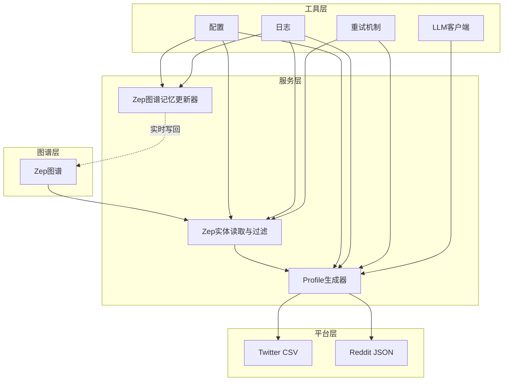
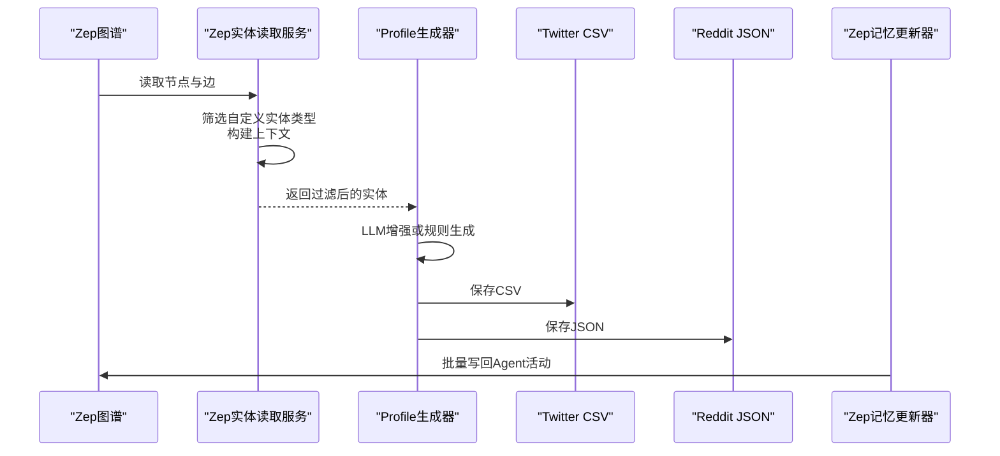
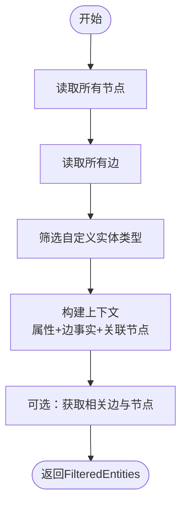
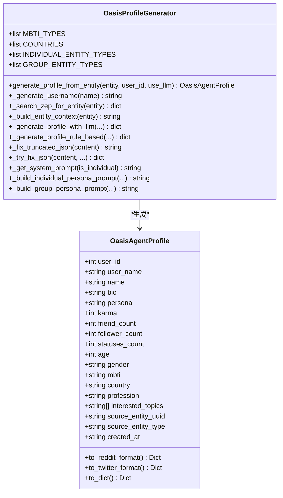
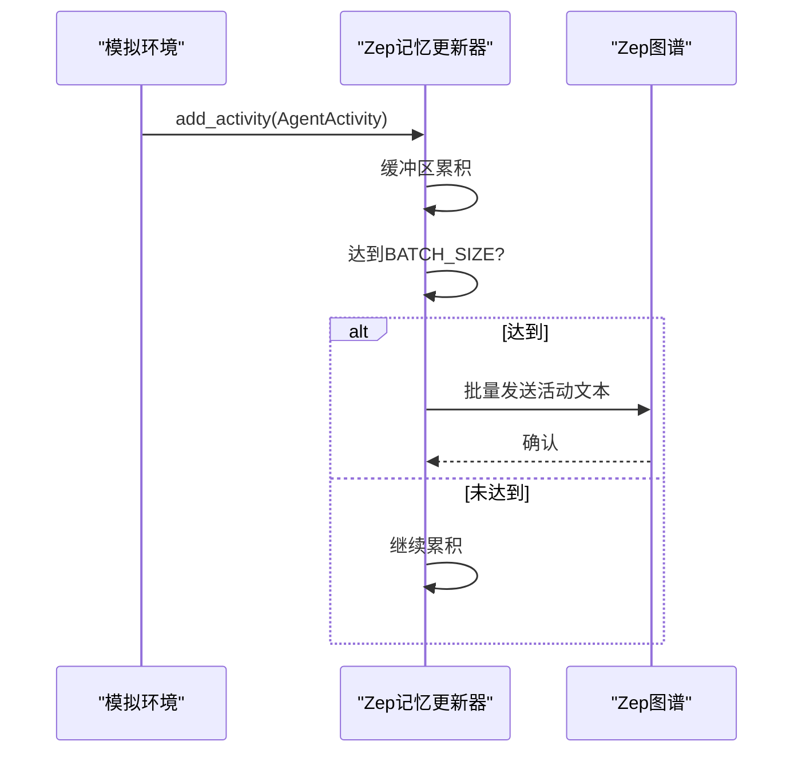
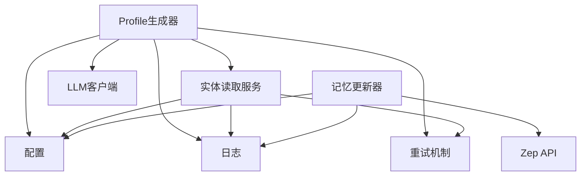

# 实体Profile生成

<cite>
**本文档引用的文件**
- [backend/app/services/zep_entity_reader.py](file://backend/app/services/zep_entity_reader.py)
- [backend/app/services/oasis_profile_generator.py](file://backend/app/services/oasis_profile_generator.py)
- [backend/app/services/zep_graph_memory_updater.py](file://backend/app/services/zep_graph_memory_updater.py)
- [backend/app/utils/llm_client.py](file://backend/app/utils/llm_client.py)
- [backend/app/utils/retry.py](file://backend/app/utils/retry.py)
- [backend/app/config.py](file://backend/app/config.py)
- [backend/app/utils/logger.py](file://backend/app/utils/logger.py)
- [backend/scripts/test_profile_format.py](file://backend/scripts/test_profile_format.py)
- [backend/scripts/run_twitter_simulation.py](file://backend/scripts/run_twitter_simulation.py)
- [backend/scripts/run_reddit_simulation.py](file://backend/scripts/run_reddit_simulation.py)
- [backend/app/services/graph_builder.py](file://backend/app/services/graph_builder.py)
- [backend/app/utils/file_parser.py](file://backend/app/utils/file_parser.py)
- [README.md](file://README.md)
</cite>

## 目录
1. [简介](#简介)
2. [项目结构](#项目结构)
3. [核心组件](#核心组件)
4. [架构概览](#架构概览)
5. [详细组件分析](#详细组件分析)
6. [依赖分析](#依赖分析)
7. [性能考虑](#性能考虑)
8. [故障排查指南](#故障排查指南)
9. [结论](#结论)
10. [附录](#附录)

## 简介
本文件面向MiroFish项目中的实体Profile生成系统，围绕从Zep图谱读取实体并过滤、边关系丰富化、实体质量评估，以及OASIS Agent Profile生成算法展开。文档还涵盖Twitter与Reddit平台Profile格式差异、实时保存机制、进度回调系统与错误恢复策略，并提供质量评估标准、优化建议与调试方法，以及扩展自定义实体类型的接口与高级配置选项。

## 项目结构
后端采用模块化设计，核心流程涉及：
- 图谱读取与过滤：从Zep图谱读取节点与边，筛选自定义实体类型并构建上下文
- Profile生成：基于实体类型区分个人与群体，结合Zep检索与LLM增强生成高质量人设
- 平台适配：Twitter（CSV）与Reddit（JSON）两种Profile格式的转换与保存
- 实时更新：将模拟Agent活动动态写回Zep图谱
- 配置与工具：统一配置、日志、重试与LLM客户端封装

**图表来源**
- [backend/app/services/zep_entity_reader.py](file://backend/app/services/zep_entity_reader.py#L70-L338)
- [backend/app/services/oasis_profile_generator.py](file://backend/app/services/oasis_profile_generator.py#L142-L581)
- [backend/app/services/zep_graph_memory_updater.py](file://backend/app/services/zep_graph_memory_updater.py#L201-L471)
- [backend/app/config.py](file://backend/app/config.py#L20-L76)

**章节来源**
- [README.md](file://README.md#L81-L88)

## 核心组件
- Zep实体读取与过滤服务：负责从Zep图谱读取节点与边，筛选自定义实体类型，构建实体上下文
- OASIS Profile生成器：根据实体类型生成Twitter/Reddit格式Profile，支持LLM增强与规则生成
- Zep图谱记忆更新器：将模拟Agent活动实时写回Zep图谱，支持批量与重试
- 配置与工具：统一配置加载、日志记录、重试机制与LLM客户端封装

**章节来源**
- [backend/app/services/zep_entity_reader.py](file://backend/app/services/zep_entity_reader.py#L70-L338)
- [backend/app/services/oasis_profile_generator.py](file://backend/app/services/oasis_profile_generator.py#L142-L581)
- [backend/app/services/zep_graph_memory_updater.py](file://backend/app/services/zep_graph_memory_updater.py#L201-L471)
- [backend/app/config.py](file://backend/app/config.py#L20-L76)

## 架构概览
整体流程从Zep图谱读取实体，经过过滤与上下文构建，再由Profile生成器产出Twitter/Reddit格式的Agent Profile，并在模拟过程中将Agent活动实时写回Zep图谱以丰富时序记忆。

**图表来源**
- [backend/app/services/zep_entity_reader.py](file://backend/app/services/zep_entity_reader.py#L222-L338)
- [backend/app/services/oasis_profile_generator.py](file://backend/app/services/oasis_profile_generator.py#L211-L274)
- [backend/app/services/zep_graph_memory_updater.py](file://backend/app/services/zep_graph_memory_updater.py#L390-L428)

## 详细组件分析

### Zep实体读取与过滤服务
- 职责：从Zep图谱读取节点与边，筛选自定义实体类型，构建实体上下文（属性、边事实、关联节点）
- 关键能力：
  - 带重试的Zep API调用
  - 实体类型筛选：排除默认标签“Entity”、“Node”
  - 上下文构建：聚合实体属性、边事实与关联节点摘要
- 输出：FilteredEntities对象，包含实体列表、类型集合与统计信息

**图表来源**
- [backend/app/services/zep_entity_reader.py](file://backend/app/services/zep_entity_reader.py#L126-L338)

**章节来源**
- [backend/app/services/zep_entity_reader.py](file://backend/app/services/zep_entity_reader.py#L70-L338)

### OASIS Profile生成器
- 职责：将实体转换为OASIS Agent Profile，支持Twitter与Reddit格式
- 核心算法：
  - 实体类型区分：个人实体与群体/机构实体
  - LLM增强策略：基于系统提示词与上下文生成详细人设；失败时降级为规则生成
  - 并行生成机制：使用线程池并行搜索Zep边与节点，提升检索效率
  - JSON修复策略：处理被截断或损坏的JSON输出
- 格式转换：
  - Twitter：CSV格式，包含user_id、user_name、name、bio、friend_count、follower_count、statuses_count、created_at等
  - Reddit：JSON格式，包含realname、username、bio、persona等字段，以及可选的age、gender、mbti、country、profession、interested_topics

**图表来源**
- [backend/app/services/oasis_profile_generator.py](file://backend/app/services/oasis_profile_generator.py#L28-L140)
- [backend/app/services/oasis_profile_generator.py](file://backend/app/services/oasis_profile_generator.py#L142-L581)

**章节来源**
- [backend/app/services/oasis_profile_generator.py](file://backend/app/services/oasis_profile_generator.py#L142-L581)

### Zep图谱记忆更新器
- 职责：监控模拟动作日志，将Agent活动实时写回Zep图谱，按平台分组批量发送
- 关键机制：
  - 批量发送：按平台分组累积到BATCH_SIZE后批量发送
  - 重试机制：失败时指数退避重试
  - 线程安全：使用锁保护缓冲区
  - 统计信息：记录总活动数、发送批次数、失败次数等

**图表来源**
- [backend/app/services/zep_graph_memory_updater.py](file://backend/app/services/zep_graph_memory_updater.py#L305-L428)

**章节来源**
- [backend/app/services/zep_graph_memory_updater.py](file://backend/app/services/zep_graph_memory_updater.py#L201-L471)

### 平台格式与转换
- Twitter（CSV）：用于OASIS Twitter平台，字段包含user_id、user_name、name、bio、friend_count、follower_count、statuses_count、created_at等
- Reddit（JSON）：用于OASIS Reddit平台，字段包含realname、username、bio、persona等，以及可选字段age、gender、mbti、country、profession、interested_topics
- 脚本验证：提供测试脚本验证格式正确性与字段完整性

**章节来源**
- [backend/app/services/oasis_profile_generator.py](file://backend/app/services/oasis_profile_generator.py#L60-L139)
- [backend/scripts/test_profile_format.py](file://backend/scripts/test_profile_format.py#L20-L127)

### 实时保存与进度回调
- 实时保存：Zep图谱记忆更新器在模拟过程中实时将Agent活动写回图谱，支持批量与重试
- 进度回调：图谱构建服务提供进度回调，将处理状态反馈给任务管理器
- 错误恢复：统一的重试机制与日志记录，确保异常情况下可恢复

**章节来源**
- [backend/app/services/zep_graph_memory_updater.py](file://backend/app/services/zep_graph_memory_updater.py#L390-L471)
- [backend/app/services/graph_builder.py](file://backend/app/services/graph_builder.py#L52-L185)
- [backend/app/utils/retry.py](file://backend/app/utils/retry.py#L15-L78)

## 依赖分析
- 外部依赖：Zep Cloud、OASIS、camel-ai、OpenAI兼容的LLM服务
- 内部依赖：配置、日志、重试、LLM客户端等工具模块
- 组件耦合：Profile生成器依赖Zep实体读取服务与配置；记忆更新器依赖Zep API与配置

**图表来源**
- [backend/app/services/oasis_profile_generator.py](file://backend/app/services/oasis_profile_generator.py#L180-L210)
- [backend/app/services/zep_entity_reader.py](file://backend/app/services/zep_entity_reader.py#L80-L86)
- [backend/app/services/zep_graph_memory_updater.py](file://backend/app/services/zep_graph_memory_updater.py#L231-L246)

**章节来源**
- [backend/app/config.py](file://backend/app/config.py#L20-L76)
- [backend/app/utils/logger.py](file://backend/app/utils/logger.py#L30-L108)
- [backend/app/utils/retry.py](file://backend/app/utils/retry.py#L132-L239)

## 性能考虑
- 并行检索：在Zep检索中使用线程池并行搜索边与节点，减少等待时间
- 批量写回：按平台分组累积到BATCH_SIZE后批量发送，降低API调用频率
- 重试退避：指数退避与抖动，避免雪崩效应
- 文本分块：图谱构建时对输入文本进行分块与重叠，提升处理吞吐量

**章节来源**
- [backend/app/services/oasis_profile_generator.py](file://backend/app/services/oasis_profile_generator.py#L368-L411)
- [backend/app/services/zep_graph_memory_updater.py](file://backend/app/services/zep_graph_memory_updater.py#L215-L229)
- [backend/app/utils/retry.py](file://backend/app/utils/retry.py#L15-L78)
- [backend/app/services/graph_builder.py](file://backend/app/services/graph_builder.py#L130-L147)

## 故障排查指南
- 配置缺失：检查LLM_API_KEY与ZEP_API_KEY是否正确配置
- API异常：查看日志中的重试与错误信息，确认网络与配额
- JSON解析失败：Profile生成器内置JSON修复策略，若仍失败，检查提示词与模型输出长度
- 图谱写回失败：检查Zep API Key与图谱ID，确认权限与配额

**章节来源**
- [backend/app/config.py](file://backend/app/config.py#L66-L75)
- [backend/app/utils/logger.py](file://backend/app/utils/logger.py#L108-L127)
- [backend/app/services/oasis_profile_generator.py](file://backend/app/services/oasis_profile_generator.py#L523-L581)
- [backend/app/services/zep_graph_memory_updater.py](file://backend/app/services/zep_graph_memory_updater.py#L406-L428)

## 结论
MiroFish的实体Profile生成系统通过Zep图谱读取与过滤、边关系丰富化与实体质量评估，结合OASIS Agent Profile生成算法，实现了Twitter与Reddit平台的高质量Profile输出。系统具备完善的实时保存、进度回调与错误恢复机制，并提供了扩展自定义实体类型的接口与高级配置选项，满足复杂场景下的预测仿真需求。

## 附录

### Profile质量评估标准
- 完整性：必需字段齐全（Twitter：user_id、user_name、name、bio、friend_count、follower_count、statuses_count、created_at；Reddit：realname、username、bio、persona）
- 一致性：实体摘要与属性、边事实、关联节点信息保持一致
- 可读性：Persona描述连贯、无换行符、符合实体类型定位
- 时效性：Profile创建时间合理，与实体上下文相符

**章节来源**
- [backend/app/services/oasis_profile_generator.py](file://backend/app/services/oasis_profile_generator.py#L60-L139)
- [backend/scripts/test_profile_format.py](file://backend/scripts/test_profile_format.py#L88-L124)

### 优化建议
- 提升检索效率：在Zep检索中增加缓存策略，避免重复查询
- 降低API成本：合理设置批量大小与重试次数，平衡性能与费用
- 增强鲁棒性：对模型输出进行更严格的校验与清洗
- 扩展实体类型：通过配置文件扩展INDIVIDUAL_ENTITY_TYPES与GROUP_ENTITY_TYPES

**章节来源**
- [backend/app/services/oasis_profile_generator.py](file://backend/app/services/oasis_profile_generator.py#L154-L178)
- [backend/app/services/zep_graph_memory_updater.py](file://backend/app/services/zep_graph_memory_updater.py#L215-L229)

### 调试方法
- 日志分析：利用统一日志模块输出详细信息，定位问题环节
- 重试策略：使用重试装饰器与客户端，自动处理瞬时异常
- 格式验证：使用测试脚本验证Twitter/Reddit格式正确性
- 配置检查：确认.env文件中的API Key与模型配置

**章节来源**
- [backend/app/utils/logger.py](file://backend/app/utils/logger.py#L30-L108)
- [backend/app/utils/retry.py](file://backend/app/utils/retry.py#L15-L78)
- [backend/scripts/test_profile_format.py](file://backend/scripts/test_profile_format.py#L20-L127)
- [backend/app/config.py](file://backend/app/config.py#L11-L17)

### 扩展接口与高级配置
- 自定义实体类型：在配置中扩展实体类型列表，影响过滤与生成策略
- 高级配置：通过Config类统一管理LLM与Zep配置，支持不同环境的灵活切换
- 并行与批量：根据负载调整Zep检索并行度与记忆更新批量大小

**章节来源**
- [backend/app/config.py](file://backend/app/config.py#L20-L76)
- [backend/app/services/oasis_profile_generator.py](file://backend/app/services/oasis_profile_generator.py#L154-L178)
- [backend/app/services/zep_graph_memory_updater.py](file://backend/app/services/zep_graph_memory_updater.py#L215-L229)