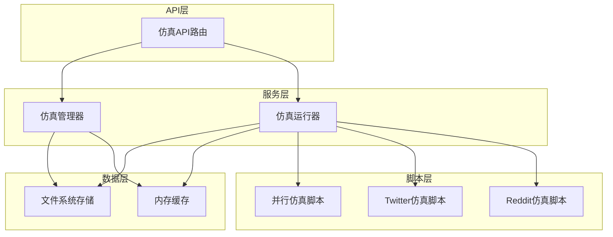
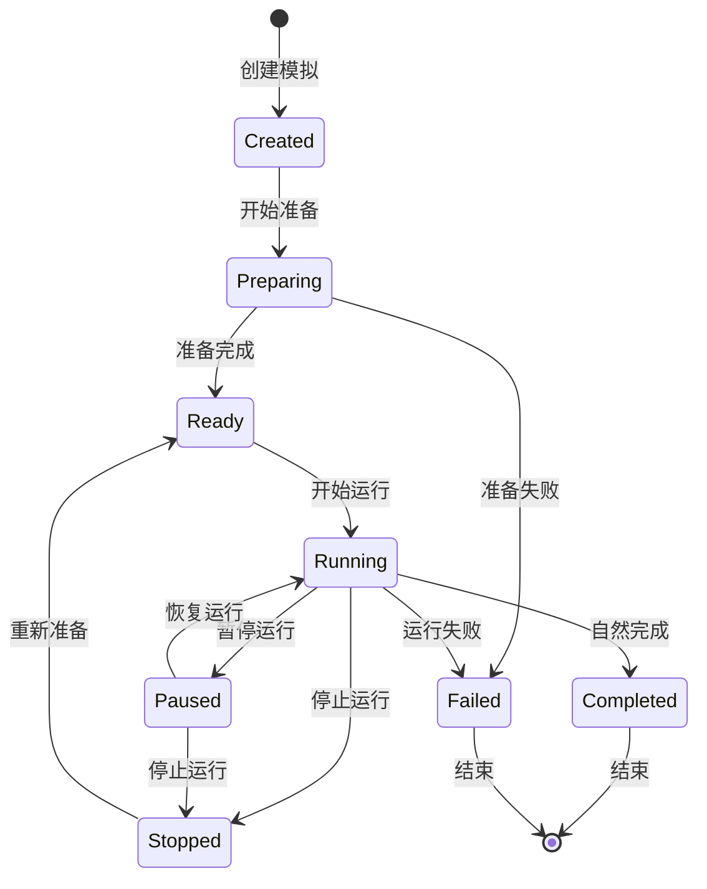
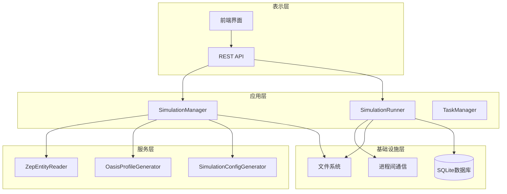
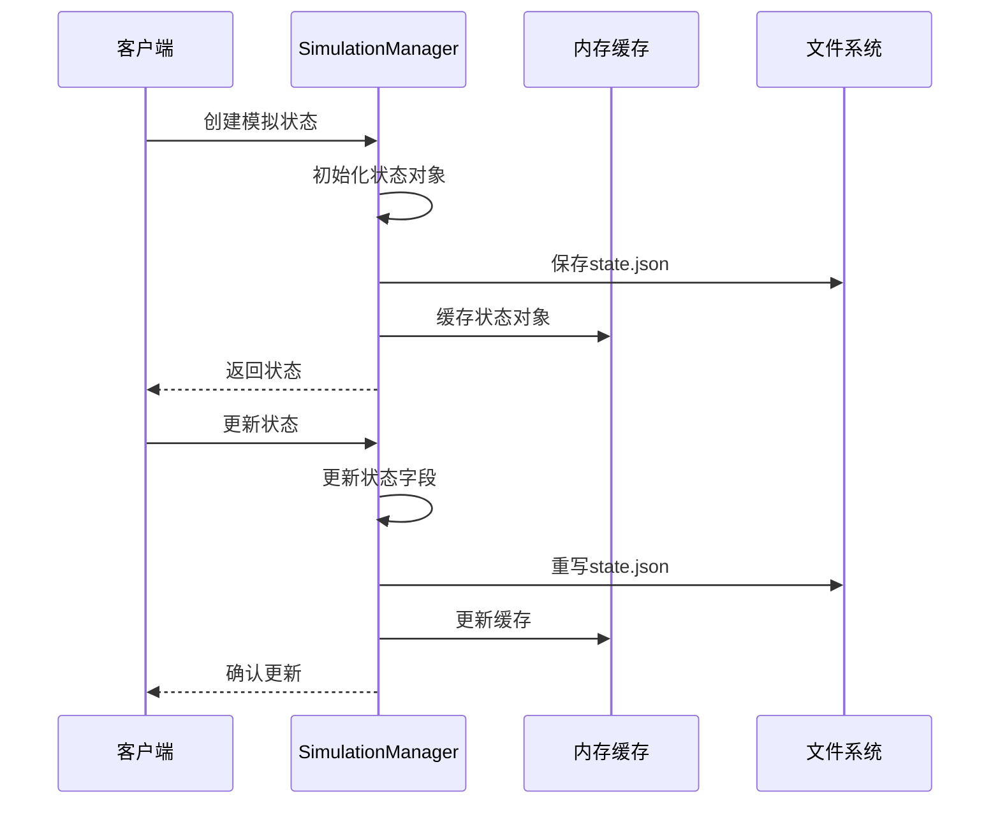
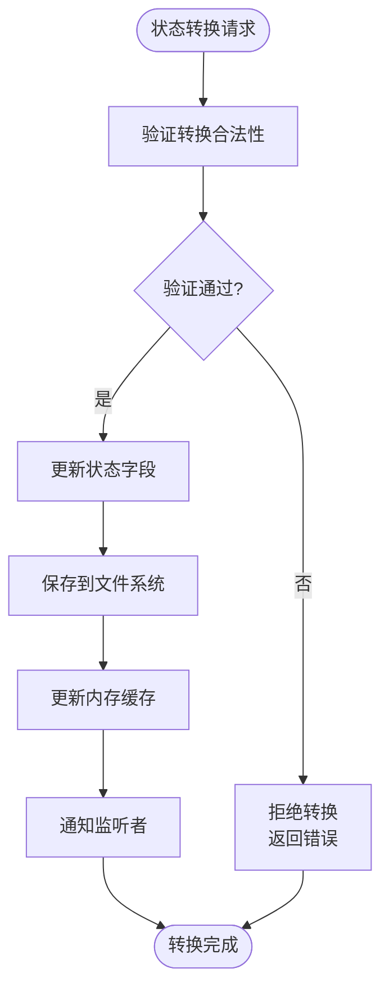
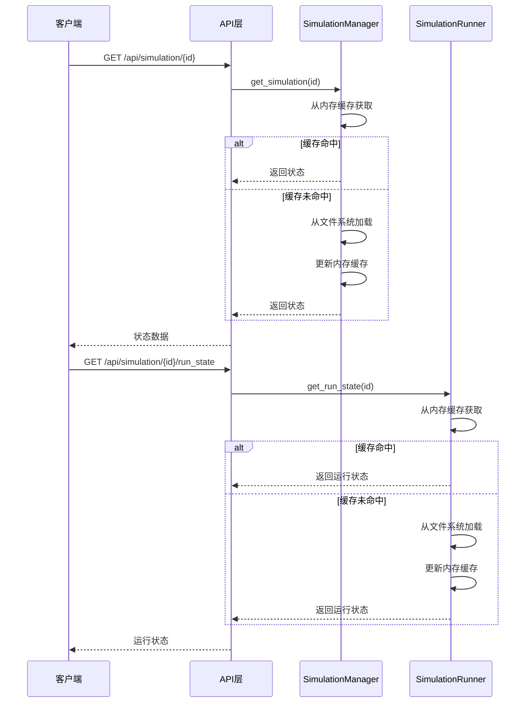
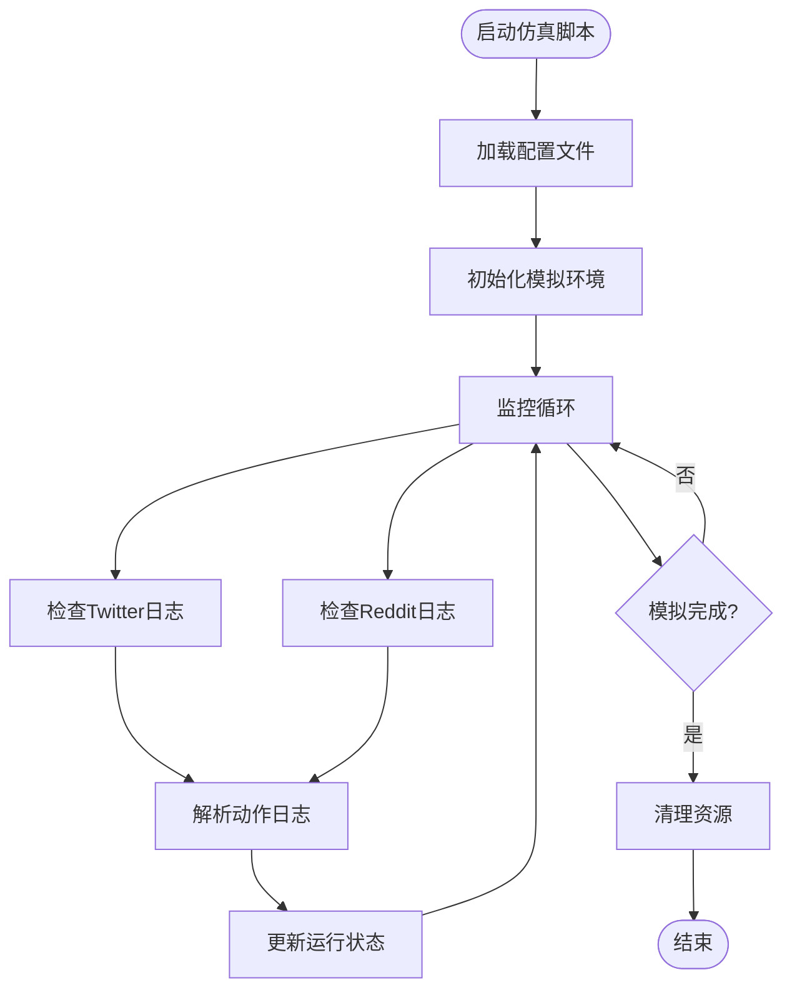
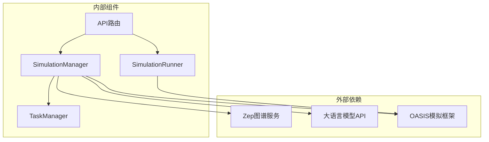
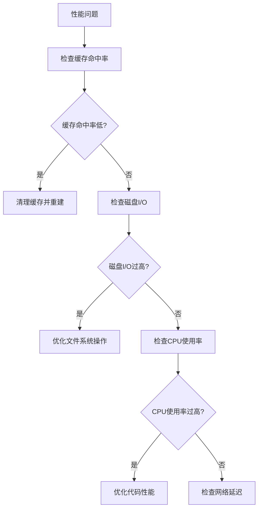

# 模拟状态管理

<cite>
**本文档引用的文件**
- [simulation_manager.py](file://backend/app/services/simulation_manager.py)
- [simulation_runner.py](file://backend/app/services/simulation_runner.py)
- [simulation.py](file://backend/app/api/simulation.py)
- [run_parallel_simulation.py](file://backend/scripts/run_parallel_simulation.py)
- [run_twitter_simulation.py](file://backend/scripts/run_twitter_simulation.py)
- [run_reddit_simulation.py](file://backend/scripts/run_reddit_simulation.py)
- [project.py](file://backend/app/models/project.py)
- [task.py](file://backend/app/models/task.py)
</cite>

## 目录
1. [简介](#简介)
2. [项目结构](#项目结构)
3. [核心组件](#核心组件)
4. [架构概览](#架构概览)
5. [详细组件分析](#详细组件分析)
6. [依赖关系分析](#依赖关系分析)
7. [性能考虑](#性能考虑)
8. [故障排除指南](#故障排除指南)
9. [结论](#结论)

## 简介

MiroFish的模拟状态管理系统是一个基于Python的分布式状态管理解决方案，专门设计用于管理OASIS模拟环境的全生命周期。该系统采用双层状态管理模式，结合文件持久化和内存缓存机制，实现了高可靠性的状态跟踪和监控能力。

系统的核心设计理念是通过明确的状态枚举和严格的生命周期管理，确保模拟环境从创建到完成的每个阶段都有清晰的状态标识和数据一致性保证。状态管理不仅涵盖了基本的模拟生命周期，还包括复杂的运行时监控、实时状态更新和异常处理机制。

## 项目结构

MiroFish项目采用模块化的架构设计，主要分为以下几个核心层次：

**图表来源**
- [simulation_manager.py](file://backend/app/services/simulation_manager.py#L114-L192)
- [simulation_runner.py](file://backend/app/services/simulation_runner.py#L195-L225)

**章节来源**
- [simulation_manager.py](file://backend/app/services/simulation_manager.py#L1-L529)
- [simulation_runner.py](file://backend/app/services/simulation_runner.py#L1-L800)

## 核心组件

### 状态枚举系统

系统定义了完整的模拟状态生命周期，确保每个状态转换都有明确的业务含义和约束条件：

**图表来源**
- [simulation_manager.py](file://backend/app/services/simulation_manager.py#L24-L34)

### 数据模型设计

SimulationState数据模型是整个系统的核心，包含了模拟环境的完整状态信息：

| 字段名称 | 类型 | 描述 | 默认值 |
|---------|------|------|--------|
| simulation_id | str | 模拟唯一标识符 | - |
| project_id | str | 项目关联ID | - |
| graph_id | str | Zep图谱ID | - |
| enable_twitter | bool | Twitter平台启用状态 | True |
| enable_reddit | bool | Reddit平台启用状态 | True |
| status | SimulationStatus | 当前状态 | SimulationStatus.CREATED |
| entities_count | int | 实体数量 | 0 |
| profiles_count | int | Profile数量 | 0 |
| entity_types | List[str] | 实体类型列表 | [] |
| config_generated | bool | 配置生成状态 | False |
| config_reasoning | str | 配置生成原因 | "" |
| current_round | int | 当前轮次 | 0 |
| twitter_status | str | Twitter运行状态 | "not_started" |
| reddit_status | str | Reddit运行状态 | "not_started" |
| created_at | str | 创建时间 | 当前时间 |
| updated_at | str | 更新时间 | 当前时间 |
| error | Optional[str] | 错误信息 | None |

**章节来源**
- [simulation_manager.py](file://backend/app/services/simulation_manager.py#L42-L112)

## 架构概览

系统采用分层架构设计，实现了清晰的关注点分离：

**图表来源**
- [simulation_manager.py](file://backend/app/services/simulation_manager.py#L114-L124)
- [simulation_runner.py](file://backend/app/services/simulation_runner.py#L195-L205)

## 详细组件分析

### SimulationManager - 状态管理核心

SimulationManager是整个状态管理系统的核心组件，负责模拟生命周期的完整管理：

#### 状态持久化机制

系统采用了双重持久化策略，确保数据的安全性和可靠性：

**图表来源**
- [simulation_manager.py](file://backend/app/services/simulation_manager.py#L144-L155)

#### 状态转换验证

系统实现了严格的状态转换验证机制，确保状态变更的合法性和一致性：

**图表来源**
- [simulation_manager.py](file://backend/app/services/simulation_manager.py#L229-L457)

**章节来源**
- [simulation_manager.py](file://backend/app/services/simulation_manager.py#L114-L529)

### SimulationRunner - 运行时监控

SimulationRunner负责监控实际的模拟运行状态，实现了复杂的实时数据收集和处理机制：

#### 运行状态存储

运行时状态通过专门的run_state.json文件进行持久化存储：

| 字段名称 | 类型 | 描述 | 更新时机 |
|---------|------|------|----------|
| runner_status | RunnerStatus | 运行器状态 | 进程状态变化时 |
| current_round | int | 当前轮次 | 模拟轮次推进时 |
| total_rounds | int | 总轮次 | 配置加载时 |
| simulated_hours | int | 模拟小时数 | 轮次事件处理时 |
| twitter_running | bool | Twitter运行状态 | 平台启动/停止时 |
| reddit_running | bool | Reddit运行状态 | 平台启动/停止时 |
| twitter_actions_count | int | Twitter动作计数 | 动作记录时 |
| reddit_actions_count | int | Reddit动作计数 | 动作记录时 |
| recent_actions | List[AgentAction] | 最近动作列表 | 新动作到达时 |
| started_at | Optional[str] | 开始时间 | 进程启动时 |
| updated_at | str | 更新时间 | 状态更新时 |
| completed_at | Optional[str] | 完成时间 | 进程结束时 |

**章节来源**
- [simulation_runner.py](file://backend/app/services/simulation_runner.py#L100-L193)

### API接口设计

系统提供了完整的REST API接口，支持模拟状态的查询、管理和控制：

#### 状态查询接口

**图表来源**
- [simulation.py](file://backend/app/api/simulation.py#L750-L781)
- [simulation_runner.py](file://backend/app/services/simulation_runner.py#L230-L240)

**章节来源**
- [simulation.py](file://backend/app/api/simulation.py#L750-L800)

### 脚本集成机制

系统通过预设脚本实现与实际模拟环境的集成：

**图表来源**
- [run_parallel_simulation.py](file://backend/scripts/run_parallel_simulation.py#L629-L647)
- [simulation_runner.py](file://backend/app/services/simulation_runner.py#L478-L577)

**章节来源**
- [run_parallel_simulation.py](file://backend/scripts/run_parallel_simulation.py#L1-L800)
- [run_twitter_simulation.py](file://backend/scripts/run_twitter_simulation.py#L1-L781)
- [run_reddit_simulation.py](file://backend/scripts/run_reddit_simulation.py#L1-L770)

## 依赖关系分析

系统采用松耦合的设计原则，通过清晰的接口定义实现组件间的解耦：

**图表来源**
- [simulation_manager.py](file://backend/app/services/simulation_manager.py#L15-L21)
- [simulation_runner.py](file://backend/app/services/simulation_runner.py#L21-L26)

**章节来源**
- [simulation_manager.py](file://backend/app/services/simulation_manager.py#L1-L529)
- [simulation_runner.py](file://backend/app/services/simulation_runner.py#L1-L800)

## 性能考虑

### 内存缓存策略

系统实现了智能的内存缓存机制，平衡了内存使用和访问性能：

- **LRU缓存淘汰**：当内存压力增大时，自动淘汰最久未使用的状态对象
- **懒加载机制**：只有在首次访问时才从文件系统加载状态数据
- **批量更新优化**：支持批量状态更新操作，减少文件I/O次数

### 文件系统优化

- **原子写入**：所有状态更新都采用临时文件+原子替换的方式，确保数据一致性
- **增量更新**：支持部分字段更新，避免不必要的完整文件重写
- **压缩存储**：对历史状态数据进行压缩存储，节省磁盘空间

### 并发控制

- **线程安全**：所有状态访问都经过锁保护，确保多线程环境下的数据一致性
- **无锁读取**：读操作不使用锁，提高读取性能
- **乐观锁机制**：在状态冲突时自动重试，减少锁竞争

## 故障排除指南

### 常见问题诊断

#### 状态不一致问题

当遇到状态不一致问题时，可以按照以下步骤进行排查：

1. **检查文件系统**：确认state.json文件是否存在且格式正确
2. **验证内存缓存**：检查SimulationManager的缓存是否同步
3. **查看日志文件**：分析系统日志中的错误信息和异常堆栈

#### 性能问题诊断

#### 异常处理机制

系统实现了完善的异常处理机制：

- **自动重试**：对于临时性错误，系统会自动重试一定次数
- **降级策略**：在服务不可用时，系统会切换到降级模式
- **错误隔离**：单个组件的错误不会影响其他组件的正常运行

**章节来源**
- [simulation_manager.py](file://backend/app/services/simulation_manager.py#L449-L456)
- [simulation_runner.py](file://backend/app/services/simulation_runner.py#L544-L548)

## 结论

MiroFish的模拟状态管理系统通过精心设计的数据模型、严格的生命周期管理和高效的持久化策略，为复杂的模拟环境提供了可靠的运行时支撑。系统的核心优势体现在：

1. **完整的状态管理**：从创建到完成的全生命周期状态跟踪
2. **高可靠性设计**：双重持久化和内存缓存机制确保数据安全
3. **实时监控能力**：通过日志解析实现实时状态更新
4. **灵活的扩展性**：模块化设计支持新功能的快速集成

该系统为MiroFish平台提供了稳定可靠的模拟运行基础，支持大规模的并行模拟任务，为用户提供了完整的模拟体验。