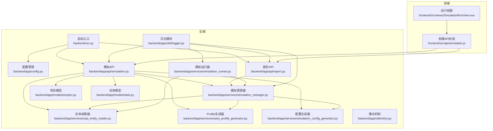
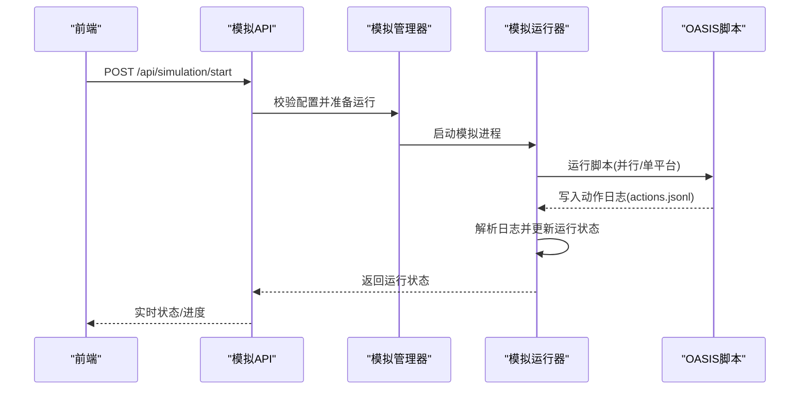
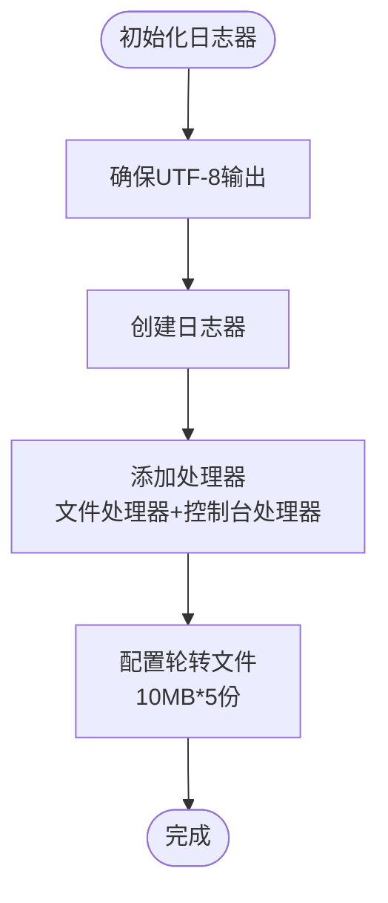
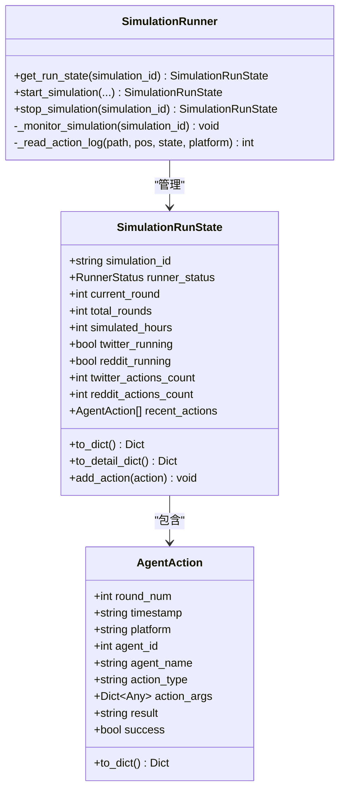
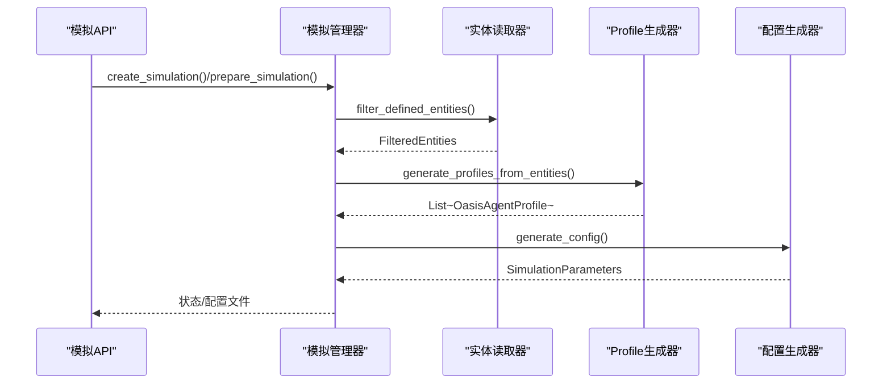
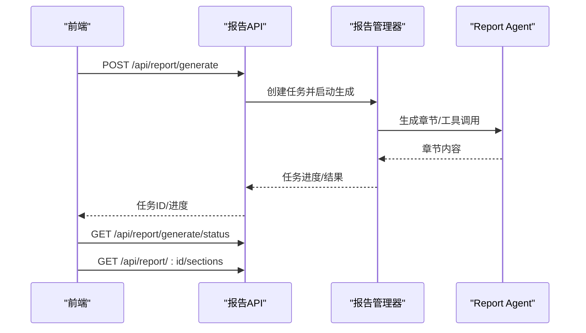
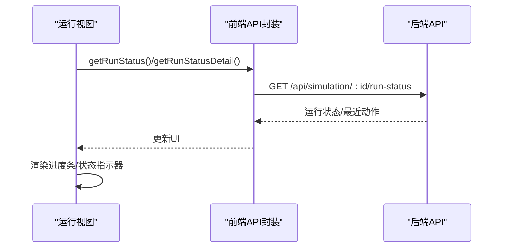
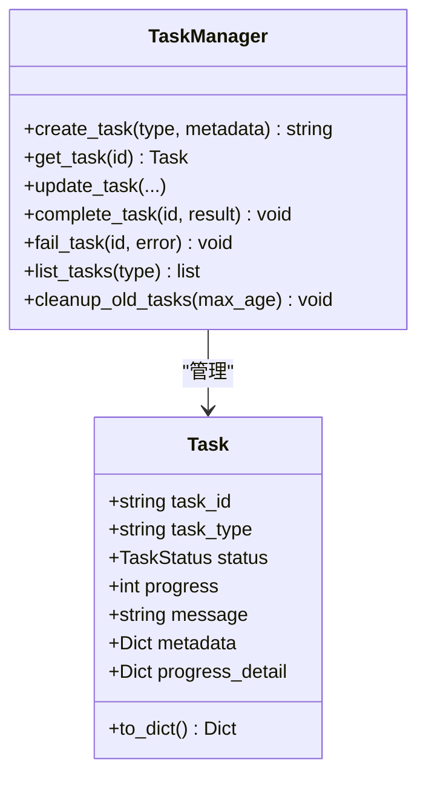
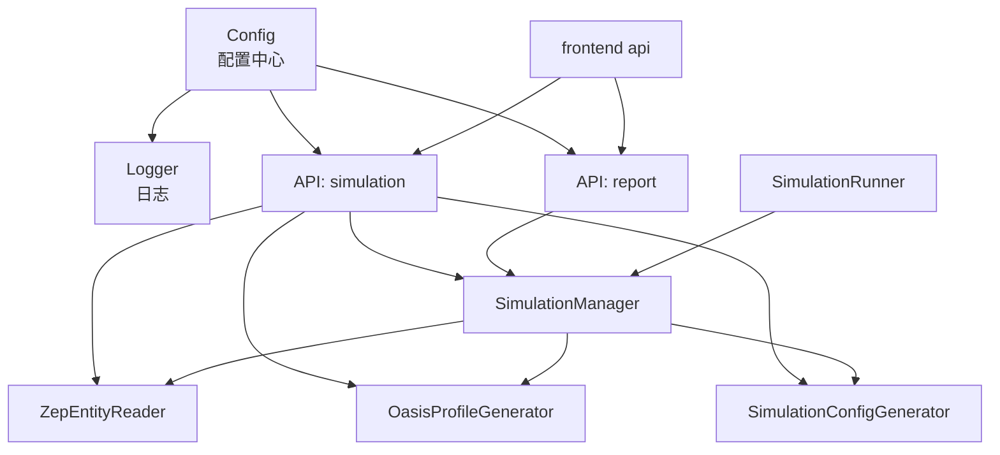

# 模拟监控系统

<cite>
**本文档引用的文件**
- [backend/run.py](file://backend/run.py)
- [backend/app/config.py](file://backend/app/config.py)
- [backend/app/utils/logger.py](file://backend/app/utils/logger.py)
- [backend/app/api/simulation.py](file://backend/app/api/simulation.py)
- [backend/app/services/simulation_manager.py](file://backend/app/services/simulation_manager.py)
- [backend/app/models/project.py](file://backend/app/models/project.py)
- [backend/app/services/simulation_runner.py](file://backend/app/services/simulation_runner.py)
- [backend/app/api/report.py](file://backend/app/api/report.py)
- [backend/app/utils/retry.py](file://backend/app/utils/retry.py)
- [backend/app/services/zep_entity_reader.py](file://backend/app/services/zep_entity_reader.py)
- [backend/app/services/oasis_profile_generator.py](file://backend/app/services/oasis_profile_generator.py)
- [backend/app/services/simulation_config_generator.py](file://backend/app/services/simulation_config_generator.py)
- [backend/app/models/task.py](file://backend/app/models/task.py)
- [frontend/src/api/simulation.js](file://frontend/src/api/simulation.js)
- [frontend/src/views/SimulationRunView.vue](file://frontend/src/views/SimulationRunView.vue)
</cite>

## 目录
1. [简介](#简介)
2. [项目结构](#项目结构)
3. [核心组件](#核心组件)
4. [架构概览](#架构概览)
5. [详细组件分析](#详细组件分析)
6. [依赖关系分析](#依赖关系分析)
7. [性能考虑](#性能考虑)
8. [故障排查指南](#故障排查指南)
9. [结论](#结论)
10. [附录](#附录)

## 简介
本系统为MiroFish模拟监控系统，围绕OASIS模拟平台构建，提供从图谱实体读取、Agent人设生成、模拟配置智能生成，到模拟运行监控、实时状态展示与报告生成的全链路能力。系统通过统一的API接口暴露状态查询、历史数据获取与实时事件订阅能力，并内置完善的日志记录策略、重试机制与任务状态管理，确保复杂模拟任务的稳定性与可观测性。

## 项目结构
后端采用Flask框架，按功能模块划分：API层负责对外接口；服务层封装业务逻辑；模型层管理项目与任务状态；工具层提供日志、重试等通用能力。前端采用Vue3 + Vite，通过Axios封装请求并与后端交互。

**图表来源**
- [backend/run.py](file://backend/run.py#L25-L46)
- [backend/app/api/simulation.py](file://backend/app/api/simulation.py#L1-L800)
- [backend/app/api/report.py](file://backend/app/api/report.py#L1-L800)
- [backend/app/services/simulation_manager.py](file://backend/app/services/simulation_manager.py#L1-L529)
- [backend/app/services/simulation_runner.py](file://backend/app/services/simulation_runner.py#L1-L800)
- [backend/app/services/zep_entity_reader.py](file://backend/app/services/zep_entity_reader.py#L1-L200)
- [backend/app/services/oasis_profile_generator.py](file://backend/app/services/oasis_profile_generator.py#L1-L200)
- [backend/app/services/simulation_config_generator.py](file://backend/app/services/simulation_config_generator.py#L1-L200)
- [backend/app/models/project.py](file://backend/app/models/project.py#L1-L306)
- [backend/app/models/task.py](file://backend/app/models/task.py#L1-L185)
- [backend/app/utils/logger.py](file://backend/app/utils/logger.py#L1-L127)
- [backend/app/utils/retry.py](file://backend/app/utils/retry.py#L1-L239)
- [frontend/src/api/simulation.js](file://frontend/src/api/simulation.js#L1-L188)
- [frontend/src/views/SimulationRunView.vue](file://frontend/src/views/SimulationRunView.vue#L1-L200)

**章节来源**
- [backend/run.py](file://backend/run.py#L25-L46)
- [backend/app/config.py](file://backend/app/config.py#L1-L76)

## 核心组件
- 启动入口与配置：负责应用启动、配置校验与服务运行。
- 日志系统：统一输出到控制台与文件，支持UTF-8编码与轮转。
- 模拟API：提供实体读取、模拟创建与准备、运行状态查询、配置与Profile获取等接口。
- 模拟管理器：管理模拟生命周期，协调实体读取、Profile生成、配置生成与文件准备。
- 模拟运行器：后台运行OASIS模拟，解析动作日志，维护实时运行状态。
- 报告API：异步生成报告，提供进度查询与章节分发。
- 任务模型：统一管理长时间运行任务的状态与进度。
- 重试机制：对外部API调用提供指数退避与抖动的重试策略。
- 前端API封装：统一HTTP请求与重试策略，便于前端调用。

**章节来源**
- [backend/app/utils/logger.py](file://backend/app/utils/logger.py#L30-L88)
- [backend/app/api/simulation.py](file://backend/app/api/simulation.py#L164-L800)
- [backend/app/services/simulation_manager.py](file://backend/app/services/simulation_manager.py#L114-L529)
- [backend/app/services/simulation_runner.py](file://backend/app/services/simulation_runner.py#L195-L800)
- [backend/app/api/report.py](file://backend/app/api/report.py#L24-L800)
- [backend/app/models/task.py](file://backend/app/models/task.py#L54-L185)
- [backend/app/utils/retry.py](file://backend/app/utils/retry.py#L15-L78)
- [frontend/src/api/simulation.js](file://frontend/src/api/simulation.js#L1-L188)

## 架构概览
系统采用分层架构：前端通过HTTP与后端交互；后端API层负责路由与参数校验；服务层封装业务流程；模型层持久化状态；工具层提供通用能力。模拟运行器通过子进程运行OASIS脚本，实时解析动作日志并维护运行状态；报告生成器异步生成报告并支持分章节输出。

**图表来源**
- [backend/app/api/simulation.py](file://backend/app/api/simulation.py#L750-L800)
- [backend/app/services/simulation_manager.py](file://backend/app/services/simulation_manager.py#L312-L478)
- [backend/app/services/simulation_runner.py](file://backend/app/services/simulation_runner.py#L312-L577)

## 详细组件分析

### 日志记录策略
- 输出目标：同时输出到控制台与按日期命名的文件，文件大小10MB并保留5份备份。
- 编码处理：确保Windows控制台UTF-8输出，避免中文乱码。
- 格式规范：文件使用详细格式，控制台使用简洁格式，便于开发调试与生产审计。
- 存储位置：日志目录位于项目根目录下的logs文件夹。

**图表来源**
- [backend/app/utils/logger.py](file://backend/app/utils/logger.py#L13-L88)

**章节来源**
- [backend/app/utils/logger.py](file://backend/app/utils/logger.py#L30-L88)

### 模拟状态监控机制
- 实时状态：运行器维护SimulationRunState，包含当前轮次、模拟小时数、各平台状态、最近动作等。
- 进度跟踪：通过解析Twitter/Reddit actions.jsonl中的事件，更新轮次与完成状态。
- 异常检测：监控线程捕获进程退出码与错误日志，自动标记失败并记录错误信息。
- 状态持久化：运行状态定期写入run_state.json，支持重启后恢复。

**图表来源**
- [backend/app/services/simulation_runner.py](file://backend/app/services/simulation_runner.py#L47-L193)
- [backend/app/services/simulation_runner.py](file://backend/app/services/simulation_runner.py#L195-L800)

**章节来源**
- [backend/app/services/simulation_runner.py](file://backend/app/services/simulation_runner.py#L195-L800)

### 模拟准备与配置生成
- 实体读取：从Zep图谱读取节点与边，筛选预定义实体类型，支持富上下文检索。
- Profile生成：将实体转换为OASIS Agent Profile，区分个人与群体实体，支持LLM增强。
- 配置生成：基于模拟需求与图谱信息，智能生成时间、事件、平台与Agent活动配置。
- 文件准备：生成reddit_profiles.json与twitter_profiles.csv，保存simulation_config.json。

**图表来源**
- [backend/app/api/simulation.py](file://backend/app/api/simulation.py#L164-L478)
- [backend/app/services/simulation_manager.py](file://backend/app/services/simulation_manager.py#L229-L457)
- [backend/app/services/zep_entity_reader.py](file://backend/app/services/zep_entity_reader.py#L70-L200)
- [backend/app/services/oasis_profile_generator.py](file://backend/app/services/oasis_profile_generator.py#L142-L200)
- [backend/app/services/simulation_config_generator.py](file://backend/app/services/simulation_config_generator.py#L199-L200)

**章节来源**
- [backend/app/api/simulation.py](file://backend/app/api/simulation.py#L239-L478)
- [backend/app/services/simulation_manager.py](file://backend/app/services/simulation_manager.py#L229-L457)

### 报告生成与分章节输出
- 异步生成：创建任务并启动后台线程，逐步生成报告章节。
- 实时进度：提供进度查询接口，支持分章节内容增量获取。
- 对话接口：Report Agent可检索图谱与模拟数据进行问答。

**图表来源**
- [backend/app/api/report.py](file://backend/app/api/report.py#L24-L267)
- [backend/app/api/report.py](file://backend/app/api/report.py#L564-L654)

**章节来源**
- [backend/app/api/report.py](file://backend/app/api/report.py#L24-L267)
- [backend/app/api/report.py](file://backend/app/api/report.py#L564-L654)

### 前端监控与可视化
- 实时状态：前端定时轮询运行状态接口，展示进度条、状态指示器与最近动作。
- 视图切换：支持图谱、双栏与工作台布局，便于观察模拟进展。
- 日志展示：在界面中展示系统日志，辅助定位问题。

**图表来源**
- [frontend/src/views/SimulationRunView.vue](file://frontend/src/views/SimulationRunView.vue#L1-L200)
- [frontend/src/api/simulation.js](file://frontend/src/api/simulation.js#L99-L109)

**章节来源**
- [frontend/src/views/SimulationRunView.vue](file://frontend/src/views/SimulationRunView.vue#L1-L200)
- [frontend/src/api/simulation.js](file://frontend/src/api/simulation.js#L99-L109)

### 任务状态管理与重试机制
- 任务模型：TaskManager提供线程安全的任务状态管理，支持进度、消息与详细进度信息。
- 重试策略：对外部API调用提供指数退避与抖动，降低瞬时故障影响。
- 异常处理：在模拟准备与运行过程中捕获异常并更新任务状态与错误信息。

**图表来源**
- [backend/app/models/task.py](file://backend/app/models/task.py#L22-L185)

**章节来源**
- [backend/app/models/task.py](file://backend/app/models/task.py#L54-L185)
- [backend/app/utils/retry.py](file://backend/app/utils/retry.py#L15-L78)

## 依赖关系分析
- 配置依赖：Config集中管理LLM、Zep、上传与模拟相关配置，启动时进行校验。
- 日志依赖：各模块通过get_logger获取日志器，避免重复配置。
- 外部服务：Zep用于图谱读取，OpenAI用于LLM调用，OASIS脚本用于模拟执行。
- 前后端通信：前端通过Axios封装的API函数与后端交互，统一处理重试与错误。

**图表来源**
- [backend/app/config.py](file://backend/app/config.py#L20-L76)
- [backend/app/utils/logger.py](file://backend/app/utils/logger.py#L30-L88)
- [backend/app/api/simulation.py](file://backend/app/api/simulation.py#L1-L800)
- [backend/app/api/report.py](file://backend/app/api/report.py#L1-L800)
- [backend/app/services/simulation_manager.py](file://backend/app/services/simulation_manager.py#L1-L529)
- [backend/app/services/simulation_runner.py](file://backend/app/services/simulation_runner.py#L1-L800)
- [frontend/src/api/simulation.js](file://frontend/src/api/simulation.js#L1-L188)

**章节来源**
- [backend/app/config.py](file://backend/app/config.py#L20-L76)
- [backend/app/utils/logger.py](file://backend/app/utils/logger.py#L30-L88)

## 性能考虑
- I/O与并发：模拟准备阶段涉及大量文件读写与LLM调用，建议合理设置并行生成数量与重试参数，避免阻塞。
- 日志轮转：文件大小与备份数量需结合磁盘容量与保留策略调整，防止磁盘压力过大。
- 进程管理：运行器通过子进程运行脚本并创建新会话组，确保跨平台终止模拟进程，减少僵尸进程。
- 前端轮询：前端应合理设置轮询间隔，避免频繁请求造成后端压力。

## 故障排查指南
- 配置校验：启动时若配置缺失，会打印错误并退出。检查LLM_API_KEY、ZEP_API_KEY等关键配置。
- 日志定位：查看logs目录下当日日志文件，结合控制台输出定位问题。
- 任务状态：通过任务ID查询prepare/report生成进度，确认阶段与错误信息。
- 运行状态：检查run_state.json与actions.jsonl，确认轮次、平台完成状态与最近动作。
- 外部服务：Zep与LLM调用失败时，利用重试机制自动恢复；若持续失败，检查网络与密钥配置。

**章节来源**
- [backend/run.py](file://backend/run.py#L27-L34)
- [backend/app/utils/logger.py](file://backend/app/utils/logger.py#L108-L127)
- [backend/app/api/simulation.py](file://backend/app/api/simulation.py#L637-L747)
- [backend/app/api/report.py](file://backend/app/api/report.py#L198-L267)
- [backend/app/services/simulation_runner.py](file://backend/app/services/simulation_runner.py#L578-L577)

## 结论
本系统通过清晰的分层设计与完善的监控机制，实现了从图谱到模拟再到报告的全链路可观测性。日志、任务与运行状态三者协同，确保复杂模拟任务的稳定性与可追溯性。前端提供直观的可视化展示，配合异步报告生成与分章节输出，满足研究与分析场景的多样化需求。

## 附录
- 监控API接口清单
  - 状态查询：GET /api/simulation/:simulation_id
  - 运行状态：GET /api/simulation/:simulation_id/run-status
  - 运行状态详情：GET /api/simulation/:simulation_id/run-status/detail
  - 历史数据：GET /api/simulation/:simulation_id/posts
  - 时间线：GET /api/simulation/:simulation_id/timeline
  - Agent统计：GET /api/simulation/:simulation_id/agent-stats
  - 动作历史：GET /api/simulation/:simulation_id/actions
  - 报告生成：POST /api/report/generate
  - 报告进度：GET /api/report/:report_id/progress
  - 章节列表：GET /api/report/:report_id/sections
  - 章节内容：GET /api/report/:report_id/section/:index
- 性能监控指标建议
  - CPU使用率：通过系统监控工具采集后端进程CPU使用率。
  - 内存占用：监控Python进程RSS与VMS，关注峰值与增长趋势。
  - 磁盘I/O：统计logs、uploads与模拟数据目录的读写速率。
  - 网络流量：监控Zep与LLM服务的请求/响应吞吐量。
- 告警机制与通知
  - 建议在任务失败、进程异常退出、磁盘空间不足等场景触发告警。
  - 可集成邮件/企业微信等通知渠道，结合日志与错误信息推送。
- 扩展接口与自定义指标
  - 在SimulationParameters中新增自定义配置字段，通过配置生成器扩展参数。
  - 在SimulationRunState中增加自定义指标字段，运行器解析日志时补充统计信息。
  - 在ReportManager中扩展章节模板与分析维度，满足特定领域需求。