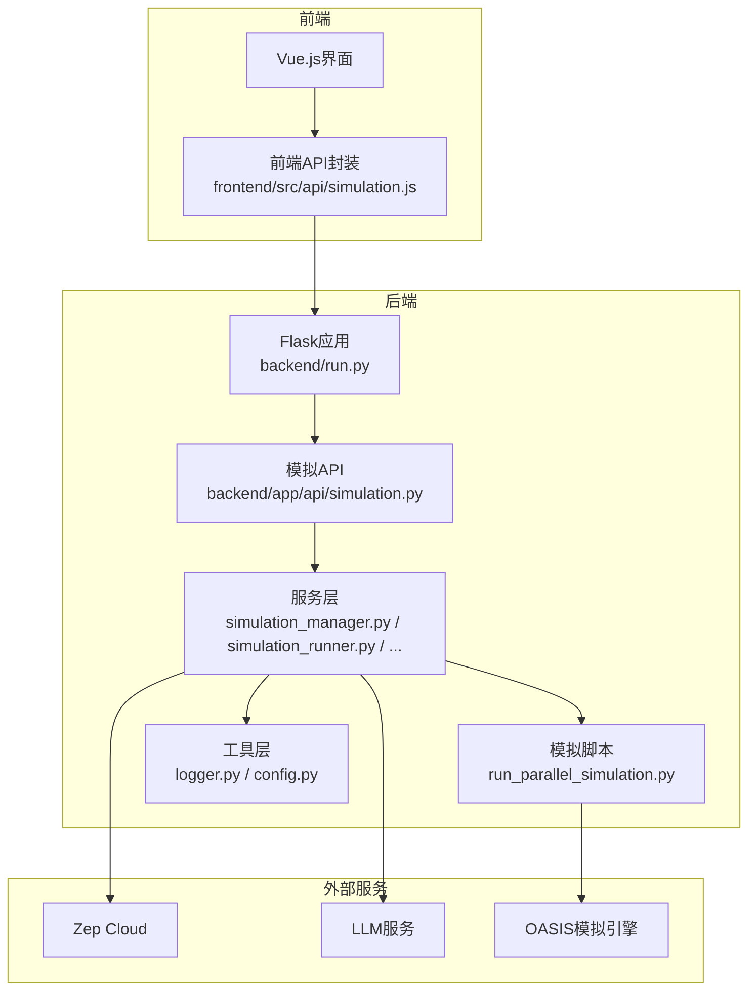
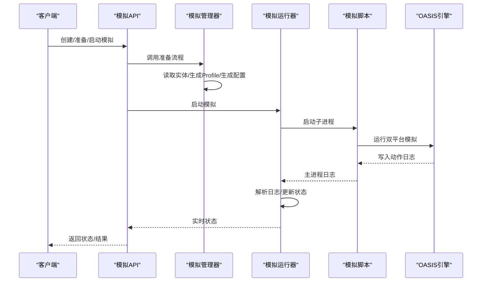
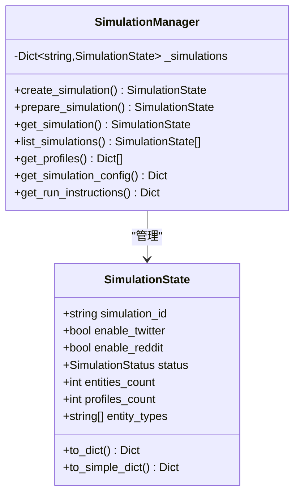
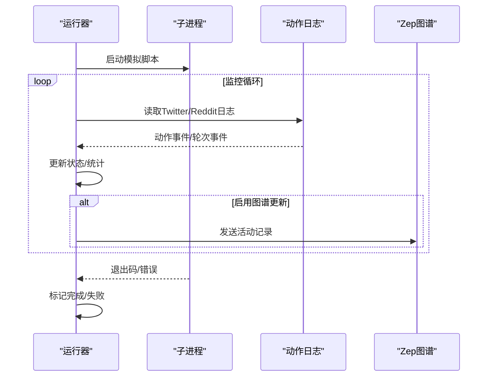
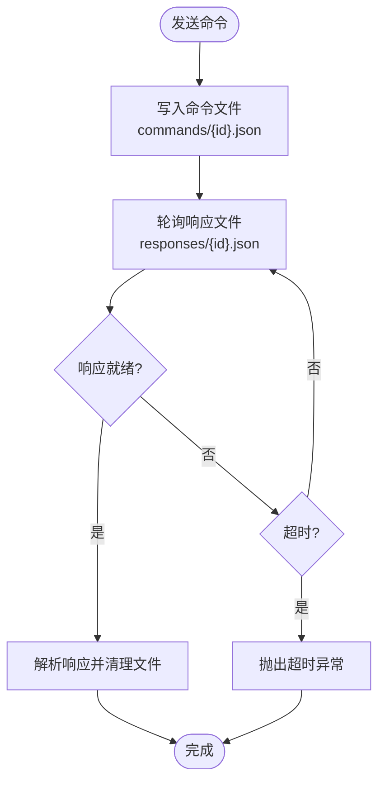
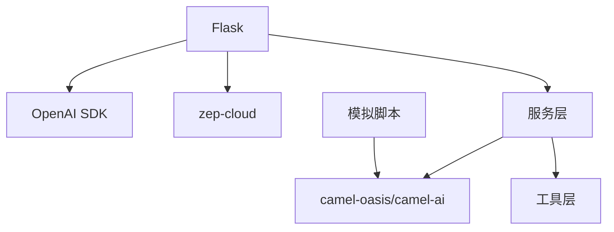

# 模拟管理系统

<cite>
**本文档引用的文件**
- [backend/run.py](file://backend/run.py)
- [backend/app/services/simulation_manager.py](file://backend/app/services/simulation_manager.py)
- [backend/app/services/simulation_runner.py](file://backend/app/services/simulation_runner.py)
- [backend/app/services/simulation_ipc.py](file://backend/app/services/simulation_ipc.py)
- [backend/app/services/zep_entity_reader.py](file://backend/app/services/zep_entity_reader.py)
- [backend/app/services/oasis_profile_generator.py](file://backend/app/services/oasis_profile_generator.py)
- [backend/app/services/simulation_config_generator.py](file://backend/app/services/simulation_config_generator.py)
- [backend/app/api/simulation.py](file://backend/app/api/simulation.py)
- [backend/scripts/run_parallel_simulation.py](file://backend/scripts/run_parallel_simulation.py)
- [backend/scripts/action_logger.py](file://backend/scripts/action_logger.py)
- [backend/app/utils/logger.py](file://backend/app/utils/logger.py)
- [backend/app/config.py](file://backend/app/config.py)
- [backend/requirements.txt](file://backend/requirements.txt)
- [frontend/src/api/simulation.js](file://frontend/src/api/simulation.js)
- [README.md](file://README.md)
</cite>

## 目录
1. [简介](#简介)
2. [项目结构](#项目结构)
3. [核心组件](#核心组件)
4. [架构概览](#架构概览)
5. [详细组件分析](#详细组件分析)
6. [依赖关系分析](#依赖关系分析)
7. [性能考虑](#性能考虑)
8. [故障排查指南](#故障排查指南)
9. [结论](#结论)
10. [附录](#附录)

## 简介
本项目为基于多智能体技术的模拟管理系统，支持Twitter与Reddit双平台并行模拟。系统通过图谱驱动的实体识别与LLM智能生成，自动完成Agent人设与模拟配置，提供实时状态监控、进程间通信与异常处理能力。后端采用Flask提供REST API，前端基于Vue.js构建可视化界面，整体架构强调自动化、可观测性与可扩展性。

## 项目结构
后端采用分层架构，核心模块包括：
- API层：提供模拟生命周期管理、状态查询、IPC交互等接口
- 服务层：封装模拟管理、运行器、配置生成、实体读取等业务逻辑
- 脚本层：OASIS模拟执行脚本，负责双平台并行运行与日志解析
- 工具层：日志、配置、重试等基础设施

**图表来源**
- [backend/run.py](file://backend/run.py#L1-L51)
- [backend/app/api/simulation.py](file://backend/app/api/simulation.py#L1-L120)
- [backend/app/services/simulation_manager.py](file://backend/app/services/simulation_manager.py#L1-L120)
- [backend/app/services/simulation_runner.py](file://backend/app/services/simulation_runner.py#L1-L120)
- [backend/scripts/run_parallel_simulation.py](file://backend/scripts/run_parallel_simulation.py#L1-L120)

**章节来源**
- [backend/run.py](file://backend/run.py#L1-L51)
- [README.md](file://README.md#L81-L88)

## 核心组件
- 模拟管理器（SimulationManager）：负责从Zep图谱读取实体、生成Agent Profile、智能生成模拟配置、准备运行脚本与状态持久化
- 模拟运行器（SimulationRunner）：在后台进程运行模拟，解析动作日志，提供实时状态查询与进程控制
- IPC通信模块（SimulationIPC）：通过文件系统实现Flask与模拟脚本间的命令/响应通信
- 实体读取服务（ZepEntityReader）：从Zep图谱读取节点、边与上下文，支持重试与边信息增强
- Profile生成器（OasisProfileGenerator）：将实体转换为OASIS Agent Profile，支持LLM增强与规则生成
- 配置生成器（SimulationConfigGenerator）：基于需求与上下文自动生成时间、事件、Agent与平台配置
- 日志与配置（Logger/Config）：统一日志输出与配置加载，支持UTF-8编码与Windows控制台适配

**章节来源**
- [backend/app/services/simulation_manager.py](file://backend/app/services/simulation_manager.py#L114-L529)
- [backend/app/services/simulation_runner.py](file://backend/app/services/simulation_runner.py#L195-L800)
- [backend/app/services/simulation_ipc.py](file://backend/app/services/simulation_ipc.py#L95-L395)
- [backend/app/services/zep_entity_reader.py](file://backend/app/services/zep_entity_reader.py#L70-L445)
- [backend/app/services/oasis_profile_generator.py](file://backend/app/services/oasis_profile_generator.py#L142-L800)
- [backend/app/services/simulation_config_generator.py](file://backend/app/services/simulation_config_generator.py#L199-L988)
- [backend/app/utils/logger.py](file://backend/app/utils/logger.py#L1-L127)
- [backend/app/config.py](file://backend/app/config.py#L1-L76)

## 架构概览
系统采用“API-服务-脚本-引擎”的分层设计，API层负责编排，服务层负责数据与流程控制，脚本层负责与OASIS引擎交互，外部服务（Zep、LLM）提供知识与智能能力。

**图表来源**
- [backend/app/api/simulation.py](file://backend/app/api/simulation.py#L164-L237)
- [backend/app/services/simulation_manager.py](file://backend/app/services/simulation_manager.py#L229-L457)
- [backend/app/services/simulation_runner.py](file://backend/app/services/simulation_runner.py#L312-L475)
- [backend/scripts/run_parallel_simulation.py](file://backend/scripts/run_parallel_simulation.py#L1-L120)

## 详细组件分析

### 模拟管理器（SimulationManager）
职责与特性：
- 状态管理：内存缓存+文件持久化，支持状态枚举与序列化
- 实体处理：调用ZepEntityReader过滤实体，支持边信息增强
- Profile生成：调用OasisProfileGenerator生成Agent Profile，支持并行与实时输出
- 配置生成：调用SimulationConfigGenerator智能生成时间、事件、Agent与平台配置
- 运行准备：生成配置文件与运行指令，提供脚本路径与命令说明

**图表来源**
- [backend/app/services/simulation_manager.py](file://backend/app/services/simulation_manager.py#L42-L192)
- [backend/app/services/simulation_manager.py](file://backend/app/services/simulation_manager.py#L114-L529)

**章节来源**
- [backend/app/services/simulation_manager.py](file://backend/app/services/simulation_manager.py#L114-L529)

### 模拟运行器（SimulationRunner）
职责与特性：
- 进程管理：启动/停止/终止子进程，跨平台兼容（Windows任务树/Unix进程组）
- 实时监控：解析Twitter/Reddit动作日志，聚合轮次与统计信息
- 状态聚合：维护运行状态、最近动作、平台独立指标
- 图谱记忆：可选将活动动态更新到Zep图谱
- IPC集成：与模拟脚本通过文件系统通信

**图表来源**
- [backend/app/services/simulation_runner.py](file://backend/app/services/simulation_runner.py#L477-L577)
- [backend/app/services/simulation_runner.py](file://backend/app/services/simulation_runner.py#L578-L687)

**章节来源**
- [backend/app/services/simulation_runner.py](file://backend/app/services/simulation_runner.py#L195-L800)

### IPC通信模块（SimulationIPC）
职责与特性：
- 命令类型：单个/批量采访、关闭环境
- 文件系统协议：commands/与responses/目录实现命令-响应模式
- 超时与清理：支持超时、轮询与命令/响应文件清理
- 环境状态：通过env_status.json反映模拟环境存活状态

**图表来源**
- [backend/app/services/simulation_ipc.py](file://backend/app/services/simulation_ipc.py#L117-L188)
- [backend/app/services/simulation_ipc.py](file://backend/app/services/simulation_ipc.py#L332-L395)

**章节来源**
- [backend/app/services/simulation_ipc.py](file://backend/app/services/simulation_ipc.py#L95-L395)

### 实体读取服务（ZepEntityReader）
职责与特性：
- 节点/边读取：支持重试机制与指数退避
- 实体过滤：按标签过滤，支持边信息增强
- 上下文构建：聚合实体属性、边事实与关联节点
- 查询优化：并行搜索边与节点，提升检索效率

**章节来源**
- [backend/app/services/zep_entity_reader.py](file://backend/app/services/zep_entity_reader.py#L70-L445)

### Profile生成器（OasisProfileGenerator）
职责与特性：
- 人设生成：区分个人与群体实体，支持LLM增强与规则生成
- 上下文丰富：结合Zep检索与实体属性，构建详细背景
- 格式转换：输出Reddit/Twitter格式Agent Profile
- 容错修复：对LLM输出进行JSON修复与截断处理

**章节来源**
- [backend/app/services/oasis_profile_generator.py](file://backend/app/services/oasis_profile_generator.py#L142-L800)

### 配置生成器（SimulationConfigGenerator）
职责与特性：
- 分步生成：时间配置→事件配置→Agent配置批次→平台配置
- 上下文截断：控制各阶段上下文长度，避免LLM截断
- 参数校验：对Agent数量等参数进行合理性校验与修正
- 初始帖子分配：根据类型映射为初始帖子分配合适发布者

**章节来源**
- [backend/app/services/simulation_config_generator.py](file://backend/app/services/simulation_config_generator.py#L199-L988)

### 日志与配置
职责与特性：
- 统一日志：控制台与文件双通道，支持UTF-8编码与Windows适配
- 配置加载：从项目根目录.env加载，统一LLM/Zep配置
- 进程编码：确保子进程UTF-8环境，避免第三方库读取文件编码问题

**章节来源**
- [backend/app/utils/logger.py](file://backend/app/utils/logger.py#L1-L127)
- [backend/app/config.py](file://backend/app/config.py#L1-L76)
- [backend/scripts/run_parallel_simulation.py](file://backend/scripts/run_parallel_simulation.py#L28-L66)

## 依赖关系分析
后端依赖关系清晰，核心依赖包括：
- Flask：Web框架与API路由
- OpenAI SDK：统一LLM调用接口
- zep-cloud：图谱读取与检索
- camel-oasis/camel-ai：OASIS模拟引擎
- PyMuPDF/charset-normalizer/chardet：文档处理与编码检测
- python-dotenv/pydantic：环境变量与数据验证

**图表来源**
- [backend/requirements.txt](file://backend/requirements.txt#L8-L36)

**章节来源**
- [backend/requirements.txt](file://backend/requirements.txt#L1-L36)

## 性能考虑
- 并行生成：Profile生成支持并行，减少等待时间
- 日志解析：采用增量读取与位置追踪，避免全量扫描
- 进程隔离：子进程独立工作目录，避免I/O竞争
- 编码优化：统一UTF-8环境变量，减少文件读取错误
- 超时与重试：IPC与Zep API均采用超时与指数退避策略

[本节为通用指导，无需特定文件引用]

## 故障排查指南
常见问题与处理：
- 配置错误：启动前通过Config.validate()验证LLM/Zep密钥
- 进程阻塞：主进程日志文件避免stdout/stderr缓冲区满，确保UTF-8编码
- IPC超时：检查commands/与responses/目录权限与磁盘空间
- 图谱更新失败：确认graph_id与Zep连接状态
- LLM输出截断：配置生成器内置JSON修复逻辑，必要时降低上下文长度

**章节来源**
- [backend/run.py](file://backend/run.py#L25-L46)
- [backend/app/services/simulation_runner.py](file://backend/app/services/simulation_runner.py#L425-L447)
- [backend/app/services/simulation_ipc.py](file://backend/app/services/simulation_ipc.py#L178-L187)
- [backend/app/services/simulation_config_generator.py](file://backend/app/services/simulation_config_generator.py#L582-L604)

## 结论
本系统通过“图谱驱动+LLM智能”的方式实现了从实体到Agent再到模拟配置的全链路自动化，配合双平台并行模拟与实时监控，满足复杂场景下的预测与推演需求。其模块化设计便于扩展与维护，适合在研究与生产环境中部署。

[本节为总结性内容，无需特定文件引用]

## 附录

### 模拟配置参数与高级选项
- 时间配置：总时长、每轮分钟数、每小时Agent数量范围、高峰/低谷时段
- 事件配置：初始帖子、定时事件、热点话题、叙事方向
- Agent配置：活跃度、发言频率、活跃时段、响应延迟、情感倾向、立场、影响力权重
- 平台配置：推荐算法权重、病毒传播阈值、回声室强度

**章节来源**
- [backend/app/services/simulation_config_generator.py](file://backend/app/services/simulation_config_generator.py#L82-L197)

### 运行时优化策略
- 合理设置max_rounds，避免长时间运行
- 启用图谱记忆更新时确保graph_id正确
- 使用并行Profile生成提升准备阶段效率
- 监控日志文件大小，定期清理历史日志

**章节来源**
- [backend/app/services/simulation_runner.py](file://backend/app/services/simulation_runner.py#L312-L360)
- [backend/app/services/simulation_manager.py](file://backend/app/services/simulation_manager.py#L338-L346)

### 调试方法
- 启用DEBUG模式查看详细日志
- 使用/get接口查看当前状态与错误信息
- 通过/run-status/detail获取最近动作与轮次统计
- 检查logs目录与模拟目录下的日志文件

**章节来源**
- [backend/app/api/simulation.py](file://backend/app/api/simulation.py#L750-L781)
- [backend/app/utils/logger.py](file://backend/app/utils/logger.py#L26-L88)