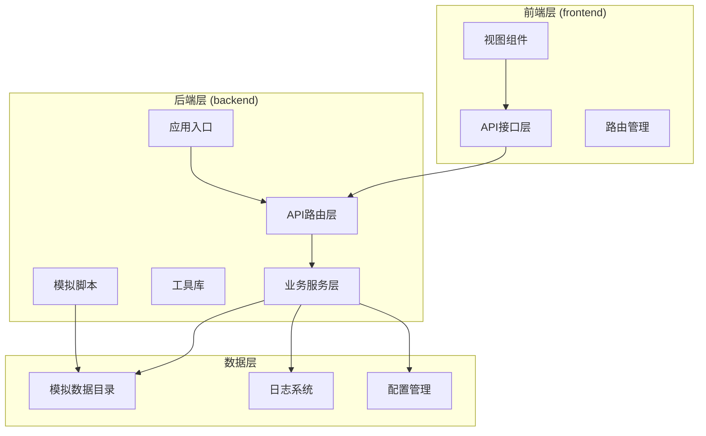
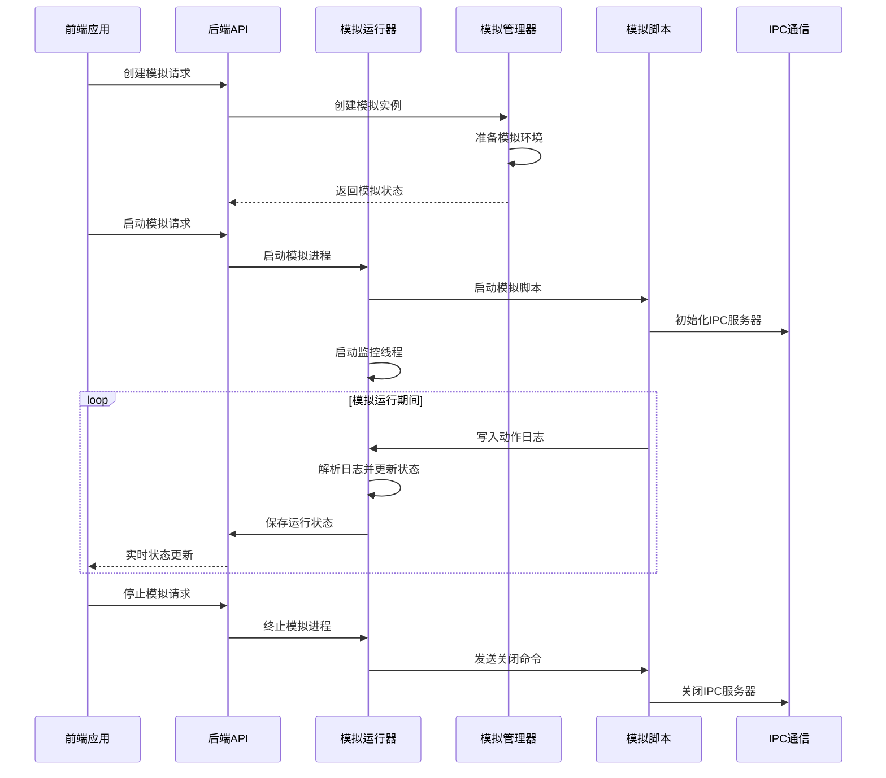
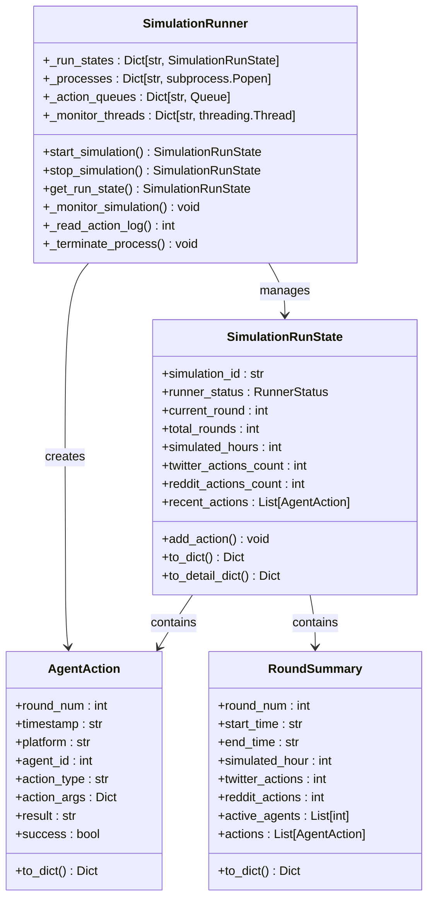
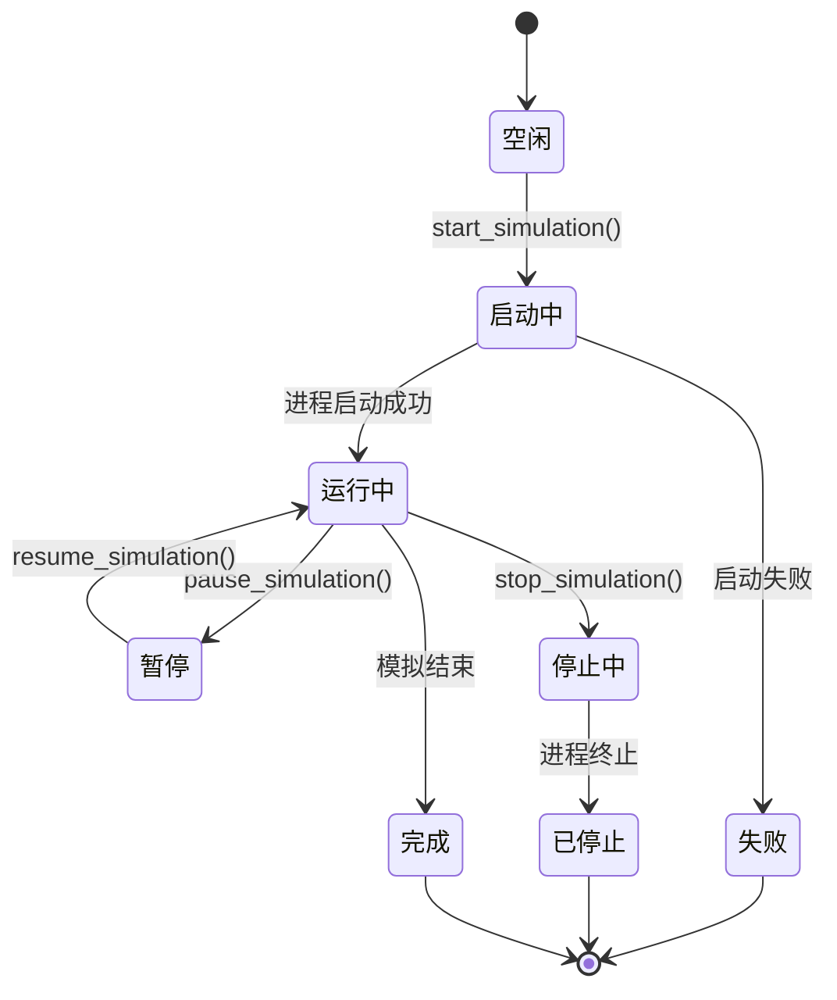
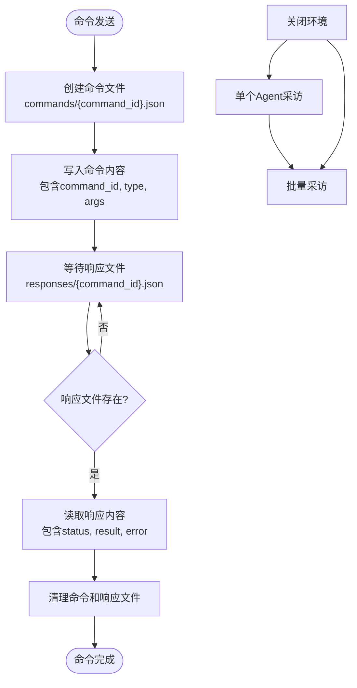
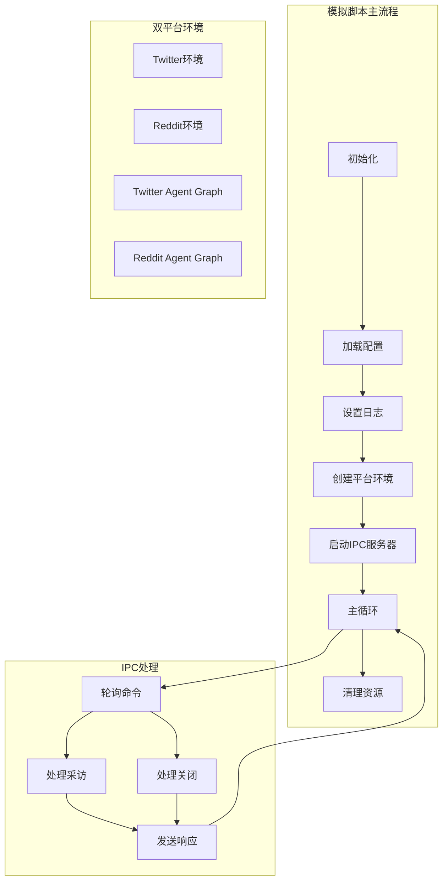
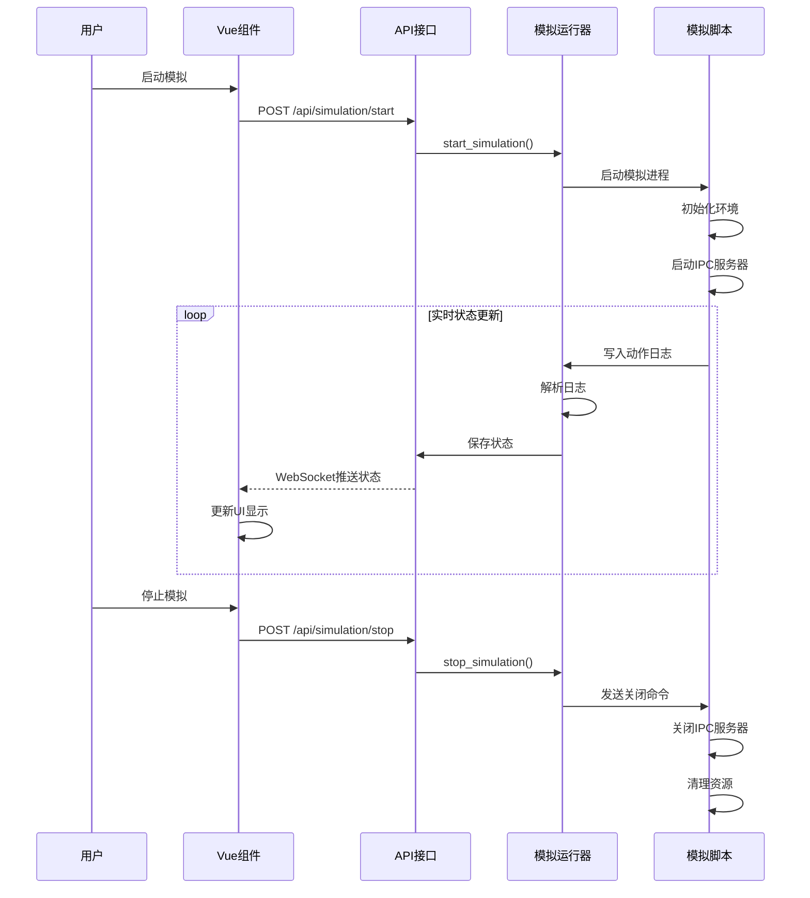
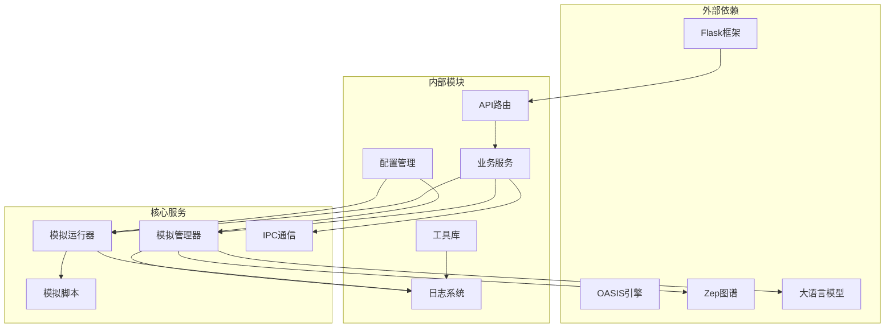

# 模拟运行控制

<cite>
**本文档引用的文件**
- [simulation_runner.py](file://backend/app/services/simulation_runner.py)
- [simulation_manager.py](file://backend/app/services/simulation_manager.py)
- [simulation_ipc.py](file://backend/app/services/simulation_ipc.py)
- [run_parallel_simulation.py](file://backend/scripts/run_parallel_simulation.py)
- [run.py](file://backend/run.py)
- [simulation.py](file://backend/app/api/simulation.py)
- [logger.py](file://backend/app/utils/logger.py)
- [config.py](file://backend/app/config.py)
- [simulation.js](file://frontend/src/api/simulation.js)
- [SimulationRunView.vue](file://frontend/src/views/SimulationRunView.vue)
</cite>

## 目录
1. [简介](#简介)
2. [项目结构](#项目结构)
3. [核心组件](#核心组件)
4. [架构概览](#架构概览)
5. [详细组件分析](#详细组件分析)
6. [依赖关系分析](#依赖关系分析)
7. [性能考虑](#性能考虑)
8. [故障排除指南](#故障排除指南)
9. [结论](#结论)

## 简介

MiroFish的模拟运行控制系统是一个基于OASIS引擎的多智能体模拟平台，支持Twitter和Reddit双平台并行模拟。该系统提供了完整的模拟生命周期管理，包括准备、启动、监控、暂停、恢复和终止操作，以及实时的状态跟踪和性能监控功能。

系统采用前后端分离架构，后端使用Flask提供RESTful API，前端使用Vue.js构建用户界面。核心创新在于实现了跨平台的进程间通信（IPC）机制，允许用户在模拟运行期间进行动态交互和控制。

## 项目结构

MiroFish项目采用清晰的分层架构，主要分为以下几个层次：

**图表来源**
- [run.py](file://backend/run.py#L25-L50)
- [simulation.py](file://backend/app/api/simulation.py#L1-L50)

**章节来源**
- [run.py](file://backend/run.py#L1-L51)
- [config.py](file://backend/app/config.py#L1-L76)

## 核心组件

### 模拟运行器 (SimulationRunner)

SimulationRunner是系统的核心组件，负责管理模拟进程的生命周期和状态监控。它提供了以下关键功能：

- **进程管理**：启动、监控和终止模拟进程
- **状态跟踪**：实时记录和更新模拟状态
- **日志解析**：解析模拟产生的动作日志
- **双平台支持**：同时支持Twitter和Reddit平台的并行运行

### 模拟管理器 (SimulationManager)

SimulationManager负责模拟的高级管理工作，包括：

- **环境准备**：从Zep图谱读取实体并生成Agent Profile
- **配置生成**：使用LLM智能生成模拟参数
- **状态协调**：管理多个模拟实例的协调运行
- **资源管理**：分配和管理模拟所需的计算资源

### IPC通信系统

系统实现了基于文件系统的进程间通信机制，支持：

- **命令发送**：后端向模拟进程发送控制命令
- **状态查询**：实时查询模拟环境状态
- **动态交互**：在模拟运行期间进行Agent采访
- **优雅关闭**：支持模拟环境的优雅关闭

**章节来源**
- [simulation_runner.py](file://backend/app/services/simulation_runner.py#L195-L800)
- [simulation_manager.py](file://backend/app/services/simulation_manager.py#L114-L529)
- [simulation_ipc.py](file://backend/app/services/simulation_ipc.py#L95-L395)

## 架构概览

系统采用分布式架构设计，各个组件通过明确定义的接口进行交互：

**图表来源**
- [simulation_runner.py](file://backend/app/services/simulation_runner.py#L312-L475)
- [run_parallel_simulation.py](file://backend/scripts/run_parallel_simulation.py#L560-L602)
- [simulation_ipc.py](file://backend/app/services/simulation_ipc.py#L313-L395)

## 详细组件分析

### 模拟运行器架构

SimulationRunner采用了面向对象的设计模式，通过数据类和状态机实现复杂的运行时管理：

**图表来源**
- [simulation_runner.py](file://backend/app/services/simulation_runner.py#L195-L193)

#### 状态管理系统

系统实现了完整的状态管理机制，通过枚举类型定义了模拟的不同运行状态：

**图表来源**
- [simulation_runner.py](file://backend/app/services/simulation_runner.py#L35-L44)

**章节来源**
- [simulation_runner.py](file://backend/app/services/simulation_runner.py#L195-L800)

### IPC通信机制

系统实现了基于文件系统的轻量级IPC机制，解决了传统管道通信的限制：

**图表来源**
- [simulation_ipc.py](file://backend/app/services/simulation_ipc.py#L117-L188)

#### 命令类型定义

系统支持三种主要的IPC命令类型：

| 命令类型 | 描述 | 参数 | 返回值 |
|---------|------|------|--------|
| interview | 单个Agent采访 | agent_id, prompt, platform | interview结果 |
| batch_interview | 批量采访 | interviews列表 | 所有采访结果 |
| close_env | 关闭环境 | 无 | 关闭确认 |

**章节来源**
- [simulation_ipc.py](file://backend/app/services/simulation_ipc.py#L25-L93)

### 模拟脚本架构

模拟脚本实现了双平台并行运行的能力，支持Twitter和Reddit平台的协同模拟：

**图表来源**
- [run_parallel_simulation.py](file://backend/scripts/run_parallel_simulation.py#L560-L602)

**章节来源**
- [run_parallel_simulation.py](file://backend/scripts/run_parallel_simulation.py#L1-L800)

### 前后端集成

前端通过API接口与后端进行数据交换，实现了完整的用户交互体验：

**图表来源**
- [simulation.js](file://frontend/src/api/simulation.js#L83-L93)
- [SimulationRunView.vue](file://frontend/src/views/SimulationRunView.vue#L147-L193)

**章节来源**
- [simulation.js](file://frontend/src/api/simulation.js#L1-L188)
- [SimulationRunView.vue](file://frontend/src/views/SimulationRunView.vue#L1-L448)

## 依赖关系分析

系统采用了模块化的依赖设计，各个组件之间的耦合度较低：

**图表来源**
- [config.py](file://backend/app/config.py#L20-L76)
- [logger.py](file://backend/app/utils/logger.py#L30-L88)

**章节来源**
- [config.py](file://backend/app/config.py#L1-L76)
- [logger.py](file://backend/app/utils/logger.py#L1-L127)

## 性能考虑

### 并发处理策略

系统采用了多线程和异步编程相结合的方式：

- **监控线程**：专门负责监控模拟进程和解析日志
- **异步IPC处理**：使用asyncio处理批量采访请求
- **队列管理**：通过Queue实现线程间的数据传递

### 资源管理优化

- **进程组管理**：使用start_new_session=True创建新的进程组
- **内存状态缓存**：在内存中缓存运行状态，减少磁盘I/O
- **日志文件管理**：使用主日志文件避免stdout/stderr缓冲区问题

### 性能监控指标

系统提供了以下关键性能指标：

- **模拟进度**：当前轮次/总轮次百分比
- **动作速率**：每秒处理的动作数量
- **内存使用**：进程内存占用情况
- **CPU利用率**：模拟进程的CPU使用率

## 故障排除指南

### 常见问题及解决方案

#### 模拟启动失败

**症状**：模拟启动后立即失败，状态显示为FAILED

**可能原因**：
1. 配置文件缺失或损坏
2. LLM API密钥配置错误
3. Zep图谱访问权限不足
4. 脚本文件路径错误

**解决步骤**：
1. 检查配置文件是否存在：`uploads/simulations/{simulation_id}/simulation_config.json`
2. 验证API密钥配置：`LLM_API_KEY` 和 `ZEP_API_KEY`
3. 确认脚本文件权限：`backend/scripts/run_parallel_simulation.py`
4. 查看主日志文件获取详细错误信息

#### IPC通信异常

**症状**：前端无法获取实时状态更新

**可能原因**：
1. IPC目录权限问题
2. 命令文件格式错误
3. 响应文件写入失败
4. 超时设置过短

**解决步骤**：
1. 检查IPC目录权限：`uploads/simulations/{simulation_id}/ipc_commands`
2. 验证命令文件格式：JSON格式正确
3. 确认响应文件写入权限
4. 调整超时参数设置

#### 进程无法终止

**症状**：停止模拟后进程仍然运行

**可能原因**：
1. 子进程未正确处理终止信号
2. 进程组创建失败
3. Windows平台taskkill命令失败
4. 进程被其他进程引用

**解决步骤**：
1. 检查进程组ID：`os.getpgid(process.pid)`
2. 验证Windows taskkill命令：`taskkill /PID {pid} /T`
3. 尝试强制终止：`process.kill()`
4. 检查是否有其他进程引用该进程

**章节来源**
- [simulation_runner.py](file://backend/app/services/simulation_runner.py#L716-L800)
- [simulation_ipc.py](file://backend/app/services/simulation_ipc.py#L117-L188)

## 结论

MiroFish的模拟运行控制系统展现了现代多智能体模拟平台的先进设计理念。通过精心设计的架构和完善的IPC机制，系统实现了：

1. **高可靠性**：完整的错误处理和故障恢复机制
2. **高性能**：多线程并发处理和资源优化
3. **易扩展**：模块化设计支持功能扩展
4. **用户体验**：实时状态监控和动态交互能力

该系统为群体智能研究和应用提供了强大的基础设施，支持从学术研究到商业应用的各种场景。通过持续的优化和改进，MiroFish有望成为群体智能领域的重要工具平台。