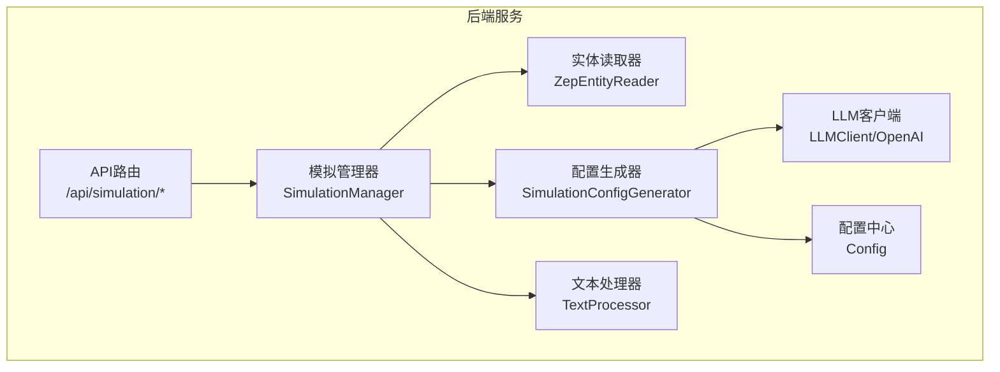
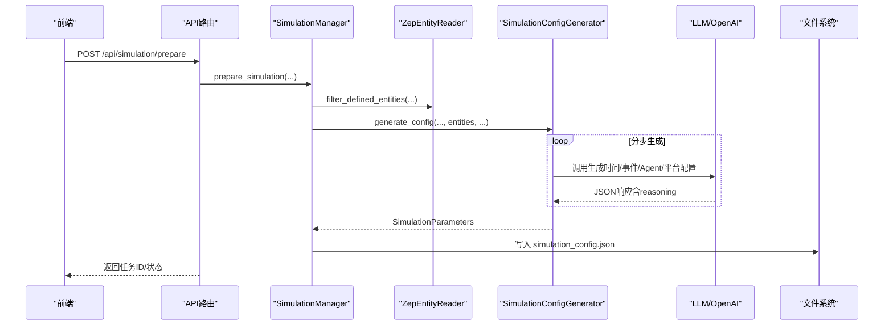
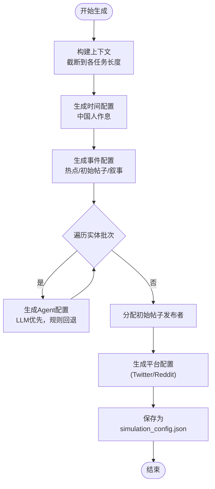
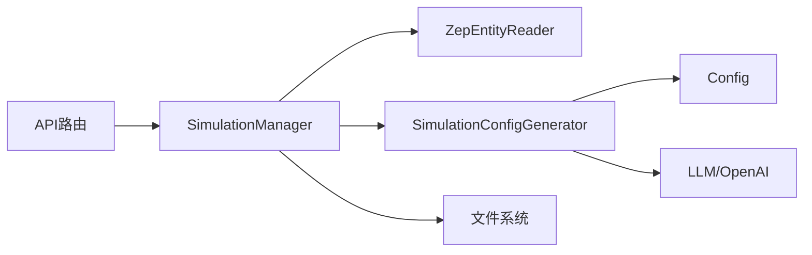

# 模拟配置生成

<cite>
**本文引用的文件**
- [simulation_config_generator.py](file://backend/app/services/simulation_config_generator.py)
- [simulation.py](file://backend/app/api/simulation.py)
- [zep_entity_reader.py](file://backend/app/services/zep_entity_reader.py)
- [config.py](file://backend/app/config.py)
- [llm_client.py](file://backend/app/utils/llm_client.py)
- [text_processor.py](file://backend/app/services/text_processor.py)
- [simulation_manager.py](file://backend/app/services/simulation_manager.py)
- [.env.example](file://.env.example)
</cite>

## 目录
1. [简介](#简介)
2. [项目结构](#项目结构)
3. [核心组件](#核心组件)
4. [架构总览](#架构总览)
5. [详细组件分析](#详细组件分析)
6. [依赖关系分析](#依赖关系分析)
7. [性能考量](#性能考量)
8. [故障排查指南](#故障排查指南)
9. [结论](#结论)
10. [附录](#附录)

## 简介
本文件面向MiroFish的“模拟配置生成”子系统，聚焦于SimulationConfigGenerator的智能算法与推理流程，解释如何基于模拟需求、文档内容与图谱实体，自动生成时间、事件、Agent与平台的完整配置。文档同时给出配置参数的类型与范围、生成的推理过程与决策逻辑、JSON配置规范、验证规则、调优指南、性能影响分析与最佳实践，并解释可解释性与reasoning记录机制。

## 项目结构
- 后端服务层包含配置生成器、API路由、实体读取、配置与LLM客户端、文本处理等模块。
- 前端通过API触发准备流程，后端异步生成配置并保存为JSON文件，供后续模拟运行使用。

图表来源
- [simulation.py](file://backend/app/api/simulation.py#L358-L635)
- [simulation_manager.py](file://backend/app/services/simulation_manager.py#L400-L447)
- [simulation_config_generator.py](file://backend/app/services/simulation_config_generator.py#L199-L378)
- [zep_entity_reader.py](file://backend/app/services/zep_entity_reader.py#L70-L338)
- [llm_client.py](file://backend/app/utils/llm_client.py#L13-L91)
- [config.py](file://backend/app/config.py#L20-L76)
- [text_processor.py](file://backend/app/services/text_processor.py#L9-L72)

章节来源
- [simulation.py](file://backend/app/api/simulation.py#L358-L635)
- [simulation_manager.py](file://backend/app/services/simulation_manager.py#L400-L447)

## 核心组件
- SimulationConfigGenerator：LLM驱动的智能配置生成器，分步生成时间、事件、Agent与平台配置，内置JSON修复与重试机制，支持reasoning记录。
- ZepEntityReader：从Zep图谱读取并过滤实体，提供实体摘要、类型与上下文信息。
- LLMClient/OpenAI：统一的LLM调用封装，支持JSON模式与响应修复。
- SimulationManager：协调准备流程，保存配置文件，提供运行说明。
- Config：集中管理LLM/Zep/上传/平台动作等配置。
- TextProcessor：文本预处理与分块，辅助文档内容截断。

章节来源
- [simulation_config_generator.py](file://backend/app/services/simulation_config_generator.py#L199-L378)
- [zep_entity_reader.py](file://backend/app/services/zep_entity_reader.py#L70-L338)
- [llm_client.py](file://backend/app/utils/llm_client.py#L13-L91)
- [simulation_manager.py](file://backend/app/services/simulation_manager.py#L400-L447)
- [config.py](file://backend/app/config.py#L20-L76)
- [text_processor.py](file://backend/app/services/text_processor.py#L9-L72)

## 架构总览
配置生成的端到端流程如下：
- API接收请求，读取项目与文档，调用Zep读取实体，启动异步准备任务。
- 准备任务中，SimulationManager调用SimulationConfigGenerator生成配置。
- 生成器分步构建上下文，调用LLM生成各配置段，解析并校验，最终写入simulation_config.json。
- API提供实时查询与下载配置文件，便于调试与复用。

图表来源
- [simulation.py](file://backend/app/api/simulation.py#L358-L635)
- [simulation_manager.py](file://backend/app/services/simulation_manager.py#L400-L447)
- [simulation_config_generator.py](file://backend/app/services/simulation_config_generator.py#L242-L378)
- [zep_entity_reader.py](file://backend/app/services/zep_entity_reader.py#L222-L338)

## 详细组件分析

### SimulationConfigGenerator：智能配置生成器
- 分步生成策略
  - 步骤1：时间配置（基于中国人作息）
  - 步骤2：事件配置（热点话题、初始帖子、叙事方向）
  - 步骤3-N：分批生成Agent配置（每批15个）
  - 步骤最后：平台配置（Twitter/Reddit）
- 上下文构建与截断
  - 统一MAX_CONTEXT_LENGTH上限，按任务类型分配截断长度，避免LLM上下文溢出。
  - 实体摘要按类型分组展示，控制每类实体数量与摘要长度。
- LLM调用与容错
  - 使用response_format=json_object，带重试与指数退避。
  - 输出被截断或JSON解析失败时，尝试修复（括号闭合、字符串清理、控制字符清理）。
- 参数解析与校验
  - 时间配置：agents_per_hour_min/max不超过实体总数，min<max，修正异常值。
  - Agent配置：按实体类型应用规则生成默认值，LLM优先，缺失时回退。
  - 初始帖子分配：按poster_type匹配Agent类型，支持别名映射，否则选用影响力最高Agent。
- 可解释性与reasoning
  - 每步生成均记录reasoning，最终汇总到generation_reasoning字段，便于审计与复盘。

图表来源
- [simulation_config_generator.py](file://backend/app/services/simulation_config_generator.py#L242-L378)
- [simulation_config_generator.py](file://backend/app/services/simulation_config_generator.py#L810-L902)
- [simulation_config_generator.py](file://backend/app/services/simulation_config_generator.py#L725-L808)

章节来源
- [simulation_config_generator.py](file://backend/app/services/simulation_config_generator.py#L199-L378)
- [simulation_config_generator.py](file://backend/app/services/simulation_config_generator.py#L433-L533)
- [simulation_config_generator.py](file://backend/app/services/simulation_config_generator.py#L609-L642)
- [simulation_config_generator.py](file://backend/app/services/simulation_config_generator.py#L810-L902)
- [simulation_config_generator.py](file://backend/app/services/simulation_config_generator.py#L725-L808)

### 数据模型与JSON配置规范
- SimulationParameters（顶层）
  - 字段：simulation_id, project_id, graph_id, simulation_requirement, time_config, agent_configs, event_config, twitter_config, reddit_config, llm_model, llm_base_url, generated_at, generation_reasoning
  - to_dict/to_json：序列化为字典/JSON字符串
- TimeSimulationConfig（时间配置）
  - 字段：total_simulation_hours, minutes_per_round, agents_per_hour_min, agents_per_hour_max, peak_hours, off_peak_hours, morning_hours, work_hours, 以及对应的活跃度倍率
  - 范围与约束：总时长24-168小时；每轮30-120分钟；agents_per_hour不超过实体总数且min<max
- AgentActivityConfig（Agent活动配置）
  - 字段：agent_id, entity_uuid, entity_name, entity_type, activity_level(0.0-1.0), posts_per_hour, comments_per_hour, active_hours(0-23), response_delay_min/max(分钟), sentiment_bias(-1.0~1.0), stance(supportive/opposing/neutral/observer), influence_weight
  - 规则生成：按实体类型（如官方机构、媒体、专家、学生、普通人）设定典型值
- EventConfig（事件配置）
  - 字段：initial_posts(含content与poster_type), scheduled_events, hot_topics, narrative_direction
  - poster_type必须来自可用实体类型，以便正确分配发布者
- PlatformConfig（平台配置）
  - 字段：platform(twitter/reddit), recency_weight, popularity_weight, relevance_weight, viral_threshold, echo_chamber_strength
  - 默认值：Twitter/Reddit均有默认权重与阈值

章节来源
- [simulation_config_generator.py](file://backend/app/services/simulation_config_generator.py#L146-L197)
- [simulation_config_generator.py](file://backend/app/services/simulation_config_generator.py#L82-L110)
- [simulation_config_generator.py](file://backend/app/services/simulation_config_generator.py#L50-L80)
- [simulation_config_generator.py](file://backend/app/services/simulation_config_generator.py#L112-L126)
- [simulation_config_generator.py](file://backend/app/services/simulation_config_generator.py#L128-L143)
- [simulation_config_generator.py](file://backend/app/services/simulation_config_generator.py#L904-L985)

### 推理过程与决策逻辑
- 模拟需求与文档理解
  - 通过simulation_requirement与document_text构建上下文，限定各任务的上下文长度，避免LLM上下文溢出。
- 事件设计
  - 从可用实体类型中抽取代表性示例，指导LLM生成初始帖子与热点话题，要求poster_type严格匹配。
- Agent分配
  - 先按类型精确匹配，再按别名映射，最后按影响力权重选择Agent。
- 时间与活跃度
  - 依据中国人作息习惯设定高峰/低谷时段与倍率，确保时间流速与Agent激活节奏合理。
- LLM容错
  - 输出截断与JSON解析失败时，自动修复括号、字符串与控制字符，提升鲁棒性。

章节来源
- [simulation_config_generator.py](file://backend/app/services/simulation_config_generator.py#L380-L407)
- [simulation_config_generator.py](file://backend/app/services/simulation_config_generator.py#L644-L724)
- [simulation_config_generator.py](file://backend/app/services/simulation_config_generator.py#L725-L808)
- [simulation_config_generator.py](file://backend/app/services/simulation_config_generator.py#L534-L607)
- [simulation_config_generator.py](file://backend/app/services/simulation_config_generator.py#L433-L533)

### 配置生成的可解释性与reasoning记录
- 每步生成均记录reasoning，最终汇总到generation_reasoning，便于：
  - 审计生成逻辑
  - 调试与优化
  - 与用户沟通生成依据

章节来源
- [simulation_config_generator.py](file://backend/app/services/simulation_config_generator.py#L292-L374)

## 依赖关系分析
- 组件耦合
  - SimulationManager依赖ZepEntityReader与SimulationConfigGenerator，负责准备流程编排与文件落盘。
  - SimulationConfigGenerator依赖Config与LLMClient，负责上下文构建、LLM调用与JSON修复。
  - API层负责任务调度与状态查询，不直接参与生成细节。
- 外部依赖
  - Zep：图谱实体读取与过滤
  - OpenAI兼容LLM：JSON模式调用与响应修复
  - 文件系统：配置文件写入与读取

图表来源
- [simulation.py](file://backend/app/api/simulation.py#L358-L635)
- [simulation_manager.py](file://backend/app/services/simulation_manager.py#L400-L447)
- [simulation_config_generator.py](file://backend/app/services/simulation_config_generator.py#L224-L241)
- [config.py](file://backend/app/config.py#L20-L76)

章节来源
- [simulation.py](file://backend/app/api/simulation.py#L358-L635)
- [simulation_manager.py](file://backend/app/services/simulation_manager.py#L400-L447)
- [simulation_config_generator.py](file://backend/app/services/simulation_config_generator.py#L224-L241)

## 性能考量
- 上下文截断与分批
  - MAX_CONTEXT_LENGTH与各任务截断长度限制，避免LLM上下文超限。
  - AGENTS_PER_BATCH=15，平衡LLM调用成本与生成稳定性。
- LLM调用优化
  - response_format=json_object，减少后处理开销。
  - 重试与温度递减，提高成功率与一致性。
- IO与文件写入
  - 仅在准备阶段写入simulation_config.json，避免频繁IO。
- 可扩展性
  - 通过Config集中管理LLM/Zep/上传等配置，便于切换与扩展。

章节来源
- [simulation_config_generator.py](file://backend/app/services/simulation_config_generator.py#L212-L222)
- [simulation_config_generator.py](file://backend/app/services/simulation_config_generator.py#L433-L481)
- [simulation_manager.py](file://backend/app/services/simulation_manager.py#L421-L425)
- [config.py](file://backend/app/config.py#L20-L76)

## 故障排查指南
- LLM API配置
  - 确认LLM_API_KEY、LLM_BASE_URL、LLM_MODEL_NAME已在.env中配置，或通过环境变量注入。
- Zep API配置
  - 确认ZEP_API_KEY已配置，否则实体读取失败。
- 配置文件缺失
  - 若simulation_config.json不存在，可通过实时接口或下载接口获取。
- 生成失败
  - 查看generation_reasoning与日志，定位具体步骤与原因。
  - 如JSON解析失败，检查LLM输出是否被截断或包含非法字符。

章节来源
- [config.py](file://backend/app/config.py#L30-L34)
- [config.py](file://backend/app/config.py#L35-L37)
- [.env.example](file://.env.example#L1-L16)
- [simulation.py](file://backend/app/api/simulation.py#L1133-L1286)
- [simulation_config_generator.py](file://backend/app/services/simulation_config_generator.py#L433-L533)

## 结论
SimulationConfigGenerator通过分步生成、上下文截断、LLM JSON修复与reasoning记录，实现了从模拟需求到完整配置的自动化生成。其参数体系覆盖时间、事件、Agent与平台四个维度，既保证了生成质量，又提供了可解释性与可调优空间。配合API与管理器，系统可在大规模实体场景下稳定运行，并支持快速迭代与扩展。

## 附录

### 配置参数类型与范围（摘要）
- 时间配置
  - total_simulation_hours：24-168小时
  - minutes_per_round：30-120分钟
  - agents_per_hour_min/max：不超过实体总数且min<max
  - peak/off_peak/morning/work_hours：0-23小时，按中国人作息设定
- Agent配置
  - activity_level：0.0-1.0
  - posts_per_hour/comments_per_hour：非负
  - active_hours：0-23小时
  - response_delay_min/max：正整数，分钟
  - sentiment_bias：-1.0~1.0
  - stance：supportive/opposing/neutral/observer
  - influence_weight：正数
- 事件配置
  - initial_posts：每条包含content与poster_type
  - poster_type：必须来自可用实体类型
- 平台配置
  - recency/popularity/relevance_weight：非负且和为1
  - viral_threshold：正整数
  - echo_chamber_strength：0-1

章节来源
- [simulation_config_generator.py](file://backend/app/services/simulation_config_generator.py#L82-L110)
- [simulation_config_generator.py](file://backend/app/services/simulation_config_generator.py#L50-L80)
- [simulation_config_generator.py](file://backend/app/services/simulation_config_generator.py#L112-L126)
- [simulation_config_generator.py](file://backend/app/services/simulation_config_generator.py#L128-L143)
- [simulation_config_generator.py](file://backend/app/services/simulation_config_generator.py#L609-L642)
- [simulation_config_generator.py](file://backend/app/services/simulation_config_generator.py#L904-L985)

### JSON配置文件规范与验证要点
- 文件位置：simulation_config.json（由SimulationManager写入）
- 字段校验
  - 必填：simulation_id, project_id, graph_id, simulation_requirement, time_config, agent_configs, event_config
  - 可选：twitter_config, reddit_config, llm_model, llm_base_url, generation_reasoning
- 验证规则
  - agents_per_hour_min/max必须为整数且不超过实体总数
  - active_hours必须为0-23的整数列表
  - stance必须为枚举值之一
  - recency/popularity/relevance_weight之和为1（平台配置）
- 建议
  - 生成后通过实时接口或下载接口核对配置完整性与合理性
  - 结合generation_reasoning进行审计与优化

章节来源
- [simulation_manager.py](file://backend/app/services/simulation_manager.py#L495-L504)
- [simulation.py](file://backend/app/api/simulation.py#L1289-L1311)
- [simulation_config_generator.py](file://backend/app/services/simulation_config_generator.py#L609-L642)
- [simulation_config_generator.py](file://backend/app/services/simulation_config_generator.py#L146-L197)

### 调优指南与最佳实践
- 模拟需求与文档
  - 明确simulation_requirement，提供高质量document_text，有助于LLM生成更贴合主题的事件与Agent配置
- 实体类型与数量
  - 控制实体类型多样性，避免过多无关类型导致上下文冗余
  - 合理设置AGENTS_PER_BATCH，平衡生成速度与LLM成本
- 时间与活跃度
  - 根据事件性质调整peak/off_peak/morning/work时段与倍率
  - 对突发事件可缩短total_simulation_hours，提高时间流速
- Agent配置
  - 优先使用LLM生成，必要时微调规则生成的默认值
  - 关注influence_weight与response_delay，以模拟真实社交动态
- 平台配置
  - Twitter侧重时效性，Reddit强调深度讨论，按平台特性调整权重
- 可解释性
  - 重视generation_reasoning，定期回顾与总结，形成经验库

章节来源
- [simulation_config_generator.py](file://backend/app/services/simulation_config_generator.py#L534-L607)
- [simulation_config_generator.py](file://backend/app/services/simulation_config_generator.py#L810-L902)
- [simulation_config_generator.py](file://backend/app/services/simulation_config_generator.py#L128-L143)