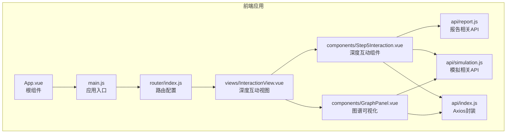
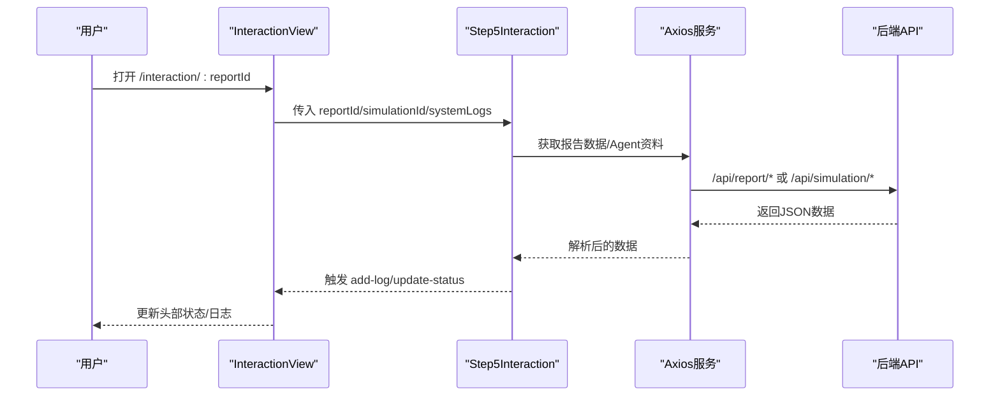
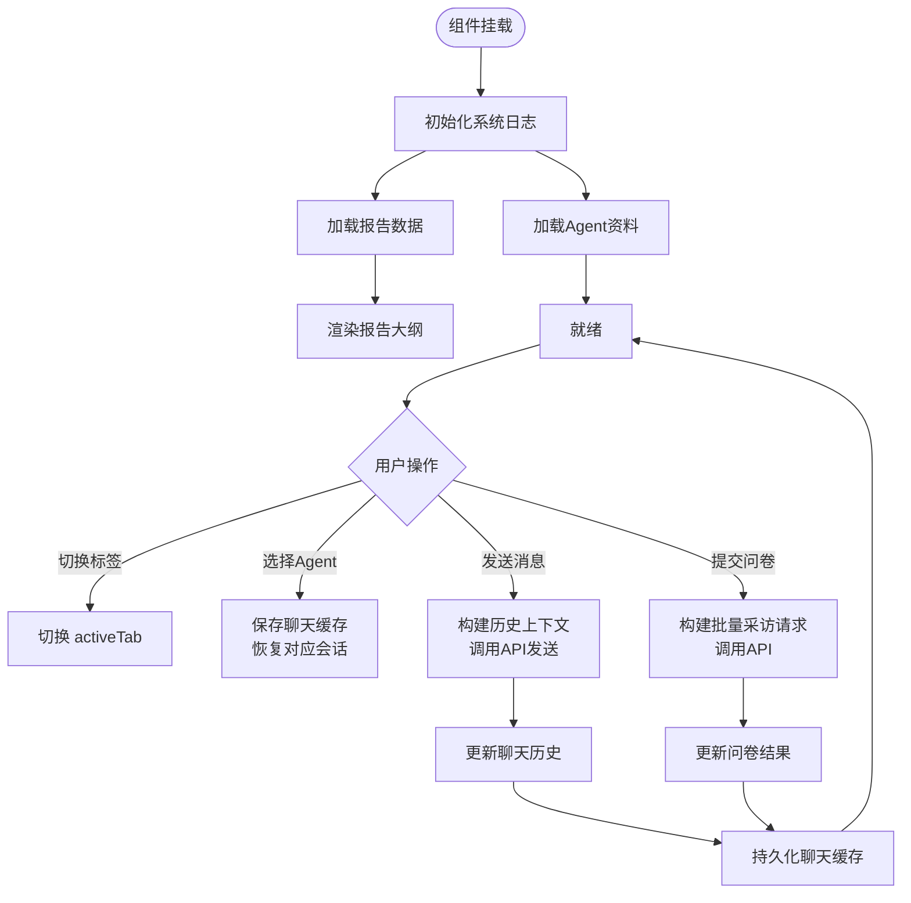
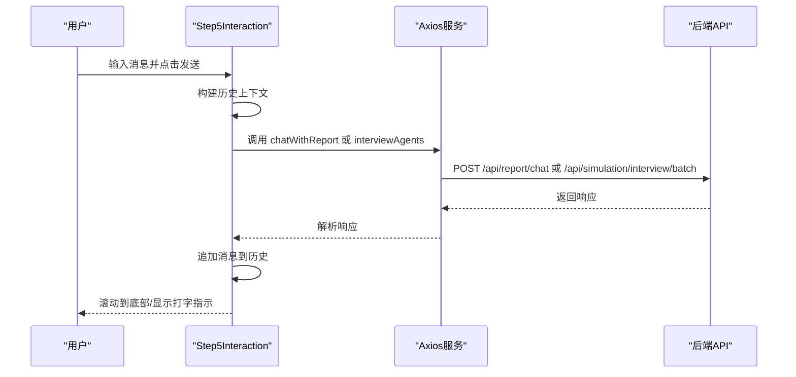
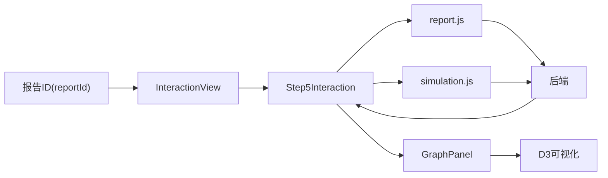
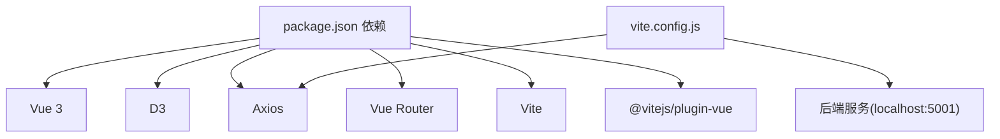

# 深度互动界面

<cite>
**本文档引用的文件**
- [Step5Interaction.vue](file://frontend/src/components/Step5Interaction.vue)
- [InteractionView.vue](file://frontend/src/views/InteractionView.vue)
- [GraphPanel.vue](file://frontend/src/components/GraphPanel.vue)
- [report.js](file://frontend/src/api/report.js)
- [simulation.js](file://frontend/src/api/simulation.js)
- [index.js](file://frontend/src/api/index.js)
- [router/index.js](file://frontend/src/router/index.js)
- [App.vue](file://frontend/src/App.vue)
- [main.js](file://frontend/src/main.js)
- [package.json](file://frontend/package.json)
- [vite.config.js](file://frontend/vite.config.js)
</cite>

## 目录
1. [简介](#简介)
2. [项目结构](#项目结构)
3. [核心组件](#核心组件)
4. [架构总览](#架构总览)
5. [详细组件分析](#详细组件分析)
6. [依赖关系分析](#依赖关系分析)
7. [性能考虑](#性能考虑)
8. [故障排除指南](#故障排除指南)
9. [结论](#结论)
10. [附录](#附录)

## 简介
本文件面向产品设计师与前端开发者，系统性梳理 MiroFish 深度互动界面的设计与实现。该界面以 Vue 3 + Vite 技术栈构建，围绕 Step5Interaction 组件提供“图谱探索 + 模拟控制 + 实时数据展示 + 用户交互”的一体化体验。文档重点覆盖：
- Step5Interaction 组件的架构设计、状态管理与事件处理机制
- 前后端 API 集成方式、数据流与实时更新策略
- UI 组件使用指南、交互模式与用户体验优化
- 界面定制化选项、主题配置与响应式设计支持
- 最佳实践与常见问题排查

## 项目结构
前端采用模块化组织，核心目录与职责如下：
- views：页面级视图，包含 InteractionView 作为深度互动主入口
- components：可复用组件，Step5Interaction 为核心交互组件，GraphPanel 提供图谱可视化
- api：统一的 HTTP 客户端封装与业务 API 方法
- router：路由定义，连接各页面
- main.js：应用入口，挂载根组件与路由
- vite.config.js：开发服务器与代理配置

**图表来源**
- [App.vue](file://frontend/src/App.vue#L1-L48)
- [main.js](file://frontend/src/main.js#L1-L10)
- [router/index.js](file://frontend/src/router/index.js#L1-L53)
- [InteractionView.vue](file://frontend/src/views/InteractionView.vue#L1-L351)
- [Step5Interaction.vue](file://frontend/src/components/Step5Interaction.vue#L1-L411)
- [GraphPanel.vue](file://frontend/src/components/GraphPanel.vue#L1-L236)
- [index.js](file://frontend/src/api/index.js#L1-L68)
- [report.js](file://frontend/src/api/report.js#L1-L52)
- [simulation.js](file://frontend/src/api/simulation.js#L1-L188)

**章节来源**
- [package.json](file://frontend/package.json#L1-L22)
- [vite.config.js](file://frontend/vite.config.js#L1-L19)

## 核心组件
- Step5Interaction：深度互动主组件，负责报告大纲渲染、聊天对话、问卷调查、Agent 选择与实时资料加载
- InteractionView：页面容器，承载 Step5Interaction 与 GraphPanel，管理布局与状态同步
- GraphPanel：图谱可视化组件，基于 D3 实现力导向图，支持缩放、拖拽、详情面板与边标签

关键特性：
- 双面板布局：左侧报告大纲，右侧交互工具区
- 三态交互：Report Agent 聊天、Agent 个人聊天、批量问卷调查
- 实时资料：通过实时 API 动态拉取 Agent Profile 与图谱数据
- Markdown 渲染：内置轻量 Markdown 解析与样式映射

**章节来源**
- [Step5Interaction.vue](file://frontend/src/components/Step5Interaction.vue#L1-L411)
- [InteractionView.vue](file://frontend/src/views/InteractionView.vue#L1-L351)
- [GraphPanel.vue](file://frontend/src/components/GraphPanel.vue#L1-L236)

## 架构总览
前端与后端通过 Axios 封装的服务进行通信，开发环境通过 Vite 代理转发到后端服务。Step5Interaction 与 InteractionView 协同，前者专注交互与数据处理，后者负责布局与状态传递。

**图表来源**
- [InteractionView.vue](file://frontend/src/views/InteractionView.vue#L64-L214)
- [Step5Interaction.vue](file://frontend/src/components/Step5Interaction.vue#L413-L931)
- [index.js](file://frontend/src/api/index.js#L1-L68)
- [report.js](file://frontend/src/api/report.js#L1-L52)
- [simulation.js](file://frontend/src/api/simulation.js#L1-L188)

## 详细组件分析

### Step5Interaction 组件架构与状态管理
- 状态划分
  - 交互态：activeTab（chat/survey）、chatTarget（report_agent/agent）
  - 聊天态：chatInput、chatHistory、isSending、chatHistoryCache
  - 问卷态：selectedAgents（Set）、surveyQuestion、surveyResults、isSurveying
  - 报告态：reportOutline、generatedSections、collapsedSections、currentSectionIndex
  - Agent态：profiles、selectedAgent、selectedAgentIndex、showAgentDropdown
  - UI态：showFullProfile、showToolsDetail、左右面板引用
- 生命周期与事件
  - mounted：初始化日志、加载报告数据与 Agent 资料；监听点击外部关闭下拉
  - watch：监听 reportId/simulationId 变化，触发重新加载
  - 事件：add-log、update-status 通过 emit 向父组件传递

**图表来源**
- [Step5Interaction.vue](file://frontend/src/components/Step5Interaction.vue#L413-L931)

**章节来源**
- [Step5Interaction.vue](file://frontend/src/components/Step5Interaction.vue#L413-L931)

### 交互模式与事件处理
- 聊天模式
  - Report Agent：支持工具卡片展示与上下文历史，最多保留最近若干条消息
  - Agent 个人：支持多轮对话上下文拼接，自动选择最近对话片段
- 问卷模式
  - 多选 Agent，批量提交问题，聚合返回结果
- Agent 下拉选择
  - 点击外部自动关闭下拉菜单，避免状态泄露
- Markdown 渲染
  - 支持标题、列表、代码块、引用等，适配报告与聊天场景

**图表来源**
- [Step5Interaction.vue](file://frontend/src/components/Step5Interaction.vue#L614-L743)
- [report.js](file://frontend/src/api/report.js#L46-L51)
- [simulation.js](file://frontend/src/api/simulation.js#L172-L177)

**章节来源**
- [Step5Interaction.vue](file://frontend/src/components/Step5Interaction.vue#L614-L743)
- [report.js](file://frontend/src/api/report.js#L46-L51)
- [simulation.js](file://frontend/src/api/simulation.js#L172-L177)

### 数据流与实时更新策略
- 报告数据：通过 reportId 获取报告详情，解析出 simulationId，联动图谱与 Agent 资料
- Agent 资料：使用实时接口获取最新 Agent Profile，支持 Reddit/Twitter 平台
- 图谱数据：由 InteractionView 加载并传递给 GraphPanel，支持刷新与最大化
- 系统日志：通过 InteractionView 的 add-log 与 update-status 与父组件同步状态

**图表来源**
- [InteractionView.vue](file://frontend/src/views/InteractionView.vue#L141-L200)
- [Step5Interaction.vue](file://frontend/src/components/Step5Interaction.vue#L886-L930)
- [report.js](file://frontend/src/api/report.js#L37-L51)
- [simulation.js](file://frontend/src/api/simulation.js#L36-L51)

**章节来源**
- [InteractionView.vue](file://frontend/src/views/InteractionView.vue#L141-L200)
- [Step5Interaction.vue](file://frontend/src/components/Step5Interaction.vue#L886-L930)

### UI 组件使用指南
- 报告大纲
  - 通过 reportOutline 与 generatedSections 控制章节渲染与折叠
  - 支持等待态与加载态，提升感知速度
- 交互工具栏
  - 三类标签页：Report Agent 聊天、Agent 聊天、问卷调查
  - Agent 下拉菜单支持头像、职业、名称展示
- 聊天区域
  - 用户消息右对齐，助手消息左对齐
  - 支持 Markdown 渲染与代码高亮
- 问卷区域
  - 多选 Agent，支持全选/清空
  - 结果卡片展示问题与回答

**章节来源**
- [Step5Interaction.vue](file://frontend/src/components/Step5Interaction.vue#L1-L411)

### 界面定制化、主题与响应式
- 字体与排版
  - 全局字体族包含 JetBrains Mono、Space Grotesk、Noto Sans SC
  - 报告标题采用衬线字体，强调阅读体验
- 主题与配色
  - 聊天消息采用深浅对比色，突出用户与助手身份
  - 工具卡片与问卷按钮使用语义化色彩（紫色/蓝色/橙色/绿色）
- 响应式
  - 左侧面板最小宽度约束，右侧自适应
  - 侧边栏滚动条仅在悬停时显示，减少视觉干扰
  - 问卷网格自适应列数，支持移动端紧凑布局

**章节来源**
- [App.vue](file://frontend/src/App.vue#L9-L47)
- [Step5Interaction.vue](file://frontend/src/components/Step5Interaction.vue#L933-L2539)

## 依赖关系分析
- 运行时依赖
  - Vue 3：组件化与响应式数据
  - D3：图谱渲染与力导向布局
  - Axios：HTTP 客户端与拦截器
  - Vue Router：页面路由与参数传递
- 开发依赖
  - Vite：构建与热更新
  - @vitejs/plugin-vue：Vue 单文件组件支持
- 代理配置
  - /api 前缀代理至后端服务，便于本地联调

**图表来源**
- [package.json](file://frontend/package.json#L11-L21)
- [vite.config.js](file://frontend/vite.config.js#L10-L16)

**章节来源**
- [package.json](file://frontend/package.json#L1-L22)
- [vite.config.js](file://frontend/vite.config.js#L1-L19)

## 性能考虑
- 渲染优化
  - Step5Interaction 中大量 DOM 操作集中在模板层，建议在高频更新场景下使用虚拟滚动或分页
  - Markdown 渲染采用一次性字符串替换，建议在长文本场景下拆分渲染或延迟执行
- 网络请求
  - Axios 封装具备超时与重试机制，适合长耗时任务；建议对重复请求做去抖与缓存
  - 实时接口按需调用，避免频繁轮询
- 图谱渲染
  - D3 力导向图在大数据量时可能卡顿，建议限制节点/边数量或启用简化模式
  - 拖拽时重启仿真，注意节流与 alphaTarget 的设置

[本节为通用指导，无需特定文件引用]

## 故障排除指南
- 请求失败
  - Axios 响应拦截器会统一抛错，检查后端返回的 success 字段与错误信息
  - 超时与网络错误已在拦截器中记录，确认代理与网络连通性
- 无法加载报告或 Agent
  - 确认 reportId/simulationId 参数正确，检查 InteractionView 的路由参数监听
  - 若实时接口返回为空，检查后端服务状态与平台配置
- 聊天无响应
  - 检查 chatTarget 与 selectedAgent 是否正确设置
  - 确认历史上下文构建逻辑未截断关键信息
- 图谱不更新
  - 确认 GraphPanel 接收到新的 graphData 并触发渲染
  - 检查刷新按钮与 maximize 切换逻辑

**章节来源**
- [index.js](file://frontend/src/api/index.js#L23-L51)
- [InteractionView.vue](file://frontend/src/views/InteractionView.vue#L202-L213)
- [Step5Interaction.vue](file://frontend/src/components/Step5Interaction.vue#L614-L743)
- [GraphPanel.vue](file://frontend/src/components/GraphPanel.vue#L786-L798)

## 结论
Step5Interaction 以清晰的组件边界与状态管理，实现了“报告阅读 + 智能体对话 + 批量问卷 + 实时图谱”的深度互动体验。通过 Axios 封装与路由参数驱动，前后端协作顺畅；通过 D3 图谱与 Markdown 渲染，提升了信息密度与可读性。建议在后续迭代中引入虚拟滚动、缓存策略与性能监控，进一步优化大数据量场景下的交互流畅度。

[本节为总结性内容，无需特定文件引用]

## 附录

### API 定义概览
- 报告相关
  - 生成报告：POST /api/report/generate
  - 获取报告状态：GET /api/report/generate/status
  - 获取 Agent 日志：GET /api/report/{reportId}/agent-log
  - 获取 Console 日志：GET /api/report/{reportId}/console-log
  - 获取报告详情：GET /api/report/{reportId}
  - 与 Report Agent 对话：POST /api/report/chat
- 模拟相关
  - 创建模拟：POST /api/simulation/create
  - 准备模拟：POST /api/simulation/prepare
  - 查询准备进度：POST /api/simulation/prepare/status
  - 获取模拟状态：GET /api/simulation/{simulationId}
  - 获取 Agent Profile（实时）：GET /api/simulation/{simulationId}/profiles/realtime
  - 批量采访 Agent：POST /api/simulation/interview/batch

**章节来源**
- [report.js](file://frontend/src/api/report.js#L1-L52)
- [simulation.js](file://frontend/src/api/simulation.js#L1-L188)

### 路由与页面导航
- /interaction/:reportId：深度互动页面，承载 Step5Interaction 与 GraphPanel
- /report/:reportId：报告查看页面
- /simulation/:simulationId：模拟详情页面
- /simulation/:simulationId/start：模拟运行页面

**章节来源**
- [router/index.js](file://frontend/src/router/index.js#L9-L44)