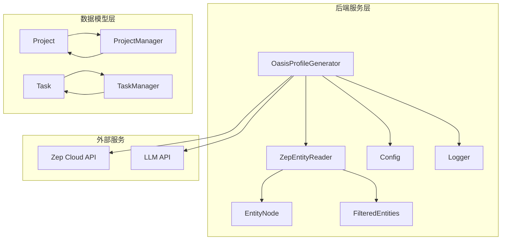
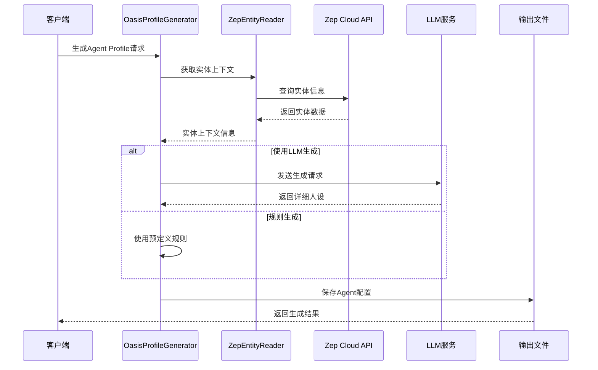
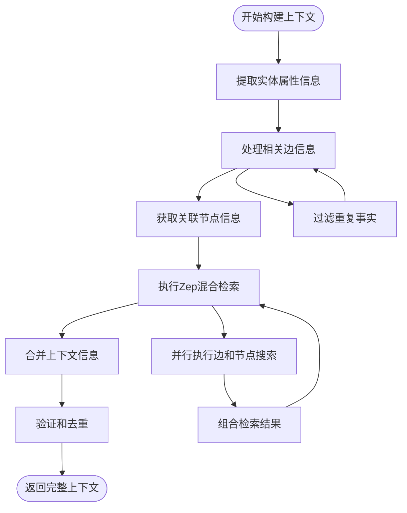
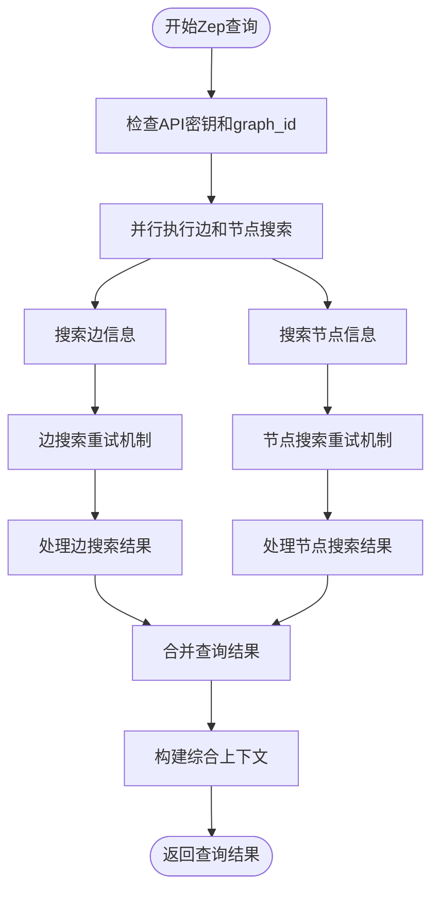
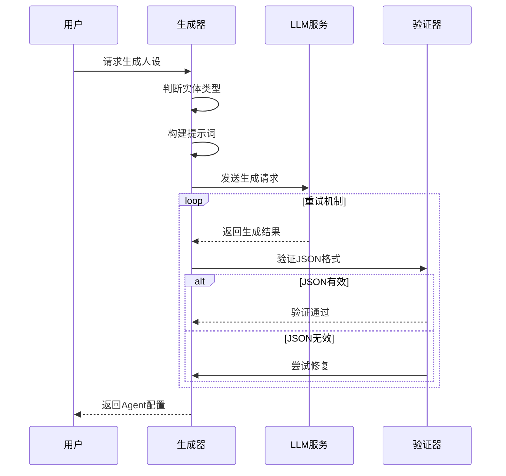
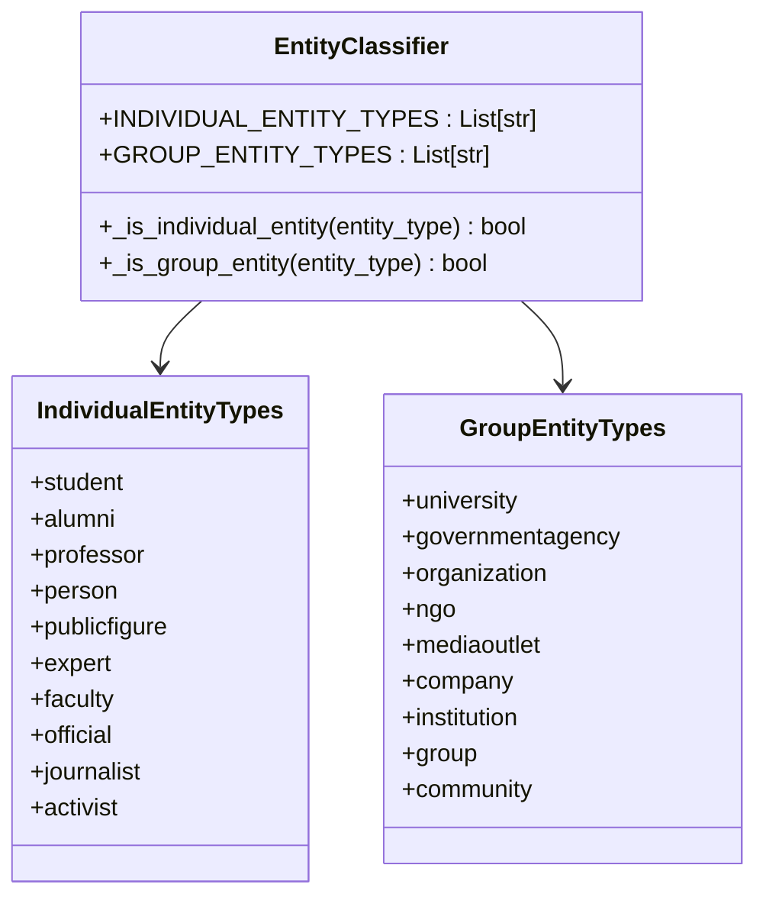
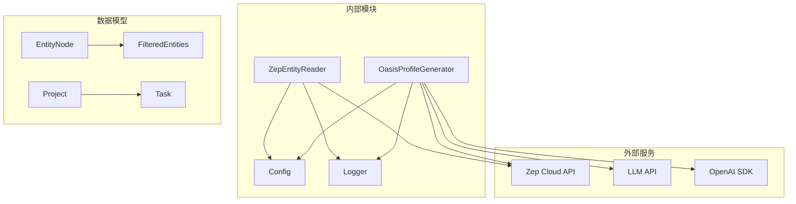

# Agent Profile生成系统技术文档

<cite>
**本文档引用的文件**
- [oasis_profile_generator.py](file://backend/app/services/oasis_profile_generator.py)
- [zep_entity_reader.py](file://backend/app/services/zep_entity_reader.py)
- [graph_builder.py](file://backend/app/services/graph_builder.py)
- [config.py](file://backend/app/config.py)
- [logger.py](file://backend/app/utils/logger.py)
- [project.py](file://backend/app/models/project.py)
- [task.py](file://backend/app/models/task.py)
- [README.md](file://README.md)
</cite>

## 目录
1. [简介](#简介)
2. [项目结构概览](#项目结构概览)
3. [核心组件分析](#核心组件分析)
4. [架构总览](#架构总览)
5. [详细组件分析](#详细组件分析)
6. [依赖关系分析](#依赖关系分析)
7. [性能考虑](#性能考虑)
8. [故障排除指南](#故障排除指南)
9. [结论](#结论)

## 简介

MiroFish的Agent Profile生成系统是基于多智能体技术的预测引擎的核心组件之一。该系统负责将Zep图谱中的实体转换为OASIS模拟平台所需的Agent Profile，为数字世界的智能体注入真实的人格特征和行为模式。

系统的主要目标是：
- 将图谱中的实体信息转换为可运行的Agent Profile
- 构建丰富的实体上下文信息
- 生成详细的人设和行为模式
- 支持个人实体和群体实体的不同处理策略
- 提供高质量的Agent配置以支持群体智能仿真

## 项目结构概览

MiroFish项目采用分层架构设计，Agent Profile生成系统位于后端服务层：

**图表来源**
- [oasis_profile_generator.py](file://backend/app/services/oasis_profile_generator.py#L142-L210)
- [zep_entity_reader.py](file://backend/app/services/zep_entity_reader.py#L70-L86)
- [config.py](file://backend/app/config.py#L20-L76)

**章节来源**
- [README.md](file://README.md#L81-L88)
- [oasis_profile_generator.py](file://backend/app/services/oasis_profile_generator.py#L1-L50)

## 核心组件分析

### OasisProfileGenerator类

OasisProfileGenerator是Agent Profile生成系统的核心类，负责将图谱实体转换为OASIS平台可用的Agent配置。该类实现了完整的Agent Profile生成流水线，包括实体上下文构建、属性提取、角色设定和行为模式配置。

#### 主要职责
- 实体上下文构建：整合实体属性、关系和图谱信息
- 人设生成：基于个人实体和群体实体生成详细的人格特征
- 平台适配：转换为Reddit和Twitter平台的Agent配置格式
- 并行处理：支持批量生成多个Agent Profile

#### 关键特性
- **智能实体分类**：区分个人实体和群体实体，采用不同的生成策略
- **上下文丰富化**：结合Zep图谱检索和实体属性信息
- **错误恢复**：提供规则生成作为LLM生成失败的后备方案
- **性能优化**：支持并行生成和实时输出

**章节来源**
- [oasis_profile_generator.py](file://backend/app/services/oasis_profile_generator.py#L142-L210)
- [oasis_profile_generator.py](file://backend/app/services/oasis_profile_generator.py#L211-L274)

## 架构总览

Agent Profile生成系统的整体架构采用分层设计，确保各组件职责清晰、耦合度低：

**图表来源**
- [oasis_profile_generator.py](file://backend/app/services/oasis_profile_generator.py#L211-L274)
- [zep_entity_reader.py](file://backend/app/services/zep_entity_reader.py#L222-L338)

## 详细组件分析

### 实体上下文构建算法

#### _build_entity_context方法

实体上下文构建是Agent Profile生成的核心步骤，该方法通过多层次的信息整合为Agent提供丰富的背景知识：

**图表来源**
- [oasis_profile_generator.py](file://backend/app/services/oasis_profile_generator.py#L413-L486)
- [oasis_profile_generator.py](file://backend/app/services/oasis_profile_generator.py#L285-L411)

##### 上下文构建流程详解

1. **实体属性提取**：从实体的attributes字段提取关键信息，过滤空值和无效数据
2. **关系信息处理**：分析实体相关的边信息，提取事实和关系描述
3. **关联节点获取**：收集与实体相关的其他节点信息，包括标签和摘要
4. **Zep混合检索**：通过并行查询获取更丰富的上下文信息
5. **信息融合**：合并所有来源的信息，去除重复内容

##### 优化策略

- **去重机制**：使用集合(set)确保事实信息的唯一性
- **层次化组织**：按照重要性和相关性组织上下文信息
- **长度控制**：限制上下文信息的长度，避免超出LLM输入限制

**章节来源**
- [oasis_profile_generator.py](file://backend/app/services/oasis_profile_generator.py#L413-L486)

### 图谱查询机制

#### _search_zep_for_entity方法

该方法实现了高效的Zep图谱查询机制，通过并行搜索和智能重试来获取丰富的实体信息：

**图表来源**
- [oasis_profile_generator.py](file://backend/app/services/oasis_profile_generator.py#L285-L411)

##### 查询策略

1. **并行搜索**：同时执行边搜索和节点搜索，提高查询效率
2. **智能重试**：实现指数退避的重试机制，处理网络不稳定情况
3. **结果合并**：将边搜索的事实信息和节点搜索的摘要信息合并
4. **上下文构建**：生成人类可读的综合上下文描述

##### 错误处理机制

- **超时处理**：设置30秒超时，避免长时间阻塞
- **异常捕获**：捕获并记录所有查询异常
- **降级策略**：即使查询失败也返回基础上下文信息

**章节来源**
- [oasis_profile_generator.py](file://backend/app/services/oasis_profile_generator.py#L285-L411)

### Agent配置生成流程

#### _generate_profile_with_llm方法

该方法实现了基于LLM的详细人设生成流程，支持个人实体和群体实体的不同处理策略：

**图表来源**
- [oasis_profile_generator.py](file://backend/app/services/oasis_profile_generator.py#L496-L581)

##### 生成策略

1. **实体类型判断**：根据实体类型选择不同的生成策略
2. **提示词构建**：为个人实体和群体实体构建专门的提示词模板
3. **LLM调用**：使用OpenAI格式的LLM API进行人设生成
4. **结果验证**：验证生成的JSON格式，确保符合要求
5. **错误恢复**：提供规则生成作为后备方案

##### 数据结构设计

Agent Profile使用统一的数据结构设计，支持不同平台的格式转换：

| 字段名 | 类型 | 描述 | 默认值 |
|--------|------|------|--------|
| user_id | int | 用户ID | 从0开始的序列号 |
| user_name | str | 用户名 | 自动生成 |
| name | str | 显示名称 | 实体名称 |
| bio | str | 简介 | 200字符限制 |
| persona | str | 详细人设 | 2000字符限制 |
| karma | int | Reddit积分 | 1000 |
| friend_count | int | Twitter好友数 | 100 |
| follower_count | int | Twitter粉丝数 | 150 |
| statuses_count | int | Twitter发帖数 | 500 |
| age | int | 年龄 | None |
| gender | str | 性别 | None |
| mbti | str | MBTI类型 | None |
| country | str | 国家 | None |
| profession | str | 职业 | None |
| interested_topics | list | 感兴趣话题 | [] |
| source_entity_uuid | str | 源实体UUID | None |
| source_entity_type | str | 源实体类型 | None |
| created_at | str | 创建时间 | 当前日期 |

**章节来源**
- [oasis_profile_generator.py](file://backend/app/services/oasis_profile_generator.py#L28-L140)
- [oasis_profile_generator.py](file://backend/app/services/oasis_profile_generator.py#L496-L581)

### 实体类型分类系统

系统实现了智能的实体类型分类机制，支持个人实体和群体实体的不同处理策略：

**图表来源**
- [oasis_profile_generator.py](file://backend/app/services/oasis_profile_generator.py#L168-L178)

#### 个人实体特征

个人实体具有以下典型特征：
- 具有明确的个人身份和特征
- 需要详细的个人信息和心理特征
- 支持复杂的MBTI类型和个性特征
- 包含个人经历和社交关系

#### 群体实体特征

群体实体具有以下典型特征：
- 代表特定组织或群体
- 需要官方化的表述和风格
- 使用"other"性别标识
- 强调机构职能和立场

**章节来源**
- [oasis_profile_generator.py](file://backend/app/services/oasis_profile_generator.py#L168-L178)

## 依赖关系分析

### 外部依赖

系统依赖以下外部服务和库：

**图表来源**
- [oasis_profile_generator.py](file://backend/app/services/oasis_profile_generator.py#L18-L25)
- [zep_entity_reader.py](file://backend/app/services/zep_entity_reader.py#L10-L15)

### 内部依赖关系

系统内部模块之间的依赖关系清晰且职责明确：

1. **配置管理**：Config类提供统一的配置访问接口
2. **日志系统**：Logger模块提供统一的日志记录功能
3. **实体读取**：ZepEntityReader负责图谱数据的获取和处理
4. **Agent生成**：OasisProfileGenerator实现核心的Agent配置生成逻辑

**章节来源**
- [config.py](file://backend/app/config.py#L20-L76)
- [logger.py](file://backend/app/utils/logger.py#L30-L88)

## 性能考虑

### 并行处理优化

系统实现了多级并行处理机制以提升性能：

1. **批量生成并行**：支持多线程并行生成多个Agent Profile
2. **查询并行**：Zep检索使用ThreadPoolExecutor并行执行
3. **实时输出**：支持实时写入生成的Agent配置

### 缓存和重用策略

- **实体上下文缓存**：避免重复的Zep查询
- **LLM调用优化**：合理设置温度参数，平衡创造力和稳定性
- **错误恢复**：提供规则生成作为LLM失败的快速后备

### 内存管理

- **流式处理**：支持实时输出，避免大量内存占用
- **预分配列表**：批量生成时预分配结果列表，保持顺序一致性
- **资源清理**：及时释放线程池和临时资源

## 故障排除指南

### 常见问题和解决方案

#### LLM API配置问题

**问题症状**：生成Agent失败，出现API调用错误
**解决方案**：
1. 检查LLM_API_KEY配置
2. 验证LLM_BASE_URL和LLM_MODEL_NAME设置
3. 确认API配额和权限

#### Zep API配置问题

**问题症状**：Zep检索失败，无法获取实体上下文
**解决方案**：
1. 验证ZEP_API_KEY配置
2. 检查graph_id设置
3. 确认Zep账户权限和配额

#### JSON解析错误

**问题症状**：LLM返回的JSON格式不正确
**解决方案**：
1. 检查提示词模板的完整性
2. 验证response_format设置
3. 实施JSON修复机制

### 调试技巧

1. **启用详细日志**：设置日志级别为DEBUG获取更多调试信息
2. **监控API调用**：记录所有外部API调用的响应时间和错误
3. **性能分析**：监控生成过程中的内存使用和CPU占用
4. **错误追踪**：使用异常追踪信息定位具体问题

**章节来源**
- [config.py](file://backend/app/config.py#L66-L75)
- [logger.py](file://backend/app/utils/logger.py#L30-L88)

## 结论

MiroFish的Agent Profile生成系统是一个高度集成的智能系统，通过精心设计的架构和优化策略，成功地将图谱中的实体转换为高质量的Agent配置。系统的主要优势包括：

1. **智能化的实体分类**：能够准确识别个人实体和群体实体，采用不同的生成策略
2. **丰富的上下文构建**：通过多层次的信息整合为Agent提供真实可信的背景
3. **鲁棒的错误处理**：提供完善的错误恢复机制，确保系统的稳定性
4. **高性能的并行处理**：支持大规模Agent的快速生成和部署
5. **灵活的平台适配**：支持多种平台格式的Agent配置输出

该系统为MiroFish的群体智能仿真提供了坚实的基础，通过高质量的Agent配置，能够有效模拟复杂的社会现象和群体行为，为预测分析和决策支持提供有力支撑。