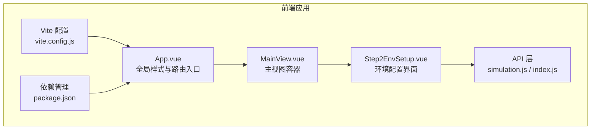
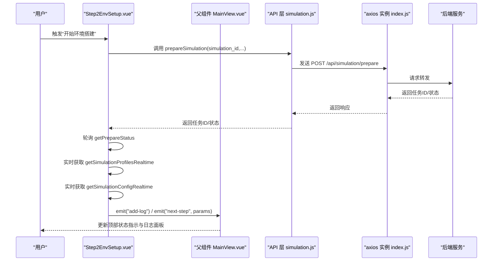
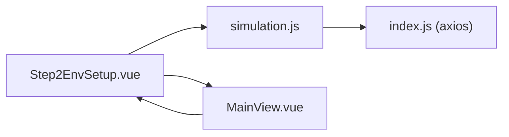

# 前端环境配置界面

<cite>
**本文引用的文件**
- [Step2EnvSetup.vue](file://frontend/src/components/Step2EnvSetup.vue)
- [simulation.js](file://frontend/src/api/simulation.js)
- [index.js](file://frontend/src/api/index.js)
- [MainView.vue](file://frontend/src/views/MainView.vue)
- [App.vue](file://frontend/src/App.vue)
- [vite.config.js](file://frontend/vite.config.js)
- [package.json](file://frontend/package.json)
</cite>

## 目录
1. [简介](#简介)
2. [项目结构](#项目结构)
3. [核心组件](#核心组件)
4. [架构总览](#架构总览)
5. [详细组件分析](#详细组件分析)
6. [依赖关系分析](#依赖关系分析)
7. [性能考量](#性能考量)
8. [故障排除指南](#故障排除指南)
9. [结论](#结论)
10. [附录](#附录)

## 简介
本文件面向前端开发者与产品使用者，系统化梳理 MiroFish 前端“Step2 环境配置”界面（Step2EnvSetup.vue）的设计理念、实现细节与使用指南。文档涵盖用户交互流程、数据绑定机制、状态管理、组件通信模式、布局与可视化设计、表单验证与实时反馈、与后端 API 的集成与异步处理、错误状态显示、响应式与可访问性、跨浏览器兼容性，以及扩展与定制的技术参考。

## 项目结构
前端采用 Vue 3 + Vite 架构，组件位于 frontend/src/components，API 层封装在 frontend/src/api，视图层在 frontend/src/views。Step2EnvSetup 作为主视图 MainView 的右侧步骤面板之一，负责“环境搭建”阶段的可视化与交互。

图表来源
- [App.vue](file://frontend/src/App.vue#L1-L48)
- [MainView.vue](file://frontend/src/views/MainView.vue#L1-L120)
- [Step2EnvSetup.vue](file://frontend/src/components/Step2EnvSetup.vue#L1-L120)
- [simulation.js](file://frontend/src/api/simulation.js#L1-L68)
- [index.js](file://frontend/src/api/index.js#L1-L68)
- [vite.config.js](file://frontend/vite.config.js#L1-L19)
- [package.json](file://frontend/package.json#L1-L22)

章节来源
- [MainView.vue](file://frontend/src/views/MainView.vue#L1-L120)
- [Step2EnvSetup.vue](file://frontend/src/components/Step2EnvSetup.vue#L1-L120)
- [simulation.js](file://frontend/src/api/simulation.js#L1-L68)
- [index.js](file://frontend/src/api/index.js#L1-L68)
- [vite.config.js](file://frontend/vite.config.js#L1-L19)
- [package.json](file://frontend/package.json#L1-L22)

## 核心组件
- Step2EnvSetup.vue：环境配置界面的核心组件，负责：
  - 异步准备模拟环境（创建任务、轮询进度）
  - 实时获取 Agent 人设与配置
  - 展示时间配置、Agent 参数、平台算法配置、初始激活编排
  - 提供“自定义轮数”的滑动控制与自动推荐
  - 通过事件向父组件 MainView 传递“下一步”参数与日志

- API 层：
  - simulation.js：封装 /api/simulation/* 接口（创建、准备、状态查询、配置获取等）
  - index.js：统一的 axios 实例与拦截器、重试机制

- MainView.vue：承载 Step2EnvSetup 的父容器，负责步骤切换、日志聚合与状态指示。

章节来源
- [Step2EnvSetup.vue](file://frontend/src/components/Step2EnvSetup.vue#L634-L1081)
- [simulation.js](file://frontend/src/api/simulation.js#L1-L188)
- [index.js](file://frontend/src/api/index.js#L1-L68)
- [MainView.vue](file://frontend/src/views/MainView.vue#L60-L176)

## 架构总览
Step2EnvSetup 与后端 API 的交互采用“异步任务 + 实时轮询”的模式，结合系统日志面板提供实时反馈。组件内部通过 Vue 响应式系统驱动 UI 更新，通过事件与父组件 MainView 通信。

图表来源
- [Step2EnvSetup.vue](file://frontend/src/components/Step2EnvSetup.vue#L768-L1081)
- [simulation.js](file://frontend/src/api/simulation.js#L15-L68)
- [index.js](file://frontend/src/api/index.js#L1-L68)
- [MainView.vue](file://frontend/src/views/MainView.vue#L141-L176)

## 详细组件分析

### 设计理念与交互流程
- 分步式可视化：以“步骤卡片”形式分阶段展示“实例初始化、生成人设、生成配置、初始激活、准备完成”，配合“活动/完成/等待”状态徽章与进度百分比，帮助用户理解当前所处阶段。
- 实时反馈：通过系统日志面板滚动输出关键节点与阶段性结果，避免用户等待时的不确定性。
- 可视化配置：将复杂的时间配置、Agent 参数、平台算法参数以卡片网格与时间轴形式呈现，便于快速理解与核对。
- 自定义轮数：在“准备完成”阶段提供“自定义/自动”两种模式，滑动条支持范围与推荐值提示，兼顾新手友好与高级用户精细控制。

章节来源
- [Step2EnvSetup.vue](file://frontend/src/components/Step2EnvSetup.vue#L1-L530)

### 数据绑定机制与状态管理
- 组件内状态：
  - phase：当前步骤阶段（0~4）
  - taskId：准备任务ID
  - prepareProgress/currentStage/progressMessage：准备阶段进度与描述
  - profiles/entityTypes/expectedTotal：Agent 人设集合与统计
  - simulationConfig：完整配置对象
  - selectedProfile：选中的人设详情弹窗
  - useCustomRounds/customMaxRounds：轮数配置开关与数值
- 父组件状态：
  - MainView 维护 systemLogs 数组，Step2EnvSetup 通过 emit("add-log") 推送日志，实现全局日志聚合与滚动。

章节来源
- [Step2EnvSetup.vue](file://frontend/src/components/Step2EnvSetup.vue#L653-L704)
- [MainView.vue](file://frontend/src/views/MainView.vue#L141-L148)

### 组件通信模式
- 子 -> 父：
  - emit("add-log")：推送系统日志
  - emit("next-step", params)：携带 maxRounds 参数进入下一步
  - emit("go-back")：返回上一步
- 父 -> 子：
  - 通过 props 传入 simulationId、projectData、graphData、systemLogs
  - MainView 在进入 Step3 时根据 params.maxRounds 写入日志

章节来源
- [Step2EnvSetup.vue](file://frontend/src/components/Step2EnvSetup.vue#L651-L755)
- [MainView.vue](file://frontend/src/views/MainView.vue#L159-L176)

### 布局设计与可视化
- 步骤卡片：标题、状态徽章、描述与 API 注释，突出关键信息
- 统计网格：当前 Agent 数、预期总数、话题数
- 人设预览：网格卡片展示头像、姓名、职业、简介与话题标签，支持点击查看详情
- 配置面板：时间配置（小时/轮/轮次）、活跃时段时间轴、Agent 参数（发帖/评论/响应延迟/活跃度/情感倾向/影响力）、平台算法权重
- 编排内容：叙事方向、热点话题、初始帖子时间线
- 轮数配置：自定义/自动模式切换，滑动条与推荐标记，预估耗时提示

章节来源
- [Step2EnvSetup.vue](file://frontend/src/components/Step2EnvSetup.vue#L136-L527)

### 表单验证逻辑与实时反馈
- 输入校验：
  - 自定义轮数滑动范围：最小 10，最大为自动生成的最大轮数；滑动条动态计算百分比进度
  - 推荐值：40 轮作为默认推荐，点击可一键设置
- 实时反馈：
  - 日志去重：避免重复输出相同阶段或进度信息
  - 配置生成阶段日志：按 generation_stage 输出阶段提示
  - 人设生成进度：按数量变化输出最新 Agent 名称与职业
  - 时间配置摘要：输出每轮时长与总轮次
  - 事件配置摘要：输出叙事方向与热点话题数量

章节来源
- [Step2EnvSetup.vue](file://frontend/src/components/Step2EnvSetup.vue#L666-L704)
- [Step2EnvSetup.vue](file://frontend/src/components/Step2EnvSetup.vue#L863-L889)
- [Step2EnvSetup.vue](file://frontend/src/components/Step2EnvSetup.vue#L974-L981)
- [Step2EnvSetup.vue](file://frontend/src/components/Step2EnvSetup.vue#L930-L945)

### 与后端 API 的集成
- 创建模拟实例：POST /api/simulation/create（由上游 Step1GraphBuild 或外部流程提供 simulation_id）
- 准备模拟环境：POST /api/simulation/prepare（返回 task_id）
- 查询准备进度：POST /api/simulation/prepare/status（轮询）
- 获取 Agent 人设（实时）：GET /api/simulation/{id}/profiles/realtime
- 获取配置（实时）：GET /api/simulation/{id}/config/realtime
- 启动模拟：POST /api/simulation/start（携带 max_rounds）

章节来源
- [simulation.js](file://frontend/src/api/simulation.js#L7-L169)
- [Step2EnvSetup.vue](file://frontend/src/components/Step2EnvSetup.vue#L782-L822)
- [Step2EnvSetup.vue](file://frontend/src/components/Step2EnvSetup.vue#L846-L906)
- [Step2EnvSetup.vue](file://frontend/src/components/Step2EnvSetup.vue#L908-L950)
- [Step2EnvSetup.vue](file://frontend/src/components/Step2EnvSetup.vue#L964-L1018)
- [Step2EnvSetup.vue](file://frontend/src/components/Step2EnvSetup.vue#L741-L755)

### 异步数据处理与错误状态显示
- 轮询策略：
  - 准备进度轮询：2 秒间隔
  - 人设实时轮询：3 秒间隔
  - 配置实时轮询：2 秒间隔
- 错误处理：
  - axios 拦截器统一处理非 success 状态与网络错误
  - 轮询失败时记录警告，避免中断整体流程
  - 父组件通过 emit("update-status") 与状态指示联动

章节来源
- [index.js](file://frontend/src/api/index.js#L23-L51)
- [Step2EnvSetup.vue](file://frontend/src/components/Step2EnvSetup.vue#L824-L844)
- [Step2EnvSetup.vue](file://frontend/src/components/Step2EnvSetup.vue#L953-L962)

### 用户体验优化策略
- 自动滚动日志：systemLogs 变化时自动滚动到底部
- 动画过渡：轮数配置切换使用淡入动画，弹窗使用缩放与透明度过渡
- 可访问性：语义化标签与键盘可达；颜色对比满足基础可读性要求
- 响应式：卡片网格与滚动容器适配不同屏幕尺寸

章节来源
- [Step2EnvSetup.vue](file://frontend/src/components/Step2EnvSetup.vue#L1058-L1066)
- [Step2EnvSetup.vue](file://frontend/src/components/Step2EnvSetup.vue#L2563-L2601)

### 与父组件 MainView 的协作
- MainView 负责：
  - 步骤切换与状态指示
  - 日志聚合与显示
  - 将 maxRounds 参数透传给 Step2EnvSetup
- Step2EnvSetup 负责：
  - 触发“下一步”并携带轮数配置
  - 持续推送系统日志

章节来源
- [MainView.vue](file://frontend/src/views/MainView.vue#L159-L176)
- [Step2EnvSetup.vue](file://frontend/src/components/Step2EnvSetup.vue#L741-L755)

## 依赖关系分析

图表来源
- [Step2EnvSetup.vue](file://frontend/src/components/Step2EnvSetup.vue#L634-L651)
- [simulation.js](file://frontend/src/api/simulation.js#L1-L68)
- [index.js](file://frontend/src/api/index.js#L1-L68)
- [MainView.vue](file://frontend/src/views/MainView.vue#L60-L76)

章节来源
- [Step2EnvSetup.vue](file://frontend/src/components/Step2EnvSetup.vue#L634-L651)
- [simulation.js](file://frontend/src/api/simulation.js#L1-L68)
- [index.js](file://frontend/src/api/index.js#L1-L68)
- [MainView.vue](file://frontend/src/views/MainView.vue#L60-L76)

## 性能考量
- 轮询频率权衡：2~3 秒轮询频率在保证实时性的同时避免过度请求压力
- 数据去重：日志与进度输出采用去重策略，减少冗余渲染
- 滚动优化：仅在日志数组长度变化时触发滚动，避免频繁 DOM 操作
- 组件卸载清理：onUnmounted 中清理定时器，防止内存泄漏与后台轮询

章节来源
- [Step2EnvSetup.vue](file://frontend/src/components/Step2EnvSetup.vue#L863-L889)
- [Step2EnvSetup.vue](file://frontend/src/components/Step2EnvSetup.vue#L1058-L1066)
- [Step2EnvSetup.vue](file://frontend/src/components/Step2EnvSetup.vue#L1076-L1080)

## 故障排除指南
- 现象：无法开始准备或无进度
  - 检查 simulationId 是否传入
  - 查看系统日志中“准备任务已启动/失败”提示
  - 确认后端服务可用与网络连通
- 现象：人设或配置长时间未更新
  - 检查实时接口返回字段是否为空
  - 确认轮询定时器是否被清理（组件卸载时会清理）
- 现象：轮数滑动无效
  - 检查 useCustomRounds 是否启用
  - 确认 autoGeneratedRounds 已计算（配置生成后）
- 现象：日志不滚动
  - 确认 systemLogs 数组长度变化
  - 检查 logContent DOM 是否存在

章节来源
- [Step2EnvSetup.vue](file://frontend/src/components/Step2EnvSetup.vue#L768-L822)
- [Step2EnvSetup.vue](file://frontend/src/components/Step2EnvSetup.vue#L846-L906)
- [Step2EnvSetup.vue](file://frontend/src/components/Step2EnvSetup.vue#L964-L1018)
- [Step2EnvSetup.vue](file://frontend/src/components/Step2EnvSetup.vue#L1058-L1066)

## 结论
Step2EnvSetup 通过清晰的步骤化界面、实时轮询与可视化配置，为用户提供可控、可观测的环境搭建体验。其与 API 层的解耦设计与父组件的协作机制，确保了功能扩展与维护的便利性。建议在后续迭代中进一步增强错误恢复与重试策略、完善可访问性标签与键盘导航，并考虑引入节流/防抖优化高频轮询场景。

## 附录

### 界面使用指南
- 进入步骤：在 MainView 中点击“进入环境搭建”
- 开始准备：组件自动发起 prepareSimulation 并轮询进度
- 查看人设：在“生成人设”阶段可浏览 Agent 预览卡片，点击查看详情
- 配置核对：在“生成配置”阶段查看时间配置、Agent 参数与平台算法
- 初始激活：在“初始激活编排”阶段查看叙事方向、热点话题与初始帖子
- 设置轮数：在“准备完成”阶段选择“自定义”模式，拖动滑条设置轮数
- 进入下一步：点击“开始双世界并行模拟”，系统将携带 maxRounds 参数进入下一步

章节来源
- [MainView.vue](file://frontend/src/views/MainView.vue#L375-L381)
- [Step2EnvSetup.vue](file://frontend/src/components/Step2EnvSetup.vue#L438-L527)

### 响应式设计与可访问性
- 响应式：卡片网格、滚动容器与日志面板适配不同宽度
- 可访问性：语义化标签、颜色对比、键盘可达；建议补充 ARIA 标签与焦点管理
- 跨浏览器：基于 Vue 3 与现代浏览器特性，建议在 IE/Edge Legacy 放弃支持或添加 polyfill

章节来源
- [App.vue](file://frontend/src/App.vue#L9-L47)
- [Step2EnvSetup.vue](file://frontend/src/components/Step2EnvSetup.vue#L1083-L1110)

### 技术扩展与定制参考
- 新增配置项：在 simulationConfig 对象中扩展字段后，在模板中新增对应区块
- 自定义轮数范围：调整 min/max 与推荐值，同时更新预估耗时提示
- 新增阶段：在 currentStage 匹配逻辑中加入新阶段名，并在日志中输出对应提示
- 错误处理：在 axios 拦截器中增加特定错误码分支，或在组件中针对特定接口细化处理

章节来源
- [simulation.js](file://frontend/src/api/simulation.js#L66-L68)
- [index.js](file://frontend/src/api/index.js#L23-L51)
- [Step2EnvSetup.vue](file://frontend/src/components/Step2EnvSetup.vue#L675-L689)
- [Step2EnvSetup.vue](file://frontend/src/components/Step2EnvSetup.vue#L464-L484)