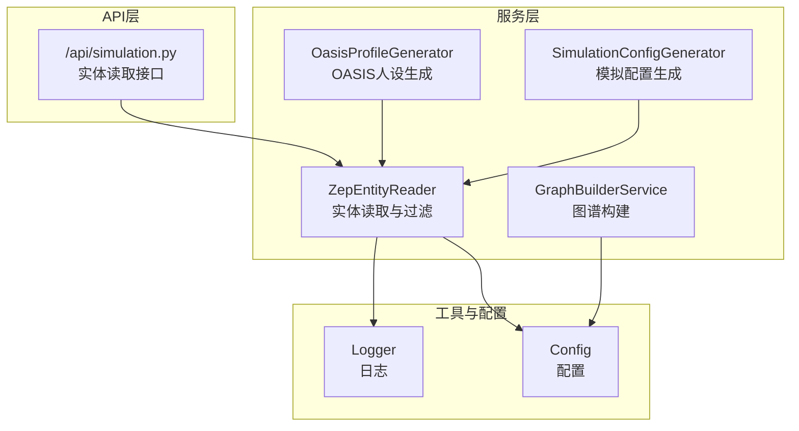
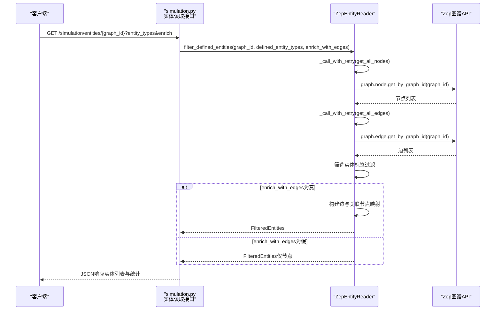
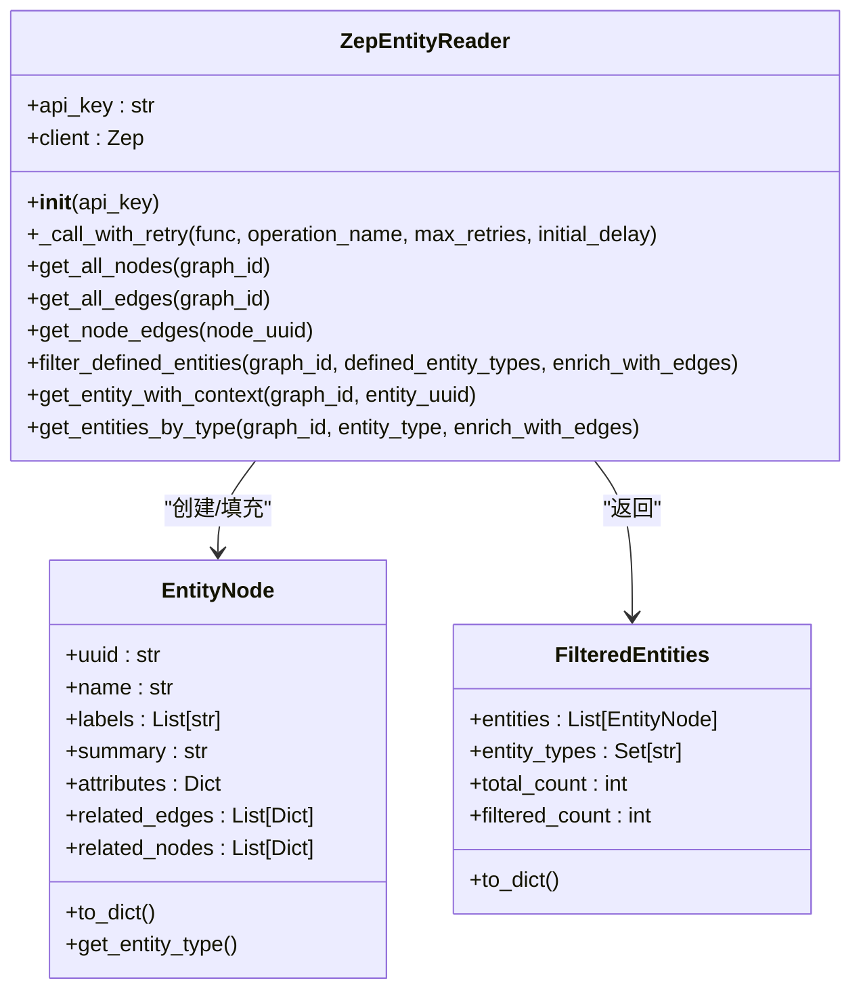
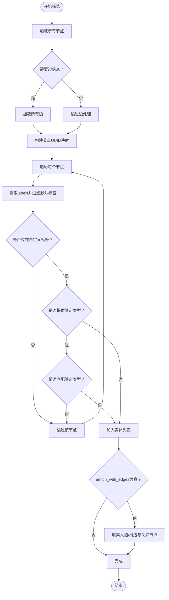
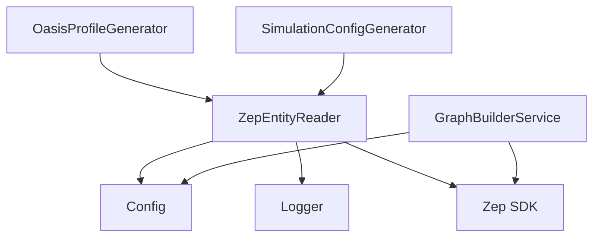

# 实体关系抽取

<cite>
**本文引用的文件**
- [zep_entity_reader.py](file://backend/app/services/zep_entity_reader.py)
- [graph_builder.py](file://backend/app/services/graph_builder.py)
- [simulation.py](file://backend/app/api/simulation.py)
- [oasis_profile_generator.py](file://backend/app/services/oasis_profile_generator.py)
- [simulation_config_generator.py](file://backend/app/services/simulation_config_generator.py)
- [logger.py](file://backend/app/utils/logger.py)
- [config.py](file://backend/app/config.py)
</cite>

## 目录
1. [简介](#简介)
2. [项目结构](#项目结构)
3. [核心组件](#核心组件)
4. [架构概览](#架构概览)
5. [详细组件分析](#详细组件分析)
6. [依赖分析](#依赖分析)
7. [性能考虑](#性能考虑)
8. [故障排查指南](#故障排查指南)
9. [结论](#结论)
10. [附录](#附录)

## 简介
本技术文档聚焦于MiroFish项目中的实体关系抽取模块，重点解析ZepEntityReader类的功能与实现细节。该模块负责从Zep图谱中读取节点、筛选符合预定义实体类型的节点、获取实体相关边与关联节点信息，并以EntityNode与FilteredEntities两种数据结构组织结果。文档将深入阐述实体筛选算法、标签过滤逻辑、实体类型识别机制以及上下文信息增强策略，提供API使用示例、错误处理机制与性能优化建议，并总结配置参数、最佳实践与常见问题解决方案。

## 项目结构
实体关系抽取模块位于后端服务层，与图谱构建、模拟配置生成、OASIS人设生成等模块协同工作。关键文件与职责如下：
- backend/app/services/zep_entity_reader.py：实体读取与过滤服务，包含ZepEntityReader、EntityNode、FilteredEntities三类核心代码。
- backend/app/services/graph_builder.py：图谱构建服务，负责创建图谱、设置本体、添加文本批次、等待处理完成与获取图谱数据。
- backend/app/api/simulation.py：模拟相关API路由，提供实体读取接口，调用ZepEntityReader完成实体过滤与上下文增强。
- backend/app/services/oasis_profile_generator.py：OASIS人设生成器，复用EntityNode结构，进行实体上下文构建与检索增强。
- backend/app/services/simulation_config_generator.py：模拟配置生成器，使用EntityNode进行实体摘要与分组展示。
- backend/app/utils/logger.py：统一日志配置，支持控制台与文件输出。
- backend/app/config.py：配置管理，加载.env并提供ZEP_API_KEY等配置项。

图表来源
- [simulation.py](file://backend/app/api/simulation.py#L47-L159)
- [zep_entity_reader.py](file://backend/app/services/zep_entity_reader.py#L70-L444)
- [graph_builder.py](file://backend/app/services/graph_builder.py#L38-L499)
- [oasis_profile_generator.py](file://backend/app/services/oasis_profile_generator.py#L413-L486)
- [simulation_config_generator.py](file://backend/app/services/simulation_config_generator.py#L408-L431)
- [logger.py](file://backend/app/utils/logger.py#L30-L104)
- [config.py](file://backend/app/config.py#L20-L76)

章节来源
- [zep_entity_reader.py](file://backend/app/services/zep_entity_reader.py#L1-L445)
- [graph_builder.py](file://backend/app/services/graph_builder.py#L1-L500)
- [simulation.py](file://backend/app/api/simulation.py#L1-L200)
- [oasis_profile_generator.py](file://backend/app/services/oasis_profile_generator.py#L410-L609)
- [simulation_config_generator.py](file://backend/app/services/simulation_config_generator.py#L408-L599)
- [logger.py](file://backend/app/utils/logger.py#L1-L127)
- [config.py](file://backend/app/config.py#L1-L76)

## 核心组件
- ZepEntityReader：从Zep图谱读取节点、筛选实体、获取边与关联节点、提供单实体上下文查询与按类型查询。
- EntityNode：实体节点数据结构，包含标识、名称、标签、摘要、属性、相关边与关联节点。
- FilteredEntities：聚合过滤结果，包含实体列表、发现的实体类型集合、总数与过滤后数量。

章节来源
- [zep_entity_reader.py](file://backend/app/services/zep_entity_reader.py#L21-L67)

## 架构概览
实体关系抽取在API层触发，通过ZepEntityReader完成图谱读取与实体筛选，随后可选择性地增强上下文信息（边与关联节点）。OASIS人设生成器与模拟配置生成器复用EntityNode结构，分别进行检索增强与实体摘要展示。

图表来源
- [simulation.py](file://backend/app/api/simulation.py#L47-L89)
- [zep_entity_reader.py](file://backend/app/services/zep_entity_reader.py#L126-L187)
- [zep_entity_reader.py](file://backend/app/services/zep_entity_reader.py#L222-L338)

## 详细组件分析

### ZepEntityReader类
- 初始化与配置
  - 从Config读取ZEP_API_KEY，若缺失则抛出异常。
  - 基于Zep SDK创建客户端实例。
- 重试机制
  - _call_with_retry封装Zep API调用，支持指数退避重试，记录警告与错误日志。
- 节点与边读取
  - get_all_nodes：获取图谱所有节点，兼容不同SDK字段命名。
  - get_all_edges：获取图谱所有边，兼容不同SDK字段命名。
  - get_node_edges：获取指定节点的所有相关边。
- 实体筛选与上下文增强
  - filter_defined_entities：核心筛选逻辑
    - 标签过滤：仅保留labels中除"Entity"和"Node"之外的自定义标签。
    - 实体类型识别：若提供defined_entity_types，则仅保留匹配类型；否则取首个自定义标签作为实体类型。
    - 上下文增强：当enrich_with_edges为真时，遍历所有边，收集入边与出边，建立关联节点集合，并补充关联节点基本信息。
  - get_entity_with_context：获取单个实体及其完整上下文（边与关联节点）。
  - get_entities_by_type：按实体类型获取实体列表。
- 数据结构
  - EntityNode：包含uuid、name、labels、summary、attributes、related_edges、related_nodes。
  - FilteredEntities：包含entities、entity_types、total_count、filtered_count。

图表来源
- [zep_entity_reader.py](file://backend/app/services/zep_entity_reader.py#L70-L444)

章节来源
- [zep_entity_reader.py](file://backend/app/services/zep_entity_reader.py#L70-L444)

### 实体筛选算法与标签过滤逻辑
- 标签过滤
  - 仅当节点labels包含除"Entity"和"Node"之外的标签时，视为符合预定义实体类型。
  - 若提供defined_entity_types，则进一步限定为匹配的类型集合。
- 实体类型识别
  - 优先使用匹配的类型；若未提供限定类型，则取首个自定义标签作为实体类型。
- 上下文增强
  - 当enrich_with_edges为真时，遍历所有边，构建“源节点-目标节点”映射，收集入边与出边，并补充关联节点基本信息。

图表来源
- [zep_entity_reader.py](file://backend/app/services/zep_entity_reader.py#L222-L338)

章节来源
- [zep_entity_reader.py](file://backend/app/services/zep_entity_reader.py#L222-L338)

### EntityNode与FilteredEntities设计
- EntityNode
  - 字段：uuid、name、labels、summary、attributes、related_edges、related_nodes。
  - 方法：to_dict用于序列化；get_entity_type用于识别实体类型（排除默认标签）。
- FilteredEntities
  - 字段：entities、entity_types、total_count、filtered_count。
  - 方法：to_dict用于序列化结果，便于API返回。

章节来源
- [zep_entity_reader.py](file://backend/app/services/zep_entity_reader.py#L21-L67)

### API使用示例
- 获取图谱中的所有实体（已过滤）
  - 请求：GET /api/simulation/entities/{graph_id}?entity_types={逗号分隔}&enrich=true
  - 响应：包含entities、entity_types、total_count、filtered_count。
- 获取单个实体的详细信息
  - 请求：GET /api/simulation/entities/{graph_id}/{entity_uuid}
  - 响应：包含实体节点与上下文信息。
- 按实体类型获取实体列表
  - 请求：GET /api/simulation/entities/{graph_id}/by-type/{entity_type}?enrich=true
  - 响应：包含实体类型、数量与实体列表。

章节来源
- [simulation.py](file://backend/app/api/simulation.py#L47-L159)

## 依赖分析
- 内部依赖
  - ZepEntityReader依赖Config（ZEP_API_KEY）、Logger（日志）。
  - OasisProfileGenerator与SimulationConfigGenerator复用EntityNode结构，进行上下文构建与实体摘要。
- 外部依赖
  - zep_cloud.client.Zep：调用Zep图谱API。
  - dataclasses：用于EntityNode与FilteredEntities的数据结构定义。
  - typing：类型提示与泛型返回类型。

图表来源
- [zep_entity_reader.py](file://backend/app/services/zep_entity_reader.py#L10-L15)
- [graph_builder.py](file://backend/app/services/graph_builder.py#L13-L18)
- [oasis_profile_generator.py](file://backend/app/services/oasis_profile_generator.py#L22-L22)
- [simulation_config_generator.py](file://backend/app/services/simulation_config_generator.py#L22-L22)

章节来源
- [zep_entity_reader.py](file://backend/app/services/zep_entity_reader.py#L1-L445)
- [graph_builder.py](file://backend/app/services/graph_builder.py#L1-L500)
- [oasis_profile_generator.py](file://backend/app/services/oasis_profile_generator.py#L1-L1201)
- [simulation_config_generator.py](file://backend/app/services/simulation_config_generator.py#L1-L988)

## 性能考虑
- 重试与指数退避
  - _call_with_retry采用指数退避策略，减少瞬时错误导致的失败重试成本。
- 批量与缓存
  - get_all_nodes与get_all_edges一次性拉取全量数据，避免多次往返；通过node_map快速定位关联节点。
- 边与节点映射
  - 使用集合去重关联节点UUID，降低重复查询与重复处理开销。
- 可选上下文增强
  - enrich_with_edges为false时跳过边与关联节点处理，显著减少API调用与数据处理量。
- 日志与可观测性
  - 统一日志输出，便于定位性能瓶颈与错误原因。

章节来源
- [zep_entity_reader.py](file://backend/app/services/zep_entity_reader.py#L87-L124)
- [zep_entity_reader.py](file://backend/app/services/zep_entity_reader.py#L222-L338)
- [logger.py](file://backend/app/utils/logger.py#L30-L104)

## 故障排查指南
- 配置问题
  - ZEP_API_KEY未配置：初始化时抛出异常，需在.env中设置ZEP_API_KEY。
- API调用失败
  - _call_with_retry记录警告与错误日志，最多重试3次；若仍失败，抛出异常。
- 单节点边获取失败
  - get_node_edges捕获异常并返回空列表，不影响整体筛选流程。
- 实体不存在
  - get_entity_with_context返回None，API层返回404。
- 日志定位
  - 使用get_logger('mirofish.zep_entity_reader')与get_logger('mirofish.api.simulation')查看实体读取与API层日志。

章节来源
- [zep_entity_reader.py](file://backend/app/services/zep_entity_reader.py#L80-L85)
- [zep_entity_reader.py](file://backend/app/services/zep_entity_reader.py#L87-L124)
- [zep_entity_reader.py](file://backend/app/services/zep_entity_reader.py#L199-L220)
- [simulation.py](file://backend/app/api/simulation.py#L95-L122)
- [logger.py](file://backend/app/utils/logger.py#L91-L104)

## 结论
ZepEntityReader通过简洁而高效的筛选算法与上下文增强策略，实现了从Zep图谱中稳定提取实体的目标。其数据结构设计清晰，API接口明确，配合重试机制与日志体系，具备良好的可维护性与可扩展性。在实际应用中，建议合理使用enrich_with_edges参数与实体类型限定，以平衡性能与信息完整性。

## 附录

### API定义与使用
- 获取实体列表
  - 方法：GET
  - 路径：/api/simulation/entities/{graph_id}
  - 查询参数：
    - entity_types：逗号分隔的实体类型列表（可选）
    - enrich：是否获取相关边信息（默认true）
  - 响应：FilteredEntities序列化结果
- 获取单个实体详情
  - 方法：GET
  - 路径：/api/simulation/entities/{graph_id}/{entity_uuid}
  - 响应：EntityNode序列化结果
- 按类型获取实体
  - 方法：GET
  - 路径：/api/simulation/entities/{graph_id}/by-type/{entity_type}
  - 查询参数：
    - enrich：是否获取相关边信息（默认true）
  - 响应：包含实体类型、数量与实体列表

章节来源
- [simulation.py](file://backend/app/api/simulation.py#L47-L159)

### 配置参数说明
- ZEP_API_KEY：Zep图谱API密钥，用于初始化Zep客户端。
- 其他相关配置：见Config类，包括LLM配置、上传目录、默认分块大小等。

章节来源
- [config.py](file://backend/app/config.py#L20-L76)

### 最佳实践
- 在大规模图谱上启用enrich_with_edges时，建议先进行小规模测试，评估性能影响。
- 明确实体类型限定，减少不必要的上下文处理。
- 使用日志与监控关注API调用耗时与错误率，及时发现异常。

### 常见问题与解决方案
- 无法连接Zep：检查ZEP_API_KEY配置与网络连通性。
- 实体为空：确认图谱中存在非默认标签的节点，或提供正确的实体类型限定。
- 性能瓶颈：关闭enrich_with_edges或分批处理，结合日志分析瓶颈环节。