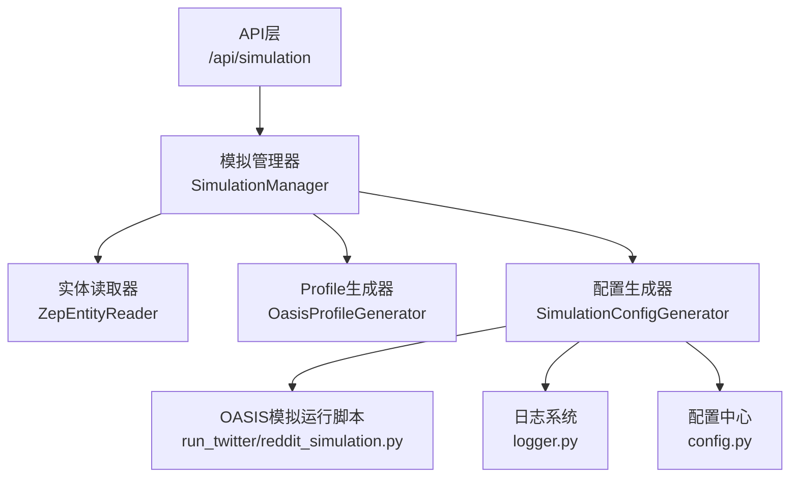
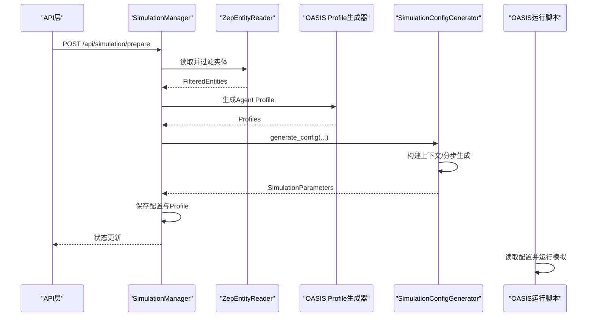
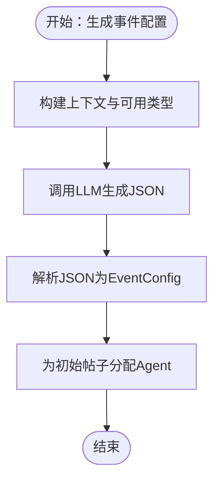
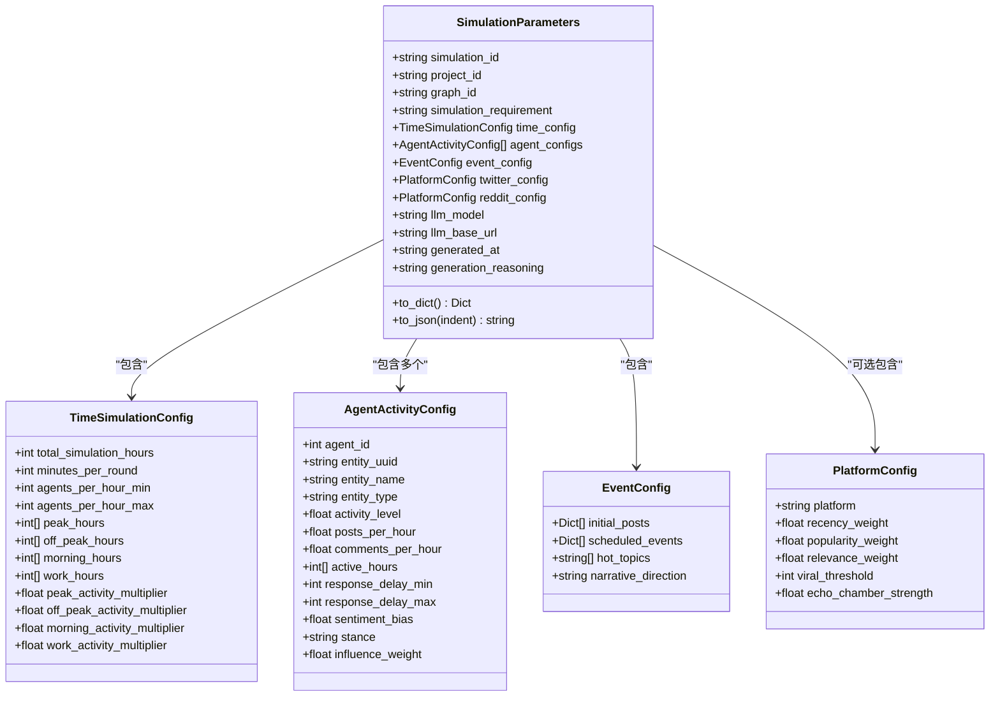
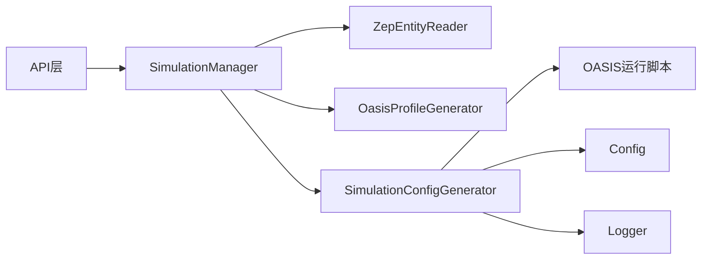
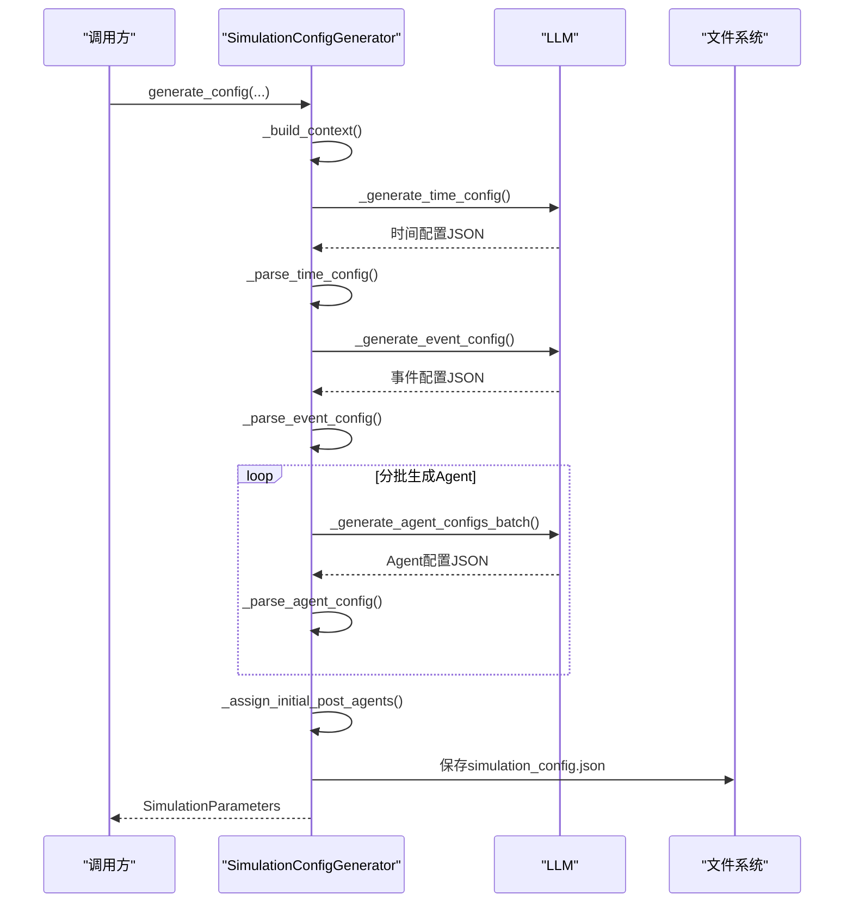

# 模拟配置生成

<cite>
**本文档引用的文件**
- [simulation_config_generator.py](file://backend/app/services/simulation_config_generator.py)
- [zep_entity_reader.py](file://backend/app/services/zep_entity_reader.py)
- [oasis_profile_generator.py](file://backend/app/services/oasis_profile_generator.py)
- [simulation_manager.py](file://backend/app/services/simulation_manager.py)
- [simulation.py](file://backend/app/api/simulation.py)
- [config.py](file://backend/app/config.py)
- [logger.py](file://backend/app/utils/logger.py)
- [run_twitter_simulation.py](file://backend/scripts/run_twitter_simulation.py)
- [run_reddit_simulation.py](file://backend/scripts/run_reddit_simulation.py)
</cite>

## 目录
1. [简介](#简介)
2. [项目结构](#项目结构)
3. [核心组件](#核心组件)
4. [架构概览](#架构概览)
5. [详细组件分析](#详细组件分析)
6. [依赖关系分析](#依赖关系分析)
7. [性能考虑](#性能考虑)
8. [故障排查指南](#故障排查指南)
9. [结论](#结论)
10. [附录](#附录)

## 简介
本文件面向MiroFish项目的“模拟配置生成”子系统，围绕SimulationConfigGenerator类展开，系统性阐述其如何基于Agent Profile与项目需求，自动生成OASIS模拟配置。重点覆盖：
- 事件配置生成算法与动态模板机制
- 环境参数设置与时间模拟配置
- 模拟参数优化策略与验证机制
- 配置数据结构设计、优先级与冲突解决
- 配置示例、参数说明与最佳实践
- 性能优化、错误处理与调试技巧
- 自定义配置模板的扩展方案

## 项目结构
该子系统位于后端服务层，与API层、配置层、日志层协同工作，形成“读取实体 → 生成Profile → 智能生成配置 → 保存并驱动OASIS运行”的闭环。

图表来源
- [simulation.py](file://backend/app/api/simulation.py#L164-L237)
- [simulation_manager.py](file://backend/app/services/simulation_manager.py#L229-L457)
- [zep_entity_reader.py](file://backend/app/services/zep_entity_reader.py#L222-L338)
- [oasis_profile_generator.py](file://backend/app/services/oasis_profile_generator.py#L142-L274)
- [simulation_config_generator.py](file://backend/app/services/simulation_config_generator.py#L199-L378)
- [run_twitter_simulation.py](file://backend/scripts/run_twitter_simulation.py#L385-L705)
- [run_reddit_simulation.py](file://backend/scripts/run_reddit_simulation.py#L385-L692)
- [config.py](file://backend/app/config.py#L20-L76)
- [logger.py](file://backend/app/utils/logger.py#L30-L104)

章节来源
- [simulation.py](file://backend/app/api/simulation.py#L164-L237)
- [simulation_manager.py](file://backend/app/services/simulation_manager.py#L114-L192)

## 核心组件
- SimulationConfigGenerator：核心配置生成器，负责构建上下文、分步生成时间配置、事件配置、Agent配置与平台配置，并进行参数校验与回退。
- ZepEntityReader：从Zep图谱读取实体，按预定义类型过滤并补充边/节点上下文。
- OasisProfileGenerator：将实体转换为OASIS Agent Profile，支持LLM增强与并行生成。
- SimulationManager：协调实体读取、Profile生成与配置生成，管理模拟状态与文件输出。
- OASIS运行脚本：读取生成的配置，驱动Twitter/Reddit平台模拟。

章节来源
- [simulation_config_generator.py](file://backend/app/services/simulation_config_generator.py#L199-L378)
- [zep_entity_reader.py](file://backend/app/services/zep_entity_reader.py#L222-L338)
- [oasis_profile_generator.py](file://backend/app/services/oasis_profile_generator.py#L142-L274)
- [simulation_manager.py](file://backend/app/services/simulation_manager.py#L229-L457)
- [run_twitter_simulation.py](file://backend/scripts/run_twitter_simulation.py#L385-L705)
- [run_reddit_simulation.py](file://backend/scripts/run_reddit_simulation.py#L385-L692)

## 架构概览
配置生成采用“分步生成 + LLM智能决策 + 参数校验回退”的策略，确保在复杂场景下仍能稳定产出高质量配置。

图表来源
- [simulation.py](file://backend/app/api/simulation.py#L358-L431)
- [simulation_manager.py](file://backend/app/services/simulation_manager.py#L229-L457)
- [simulation_config_generator.py](file://backend/app/services/simulation_config_generator.py#L242-L378)
- [run_twitter_simulation.py](file://backend/scripts/run_twitter_simulation.py#L531-L705)
- [run_reddit_simulation.py](file://backend/scripts/run_reddit_simulation.py#L523-L692)

## 详细组件分析

### SimulationConfigGenerator：智能配置生成器
- 分步生成策略
  - 步骤1：时间配置（轻量，基于中国人作息）
  - 步骤2：事件配置（热点话题、初始帖子、叙事方向）
  - 步骤3-N：分批生成Agent配置（每批15个）
  - 步骤N+1：平台配置（Twitter/Reddit权重与阈值）
- 上下文构建与截断
  - 限制最大上下文长度，按阶段截断，避免LLM上下文溢出
  - 实体摘要按类型分组展示，控制每类实体数量与摘要长度
- LLM调用与容错
  - 带重试与温度递减策略
  - 输出被截断时自动修复JSON结构
  - JSON解析失败时尝试提取与修复
- 参数校验与回退
  - 时间配置中对“每小时激活Agent数”进行上限校验与修正
  - 事件配置中强制要求初始帖子的poster_type来自可用实体类型
  - Agent分配时提供类型别名映射与影响力最高兜底策略

章节来源
- [simulation_config_generator.py](file://backend/app/services/simulation_config_generator.py#L242-L378)
- [simulation_config_generator.py](file://backend/app/services/simulation_config_generator.py#L380-L432)
- [simulation_config_generator.py](file://backend/app/services/simulation_config_generator.py#L433-L533)
- [simulation_config_generator.py](file://backend/app/services/simulation_config_generator.py#L534-L642)
- [simulation_config_generator.py](file://backend/app/services/simulation_config_generator.py#L644-L723)
- [simulation_config_generator.py](file://backend/app/services/simulation_config_generator.py#L725-L815)

#### 事件配置生成算法（_generate_event_config）
- 输入：模拟需求、上下文、可用实体类型与示例
- 输出：热点话题、初始帖子列表（含poster_type）、叙事方向
- 关键约束
  - 初始帖子必须指定poster_type，且必须来自“可用实体类型”
  - 若LLM输出缺失，使用默认空配置并记录warning
- 分配策略（_assign_initial_post_agents）
  - 直接匹配：按poster_type精确匹配
  - 别名匹配：通过类型别名表进行模糊匹配
  - 兜底策略：若仍无匹配，选择影响力最高的Agent

图表来源
- [simulation_config_generator.py](file://backend/app/services/simulation_config_generator.py#L644-L723)
- [simulation_config_generator.py](file://backend/app/services/simulation_config_generator.py#L725-L815)

章节来源
- [simulation_config_generator.py](file://backend/app/services/simulation_config_generator.py#L644-L723)
- [simulation_config_generator.py](file://backend/app/services/simulation_config_generator.py#L725-L815)

#### Agent配置生成与分批策略
- 分批生成：每批15个Agent，避免一次性LLM输出过长
- 上下文截断：限制每批上下文长度，保证稳定性
- 生成完成后，为初始帖子分配合适的Agent发布者

章节来源
- [simulation_config_generator.py](file://backend/app/services/simulation_config_generator.py#L307-L327)

#### 平台配置生成
- Twitter/Reddit分别设置推荐算法权重、病毒传播阈值、回声室强度
- 默认权重与阈值来源于平台特性与经验配置

章节来源
- [simulation_config_generator.py](file://backend/app/services/simulation_config_generator.py#L335-L358)

#### 配置数据结构设计
- SimulationParameters：顶层容器，包含时间配置、Agent配置、事件配置、平台配置、LLM元数据与生成理由
- TimeSimulationConfig：时间维度配置（总时长、每轮分钟数、每小时最小/最大Agent数、高峰/低谷时段与倍率）
- AgentActivityConfig：单Agent活动配置（活跃度、发帖/评论频率、活跃时段、响应延迟、情感倾向、立场、影响力权重）
- EventConfig：事件配置（初始帖子、定时事件占位、热点话题、叙事方向）
- PlatformConfig：平台特定配置（权重、阈值、强度）

图表来源
- [simulation_config_generator.py](file://backend/app/services/simulation_config_generator.py#L146-L197)
- [simulation_config_generator.py](file://backend/app/services/simulation_config_generator.py#L82-L110)
- [simulation_config_generator.py](file://backend/app/services/simulation_config_generator.py#L50-L81)
- [simulation_config_generator.py](file://backend/app/services/simulation_config_generator.py#L112-L127)
- [simulation_config_generator.py](file://backend/app/services/simulation_config_generator.py#L128-L143)

章节来源
- [simulation_config_generator.py](file://backend/app/services/simulation_config_generator.py#L146-L197)

### 配置生成流程与参数优化
- 上下文截断策略：按阶段限制最大长度，避免LLM输出被截断
- 温度递减：重试时逐步降低temperature，提升稳定性
- JSON修复：自动闭合括号、修复字符串换行、去除控制字符
- 参数校验：Agents per hour上限不超过总Agent数，min < max
- 类型映射：poster_type别名表提升匹配成功率

章节来源
- [simulation_config_generator.py](file://backend/app/services/simulation_config_generator.py#L212-L222)
- [simulation_config_generator.py](file://backend/app/services/simulation_config_generator.py#L433-L533)
- [simulation_config_generator.py](file://backend/app/services/simulation_config_generator.py#L609-L642)
- [simulation_config_generator.py](file://backend/app/services/simulation_config_generator.py#L746-L756)

### 配置验证机制与冲突解决
- 时间配置校验：agents_per_hour_min/max与总Agent数比较，修正越界值
- 事件配置校验：强制poster_type来自可用类型，否则拒绝
- Agent分配冲突：类型别名映射 + 影响力最高兜底
- LLM输出异常：截断修复 + JSON修复 + 默认回退

章节来源
- [simulation_config_generator.py](file://backend/app/services/simulation_config_generator.py#L609-L642)
- [simulation_config_generator.py](file://backend/app/services/simulation_config_generator.py#L725-L815)
- [simulation_config_generator.py](file://backend/app/services/simulation_config_generator.py#L482-L533)

### 配置示例与参数说明
- 时间配置
  - total_simulation_hours：模拟总时长（建议24-168小时）
  - minutes_per_round：每轮代表分钟数（建议30-120，常用60）
  - agents_per_hour_min/max：每小时激活Agent数量范围（上限不超过总Agent数）
  - peak/off_peak/morning/work hours：各时段列表
  - 倍率：高峰/低谷/早间/工作时段活跃度倍率
- Agent配置
  - activity_level：整体活跃度（0.0-1.0）
  - posts_per_hour/comments_per_hour：发帖/评论频率
  - active_hours：活跃时段（0-23）
  - response_delay_min/max：热点事件响应延迟（分钟）
  - sentiment_bias：情感倾向（-1.0到1.0）
  - stance：立场（supportive/opposing/neutral/observer）
  - influence_weight：影响力权重
- 事件配置
  - initial_posts：初始帖子列表，每条含content与poster_type
  - hot_topics：热点话题关键词列表
  - narrative_direction：舆论发展方向描述
- 平台配置
  - recency/popularity/relevance权重：推荐算法权重
  - viral_threshold：病毒传播阈值
  - echo_chamber_strength：回声室强度

章节来源
- [simulation_config_generator.py](file://backend/app/services/simulation_config_generator.py#L82-L110)
- [simulation_config_generator.py](file://backend/app/services/simulation_config_generator.py#L50-L81)
- [simulation_config_generator.py](file://backend/app/services/simulation_config_generator.py#L112-L127)
- [simulation_config_generator.py](file://backend/app/services/simulation_config_generator.py#L128-L143)

### 最佳实践指南
- 明确模拟需求：在simulation_requirement中清晰描述事件性质、参与群体与目标
- 控制实体规模：合理设置实体数量，避免LLM上下文过长
- 事件设计：热点话题与初始帖子应与实体类型匹配，便于Agent分配
- 参数调优：根据事件热度与群体特征调整高峰时段、发帖频率与响应延迟
- 平台适配：Twitter侧重时效与转发，Reddit强调深度讨论与社区氛围

## 依赖关系分析
- API层通过SimulationManager协调各服务
- SimulationManager依赖ZepEntityReader与OasisProfileGenerator生成配置
- SimulationConfigGenerator依赖ZepEntityReader提供的实体上下文
- OASIS运行脚本读取SimulationParameters并驱动模拟

图表来源
- [simulation.py](file://backend/app/api/simulation.py#L358-L431)
- [simulation_manager.py](file://backend/app/services/simulation_manager.py#L229-L457)
- [simulation_config_generator.py](file://backend/app/services/simulation_config_generator.py#L199-L378)
- [config.py](file://backend/app/config.py#L20-L76)
- [logger.py](file://backend/app/utils/logger.py#L30-L104)

章节来源
- [simulation.py](file://backend/app/api/simulation.py#L358-L431)
- [simulation_manager.py](file://backend/app/services/simulation_manager.py#L229-L457)

## 性能考虑
- 上下文截断：按阶段限制长度，避免LLM输出被截断
- 分批生成：Agent配置分批（每批15个），降低单次LLM负载
- 重试与指数退避：失败时自动重试并逐步降低temperature
- JSON修复：减少因输出截断导致的失败重试
- 并行Profile生成：在Profile生成器中支持并行，缩短整体准备时间

章节来源
- [simulation_config_generator.py](file://backend/app/services/simulation_config_generator.py#L212-L222)
- [simulation_config_generator.py](file://backend/app/services/simulation_config_generator.py#L433-L533)
- [simulation_manager.py](file://backend/app/services/simulation_manager.py#L338-L346)
- [oasis_profile_generator.py](file://backend/app/services/oasis_profile_generator.py#L180-L210)

## 故障排查指南
- LLM API配置
  - 确认LLM_API_KEY、LLM_BASE_URL、LLM_MODEL_NAME已正确设置
  - 检查ZEP_API_KEY是否配置
- LLM输出异常
  - 观察日志中的“JSON解析失败/被截断”提示
  - 查看重试与修复过程是否成功
- 配置生成失败
  - 检查实体过滤结果是否为空
  - 确认事件配置中poster_type是否来自可用类型
- 运行时问题
  - OASIS运行脚本读取配置文件路径是否正确
  - 检查Profile文件格式（Twitter CSV、Reddit JSON）

章节来源
- [config.py](file://backend/app/config.py#L66-L75)
- [simulation_config_generator.py](file://backend/app/services/simulation_config_generator.py#L433-L533)
- [simulation_manager.py](file://backend/app/services/simulation_manager.py#L297-L301)
- [run_twitter_simulation.py](file://backend/scripts/run_twitter_simulation.py#L571-L582)
- [run_reddit_simulation.py](file://backend/scripts/run_reddit_simulation.py#L559-L569)

## 结论
SimulationConfigGenerator通过“分步生成 + LLM智能决策 + 参数校验回退”的策略，在复杂多样的图谱与需求场景下，实现了高可靠性的OASIS模拟配置生成。其事件配置算法、动态模板与参数优化机制，为Twitter/Reddit双平台模拟提供了坚实基础。配合完善的日志与容错机制，系统在生产环境中具备良好的稳定性与可维护性。

## 附录

### 配置生成流程（代码级）

图表来源
- [simulation_config_generator.py](file://backend/app/services/simulation_config_generator.py#L242-L378)