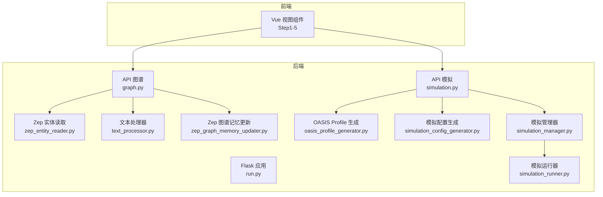
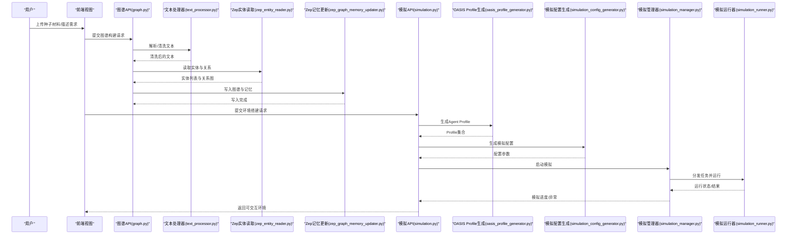
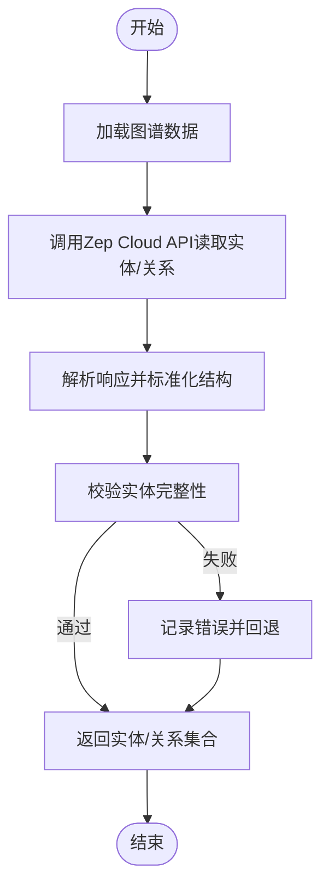
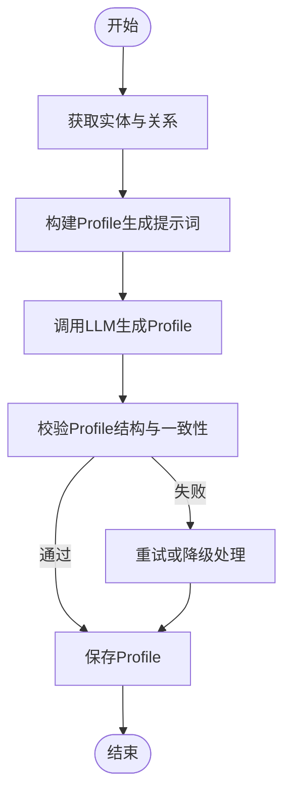
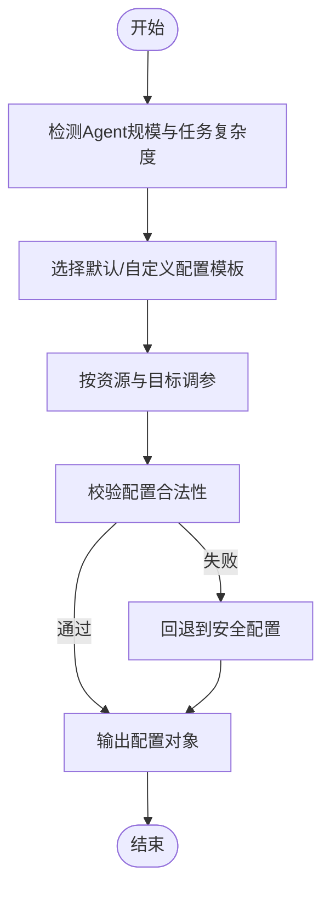
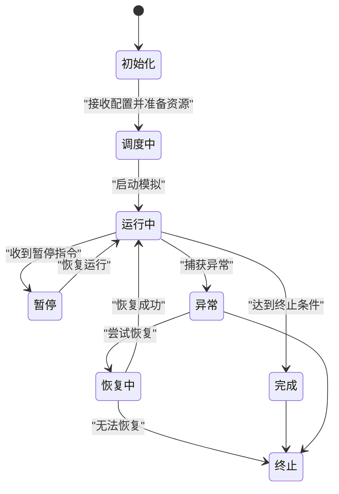
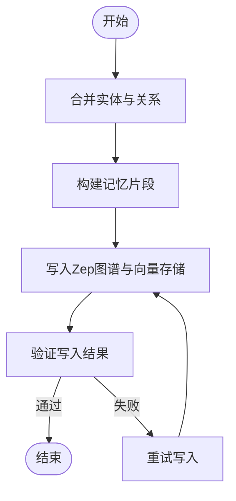
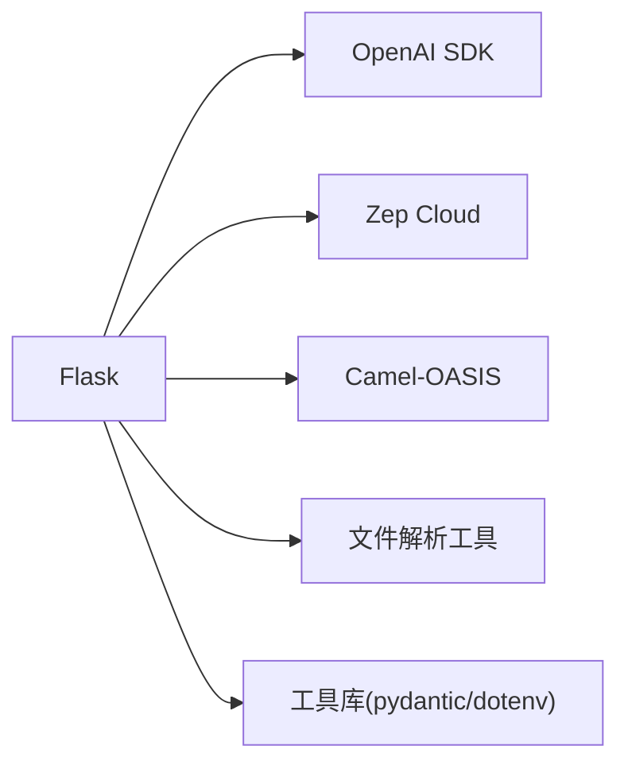

# 环境搭建系统

<cite>
**本文引用的文件**
- [README.md](file://README.md)
- [run.py](file://backend/run.py)
- [pyproject.toml](file://backend/pyproject.toml)
- [requirements.txt](file://backend/requirements.txt)
- [graph.py](file://backend/app/api/graph.py)
- [simulation.py](file://backend/app/api/simulation.py)
- [zep_entity_reader.py](file://backend/app/services/zep_entity_reader.py)
- [oasis_profile_generator.py](file://backend/app/services/oasis_profile_generator.py)
- [simulation_config_generator.py](file://backend/app/services/simulation_config_generator.py)
- [simulation_manager.py](file://backend/app/services/simulation_manager.py)
- [simulation_runner.py](file://backend/app/services/simulation_runner.py)
- [text_processor.py](file://backend/app/services/text_processor.py)
- [zep_graph_memory_updater.py](file://backend/app/services/zep_graph_memory_updater.py)
- [.env.example](file://.env.example)
- [docker-compose.yml](file://docker-compose.yml)
- [Dockerfile](file://Dockerfile)
</cite>

## 目录
1. [简介](#简介)
2. [项目结构](#项目结构)
3. [核心组件](#核心组件)
4. [架构总览](#架构总览)
5. [详细组件分析](#详细组件分析)
6. [依赖分析](#依赖分析)
7. [性能考虑](#性能考虑)
8. [故障排除指南](#故障排除指南)
9. [结论](#结论)
10. [附录](#附录)

## 简介
本文件面向MiroFish环境搭建系统，围绕“从图谱数据到可运行模拟环境”的完整转换流程，系统性梳理实体关系抽取、Agent Profile生成、模拟配置参数设置等关键环节。重点阐释：
- Zep实体读取机制与图谱记忆更新
- OASIS Agent Profile生成算法与参数优化
- 模拟配置生成与运行管理
- 数据流转、状态管理与错误恢复
- 配置参数说明、性能调优与故障排除
- 工作流程、最佳实践与扩展方案

## 项目结构
后端采用Flask应用，API层负责对外接口，Services层承载业务逻辑（含图谱构建、实体读取、Profile生成、模拟配置、运行管理等），Utils提供通用工具与日志、重试等辅助能力；前端通过Vue组件驱动用户操作，串联四步流程：图谱构建、环境搭建、模拟运行、报告生成。

图表来源
- [run.py](file://backend/run.py#L25-L46)
- [graph.py](file://backend/app/api/graph.py)
- [simulation.py](file://backend/app/api/simulation.py)
- [zep_entity_reader.py](file://backend/app/services/zep_entity_reader.py)
- [oasis_profile_generator.py](file://backend/app/services/oasis_profile_generator.py)
- [simulation_config_generator.py](file://backend/app/services/simulation_config_generator.py)
- [simulation_manager.py](file://backend/app/services/simulation_manager.py)
- [simulation_runner.py](file://backend/app/services/simulation_runner.py)
- [text_processor.py](file://backend/app/services/text_processor.py)
- [zep_graph_memory_updater.py](file://backend/app/services/zep_graph_memory_updater.py)

章节来源
- [README.md](file://README.md#L81-L88)
- [run.py](file://backend/run.py#L18-L46)

## 核心组件
- 图谱构建与实体读取：接收种子材料，抽取实体关系，写入Zep图谱内存，供后续Agent Profile生成与模拟注入使用。
- Agent Profile生成：基于图谱实体与关系，结合LLM生成具备长期记忆与行为逻辑的Agent Profile。
- 模拟配置生成：根据任务需求与Agent数量规模，生成OASIS模拟所需的配置参数。
- 模拟运行管理：协调模拟生命周期，监控状态，处理异常并进行恢复。
- 文本处理与文件解析：支持多种格式输入，保障实体抽取质量。
- Zep图谱记忆更新：将图谱与历史记忆同步，增强Agent上下文能力。

章节来源
- [graph.py](file://backend/app/api/graph.py)
- [simulation.py](file://backend/app/api/simulation.py)
- [zep_entity_reader.py](file://backend/app/services/zep_entity_reader.py)
- [oasis_profile_generator.py](file://backend/app/services/oasis_profile_generator.py)
- [simulation_config_generator.py](file://backend/app/services/simulation_config_generator.py)
- [simulation_manager.py](file://backend/app/services/simulation_manager.py)
- [simulation_runner.py](file://backend/app/services/simulation_runner.py)
- [text_processor.py](file://backend/app/services/text_processor.py)
- [zep_graph_memory_updater.py](file://backend/app/services/zep_graph_memory_updater.py)

## 架构总览
下图展示从用户上传种子材料到生成可交互模拟环境的关键链路，涵盖数据输入、实体抽取、Profile生成、配置下发与模拟运行。

图表来源
- [graph.py](file://backend/app/api/graph.py)
- [simulation.py](file://backend/app/api/simulation.py)
- [text_processor.py](file://backend/app/services/text_processor.py)
- [zep_entity_reader.py](file://backend/app/services/zep_entity_reader.py)
- [zep_graph_memory_updater.py](file://backend/app/services/zep_graph_memory_updater.py)
- [oasis_profile_generator.py](file://backend/app/services/oasis_profile_generator.py)
- [simulation_config_generator.py](file://backend/app/services/simulation_config_generator.py)
- [simulation_manager.py](file://backend/app/services/simulation_manager.py)
- [simulation_runner.py](file://backend/app/services/simulation_runner.py)

## 详细组件分析

### Zep实体读取机制
职责与流程
- 输入：经文本处理器清洗后的图谱数据
- 处理：调用Zep Cloud API读取实体、关系与向量存储
- 输出：标准化的实体与关系结构，供Profile生成与记忆更新使用

图表来源
- [zep_entity_reader.py](file://backend/app/services/zep_entity_reader.py)
- [text_processor.py](file://backend/app/services/text_processor.py)

章节来源
- [zep_entity_reader.py](file://backend/app/services/zep_entity_reader.py)
- [text_processor.py](file://backend/app/services/text_processor.py)

### OASIS Agent Profile生成算法
职责与流程
- 输入：实体列表、关系图、任务需求
- 处理：基于LLM生成具备长期记忆、角色设定与行为倾向的Profile
- 输出：Agent Profile集合，供模拟配置与注入使用

图表来源
- [oasis_profile_generator.py](file://backend/app/services/oasis_profile_generator.py)
- [simulation.py](file://backend/app/api/simulation.py)

章节来源
- [oasis_profile_generator.py](file://backend/app/services/oasis_profile_generator.py)
- [simulation.py](file://backend/app/api/simulation.py)

### 模拟配置参数设置
职责与流程
- 输入：Agent数量、任务规模、硬件资源
- 处理：生成OASIS模拟所需配置（并发度、时间步长、内存阈值等）
- 输出：配置对象，用于启动模拟运行器

图表来源
- [simulation_config_generator.py](file://backend/app/services/simulation_config_generator.py)
- [simulation_manager.py](file://backend/app/services/simulation_manager.py)

章节来源
- [simulation_config_generator.py](file://backend/app/services/simulation_config_generator.py)
- [simulation_manager.py](file://backend/app/services/simulation_manager.py)

### 模拟运行管理与状态恢复
职责与流程
- 生命周期：初始化、调度、运行、监控、异常恢复、终止
- 状态：运行中/暂停/失败/完成
- 恢复：断点续跑、资源回收、日志追踪

图表来源
- [simulation_manager.py](file://backend/app/services/simulation_manager.py)
- [simulation_runner.py](file://backend/app/services/simulation_runner.py)

章节来源
- [simulation_manager.py](file://backend/app/services/simulation_manager.py)
- [simulation_runner.py](file://backend/app/services/simulation_runner.py)

### 图谱记忆更新与Zep集成
职责与流程
- 输入：图谱实体、关系、历史记忆
- 处理：写入Zep向量存储与图数据库，建立检索与推理基础
- 输出：可被Agent查询的记忆索引

图表来源
- [zep_graph_memory_updater.py](file://backend/app/services/zep_graph_memory_updater.py)
- [graph.py](file://backend/app/api/graph.py)

章节来源
- [zep_graph_memory_updater.py](file://backend/app/services/zep_graph_memory_updater.py)
- [graph.py](file://backend/app/api/graph.py)

## 依赖分析
后端依赖以Flask为核心，集成OpenAI SDK、Zep Cloud、OASIS框架与文件解析工具，形成完整的“图谱-记忆-Agent-模拟”闭环。

图表来源
- [pyproject.toml](file://backend/pyproject.toml#L11-L35)
- [requirements.txt](file://backend/requirements.txt#L8-L36)

章节来源
- [pyproject.toml](file://backend/pyproject.toml#L1-L56)
- [requirements.txt](file://backend/requirements.txt#L1-L36)

## 性能考虑
- 并行与并发
  - 模拟运行器支持多Agent并行，建议根据CPU/GPU资源合理设置并发度，避免过载。
  - 文本处理与Zep写入可异步化，减少阻塞。
- 记忆与检索
  - Zep向量维度与索引策略直接影响检索速度，建议在实体规模增长时调整索引类型与批处理大小。
- LLM调用
  - 控制提示词长度与上下文窗口，避免超限；对高频调用增加缓存与重试。
- 存储与I/O
  - 图谱与记忆写入采用批量提交，降低网络往返；定期清理无用记忆，保持索引健康。
- 资源监控
  - 建议在容器环境中开启资源限制与健康检查，配合日志与指标采集定位瓶颈。

## 故障排除指南
常见问题与处理
- 配置校验失败
  - 现象：启动时报配置错误
  - 处理：检查环境变量是否正确写入，确认必填项齐全
- LLM调用异常
  - 现象：Profile生成失败或响应为空
  - 处理：检查API密钥与网关连通性，确认模型名称与版本匹配
- Zep写入失败
  - 现象：图谱构建中断或记忆缺失
  - 处理：重试写入、检查配额与网络、确认实体结构合法
- 模拟运行卡顿或崩溃
  - 现象：并发过高导致内存溢出或线程阻塞
  - 处理：降低并发度、增加资源、启用断点续跑与日志追踪
- 前后端联调问题
  - 现象：跨域或端口占用
  - 处理：确认CORS配置与端口映射，使用本地代理或容器编排

章节来源
- [run.py](file://backend/run.py#L25-L46)
- [.env.example](file://.env.example)
- [docker-compose.yml](file://docker-compose.yml)

## 结论
MiroFish环境搭建系统以“图谱-记忆-Agent-模拟”为主线，通过Zep与OASIS的深度集成，实现了从种子材料到可交互模拟环境的自动化流水线。系统在模块化设计、状态管理与错误恢复方面具备良好可维护性，适合在不同场景下进行扩展与定制。

## 附录

### 环境搭建工作流程（摘要）
- 步骤1：图谱构建（种子材料 → 实体/关系 → Zep记忆）
- 步骤2：环境搭建（Profile生成 → 配置生成 → 注入Agent）
- 步骤3：模拟运行（调度/监控/恢复）
- 步骤4：报告生成（交互式探索与结果汇总）

章节来源
- [README.md](file://README.md#L81-L88)

### 关键配置参数说明
- LLM相关
  - LLM_API_KEY：大模型访问密钥
  - LLM_BASE_URL：模型网关地址
  - LLM_MODEL_NAME：模型名称
- Zep Cloud
  - ZEP_API_KEY：Zep访问密钥
- 运行参数
  - FLASK_HOST/FLASK_PORT：后端服务监听地址与端口
  - DEBUG：调试模式开关

章节来源
- [.env.example](file://.env.example)
- [run.py](file://backend/run.py#L40-L42)

### 部署与运行
- 源码部署：安装依赖后，同时启动前后端或分别启动
- Docker部署：复制示例配置，使用Compose一键拉起

章节来源
- [README.md](file://README.md#L101-L173)
- [docker-compose.yml](file://docker-compose.yml)
- [Dockerfile](file://Dockerfile)