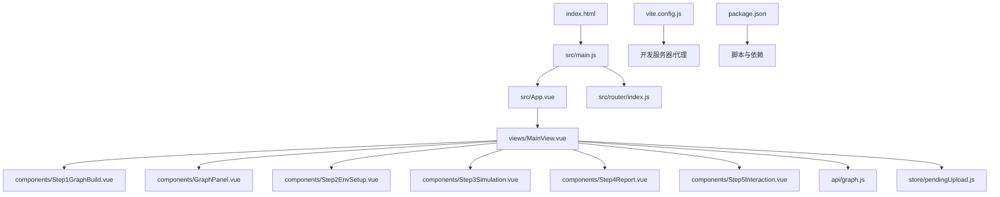
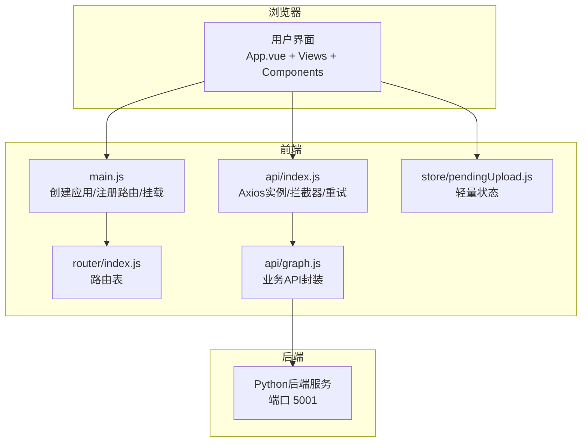
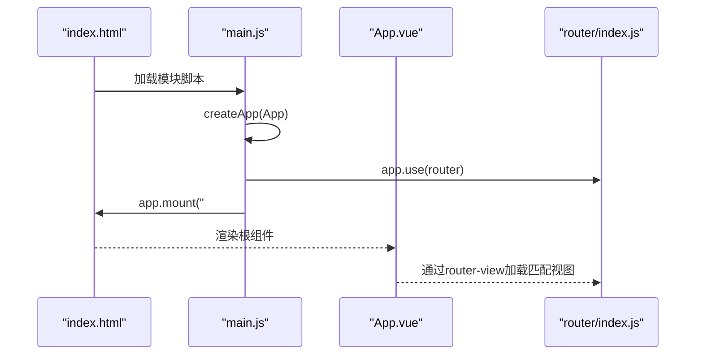
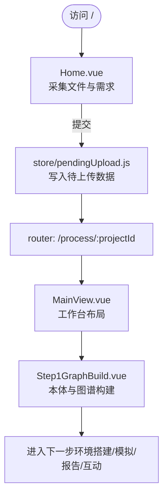
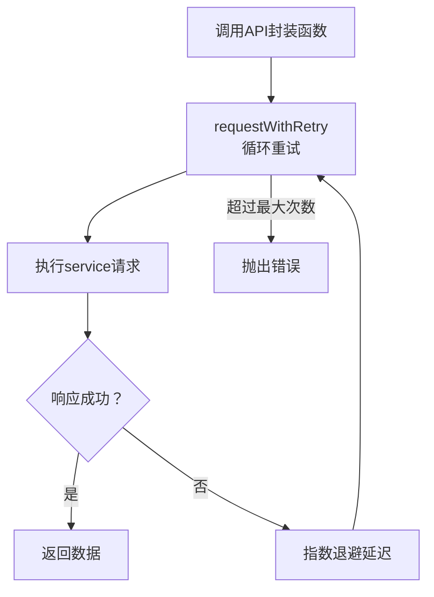
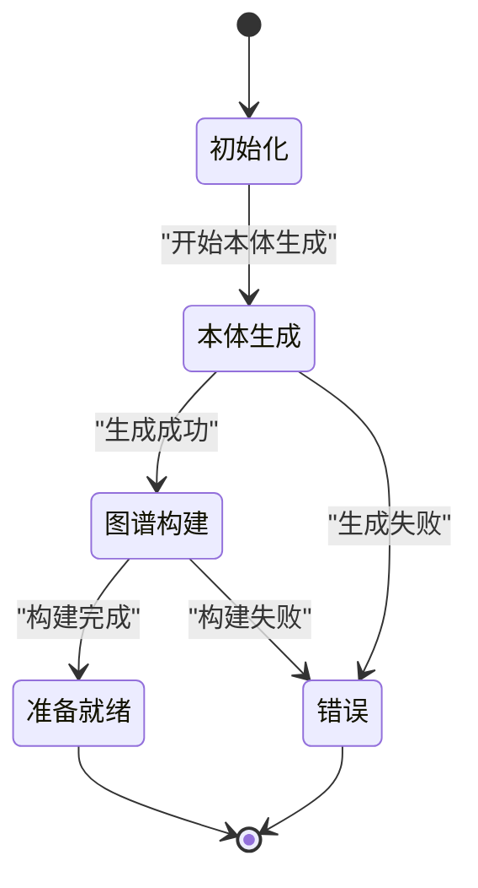
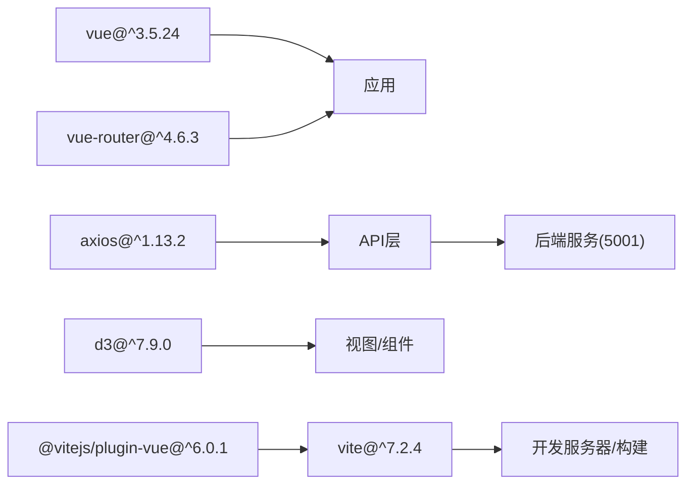

# Vue应用结构

<cite>
**本文档引用的文件**
- [frontend/src/main.js](file://frontend/src/main.js)
- [frontend/src/App.vue](file://frontend/src/App.vue)
- [frontend/index.html](file://frontend/index.html)
- [frontend/vite.config.js](file://frontend/vite.config.js)
- [frontend/package.json](file://frontend/package.json)
- [frontend/src/router/index.js](file://frontend/src/router/index.js)
- [frontend/src/views/MainView.vue](file://frontend/src/views/MainView.vue)
- [frontend/src/components/Step1GraphBuild.vue](file://frontend/src/components/Step1GraphBuild.vue)
- [frontend/src/views/Home.vue](file://frontend/src/views/Home.vue)
- [frontend/src/store/pendingUpload.js](file://frontend/src/store/pendingUpload.js)
- [frontend/src/api/graph.js](file://frontend/src/api/graph.js)
- [frontend/src/api/index.js](file://frontend/src/api/index.js)
- [Dockerfile](file://Dockerfile)
- [docker-compose.yml](file://docker-compose.yml)
</cite>

## 目录
1. [简介](#简介)
2. [项目结构](#项目结构)
3. [核心组件](#核心组件)
4. [架构总览](#架构总览)
5. [详细组件分析](#详细组件分析)
6. [依赖分析](#依赖分析)
7. [性能考虑](#性能考虑)
8. [故障排查指南](#故障排查指南)
9. [结论](#结论)
10. [附录](#附录)

## 简介
本文件面向MiroFish前端Vue.js应用，系统性梳理应用入口初始化流程、根组件设计、路由与视图组织、API层封装、Vite构建与开发体验、以及容器化部署要点。文档同时提供性能优化、代码分割与缓存策略建议，帮助开发者快速理解并高效迭代该应用。

## 项目结构
前端采用标准Vue 3 + Vite工程布局，核心目录与职责如下：
- src：源代码
  - api：统一HTTP客户端与业务API封装
  - assets：静态资源（图片）
  - components：可复用UI组件
  - router：Vue Router路由配置
  - store：轻量状态管理（示例：待上传文件）
  - views：页面级视图组件
  - App.vue：根组件
  - main.js：应用入口
- public：公共资源（图标）
- index.html：HTML模板
- vite.config.js：Vite配置
- package.json：依赖与脚本

图表来源
- [frontend/index.html](file://frontend/index.html#L1-L18)
- [frontend/src/main.js](file://frontend/src/main.js#L1-L10)
- [frontend/src/App.vue](file://frontend/src/App.vue#L1-L48)
- [frontend/src/router/index.js](file://frontend/src/router/index.js#L1-L53)
- [frontend/src/views/MainView.vue](file://frontend/src/views/MainView.vue#L1-L541)
- [frontend/src/components/Step1GraphBuild.vue](file://frontend/src/components/Step1GraphBuild.vue#L1-L699)
- [frontend/src/api/graph.js](file://frontend/src/api/graph.js#L1-L71)
- [frontend/src/store/pendingUpload.js](file://frontend/src/store/pendingUpload.js#L1-L34)
- [frontend/vite.config.js](file://frontend/vite.config.js#L1-L19)
- [frontend/package.json](file://frontend/package.json#L1-L22)

章节来源
- [frontend/index.html](file://frontend/index.html#L1-L18)
- [frontend/src/main.js](file://frontend/src/main.js#L1-L10)
- [frontend/src/router/index.js](file://frontend/src/router/index.js#L1-L53)

## 核心组件
- 应用入口 main.js：创建Vue应用实例、注册路由、挂载DOM
- 根组件 App.vue：承载全局样式与router-view
- 路由 router/index.js：定义首页与主流程视图的路径映射
- 主视图 MainView.vue：工作台布局与步骤驱动的业务流程
- 步骤组件 Step1GraphBuild.vue：图谱构建阶段的可视化与交互
- API层：统一Axios实例、请求拦截、响应拦截与重试
- 状态管理：pendingUpload.js（轻量全局状态）

章节来源
- [frontend/src/main.js](file://frontend/src/main.js#L1-L10)
- [frontend/src/App.vue](file://frontend/src/App.vue#L1-L48)
- [frontend/src/router/index.js](file://frontend/src/router/index.js#L1-L53)
- [frontend/src/views/MainView.vue](file://frontend/src/views/MainView.vue#L1-L541)
- [frontend/src/components/Step1GraphBuild.vue](file://frontend/src/components/Step1GraphBuild.vue#L1-L699)
- [frontend/src/api/index.js](file://frontend/src/api/index.js#L1-L68)
- [frontend/src/api/graph.js](file://frontend/src/api/graph.js#L1-L71)
- [frontend/src/store/pendingUpload.js](file://frontend/src/store/pendingUpload.js#L1-L34)

## 架构总览
应用采用“入口 -> 根组件 -> 路由 -> 视图 -> 组件 -> API”的清晰分层。前端通过Vite提供开发服务器与代理，连接后端服务；API层统一处理错误与重试；状态管理用于跨组件共享临时数据。

图表来源
- [frontend/src/main.js](file://frontend/src/main.js#L1-L10)
- [frontend/src/router/index.js](file://frontend/src/router/index.js#L1-L53)
- [frontend/src/api/index.js](file://frontend/src/api/index.js#L1-L68)
- [frontend/src/api/graph.js](file://frontend/src/api/graph.js#L1-L71)
- [frontend/src/store/pendingUpload.js](file://frontend/src/store/pendingUpload.js#L1-L34)
- [frontend/vite.config.js](file://frontend/vite.config.js#L7-L17)

## 详细组件分析

### 应用入口与初始化流程
- 初始化步骤
  - 导入Vue与根组件、路由模块
  - 通过应用工厂函数创建实例
  - 注册路由插件
  - 将应用挂载到DOM元素
- 关键点
  - 入口文件极简，职责单一，便于扩展其他插件
  - 挂载目标与HTML模板一致

图表来源
- [frontend/index.html](file://frontend/index.html#L14-L15)
- [frontend/src/main.js](file://frontend/src/main.js#L1-L10)
- [frontend/src/App.vue](file://frontend/src/App.vue#L1-L48)
- [frontend/src/router/index.js](file://frontend/src/router/index.js#L1-L53)

章节来源
- [frontend/src/main.js](file://frontend/src/main.js#L1-L10)
- [frontend/index.html](file://frontend/index.html#L14-L15)

### 根组件与全局样式
- 设计要点
  - 仅包含一个router-view，承载所有页面
  - 提供全局样式重置与滚动条美化
  - 字体与主题色集中定义，便于统一风格
- 生命周期
  - 作为根组件，不直接使用生命周期钩子；业务逻辑集中在各页面组件

章节来源
- [frontend/src/App.vue](file://frontend/src/App.vue#L1-L48)

### 路由与视图组织
- 路由表
  - 首页、主流程视图、模拟视图、报告视图、交互视图
  - 支持动态参数（项目ID、模拟ID、报告ID）
- 视图职责
  - Home.vue：引导页与数据采集
  - MainView.vue：工作台布局与步骤驱动
  - Step1GraphBuild.vue：本体生成与图谱构建可视化
  - 其他StepX组件：后续步骤的视图占位

图表来源
- [frontend/src/router/index.js](file://frontend/src/router/index.js#L9-L45)
- [frontend/src/views/Home.vue](file://frontend/src/views/Home.vue#L291-L305)
- [frontend/src/store/pendingUpload.js](file://frontend/src/store/pendingUpload.js#L13-L25)
- [frontend/src/views/MainView.vue](file://frontend/src/views/MainView.vue#L1-L541)
- [frontend/src/components/Step1GraphBuild.vue](file://frontend/src/components/Step1GraphBuild.vue#L1-L699)

章节来源
- [frontend/src/router/index.js](file://frontend/src/router/index.js#L1-L53)
- [frontend/src/views/Home.vue](file://frontend/src/views/Home.vue#L291-L305)
- [frontend/src/store/pendingUpload.js](file://frontend/src/store/pendingUpload.js#L1-L34)

### API层与重试机制
- Axios实例
  - 基础URL可由环境变量覆盖
  - 统一超时时间（适合长耗时任务）
- 拦截器
  - 请求：透传
  - 响应：校验success字段，错误统一抛出
- 重试策略
  - 指数退避重试，提升稳定性

图表来源
- [frontend/src/api/index.js](file://frontend/src/api/index.js#L54-L65)
- [frontend/src/api/graph.js](file://frontend/src/api/graph.js#L8-L19)

章节来源
- [frontend/src/api/index.js](file://frontend/src/api/index.js#L1-L68)
- [frontend/src/api/graph.js](file://frontend/src/api/graph.js#L1-L71)

### 主视图与步骤驱动
- 布局模式
  - 支持“图谱/双栏/工作台”三种视图模式，动态切换
  - 左右面板宽度与透明度随模式变化
- 步骤状态
  - 当前步骤与名称数组
  - 状态指示器根据阶段显示不同颜色与文案
- 数据与轮询
  - 项目与图谱数据加载
  - 任务状态轮询与最终刷新
  - 系统日志维护与滚动

图表来源
- [frontend/src/views/MainView.vue](file://frontend/src/views/MainView.vue#L93-L138)
- [frontend/src/views/MainView.vue](file://frontend/src/views/MainView.vue#L271-L355)

章节来源
- [frontend/src/views/MainView.vue](file://frontend/src/views/MainView.vue#L1-L541)

### 步骤组件：图谱构建
- 功能概览
  - 展示本体生成与图谱构建进度
  - 显示统计卡片（节点、边、类型）
  - 提供进入下一步（环境搭建）的入口
- 交互细节
  - 详情弹层展示实体/关系属性
  - 日志自动滚动
  - 创建模拟时的禁用与加载态

章节来源
- [frontend/src/components/Step1GraphBuild.vue](file://frontend/src/components/Step1GraphBuild.vue#L1-L699)

### 开发与生产构建
- Vite配置
  - 插件：Vue官方插件
  - 开发服务器：端口、自动打开、API代理
- 脚本命令
  - dev：本地开发（主机可达）
  - build：生产构建
  - preview：本地预览产物
- 依赖
  - 运行时：Vue、Vue Router、Axios、D3
  - 开发时：Vite、@vitejs/plugin-vue

章节来源
- [frontend/vite.config.js](file://frontend/vite.config.js#L1-L19)
- [frontend/package.json](file://frontend/package.json#L6-L21)

### 容器化与部署
- Dockerfile
  - 基于Python镜像，安装Node.js与npm
  - 使用uv同步后端依赖
  - 先复制依赖文件以利用缓存
  - 暴露前端与后端端口，开发模式下同时启动前后端
- docker-compose.yml
  - 映射前端3000、后端5001端口
  - 挂载后端上传目录

章节来源
- [Dockerfile](file://Dockerfile#L1-L29)
- [docker-compose.yml](file://docker-compose.yml#L1-L14)

## 依赖分析
- 直接依赖
  - Vue 3：框架核心
  - Vue Router 4：路由管理
  - Axios：HTTP客户端
  - D3：图谱可视化（在组件中使用）
- 开发依赖
  - Vite：构建与开发服务器
  - @vitejs/plugin-vue：Vue单文件组件支持
- 间接依赖
  - 通过API层与后端服务耦合，代理规则在Vite中配置

图表来源
- [frontend/package.json](file://frontend/package.json#L11-L20)
- [frontend/src/api/index.js](file://frontend/src/api/index.js#L4-L10)
- [frontend/vite.config.js](file://frontend/vite.config.js#L6-L17)

章节来源
- [frontend/package.json](file://frontend/package.json#L1-L22)

## 性能考虑
- 代码分割与懒加载
  - 在路由层面结合异步组件与按需导入，减少首屏体积
  - 对大型可视化组件（如图谱）采用动态导入
- 缓存策略
  - 浏览器缓存：静态资源版本号或内容哈希
  - API缓存：对只读数据设置合理的ETag/Last-Modified
- 轮询与定时器
  - 合理设置轮询间隔，避免频繁请求
  - 在组件卸载时清理定时器，防止内存泄漏
- 图形渲染
  - D3渲染大数据时启用虚拟化或采样
  - 控制动画帧率，避免卡顿
- 构建优化
  - 生产构建开启压缩与Tree Shaking
  - 合理拆分vendor包，提升缓存命中

## 故障排查指南
- 网络与代理
  - 确认Vite代理已正确转发/api到后端地址
  - 检查后端服务是否在5001端口运行
- 请求失败
  - 查看API响应拦截器输出的错误信息
  - 检查重试次数与延迟是否合理
- 轮询问题
  - 确认任务ID与轮询逻辑正确
  - 在组件卸载时清理定时器
- 容器化
  - 端口映射是否正确
  - 上传目录挂载是否生效

章节来源
- [frontend/vite.config.js](file://frontend/vite.config.js#L10-L16)
- [frontend/src/api/index.js](file://frontend/src/api/index.js#L36-L51)
- [frontend/src/views/MainView.vue](file://frontend/src/views/MainView.vue#L382-L395)

## 结论
MiroFish前端采用清晰的分层架构与现代化工具链，入口简单、路由明确、API统一、组件职责清晰。通过合理的轮询与状态管理，配合Vite的开发体验与Docker部署方案，能够高效支撑复杂的工作流场景。建议在现有基础上进一步引入路由级懒加载与可视化组件的动态导入，持续优化首屏性能与交互流畅度。

## 附录
- 环境变量
  - VITE_API_BASE_URL：后端基础URL（默认本地5001）
- 常用命令
  - npm run dev：本地开发
  - npm run build：生产构建
  - npm run preview：本地预览构建产物
- 代理规则
  - /api 前缀代理到 http://localhost:5001

章节来源
- [frontend/src/api/index.js](file://frontend/src/api/index.js#L5-L10)
- [frontend/vite.config.js](file://frontend/vite.config.js#L10-L16)
- [frontend/package.json](file://frontend/package.json#L6-L9)