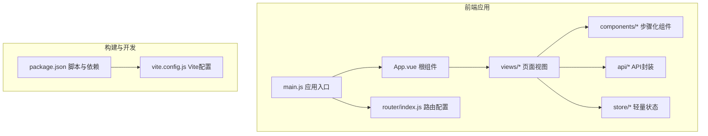
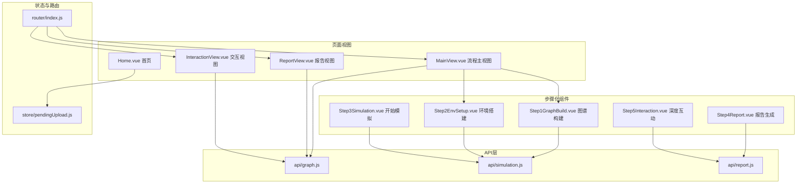
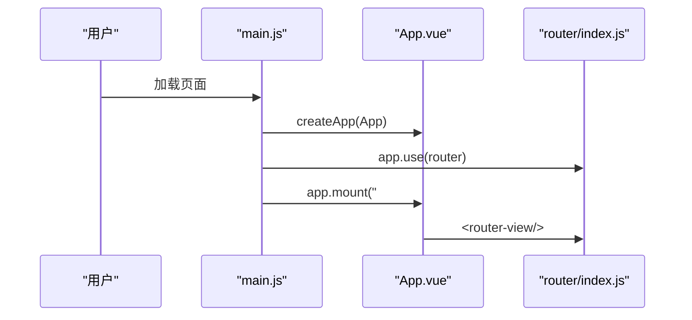
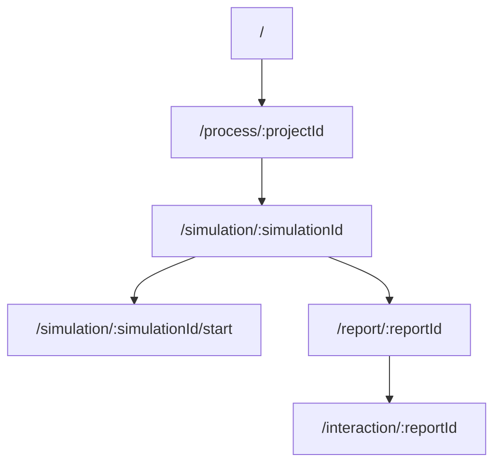
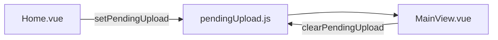
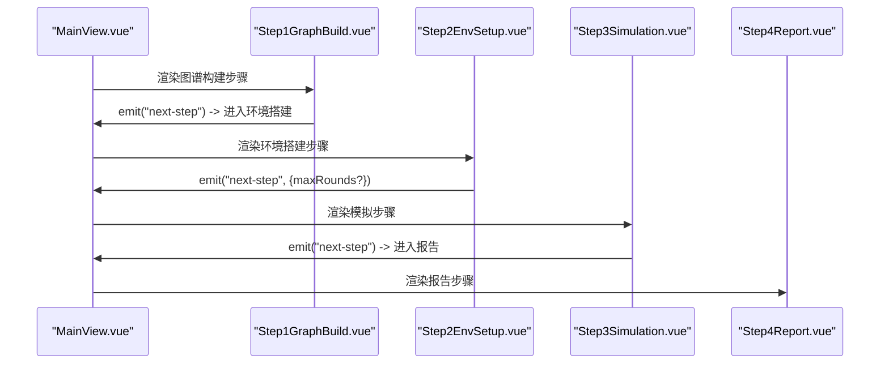
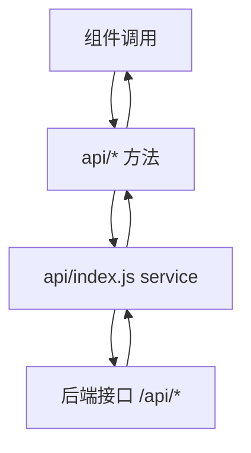
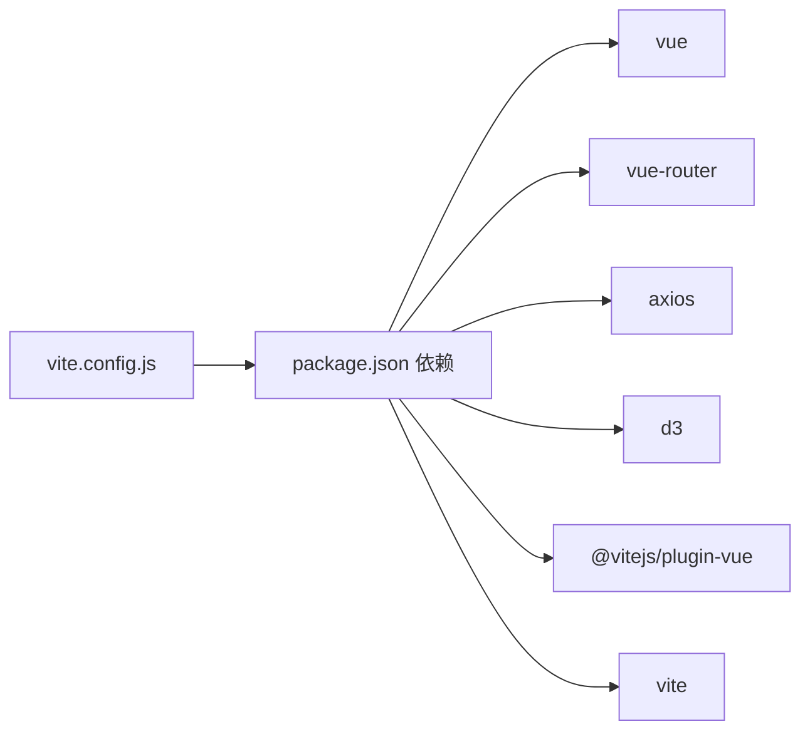

# 前端架构

<cite>
**本文档引用的文件**
- [main.js](file://frontend/src/main.js)
- [App.vue](file://frontend/src/App.vue)
- [router/index.js](file://frontend/src/router/index.js)
- [store/pendingUpload.js](file://frontend/src/store/pendingUpload.js)
- [package.json](file://frontend/package.json)
- [vite.config.js](file://frontend/vite.config.js)
- [Home.vue](file://frontend/src/views/Home.vue)
- [MainView.vue](file://frontend/src/views/MainView.vue)
- [ReportView.vue](file://frontend/src/views/ReportView.vue)
- [InteractionView.vue](file://frontend/src/views/InteractionView.vue)
- [Step1GraphBuild.vue](file://frontend/src/components/Step1GraphBuild.vue)
- [Step2EnvSetup.vue](file://frontend/src/components/Step2EnvSetup.vue)
- [Step3Simulation.vue](file://frontend/src/components/Step3Simulation.vue)
- [Step4Report.vue](file://frontend/src/components/Step4Report.vue)
- [api/index.js](file://frontend/src/api/index.js)
- [api/graph.js](file://frontend/src/api/graph.js)
- [api/simulation.js](file://frontend/src/api/simulation.js)
- [api/report.js](file://frontend/src/api/report.js)
</cite>

## 目录
1. [引言](#引言)
2. [项目结构](#项目结构)
3. [核心组件](#核心组件)
4. [架构总览](#架构总览)
5. [详细组件分析](#详细组件分析)
6. [依赖分析](#依赖分析)
7. [性能考虑](#性能考虑)
8. [故障排查指南](#故障排查指南)
9. [结论](#结论)
10. [附录](#附录)

## 引言
本文件面向MiroFish前端架构，围绕Vue.js 3.x单页应用展开，系统性阐述应用入口初始化、路由体系、状态管理、组件层次与工作流交互、API封装、构建与部署配置，以及样式与响应式最佳实践。目标是帮助开发者快速理解整体设计与实现方式，并为后续扩展与维护提供清晰指引。

## 项目结构
前端采用典型的Vue 3 + Vite工程结构，核心目录与职责如下：
- src：源代码根目录
  - api：统一的HTTP客户端与业务API封装
  - assets：静态资源（图片）
  - components：可复用的步骤化工作流组件
  - router：Vue Router路由配置
  - store：轻量状态管理（示例：待上传数据）
  - views：页面级视图组件
  - App.vue、main.js：应用入口与根组件
- 构建与开发：package.json脚本、vite.config.js配置

图表来源
- [main.js](file://frontend/src/main.js#L1-L10)
- [App.vue](file://frontend/src/App.vue#L1-L48)
- [router/index.js](file://frontend/src/router/index.js#L1-L53)
- [package.json](file://frontend/package.json#L1-L22)
- [vite.config.js](file://frontend/vite.config.js#L1-L19)

章节来源
- [main.js](file://frontend/src/main.js#L1-L10)
- [App.vue](file://frontend/src/App.vue#L1-L48)
- [router/index.js](file://frontend/src/router/index.js#L1-L53)
- [package.json](file://frontend/package.json#L1-L22)
- [vite.config.js](file://frontend/vite.config.js#L1-L19)

## 核心组件
- 应用入口与初始化
  - main.js负责创建Vue应用实例、挂载根组件、注册路由插件
- 根组件与全局样式
  - App.vue通过router-view承载页面，内置全局样式与滚动条美化
- 路由系统
  - router/index.js集中定义首页、流程页、模拟页、报告页、交互页等路由
- 状态管理
  - store/pendingUpload.js提供轻量的临时存储，用于首页到流程页的参数透传
- API封装
  - api/index.js统一创建axios实例、拦截器与重试机制；graph/simulation/report.js按领域拆分API方法
- 视图与工作流组件
  - views：Home、Main、Report、Interaction等页面
  - components：Step1~5系列组件构成完整的步骤化工作流

章节来源
- [main.js](file://frontend/src/main.js#L1-L10)
- [App.vue](file://frontend/src/App.vue#L1-L48)
- [router/index.js](file://frontend/src/router/index.js#L1-L53)
- [store/pendingUpload.js](file://frontend/src/store/pendingUpload.js#L1-L34)
- [api/index.js](file://frontend/src/api/index.js#L1-L68)
- [api/graph.js](file://frontend/src/api/graph.js#L1-L71)
- [api/simulation.js](file://frontend/src/api/simulation.js#L1-L188)
- [api/report.js](file://frontend/src/api/report.js#L1-L52)

## 架构总览
MiroFish前端采用“页面视图 + 步骤化组件”的分层架构：
- 页面视图负责布局、状态与生命周期，组合步骤化组件完成具体流程
- 步骤化组件封装各自领域的交互与数据流，通过props与events与父组件通信
- API层统一处理请求、响应与错误，提供稳定的服务契约
- 路由驱动页面切换，配合参数传递实现跨页面状态延续

图表来源
- [MainView.vue](file://frontend/src/views/MainView.vue#L1-L541)
- [ReportView.vue](file://frontend/src/views/ReportView.vue#L1-L349)
- [InteractionView.vue](file://frontend/src/views/InteractionView.vue#L1-L351)
- [Home.vue](file://frontend/src/views/Home.vue#L1-L886)
- [Step1GraphBuild.vue](file://frontend/src/components/Step1GraphBuild.vue#L1-L699)
- [Step2EnvSetup.vue](file://frontend/src/components/Step2EnvSetup.vue#L1-L800)
- [Step3Simulation.vue](file://frontend/src/components/Step3Simulation.vue#L1-L800)
- [Step4Report.vue](file://frontend/src/components/Step4Report.vue#L1-L800)
- [api/graph.js](file://frontend/src/api/graph.js#L1-L71)
- [api/simulation.js](file://frontend/src/api/simulation.js#L1-L188)
- [api/report.js](file://frontend/src/api/report.js#L1-L52)
- [store/pendingUpload.js](file://frontend/src/store/pendingUpload.js#L1-L34)
- [router/index.js](file://frontend/src/router/index.js#L1-L53)

## 详细组件分析

### 应用入口与初始化流程
- 创建应用实例并挂载根组件
- 注册路由插件，使页面可通过router-view渲染
- App.vue仅负责承载router-view，全局样式在根组件内统一管理

图表来源
- [main.js](file://frontend/src/main.js#L1-L10)
- [App.vue](file://frontend/src/App.vue#L1-L8)
- [router/index.js](file://frontend/src/router/index.js#L1-L53)

章节来源
- [main.js](file://frontend/src/main.js#L1-L10)
- [App.vue](file://frontend/src/App.vue#L1-L48)

### 路由系统设计
- 路由定义：首页、流程页、模拟页、报告页、交互页
- 参数传递：流程页接收projectId，模拟页接收simulationId，报告/交互页接收reportId
- 历史数据库：首页集成历史项目展示组件

图表来源
- [router/index.js](file://frontend/src/router/index.js#L9-L44)

章节来源
- [router/index.js](file://frontend/src/router/index.js#L1-L53)
- [Home.vue](file://frontend/src/views/Home.vue#L204-L204)

### 状态管理模式
- 轻量状态：pendingUpload.js提供临时存储，用于首页到流程页的参数透传
- 组件内状态：各视图与步骤组件通过ref/computed/watch管理自身状态
- 生命周期：在onMounted/onUnmounted中启动/停止轮询与定时器

图表来源
- [Home.vue](file://frontend/src/views/Home.vue#L292-L305)
- [MainView.vue](file://frontend/src/views/MainView.vue#L189-L227)
- [store/pendingUpload.js](file://frontend/src/store/pendingUpload.js#L13-L31)

章节来源
- [store/pendingUpload.js](file://frontend/src/store/pendingUpload.js#L1-L34)
- [Home.vue](file://frontend/src/views/Home.vue#L292-L305)
- [MainView.vue](file://frontend/src/views/MainView.vue#L189-L227)

### 组件架构与步骤化工作流
- Step1GraphBuild：本体生成、GraphRAG构建、构建完成后的下一步
- Step2EnvSetup：模拟实例初始化、Agent人设生成、双平台配置生成、初始激活编排、轮数配置
- Step3Simulation：双平台并行模拟运行、状态轮询、动作增量拉取、报告生成入口
- Step4Report：报告大纲与章节、Agent日志与控制台日志、工具调用可视化
- Step5Interaction：与ReportAgent与Agent深度互动

图表来源
- [MainView.vue](file://frontend/src/views/MainView.vue#L159-L176)
- [Step1GraphBuild.vue](file://frontend/src/components/Step1GraphBuild.vue#L211-L244)
- [Step2EnvSetup.vue](file://frontend/src/components/Step2EnvSetup.vue#L740-L755)
- [Step3Simulation.vue](file://frontend/src/components/Step3Simulation.vue#L641-L675)
- [Step4Report.vue](file://frontend/src/components/Step4Report.vue#L1-L800)

章节来源
- [Step1GraphBuild.vue](file://frontend/src/components/Step1GraphBuild.vue#L1-L699)
- [Step2EnvSetup.vue](file://frontend/src/components/Step2EnvSetup.vue#L1-L800)
- [Step3Simulation.vue](file://frontend/src/components/Step3Simulation.vue#L1-L800)
- [Step4Report.vue](file://frontend/src/components/Step4Report.vue#L1-L800)

### API封装与数据流
- 统一HTTP客户端：基础URL、超时、拦截器、重试机制
- 领域API：graph（本体/图谱）、simulation（模拟）、report（报告）
- 错误处理：统一拦截响应错误，提供友好提示与重试策略

图表来源
- [api/index.js](file://frontend/src/api/index.js#L1-L68)
- [api/graph.js](file://frontend/src/api/graph.js#L1-L71)
- [api/simulation.js](file://frontend/src/api/simulation.js#L1-L188)
- [api/report.js](file://frontend/src/api/report.js#L1-L52)

章节来源
- [api/index.js](file://frontend/src/api/index.js#L1-L68)
- [api/graph.js](file://frontend/src/api/graph.js#L1-L71)
- [api/simulation.js](file://frontend/src/api/simulation.js#L1-L188)
- [api/report.js](file://frontend/src/api/report.js#L1-L52)

### 页面视图与布局
- MainView：流程主视图，承载图谱面板与步骤组件，支持视图切换与状态指示
- ReportView/InteractionView：报告与交互视图，复用图谱面板与系统日志
- Home：首页，包含上传、参数输入与历史数据库

章节来源
- [MainView.vue](file://frontend/src/views/MainView.vue#L1-L541)
- [ReportView.vue](file://frontend/src/views/ReportView.vue#L1-L349)
- [InteractionView.vue](file://frontend/src/views/InteractionView.vue#L1-L351)
- [Home.vue](file://frontend/src/views/Home.vue#L1-L886)

## 依赖分析
- 运行时依赖
  - vue：3.5.24
  - vue-router：4.6.3
  - axios：1.13.2
  - d3：7.9.0
- 开发依赖
  - @vitejs/plugin-vue：Vue单文件组件支持
  - vite：构建工具
- 代理与端口
  - 本地开发服务器：3000
  - 代理：/api -> http://localhost:5001

图表来源
- [package.json](file://frontend/package.json#L11-L21)
- [vite.config.js](file://frontend/vite.config.js#L1-L19)

章节来源
- [package.json](file://frontend/package.json#L1-L22)
- [vite.config.js](file://frontend/vite.config.js#L1-L19)

## 性能考虑
- 组件渲染优化
  - 使用computed与watch减少重复计算
  - 列表渲染使用key，避免不必要的DOM重排
- 轮询与定时器
  - 在onUnmounted中清理轮询，防止内存泄漏
  - 合理设置轮询间隔，避免频繁请求
- 图谱与日志
  - 限制日志长度与列表长度，及时清理
  - 按需加载图谱数据，避免一次性渲染大量节点
- 构建与缓存
  - 使用Vite的热更新与按需打包
  - 合理拆分API模块，减少首屏依赖

## 故障排查指南
- 网络与代理
  - 确认本地后端服务在5001端口运行
  - 检查Vite代理配置是否正确
- 请求错误
  - 查看响应拦截器中的错误日志
  - 使用重试机制处理瞬时失败
- 轮询异常
  - 确认轮询定时器在组件卸载时被清理
  - 检查后端接口返回状态是否符合预期
- 路由跳转
  - 确认路由参数传递与命名一致
  - 首页到流程页的参数透传通过pendingUpload.js实现

章节来源
- [vite.config.js](file://frontend/vite.config.js#L7-L17)
- [api/index.js](file://frontend/src/api/index.js#L23-L51)
- [MainView.vue](file://frontend/src/views/MainView.vue#L397-L404)
- [Home.vue](file://frontend/src/views/Home.vue#L292-L305)

## 结论
MiroFish前端以Vue 3为核心，结合步骤化工作流组件与统一API封装，实现了从数据上传到模拟运行再到报告生成与深度互动的完整流程。通过清晰的路由设计、轻量状态管理与稳健的错误处理机制，系统具备良好的可维护性与扩展性。建议在后续迭代中进一步完善组件复用、样式模块化与响应式适配，持续提升用户体验与开发效率。

## 附录
- 开发与构建
  - 开发：npm run dev（端口3000，自动打开浏览器）
  - 预览：npm run preview
  - 构建：npm run build
- 环境变量
  - VITE_API_BASE_URL：后端API基础地址（默认http://localhost:5001）

章节来源
- [package.json](file://frontend/package.json#L6-L10)
- [vite.config.js](file://frontend/vite.config.js#L5-L17)
- [api/index.js](file://frontend/src/api/index.js#L4-L6)