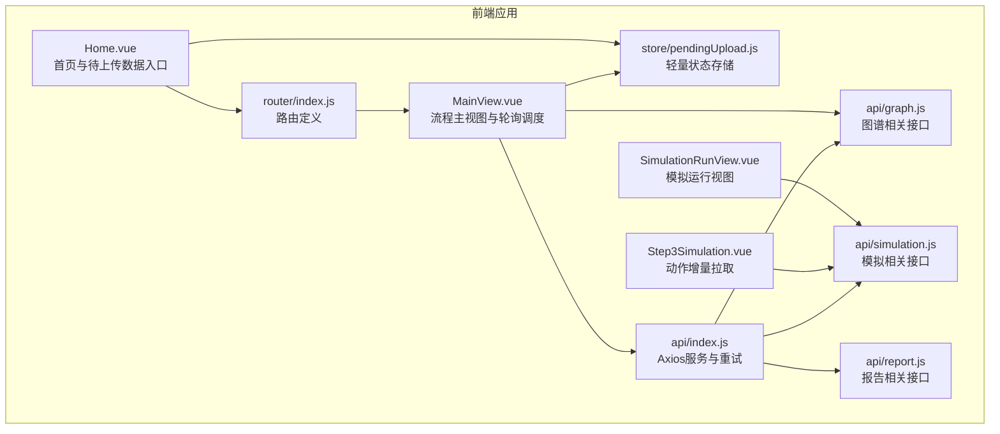
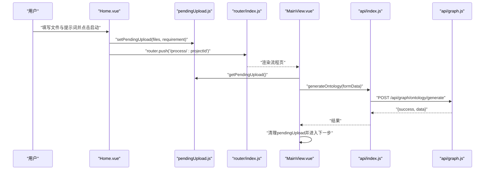
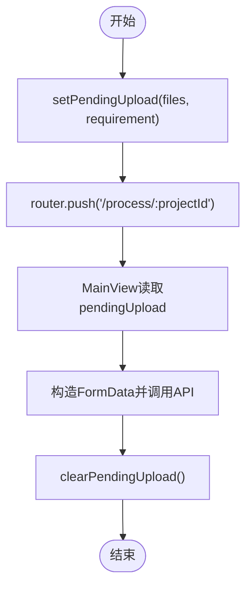
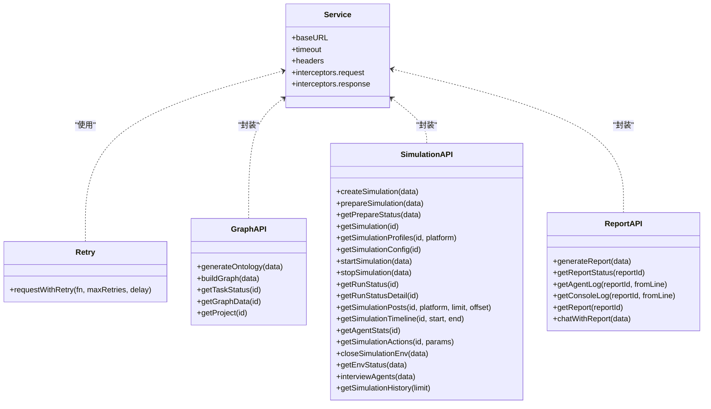
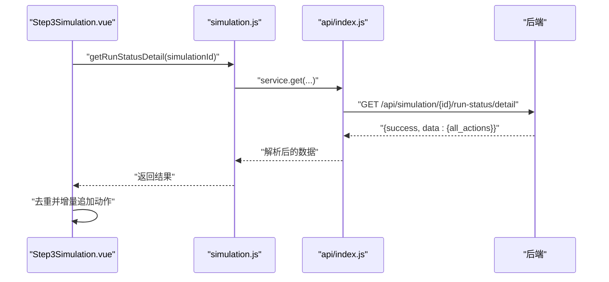
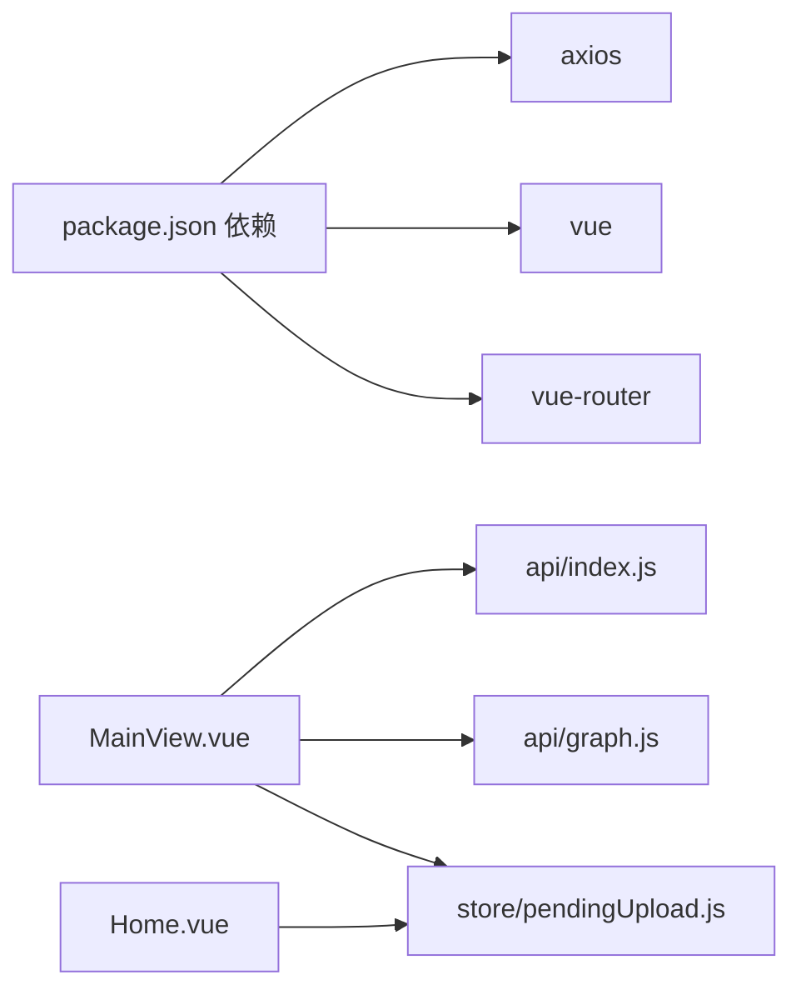

# 状态管理

<cite>
**本文档引用的文件**
- [frontend/src/store/pendingUpload.js](file://frontend/src/store/pendingUpload.js)
- [frontend/src/api/index.js](file://frontend/src/api/index.js)
- [frontend/src/api/graph.js](file://frontend/src/api/graph.js)
- [frontend/src/api/simulation.js](file://frontend/src/api/simulation.js)
- [frontend/src/api/report.js](file://frontend/src/api/report.js)
- [frontend/src/views/Home.vue](file://frontend/src/views/Home.vue)
- [frontend/src/views/MainView.vue](file://frontend/src/views/MainView.vue)
- [frontend/src/views/SimulationRunView.vue](file://frontend/src/views/SimulationRunView.vue)
- [frontend/src/components/Step3Simulation.vue](file://frontend/src/components/Step3Simulation.vue)
- [frontend/src/router/index.js](file://frontend/src/router/index.js)
- [frontend/package.json](file://frontend/package.json)
</cite>

## 目录
1. [引言](#引言)
2. [项目结构](#项目结构)
3. [核心组件](#核心组件)
4. [架构总览](#架构总览)
5. [详细组件分析](#详细组件分析)
6. [依赖分析](#依赖分析)
7. [性能考虑](#性能考虑)
8. [故障排查指南](#故障排查指南)
9. [结论](#结论)
10. [附录](#附录)

## 引言
本文件面向MiroFish前端的状态管理与异步数据流，聚焦以下目标：
- Vuex Store的组织结构与模块化设计现状与建议
- pendingUpload状态管理的实现原理与使用场景
- API客户端设计模式：graph.js、simulation.js、report.js等模块的接口封装与重试策略
- 异步状态管理、数据获取与缓存策略
- 状态持久化、本地存储与会话管理的实现方案
- 状态调试、时间旅行与性能监控的技术手段
- 状态同步、并发控制与错误处理的最佳实践
- 与后端API的数据交互协议与响应处理机制

## 项目结构
前端采用Vue 3 + Vue Router + Vite的单页应用架构。状态管理以轻量的响应式对象为主，未引入Vuex；异步数据通过统一的API模块封装，结合轮询与增量更新策略实现。

**图表来源**
- [frontend/src/views/Home.vue](file://frontend/src/views/Home.vue#L291-L305)
- [frontend/src/views/MainView.vue](file://frontend/src/views/MainView.vue#L83-L84)
- [frontend/src/router/index.js](file://frontend/src/router/index.js#L9-L44)
- [frontend/src/store/pendingUpload.js](file://frontend/src/store/pendingUpload.js#L1-L33)
- [frontend/src/api/index.js](file://frontend/src/api/index.js#L1-L68)
- [frontend/src/api/graph.js](file://frontend/src/api/graph.js#L1-L71)
- [frontend/src/api/simulation.js](file://frontend/src/api/simulation.js#L1-L188)
- [frontend/src/api/report.js](file://frontend/src/api/report.js#L1-L52)

**章节来源**
- [frontend/src/views/Home.vue](file://frontend/src/views/Home.vue#L291-L305)
- [frontend/src/views/MainView.vue](file://frontend/src/views/MainView.vue#L83-L84)
- [frontend/src/router/index.js](file://frontend/src/router/index.js#L9-L44)
- [frontend/src/store/pendingUpload.js](file://frontend/src/store/pendingUpload.js#L1-L33)
- [frontend/src/api/index.js](file://frontend/src/api/index.js#L1-L68)
- [frontend/src/api/graph.js](file://frontend/src/api/graph.js#L1-L71)
- [frontend/src/api/simulation.js](file://frontend/src/api/simulation.js#L1-L188)
- [frontend/src/api/report.js](file://frontend/src/api/report.js#L1-L52)

## 核心组件
- 轻量状态存储：pendingUpload.js提供临时存储待上传文件与模拟需求的能力，用于首页到流程页的无感跳转与数据传递。
- API客户端：index.js封装Axios实例、请求/响应拦截器与指数回退重试；graph.js/simulation.js/report.js分别对后端接口进行语义化封装。
- 视图与流程：Home.vue负责收集用户输入并写入pendingUpload；MainView.vue在流程页读取pendingUpload并发起本体生成与图谱构建；SimRunView与Step3Simulation.vue负责模拟运行期的状态轮询与增量动作展示。

**章节来源**
- [frontend/src/store/pendingUpload.js](file://frontend/src/store/pendingUpload.js#L1-L33)
- [frontend/src/api/index.js](file://frontend/src/api/index.js#L1-L68)
- [frontend/src/api/graph.js](file://frontend/src/api/graph.js#L1-L71)
- [frontend/src/api/simulation.js](file://frontend/src/api/simulation.js#L1-L188)
- [frontend/src/api/report.js](file://frontend/src/api/report.js#L1-L52)
- [frontend/src/views/Home.vue](file://frontend/src/views/Home.vue#L291-L305)
- [frontend/src/views/MainView.vue](file://frontend/src/views/MainView.vue#L189-L227)

## 架构总览
整体采用“视图层-状态存储-API层-后端服务”的分层设计。视图层通过pendingUpload在不同路由间传递数据；API层统一处理错误与重试；后端服务通过REST风格接口返回标准结构（success字段与错误信息）。

**图表来源**
- [frontend/src/views/Home.vue](file://frontend/src/views/Home.vue#L291-L305)
- [frontend/src/store/pendingUpload.js](file://frontend/src/store/pendingUpload.js#L13-L25)
- [frontend/src/router/index.js](file://frontend/src/router/index.js#L15-L20)
- [frontend/src/views/MainView.vue](file://frontend/src/views/MainView.vue#L189-L227)
- [frontend/src/api/index.js](file://frontend/src/api/index.js#L54-L65)
- [frontend/src/api/graph.js](file://frontend/src/api/graph.js#L8-L19)

## 详细组件分析

### pendingUpload 状态管理
- 设计目的：在首页点击“启动引擎”后立即跳转流程页，避免首屏等待；流程页再进行实际API调用。
- 数据结构：包含files、simulationRequirement、isPending三个字段，使用Vue响应式对象保证UI联动。
- 生命周期：setPendingUpload写入；getPendingUpload读取；clearPendingUpload在流程成功后清理。

**图表来源**
- [frontend/src/views/Home.vue](file://frontend/src/views/Home.vue#L291-L305)
- [frontend/src/store/pendingUpload.js](file://frontend/src/store/pendingUpload.js#L13-L31)
- [frontend/src/views/MainView.vue](file://frontend/src/views/MainView.vue#L189-L227)

**章节来源**
- [frontend/src/store/pendingUpload.js](file://frontend/src/store/pendingUpload.js#L1-L33)
- [frontend/src/views/Home.vue](file://frontend/src/views/Home.vue#L291-L305)
- [frontend/src/views/MainView.vue](file://frontend/src/views/MainView.vue#L189-L227)

### API客户端设计模式
- Axios实例：统一baseURL、超时、默认头；请求/响应拦截器统一处理错误与业务错误码。
- 重试机制：requestWithRetry实现指数回退重试，适用于长耗时任务或瞬时网络波动。
- 接口封装：graph.js封装本体生成、图谱构建、任务状态、图数据与项目查询；simulation.js封装模拟生命周期与运行状态；report.js封装报告生成与日志增量拉取。

**图表来源**
- [frontend/src/api/index.js](file://frontend/src/api/index.js#L1-L68)
- [frontend/src/api/graph.js](file://frontend/src/api/graph.js#L1-L71)
- [frontend/src/api/simulation.js](file://frontend/src/api/simulation.js#L1-L188)
- [frontend/src/api/report.js](file://frontend/src/api/report.js#L1-L52)

**章节来源**
- [frontend/src/api/index.js](file://frontend/src/api/index.js#L1-L68)
- [frontend/src/api/graph.js](file://frontend/src/api/graph.js#L1-L71)
- [frontend/src/api/simulation.js](file://frontend/src/api/simulation.js#L1-L188)
- [frontend/src/api/report.js](file://frontend/src/api/report.js#L1-L52)

### 异步状态管理与数据获取
- 流程页轮询：MainView.vue对任务状态与图数据进行定时轮询，根据后端返回的progress/message/status推进UI状态机。
- 增量更新：Step3Simulation.vue通过getRunStatusDetail获取all_actions，使用Set去重并增量追加，避免重复渲染与内存膨胀。
- 超时与错误：API层统一处理超时与网络错误，组件层捕获异常并降级显示。

**图表来源**
- [frontend/src/components/Step3Simulation.vue](file://frontend/src/components/Step3Simulation.vue#L558-L589)
- [frontend/src/api/simulation.js](file://frontend/src/api/simulation.js#L107-L109)
- [frontend/src/api/index.js](file://frontend/src/api/index.js#L24-L51)

**章节来源**
- [frontend/src/views/MainView.vue](file://frontend/src/views/MainView.vue#L316-L355)
- [frontend/src/components/Step3Simulation.vue](file://frontend/src/components/Step3Simulation.vue#L558-L589)
- [frontend/src/api/simulation.js](file://frontend/src/api/simulation.js#L107-L109)
- [frontend/src/api/index.js](file://frontend/src/api/index.js#L24-L51)

### 缓存策略
- 组件内缓存：Step3Simulation.vue维护allActions与actionIds，仅在新动作出现时更新，减少不必要的渲染。
- 路由级复用：通过keep-alive与IntersectionObserver优化历史数据库的滚动体验，避免重复加载。
- 会话与持久化：当前未见localStorage/sessionStorage的显式使用，pendingUpload仅驻留内存；如需持久化可在store层扩展。

**章节来源**
- [frontend/src/components/Step3Simulation.vue](file://frontend/src/components/Step3Simulation.vue#L320-L340)
- [frontend/src/views/SimulationRunView.vue](file://frontend/src/views/SimulationRunView.vue#L76-L112)

### 状态同步、并发控制与错误处理
- 并发控制：MainView.vue在不同阶段设置独立轮询定时器，使用stopPolling/stopGraphPolling在组件卸载时清理，避免内存泄漏。
- 错误处理：API层对非success响应抛出错误；组件层捕获并记录日志；流程页根据task.status区分completed/failed分支。
- 优雅关闭：SimRunView在返回前停止轮询并尝试优雅关闭模拟环境，降低资源占用。

**章节来源**
- [frontend/src/views/MainView.vue](file://frontend/src/views/MainView.vue#L382-L395)
- [frontend/src/api/index.js](file://frontend/src/api/index.js#L24-L51)
- [frontend/src/views/SimulationRunView.vue](file://frontend/src/views/SimulationRunView.vue#L147-L155)

### 与后端API的数据交互协议
- 协议与超时：baseURL与timeout在API层集中配置；长任务（本体生成）具备较长超时。
- 成功/失败约定：后端统一返回{success, data|error|message}结构；API层拦截器将非success视为错误。
- 重试策略：requestWithRetry对关键操作（创建/启动/采访等）进行指数回退重试，提升鲁棒性。

**章节来源**
- [frontend/src/api/index.js](file://frontend/src/api/index.js#L4-L10)
- [frontend/src/api/index.js](file://frontend/src/api/index.js#L24-L51)
- [frontend/src/api/simulation.js](file://frontend/src/api/simulation.js#L7-L9)
- [frontend/src/api/simulation.js](file://frontend/src/api/simulation.js#L83-L84)
- [frontend/src/api/simulation.js](file://frontend/src/api/simulation.js#L175-L177)
- [frontend/src/api/report.js](file://frontend/src/api/report.js#L7-L9)

## 依赖分析
- 核心依赖：axios用于HTTP通信；vue与vue-router提供视图与路由能力。
- 组件耦合：MainView与API模块耦合度较高，承担较多流程编排职责；可考虑拆分为更细的领域模块或引入轻量状态库以降低耦合。

**图表来源**
- [frontend/package.json](file://frontend/package.json#L11-L16)
- [frontend/src/views/MainView.vue](file://frontend/src/views/MainView.vue#L83-L84)
- [frontend/src/api/index.js](file://frontend/src/api/index.js#L1-L10)
- [frontend/src/store/pendingUpload.js](file://frontend/src/store/pendingUpload.js#L1-L33)
- [frontend/src/views/Home.vue](file://frontend/src/views/Home.vue#L291-L305)

**章节来源**
- [frontend/package.json](file://frontend/package.json#L11-L16)
- [frontend/src/views/MainView.vue](file://frontend/src/views/MainView.vue#L83-L84)
- [frontend/src/store/pendingUpload.js](file://frontend/src/store/pendingUpload.js#L1-L33)
- [frontend/src/views/Home.vue](file://frontend/src/views/Home.vue#L291-L305)

## 性能考虑
- 轮询频率权衡：MainView.vue对任务状态与图数据分别设置2s与10s轮询，可根据任务规模调整。
- 增量渲染：Step3Simulation.vue仅在新动作出现时追加，避免全量刷新。
- 资源释放：组件卸载时务必清理轮询与观察器，防止内存泄漏。
- 重试策略：requestWithRetry的指数回退可缓解瞬时失败，但需避免对高频接口过度重试。

[本节为通用指导，无需列出具体文件来源]

## 故障排查指南
- API错误：检查API层拦截器输出，确认后端返回的success字段与错误信息。
- 轮询异常：确认定时器是否正确清理；检查路由切换导致的组件卸载。
- 增量数据不更新：核对去重逻辑与唯一ID生成规则，确保新动作被识别。
- 超时问题：适当提高API层timeout或优化后端任务耗时。

**章节来源**
- [frontend/src/api/index.js](file://frontend/src/api/index.js#L24-L51)
- [frontend/src/views/MainView.vue](file://frontend/src/views/MainView.vue#L382-L395)
- [frontend/src/components/Step3Simulation.vue](file://frontend/src/components/Step3Simulation.vue#L568-L581)

## 结论
MiroFish前端采用轻量状态与清晰的API封装实现了端到端的异步工作流。pendingUpload为跨路由数据传递提供了简单可靠的方案；API层的统一拦截与重试提升了鲁棒性；组件内的增量更新与轮询策略兼顾了用户体验与性能。建议后续可引入更完善的领域状态模块与持久化策略，以进一步增强可维护性与可观测性。

[本节为总结性内容，无需列出具体文件来源]

## 附录
- 状态调试与时间旅行：当前未集成专门的调试工具；可在开发环境打印关键状态变更，或引入轻量状态追踪库。
- 性能监控：建议在API层埋点请求耗时与成功率，结合浏览器性能面板分析渲染瓶颈。

[本节为通用指导，无需列出具体文件来源]