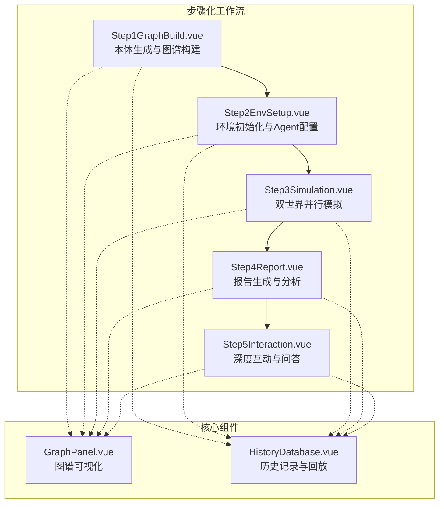
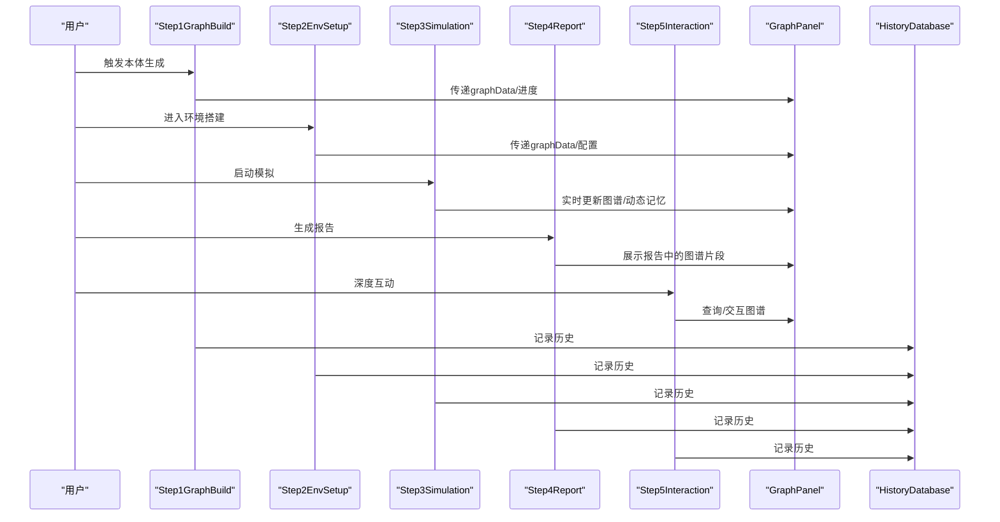
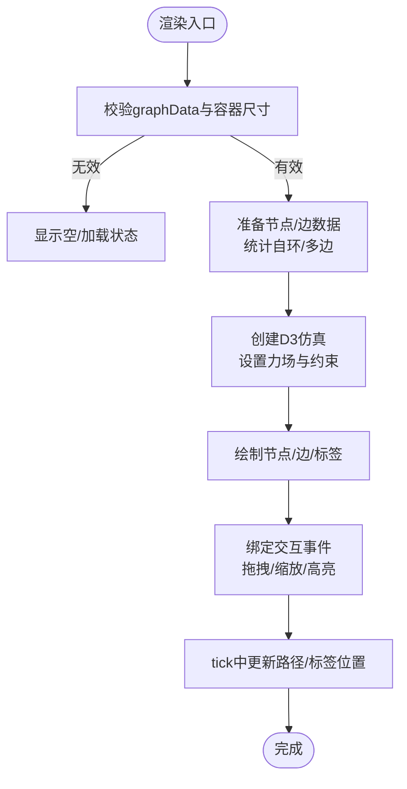
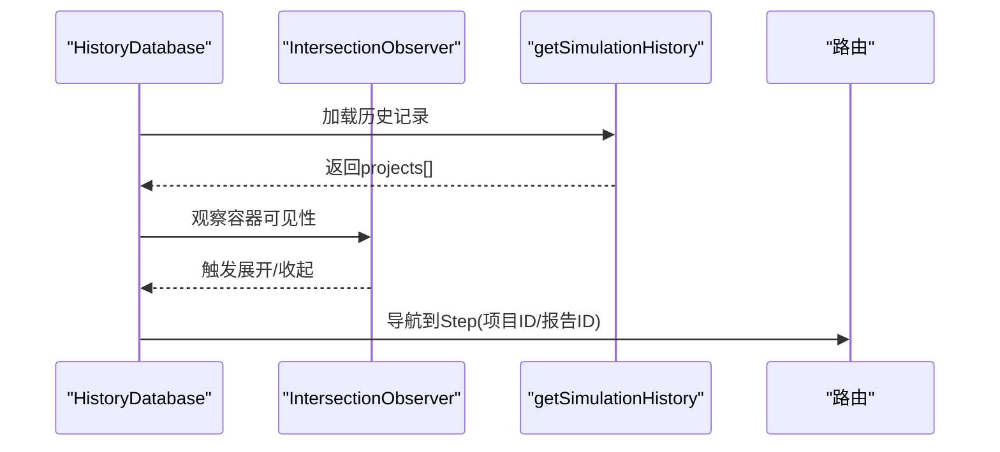
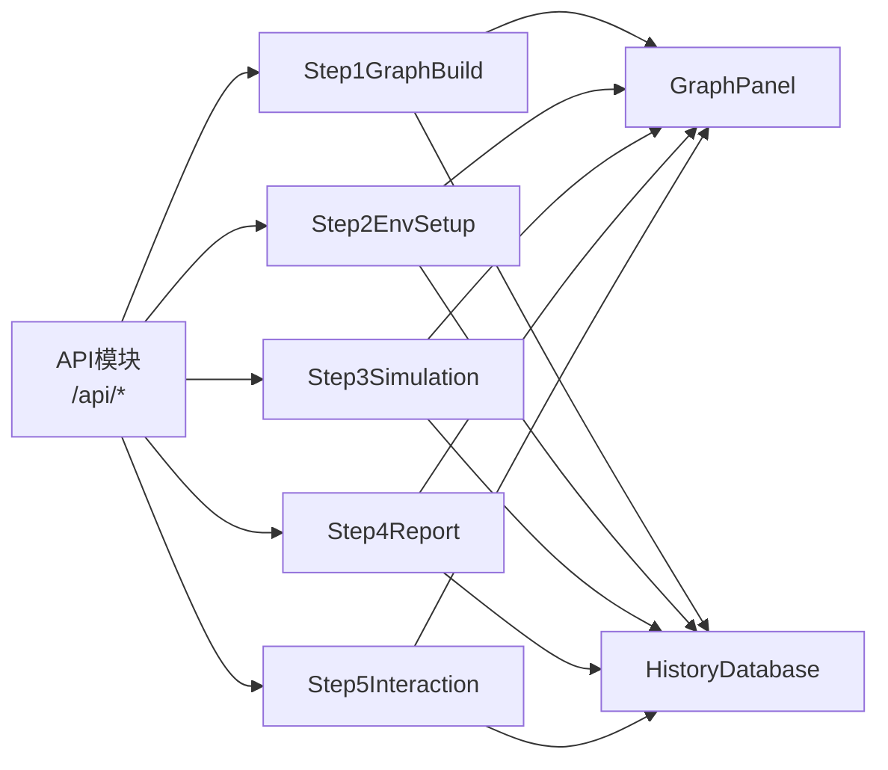

# 组件系统

<cite>
**本文档引用的文件**
- [GraphPanel.vue](file://frontend/src/components/GraphPanel.vue)
- [HistoryDatabase.vue](file://frontend/src/components/HistoryDatabase.vue)
- [Step1GraphBuild.vue](file://frontend/src/components/Step1GraphBuild.vue)
- [Step2EnvSetup.vue](file://frontend/src/components/Step2EnvSetup.vue)
- [Step3Simulation.vue](file://frontend/src/components/Step3Simulation.vue)
- [Step4Report.vue](file://frontend/src/components/Step4Report.vue)
- [Step5Interaction.vue](file://frontend/src/components/Step5Interaction.vue)
</cite>

## 目录
1. [引言](#引言)
2. [项目结构](#项目结构)
3. [核心组件](#核心组件)
4. [架构总览](#架构总览)
5. [详细组件分析](#详细组件分析)
6. [依赖分析](#依赖分析)
7. [性能考虑](#性能考虑)
8. [故障排查指南](#故障排查指南)
9. [结论](#结论)
10. [附录](#附录)

## 引言
本文件面向MiroFish前端组件系统的使用者与维护者，系统化阐述组件设计理念、实现方式与交互机制。重点覆盖步骤化工作流组件（Step1至Step5）的功能职责与协作关系，核心组件GraphPanel与HistoryDatabase的设计模式与复用策略，以及组件间通信机制（props传递、事件触发、插槽使用）、生命周期管理、状态管理与错误边界处理。同时提供测试策略、性能优化与可维护性最佳实践，并说明样式封装、主题定制与响应式设计的实现方案。

## 项目结构
前端采用Vue 3 Composition API与单文件组件（SFC）组织，组件位于frontend/src/components目录，围绕“图谱构建-环境搭建-模拟运行-报告生成-深度互动”的五步工作流展开。组件之间通过props向下传递数据、通过emit向上冒泡事件、通过路由与API服务协同。

**图表来源**
- [Step1GraphBuild.vue](file://frontend/src/components/Step1GraphBuild.vue#L1-L699)
- [Step2EnvSetup.vue](file://frontend/src/components/Step2EnvSetup.vue#L1-L800)
- [Step3Simulation.vue](file://frontend/src/components/Step3Simulation.vue#L1-L800)
- [Step4Report.vue](file://frontend/src/components/Step4Report.vue#L1-L800)
- [Step5Interaction.vue](file://frontend/src/components/Step5Interaction.vue#L1-L800)
- [GraphPanel.vue](file://frontend/src/components/GraphPanel.vue#L1-L800)
- [HistoryDatabase.vue](file://frontend/src/components/HistoryDatabase.vue#L1-L800)

**章节来源**
- [Step1GraphBuild.vue](file://frontend/src/components/Step1GraphBuild.vue#L1-L699)
- [Step2EnvSetup.vue](file://frontend/src/components/Step2EnvSetup.vue#L1-L800)
- [Step3Simulation.vue](file://frontend/src/components/Step3Simulation.vue#L1-L800)
- [Step4Report.vue](file://frontend/src/components/Step4Report.vue#L1-L800)
- [Step5Interaction.vue](file://frontend/src/components/Step5Interaction.vue#L1-L800)
- [GraphPanel.vue](file://frontend/src/components/GraphPanel.vue#L1-L800)
- [HistoryDatabase.vue](file://frontend/src/components/HistoryDatabase.vue#L1-L800)

## 核心组件
- GraphPanel：基于D3的图谱可视化组件，负责渲染节点、边与自环，支持缩放、拖拽、高亮、详情面板与边标签显示控制。通过props接收graphData、loading、currentPhase、isSimulating；通过$emit('refresh'|'toggle-maximize')与父组件通信。
- HistoryDatabase：历史记录数据库组件，展示推演记录卡片，支持展开/折叠、文件列表、进度状态、弹窗详情与导航到对应步骤。

**章节来源**
- [GraphPanel.vue](file://frontend/src/components/GraphPanel.vue#L238-L814)
- [HistoryDatabase.vue](file://frontend/src/components/HistoryDatabase.vue#L193-L569)

## 架构总览
组件间通过props与emit形成单向数据流，配合API服务与路由实现端到端流程。GraphPanel贯穿Step1-Step4，作为图谱数据的统一可视化入口；HistoryDatabase贯穿所有步骤，提供历史回放能力。

**图表来源**
- [Step1GraphBuild.vue](file://frontend/src/components/Step1GraphBuild.vue#L189-L271)
- [Step2EnvSetup.vue](file://frontend/src/components/Step2EnvSetup.vue#L634-L755)
- [Step3Simulation.vue](file://frontend/src/components/Step3Simulation.vue#L288-L697)
- [Step4Report.vue](file://frontend/src/components/Step4Report.vue#L392-L413)
- [Step5Interaction.vue](file://frontend/src/components/Step5Interaction.vue#L413-L931)
- [GraphPanel.vue](file://frontend/src/components/GraphPanel.vue#L238-L814)
- [HistoryDatabase.vue](file://frontend/src/components/HistoryDatabase.vue#L193-L569)

## 详细组件分析

### GraphPanel 组件分析
- 设计理念：以D3为中心的力导向图，支持自环合并、多边分散、曲线边与标签、拖拽与缩放、详情面板与高亮联动。
- 数据模型：graphData.nodes/edges，节点含labels/uuid/name等，边含source/target/fact_type等；通过entityTypes计算实体类型与颜色映射。
- 交互逻辑：点击节点/边高亮关联元素；点击空白关闭详情；切换边标签显示；监听isSimulating变化显示“模拟结束”提示。
- 性能要点：渲染前停止旧仿真；按边数量动态调整节点间距；曲线路径与标签位置在tick中批量更新；窗口resize时重绘。
- 错误边界：空数据时显示“等待本体生成”；加载中显示旋转指示；异常时捕获并降级为空状态。

**图表来源**
- [GraphPanel.vue](file://frontend/src/components/GraphPanel.vue#L328-L784)

**章节来源**
- [GraphPanel.vue](file://frontend/src/components/GraphPanel.vue#L238-L814)

### HistoryDatabase 组件分析
- 设计理念：卡片式历史记录展示，支持IntersectionObserver懒加载与展开动画；弹窗详情提供导航到各步骤的能力。
- 数据模型：projects[]，包含simulation_id/project_id/report_id、文件列表、进度状态、创建时间等。
- 交互逻辑：滚动触发展开/收起；卡片悬停高亮；点击卡片弹窗详情；弹窗内导航按钮跳转到对应步骤。
- 性能要点：懒加载卡片容器高度；防抖切换展开状态；Observer在卸载时清理；滚动日志自动滚动到底部。
- 错误边界：加载失败时清空数据并记录错误；无项目时简化显示。

**图表来源**
- [HistoryDatabase.vue](file://frontend/src/components/HistoryDatabase.vue#L437-L569)

**章节来源**
- [HistoryDatabase.vue](file://frontend/src/components/HistoryDatabase.vue#L193-L569)

### Step1GraphBuild 组件分析
- 功能职责：Step1负责本体生成与图谱构建，展示生成的实体/关系类型标签，提供图谱构建统计卡片，进入下一步环境搭建。
- 交互逻辑：点击实体/关系标签弹出详情Overlay；滚动日志自动滚动到底部；点击“进入环境搭建”创建simulation并跳转。
- 状态管理：通过props接收currentPhase、projectData、ontologyProgress、buildProgress、graphData、systemLogs；内部维护selectedOntologyItem与creatingSimulation标志位。

**章节来源**
- [Step1GraphBuild.vue](file://frontend/src/components/Step1GraphBuild.vue#L189-L271)

### Step2EnvSetup 组件分析
- 功能职责：Step2负责环境初始化、Agent人设生成、双平台模拟配置生成、初始激活编排，支持自定义轮数与自动轮数规划。
- 交互逻辑：阶段化进度展示；轮询获取Agent人设与配置；选择自定义轮数并传递给父组件；点击“开始双世界并行模拟”触发下一步。
- 状态管理：phase/currentStage/prepareProgress/profiles/simulationConfig等；使用定时器轮询状态；日志去重与滚动。

**章节来源**
- [Step2EnvSetup.vue](file://frontend/src/components/Step2EnvSetup.vue#L634-L755)

### Step3Simulation 组件分析
- 功能职责：Step3负责双世界并行模拟运行，展示Twitter/Reddit平台进度、动作统计与时间轴，支持启动/停止与报告生成。
- 交互逻辑：启动模拟后轮询运行状态与动作详情；自动滚动时间轴；点击“开始生成结果报告”跳转报告页。
- 状态管理：runStatus/allActions/actionIds/phase/isStarting/isStopping等；通过定时器轮询；检测平台完成状态。

**章节来源**
- [Step3Simulation.vue](file://frontend/src/components/Step3Simulation.vue#L288-L697)

### Step4Report 组件分析
- 功能职责：Step4负责报告生成与分析，左侧报告大纲与内容，右侧工作流时间线与工具调用详情。
- 交互逻辑：Section折叠/展开；工具结果结构化/原始视图切换；LLM响应展开/收起；报告完成后进入Step5互动。
- 状态管理：reportOutline/generatedSections/collapsedSections/currentSectionIndex；agentLogs/consoleLogs；工具解析函数。

**章节来源**
- [Step4Report.vue](file://frontend/src/components/Step4Report.vue#L392-L413)

### Step5Interaction 组件分析
- 功能职责：Step5提供深度互动能力，与Report Agent对话、与任意Agent对话、发送问卷调查到世界中。
- 交互逻辑：聊天模式与问卷模式切换；Agent选择下拉；双平台回答切换；问卷结果展示。
- 状态管理：activeTab/chatTarget/selectedAgent/showAgentDropdown/chatHistory/surveyResults等；Markdown渲染与滚动。

**章节来源**
- [Step5Interaction.vue](file://frontend/src/components/Step5Interaction.vue#L413-L931)

## 依赖分析
- 组件耦合：各Step组件通过props与emit与父组件协作，GraphPanel与HistoryDatabase作为横切关注点被多步骤共享。
- 外部依赖：D3用于图谱渲染；API模块封装后端接口；路由模块驱动页面跳转。
- 循环依赖：组件间通过事件冒泡避免直接循环引用；API层提供统一数据访问。

**图表来源**
- [Step1GraphBuild.vue](file://frontend/src/components/Step1GraphBuild.vue#L190-L195)
- [Step2EnvSetup.vue](file://frontend/src/components/Step2EnvSetup.vue#L636-L642)
- [Step3Simulation.vue](file://frontend/src/components/Step3Simulation.vue#L291-L297)
- [Step4Report.vue](file://frontend/src/components/Step4Report.vue#L395-L396)
- [Step5Interaction.vue](file://frontend/src/components/Step5Interaction.vue#L415-L416)

**章节来源**
- [Step1GraphBuild.vue](file://frontend/src/components/Step1GraphBuild.vue#L190-L195)
- [Step2EnvSetup.vue](file://frontend/src/components/Step2EnvSetup.vue#L636-L642)
- [Step3Simulation.vue](file://frontend/src/components/Step3Simulation.vue#L291-L297)
- [Step4Report.vue](file://frontend/src/components/Step4Report.vue#L395-L396)
- [Step5Interaction.vue](file://frontend/src/components/Step5Interaction.vue#L415-L416)

## 性能考虑
- 渲染优化：GraphPanel在渲染前停止旧仿真，按边数量动态调整节点间距，曲线路径与标签在tick中批量更新，避免频繁DOM操作。
- 数据更新：Step3使用增量方式追加动作，避免全量重渲染；Step4Report对工具结果进行结构化展示，减少复杂DOM层级。
- 轮询节流：Step2EnvSetup与Step3Simulation使用定时器轮询，配合防抖与状态变更检测，避免重复请求。
- 懒加载：HistoryDatabase使用IntersectionObserver懒加载卡片，减少首屏压力。
- 内存管理：组件卸载时清理定时器、D3仿真与Observer，防止内存泄漏。

[本节为通用指导，无需特定文件引用]

## 故障排查指南
- 图谱不显示：检查graphData是否为空、容器尺寸是否为0；确认GraphPanel的渲染入口与watch触发。
- 模拟未启动：检查simulationId是否存在、启动参数是否正确；查看控制台日志与状态轮询结果。
- 报告生成失败：检查reportId与后端接口状态；查看工具调用日志与解析函数异常。
- 历史记录为空：确认getSimulationHistory返回数据；检查权限与网络请求状态。
- 交互异常：检查router与路由参数；确认API接口返回格式一致性。

**章节来源**
- [GraphPanel.vue](file://frontend/src/components/GraphPanel.vue#L328-L784)
- [Step3Simulation.vue](file://frontend/src/components/Step3Simulation.vue#L380-L460)
- [Step4Report.vue](file://frontend/src/components/Step4Report.vue#L542-L548)
- [HistoryDatabase.vue](file://frontend/src/components/HistoryDatabase.vue#L437-L451)
- [Step5Interaction.vue](file://frontend/src/components/Step5Interaction.vue#L614-L743)

## 结论
MiroFish组件系统以步骤化工作流为核心，通过GraphPanel与HistoryDatabase实现跨步骤的可视化与历史回放能力。组件间通过props与emit形成清晰的单向数据流，配合API与路由实现端到端体验。在性能方面，采用D3仿真优化、增量更新、懒加载与轮询节流等策略；在可维护性方面，采用模块化API、统一状态管理与错误边界处理。建议持续完善单元测试与集成测试，强化主题定制与响应式设计，提升用户体验与可扩展性。

[本节为总结性内容，无需特定文件引用]

## 附录
- 测试策略建议：为GraphPanel编写渲染与交互测试；为HistoryDatabase编写懒加载与弹窗交互测试；为各Step组件编写状态流转与API调用测试；为Step3Simulation编写轮询与动作增量测试。
- 主题定制：通过CSS变量与scoped样式实现主题切换；为GraphPanel与各Step组件提供统一的主题变量。
- 响应式设计：媒体查询适配不同屏幕尺寸；GraphPanel与HistoryDatabase采用flex布局与相对单位，确保在小屏设备上的可读性与可用性。

[本节为通用指导，无需特定文件引用]