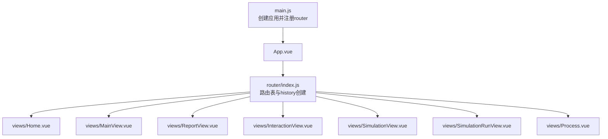
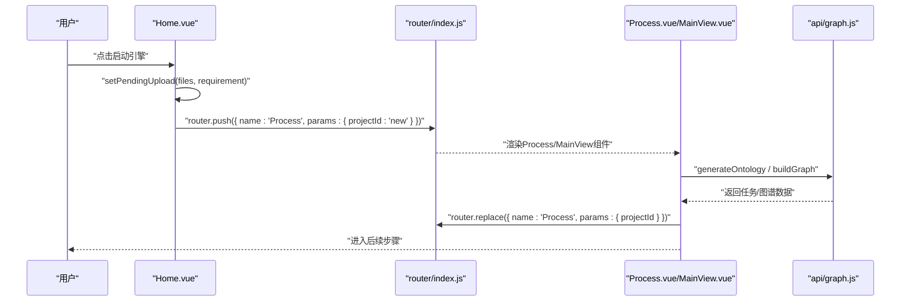
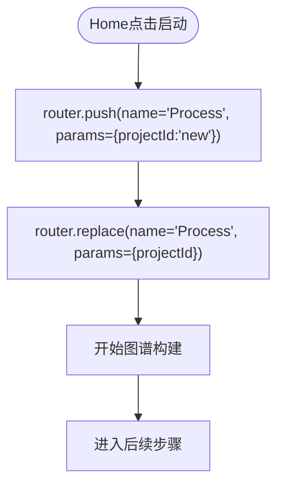
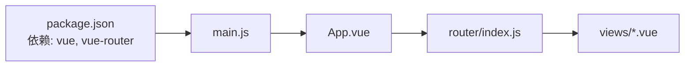

# 路由导航

<cite>
**本文引用的文件**
- [frontend/src/router/index.js](file://frontend/src/router/index.js)
- [frontend/src/main.js](file://frontend/src/main.js)
- [frontend/src/App.vue](file://frontend/src/App.vue)
- [frontend/src/views/Home.vue](file://frontend/src/views/Home.vue)
- [frontend/src/views/MainView.vue](file://frontend/src/views/MainView.vue)
- [frontend/src/views/Process.vue](file://frontend/src/views/Process.vue)
- [frontend/src/views/ReportView.vue](file://frontend/src/views/ReportView.vue)
- [frontend/src/views/InteractionView.vue](file://frontend/src/views/InteractionView.vue)
- [frontend/src/store/pendingUpload.js](file://frontend/src/store/pendingUpload.js)
- [frontend/src/api/graph.js](file://frontend/src/api/graph.js)
- [frontend/package.json](file://frontend/package.json)
</cite>

## 目录
1. [简介](#简介)
2. [项目结构](#项目结构)
3. [核心组件](#核心组件)
4. [架构总览](#架构总览)
5. [详细组件分析](#详细组件分析)
6. [依赖分析](#依赖分析)
7. [性能考虑](#性能考虑)
8. [故障排查指南](#故障排查指南)
9. [结论](#结论)
10. [附录](#附录)

## 简介
本文件面向MiroFish前端路由导航系统，围绕Vue Router配置与路由表设计展开，覆盖路由守卫与导航解析过程、视图组件功能定位与页面跳转逻辑、路由参数传递与动态路由匹配、程序化导航与命名路由、路由懒加载策略、权限控制、面包屑与页面标题管理、性能优化与SEO友好实践等内容。目标是帮助开发者与产品人员快速理解并高效维护路由体系。

## 项目结构
前端采用Vite + Vue 3 + Vue Router 4的标准单页应用结构，路由集中配置于router模块，视图组件位于views目录，全局入口在main.js中挂载router，根组件App.vue通过router-view承载当前路由视图。

图表来源
- [frontend/src/main.js](file://frontend/src/main.js#L1-L10)
- [frontend/src/App.vue](file://frontend/src/App.vue#L1-L8)
- [frontend/src/router/index.js](file://frontend/src/router/index.js#L1-L53)

章节来源
- [frontend/src/main.js](file://frontend/src/main.js#L1-L10)
- [frontend/src/App.vue](file://frontend/src/App.vue#L1-L8)
- [frontend/src/router/index.js](file://frontend/src/router/index.js#L1-L53)

## 核心组件
- 路由器实例：在router/index.js中创建，使用HTML5 History模式，集中声明所有路由规则。
- 视图组件：
  - Home：首页，负责接收用户上传与模拟需求，触发程序化导航至Process。
  - MainView/Process：项目流程主视图，处理本体生成、图谱构建、轮询状态与图谱数据加载。
  - ReportView/InteractionView：报告生成与深度互动视图，按reportId加载关联的simulation与graph数据。
  - SimulationView/SimulationRunView：模拟流程视图，支持通过query参数传递maxRounds等配置。
- 状态存储：pendingUpload用于在Home与Process之间传递待上传文件与需求。

章节来源
- [frontend/src/router/index.js](file://frontend/src/router/index.js#L9-L45)
- [frontend/src/views/Home.vue](file://frontend/src/views/Home.vue#L291-L305)
- [frontend/src/views/MainView.vue](file://frontend/src/views/MainView.vue#L180-L227)
- [frontend/src/views/Process.vue](file://frontend/src/views/Process.vue#L567-L619)
- [frontend/src/views/ReportView.vue](file://frontend/src/views/ReportView.vue#L140-L177)
- [frontend/src/views/InteractionView.vue](file://frontend/src/views/InteractionView.vue#L140-L178)
- [frontend/src/store/pendingUpload.js](file://frontend/src/store/pendingUpload.js#L1-L34)

## 架构总览
MiroFish的路由采用“命名路由 + 动态参数 + 查询参数”的组合策略，结合程序化导航与props透传，实现清晰的页面跳转与数据传递。导航流程遵循Vue Router的解析顺序：解析路由定义 -> 匹配动态段 -> 应用props映射 -> 执行组件生命周期钩子。

图表来源
- [frontend/src/views/Home.vue](file://frontend/src/views/Home.vue#L291-L305)
- [frontend/src/router/index.js](file://frontend/src/router/index.js#L15-L20)
- [frontend/src/views/Process.vue](file://frontend/src/views/Process.vue#L567-L619)
- [frontend/src/api/graph.js](file://frontend/src/api/graph.js#L8-L19)

## 详细组件分析

### 路由表与导航策略
- 路由表
  - Home：根路径，无参数。
  - Process：/process/:projectId，命名路由为Process，启用props透传，便于在组件内直接访问route.params.projectId。
  - Simulation：/simulation/:simulationId，命名路由为Simulation；/simulation/:simulationId/start，命名路由为SimulationRun，用于启动模拟。
  - Report：/report/:reportId，命名路由为Report。
  - Interaction：/interaction/:reportId，命名路由为Interaction。
- 导航策略
  - 程序化导航：Home在点击后通过router.push跳转至Process，并借助pendingUpload在Process/MainView中完成API调用与URL替换。
  - 命名路由：各页面均使用name进行跳转，避免硬编码路径变更带来的风险。
  - 动态路由匹配：通过params传递业务ID（如projectId、simulationId、reportId），props: true确保组件内可直接读取。
  - 查询参数：在模拟流程中，可通过query传递maxRounds等配置项，便于下游组件读取。

章节来源
- [frontend/src/router/index.js](file://frontend/src/router/index.js#L9-L45)
- [frontend/src/views/Home.vue](file://frontend/src/views/Home.vue#L291-L305)
- [frontend/src/views/Process.vue](file://frontend/src/views/Process.vue#L159-L171)
- [frontend/src/views/ReportView.vue](file://frontend/src/views/ReportView.vue#L202-L207)
- [frontend/src/views/InteractionView.vue](file://frontend/src/views/InteractionView.vue#L202-L208)

### 视图组件功能定位与页面跳转逻辑

#### Home → Process
- 用户在Home填写模拟需求并上传文件后，通过router.push跳转至Process，params为{ projectId: 'new' }。
- Process在mounted或初始化逻辑中读取pendingUpload，调用generateOntology，成功后将params替换为真实projectId，并进入图谱构建阶段。

图表来源
- [frontend/src/views/Home.vue](file://frontend/src/views/Home.vue#L291-L305)
- [frontend/src/views/Process.vue](file://frontend/src/views/Process.vue#L567-L619)

章节来源
- [frontend/src/views/Home.vue](file://frontend/src/views/Home.vue#L291-L305)
- [frontend/src/views/Process.vue](file://frontend/src/views/Process.vue#L567-L619)

#### Process/MainView → Report/Interaction
- Process/MainView根据业务流程推进，最终通过router.push跳转至Report或Interaction，params携带reportId。
- ReportView/Interaction通过watch监听route.params.reportId，异步拉取report、simulation、project与graph数据，驱动视图渲染。

章节来源
- [frontend/src/views/Process.vue](file://frontend/src/views/Process.vue#L159-L171)
- [frontend/src/views/ReportView.vue](file://frontend/src/views/ReportView.vue#L202-L207)
- [frontend/src/views/InteractionView.vue](file://frontend/src/views/InteractionView.vue#L202-L208)

#### Simulation流程
- SimulationView → SimulationRunView：通过router.push携带query参数（如maxRounds），并在目标组件读取。
- SimulationRunView：在必要时返回上一步，使用router.push回到Simulation并保留simulationId。

章节来源
- [frontend/src/views/SimulationView.vue](file://frontend/src/views/SimulationView.vue#L159-L171)
- [frontend/src/views/SimulationRunView.vue](file://frontend/src/views/SimulationRunView.vue#L191-L193)

### 路由参数传递、查询字符串处理与动态路由匹配
- 动态参数：/process/:projectId、/simulation/:simulationId、/report/:reportId、/interaction/:reportId，均通过props: true透传至组件。
- 查询参数：在模拟流程中，通过query传递maxRounds等配置，便于跨步骤共享参数。
- 参数校验与回退：组件内部对params进行存在性判断，必要时给出错误提示或引导返回首页。

章节来源
- [frontend/src/router/index.js](file://frontend/src/router/index.js#L15-L44)
- [frontend/src/views/Process.vue](file://frontend/src/views/Process.vue#L159-L171)
- [frontend/src/views/ReportView.vue](file://frontend/src/views/ReportView.vue#L202-L207)
- [frontend/src/views/InteractionView.vue](file://frontend/src/views/InteractionView.vue#L202-L208)

### 程序化导航、命名路由与路由懒加载
- 程序化导航：广泛使用router.push与router.replace，配合命名路由name与params/query实现精准跳转。
- 命名路由：所有页面均使用name，提升可维护性与可读性。
- 路由懒加载：当前路由配置未显式使用动态import进行懒加载。可在views导入处改为动态import以降低首屏体积。

章节来源
- [frontend/src/router/index.js](file://frontend/src/router/index.js#L1-L7)
- [frontend/src/views/Home.vue](file://frontend/src/views/Home.vue#L296-L304)
- [frontend/src/views/Process.vue](file://frontend/src/views/Process.vue#L599-L604)

### 路由守卫与导航解析过程
- 全局前置守卫：当前仓库未实现全局前置守卫。
- 局部守卫：组件内通过watch监听$route变化（如HistoryDatabase），在特定路径下触发副作用（如重新加载历史数据）。
- 导航解析流程：解析路由定义 → 匹配动态段 → 应用props → 执行组件生命周期 → 渲染视图。

章节来源
- [frontend/src/components/HistoryDatabase.vue](file://frontend/src/components/HistoryDatabase.vue#L534-L539)

### 路由权限控制、面包屑导航与页面标题管理
- 权限控制：当前未实现路由级别的权限守卫，建议在全局前置守卫中加入鉴权逻辑。
- 面包屑：当前未实现统一的面包屑组件，可在App.vue或路由层维护面包屑元信息，结合router-view动态渲染。
- 页面标题：当前未实现统一的<title>管理，建议在路由meta中维护title字段，并在导航时设置document.title。

章节来源
- [frontend/src/router/index.js](file://frontend/src/router/index.js#L9-L45)

## 依赖分析
- Vue Router版本：^4.6.3
- 依赖关系：main.js引入App.vue与router，App.vue通过<router-view/>承载当前路由视图；router/index.js定义路由表并导出路由实例供main.js使用。

图表来源
- [frontend/package.json](file://frontend/package.json#L11-L16)
- [frontend/src/main.js](file://frontend/src/main.js#L1-L10)
- [frontend/src/App.vue](file://frontend/src/App.vue#L1-L8)
- [frontend/src/router/index.js](file://frontend/src/router/index.js#L1-L7)

章节来源
- [frontend/package.json](file://frontend/package.json#L11-L16)
- [frontend/src/main.js](file://frontend/src/main.js#L1-L10)
- [frontend/src/App.vue](file://frontend/src/App.vue#L1-L8)
- [frontend/src/router/index.js](file://frontend/src/router/index.js#L1-L7)

## 性能考虑
- 路由懒加载：将views导入改为动态import，减少首屏bundle体积。
- 组件缓存：对长时间渲染的视图（如ReportView、InteractionView）可结合keep-alive进行缓存，避免重复请求。
- 轮询优化：Process/MainView中对任务状态与图谱数据的轮询频率合理（2s与10s），建议在组件卸载时清理定时器，防止内存泄漏。
- 预加载策略：可结合路由元信息与浏览器预读能力，对即将访问的视图进行预加载（需谨慎评估带宽与资源占用）。
- SEO友好：建议在路由meta中维护页面标题与描述，结合SSR或静态站点生成提升SEO表现。

## 故障排查指南
- 路由跳转无效
  - 检查是否使用了正确的name与params/query。
  - 确认router实例已在main.js中正确use。
- 动态参数为空
  - 在组件内增加对route.params的判空与兜底逻辑。
- 轮询未停止
  - 确保在onUnmounted中清理定时器，避免后台持续请求。
- 首页历史数据未刷新
  - HistoryDatabase通过watch监听$route.path，确认路径为'/'时触发loadHistory。

章节来源
- [frontend/src/router/index.js](file://frontend/src/router/index.js#L47-L50)
- [frontend/src/views/MainView.vue](file://frontend/src/views/MainView.vue#L397-L404)
- [frontend/src/views/Process.vue](file://frontend/src/views/Process.vue#L731-L737)
- [frontend/src/components/HistoryDatabase.vue](file://frontend/src/components/HistoryDatabase.vue#L534-L539)

## 结论
MiroFish的路由系统以命名路由与动态参数为核心，结合程序化导航与props透传，实现了清晰的页面流转与数据传递。当前未实现全局守卫与标题管理，建议在保持现有导航策略的基础上，补充权限控制、面包屑与页面标题管理，并引入路由懒加载与组件缓存策略，进一步提升性能与可维护性。

## 附录
- API对接：Process/MainView/ReportView/InteractionView均通过api/graph.js与后端交互，确保在路由切换时正确加载所需数据。
- 状态存储：pendingUpload用于Home与Process之间的数据桥接，避免在导航过程中丢失用户输入。

章节来源
- [frontend/src/api/graph.js](file://frontend/src/api/graph.js#L8-L70)
- [frontend/src/store/pendingUpload.js](file://frontend/src/store/pendingUpload.js#L13-L31)