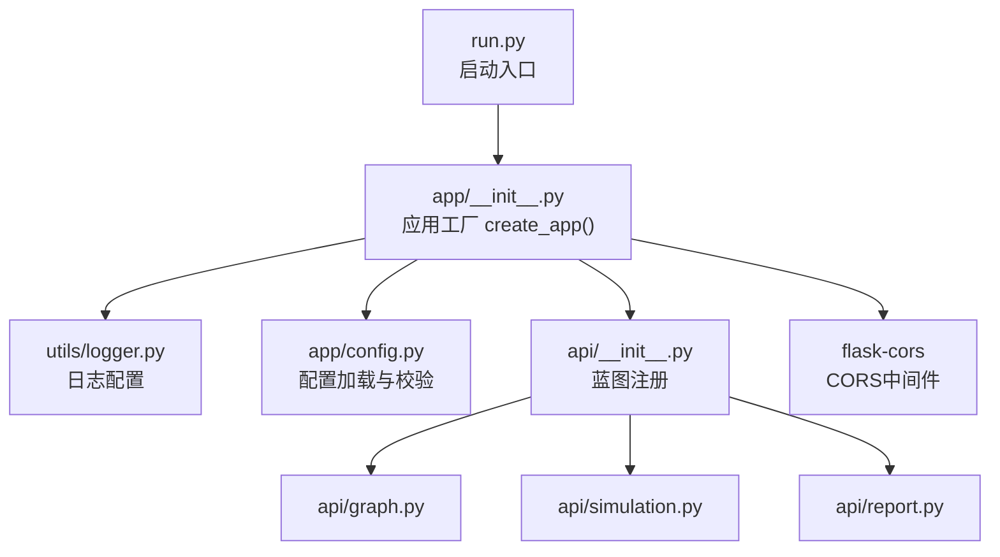
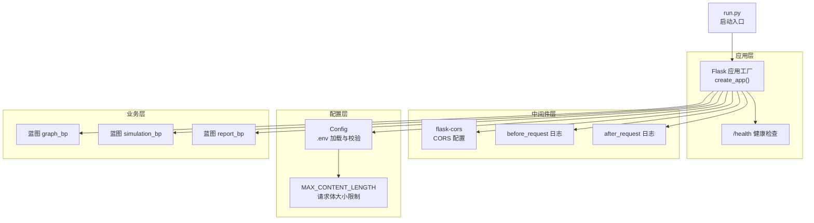
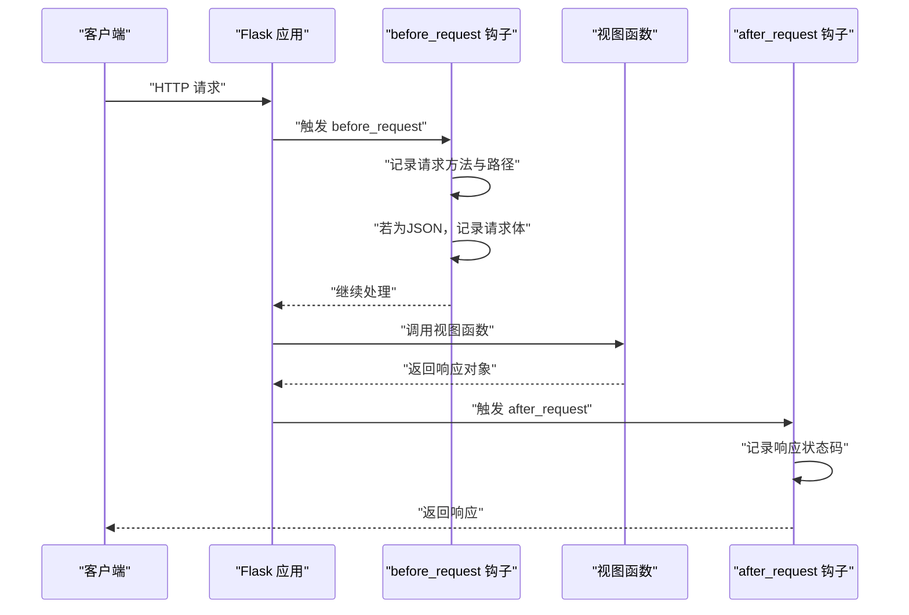
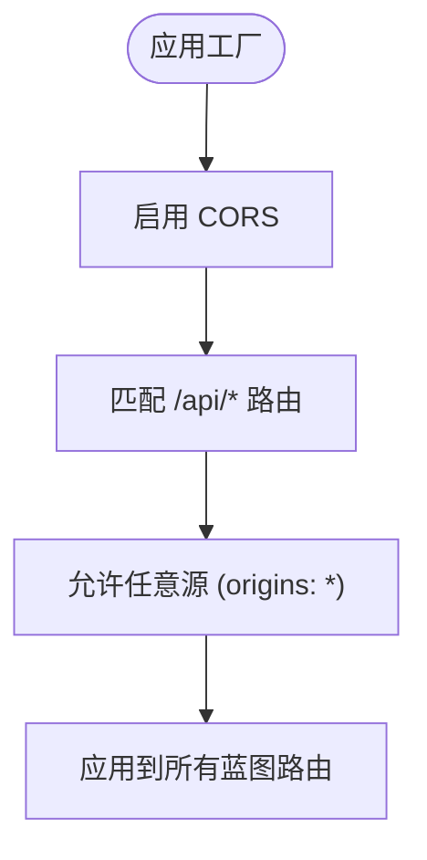
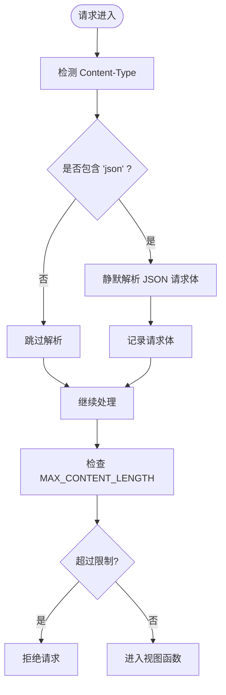
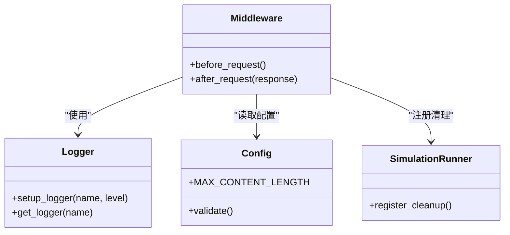
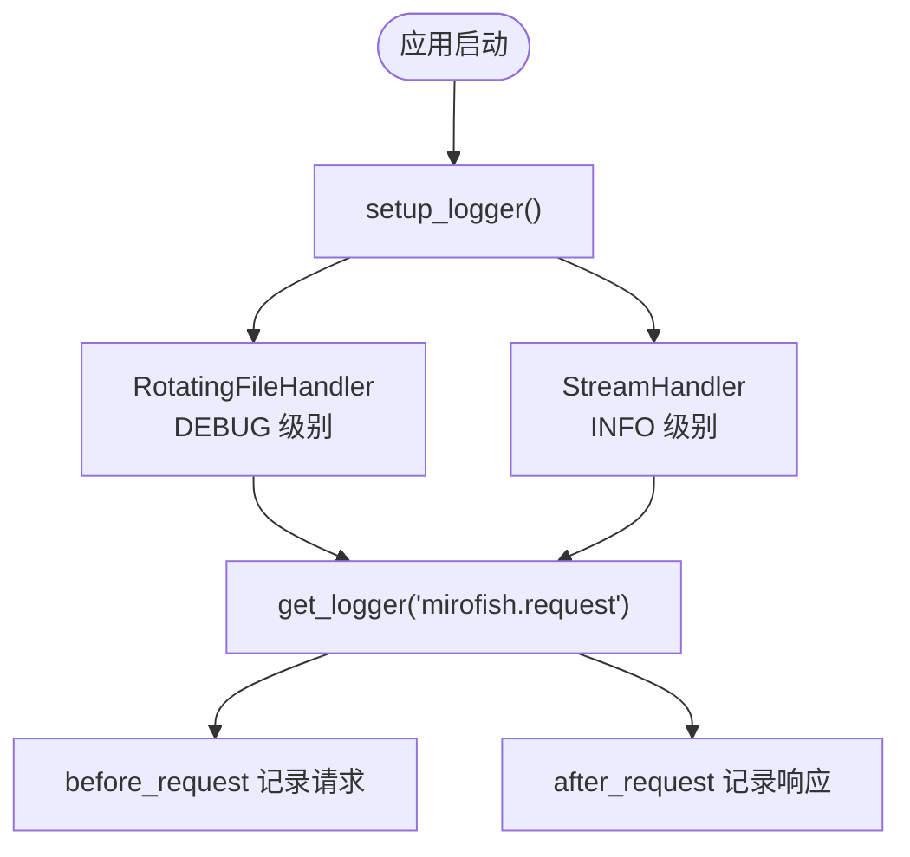
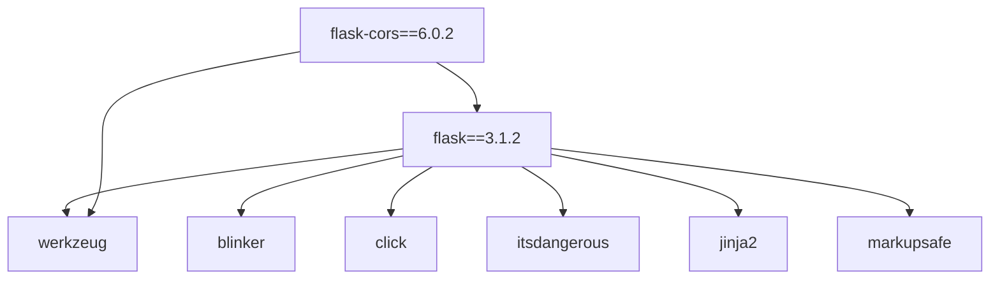

# 中间件配置

<cite>
**本文引用的文件**
- [backend/app/__init__.py](file://backend/app/__init__.py)
- [backend/app/config.py](file://backend/app/config.py)
- [backend/app/utils/logger.py](file://backend/app/utils/logger.py)
- [backend/app/api/__init__.py](file://backend/app/api/__init__.py)
- [backend/app/api/graph.py](file://backend/app/api/graph.py)
- [backend/app/api/simulation.py](file://backend/app/api/simulation.py)
- [backend/app/api/report.py](file://backend/app/api/report.py)
- [backend/run.py](file://backend/run.py)
- [backend/uuv.lock](file://backend/uv.lock)
- [.env.example](file://.env.example)
</cite>

## 目录
1. [简介](#简介)
2. [项目结构](#项目结构)
3. [核心组件](#核心组件)
4. [架构总览](#架构总览)
5. [详细组件分析](#详细组件分析)
6. [依赖关系分析](#依赖关系分析)
7. [性能考虑](#性能考虑)
8. [故障排查指南](#故障排查指南)
9. [结论](#结论)
10. [附录](#附录)

## 简介
本文件聚焦于MiroFish后端的Flask中间件配置与实现，系统性阐述以下内容：
- Flask中间件工作原理与在MiroFish中的落地：包括应用工厂、before_request与after_request钩子、CORS跨域策略。
- 请求与响应日志记录、JSON请求体解析的实现细节。
- 应用级中间件设计模式：全局异常处理、请求预处理、响应后处理。
- 性能优化建议：日志级别控制、请求体大小限制、超时处理。
- 自定义中间件开发指南与调试技巧。

## 项目结构
MiroFish后端采用Flask应用工厂模式，将中间件、日志、CORS、蓝图注册集中在应用工厂中，便于集中管理与扩展。

图表来源
- [backend/run.py](file://backend/run.py#L25-L45)
- [backend/app/__init__.py](file://backend/app/__init__.py#L19-L79)
- [backend/app/utils/logger.py](file://backend/app/utils/logger.py#L30-L88)
- [backend/app/config.py](file://backend/app/config.py#L66-L75)
- [backend/app/api/__init__.py](file://backend/app/api/__init__.py#L7-L13)

章节来源
- [backend/run.py](file://backend/run.py#L1-L50)
- [backend/app/__init__.py](file://backend/app/__init__.py#L1-L80)
- [backend/app/api/__init__.py](file://backend/app/api/__init__.py#L1-L15)

## 核心组件
- 应用工厂与中间件注册：在应用工厂中集中注册CORS、请求/响应日志中间件、蓝图与健康检查端点。
- 日志系统：统一的文件+控制台日志处理器，支持UTF-8输出与轮转。
- 配置系统：从根目录.env加载配置，并提供配置校验。
- 蓝图路由：将业务API按功能模块拆分为graph、simulation、report三个蓝图。

章节来源
- [backend/app/__init__.py](file://backend/app/__init__.py#L19-L79)
- [backend/app/utils/logger.py](file://backend/app/utils/logger.py#L30-L104)
- [backend/app/config.py](file://backend/app/config.py#L66-L75)
- [backend/app/api/__init__.py](file://backend/app/api/__init__.py#L7-L13)

## 架构总览
MiroFish后端以Flask应用工厂为核心，围绕其构建中间件层（CORS、日志）、配置层（环境变量与校验）、业务层（蓝图与API）。

图表来源
- [backend/run.py](file://backend/run.py#L25-L45)
- [backend/app/__init__.py](file://backend/app/__init__.py#L42-L74)
- [backend/app/config.py](file://backend/app/config.py#L38-L41)

## 详细组件分析

### Flask中间件与钩子函数
- before_request钩子：在每次请求进入视图函数前执行，记录请求方法与路径；当Content-Type为JSON时，记录请求体（静默解析，避免异常中断）。
- after_request钩子：在视图函数返回响应后执行，记录响应状态码并返回原始响应对象，保证后续处理链不受影响。
- 日志器：通过统一的get_logger获取名为“mirofish.request”的日志器，分别输出到文件与控制台，便于调试与生产监控。

图表来源
- [backend/app/__init__.py](file://backend/app/__init__.py#L51-L63)
- [backend/app/utils/logger.py](file://backend/app/utils/logger.py#L91-L104)

章节来源
- [backend/app/__init__.py](file://backend/app/__init__.py#L51-L63)
- [backend/app/utils/logger.py](file://backend/app/utils/logger.py#L30-L104)

### CORS跨域处理配置
- 全局启用CORS，对/api/*路径开放跨域访问，允许任意源（origins: "*"）。
- 该配置位于应用工厂中，确保所有蓝图下的API均受此策略约束。

图表来源
- [backend/app/__init__.py](file://backend/app/__init__.py#L42-L43)

章节来源
- [backend/app/__init__.py](file://backend/app/__init__.py#L42-L43)

### 请求体解析与JSON处理
- JSON请求体解析：在before_request中检测Content-Type是否包含“json”，若为JSON则通过静默解析获取请求体，避免因解析失败导致请求中断。
- 请求体大小限制：通过配置MAX_CONTENT_LENGTH限制上传请求体大小（默认50MB），超出将触发Flask的请求过大错误。
- 配置来源：Config类从.env加载并提供MAX_CONTENT_LENGTH与UPLOAD_FOLDER等配置。

图表来源
- [backend/app/__init__.py](file://backend/app/__init__.py#L56-L57)
- [backend/app/config.py](file://backend/app/config.py#L38-L41)

章节来源
- [backend/app/__init__.py](file://backend/app/__init__.py#L56-L57)
- [backend/app/config.py](file://backend/app/config.py#L38-L41)

### 应用级中间件设计模式
- 全局异常处理：各API模块在异常捕获时记录错误与堆栈信息，并返回标准化的错误响应，便于前端与运维定位问题。
- 请求预处理：before_request统一记录请求信息，为后续审计与排障提供依据。
- 响应后处理：after_request统一记录响应状态码，便于监控与指标采集。
- 资源清理：应用工厂注册模拟进程清理函数，确保服务关闭时释放资源。

图表来源
- [backend/app/__init__.py](file://backend/app/__init__.py#L51-L63)
- [backend/app/utils/logger.py](file://backend/app/utils/logger.py#L30-L104)
- [backend/app/config.py](file://backend/app/config.py#L66-L75)
- [backend/app/services/simulation_runner.py](file://backend/app/services/simulation_runner.py#L1298-L1323)

章节来源
- [backend/app/__init__.py](file://backend/app/__init__.py#L51-L63)
- [backend/app/utils/logger.py](file://backend/app/utils/logger.py#L30-L104)
- [backend/app/config.py](file://backend/app/config.py#L66-L75)
- [backend/app/services/simulation_runner.py](file://backend/app/services/simulation_runner.py#L1298-L1323)

### 日志系统与中间件集成
- 文件日志：按天轮转，最大10MB，保留5份备份，编码UTF-8，适合生产环境长期留存。
- 控制台日志：INFO及以上级别，简洁格式，便于快速观察运行状态。
- 中间件日志：统一使用“mirofish.request”日志器，记录请求与响应关键信息。

图表来源
- [backend/app/utils/logger.py](file://backend/app/utils/logger.py#L30-L88)
- [backend/app/__init__.py](file://backend/app/__init__.py#L51-L63)

章节来源
- [backend/app/utils/logger.py](file://backend/app/utils/logger.py#L30-L104)
- [backend/app/__init__.py](file://backend/app/__init__.py#L51-L63)

### 蓝图与路由组织
- 图谱API：graph_bp，提供项目管理、本体生成、文件上传等接口。
- 模拟API：simulation_bp，提供实体读取、模拟创建与管理等接口。
- 报告API：report_bp，提供报告生成、状态查询等接口。
- 统一前缀：蓝图注册时使用/api/graph、/api/simulation、/api/report作为URL前缀。

章节来源
- [backend/app/api/__init__.py](file://backend/app/api/__init__.py#L7-L13)
- [backend/app/api/graph.py](file://backend/app/api/graph.py#L1-L200)
- [backend/app/api/simulation.py](file://backend/app/api/simulation.py#L1-L200)
- [backend/app/api/report.py](file://backend/app/api/report.py#L1-L200)

## 依赖关系分析
- Flask版本：3.1.2，依赖Werkzeug等核心组件。
- flask-cors版本：6.0.2，提供CORS支持。
- 中间件依赖：CORS、日志、蓝图、配置等模块在应用工厂中集中装配。

图表来源
- [backend/uv.lock](file://backend/uv.lock#L557-L582)

章节来源
- [backend/uv.lock](file://backend/uv.lock#L557-L582)

## 性能考虑
- 日志级别控制
  - 生产环境建议将中间件日志级别提升至INFO，减少DEBUG级别的高频写入开销。
  - 对于高并发场景，可考虑将请求体日志仅在DEBUG级别开启，或按请求ID采样记录。
- 请求体大小限制
  - 当前MAX_CONTENT_LENGTH为50MB，可根据业务场景调整，避免内存压力与慢查询风险。
- 超时处理
  - 建议在网关或反向代理层设置连接与请求超时，避免长时间占用线程。
- 并发与线程
  - run.py中使用threaded=True，注意避免阻塞型I/O；对于长耗时任务建议异步化或后台线程化。

章节来源
- [backend/app/config.py](file://backend/app/config.py#L38-L41)
- [backend/run.py](file://backend/run.py#L42-L45)

## 故障排查指南
- CORS相关问题
  - 若浏览器提示跨域失败，确认/api/*路径是否正确匹配，以及CORS配置是否生效。
- 请求体解析失败
  - 检查Content-Type是否为application/json；若为multipart/form-data，before_request不会解析请求体。
- 请求过大
  - 当请求体超过MAX_CONTENT_LENGTH时，Flask会抛出异常；可在API层捕获并返回明确的错误信息。
- 日志输出异常
  - 确认日志目录存在且具备写权限；Windows环境下确保控制台编码为UTF-8。
- 配置缺失
  - 运行前通过Config.validate()检查必要配置（如LLM_API_KEY、ZEP_API_KEY），缺失时提前报错并退出。

章节来源
- [backend/app/__init__.py](file://backend/app/__init__.py#L42-L43)
- [backend/app/config.py](file://backend/app/config.py#L66-L75)
- [backend/run.py](file://backend/run.py#L27-L34)

## 结论
MiroFish后端通过应用工厂集中管理中间件与配置，实现了清晰的职责分离与良好的可扩展性。CORS、日志与请求/响应钩子构成应用级中间件的核心能力，配合蓝图与配置系统，满足了多模块API的统一治理需求。建议在生产环境中根据流量与资源情况优化日志级别、请求体大小与超时策略，并持续完善异常处理与监控体系。

## 附录
- 环境变量示例：参考.env.example，配置LLM与ZEP相关密钥。
- 启动流程：run.py负责配置校验与应用启动，随后由应用工厂注册中间件与蓝图。

章节来源
- [.env.example](file://.env.example#L1-L16)
- [backend/run.py](file://backend/run.py#L25-L45)