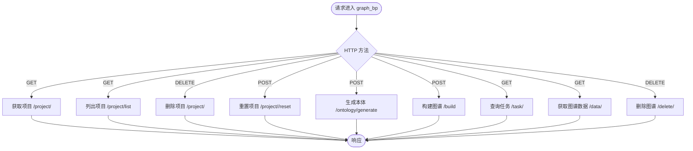

# 后端架构

<cite>
**本文引用的文件**
- [run.py](file://backend/run.py)
- [app/__init__.py](file://backend/app/__init__.py)
- [app/config.py](file://backend/app/config.py)
- [app/api/__init__.py](file://backend/app/api/__init__.py)
- [app/api/graph.py](file://backend/app/api/graph.py)
- [app/api/simulation.py](file://backend/app/api/simulation.py)
- [app/api/report.py](file://backend/app/api/report.py)
- [app/utils/logger.py](file://backend/app/utils/logger.py)
- [app/models/project.py](file://backend/app/models/project.py)
- [app/models/task.py](file://backend/app/models/task.py)
- [app/services/__init__.py](file://backend/app/services/__init__.py)
- [app/services/graph_builder.py](file://backend/app/services/graph_builder.py)
- [app/services/simulation_manager.py](file://backend/app/services/simulation_manager.py)
- [app/services/simulation_runner.py](file://backend/app/services/simulation_runner.py)
- [pyproject.toml](file://backend/pyproject.toml)
</cite>

## 目录
1. [简介](#简介)
2. [项目结构](#项目结构)
3. [核心组件](#核心组件)
4. [架构总览](#架构总览)
5. [详细组件分析](#详细组件分析)
6. [依赖分析](#依赖分析)
7. [性能考虑](#性能考虑)
8. [故障排查指南](#故障排查指南)
9. [结论](#结论)
10. [附录](#附录)

## 简介
本文件系统性梳理 MiroFish 后端的架构设计与实现要点，重点覆盖以下方面：
- Flask 应用工厂模式与配置管理
- 蓝图（Blueprint）组织结构与路由设计
- 中间件与基础设施（CORS、请求日志、健康检查）
- 服务层架构与职责分离、依赖注入思路
- 启动流程、配置加载、错误处理与可观测性
- 性能优化建议与安全配置最佳实践

## 项目结构
后端采用“应用工厂 + 蓝图 + 服务层 + 模型 + 工具”的分层组织方式，核心入口通过工厂函数创建应用实例，蓝图负责 API 路由划分，服务层封装业务逻辑，模型层负责状态持久化，工具层提供日志、文件解析、LLM 客户端等通用能力。

图表来源
- [run.py](file://backend/run.py#L25-L46)
- [app/__init__.py](file://backend/app/__init__.py#L19-L79)
- [app/api/__init__.py](file://backend/app/api/__init__.py#L7-L13)
- [app/api/graph.py](file://backend/app/api/graph.py#L35-L618)
- [app/api/simulation.py](file://backend/app/api/simulation.py#L47-L800)
- [app/api/report.py](file://backend/app/api/report.py#L24-L800)
- [app/utils/logger.py](file://backend/app/utils/logger.py#L30-L104)
- [app/services/graph_builder.py](file://backend/app/services/graph_builder.py#L38-L200)
- [app/services/simulation_manager.py](file://backend/app/services/simulation_manager.py#L114-L200)
- [app/services/simulation_runner.py](file://backend/app/services/simulation_runner.py#L195-L800)
- [app/models/project.py](file://backend/app/models/project.py#L101-L306)
- [app/models/task.py](file://backend/app/models/task.py#L54-L185)

章节来源
- [run.py](file://backend/run.py#L25-L46)
- [app/__init__.py](file://backend/app/__init__.py#L19-L79)
- [app/api/__init__.py](file://backend/app/api/__init__.py#L7-L13)

## 核心组件
- 应用工厂与配置
  - 工厂函数负责创建 Flask 应用、加载配置、设置 JSON 编码、注册蓝图、启用 CORS、注册请求/响应日志中间件、注册健康检查端点、注册模拟进程清理钩子。
  - 配置类集中管理密钥、LLM、Zep、文件上传、文本处理、OASIS 模拟、Report Agent 等参数，并提供校验方法。
- 蓝图与路由
  - graph_bp：项目管理、本体生成、图谱构建、任务查询、图谱数据查询与删除。
  - simulation_bp：实体读取、模拟创建与准备、准备进度查询、模拟状态查询、运行状态查询、运行控制等。
  - report_bp：报告生成、进度查询、报告获取、下载、删除、对话、章节分发、状态检查、Agent 日志等。
- 服务层
  - 图谱构建服务：封装 Zep API 调用，支持异步构建、进度上报。
  - 模拟管理器：负责实体读取、Agent Profile 生成、配置生成、准备状态管理、运行状态管理。
  - 模拟运行器：后台运行 OASIS 模拟，解析动作日志，提供实时状态、跨平台终止。
- 模型层
  - 项目模型：项目上下文持久化，状态机驱动。
  - 任务模型：线程安全的任务状态管理，支持进度、结果、错误、元数据。
- 工具层
  - 日志：统一日志配置，控制台与文件双通道，UTF-8 输出保障。
  - 文件解析、LLM 客户端、重试策略等。

章节来源
- [app/__init__.py](file://backend/app/__init__.py#L19-L79)
- [app/config.py](file://backend/app/config.py#L20-L76)
- [app/api/graph.py](file://backend/app/api/graph.py#L35-L618)
- [app/api/simulation.py](file://backend/app/api/simulation.py#L47-L800)
- [app/api/report.py](file://backend/app/api/report.py#L24-L800)
- [app/services/graph_builder.py](file://backend/app/services/graph_builder.py#L38-L200)
- [app/services/simulation_manager.py](file://backend/app/services/simulation_manager.py#L114-L200)
- [app/services/simulation_runner.py](file://backend/app/services/simulation_runner.py#L195-L800)
- [app/models/project.py](file://backend/app/models/project.py#L101-L306)
- [app/models/task.py](file://backend/app/models/task.py#L54-L185)
- [app/utils/logger.py](file://backend/app/utils/logger.py#L30-L104)

## 架构总览
后端采用“工厂函数 + 蓝图 + 服务层 + 模型层”的清晰分层，配合中间件与基础设施，形成可扩展、可观测、可维护的后端架构。

图表来源
- [app/__init__.py](file://backend/app/__init__.py#L19-L79)
- [app/api/__init__.py](file://backend/app/api/__init__.py#L66-L69)
- [app/services/graph_builder.py](file://backend/app/services/graph_builder.py#L38-L200)
- [app/services/simulation_manager.py](file://backend/app/services/simulation_manager.py#L114-L200)
- [app/services/simulation_runner.py](file://backend/app/services/simulation_runner.py#L195-L800)
- [app/models/project.py](file://backend/app/models/project.py#L101-L306)
- [app/models/task.py](file://backend/app/models/task.py#L54-L185)

## 详细组件分析

### 应用工厂与配置管理
- 工厂函数职责
  - 从配置类加载配置；设置 JSON 编码（中文直显）；初始化日志；注册 CORS；注册请求/响应日志中间件；注册蓝图；注册健康检查端点；注册模拟进程清理钩子。
  - 通过环境变量控制主机、端口与调试模式；仅在非调试或 reloader 子进程打印启动信息，避免重复输出。
- 配置类职责
  - 统一从项目根目录 .env 加载配置；提供 LLM、Zep、文件上传、文本处理、OASIS 模拟、Report Agent 等参数；提供 validate 方法进行关键参数校验。
- 启动流程
  - run.py 中先校验配置，再创建应用，最后启动服务（线程模式）。

图表来源
- [run.py](file://backend/run.py#L25-L46)
- [app/__init__.py](file://backend/app/__init__.py#L19-L79)
- [app/config.py](file://backend/app/config.py#L66-L76)

章节来源
- [run.py](file://backend/run.py#L25-L46)
- [app/__init__.py](file://backend/app/__init__.py#L19-L79)
- [app/config.py](file://backend/app/config.py#L20-L76)

### 蓝图与路由组织
- graph_bp
  - 项目管理：创建、查询、删除、重置。
  - 本体生成：上传文件、提取文本、调用 LLM 生成本体、持久化项目状态。
  - 图谱构建：分块、调用 Zep API、异步任务、进度上报、状态更新。
  - 任务查询：查询任务状态与列表。
  - 图谱数据：获取图谱数据、删除图谱。
- simulation_bp
  - 实体读取：按类型过滤、获取实体详情、按类型查询。
  - 模拟准备：实体数量预估、Agent Profile 生成、配置生成、准备状态查询。
  - 模拟运行：创建模拟、准备状态检查、运行状态查询、运行控制。
- report_bp
  - 报告生成：异步任务、进度查询、报告获取、下载、删除。
  - 对话：与 Report Agent 对话，支持检索工具。
  - 章节：分章节输出、实时获取已生成章节。
  - 状态检查：报告完成状态检查，解锁 Interview 功能。
  - 日志：Agent 执行日志实时获取。

图表来源
- [app/api/graph.py](file://backend/app/api/graph.py#L35-L618)

章节来源
- [app/api/graph.py](file://backend/app/api/graph.py#L35-L618)
- [app/api/simulation.py](file://backend/app/api/simulation.py#L47-L800)
- [app/api/report.py](file://backend/app/api/report.py#L24-L800)

### 中间件与基础设施
- CORS 跨域
  - 对 /api/* 路由启用跨域，允许任意来源访问。
- 请求/响应日志
  - before_request 记录请求方法与路径，若为 JSON 则记录请求体。
  - after_request 记录响应状态码。
- 健康检查
  - /health 返回服务状态。
- 日志
  - 控制台与文件双通道，UTF-8 编码保障，避免 Windows 控制台乱码。
- 模拟进程清理
  - 应用启动时注册清理函数，确保服务器关闭时终止所有模拟进程。

图表来源
- [app/__init__.py](file://backend/app/__init__.py#L51-L63)
- [app/utils/logger.py](file://backend/app/utils/logger.py#L30-L104)

章节来源
- [app/__init__.py](file://backend/app/__init__.py#L42-L74)
- [app/utils/logger.py](file://backend/app/utils/logger.py#L30-L104)

### 服务层架构与职责分离
- GraphBuilderService
  - 负责调用 Zep API 创建图谱、设置本体、分块文本、批量添加、等待处理完成、获取图谱数据。
  - 提供异步构建接口，内部使用任务管理器上报进度。
- SimulationManager
  - 负责实体读取与过滤、Agent Profile 生成、配置生成、准备状态管理、运行状态管理。
  - 管理模拟数据目录与状态文件，提供内存缓存与持久化。
- SimulationRunner
  - 后台运行 OASIS 模拟，解析 Twitter/Reddit 动作日志，提供实时状态、跨平台终止。
  - 支持图谱记忆更新器集成，将 Agent 活动动态写回 Zep 图谱。
- 依赖注入与解耦
  - 服务类通过构造函数注入配置与工具（如 Zep 客户端、任务管理器），便于测试与替换。
  - 蓝图仅负责路由与参数解析，业务逻辑集中在服务层。

图表来源
- [app/services/graph_builder.py](file://backend/app/services/graph_builder.py#L38-L200)
- [app/services/simulation_manager.py](file://backend/app/services/simulation_manager.py#L114-L200)
- [app/services/simulation_runner.py](file://backend/app/services/simulation_runner.py#L195-L800)
- [app/models/task.py](file://backend/app/models/task.py#L54-L185)

章节来源
- [app/services/graph_builder.py](file://backend/app/services/graph_builder.py#L38-L200)
- [app/services/simulation_manager.py](file://backend/app/services/simulation_manager.py#L114-L200)
- [app/services/simulation_runner.py](file://backend/app/services/simulation_runner.py#L195-L800)
- [app/models/task.py](file://backend/app/models/task.py#L54-L185)

### 项目与任务模型
- Project 模型
  - 项目上下文持久化，包含状态机（创建、本体生成、图谱构建中、完成、失败）、文件与文本、本体、图谱 ID、配置等。
  - 提供创建、保存、查询、列表、删除、文件保存与读取等方法。
- Task 模型
  - 线程安全的任务状态管理，支持进度、消息、结果、错误、元数据与详细进度。
  - 单例模式，全局共享任务状态，支持清理旧任务。

图表来源
- [app/models/project.py](file://backend/app/models/project.py#L26-L98)
- [app/models/project.py](file://backend/app/models/project.py#L101-L306)
- [app/models/task.py](file://backend/app/models/task.py#L22-L51)
- [app/models/task.py](file://backend/app/models/task.py#L54-L185)

章节来源
- [app/models/project.py](file://backend/app/models/project.py#L26-L306)
- [app/models/task.py](file://backend/app/models/task.py#L22-L185)

### 启动流程、配置加载与错误处理
- 启动流程
  - run.py 校验配置，创建应用，读取主机、端口、调试模式，启动服务。
- 配置加载
  - 优先从项目根目录 .env 加载，否则回退到环境变量；Config.validate 校验必要参数。
- 错误处理
  - 蓝图处理器捕获异常并返回统一结构；服务层通过任务管理器记录错误；日志中间件记录请求/响应；健康检查端点便于外部探活。

章节来源
- [run.py](file://backend/run.py#L25-L46)
- [app/config.py](file://backend/app/config.py#L66-L76)
- [app/__init__.py](file://backend/app/__init__.py#L51-L63)
- [app/api/graph.py](file://backend/app/api/graph.py#L249-L254)
- [app/api/simulation.py](file://backend/app/api/simulation.py#L628-L634)
- [app/api/report.py](file://backend/app/api/report.py#L189-L195)

## 依赖分析
- 第三方依赖
  - Flask、Flask-CORS、openai、zep-cloud、camel-oasis、camel-ai、PyMuPDF、charset-normalizer、chardet、python-dotenv、pydantic。
- 模块依赖
  - 蓝图依赖服务层；服务层依赖模型层与工具层；工厂函数依赖配置与日志；运行入口依赖工厂函数。

图表来源
- [pyproject.toml](file://backend/pyproject.toml#L11-L35)
- [app/__init__.py](file://backend/app/__init__.py#L19-L79)
- [app/api/__init__.py](file://backend/app/api/__init__.py#L7-L13)
- [app/services/__init__.py](file://backend/app/services/__init__.py#L1-L74)

章节来源
- [pyproject.toml](file://backend/pyproject.toml#L11-L35)
- [app/services/__init__.py](file://backend/app/services/__init__.py#L1-L74)

## 性能考虑
- 异步与后台任务
  - 图谱构建、模拟准备、报告生成均采用后台线程与任务管理器，避免阻塞请求。
- 进度上报与可观测性
  - 任务管理器提供进度、消息、详细进度与结果，前端可轮询状态。
- I/O 与缓存
  - 项目与模拟状态文件化存储，内存缓存减少磁盘访问；日志采用滚动文件，避免无限增长。
- 资源清理
  - 工厂注册模拟进程清理钩子，确保服务器关闭时终止所有子进程，释放资源。
- 并发与线程安全
  - 任务管理器使用锁保护状态更新，避免竞态。

## 故障排查指南
- 健康检查
  - 访问 /health 确认服务存活。
- 日志定位
  - 查看 logs 目录下的日志文件，结合请求/响应日志快速定位问题。
- 配置校验
  - 若出现 LLM 或 Zep 相关错误，检查 .env 中对应密钥是否正确配置。
- 任务状态
  - 通过任务查询接口查看任务进度与错误详情。
- 模拟运行
  - 使用运行状态查询接口确认模拟状态；若异常终止，检查模拟日志与错误信息。

章节来源
- [app/__init__.py](file://backend/app/__init__.py#L71-L74)
- [app/utils/logger.py](file://backend/app/utils/logger.py#L30-L104)
- [app/config.py](file://backend/app/config.py#L66-L76)
- [app/models/task.py](file://backend/app/models/task.py#L101-L185)
- [app/services/simulation_runner.py](file://backend/app/services/simulation_runner.py#L230-L310)

## 结论
MiroFish 后端以应用工厂为核心，通过蓝图清晰划分领域边界，服务层承担业务逻辑与外部集成，模型层提供状态持久化，工具层统一日志与通用能力。整体架构具备良好的可扩展性、可观测性与可维护性，适合在多平台社交媒体模拟场景下持续演进。

## 附录
- 安全配置最佳实践
  - 密钥管理：通过 .env 管理密钥，避免硬编码；生产环境使用环境变量注入。
  - CORS 策略：当前对 /api/* 允许任意来源，建议在生产环境限定来源。
  - 文件上传：严格校验文件类型与大小，限制上传目录权限。
  - 日志敏感信息：避免在日志中输出敏感字段，必要时脱敏处理。
- 性能优化建议
  - 批量处理：图谱构建与模拟准备尽量使用批处理与并发策略。
  - 缓存：对频繁读取的状态与配置进行缓存，降低磁盘 IO。
  - 资源池：对外部服务（LLM、Zep）连接池化，复用连接。
  - 监控与告警：结合任务进度与日志建立监控指标，及时发现异常。