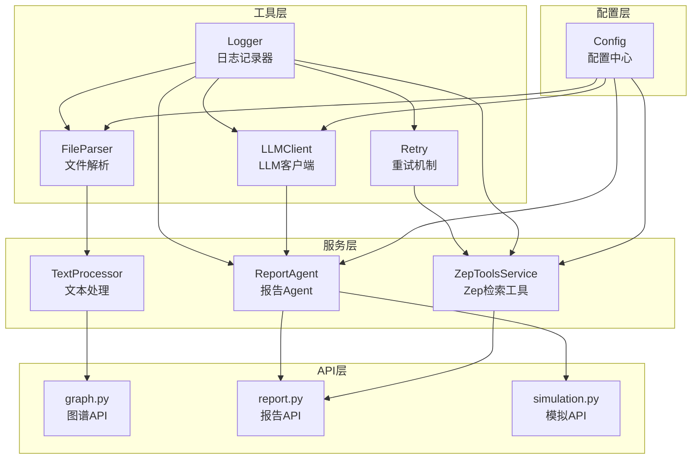
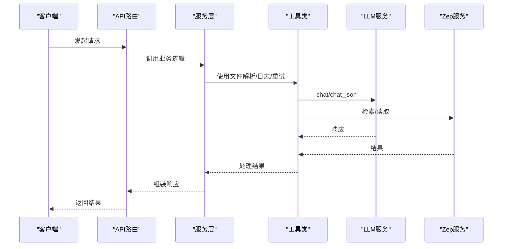
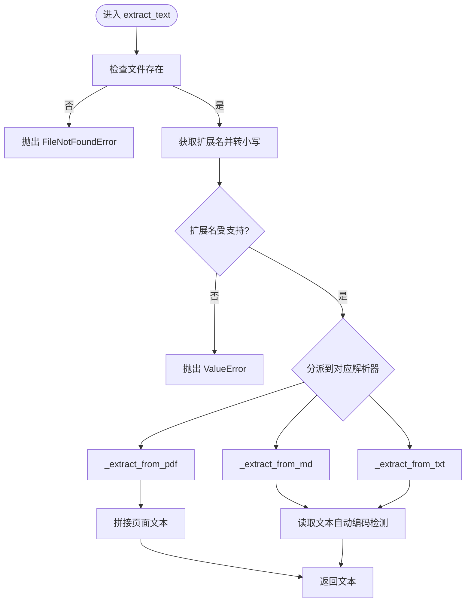
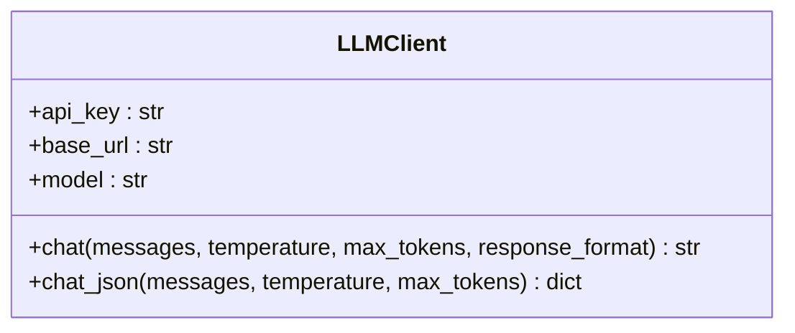
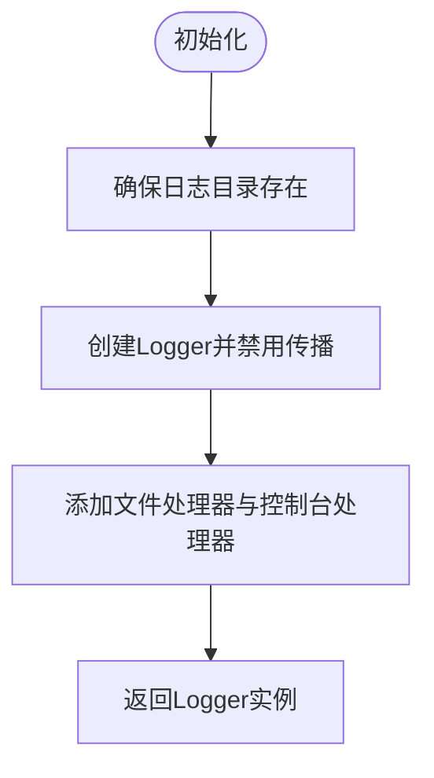
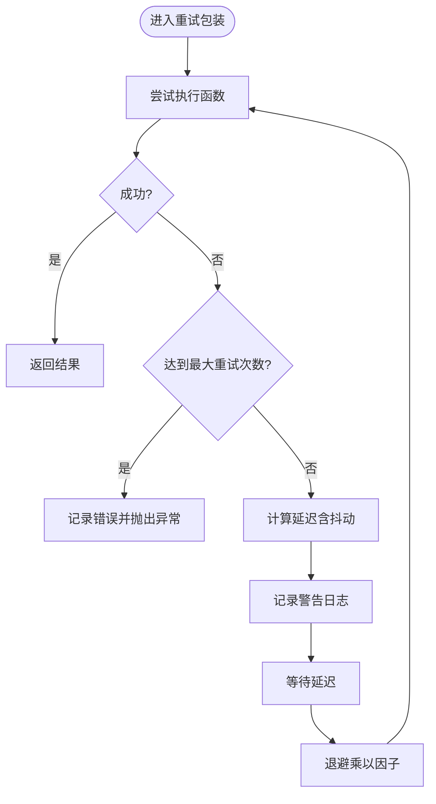
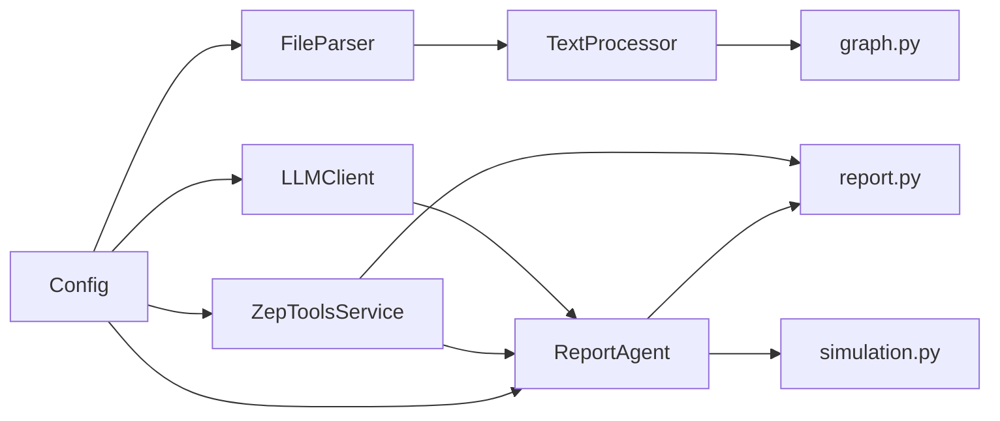

# 工具库

<cite>
**本文引用的文件**
- [file_parser.py](file://backend/app/utils/file_parser.py)
- [llm_client.py](file://backend/app/utils/llm_client.py)
- [logger.py](file://backend/app/utils/logger.py)
- [retry.py](file://backend/app/utils/retry.py)
- [config.py](file://backend/app/config.py)
- [text_processor.py](file://backend/app/services/text_processor.py)
- [zep_tools.py](file://backend/app/services/zep_tools.py)
- [report_agent.py](file://backend/app/services/report_agent.py)
- [graph.py](file://backend/app/api/graph.py)
- [report.py](file://backend/app/api/report.py)
- [simulation.py](file://backend/app/api/simulation.py)
- [run.py](file://backend/run.py)
- [pyproject.toml](file://backend/pyproject.toml)
</cite>

## 目录
1. [简介](#简介)
2. [项目结构](#项目结构)
3. [核心组件](#核心组件)
4. [架构总览](#架构总览)
5. [详细组件分析](#详细组件分析)
6. [依赖分析](#依赖分析)
7. [性能考虑](#性能考虑)
8. [故障排查指南](#故障排查指南)
9. [结论](#结论)
10. [附录](#附录)

## 简介
本文件系统性梳理 MiroFish 工具库的设计理念与复用策略，覆盖文件解析、LLM 客户端、日志记录器、重试机制四大核心工具，阐述其配置管理、错误处理与异常管理、扩展最佳实践、性能优化与使用注意事项，并给出在不同服务中的应用场景与集成方式。

## 项目结构
工具库位于后端子模块 backend/app/utils，围绕“配置中心”“工具类”“服务层”“API 层”的分层组织：
- 配置中心：集中于 config.py，统一从 .env 加载环境变量，提供默认值与校验
- 工具类：file_parser、llm_client、logger、retry
- 服务层：text_processor、zep_tools、report_agent 等，组合工具类完成业务能力
- API 层：graph、report、simulation 等路由，对外暴露能力并驱动服务层

图表来源
- [config.py](file://backend/app/config.py#L20-L76)
- [file_parser.py](file://backend/app/utils/file_parser.py#L61-L190)
- [llm_client.py](file://backend/app/utils/llm_client.py#L13-L92)
- [logger.py](file://backend/app/utils/logger.py#L30-L127)
- [retry.py](file://backend/app/utils/retry.py#L15-L239)
- [text_processor.py](file://backend/app/services/text_processor.py#L9-L72)
- [zep_tools.py](file://backend/app/services/zep_tools.py#L377-L800)
- [report_agent.py](file://backend/app/services/report_agent.py#L469-L800)
- [graph.py](file://backend/app/api/graph.py#L1-L618)
- [report.py](file://backend/app/api/report.py#L1-L800)
- [simulation.py](file://backend/app/api/simulation.py#L1-L800)

章节来源
- [config.py](file://backend/app/config.py#L1-L76)
- [pyproject.toml](file://backend/pyproject.toml#L1-L56)

## 核心组件
- 文件解析工具：支持 PDF、Markdown、TXT 的文本提取与编码自动检测；提供多文件合并与文本分块能力
- LLM 客户端：统一 OpenAI 格式调用，封装 chat 与 chat_json，内置默认模型与温度、token 上限等参数
- 日志记录器：统一输出到控制台与文件，自动处理 Windows 控制台编码问题，提供便捷方法
- 重试机制：装饰器与可重试客户端两类实现，支持指数退避、抖动、回调与批量重试

章节来源
- [file_parser.py](file://backend/app/utils/file_parser.py#L61-L190)
- [llm_client.py](file://backend/app/utils/llm_client.py#L13-L92)
- [logger.py](file://backend/app/utils/logger.py#L30-L127)
- [retry.py](file://backend/app/utils/retry.py#L15-L239)

## 架构总览
工具库通过配置中心集中管理密钥与默认参数，服务层组合工具类完成复杂业务流程，API 层负责对外暴露与调度。日志与重试贯穿各层，保证可观测性与鲁棒性。

图表来源
- [graph.py](file://backend/app/api/graph.py#L149-L254)
- [report.py](file://backend/app/api/report.py#L24-L195)
- [simulation.py](file://backend/app/api/simulation.py#L164-L236)
- [text_processor.py](file://backend/app/services/text_processor.py#L9-L72)
- [zep_tools.py](file://backend/app/services/zep_tools.py#L377-L800)
- [llm_client.py](file://backend/app/utils/llm_client.py#L13-L92)
- [retry.py](file://backend/app/utils/retry.py#L15-L239)

## 详细组件分析

### 文件解析工具（FileParser）
- 设计要点
  - 多级编码回退策略：UTF-8 → charset-normalizer → chardet → UTF-8 + replace
  - 支持 PDF（PyMuPDF）、Markdown、TXT 三类格式
  - 提供单文件提取、多文件合并、文本分块（按句边界与重叠）
- 关键接口
  - FileParser.extract_text：按扩展名分派解析
  - FileParser.extract_from_multiple：聚合多文件并标注来源
  - split_text_into_chunks：按 chunk_size 与 overlap 切分，尽量在句边界
- 错误处理
  - 文件不存在、不支持的扩展名、PDF 缺失依赖时抛出异常
  - 多文件合并时捕获异常并记录失败项
- 性能与使用建议
  - PDF 解析依赖 PyMuPDF，注意内存占用与页数
  - 文本分块建议结合下游 LLM 的 token 上限设置 chunk_size
  - 大量文件合并时建议异步或分批处理

图表来源
- [file_parser.py](file://backend/app/utils/file_parser.py#L61-L121)

章节来源
- [file_parser.py](file://backend/app/utils/file_parser.py#L61-L190)

### LLM 客户端（LLMClient）
- 设计要点
  - 统一 OpenAI 格式调用，支持 chat 与 chat_json
  - 参数优先级：构造函数参数 > Config 默认值
  - 默认模型、温度、最大 token 数可按需调整
- 关键接口
  - chat：发送消息，返回文本
  - chat_json：返回 JSON 对象（自动 JSON 解析）
- 配置与默认值
  - 从 Config 读取 LLM_API_KEY、LLM_BASE_URL、LLM_MODEL_NAME
  - 未配置 LLM_API_KEY 时抛出异常
- 使用建议
  - 在服务层延迟注入 LLMClient，便于替换与测试
  - chat_json 适用于需要结构化输出的场景

图表来源
- [llm_client.py](file://backend/app/utils/llm_client.py#L13-L92)
- [config.py](file://backend/app/config.py#L30-L34)

章节来源
- [llm_client.py](file://backend/app/utils/llm_client.py#L13-L92)
- [config.py](file://backend/app/config.py#L30-L34)

### 日志记录器（Logger）
- 设计要点
  - 同时输出到控制台与滚动文件，控制台简洁、文件详细
  - Windows 下自动修复 UTF-8 输出，避免中文乱码
  - 提供便捷方法（debug/info/warning/error/critical）
- 关键接口
  - setup_logger：创建并配置 Logger
  - get_logger：懒加载获取 Logger
  - 顶层 logger：默认实例
- 使用建议
  - 服务层与工具层均通过 get_logger 获取实例，避免重复配置
  - 控制台日志级别 INFO 及以上，文件日志 DEBUG 及以上

图表来源
- [logger.py](file://backend/app/utils/logger.py#L30-L88)

章节来源
- [logger.py](file://backend/app/utils/logger.py#L13-L127)

### 重试机制（Retry）
- 设计要点
  - 同步与异步两套装饰器：retry_with_backoff、retry_with_backoff_async
  - 可配置最大重试次数、初始延迟、最大延迟、退避因子、抖动
  - 可指定需要重试的异常类型，支持 on_retry 回调
  - RetryableAPIClient：面向函数调用与批量调用的封装
- 关键接口
  - retry_with_backoff：装饰器包装
  - retry_with_backoff_async：异步装饰器
  - RetryableAPIClient.call_with_retry：单次重试调用
  - RetryableAPIClient.call_batch_with_retry：批量单项重试
- 使用建议
  - 对外部 API（如 Zep、LLM）调用建议使用装饰器或 RetryableAPIClient
  - 批量处理建议开启 continue_on_failure，记录失败项以便后续补偿

图表来源
- [retry.py](file://backend/app/utils/retry.py#L15-L78)
- [retry.py](file://backend/app/utils/retry.py#L80-L130)
- [retry.py](file://backend/app/utils/retry.py#L132-L239)

章节来源
- [retry.py](file://backend/app/utils/retry.py#L15-L239)

### 配置管理（Config）
- 设计要点
  - 从项目根目录 .env 加载，支持生产环境直接使用环境变量
  - 统一管理 Flask、LLM、Zep、文件上传、文本处理、模拟等配置
  - 提供 validate 校验必要配置
- 关键字段
  - Flask：SECRET_KEY、DEBUG、JSON_AS_ASCII
  - LLM：LLM_API_KEY、LLM_BASE_URL、LLM_MODEL_NAME
  - Zep：ZEP_API_KEY
  - 文件上传：MAX_CONTENT_LENGTH、UPLOAD_FOLDER、ALLOWED_EXTENSIONS
  - 文本处理：DEFAULT_CHUNK_SIZE、DEFAULT_CHUNK_OVERLAP
  - 模拟：OASIS_* 相关配置
- 使用建议
  - 服务层与工具层通过 Config 读取配置，避免硬编码
  - 启动前调用 Config.validate 校验关键配置

章节来源
- [config.py](file://backend/app/config.py#L1-L76)
- [run.py](file://backend/run.py#L25-L45)

### 在服务中的应用与集成
- 文本处理服务（TextProcessor）
  - 组合 FileParser 与 split_text_into_chunks，提供预处理、分块、统计
- Zep 检索工具（ZepToolsService）
  - 封装 Zep Cloud API，提供搜索、节点/边读取、实体筛选、时间信息处理
  - 内置重试与降级（本地关键词匹配）
- Report Agent（ReportAgent）
  - 采用 ReAct 模式，规划、生成、反思三阶段
  - 内置工具：insight_forge、panorama_search、quick_search、interview_agents
  - 使用 LLMClient 与 ZepToolsService，配合日志与重试保障稳定性

章节来源
- [text_processor.py](file://backend/app/services/text_processor.py#L9-L72)
- [zep_tools.py](file://backend/app/services/zep_tools.py#L377-L800)
- [report_agent.py](file://backend/app/services/report_agent.py#L469-L800)

## 依赖分析
- 工具类依赖
  - FileParser 依赖 PyMuPDF、charset-normalizer、chardet
  - LLMClient 依赖 openai 与 Config
  - Logger 依赖 logging、RotatingFileHandler
  - Retry 依赖 functools、logging、time、random
- 服务层依赖
  - TextProcessor 依赖 FileParser
  - ZepToolsService 依赖 Config、LLMClient、zep-cloud
  - ReportAgent 依赖 LLMClient、ZepToolsService、Config
- API 层依赖
  - graph.py：FileParser、TextProcessor、Config
  - report.py：ReportAgent、ReportManager、Config
  - simulation.py：ZepEntityReader、Oasis 相关服务、Config

图表来源
- [file_parser.py](file://backend/app/utils/file_parser.py#L61-L190)
- [llm_client.py](file://backend/app/utils/llm_client.py#L13-L92)
- [logger.py](file://backend/app/utils/logger.py#L30-L127)
- [retry.py](file://backend/app/utils/retry.py#L15-L239)
- [text_processor.py](file://backend/app/services/text_processor.py#L9-L72)
- [zep_tools.py](file://backend/app/services/zep_tools.py#L377-L800)
- [report_agent.py](file://backend/app/services/report_agent.py#L469-L800)
- [graph.py](file://backend/app/api/graph.py#L1-L618)
- [report.py](file://backend/app/api/report.py#L1-L800)
- [simulation.py](file://backend/app/api/simulation.py#L1-L800)
- [config.py](file://backend/app/config.py#L1-L76)

章节来源
- [pyproject.toml](file://backend/pyproject.toml#L11-L35)

## 性能考虑
- 文件解析
  - PDF 解析建议分页或分批处理，避免一次性加载大文档
  - 文本分块建议结合下游模型 token 上限，合理设置 chunk_size 与 overlap
- LLM 调用
  - 使用 chat_json 时注意 JSON 结构复杂度，避免过长嵌套
  - 适当降低 temperature 与 max_tokens 以提升稳定性
- 日志
  - 控制台与文件双通道输出，生产环境建议降低文件日志级别
- 重试
  - 合理设置初始延迟与退避因子，避免雪崩效应
  - 批量重试开启 continue_on_failure，减少整体阻塞

## 故障排查指南
- 配置错误
  - 启动前调用 Config.validate，检查 LLM_API_KEY、ZEP_API_KEY 等
- 文件解析失败
  - 检查扩展名是否受支持、文件是否存在、编码是否可识别
  - PDF 缺少 PyMuPDF 依赖时会抛出 ImportError
- LLM 调用失败
  - 确认 API Key 与 Base URL 正确，必要时切换至备用服务
- Zep 检索失败
  - 检查 API Key 与网络连通性，关注降级逻辑（本地关键词匹配）
- 日志乱码
  - Windows 下确认 stdout/stderr 已正确 reconfigure 为 UTF-8

章节来源
- [run.py](file://backend/run.py#L25-L45)
- [file_parser.py](file://backend/app/utils/file_parser.py#L96-L121)
- [llm_client.py](file://backend/app/utils/llm_client.py#L22-L32)
- [logger.py](file://backend/app/utils/logger.py#L13-L24)
- [zep_tools.py](file://backend/app/services/zep_tools.py#L418-L439)

## 结论
MiroFish 工具库以“配置中心 + 工具类 + 服务层 + API 层”的清晰分层，实现了文件解析、LLM 客户端、日志与重试的高内聚低耦合设计。通过统一配置、完善的错误处理与重试机制、以及在服务层的组合使用，工具库在不同服务中具备良好的复用性与可扩展性。建议在新功能开发中遵循现有接口设计与日志/重试规范，确保一致性与可维护性。

## 附录
- 扩展最佳实践
  - 接口设计：保持参数最小化与明确性，提供默认值与校验
  - 单元测试：针对异常分支与边界条件编写测试，覆盖重试与降级路径
  - 文档编写：为公共接口提供清晰的参数说明与使用示例
- 性能优化建议
  - I/O 密集场景优先使用异步装饰器与批量重试
  - 缓存热点数据（如配置、常用查询结果），减少重复调用
  - 合理拆分任务，避免长时间阻塞主线程