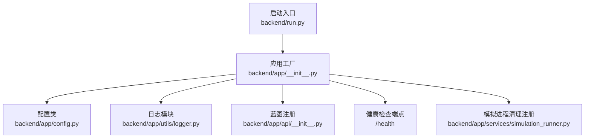
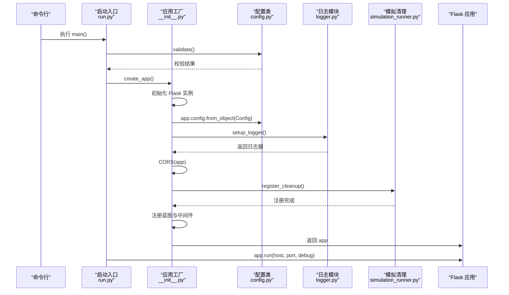
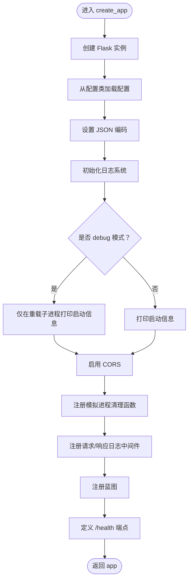
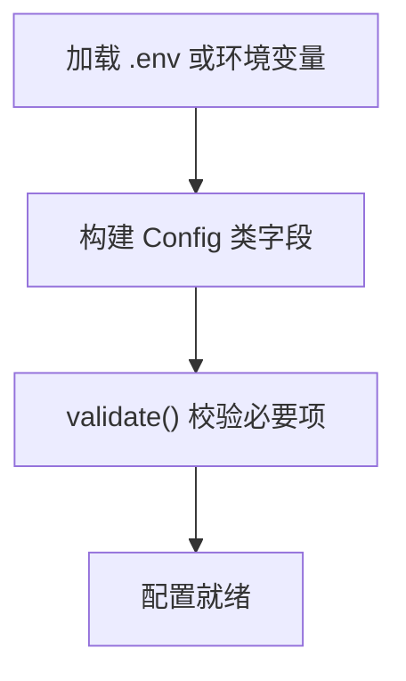
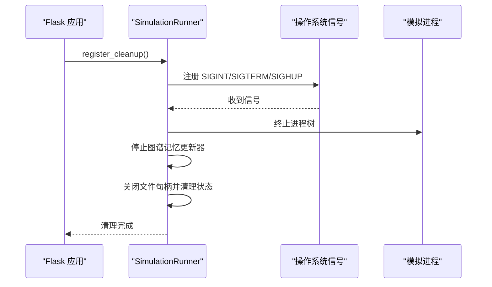
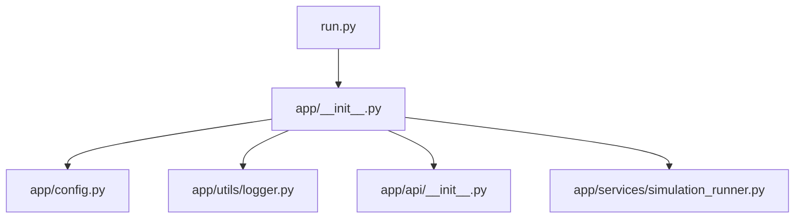

# 应用工厂模式

<cite>
**本文引用的文件**
- [backend/run.py](file://backend/run.py)
- [backend/app/__init__.py](file://backend/app/__init__.py)
- [backend/app/config.py](file://backend/app/config.py)
- [backend/app/utils/logger.py](file://backend/app/utils/logger.py)
- [backend/app/api/__init__.py](file://backend/app/api/__init__.py)
- [backend/app/services/simulation_runner.py](file://backend/app/services/simulation_runner.py)
- [.env.example](file://.env.example)
</cite>

## 目录
1. [简介](#简介)
2. [项目结构](#项目结构)
3. [核心组件](#核心组件)
4. [架构总览](#架构总览)
5. [详细组件分析](#详细组件分析)
6. [依赖关系分析](#依赖关系分析)
7. [性能考量](#性能考量)
8. [故障排查指南](#故障排查指南)
9. [结论](#结论)
10. [附录](#附录)

## 简介
本文件围绕 MiroFish 的 Flask 应用工厂模式展开，系统性阐述 create_app 工厂函数的实现原理与配置加载机制，涵盖配置类设计、环境变量处理、调试模式控制、JSON 编码设置、CORS 跨域配置、请求日志中间件、启动流程中的关键步骤（日志系统初始化、模拟进程清理函数注册、健康检查端点）、以及在多环境部署中的最佳实践。文档同时提供可视化图表帮助理解代码结构与数据流。

## 项目结构
MiroFish 后端采用“应用工厂 + 蓝图 + 服务层”的分层组织方式：
- 启动入口负责加载配置并创建应用实例
- 应用工厂集中初始化 Flask 实例、配置、中间件、蓝图与健康检查端点
- 配置类统一从 .env 或环境变量加载参数
- 日志模块提供统一的文件与控制台输出
- 服务层负责复杂业务逻辑（如模拟进程管理）

**图表来源**
- [backend/run.py](file://backend/run.py#L25-L45)
- [backend/app/__init__.py](file://backend/app/__init__.py#L19-L79)
- [backend/app/config.py](file://backend/app/config.py#L9-L17)
- [backend/app/utils/logger.py](file://backend/app/utils/logger.py#L30-L88)
- [backend/app/api/__init__.py](file://backend/app/api/__init__.py#L7-L13)
- [backend/app/services/simulation_runner.py](file://backend/app/services/simulation_runner.py#L1282-L1353)

**章节来源**
- [backend/run.py](file://backend/run.py#L1-L51)
- [backend/app/__init__.py](file://backend/app/__init__.py#L1-L81)
- [backend/app/config.py](file://backend/app/config.py#L1-L76)
- [backend/app/utils/logger.py](file://backend/app/utils/logger.py#L1-L127)
- [backend/app/api/__init__.py](file://backend/app/api/__init__.py#L1-L15)
- [backend/app/services/simulation_runner.py](file://backend/app/services/simulation_runner.py#L1282-L1353)

## 核心组件
- 应用工厂函数 create_app：集中初始化 Flask 实例、配置、CORS、日志、中间件、蓝图与健康检查端点
- 配置类 Config：统一从 .env 或环境变量加载配置，提供校验方法
- 日志模块：统一输出到文件与控制台，支持 UTF-8 编码与滚动日志
- 模拟进程清理：在应用生命周期内注册清理钩子，确保服务器关闭时终止所有模拟进程
- 蓝图与路由：将 graph、simulation、report 三大功能模块化注册

**章节来源**
- [backend/app/__init__.py](file://backend/app/__init__.py#L19-L79)
- [backend/app/config.py](file://backend/app/config.py#L20-L76)
- [backend/app/utils/logger.py](file://backend/app/utils/logger.py#L30-L104)
- [backend/app/services/simulation_runner.py](file://backend/app/services/simulation_runner.py#L1282-L1353)
- [backend/app/api/__init__.py](file://backend/app/api/__init__.py#L7-L13)

## 架构总览
应用工厂模式将 Flask 应用的创建与配置解耦，便于在不同环境中复用同一套初始化逻辑。启动流程如下：

**图表来源**
- [backend/run.py](file://backend/run.py#L25-L45)
- [backend/app/__init__.py](file://backend/app/__init__.py#L19-L79)
- [backend/app/config.py](file://backend/app/config.py#L66-L75)
- [backend/app/utils/logger.py](file://backend/app/utils/logger.py#L30-L88)
- [backend/app/services/simulation_runner.py](file://backend/app/services/simulation_runner.py#L1282-L1353)

## 详细组件分析

### 应用工厂函数 create_app
- 初始化 Flask 实例并从配置类加载配置
- 设置 JSON 编码（兼容 Flask 2.3+ 与旧版本）
- 初始化日志系统，区分开发与重载子进程场景
- 启用 CORS，限定 /api/* 路由允许跨域
- 注册模拟进程清理函数，确保服务器关闭时清理所有模拟进程
- 注册请求/响应日志中间件
- 注册蓝图（graph、simulation、report）
- 定义健康检查端点 /health

**图表来源**
- [backend/app/__init__.py](file://backend/app/__init__.py#L19-L79)

**章节来源**
- [backend/app/__init__.py](file://backend/app/__init__.py#L19-L79)

### 配置管理与环境变量处理
- 从项目根目录 .env 加载配置，若不存在则回退到环境变量
- 提供统一的配置字段：密钥、调试模式、JSON 编码、LLM/Zep 配置、文件上传、文本处理、OASIS 模拟参数、报告代理参数
- 提供 validate 方法进行必要配置校验（如 LLM_API_KEY、ZEP_API_KEY）

**图表来源**
- [backend/app/config.py](file://backend/app/config.py#L9-L17)
- [backend/app/config.py](file://backend/app/config.py#L20-L76)

**章节来源**
- [backend/app/config.py](file://backend/app/config.py#L1-L76)
- [.env.example](file://.env.example#L1-L16)

### CORS 跨域配置
- 对 /api/* 路由启用 CORS，允许任意源访问
- 该策略适用于前端与后端分离部署场景

**章节来源**
- [backend/app/__init__.py](file://backend/app/__init__.py#L42-L43)

### 请求日志中间件
- before_request 记录请求方法与路径，若为 JSON 则记录请求体
- after_request 记录响应状态码
- 日志器命名空间为 mirofish.request，便于区分

**章节来源**
- [backend/app/__init__.py](file://backend/app/__init__.py#L51-L63)

### 日志系统初始化
- 统一输出到文件与控制台，文件按天滚动，控制台简洁输出
- Windows 下确保 UTF-8 编码，避免中文乱码
- 支持按需获取日志器，避免重复添加处理器

**章节来源**
- [backend/app/utils/logger.py](file://backend/app/utils/logger.py#L30-L104)

### 模拟进程清理函数注册
- 在应用启动时注册清理钩子，确保服务器关闭时终止所有模拟进程
- 支持跨平台信号处理（SIGINT、SIGTERM、SIGHUP），并在主线程注册
- 注册条件：非 debug 模式或 debug 模式下的重载子进程
- 清理内容：终止进程树、停止图谱记忆更新器、关闭文件句柄、更新运行状态文件

**图表来源**
- [backend/app/services/simulation_runner.py](file://backend/app/services/simulation_runner.py#L1282-L1353)
- [backend/app/services/simulation_runner.py](file://backend/app/services/simulation_runner.py#L1200-L1281)

**章节来源**
- [backend/app/services/simulation_runner.py](file://backend/app/services/simulation_runner.py#L1282-L1353)
- [backend/app/services/simulation_runner.py](file://backend/app/services/simulation_runner.py#L1200-L1281)

### 健康检查端点
- 定义 /health 端点，返回服务状态
- 便于容器编排与负载均衡探测

**章节来源**
- [backend/app/__init__.py](file://backend/app/__init__.py#L71-L74)

### 蓝图与路由
- graph_bp、simulation_bp、report_bp 三个蓝图分别挂载到 /api/graph、/api/simulation、/api/report
- 路由模块通过 __init__.py 导入具体视图

**章节来源**
- [backend/app/api/__init__.py](file://backend/app/api/__init__.py#L7-L13)

## 依赖关系分析
- 启动入口依赖应用工厂与配置类
- 应用工厂依赖配置类、日志模块、蓝图与模拟清理服务
- 模拟清理服务依赖信号处理与进程管理

**图表来源**
- [backend/run.py](file://backend/run.py#L21-L22)
- [backend/app/__init__.py](file://backend/app/__init__.py#L15-L16)
- [backend/app/api/__init__.py](file://backend/app/api/__init__.py#L7-L13)
- [backend/app/services/simulation_runner.py](file://backend/app/services/simulation_runner.py#L1282-L1353)

**章节来源**
- [backend/run.py](file://backend/run.py#L21-L22)
- [backend/app/__init__.py](file://backend/app/__init__.py#L15-L16)
- [backend/app/api/__init__.py](file://backend/app/api/__init__.py#L7-L13)
- [backend/app/services/simulation_runner.py](file://backend/app/services/simulation_runner.py#L1282-L1353)

## 性能考量
- JSON 编码设置避免 ASCII 转义，减少前端渲染与传输开销
- 请求日志中间件仅记录调试级别日志，避免生产环境过多 IO
- 模拟进程清理采用进程组终止，确保子进程完全回收
- 日志滚动与 UTF-8 输出降低 I/O 阻塞风险

[本节为通用建议，无需特定文件引用]

## 故障排查指南
- 配置校验失败：检查 .env 文件或环境变量，确认 LLM_API_KEY、ZEP_API_KEY 等必要项
- CORS 无效：确认请求路径匹配 /api/*
- 日志中文乱码：确认 Windows 环境下 UTF-8 输出已正确设置
- 模拟进程未清理：确认在重载子进程或非 debug 模式下注册了清理钩子
- 健康检查失败：检查 /health 端点是否可达

**章节来源**
- [backend/app/config.py](file://backend/app/config.py#L66-L75)
- [backend/app/__init__.py](file://backend/app/__init__.py#L42-L43)
- [backend/app/utils/logger.py](file://backend/app/utils/logger.py#L13-L23)
- [backend/app/services/simulation_runner.py](file://backend/app/services/simulation_runner.py#L1282-L1353)
- [backend/app/__init__.py](file://backend/app/__init__.py#L71-L74)

## 结论
MiroFish 的应用工厂模式通过集中初始化与配置加载，实现了高内聚、低耦合的应用结构。配合统一的日志、CORS、请求日志中间件与模拟进程清理机制，使得应用在开发与生产环境均具备良好的可维护性与稳定性。蓝图化路由与健康检查端点进一步提升了系统的可观测性与扩展性。

[本节为总结性内容，无需特定文件引用]

## 附录

### 配置类设计思路与最佳实践
- 设计思路
  - 统一从 .env 或环境变量加载，支持开发与生产环境无缝切换
  - 将 Flask 基础配置、业务配置（LLM、Zep、文件上传、文本处理、OASIS、报告代理）分类管理
  - 提供 validate 方法进行必要项校验，提前暴露配置问题
- 最佳实践
  - 开发环境使用 .env，生产环境使用环境变量注入
  - 为敏感配置（密钥）设置默认值或严格校验
  - 将与第三方服务相关的配置（LLM、Zep）集中管理，便于替换与扩展
  - 对于需要跨平台兼容的配置（如 JSON 编码），提供版本兼容处理

**章节来源**
- [backend/app/config.py](file://backend/app/config.py#L9-L17)
- [backend/app/config.py](file://backend/app/config.py#L20-L76)
- [.env.example](file://.env.example#L1-L16)

### 多环境部署示例
- 开发环境
  - 使用 .env 文件，开启 FLASK_DEBUG，便于热重载与调试
  - 配置 LLM 与 ZEP 的测试密钥
- 生产环境
  - 通过环境变量注入 .env 中的配置项
  - 关闭 FLASK_DEBUG，启用生产级日志与健康检查
  - 使用容器编排工具（如 Docker Compose）部署，利用 /health 端点进行探活

**章节来源**
- [backend/run.py](file://backend/run.py#L39-L45)
- [backend/app/__init__.py](file://backend/app/__init__.py#L24-L27)
- [backend/app/__init__.py](file://backend/app/__init__.py#L71-L74)