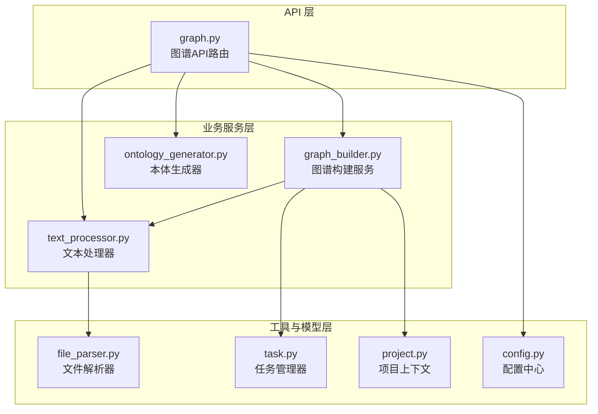
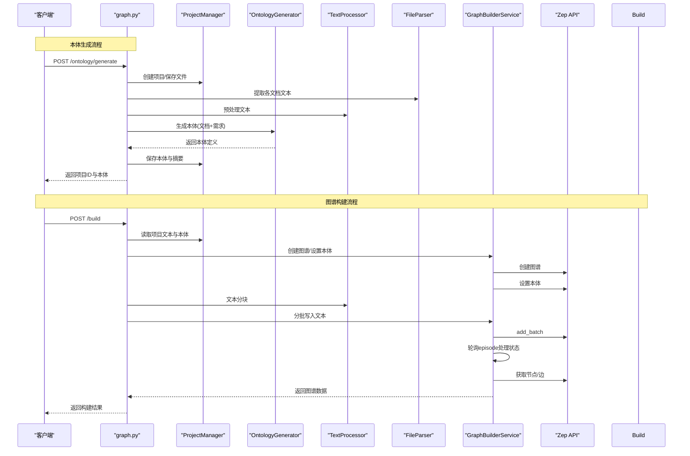
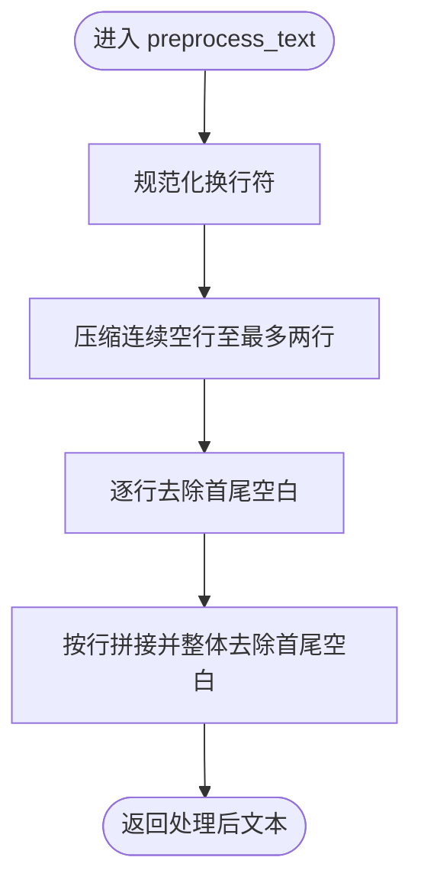
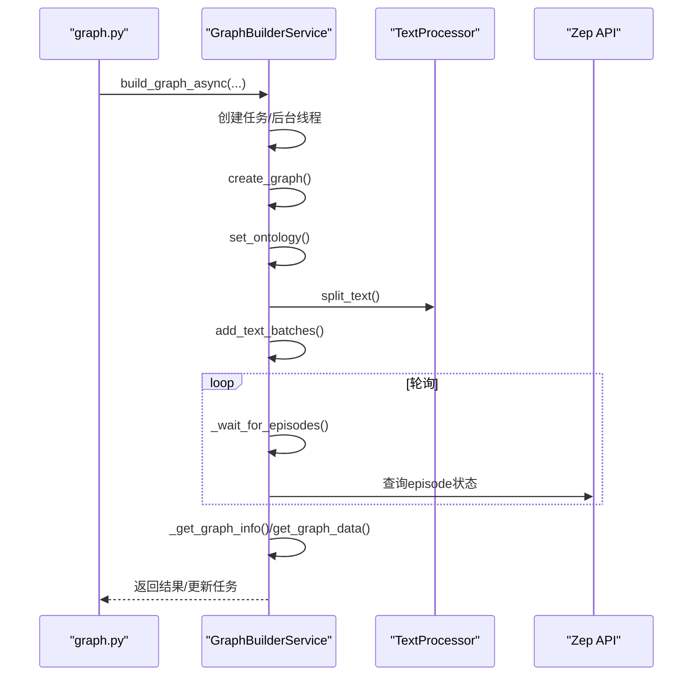
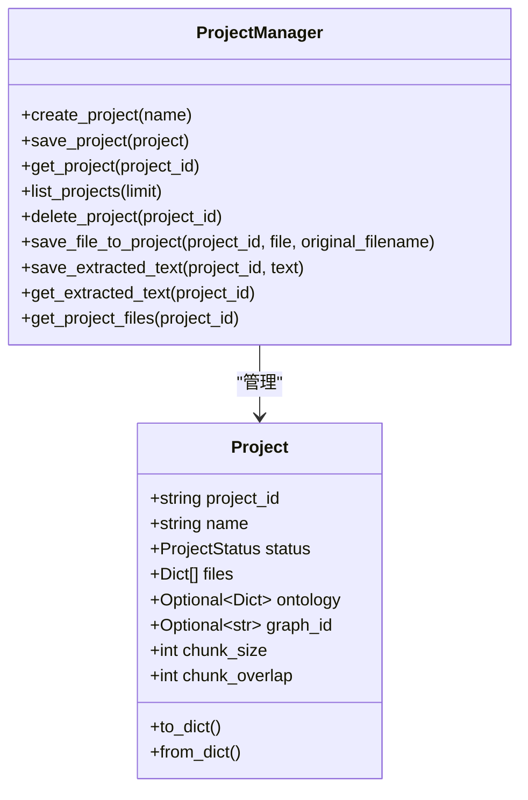
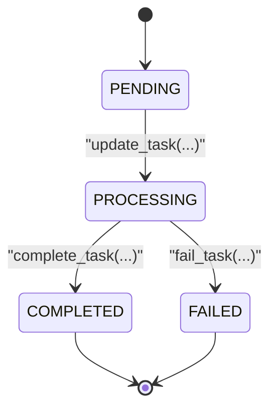
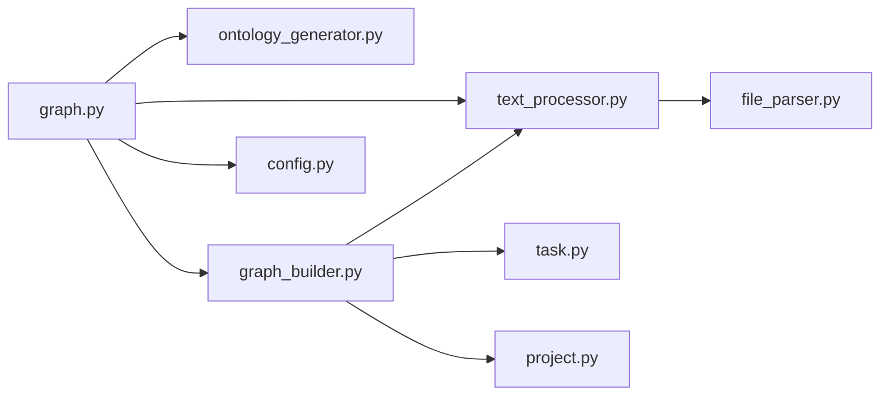

# 图谱构建服务

<cite>
**本文引用的文件**
- [backend/app/api/graph.py](file://backend/app/api/graph.py)
- [backend/app/services/text_processor.py](file://backend/app/services/text_processor.py)
- [backend/app/services/graph_builder.py](file://backend/app/services/graph_builder.py)
- [backend/app/models/project.py](file://backend/app/models/project.py)
- [backend/app/models/task.py](file://backend/app/models/task.py)
- [backend/app/utils/file_parser.py](file://backend/app/utils/file_parser.py)
- [backend/app/config.py](file://backend/app/config.py)
</cite>

## 目录
1. [简介](#简介)
2. [项目结构](#项目结构)
3. [核心组件](#核心组件)
4. [架构总览](#架构总览)
5. [详细组件分析](#详细组件分析)
6. [依赖分析](#依赖分析)
7. [性能考虑](#性能考虑)
8. [故障排查指南](#故障排查指南)
9. [结论](#结论)
10. [附录](#附录)

## 简介
本技术文档围绕 MiroFish 图谱构建服务展开，系统性阐述其核心职责与实现机制，覆盖以下关键流程：
- 本体生成：基于上传文档与模拟需求，由 LLM 生成实体类型、关系类型及属性定义。
- 文本处理：对多源文档进行提取、清洗与分块，形成适合下游处理的文本序列。
- 图谱构建：通过 Zep API 创建图谱、设置本体、分批写入文本块、轮询处理状态并汇总结果。

文档同时提供性能优化策略、质量评估方法与错误处理机制，帮助读者在不同规模场景下稳定、高效地运行图谱构建服务。

## 项目结构
后端采用“API 层 → 业务服务层 → 工具与模型层”的分层组织，核心模块如下：
- API 层：提供图谱相关接口，负责参数校验、状态流转与任务调度。
- 业务服务层：封装文本处理、图谱构建与本体生成的具体逻辑。
- 工具与模型层：文件解析、任务管理、项目上下文管理与配置。

图表来源
- [backend/app/api/graph.py](file://backend/app/api/graph.py#L1-L618)
- [backend/app/services/text_processor.py](file://backend/app/services/text_processor.py#L1-L72)
- [backend/app/services/graph_builder.py](file://backend/app/services/graph_builder.py#L1-L500)
- [backend/app/utils/file_parser.py](file://backend/app/utils/file_parser.py#L1-L190)
- [backend/app/models/task.py](file://backend/app/models/task.py#L1-L185)
- [backend/app/models/project.py](file://backend/app/models/project.py#L1-L306)
- [backend/app/config.py](file://backend/app/config.py#L1-L76)

章节来源
- [backend/app/api/graph.py](file://backend/app/api/graph.py#L1-L618)
- [backend/app/services/text_processor.py](file://backend/app/services/text_processor.py#L1-L72)
- [backend/app/services/graph_builder.py](file://backend/app/services/graph_builder.py#L1-L500)
- [backend/app/utils/file_parser.py](file://backend/app/utils/file_parser.py#L1-L190)
- [backend/app/models/task.py](file://backend/app/models/task.py#L1-L185)
- [backend/app/models/project.py](file://backend/app/models/project.py#L1-L306)
- [backend/app/config.py](file://backend/app/config.py#L1-L76)

## 核心组件
- 文本处理器（TextProcessor）
  - 职责：从多文件提取文本、按指定块大小与重叠进行分块、标准化换行与空白、统计文本基础指标。
  - 关键能力：分块算法、预处理规则、统计信息。
- 图谱构建服务（GraphBuilderService）
  - 职责：创建图谱、设置本体、分批写入文本、轮询处理状态、汇总图谱信息与数据。
  - 关键能力：异步构建、批处理、进度回调、状态等待、数据获取与删除。
- 项目上下文（ProjectManager）
  - 职责：持久化项目状态、文件与提取文本、本体与图谱信息。
  - 关键能力：项目生命周期管理、文件存储、文本存取。
- 任务管理（TaskManager）
  - 职责：线程安全的任务状态跟踪与更新。
  - 关键能力：任务创建、状态更新、完成/失败标记、列表与清理。
- 文件解析器（FileParser）
  - 职责：多格式文档文本提取与编码回退策略。
  - 关键能力：PDF/Markdown/TXT 解析、多级编码检测、多文件合并。
- 配置中心（Config）
  - 职责：集中管理 LLM/Zep/上传/默认分块等配置。
  - 关键能力：环境变量加载、默认值与校验。

章节来源
- [backend/app/services/text_processor.py](file://backend/app/services/text_processor.py#L9-L72)
- [backend/app/services/graph_builder.py](file://backend/app/services/graph_builder.py#L38-L500)
- [backend/app/models/project.py](file://backend/app/models/project.py#L26-L306)
- [backend/app/models/task.py](file://backend/app/models/task.py#L54-L185)
- [backend/app/utils/file_parser.py](file://backend/app/utils/file_parser.py#L61-L190)
- [backend/app/config.py](file://backend/app/config.py#L20-L76)

## 架构总览
整体流程分为两条主线：
- 本体生成主线：上传文件 → 文本提取与预处理 → LLM 生成本体 → 保存项目状态。
- 图谱构建主线：读取项目文本与本体 → 创建图谱 → 设置本体 → 分批写入文本 → 轮询处理 → 获取图谱数据。

图表来源
- [backend/app/api/graph.py](file://backend/app/api/graph.py#L121-L255)
- [backend/app/api/graph.py](file://backend/app/api/graph.py#L259-L525)
- [backend/app/services/graph_builder.py](file://backend/app/services/graph_builder.py#L52-L185)
- [backend/app/services/text_processor.py](file://backend/app/services/text_processor.py#L18-L34)
- [backend/app/utils/file_parser.py](file://backend/app/utils/file_parser.py#L124-L144)

## 详细组件分析

### 文本处理器（TextProcessor）
- 职责与流程
  - 多文件文本提取：聚合多个文档文本，便于后续统一处理。
  - 文本分块：按固定块大小与重叠进行切分，优先在句号/换行等自然边界处切分，保证语义完整性。
  - 预处理：规范化换行、压缩空行、去除行首行尾空白，提升后续解析质量。
  - 统计：提供字符数、行数、词数等基础统计，辅助质量评估与容量规划。
- 关键实现要点
  - 分块算法：在循环中逐步推进，遇到合适的句号/换行等边界则截断，避免在极短片段内切割。
  - 预处理规则：统一换行符、限制连续空行、逐行 strip 并整体 strip，兼顾可读性与一致性。
- 性能与稳定性
  - 对超长文本采用增量处理，避免一次性加载造成内存压力。
  - 分块大小与重叠参数可调，平衡吞吐与上下文连贯性。

图表来源
- [backend/app/services/text_processor.py](file://backend/app/services/text_processor.py#L37-L61)

章节来源
- [backend/app/services/text_processor.py](file://backend/app/services/text_processor.py#L9-L72)
- [backend/app/utils/file_parser.py](file://backend/app/utils/file_parser.py#L147-L189)

### 图谱构建服务（GraphBuilderService）
- 职责与流程
  - 异步构建：创建任务、后台线程执行，避免阻塞 API。
  - 图谱生命周期：创建图谱 → 设置本体 → 文本分块 → 分批写入 → 轮询处理 → 获取图谱信息。
  - 本体设置：动态构造实体/关系类型类，兼容 Zep API 的字段约束与保留名处理。
  - 数据获取：拉取节点/边、时间戳与属性，组装完整图谱数据。
- 关键实现要点
  - 本体设置：遍历本体定义，动态创建实体类与边类，处理属性描述与保留名转换，再调用 Zep API 设置。
  - 分批写入：按 batch_size 分批发送，记录每批 episode 的 uuid，便于后续轮询。
  - 轮询策略：定时查询每个 episode 的 processed 状态，设置超时阈值，避免无限等待。
  - 进度回调：将内部阶段映射到 0-100 的进度区间，便于前端展示。
- 错误处理
  - 任务失败捕获异常并记录堆栈，更新任务状态与错误信息。
  - 单个批次发送失败时抛出异常，上层可感知并重试或终止。

图表来源
- [backend/app/services/graph_builder.py](file://backend/app/services/graph_builder.py#L52-L185)
- [backend/app/services/graph_builder.py](file://backend/app/services/graph_builder.py#L287-L338)
- [backend/app/services/graph_builder.py](file://backend/app/services/graph_builder.py#L340-L394)
- [backend/app/services/graph_builder.py](file://backend/app/services/graph_builder.py#L396-L494)

章节来源
- [backend/app/services/graph_builder.py](file://backend/app/services/graph_builder.py#L38-L500)

### 项目上下文（ProjectManager）
- 职责与流程
  - 项目生命周期：创建 → 上传文件 → 提取文本 → 生成本体 → 构建图谱 → 记录结果。
  - 存储：项目元数据、文件目录、提取文本文件，均以项目 ID 为根目录隔离。
  - 状态机：支持多种状态（新建、本体已生成、构建中、完成、失败），配合 API 与前端交互。
- 关键实现要点
  - 目录结构：PROJECTS_DIR/proj_id/{project.json, files/, extracted_text.txt}。
  - 文件保存：生成安全文件名，避免路径冲突；记录原始名、保存名、路径与大小。
  - 文本存取：统一读写提取文本，便于后续构建使用。

图表来源
- [backend/app/models/project.py](file://backend/app/models/project.py#L26-L306)

章节来源
- [backend/app/models/project.py](file://backend/app/models/project.py#L101-L306)

### 任务管理（TaskManager）
- 职责与流程
  - 单例模式：全局唯一实例，线程安全。
  - 生命周期：创建 → 更新（状态/进度/消息/结果/错误）→ 完成/失败 → 清理。
  - 进度映射：将内部阶段映射到 0-100 的进度，支持详细进度字典。
- 关键实现要点
  - 锁保护：使用锁保护任务字典的并发访问。
  - 清理策略：按时间窗口清理已完成或失败的任务，释放资源。

图表来源
- [backend/app/models/task.py](file://backend/app/models/task.py#L14-L52)

章节来源
- [backend/app/models/task.py](file://backend/app/models/task.py#L54-L185)

### 文件解析器（FileParser）
- 职责与流程
  - 多格式支持：PDF（PyMuPDF）、Markdown、TXT。
  - 编码回退：UTF-8 → charset_normalizer → chardet → UTF-8 + replace。
  - 多文件合并：带标题的合并文本，便于后续统一处理。
- 关键实现要点
  - PDF 提取：逐页读取文本并拼接，过滤空页。
  - 文本提取：对 Markdown/TXT 使用回退策略，确保跨编码兼容。
  - 多文件聚合：为每个文件添加标题，便于溯源与问题定位。

章节来源
- [backend/app/utils/file_parser.py](file://backend/app/utils/file_parser.py#L61-L190)

### 配置中心（Config）
- 职责与流程
  - 环境变量加载：从项目根目录 .env 或系统环境加载。
  - 统一配置：LLM/Zep/上传/默认分块等参数集中管理。
  - 校验：提供必要配置项校验，便于快速发现缺失项。
- 关键实现要点
  - 默认值：提供合理的默认值，降低部署门槛。
  - 可观测性：JSON 不转 ASCII，中文可读性更好。

章节来源
- [backend/app/config.py](file://backend/app/config.py#L20-L76)

## 依赖分析
- 组件耦合
  - API 层依赖业务服务层与工具层，承担参数校验与状态协调。
  - 业务服务层内部协作紧密：TextProcessor 为 GraphBuilderService 提供分块与预处理能力；GraphBuilderService 依赖 TaskManager 与 ProjectManager 实现状态持久化与任务追踪。
  - 工具层与模型层相对独立，提供通用能力（文件解析、任务管理、项目上下文）。
- 外部依赖
  - Zep Cloud SDK：用于创建图谱、设置本体、写入文本与查询状态。
  - LLM：用于本体生成（具体实现位于业务服务层，API 层调用）。
- 潜在风险
  - API 层与业务层之间存在强耦合（例如进度映射），建议通过抽象接口进一步解耦。
  - 轮询策略依赖外部服务响应，需设置合理超时与重试策略。

图表来源
- [backend/app/api/graph.py](file://backend/app/api/graph.py#L1-L618)
- [backend/app/services/graph_builder.py](file://backend/app/services/graph_builder.py#L1-L500)
- [backend/app/services/text_processor.py](file://backend/app/services/text_processor.py#L1-L72)
- [backend/app/utils/file_parser.py](file://backend/app/utils/file_parser.py#L1-L190)
- [backend/app/models/task.py](file://backend/app/models/task.py#L1-L185)
- [backend/app/models/project.py](file://backend/app/models/project.py#L1-L306)
- [backend/app/config.py](file://backend/app/config.py#L1-L76)

章节来源
- [backend/app/api/graph.py](file://backend/app/api/graph.py#L1-L618)
- [backend/app/services/graph_builder.py](file://backend/app/services/graph_builder.py#L1-L500)
- [backend/app/services/text_processor.py](file://backend/app/services/text_processor.py#L1-L72)
- [backend/app/utils/file_parser.py](file://backend/app/utils/file_parser.py#L1-L190)
- [backend/app/models/task.py](file://backend/app/models/task.py#L1-L185)
- [backend/app/models/project.py](file://backend/app/models/project.py#L1-L306)
- [backend/app/config.py](file://backend/app/config.py#L1-L76)

## 性能考虑
- 批量处理
  - 分批写入：通过 batch_size 控制每次发送的文本块数量，减少单次请求负载，避免 Zep API 限流。
  - 进度映射：将各阶段进度按比例映射到 0-100，前端可平滑展示，提升用户体验。
- 内存管理
  - 文本分块：按 chunk_size 与重叠切分，避免一次性加载全部文本；预处理阶段仅做必要清洗，减少中间对象。
  - 文件存储：项目级目录隔离，避免跨项目污染；及时清理旧任务与临时文件。
- 并发控制
  - 异步构建：使用后台线程执行构建流程，API 立即返回任务 ID，提高吞吐。
  - 线程安全：TaskManager 采用锁保护任务字典，避免并发更新导致的数据竞争。
- 外部依赖优化
  - 轮询策略：设置合理超时与间隔（如每 3 秒检查一次），避免频繁请求；对单个查询异常进行容错处理。
  - 本体设置：动态类构造仅在设置本体时发生，避免重复开销。

## 故障排查指南
- 常见错误与定位
  - 配置缺失：ZEP_API_KEY/LLM_API_KEY 未配置，API 层会直接返回错误；可在配置校验中提前发现。
  - 文件格式不支持：上传文件扩展名不在允许列表，API 层拒绝请求并提示。
  - 本体生成失败：API 层捕获异常并返回堆栈信息，便于定位 LLM 调用或解析问题。
  - 图谱构建失败：GraphBuilderService 捕获异常并记录堆栈，任务状态标记为失败；可通过任务接口查询错误详情。
- 日志与监控
  - API 层与构建层分别记录日志，包含任务 ID、阶段信息与错误堆栈，便于排障。
  - 任务管理器提供任务列表与清理策略，避免历史任务占用资源。
- 修复建议
  - 对于 LLM/SDK 调用失败，建议增加重试与熔断策略，并记录重试次数与延迟。
  - 对于文件编码问题，确保使用文件解析器的回退策略；必要时提供手动编码选择。
  - 对于超时与限流，调整 batch_size 与轮询间隔，或在上游增加缓存与队列。

章节来源
- [backend/app/api/graph.py](file://backend/app/api/graph.py#L282-L525)
- [backend/app/services/graph_builder.py](file://backend/app/services/graph_builder.py#L181-L185)
- [backend/app/models/task.py](file://backend/app/models/task.py#L106-L163)

## 结论
MiroFish 图谱构建服务通过清晰的分层设计与完善的任务管理机制，实现了从文档到本体再到图谱的全链路自动化。文本处理器与文件解析器保障了输入质量，图谱构建服务通过异步与批处理提升了吞吐与稳定性。结合合理的性能优化与错误处理策略，可在不同规模场景下可靠运行。建议后续在接口抽象、重试与熔断、以及本体生成的可解释性方面持续增强。

## 附录
- 术语
  - 本体：定义实体类型、关系类型及其属性与约束。
  - 文本块：按固定长度与重叠切分的文本片段，用于分批处理。
  - Episode：Zep 中用于表示单条文本输入的单元，支持状态查询。
- 参考接口
  - 本体生成：POST /ontology/generate
  - 图谱构建：POST /build
  - 任务查询：GET /task/{task_id}
  - 图谱数据：GET /data/{graph_id}
  - 图谱删除：DELETE /delete/{graph_id}