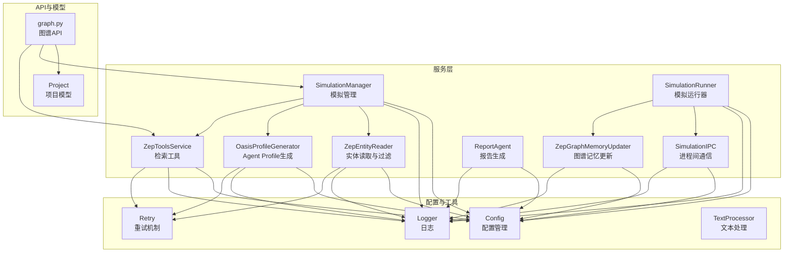
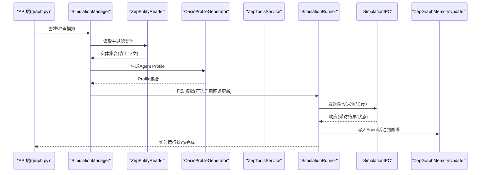
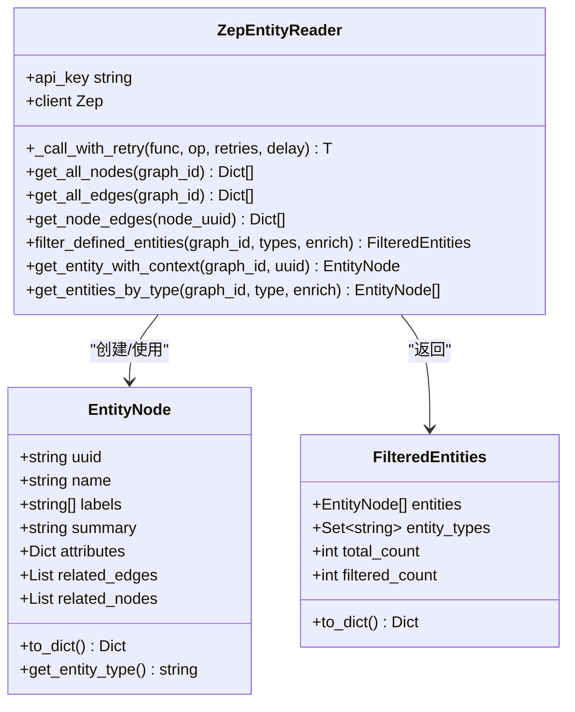
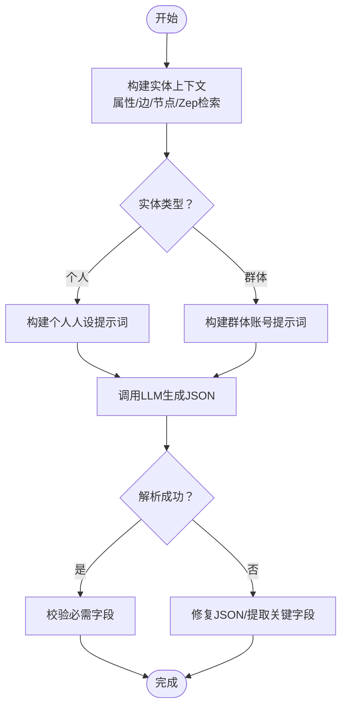
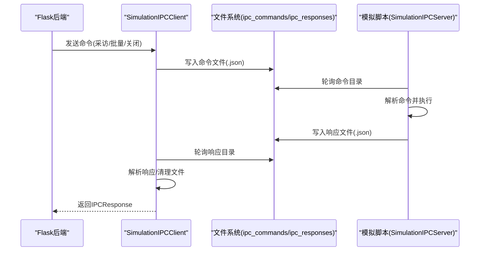
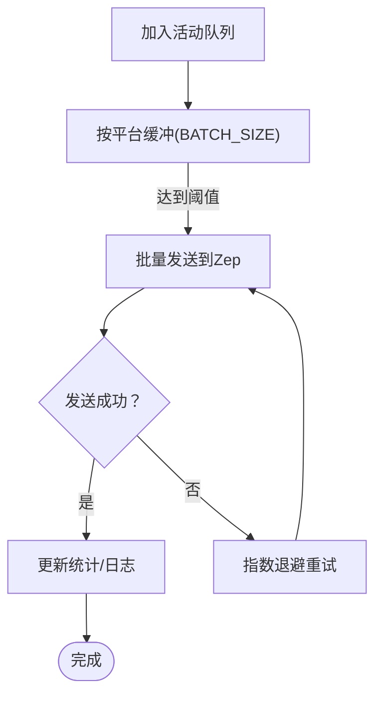
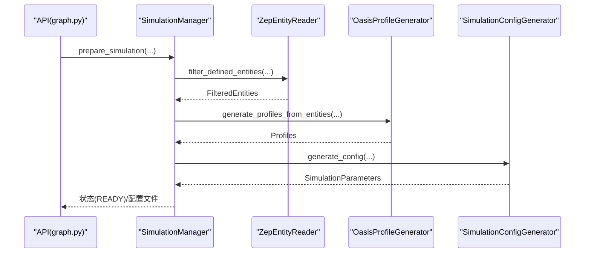
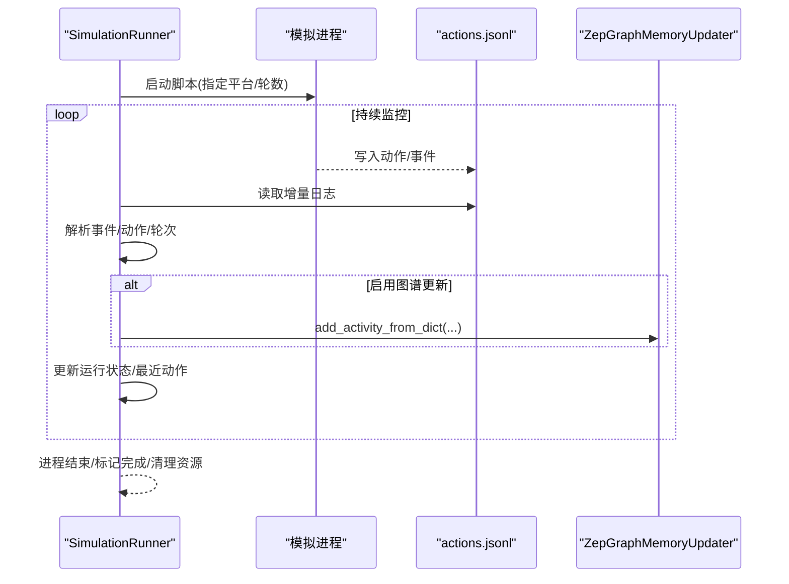
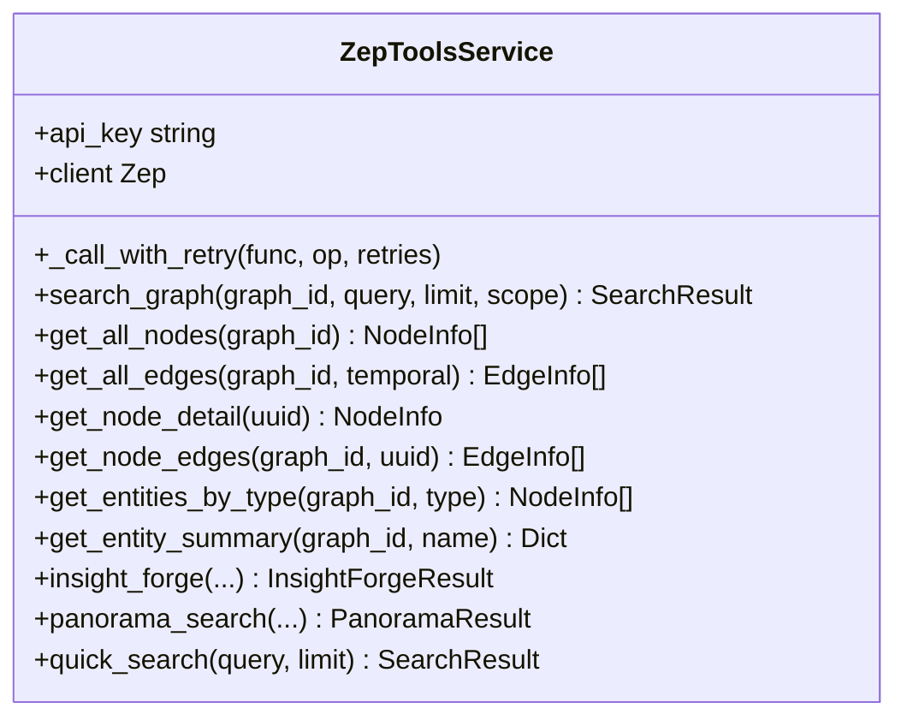
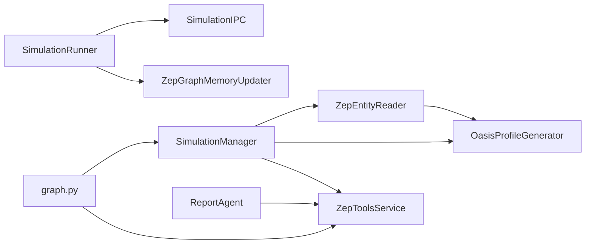

# 实体记忆服务

<cite>
**本文档引用的文件**
- [zep_entity_reader.py](file://backend/app/services/zep_entity_reader.py)
- [oasis_profile_generator.py](file://backend/app/services/oasis_profile_generator.py)
- [simulation_ipc.py](file://backend/app/services/simulation_ipc.py)
- [zep_graph_memory_updater.py](file://backend/app/services/zep_graph_memory_updater.py)
- [simulation_manager.py](file://backend/app/services/simulation_manager.py)
- [simulation_runner.py](file://backend/app/services/simulation_runner.py)
- [config.py](file://backend/app/config.py)
- [logger.py](file://backend/app/utils/logger.py)
- [retry.py](file://backend/app/utils/retry.py)
- [text_processor.py](file://backend/app/services/text_processor.py)
- [zep_tools.py](file://backend/app/services/zep_tools.py)
- [report_agent.py](file://backend/app/services/report_agent.py)
- [graph.py](file://backend/app/api/graph.py)
- [project.py](file://backend/app/models/project.py)
</cite>

## 目录
1. [简介](#简介)
2. [项目结构](#项目结构)
3. [核心组件](#核心组件)
4. [架构总览](#架构总览)
5. [详细组件分析](#详细组件分析)
6. [依赖关系分析](#依赖关系分析)
7. [性能考虑](#性能考虑)
8. [故障排查指南](#故障排查指南)
9. [结论](#结论)
10. [附录](#附录)

## 简介
本技术文档聚焦于MiroFish实体记忆服务，系统性阐述实体读取、Agent Profile生成、进程间通信与图谱记忆更新的完整数据处理机制。重点包括：
- ZepEntityReader的实体解析能力：节点提取、关系分析、属性映射与上下文丰富
- OasisProfileGenerator的Agent配置生成：行为模式、社交网络、历史背景
- SimulationIPC的通信协议实现：命令传输、响应处理、状态同步
- 实体数据存储优化策略：索引建立、缓存机制、查询优化
- 实体一致性保证与数据完整性验证方法

## 项目结构
后端采用分层架构，核心服务集中在backend/app/services目录，配合配置、日志、重试与工具模块，形成完整的实体记忆与模拟支撑体系。

**图表来源**
- [zep_entity_reader.py](file://backend/app/services/zep_entity_reader.py#L70-L445)
- [oasis_profile_generator.py](file://backend/app/services/oasis_profile_generator.py#L142-L800)
- [simulation_ipc.py](file://backend/app/services/simulation_ipc.py#L95-L395)
- [zep_graph_memory_updater.py](file://backend/app/services/zep_graph_memory_updater.py#L201-L549)
- [simulation_manager.py](file://backend/app/services/simulation_manager.py#L114-L529)
- [simulation_runner.py](file://backend/app/services/simulation_runner.py#L195-L800)
- [zep_tools.py](file://backend/app/services/zep_tools.py#L377-L800)
- [report_agent.py](file://backend/app/services/report_agent.py#L469-L800)
- [config.py](file://backend/app/config.py#L20-L76)
- [logger.py](file://backend/app/utils/logger.py#L13-L127)
- [retry.py](file://backend/app/utils/retry.py#L15-L239)
- [text_processor.py](file://backend/app/services/text_processor.py#L9-L72)
- [graph.py](file://backend/app/api/graph.py#L1-L618)
- [project.py](file://backend/app/models/project.py#L17-L306)

**章节来源**
- [config.py](file://backend/app/config.py#L20-L76)
- [logger.py](file://backend/app/utils/logger.py#L13-L127)
- [retry.py](file://backend/app/utils/retry.py#L15-L239)
- [text_processor.py](file://backend/app/services/text_processor.py#L9-L72)
- [graph.py](file://backend/app/api/graph.py#L1-L618)
- [project.py](file://backend/app/models/project.py#L17-L306)

## 核心组件
- 实体读取与过滤：ZepEntityReader负责从Zep图谱读取节点、边，筛选预定义实体类型，并构建上下文（相关边与节点）
- Agent Profile生成：OasisProfileGenerator将实体转换为OASIS平台所需的Agent Profile，支持基于LLM的详细人设与基于规则的基础人设
- 进程间通信：SimulationIPC提供Flask后端与模拟脚本之间的命令/响应模式，支持单个Agent采访、批量采访与环境关闭
- 图谱记忆更新：ZepGraphMemoryUpdater将模拟中Agent活动动态更新到Zep图谱，支持按平台分组批量发送与重试
- 模拟管理与运行：SimulationManager负责实体读取、Profile生成、配置参数生成与脚本准备；SimulationRunner负责后台运行、日志解析与状态监控
- 检索工具：ZepToolsService提供深度洞察、广度搜索、快速检索等工具，支持报告生成与采访功能
- 配置与日志：Config集中管理API密钥与平台配置；Logger提供统一日志输出；Retry提供重试机制

**章节来源**
- [zep_entity_reader.py](file://backend/app/services/zep_entity_reader.py#L70-L445)
- [oasis_profile_generator.py](file://backend/app/services/oasis_profile_generator.py#L142-L800)
- [simulation_ipc.py](file://backend/app/services/simulation_ipc.py#L95-L395)
- [zep_graph_memory_updater.py](file://backend/app/services/zep_graph_memory_updater.py#L201-L549)
- [simulation_manager.py](file://backend/app/services/simulation_manager.py#L114-L529)
- [simulation_runner.py](file://backend/app/services/simulation_runner.py#L195-L800)
- [zep_tools.py](file://backend/app/services/zep_tools.py#L377-L800)
- [config.py](file://backend/app/config.py#L20-L76)
- [logger.py](file://backend/app/utils/logger.py#L13-L127)
- [retry.py](file://backend/app/utils/retry.py#L15-L239)

## 架构总览
实体记忆服务围绕Zep图谱展开，通过实体读取与过滤得到候选实体，结合OASIS Profile生成器产出Agent配置，借助SimulationIPC与SimulationRunner实现模拟运行与状态同步，最终通过ZepGraphMemoryUpdater将Agent活动写回图谱，形成闭环。

**图表来源**
- [graph.py](file://backend/app/api/graph.py#L1-L618)
- [simulation_manager.py](file://backend/app/services/simulation_manager.py#L193-L529)
- [zep_entity_reader.py](file://backend/app/services/zep_entity_reader.py#L222-L445)
- [oasis_profile_generator.py](file://backend/app/services/oasis_profile_generator.py#L211-L800)
- [simulation_runner.py](file://backend/app/services/simulation_runner.py#L312-L800)
- [simulation_ipc.py](file://backend/app/services/simulation_ipc.py#L117-L395)
- [zep_graph_memory_updater.py](file://backend/app/services/zep_graph_memory_updater.py#L201-L549)

## 详细组件分析

### ZepEntityReader：实体解析与上下文构建
- 节点与边读取：提供获取全部节点、全部边与指定节点边的功能，均带重试机制
- 实体过滤：依据标签集过滤出“自定义实体类型”，支持限定实体类型与是否补充边信息
- 上下文丰富：为每个实体收集相关边（入边/出边）与关联节点，形成可直接用于Profile生成的上下文
- 数据结构：EntityNode与FilteredEntities承载实体、标签、摘要、属性与上下文信息

**图表来源**
- [zep_entity_reader.py](file://backend/app/services/zep_entity_reader.py#L21-L445)

**章节来源**
- [zep_entity_reader.py](file://backend/app/services/zep_entity_reader.py#L70-L445)

### OasisProfileGenerator：Agent Profile生成
- 个性化生成：区分个人实体与群体实体，分别生成详细人设或代表账号设定
- 上下文融合：通过Zep检索获取边与节点摘要，丰富实体关系与背景
- LLM增强：使用系统提示词与提示工程，生成包含生物、个性、社交行为、立场与记忆的JSON结构
- 规则回退：当LLM失败时，使用规则生成基础人设，保证可用性
- 格式适配：支持Reddit与Twitter平台格式转换

**图表来源**
- [oasis_profile_generator.py](file://backend/app/services/oasis_profile_generator.py#L211-L800)

**章节来源**
- [oasis_profile_generator.py](file://backend/app/services/oasis_profile_generator.py#L142-L800)

### SimulationIPC：进程间通信协议
- 命令类型：单个采访、批量采访、关闭环境
- 状态枚举：待处理、处理中、已完成、失败
- 客户端职责：写入命令文件、轮询响应文件、解析响应、超时处理
- 服务器职责：轮询命令目录、执行命令、写入响应文件、维护环境状态文件
- 平台控制：支持指定平台（Twitter/Reddit）或双平台同时采访

**图表来源**
- [simulation_ipc.py](file://backend/app/services/simulation_ipc.py#L95-L395)

**章节来源**
- [simulation_ipc.py](file://backend/app/services/simulation_ipc.py#L95-L395)

### ZepGraphMemoryUpdater：图谱记忆更新
- 活动建模：AgentActivity将动作类型与参数标准化为自然语言描述
- 批量发送：按平台分组累积到批次阈值后批量发送，避免请求过快
- 重试与统计：带指数退避重试，统计成功/失败/跳过/剩余数量
- 管理器：ZepGraphMemoryManager按模拟ID管理更新器生命周期

**图表来源**
- [zep_graph_memory_updater.py](file://backend/app/services/zep_graph_memory_updater.py#L201-L549)

**章节来源**
- [zep_graph_memory_updater.py](file://backend/app/services/zep_graph_memory_updater.py#L201-L549)

### SimulationManager：模拟准备与配置
- 实体读取：调用ZepEntityReader过滤实体并统计类型
- Profile生成：调用OasisProfileGenerator生成Agent Profile，支持并行与实时保存
- 配置生成：使用LLM智能生成模拟参数（时间、活跃度、发言频率等）
- 脚本准备：生成配置文件与Profile文件，提供运行说明

**图表来源**
- [simulation_manager.py](file://backend/app/services/simulation_manager.py#L193-L529)

**章节来源**
- [simulation_manager.py](file://backend/app/services/simulation_manager.py#L114-L529)

### SimulationRunner：模拟运行与状态监控
- 后台运行：启动模拟脚本，捕获主日志，避免管道阻塞
- 日志解析：读取Twitter/Reddit actions.jsonl，解析事件与动作，更新运行状态
- 实时监控：维护最近动作列表、轮次、模拟小时数与平台完成状态
- 图谱更新：可选启用ZepGraphMemoryUpdater，将Agent活动写回图谱

**图表来源**
- [simulation_runner.py](file://backend/app/services/simulation_runner.py#L312-L800)

**章节来源**
- [simulation_runner.py](file://backend/app/services/simulation_runner.py#L195-L800)

### ZepToolsService：检索工具与报告支撑
- 深度洞察：InsightForge自动生成子问题，多维度检索语义事实、实体洞察与关系链
- 广度搜索：PanoramaSearch获取全貌，区分当前有效与历史/过期事实
- 快速检索：quick_search提供简单高效的事实检索
- 报告集成：ReportAgent通过工具获取模拟数据，避免使用自身知识

**图表来源**
- [zep_tools.py](file://backend/app/services/zep_tools.py#L377-L800)

**章节来源**
- [zep_tools.py](file://backend/app/services/zep_tools.py#L377-L800)

## 依赖关系分析
- 组件耦合：ZepEntityReader与OasisProfileGenerator强耦合于Zep图谱；SimulationManager协调实体读取、Profile生成与配置生成；SimulationRunner依赖IPC与图谱更新；ZepToolsService贯穿检索与报告
- 外部依赖：Zep Cloud API、OpenAI API、文件系统（命令/响应、日志、配置）
- 循环依赖：未发现循环导入；服务间通过明确接口交互

**图表来源**
- [simulation_manager.py](file://backend/app/services/simulation_manager.py#L193-L529)
- [simulation_runner.py](file://backend/app/services/simulation_runner.py#L312-L800)
- [simulation_ipc.py](file://backend/app/services/simulation_ipc.py#L95-L395)
- [zep_graph_memory_updater.py](file://backend/app/services/zep_graph_memory_updater.py#L201-L549)
- [zep_tools.py](file://backend/app/services/zep_tools.py#L377-L800)
- [report_agent.py](file://backend/app/services/report_agent.py#L469-L800)
- [graph.py](file://backend/app/api/graph.py#L1-L618)

**章节来源**
- [simulation_manager.py](file://backend/app/services/simulation_manager.py#L114-L529)
- [simulation_runner.py](file://backend/app/services/simulation_runner.py#L195-L800)
- [simulation_ipc.py](file://backend/app/services/simulation_ipc.py#L95-L395)
- [zep_graph_memory_updater.py](file://backend/app/services/zep_graph_memory_updater.py#L201-L549)
- [zep_tools.py](file://backend/app/services/zep_tools.py#L377-L800)
- [report_agent.py](file://backend/app/services/report_agent.py#L469-L800)
- [graph.py](file://backend/app/api/graph.py#L1-L618)

## 性能考虑
- I/O与并发
  - 实体读取与Profile生成支持并行，提升吞吐
  - 图谱更新采用批量发送与发送间隔，避免请求过载
- 缓存与重试
  - Zep API调用统一使用带指数退避的重试机制
  - 日志文件轮询减少频繁磁盘访问
- 数据结构与算法
  - 节点/边映射与上下文构建采用哈希表，时间复杂度线性
  - 批量发送通过缓冲区聚合，降低网络往返
- 配置优化
  - 配置文件集中管理，避免硬编码
  - 日志按天轮转，控制磁盘占用

[本节为通用指导，无需特定文件分析]

## 故障排查指南
- 配置缺失
  - 检查LLM与Zep API密钥是否配置
  - 确认上传目录与模拟数据目录存在
- Zep API错误
  - 查看重试日志与错误堆栈
  - 检查网络连通性与配额
- IPC通信异常
  - 确认命令/响应目录存在且可读写
  - 检查命令文件与响应文件的JSON格式
- 模拟运行失败
  - 查看主日志文件末尾错误信息
  - 检查脚本路径与Python环境
- 图谱更新失败
  - 检查图谱ID与权限
  - 关注重试统计与失败批次

**章节来源**
- [config.py](file://backend/app/config.py#L66-L76)
- [logger.py](file://backend/app/utils/logger.py#L13-L127)
- [retry.py](file://backend/app/utils/retry.py#L15-L239)
- [simulation_ipc.py](file://backend/app/services/simulation_ipc.py#L117-L395)
- [simulation_runner.py](file://backend/app/services/simulation_runner.py#L520-L560)
- [zep_graph_memory_updater.py](file://backend/app/services/zep_graph_memory_updater.py#L406-L428)

## 结论
实体记忆服务通过ZepEntityReader、OasisProfileGenerator、SimulationIPC与ZepGraphMemoryUpdater的协同，实现了从图谱实体到Agent配置再到模拟运行与记忆更新的完整闭环。服务具备完善的重试与日志机制、可扩展的检索工具与报告能力，满足大规模实体数据的处理与一致性保障需求。

[本节为总结性内容，无需特定文件分析]

## 附录
- API与模型
  - 图谱API提供项目管理、本体生成、图谱构建与任务查询
  - 项目模型支持状态持久化与文件管理

**章节来源**
- [graph.py](file://backend/app/api/graph.py#L1-L618)
- [project.py](file://backend/app/models/project.py#L17-L306)