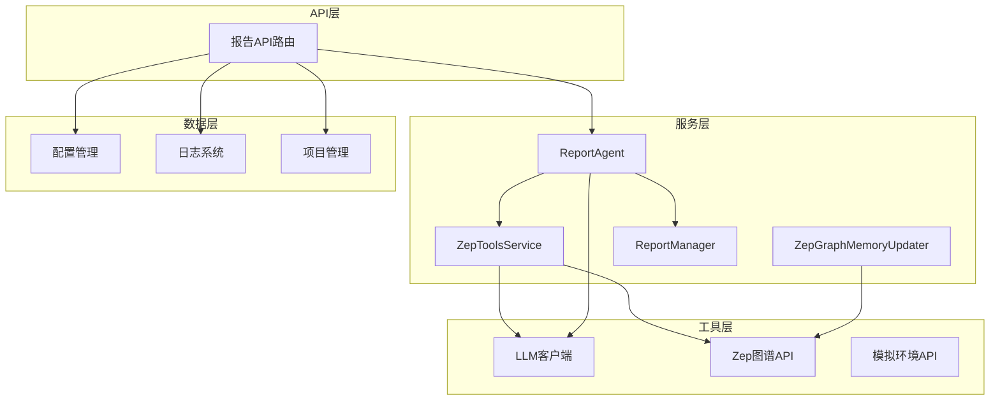
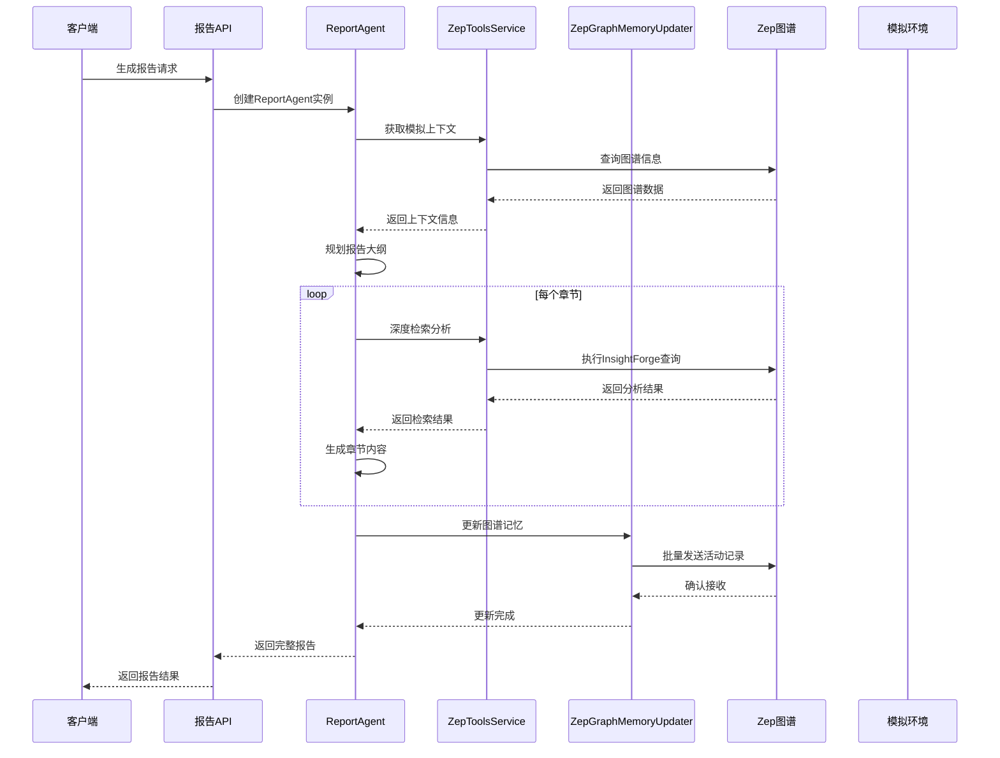
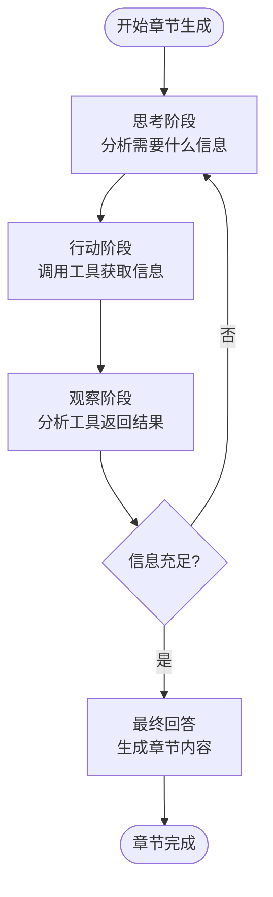
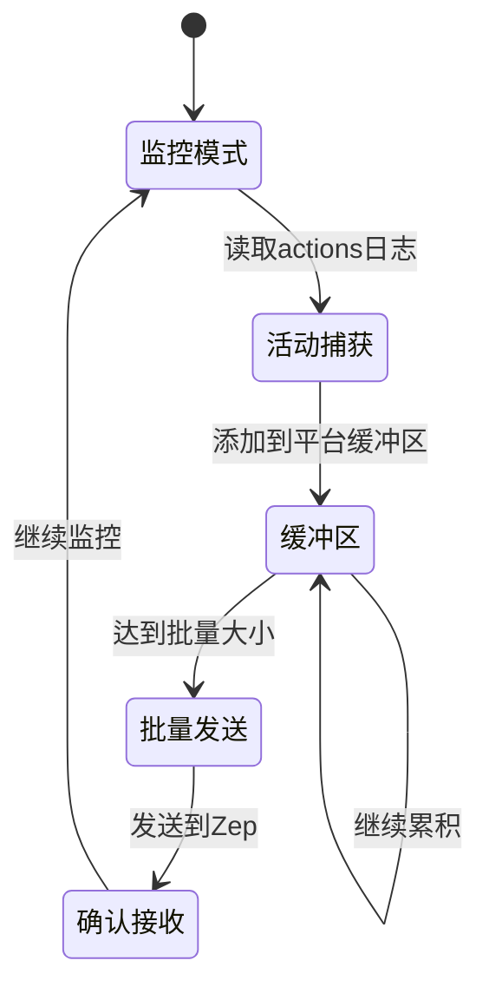
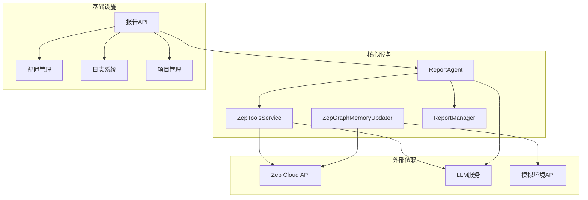

# 报告生成服务

<cite>
**本文档引用的文件**
- [report_agent.py](file://backend/app/services/report_agent.py)
- [zep_tools.py](file://backend/app/services/zep_tools.py)
- [zep_graph_memory_updater.py](file://backend/app/services/zep_graph_memory_updater.py)
- [report.py](file://backend/app/api/report.py)
- [config.py](file://backend/app/config.py)
- [logger.py](file://backend/app/utils/logger.py)
- [project.py](file://backend/app/models/project.py)
</cite>

## 目录
1. [引言](#引言)
2. [项目结构](#项目结构)
3. [核心组件](#核心组件)
4. [架构概览](#架构概览)
5. [详细组件分析](#详细组件分析)
6. [依赖关系分析](#依赖关系分析)
7. [性能考虑](#性能考虑)
8. [故障排除指南](#故障排除指南)
9. [结论](#结论)

## 引言

MiroFish报告生成服务是一个基于ReACT模式的智能报告生成系统，专门用于从模拟环境中提取和分析预测数据。该系统采用先进的AI技术，通过深度检索、智能工具集成和交互式分析，为用户提供高质量的未来预测报告。

该服务的核心设计理念是"以工具驱动的智能分析"，通过与Zep图谱系统的深度集成，实现对复杂模拟数据的多维度分析和可视化呈现。系统不仅能够生成结构化的报告内容，还能提供实时的分析过程跟踪和质量保证机制。

## 项目结构

项目采用清晰的分层架构设计，主要分为以下几个层次：

**图表来源**
- [report_agent.py](file://backend/app/services/report_agent.py#L469-L530)
- [zep_tools.py](file://backend/app/services/zep_tools.py#L377-L416)
- [zep_graph_memory_updater.py](file://backend/app/services/zep_graph_memory_updater.py#L201-L268)

**章节来源**
- [report_agent.py](file://backend/app/services/report_agent.py#L1-L50)
- [config.py](file://backend/app/config.py#L20-L76)

## 核心组件

### ReportAgent - 报告生成引擎

ReportAgent是整个系统的核心组件，实现了ReACT（推理-行动）模式的智能报告生成。该组件具有以下关键特性：

- **多轮思考机制**：每个章节生成过程包含5轮思考，确保分析的深度和全面性
- **智能工具选择**：根据分析需求自动选择最适合的检索工具
- **反思优化**：通过多轮反思机制持续优化分析质量和准确性
- **实时进度跟踪**：提供详细的生成进度和状态监控

### ZepToolsService - 智能工具集

ZepToolsService提供了四个核心检索工具，每个工具都有独特的分析能力和适用场景：

- **InsightForge**：深度洞察检索，自动分解复杂问题并多维度分析
- **PanoramaSearch**：广度搜索，获取事件全貌和历史演变过程
- **QuickSearch**：快速检索，适用于简单直接的信息查询
- **InterviewAgents**：深度采访，获取模拟Agent的真实观点和反应

### ZepGraphMemoryUpdater - 记忆管理系统

该组件负责将模拟Agent的实时活动动态更新到Zep图谱中，实现知识的持续积累和更新：

- **实时监控**：监控模拟actions日志文件，实时捕获Agent行为
- **批量处理**：按平台分组，累积到一定数量后批量发送到Zep
- **智能描述**：将Agent行为转换为自然语言描述，便于图谱理解
- **状态追踪**：提供详细的统计信息和运行状态监控

**章节来源**
- [report_agent.py](file://backend/app/services/report_agent.py#L469-L632)
- [zep_tools.py](file://backend/app/services/zep_tools.py#L377-L416)
- [zep_graph_memory_updater.py](file://backend/app/services/zep_graph_memory_updater.py#L201-L268)

## 架构概览

系统采用模块化设计，各个组件通过清晰的接口进行交互：

**图表来源**
- [report_agent.py](file://backend/app/services/report_agent.py#L1358-L1591)
- [zep_tools.py](file://backend/app/services/zep_tools.py#L926-L1071)
- [zep_graph_memory_updater.py](file://backend/app/services/zep_graph_memory_updater.py#L390-L428)

## 详细组件分析

### ReportAgent推理引擎

ReportAgent的推理引擎是整个系统的核心，实现了复杂的多阶段分析流程：

#### ReACT模式实现

**图表来源**
- [report_agent.py](file://backend/app/services/report_agent.py#L929-L1356)

#### 工具选择策略

ReportAgent采用智能工具选择机制，根据分析需求和工具特性进行最优组合：

- **InsightForge**：用于复杂问题的深度分析和多维度检索
- **PanoramaSearch**：用于获取事件全貌和历史演变
- **QuickSearch**：用于简单验证和确认
- **InterviewAgents**：用于获取Agent真实观点和反应

#### 反思优化机制

系统实现了多轮反思机制，通过以下方式提升报告质量：

- **工具调用次数控制**：每个章节至少3次，最多5次工具调用
- **信息质量评估**：持续评估检索结果的相关性和完整性
- **内容一致性检查**：避免重复描述相同信息
- **格式规范约束**：确保报告内容符合Markdown格式要求

**章节来源**
- [report_agent.py](file://backend/app/services/report_agent.py#L929-L1356)

### ZepToolsService工具集

ZepToolsService提供了四个核心检索工具，每个工具都针对特定的分析需求进行了优化：

#### InsightForge深度洞察检索

InsightForge是系统中最强大的检索工具，实现了以下功能：

- **问题自动分解**：使用LLM将复杂问题分解为多个子问题
- **多维度检索**：同时进行语义搜索、实体分析和关系链追踪
- **智能整合**：将不同来源的信息进行有机整合
- **完整输出**：不截断任何检索结果，确保信息完整性

#### PanoramaSearch广度搜索

PanoramaSearch专注于获取事件的全貌视图：

- **历史信息保留**：包含当前有效和历史/过期信息
- **时间线追踪**：展示事件的完整演变过程
- **实体关系分析**：提供涉及的所有实体和关系信息
- **相关性排序**：基于查询进行智能排序

#### QuickSearch快速检索

QuickSearch提供轻量级的快速检索能力：

- **简单直接**：适用于简单、直接的信息查询
- **快速响应**：优化查询速度和响应时间
- **精确匹配**：提供最相关的检索结果
- **数量控制**：可配置返回结果数量

#### InterviewAgents深度采访

InterviewAgents是系统独有的功能，能够获取模拟Agent的真实观点：

- **智能Agent选择**：根据采访需求自动选择最相关的Agent
- **多平台采访**：同时在Twitter和Reddit两个平台进行采访
- **真实回答获取**：获取Agent的真实回答而非LLM模拟
- **观点整合分析**：将多Agent观点进行综合分析

**章节来源**
- [zep_tools.py](file://backend/app/services/zep_tools.py#L926-L1436)

### ZepGraphMemoryUpdater记忆管理

ZepGraphMemoryUpdater实现了智能的记忆管理系统，确保图谱内容的实时更新：

#### 实时监控机制

**图表来源**
- [zep_graph_memory_updater.py](file://backend/app/services/zep_graph_memory_updater.py#L359-L428)

#### 智能描述转换

系统将Agent的原始行为转换为自然语言描述：

- **动作类型识别**：识别不同的Agent行为类型
- **上下文信息提取**：提取行为相关的上下文信息
- **自然语言生成**：将结构化数据转换为可理解的文本
- **格式标准化**：确保描述格式的一致性和规范性

#### 批量处理优化

为了提高效率，系统采用了批量处理机制：

- **平台分离**：Twitter和Reddit平台分别处理
- **批量大小控制**：每平台累积5条活动后批量发送
- **发送间隔控制**：避免请求过于频繁
- **重试机制**：失败时自动重试，确保数据完整性

**章节来源**
- [zep_graph_memory_updater.py](file://backend/app/services/zep_graph_memory_updater.py#L201-L471)

## 依赖关系分析

系统各组件之间的依赖关系体现了清晰的分层架构：

**图表来源**
- [report_agent.py](file://backend/app/services/report_agent.py#L21-L32)
- [zep_tools.py](file://backend/app/services/zep_tools.py#L16-L22)
- [zep_graph_memory_updater.py](file://backend/app/services/zep_graph_memory_updater.py#L15-L20)

**章节来源**
- [report_agent.py](file://backend/app/services/report_agent.py#L1-L50)
- [zep_tools.py](file://backend/app/services/zep_tools.py#L1-L30)
- [zep_graph_memory_updater.py](file://backend/app/services/zep_graph_memory_updater.py#L1-L30)

## 性能考虑

系统在设计时充分考虑了性能优化和可扩展性：

### 并发处理机制

- **异步任务处理**：报告生成采用异步方式，避免阻塞主线程
- **多线程支持**：内存更新器使用多线程处理，提高并发性能
- **批量处理优化**：通过批量发送减少API调用次数

### 缓存和优化策略

- **结果缓存**：常用查询结果进行缓存，减少重复计算
- **进度持久化**：定期保存生成进度，支持断点续传
- **资源池管理**：合理管理LLM和API调用资源

### 内存管理

- **流式处理**：大文件采用流式处理，避免内存溢出
- **分章节输出**：章节内容分步生成和保存，降低内存压力
- **垃圾回收**：及时释放不再使用的对象和资源

## 故障排除指南

### 常见问题诊断

#### 报告生成失败

**症状**：报告生成过程中断或失败

**可能原因**：
- LLM API调用失败
- Zep图谱API连接问题
- 磁盘空间不足
- 内存资源不足

**解决方案**：
- 检查API密钥配置
- 验证网络连接稳定性
- 监控磁盘使用情况
- 增加系统资源

#### 工具调用异常

**症状**：某些检索工具无法正常工作

**可能原因**：
- 工具参数配置错误
- 图谱数据格式不兼容
- LLM模型调用限制

**解决方案**：
- 验证工具参数格式
- 检查图谱数据完整性
- 调整LLM调用频率

#### 内存更新失败

**症状**：Agent活动无法更新到图谱

**可能原因**：
- 图谱API密钥无效
- 网络连接中断
- 批量发送超时

**解决方案**：
- 重新配置API密钥
- 检查网络连接状态
- 调整批量发送参数

**章节来源**
- [report_agent.py](file://backend/app/services/report_agent.py#L1566-L1590)
- [zep_tools.py](file://backend/app/services/zep_tools.py#L418-L439)
- [zep_graph_memory_updater.py](file://backend/app/services/zep_graph_memory_updater.py#L406-L427)

## 结论

MiroFish报告生成服务通过创新的ReACT模式和智能工具集成，为复杂模拟数据的分析和报告生成提供了完整的解决方案。系统的核心优势包括：

### 技术创新

- **ReACT推理模式**：实现了真正的智能分析和决策过程
- **多工具协同**：不同工具针对不同分析需求，形成互补优势
- **实时反馈机制**：提供详细的分析过程跟踪和质量监控

### 应用价值

- **高质量报告**：通过多轮反思和工具验证，确保报告准确性
- **深度洞察**：不仅提供表面信息，更能揭示深层规律和趋势
- **可解释性**：完整的分析过程记录，便于理解和验证

### 扩展潜力

系统采用模块化设计，易于扩展新的分析工具和功能。随着模拟环境的不断发展，该系统将继续演进，为用户提供更加智能化的分析服务。

通过本文档的详细分析，开发者可以深入理解系统的设计理念和技术实现，为后续的功能扩展和优化提供坚实的基础。