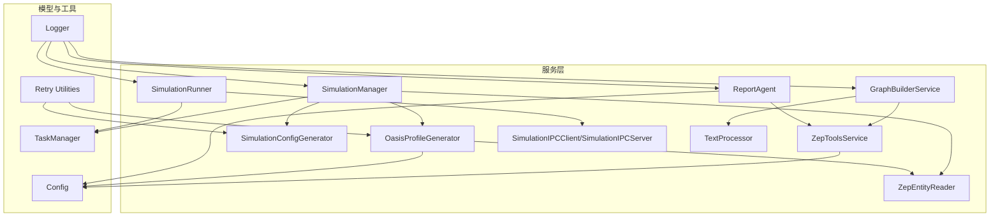
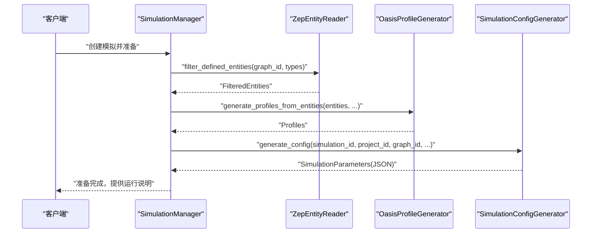
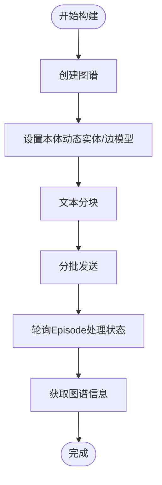
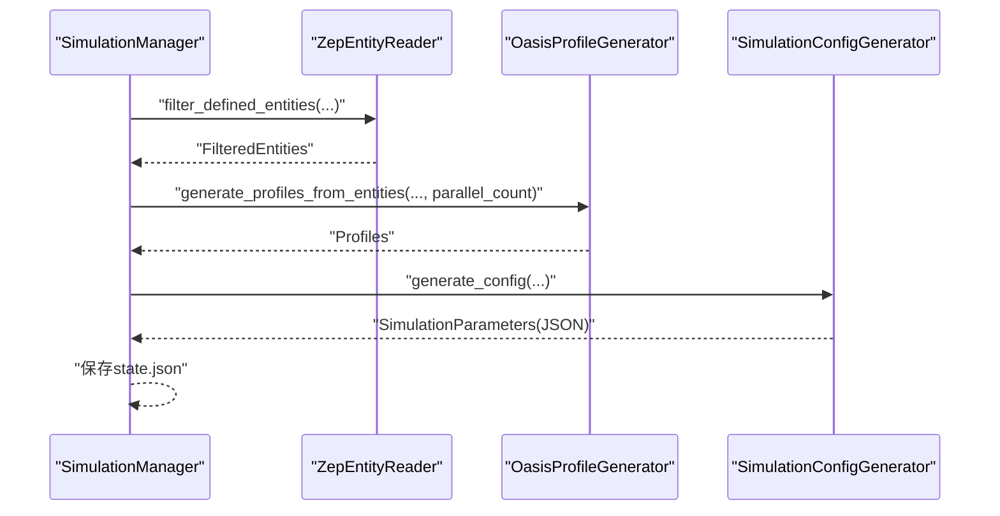
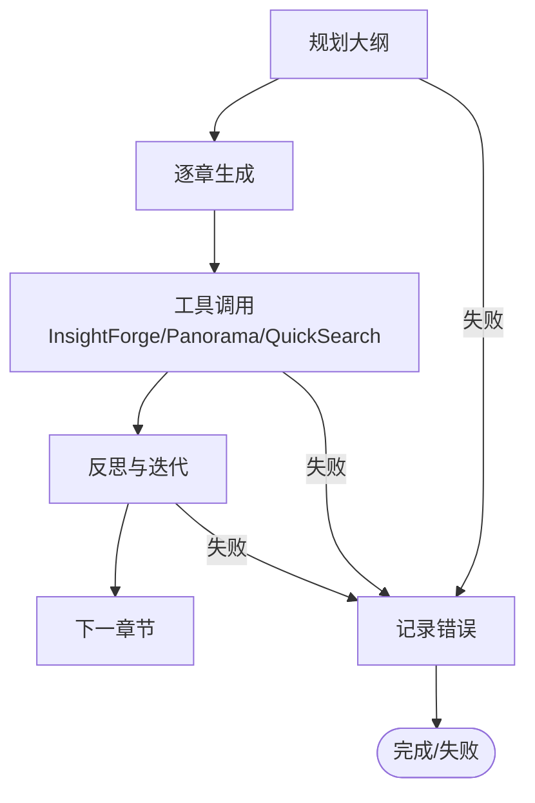
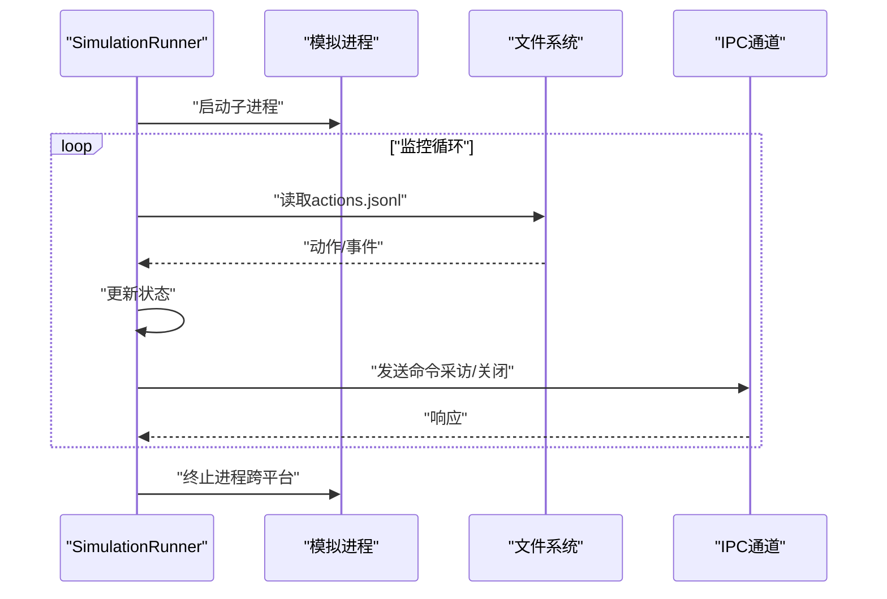
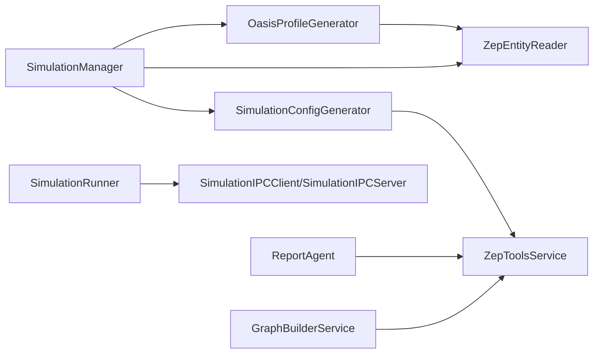

# 服务层架构

<cite>
**本文档引用的文件**
- [backend/app/services/__init__.py](file://backend/app/services/__init__.py)
- [backend/app/services/graph_builder.py](file://backend/app/services/graph_builder.py)
- [backend/app/services/simulation_manager.py](file://backend/app/services/simulation_manager.py)
- [backend/app/services/report_agent.py](file://backend/app/services/report_agent.py)
- [backend/app/services/oasis_profile_generator.py](file://backend/app/services/oasis_profile_generator.py)
- [backend/app/services/zep_entity_reader.py](file://backend/app/services/zep_entity_reader.py)
- [backend/app/services/simulation_config_generator.py](file://backend/app/services/simulation_config_generator.py)
- [backend/app/services/text_processor.py](file://backend/app/services/text_processor.py)
- [backend/app/services/zep_tools.py](file://backend/app/services/zep_tools.py)
- [backend/app/services/simulation_runner.py](file://backend/app/services/simulation_runner.py)
- [backend/app/services/simulation_ipc.py](file://backend/app/services/simulation_ipc.py)
- [backend/app/models/task.py](file://backend/app/models/task.py)
- [backend/app/config.py](file://backend/app/config.py)
- [backend/app/utils/logger.py](file://backend/app/utils/logger.py)
- [backend/app/utils/retry.py](file://backend/app/utils/retry.py)
</cite>

## 目录
1. [引言](#引言)
2. [项目结构](#项目结构)
3. [核心组件](#核心组件)
4. [架构总览](#架构总览)
5. [详细组件分析](#详细组件分析)
6. [依赖关系分析](#依赖关系分析)
7. [性能考虑](#性能考虑)
8. [故障排查指南](#故障排查指南)
9. [结论](#结论)

## 引言
本文件面向MiroFish服务层架构，系统化阐述服务层的设计模式与职责分离原则，深入解析图谱构建服务、模拟管理服务、报告生成服务的实现细节与交互机制，总结服务注入、工厂与单例模式的应用现状，梳理错误处理策略（异常传播、回滚与重试），并给出扩展与性能优化的最佳实践。

## 项目结构
服务层位于 backend/app/services 目录，采用“按职责分层”的模块化组织方式，核心服务围绕三大主线展开：
- 图谱构建与维护：GraphBuilderService、ZepEntityReader、ZepToolsService
- 模拟生命周期管理：SimulationManager、SimulationConfigGenerator、OasisProfileGenerator、SimulationRunner、SimulationIPCClient/SimulationIPCServer
- 报告生成与检索：ReportAgent、ZepToolsService（复用）

图表来源
- [backend/app/services/__init__.py](file://backend/app/services/__init__.py#L1-L74)
- [backend/app/services/graph_builder.py](file://backend/app/services/graph_builder.py#L1-L500)
- [backend/app/services/simulation_manager.py](file://backend/app/services/simulation_manager.py#L1-L529)
- [backend/app/services/report_agent.py](file://backend/app/services/report_agent.py#L1-L800)
- [backend/app/services/oasis_profile_generator.py](file://backend/app/services/oasis_profile_generator.py#L1-L800)
- [backend/app/services/zep_entity_reader.py](file://backend/app/services/zep_entity_reader.py#L1-L445)
- [backend/app/services/simulation_config_generator.py](file://backend/app/services/simulation_config_generator.py#L1-L800)
- [backend/app/services/text_processor.py](file://backend/app/services/text_processor.py#L1-L72)
- [backend/app/services/zep_tools.py](file://backend/app/services/zep_tools.py#L1-L800)
- [backend/app/services/simulation_runner.py](file://backend/app/services/simulation_runner.py#L1-L800)
- [backend/app/services/simulation_ipc.py](file://backend/app/services/simulation_ipc.py#L1-L395)
- [backend/app/models/task.py](file://backend/app/models/task.py#L1-L185)
- [backend/app/config.py](file://backend/app/config.py#L1-L76)
- [backend/app/utils/logger.py](file://backend/app/utils/logger.py#L1-L127)
- [backend/app/utils/retry.py](file://backend/app/utils/retry.py#L1-L239)

章节来源
- [backend/app/services/__init__.py](file://backend/app/services/__init__.py#L1-L74)

## 核心组件
- 图谱构建服务（GraphBuilderService）
  - 职责：调用Zep API创建/设置本体、分批导入文本、等待处理完成、获取图谱信息与数据
  - 关键能力：异步构建、分块与批处理、进度回调、任务状态管理
- 模拟管理服务（SimulationManager）
  - 职责：从Zep图谱读取并过滤实体、生成OASIS Agent Profile、智能生成模拟配置、准备脚本与配置文件、提供运行说明
  - 关键能力：状态持久化、进度回调、并行Profile生成、LLM配置生成
- 报告生成服务（ReportAgent）
  - 职责：基于ReACT模式的报告生成，封装Zep检索工具，记录详细日志与控制台日志
  - 关键能力：多工具检索（InsightForge、Panorama、QuickSearch）、工具调用解析、反思与迭代
- 模拟运行与通信（SimulationRunner、SimulationIPCClient/SimulationIPCServer）
  - 职责：后台运行OASIS模拟、解析动作日志、提供实时状态、跨进程命令/响应通信
  - 关键能力：进程管理、日志解析、状态持久化、跨平台终止、图谱记忆更新集成
- 数据与工具（ZepEntityReader、ZepToolsService、OasisProfileGenerator、SimulationConfigGenerator、TextProcessor、TaskManager、Config、Logger、Retry Utilities）
  - 职责：实体读取与过滤、检索工具封装、Profile生成、配置生成、文本处理、任务状态、配置与日志、重试机制

章节来源
- [backend/app/services/graph_builder.py](file://backend/app/services/graph_builder.py#L38-L500)
- [backend/app/services/simulation_manager.py](file://backend/app/services/simulation_manager.py#L114-L529)
- [backend/app/services/report_agent.py](file://backend/app/services/report_agent.py#L469-L800)
- [backend/app/services/simulation_runner.py](file://backend/app/services/simulation_runner.py#L195-L800)
- [backend/app/services/simulation_ipc.py](file://backend/app/services/simulation_ipc.py#L95-L395)
- [backend/app/services/zep_entity_reader.py](file://backend/app/services/zep_entity_reader.py#L70-L445)
- [backend/app/services/zep_tools.py](file://backend/app/services/zep_tools.py#L377-L800)
- [backend/app/services/oasis_profile_generator.py](file://backend/app/services/oasis_profile_generator.py#L142-L800)
- [backend/app/services/simulation_config_generator.py](file://backend/app/services/simulation_config_generator.py#L199-L800)
- [backend/app/services/text_processor.py](file://backend/app/services/text_processor.py#L9-L72)
- [backend/app/models/task.py](file://backend/app/models/task.py#L54-L185)
- [backend/app/config.py](file://backend/app/config.py#L20-L76)
- [backend/app/utils/logger.py](file://backend/app/utils/logger.py#L30-L127)
- [backend/app/utils/retry.py](file://backend/app/utils/retry.py#L15-L239)

## 架构总览
服务层采用“职责单一 + 依赖注入”的设计，通过配置中心（Config）集中管理API密钥与参数，通过日志工具（Logger）统一输出，通过任务管理（TaskManager）与重试工具（Retry Utilities）保障可靠性。服务间通过明确的数据契约（dataclass）与文件系统/进程间通信（IPC）协同。

图表来源
- [backend/app/services/simulation_manager.py](file://backend/app/services/simulation_manager.py#L229-L457)
- [backend/app/services/zep_entity_reader.py](file://backend/app/services/zep_entity_reader.py#L222-L338)
- [backend/app/services/oasis_profile_generator.py](file://backend/app/services/oasis_profile_generator.py#L142-L274)
- [backend/app/services/simulation_config_generator.py](file://backend/app/services/simulation_config_generator.py#L242-L378)

## 详细组件分析

### 图谱构建服务（GraphBuilderService）
- 设计要点
  - 采用单例式客户端（Zep）与任务管理器（TaskManager）协作，支持异步构建与进度回调
  - 本体动态构建：通过反射与SDK要求的字段约束，动态生成实体/边模型
  - 批量导入与等待：分批发送文本，轮询每个Episode的处理状态，支持超时与进度反馈
- 关键流程

图表来源
- [backend/app/services/graph_builder.py](file://backend/app/services/graph_builder.py#L52-L185)
- [backend/app/services/graph_builder.py](file://backend/app/services/graph_builder.py#L186-L286)
- [backend/app/services/graph_builder.py](file://backend/app/services/graph_builder.py#L287-L395)
- [backend/app/models/task.py](file://backend/app/models/task.py#L54-L185)

章节来源
- [backend/app/services/graph_builder.py](file://backend/app/services/graph_builder.py#L38-L500)
- [backend/app/models/task.py](file://backend/app/models/task.py#L54-L185)

### 模拟管理服务（SimulationManager）
- 设计要点
  - 状态持久化：内存缓存 + 文件系统（state.json），支持重启恢复
  - 进度回调：三阶段（读取实体、生成Profile、生成配置）提供进度与消息
  - 并行Profile生成：支持并行数量配置，实时输出文件
  - LLM智能配置：分步生成时间、事件、Agent、平台配置，支持JSON修复与重试
- 关键流程

图表来源
- [backend/app/services/simulation_manager.py](file://backend/app/services/simulation_manager.py#L229-L457)
- [backend/app/services/zep_entity_reader.py](file://backend/app/services/zep_entity_reader.py#L222-L338)
- [backend/app/services/oasis_profile_generator.py](file://backend/app/services/oasis_profile_generator.py#L338-L374)
- [backend/app/services/simulation_config_generator.py](file://backend/app/services/simulation_config_generator.py#L242-L378)

章节来源
- [backend/app/services/simulation_manager.py](file://backend/app/services/simulation_manager.py#L114-L529)

### 报告生成服务（ReportAgent）
- 设计要点
  - ReACT模式：规划（InsightForge）、生成（工具调用）、反思（多轮思考与工具调用）
  - 工具体系：InsightForge（深度洞察）、Panorama（广度搜索）、QuickSearch（快速检索）、Interview（真实Agent采访）
  - 日志体系：agent_log.jsonl（详细动作）、console_log.txt（控制台日志）
- 关键流程

图表来源
- [backend/app/services/report_agent.py](file://backend/app/services/report_agent.py#L795-L800)
- [backend/app/services/zep_tools.py](file://backend/app/services/zep_tools.py#L377-L800)

章节来源
- [backend/app/services/report_agent.py](file://backend/app/services/report_agent.py#L469-L800)
- [backend/app/services/zep_tools.py](file://backend/app/services/zep_tools.py#L377-L800)

### 模拟运行与通信（SimulationRunner、SimulationIPCClient/SimulationIPCServer）
- 设计要点
  - 进程管理：启动/监控/终止子进程，跨平台处理（Windows任务树、Unix进程组）
  - 日志解析：读取 twitter/reddit/actions.jsonl，解析事件与动作，更新运行状态
  - IPC通信：通过文件系统实现命令/响应（commands/、responses/），支持采访与关闭环境
  - 状态持久化：run_state.json，支持重启恢复
- 关键流程

图表来源
- [backend/app/services/simulation_runner.py](file://backend/app/services/simulation_runner.py#L312-L577)
- [backend/app/services/simulation_ipc.py](file://backend/app/services/simulation_ipc.py#L95-L395)

章节来源
- [backend/app/services/simulation_runner.py](file://backend/app/services/simulation_runner.py#L195-L800)
- [backend/app/services/simulation_ipc.py](file://backend/app/services/simulation_ipc.py#L1-L395)

### 数据与工具组件
- ZepEntityReader：实体读取、过滤、边与节点关联，带重试机制
- ZepToolsService：封装Zep检索工具（Search、Nodes、Edges、Interview），带重试与降级
- OasisProfileGenerator：基于Zep检索与LLM生成Profile，支持规则回退与JSON修复
- SimulationConfigGenerator：分步生成时间、事件、Agent、平台配置，带LLM重试与JSON修复
- TextProcessor：文本预处理、分块、统计
- TaskManager：单例任务状态管理，线程安全
- Config：统一配置加载与校验
- Logger：统一日志输出（文件+控制台）
- Retry Utilities：指数退避重试装饰器与客户端

章节来源
- [backend/app/services/zep_entity_reader.py](file://backend/app/services/zep_entity_reader.py#L70-L445)
- [backend/app/services/zep_tools.py](file://backend/app/services/zep_tools.py#L377-L800)
- [backend/app/services/oasis_profile_generator.py](file://backend/app/services/oasis_profile_generator.py#L142-L800)
- [backend/app/services/simulation_config_generator.py](file://backend/app/services/simulation_config_generator.py#L199-L800)
- [backend/app/services/text_processor.py](file://backend/app/services/text_processor.py#L9-L72)
- [backend/app/models/task.py](file://backend/app/models/task.py#L54-L185)
- [backend/app/config.py](file://backend/app/config.py#L20-L76)
- [backend/app/utils/logger.py](file://backend/app/utils/logger.py#L30-L127)
- [backend/app/utils/retry.py](file://backend/app/utils/retry.py#L15-L239)

## 依赖关系分析
- 服务内聚与耦合
  - GraphBuilderService 与 ZepToolsService：前者负责构建，后者负责检索；通过Zep SDK共享API密钥
  - SimulationManager 与 ZepEntityReader/OasisProfileGenerator/SimulationConfigGenerator：管理生命周期与数据准备
  - SimulationRunner 与 SimulationIPCClient/SimulationIPCServer：通过文件系统实现命令/响应
  - ReportAgent 与 ZepToolsService：复用检索工具
- 外部依赖
  - Zep Cloud SDK：图谱创建、本体设置、检索、节点/边查询
  - OpenAI SDK：LLM调用（Profile与配置生成）
  - 文件系统：状态持久化、日志、IPC命令/响应
- 可能的循环依赖
  - 服务间通过数据类与配置解耦，未发现直接循环导入

图表来源
- [backend/app/services/graph_builder.py](file://backend/app/services/graph_builder.py#L1-L500)
- [backend/app/services/simulation_manager.py](file://backend/app/services/simulation_manager.py#L1-L529)
- [backend/app/services/report_agent.py](file://backend/app/services/report_agent.py#L1-L800)
- [backend/app/services/simulation_runner.py](file://backend/app/services/simulation_runner.py#L1-L800)
- [backend/app/services/simulation_ipc.py](file://backend/app/services/simulation_ipc.py#L1-L395)
- [backend/app/services/zep_entity_reader.py](file://backend/app/services/zep_entity_reader.py#L1-L445)
- [backend/app/services/zep_tools.py](file://backend/app/services/zep_tools.py#L1-L800)
- [backend/app/services/oasis_profile_generator.py](file://backend/app/services/oasis_profile_generator.py#L1-L800)
- [backend/app/services/simulation_config_generator.py](file://backend/app/services/simulation_config_generator.py#L1-L800)

章节来源
- [backend/app/services/__init__.py](file://backend/app/services/__init__.py#L1-L74)

## 性能考虑
- 连接池与并发
  - Zep API：通过单例客户端复用连接，减少握手开销
  - 并行Profile生成：支持并行数量配置，提升实体规模下的生成效率
  - 并发检索：ZepEntityReader在获取边时使用并行请求（线程池），提升大规模图谱读取性能
- 缓存策略
  - SimulationManager 内存缓存（_simulations）：减少频繁文件读写
  - TaskManager 内存缓存（_tasks）：单例+锁，线程安全的任务状态
- 异步与I/O
  - GraphBuilderService 异步构建 + 后台线程：避免阻塞主线程
  - SimulationRunner 通过文件轮询解析日志，避免复杂IPC带来的复杂性
- LLM调用优化
  - Retry Utilities：指数退避+抖动，降低限流影响
  - JSON修复：对截断与格式问题进行修复，提升成功率
- I/O与磁盘
  - 状态文件与日志文件采用轮转与UTF-8编码，避免缓冲区满与乱码问题

章节来源
- [backend/app/services/oasis_profile_generator.py](file://backend/app/services/oasis_profile_generator.py#L298-L377)
- [backend/app/services/zep_entity_reader.py](file://backend/app/services/zep_entity_reader.py#L369-L377)
- [backend/app/services/graph_builder.py](file://backend/app/services/graph_builder.py#L86-L93)
- [backend/app/services/simulation_runner.py](file://backend/app/services/simulation_runner.py#L458-L466)
- [backend/app/utils/retry.py](file://backend/app/utils/retry.py#L15-L239)

## 故障排查指南
- 配置校验
  - Config.validate：检查LLM与Zep API密钥是否配置
- 日志定位
  - Logger：统一输出到文件与控制台，便于定位异常
- 任务状态
  - TaskManager：查看任务状态、进度与错误信息
- 重试机制
  - Retry Utilities：装饰器与客户端封装，支持指数退避与抖动
- 常见问题
  - Zep API失败：检查API密钥、网络与重试日志
  - LLM调用失败：查看重试与JSON修复日志
  - 模拟进程卡死：检查进程树终止与日志文件

章节来源
- [backend/app/config.py](file://backend/app/config.py#L66-L76)
- [backend/app/utils/logger.py](file://backend/app/utils/logger.py#L30-L127)
- [backend/app/models/task.py](file://backend/app/models/task.py#L54-L185)
- [backend/app/utils/retry.py](file://backend/app/utils/retry.py#L15-L239)

## 结论
MiroFish服务层通过清晰的职责划分与稳健的基础设施（配置、日志、重试、任务管理）实现了高可靠与可扩展的业务能力。图谱构建、模拟管理、报告生成与运行监控四大主线相互协作，既满足了复杂场景的需求，也为后续扩展提供了良好的抽象与接口设计空间。建议在保持现有职责边界的同时，进一步完善服务注入与工厂模式的应用，以增强可测试性与可替换性。