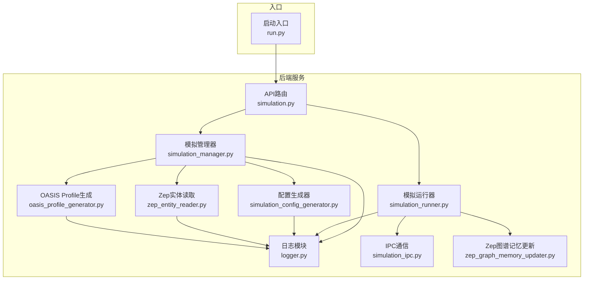
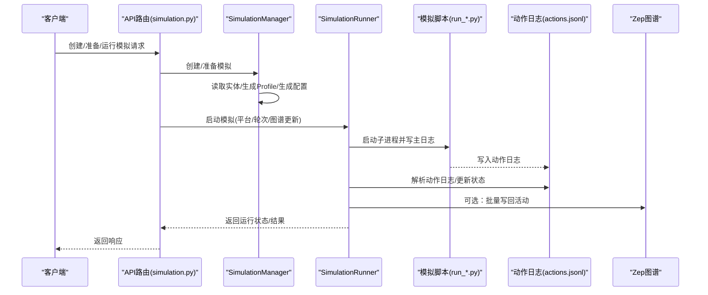
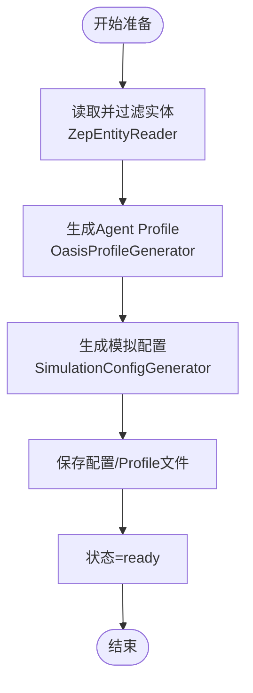
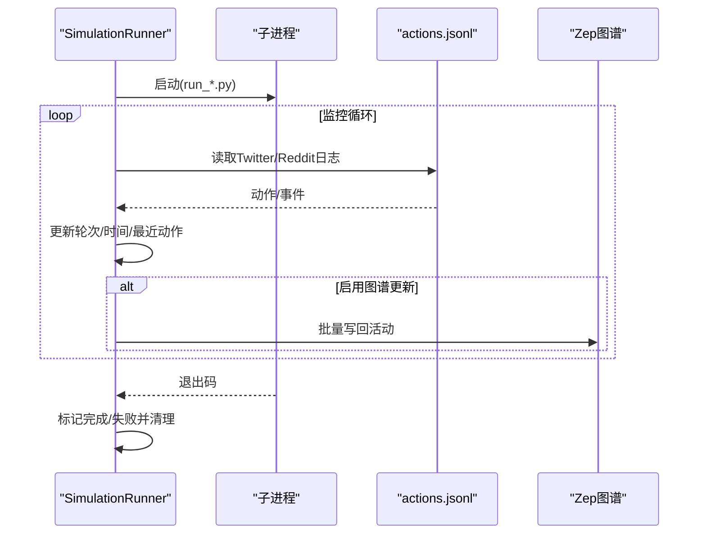
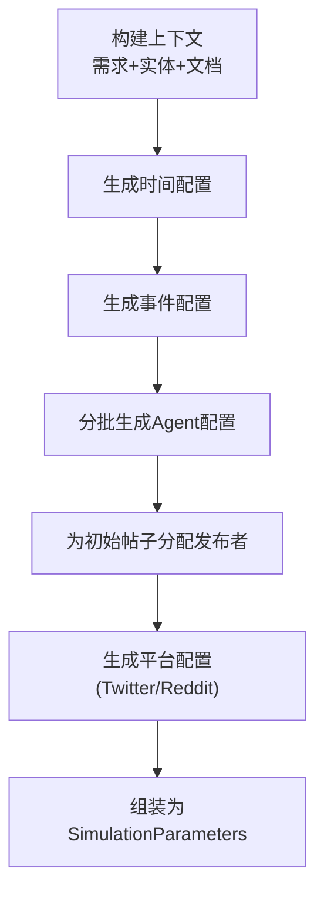
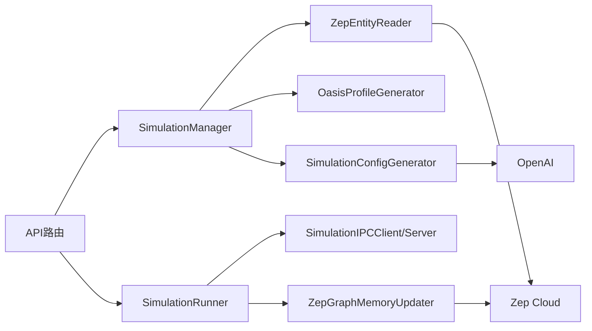

# 模拟管理服务

<cite>
**本文档引用的文件**
- [simulation_manager.py](file://backend/app/services/simulation_manager.py)
- [simulation_runner.py](file://backend/app/services/simulation_runner.py)
- [simulation_config_generator.py](file://backend/app/services/simulation_config_generator.py)
- [simulation.py](file://backend/app/api/simulation.py)
- [logger.py](file://backend/app/utils/logger.py)
- [zep_entity_reader.py](file://backend/app/services/zep_entity_reader.py)
- [oasis_profile_generator.py](file://backend/app/services/oasis_profile_generator.py)
- [simulation_ipc.py](file://backend/app/services/simulation_ipc.py)
- [zep_graph_memory_updater.py](file://backend/app/services/zep_graph_memory_updater.py)
- [run.py](file://backend/run.py)
</cite>

## 目录
1. [简介](#简介)
2. [项目结构](#项目结构)
3. [核心组件](#核心组件)
4. [架构总览](#架构总览)
5. [详细组件分析](#详细组件分析)
6. [依赖分析](#依赖分析)
7. [性能考虑](#性能考虑)
8. [故障排查指南](#故障排查指南)
9. [结论](#结论)
10. [附录](#附录)

## 简介
本技术文档面向MiroFish模拟管理服务，系统化阐述其整体架构与关键实现，重点覆盖以下方面：
- 模拟生命周期管理：从创建、准备、运行到终止的全流程控制
- 状态控制与持久化：内存态与磁盘态的协同，保证状态一致性
- 资源配置：基于LLM的智能参数生成，支持平台适配与动态调整
- SimulationManager的协调机制：实体读取、Agent Profile生成、配置生成与脚本准备
- SimulationRunner的执行引擎：回合制模拟、动作解析、实时监控与跨平台并行
- SimulationConfigGenerator的配置策略：分步生成、上下文截断、JSON修复与参数校验
- 性能监控与调试：日志体系、状态跟踪、错误诊断与可视化建议
- 结果分析与可视化：基于动作日志与图谱记忆的分析思路

## 项目结构
后端采用分层设计，核心服务集中在backend/app/services，API路由集中在backend/app/api，工具模块位于backend/app/utils，入口脚本位于backend/run.py。

**图表来源**
- [simulation.py](file://backend/app/api/simulation.py#L1-L2712)
- [simulation_manager.py](file://backend/app/services/simulation_manager.py#L1-L529)
- [simulation_runner.py](file://backend/app/services/simulation_runner.py#L1-L1764)
- [simulation_config_generator.py](file://backend/app/services/simulation_config_generator.py#L1-L988)
- [logger.py](file://backend/app/utils/logger.py#L1-L127)
- [zep_entity_reader.py](file://backend/app/services/zep_entity_reader.py#L1-L445)
- [oasis_profile_generator.py](file://backend/app/services/oasis_profile_generator.py#L1-L1201)
- [simulation_ipc.py](file://backend/app/services/simulation_ipc.py#L1-L395)
- [zep_graph_memory_updater.py](file://backend/app/services/zep_graph_memory_updater.py#L1-L549)
- [run.py](file://backend/run.py#L1-L51)

**章节来源**
- [run.py](file://backend/run.py#L1-L51)
- [simulation.py](file://backend/app/api/simulation.py#L1-L2712)

## 核心组件
- 模拟管理器（SimulationManager）
  - 负责模拟生命周期的创建、准备、状态持久化与查询
  - 集成Zep实体读取、OASIS Profile生成与配置生成
  - 生成运行说明与脚本指令
- 模拟运行器（SimulationRunner）
  - 后台运行模拟脚本，解析动作日志，实时监控状态
  - 支持Twitter/Reddit双平台并行，跨平台进程终止
  - 可选启用Zep图谱记忆更新，将活动增量写回图谱
- 配置生成器（SimulationConfigGenerator）
  - 基于LLM的分步配置生成：时间、事件、Agent、平台
  - 上下文截断、JSON修复、参数校验与默认回退
- 实体读取与Profile生成
  - ZepEntityReader：过滤实体、关联边与节点、检索增强
  - OasisProfileGenerator：个人/群体两类人设生成，支持LLM与规则两套策略
- IPC通信与图谱记忆更新
  - SimulationIPCClient/SimulationIPCServer：命令/响应模式
  - ZepGraphMemoryUpdater：按平台批量写回图谱，带重试与统计

**章节来源**
- [simulation_manager.py](file://backend/app/services/simulation_manager.py#L114-L529)
- [simulation_runner.py](file://backend/app/services/simulation_runner.py#L195-L1764)
- [simulation_config_generator.py](file://backend/app/services/simulation_config_generator.py#L199-L988)
- [zep_entity_reader.py](file://backend/app/services/zep_entity_reader.py#L70-L445)
- [oasis_profile_generator.py](file://backend/app/services/oasis_profile_generator.py#L142-L1201)
- [simulation_ipc.py](file://backend/app/services/simulation_ipc.py#L95-L395)
- [zep_graph_memory_updater.py](file://backend/app/services/zep_graph_memory_updater.py#L201-L549)

## 架构总览
整体架构围绕“准备—运行—监控—更新”的闭环展开。API层接收请求，调用管理器与运行器；管理器负责准备阶段的自动化流水线；运行器负责后台进程与日志解析；配置生成器与实体/Profile生成器提供智能参数与Agent设定；IPC与图谱更新模块实现与外部系统的交互与增量知识注入。

**图表来源**
- [simulation.py](file://backend/app/api/simulation.py#L164-L800)
- [simulation_manager.py](file://backend/app/services/simulation_manager.py#L193-L529)
- [simulation_runner.py](file://backend/app/services/simulation_runner.py#L312-L800)
- [zep_graph_memory_updater.py](file://backend/app/services/zep_graph_memory_updater.py#L274-L453)

## 详细组件分析

### 模拟管理器（SimulationManager）
- 生命周期管理
  - 创建：生成唯一ID，初始化状态，持久化state.json
  - 准备：实体读取与过滤、Profile生成、配置生成、文件保存、脚本说明
  - 查询：内存缓存+磁盘加载，支持列表与单个查询
- 状态模型
  - SimulationState：包含平台开关、实体/Profile统计、配置生成标记、当前轮次、平台状态、时间戳与错误信息
  - 状态枚举：created/preparing/ready/running/paused/stopped/completed/failed
- 准备流程要点
  - 阶段1：ZepEntityReader过滤实体，统计实体类型与数量
  - 阶段2：OasisProfileGenerator生成Profile，支持并行与实时保存
  - 阶段3：SimulationConfigGenerator生成配置，保存至simulation_config.json
  - 生成运行说明：指向backend/scripts目录下的脚本，支持单平台/并行运行

**图表来源**
- [simulation_manager.py](file://backend/app/services/simulation_manager.py#L229-L447)
- [zep_entity_reader.py](file://backend/app/services/zep_entity_reader.py#L222-L338)
- [oasis_profile_generator.py](file://backend/app/services/oasis_profile_generator.py#L142-L274)
- [simulation_config_generator.py](file://backend/app/services/simulation_config_generator.py#L242-L378)

**章节来源**
- [simulation_manager.py](file://backend/app/services/simulation_manager.py#L42-L192)
- [simulation_manager.py](file://backend/app/services/simulation_manager.py#L193-L529)

### 模拟运行器（SimulationRunner）
- 运行状态模型
  - SimulationRunState：包含当前/总轮次、模拟小时、平台独立轮次与时间、动作计数、最近动作、进程PID、错误信息
  - RunnerStatus：idle/starting/running/paused/stopping/stopped/completed/failed
- 启动流程
  - 读取配置计算总轮次，支持max_rounds截断
  - 选择脚本（Twitter/Reddit/并行），创建子进程，设置UTF-8环境，写主日志文件
  - 启动监控线程，解析各平台actions.jsonl，更新状态与最近动作
  - 支持图谱记忆更新：按平台批量写回Zep，带重试与统计
- 停止流程
  - 跨平台终止：Windows使用taskkill，Unix使用进程组SIGTERM/SIGKILL
  - 清理资源：关闭日志文件句柄、停止图谱更新器、移除内存态

**图表来源**
- [simulation_runner.py](file://backend/app/services/simulation_runner.py#L312-L577)
- [simulation_runner.py](file://backend/app/services/simulation_runner.py#L578-L800)
- [zep_graph_memory_updater.py](file://backend/app/services/zep_graph_memory_updater.py#L390-L453)

**章节来源**
- [simulation_runner.py](file://backend/app/services/simulation_runner.py#L100-L193)
- [simulation_runner.py](file://backend/app/services/simulation_runner.py#L312-L800)
- [zep_graph_memory_updater.py](file://backend/app/services/zep_graph_memory_updater.py#L201-L549)

### 配置生成器（SimulationConfigGenerator）
- 分步生成策略
  - 时间配置：基于中国人作息，生成总时长、每轮分钟数、每小时Agent数、高峰/低谷时段
  - 事件配置：提取热点话题、舆论方向、初始帖子与发布者类型
  - Agent配置：分批生成，每批10-20个，为初始帖子分配合适发布者
  - 平台配置：Twitter/Reddit权重与回声室强度
- 上下文与安全
  - 上下文截断与JSON修复：应对LLM输出截断与格式问题
  - 参数校验：Agents_per_hour上限不超过Agent总数，修正min/max关系
  - 默认回退：LLM失败时使用默认配置

**图表来源**
- [simulation_config_generator.py](file://backend/app/services/simulation_config_generator.py#L242-L378)
- [simulation_config_generator.py](file://backend/app/services/simulation_config_generator.py#L534-L723)

**章节来源**
- [simulation_config_generator.py](file://backend/app/services/simulation_config_generator.py#L199-L988)

### 实体读取与Profile生成
- ZepEntityReader
  - 过滤逻辑：仅保留除默认标签外的自定义标签
  - 可选增强：获取边与关联节点，构建上下文
  - 重试机制：指数退避，提升稳定性
- OasisProfileGenerator
  - 个人/群体两类人设：提示词与字段差异
  - LLM与规则双通道：失败回退规则生成
  - Zep检索增强：并行搜索边与节点，合并上下文

**章节来源**
- [zep_entity_reader.py](file://backend/app/services/zep_entity_reader.py#L222-L445)
- [oasis_profile_generator.py](file://backend/app/services/oasis_profile_generator.py#L142-L1201)

### IPC通信与图谱记忆更新
- IPC
  - 命令类型：单个/批量采访、关闭环境
  - 文件系统命令/响应：commands/与responses/目录，轮询等待
- 图谱记忆更新
  - AgentActivity描述：将动作转为自然语言描述
  - 批量写回：按平台缓冲，达阈值批量发送，带重试与统计

**章节来源**
- [simulation_ipc.py](file://backend/app/services/simulation_ipc.py#L95-L395)
- [zep_graph_memory_updater.py](file://backend/app/services/zep_graph_memory_updater.py#L201-L549)

## 依赖分析
- 组件耦合
  - API层依赖管理器与运行器，管理器依赖实体读取、Profile生成与配置生成
  - 运行器依赖IPC与图谱更新模块，二者通过文件系统解耦
- 外部依赖
  - LLM（OpenAI）：配置生成与Profile生成
  - Zep Cloud：实体读取、检索与图谱写回
  - Flask：API路由与Web服务

**图表来源**
- [simulation.py](file://backend/app/api/simulation.py#L1-L2712)
- [simulation_manager.py](file://backend/app/services/simulation_manager.py#L1-L529)
- [simulation_runner.py](file://backend/app/services/simulation_runner.py#L1-L1764)
- [simulation_config_generator.py](file://backend/app/services/simulation_config_generator.py#L1-L988)
- [zep_entity_reader.py](file://backend/app/services/zep_entity_reader.py#L1-L445)
- [oasis_profile_generator.py](file://backend/app/services/oasis_profile_generator.py#L1-L1201)
- [simulation_ipc.py](file://backend/app/services/simulation_ipc.py#L1-L395)
- [zep_graph_memory_updater.py](file://backend/app/services/zep_graph_memory_updater.py#L1-L549)

**章节来源**
- [simulation.py](file://backend/app/api/simulation.py#L1-L2712)
- [simulation_manager.py](file://backend/app/services/simulation_manager.py#L1-L529)
- [simulation_runner.py](file://backend/app/services/simulation_runner.py#L1-L1764)

## 性能考虑
- I/O与并发
  - Profile生成支持并行，减少准备时间
  - IPC使用文件系统，避免复杂网络协议开销
- 日志与监控
  - 主进程日志避免stdout/stderr阻塞，定期刷新
  - 监控线程周期性读取日志，避免频繁扫描
- LLM调用
  - 分步生成与上下文截断，降低单次调用长度
  - JSON修复与重试，提升成功率
- 图谱更新
  - 批量发送与重试，减少API调用次数与失败影响

[本节为通用指导，无需特定文件分析]

## 故障排查指南
- 常见错误与定位
  - 配置生成失败：查看配置生成日志与LLM输出修复记录
  - 运行失败：检查主日志末尾错误片段，确认进程退出码
  - 图谱更新失败：检查Zep API Key与网络，关注重试统计
- 日志与调试
  - 统一日志：控制台与文件双通道，UTF-8编码保障
  - 状态跟踪：state.json与run_state.json，便于离线诊断
- 建议流程
  - 准备阶段：确认实体过滤结果、Profile数量、配置生成理由
  - 运行阶段：观察最近动作、平台完成状态、图谱更新统计
  - 终止阶段：跨平台终止与资源清理，确保无僵尸进程

**章节来源**
- [logger.py](file://backend/app/utils/logger.py#L1-L127)
- [simulation_runner.py](file://backend/app/services/simulation_runner.py#L520-L549)
- [zep_graph_memory_updater.py](file://backend/app/services/zep_graph_memory_updater.py#L406-L428)

## 结论
MiroFish模拟管理服务通过清晰的分层与模块化设计，实现了从实体到Agent、从配置到执行的全链路自动化。SimulationManager负责准备阶段的智能生成与状态管理，SimulationRunner负责运行阶段的实时监控与跨平台并行，SimulationConfigGenerator提供稳健的参数生成策略，Zep集成与IPC扩展增强了系统与外部生态的协作能力。配合完善的日志与状态跟踪，服务具备良好的可观测性与可维护性。

[本节为总结，无需特定文件分析]

## 附录
- API关键接口
  - 创建模拟：POST /api/simulation/create
  - 准备模拟：POST /api/simulation/prepare
  - 查询准备进度：POST /api/simulation/prepare/status
  - 获取模拟状态：GET /api/simulation/{simulation_id}
  - 启动模拟：POST /api/simulation/{simulation_id}/run
  - 获取运行状态：GET /api/simulation/{simulation_id}/run
- 运行说明
  - 管理器提供脚本命令说明，指向backend/scripts目录下的run_*.py脚本

**章节来源**
- [simulation.py](file://backend/app/api/simulation.py#L164-L800)
- [simulation_manager.py](file://backend/app/services/simulation_manager.py#L506-L529)