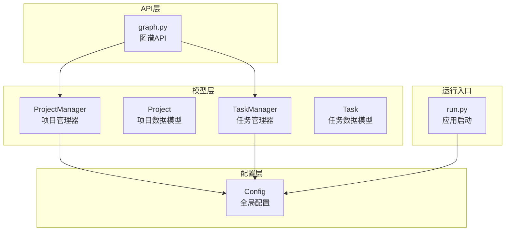
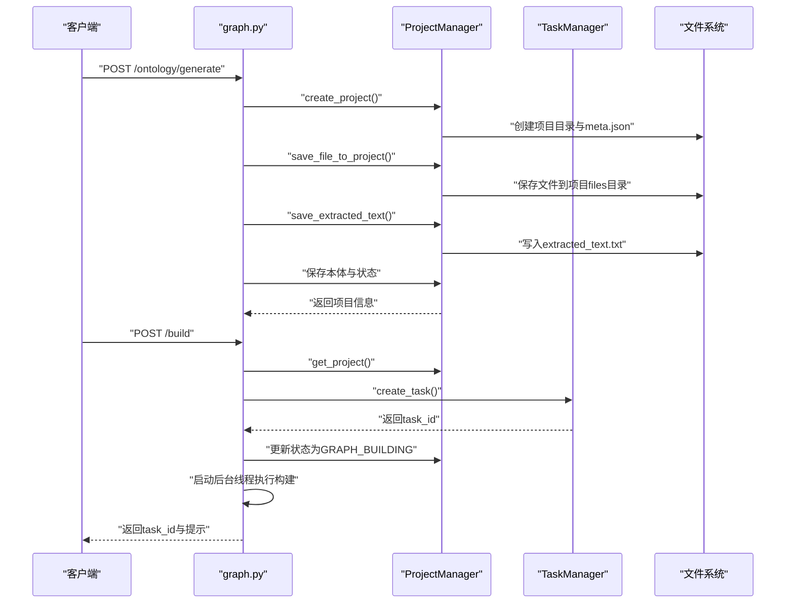
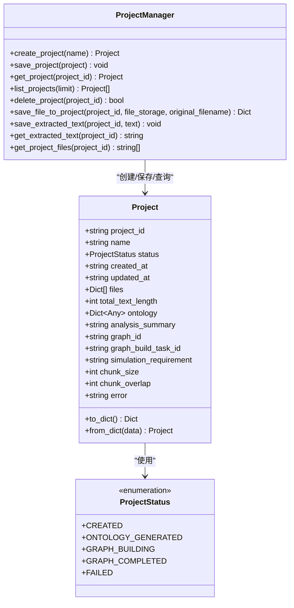
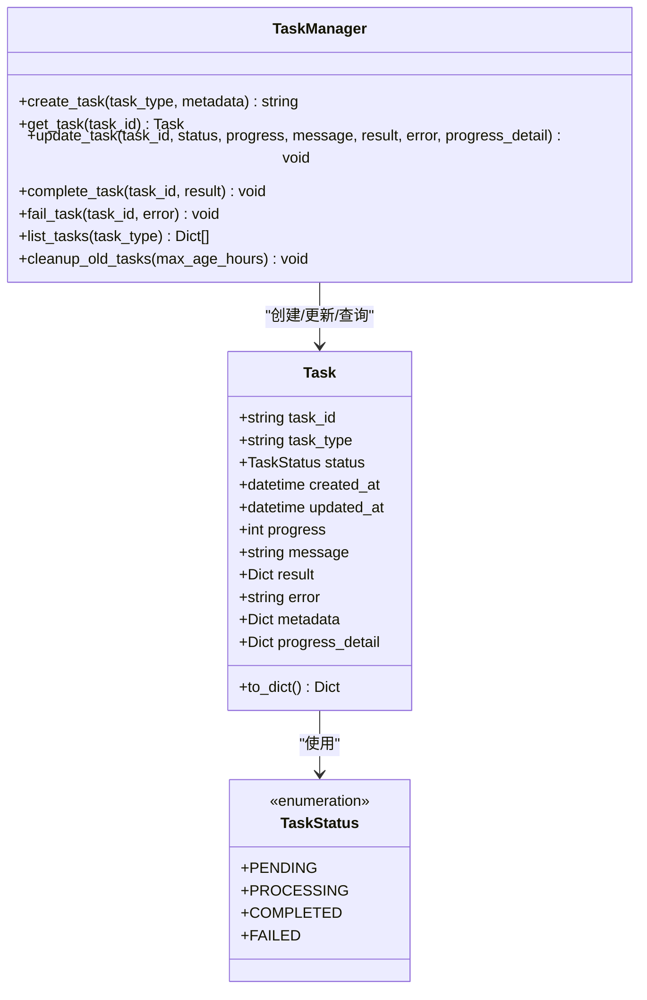
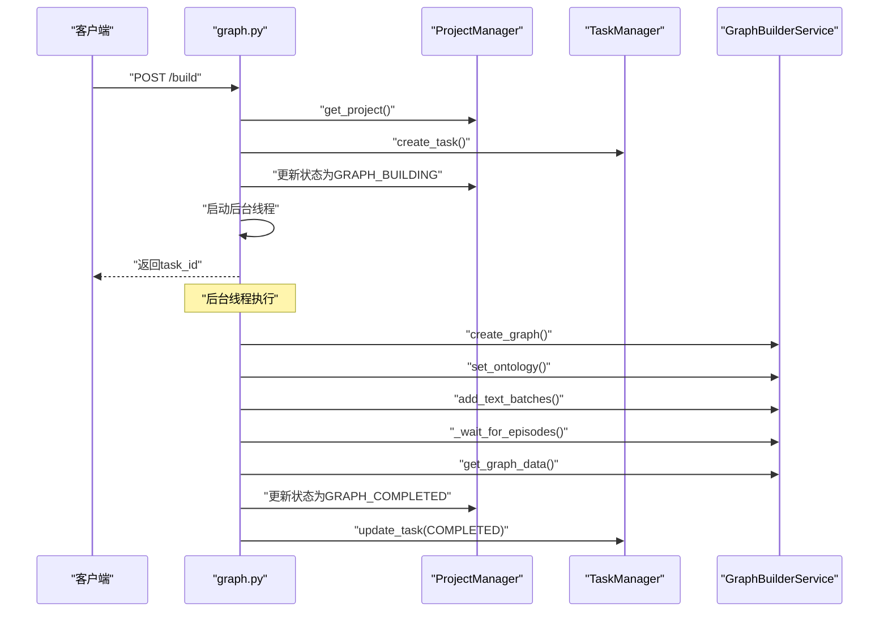
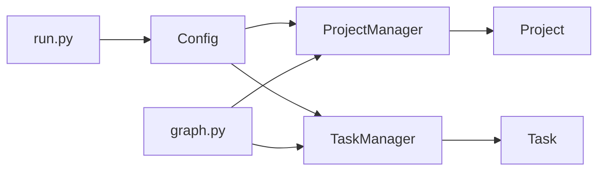

# 模型层设计

<cite>
**本文引用的文件**
- [backend/app/models/__init__.py](file://backend/app/models/__init__.py)
- [backend/app/models/project.py](file://backend/app/models/project.py)
- [backend/app/models/task.py](file://backend/app/models/task.py)
- [backend/app/config.py](file://backend/app/config.py)
- [backend/app/api/graph.py](file://backend/app/api/graph.py)
- [backend/run.py](file://backend/run.py)
</cite>

## 目录
1. [简介](#简介)
2. [项目结构](#项目结构)
3. [核心组件](#核心组件)
4. [架构总览](#架构总览)
5. [详细组件分析](#详细组件分析)
6. [依赖关系分析](#依赖关系分析)
7. [性能考量](#性能考量)
8. [故障排查指南](#故障排查指南)
9. [结论](#结论)
10. [附录](#附录)

## 简介
本文件面向MiroFish模型层设计，聚焦于数据模型的设计原则与ORM映射策略，系统性阐述Project与Task两大核心数据模型的字段定义、关系映射、约束规则，以及模型生命周期管理（创建、更新、查询、删除）。同时，结合现有代码实现，给出模型扩展的最佳实践（字段新增、索引优化、查询优化）、数据验证与业务规则的实现方式，以及模型层的安全考虑（SQL注入防护、数据访问控制）。

需要特别说明的是：当前仓库中模型层采用纯Python数据类与文件系统持久化方案，未使用传统关系型数据库ORM（如SQLAlchemy）。Project通过JSON文件与本地目录进行持久化，Task通过内存字典与线程锁实现进程内状态管理。因此，本文在“ORM映射策略”部分将以概念性方式呈现，帮助读者理解如何将现有实现迁移到ORM方案。

## 项目结构
模型层位于后端Python包的app/models目录下，主要由以下文件构成：
- models/__init__.py：导出模型类与状态枚举，统一对外暴露接口
- models/project.py：Project与ProjectManager，负责项目元数据与文件/文本的本地持久化
- models/task.py：Task与TaskManager，负责长时间运行任务的状态管理
- config.py：全局配置，提供上传目录、文件类型限制等
- api/graph.py：图谱相关API，展示模型在服务层的使用方式
- run.py：应用启动入口，负责配置校验与服务启动

图表来源
- [backend/app/models/project.py](file://backend/app/models/project.py#L101-L305)
- [backend/app/models/task.py](file://backend/app/models/task.py#L54-L185)
- [backend/app/config.py](file://backend/app/config.py#L20-L76)
- [backend/app/api/graph.py](file://backend/app/api/graph.py#L1-L200)
- [backend/run.py](file://backend/run.py#L25-L50)

章节来源
- [backend/app/models/__init__.py](file://backend/app/models/__init__.py#L1-L9)
- [backend/app/models/project.py](file://backend/app/models/project.py#L1-L306)
- [backend/app/models/task.py](file://backend/app/models/task.py#L1-L185)
- [backend/app/config.py](file://backend/app/config.py#L1-L76)
- [backend/app/api/graph.py](file://backend/app/api/graph.py#L1-L200)
- [backend/run.py](file://backend/run.py#L1-L51)

## 核心组件
- Project与ProjectManager：负责项目元数据、文件与抽取文本的本地持久化；支持创建、保存、查询、列表、删除、文件保存与文本读写等操作。
- Task与TaskManager：负责任务生命周期管理，支持创建、查询、更新（状态、进度、消息、结果、错误、详细进度）、完成、失败、列表与过期清理。
- Config：集中管理上传目录、文件类型、LLM/Zep配置、默认分块参数等，为模型层提供基础配置支撑。
- API层：graph.py展示了模型在真实业务流程中的使用，包括本体生成、图谱构建、任务查询与图谱数据获取。

章节来源
- [backend/app/models/project.py](file://backend/app/models/project.py#L26-L305)
- [backend/app/models/task.py](file://backend/app/models/task.py#L22-L185)
- [backend/app/config.py](file://backend/app/config.py#L20-L76)
- [backend/app/api/graph.py](file://backend/app/api/graph.py#L35-L117)

## 架构总览
模型层采用“数据类+文件系统”的轻量持久化方案，避免引入复杂ORM依赖。ProjectManager通过JSON文件与本地目录组织项目数据，TaskManager通过内存字典与线程锁保证并发安全。API层通过graph.py协调模型与服务层，形成清晰的职责边界。

图表来源
- [backend/app/api/graph.py](file://backend/app/api/graph.py#L121-L255)
- [backend/app/api/graph.py](file://backend/app/api/graph.py#L259-L525)
- [backend/app/models/project.py](file://backend/app/models/project.py#L133-L175)
- [backend/app/models/task.py](file://backend/app/models/task.py#L73-L99)

## 详细组件分析

### Project与ProjectManager：项目数据模型与持久化
- 设计原则
  - 使用dataclass承载项目元数据，便于序列化/反序列化与类型安全
  - 通过ProjectManager封装文件系统操作，隔离I/O细节
  - 将项目状态、文件信息、本体信息、图谱信息、配置与错误信息统一管理
- 字段定义与语义
  - 标识与时间：project_id、created_at、updated_at
  - 基本信息：name、status（ProjectStatus枚举）
  - 文件与文本：files（原始文件名、保存文件名、大小）、total_text_length
  - 本体与分析：ontology（实体类型、关系类型、分析摘要）、analysis_summary
  - 图谱信息：graph_id、graph_build_task_id
  - 配置：simulation_requirement、chunk_size、chunk_overlap
  - 错误信息：error
- 关系映射
  - 一对一：Project与graph_id（Zep图谱ID）
  - 一对多：Project与files（多个上传文件）
  - 一对多：Project与graph_build_task_id（一次构建对应一个任务ID）
- 生命周期管理
  - 创建：create_project()生成唯一ID、初始化状态与时间戳，创建目录结构并保存元数据
  - 更新：save_project()更新updated_at并写回JSON
  - 查询：get_project()读取meta.json并反序列化；list_projects()遍历目录并排序
  - 删除：delete_project()递归删除项目目录
  - 文件与文本：save_file_to_project()保存文件并返回信息；save_extracted_text()/get_extracted_text()读写抽取文本
- 约束规则
  - 文件扩展名白名单：Config.ALLOWED_EXTENSIONS
  - 项目状态枚举：ProjectStatus，确保状态值合法
  - 任务ID与图谱ID一致性：构建前检查状态，避免重复提交
- 安全考虑
  - 文件名安全：使用UUID生成安全文件名，避免路径穿越
  - 目录隔离：每个项目独立目录，降低跨项目影响
  - 输入校验：API层对simulation_requirement、文件列表进行校验

图表来源
- [backend/app/models/project.py](file://backend/app/models/project.py#L26-L98)
- [backend/app/models/project.py](file://backend/app/models/project.py#L101-L305)

章节来源
- [backend/app/models/project.py](file://backend/app/models/project.py#L17-L98)
- [backend/app/models/project.py](file://backend/app/models/project.py#L101-L305)
- [backend/app/config.py](file://backend/app/config.py#L38-L41)

### Task与TaskManager：任务状态管理
- 设计原则
  - 单例模式：TaskManager为全局唯一实例，避免多实例状态不一致
  - 线程安全：使用threading.Lock保护任务字典的并发访问
  - 内存持久化：任务状态驻留内存，适合短期任务生命周期
- 字段定义与语义
  - 标识与时间：task_id、created_at、updated_at
  - 类型与状态：task_type、status（TaskStatus枚举）
  - 进度与消息：progress（0-100）、message、progress_detail
  - 结果与错误：result、error
  - 元数据：metadata
- 生命周期管理
  - 创建：create_task()生成唯一ID并初始化状态
  - 查询：get_task()按ID获取任务
  - 更新：update_task()原子性地更新状态、进度、消息、结果、错误与详细进度
  - 完成/失败：complete_task()/fail_task()便捷方法
  - 清理：cleanup_old_tasks()按创建时间清理已完成/失败任务
  - 列表：list_tasks()支持按类型过滤并按创建时间倒序
- 约束规则
  - 状态枚举：TaskStatus，确保状态值合法
  - 进度范围：0-100
  - 并发安全：通过锁保证多线程下的数据一致性
- 安全考虑
  - 线程安全：内部使用锁，避免竞态条件
  - 过期清理：定期清理旧任务，防止内存泄漏

图表来源
- [backend/app/models/task.py](file://backend/app/models/task.py#L22-L51)
- [backend/app/models/task.py](file://backend/app/models/task.py#L54-L185)

章节来源
- [backend/app/models/task.py](file://backend/app/models/task.py#L14-L51)
- [backend/app/models/task.py](file://backend/app/models/task.py#L54-L185)

### API层与模型交互：本体生成与图谱构建
- 本体生成流程
  - 校验输入：simulation_requirement必填、至少上传一个文件
  - 创建项目：ProjectManager.create_project()
  - 保存文件：ProjectManager.save_file_to_project()，记录原始文件名与大小
  - 抽取与预处理：FileParser.extract_text() + TextProcessor.preprocess_text()
  - 生成本体：OntologyGenerator.generate()，保存到Project.ontology
  - 更新状态：Project.status = ONTOLOGY_GENERATED
- 图谱构建流程
  - 校验配置：ZEP_API_KEY
  - 获取项目：ProjectManager.get_project()
  - 校验状态：必须为ONTOLOGY_GENERATED或强制重建
  - 创建任务：TaskManager.create_task()，记录task_id
  - 更新项目状态：Project.status = GRAPH_BUILDING
  - 后台线程执行：分块、创建图谱、设置本体、批量添加文本、等待处理、获取数据
  - 成功/失败：更新Project状态与Task状态，记录结果/错误

图表来源
- [backend/app/api/graph.py](file://backend/app/api/graph.py#L259-L525)
- [backend/app/models/project.py](file://backend/app/models/project.py#L177-L195)
- [backend/app/models/task.py](file://backend/app/models/task.py#L106-L163)

章节来源
- [backend/app/api/graph.py](file://backend/app/api/graph.py#L119-L255)
- [backend/app/api/graph.py](file://backend/app/api/graph.py#L259-L525)

## 依赖关系分析
- 模型层依赖
  - ProjectManager依赖Config.UPLOAD_FOLDER与ALLOWED_EXTENSIONS，确保文件系统路径与文件类型安全
  - TaskManager依赖datetime与threading，保证任务时间戳与并发安全
- API层依赖
  - graph.py同时依赖ProjectManager与TaskManager，协调项目状态与任务进度
  - run.py在启动前调用Config.validate()进行配置校验
- 耦合与内聚
  - 模型层内部耦合度低，Project与Task职责清晰
  - API层通过Manager类解耦具体实现，便于替换与扩展

图表来源
- [backend/app/config.py](file://backend/app/config.py#L20-L76)
- [backend/app/models/project.py](file://backend/app/models/project.py#L101-L120)
- [backend/app/models/task.py](file://backend/app/models/task.py#L54-L71)
- [backend/app/api/graph.py](file://backend/app/api/graph.py#L18-L19)
- [backend/run.py](file://backend/run.py#L27-L34)

章节来源
- [backend/app/config.py](file://backend/app/config.py#L20-L76)
- [backend/app/models/project.py](file://backend/app/models/project.py#L101-L120)
- [backend/app/models/task.py](file://backend/app/models/task.py#L54-L71)
- [backend/app/api/graph.py](file://backend/app/api/graph.py#L18-L19)
- [backend/run.py](file://backend/run.py#L27-L34)

## 性能考量
- I/O开销
  - ProjectManager频繁读写JSON与文件，建议在高并发场景下增加缓存层（如内存缓存最近访问的项目元数据）
- 内存占用
  - TaskManager将任务状态驻留内存，建议定期清理已完成/失败任务（默认24小时）
- 线程安全
  - TaskManager使用锁保护任务字典，避免高并发下的竞态条件
- 序列化成本
  - Project与Task均提供to_dict/from_dict，建议在高频调用场景下减少不必要的序列化/反序列化

[本节为通用性能建议，无需特定文件引用]

## 故障排查指南
- 配置错误
  - run.py在启动前调用Config.validate()，若缺少LLM_API_KEY或ZEP_API_KEY会打印错误并终止
- 项目不存在
  - graph.py在查询/删除/重置项目时，若项目不存在返回404
- 文件上传失败
  - 仅允许Config.ALLOWED_EXTENSIONS中的扩展名；若无文件或全部无效，返回400
- 图谱构建异常
  - 构建过程中捕获异常并更新Project.status为FAILED，同时Task状态更新为FAILED
- 任务查询
  - 若task_id不存在，返回404

章节来源
- [backend/run.py](file://backend/run.py#L27-L34)
- [backend/app/api/graph.py](file://backend/app/api/graph.py#L35-L117)
- [backend/app/api/graph.py](file://backend/app/api/graph.py#L160-L173)
- [backend/app/api/graph.py](file://backend/app/api/graph.py#L490-L505)
- [backend/app/api/graph.py](file://backend/app/api/graph.py#L529-L545)

## 结论
MiroFish模型层采用轻量级的数据类与文件系统持久化方案，实现了清晰的职责划分与良好的可维护性。ProjectManager与TaskManager分别承担项目与任务的生命周期管理，API层通过graph.py将二者有机整合。对于扩展与迁移，建议在保持现有接口不变的前提下，逐步引入ORM（如SQLAlchemy）以提升查询性能与事务一致性，并配套引入索引与缓存策略以优化性能。

[本节为总结性内容，无需特定文件引用]

## 附录

### 字段与约束速查
- Project字段要点
  - 标识与时间：project_id、created_at、updated_at
  - 状态：ProjectStatus枚举
  - 文件：files（原始文件名、保存文件名、大小）
  - 本体：ontology（实体类型、关系类型、分析摘要）
  - 图谱：graph_id、graph_build_task_id
  - 配置：simulation_requirement、chunk_size、chunk_overlap
  - 错误：error
- Task字段要点
  - 标识与时间：task_id、created_at、updated_at
  - 状态：TaskStatus枚举
  - 进度：progress（0-100）、progress_detail
  - 结果与错误：result、error
  - 元数据：metadata

章节来源
- [backend/app/models/project.py](file://backend/app/models/project.py#L26-L98)
- [backend/app/models/task.py](file://backend/app/models/task.py#L22-L51)

### ORM映射策略（概念性建议）
- 实体映射
  - Project映射至项目表，字段一一对应；files可映射为关联表或JSON字段
  - Task映射至任务表，字段一一对应
- 关系映射
  - Project与Task：一对多（一个项目可有多个任务）
  - Project与Graph（外部系统）：一对一（graph_id为外部系统标识）
- 约束与索引
  - 为project_id、task_id建立唯一索引
  - 为status、created_at建立复合索引以优化查询
- 事务与并发
  - 使用ORM事务保证一致性
  - 对高频查询结果引入缓存（如Redis）

[本节为概念性建议，无需特定文件引用]