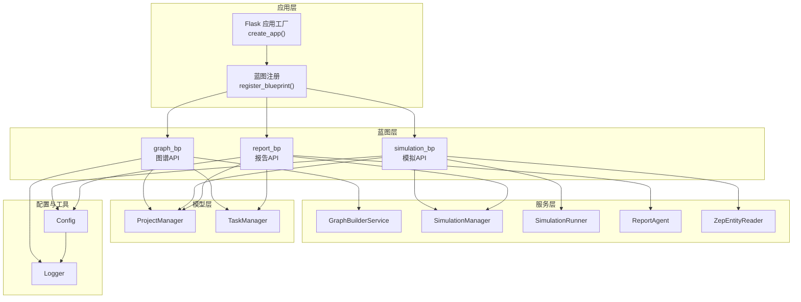
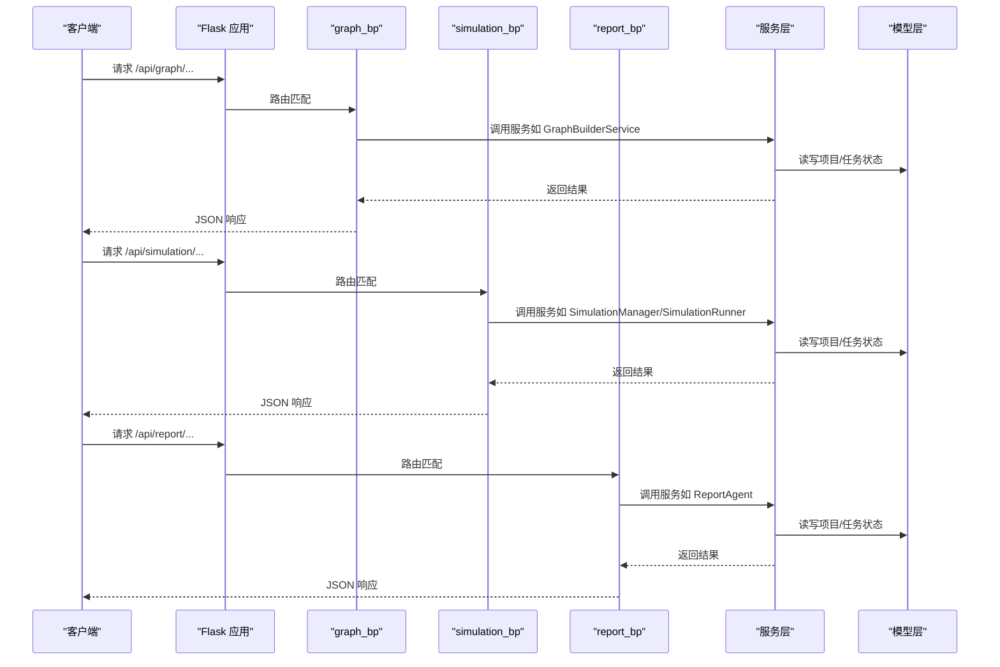
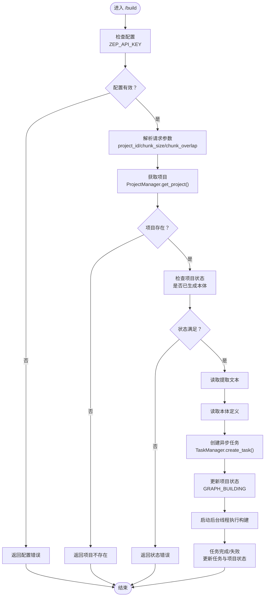
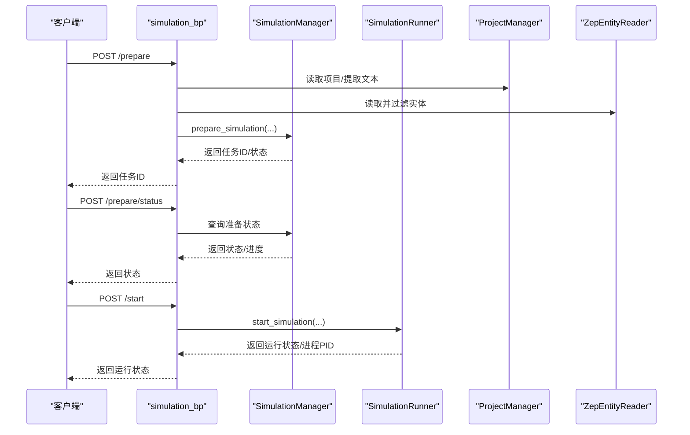
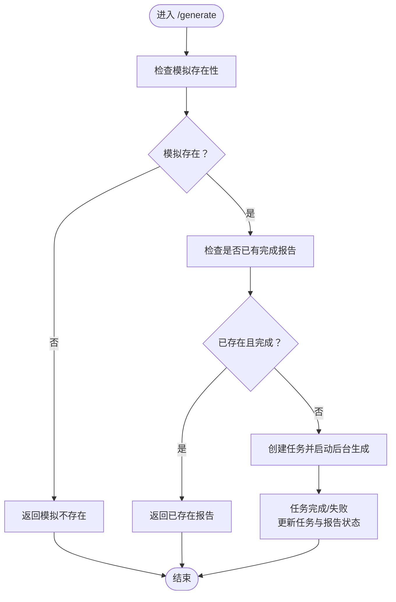
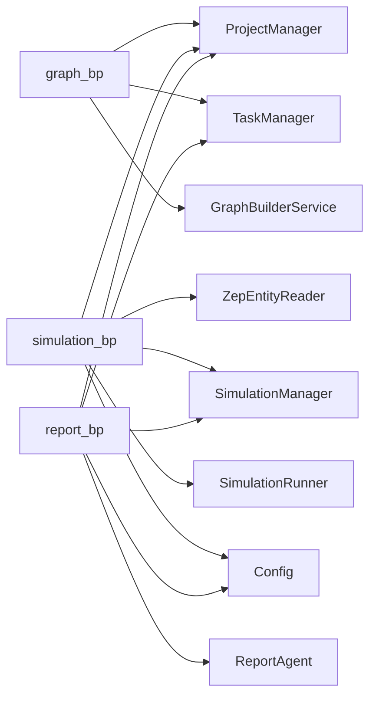

# 蓝图组织结构

<cite>
**本文引用的文件**
- [backend/app/api/__init__.py](file://backend/app/api/__init__.py)
- [backend/app/api/graph.py](file://backend/app/api/graph.py)
- [backend/app/api/simulation.py](file://backend/app/api/simulation.py)
- [backend/app/api/report.py](file://backend/app/api/report.py)
- [backend/app/__init__.py](file://backend/app/__init__.py)
- [backend/app/config.py](file://backend/app/config.py)
- [backend/app/models/project.py](file://backend/app/models/project.py)
- [backend/app/models/task.py](file://backend/app/models/task.py)
- [backend/run.py](file://backend/run.py)
</cite>

## 目录
1. [简介](#简介)
2. [项目结构](#项目结构)
3. [核心组件](#核心组件)
4. [架构总览](#架构总览)
5. [详细组件分析](#详细组件分析)
6. [依赖关系分析](#依赖关系分析)
7. [性能考量](#性能考量)
8. [故障排查指南](#故障排查指南)
9. [结论](#结论)

## 简介
本文件系统性梳理 MiroFish 项目的 Flask 蓝图组织结构，重点围绕三个核心 API 蓝图：
- graph_bp：图谱相关操作（本体生成、图谱构建、任务查询、数据获取与删除）
- simulation_bp：模拟管理（实体读取、模拟准备、运行控制、配置与脚本下载）
- report_bp：报告生成与交互（报告生成、进度查询、章节获取、对话与日志）

文档将解释蓝图的设计理念、注册机制、路由组织、业务边界、错误处理与中间件应用，并给出蓝图扩展的最佳实践及蓝图间的数据传递与依赖关系说明。

## 项目结构
MiroFish 后端采用 Flask 应用工厂模式，蓝图在独立模块中定义并通过应用工厂集中注册。蓝图各自维护独立的路由装饰器与视图函数，通过共享的服务层与模型层实现数据持久化与跨蓝图协作。

图表来源
- [backend/app/__init__.py](file://backend/app/__init__.py#L65-L69)
- [backend/app/api/__init__.py](file://backend/app/api/__init__.py#L7-L13)
- [backend/app/config.py](file://backend/app/config.py#L20-L76)

章节来源
- [backend/app/__init__.py](file://backend/app/__init__.py#L19-L81)
- [backend/app/api/__init__.py](file://backend/app/api/__init__.py#L1-L15)

## 核心组件
- 蓝图定义与导入：在蓝图模块中定义 Blueprint 实例并在模块末尾导入对应视图函数，避免循环导入。
- 应用工厂注册：在应用工厂中集中注册蓝图，使用 url_prefix 组织 API 命名空间。
- 服务层解耦：各蓝图通过服务层访问底层能力（如图谱构建、模拟管理、报告生成）。
- 模型层持久化：项目状态、任务状态等通过模型层进行持久化与查询。
- 中间件与日志：全局请求/响应日志中间件与 CORS 配置统一在应用工厂中设置。

章节来源
- [backend/app/api/__init__.py](file://backend/app/api/__init__.py#L7-L13)
- [backend/app/__init__.py](file://backend/app/__init__.py#L65-L69)
- [backend/app/models/project.py](file://backend/app/models/project.py#L101-L196)
- [backend/app/models/task.py](file://backend/app/models/task.py#L54-L100)

## 架构总览
蓝图注册与路由前缀如下：
- graph_bp：url_prefix="/api/graph"
- simulation_bp：url_prefix="/api/simulation"
- report_bp：url_prefix="/api/report"

蓝图内部路由通过 @bp.route 装饰器声明，视图函数负责参数解析、调用服务层、返回统一 JSON 响应，并记录日志与错误。

图表来源
- [backend/app/__init__.py](file://backend/app/__init__.py#L65-L69)
- [backend/app/api/graph.py](file://backend/app/api/graph.py#L35-L52)
- [backend/app/api/simulation.py](file://backend/app/api/simulation.py#L47-L89)
- [backend/app/api/report.py](file://backend/app/api/report.py#L24-L48)

## 详细组件分析

### graph_bp（图谱蓝图）
- 设计理念：采用“项目上下文”机制，服务端持久化状态，避免前端在接口间传递大量数据。
- 主要职责：
  - 项目管理：创建、查询、删除、重置项目
  - 本体生成：上传文件、抽取文本、调用 LLM 生成本体定义
  - 图谱构建：分块文本、创建图谱、设置本体、批量添加文本、等待处理完成、获取数据
  - 任务管理：创建异步任务、查询任务状态、列出任务
  - 数据接口：获取图谱数据、删除图谱
- 路由组织：
  - 项目管理：/project/<project_id>、/project/list、/project/<project_id>/reset、/project/<project_id>/delete
  - 本体生成：/ontology/generate
  - 图谱构建：/build
  - 任务查询：/task/<task_id>、/tasks
  - 数据接口：/data/<graph_id>、/delete/<graph_id>
- 视图函数组织：每个路由对应一个视图函数，参数校验、异常捕获、统一返回 JSON；使用线程池/线程执行耗时任务，避免阻塞请求。
- 错误处理：捕获异常并返回统一错误结构，记录 traceback；对缺失配置（如 ZEP_API_KEY）进行前置校验。
- 依赖关系：依赖 ProjectManager、TaskManager、GraphBuilderService、TextProcessor、FileParser、Zep 等。

图表来源
- [backend/app/api/graph.py](file://backend/app/api/graph.py#L282-L525)
- [backend/app/models/project.py](file://backend/app/models/project.py#L177-L196)
- [backend/app/models/task.py](file://backend/app/models/task.py#L73-L99)

章节来源
- [backend/app/api/graph.py](file://backend/app/api/graph.py#L35-L117)
- [backend/app/api/graph.py](file://backend/app/api/graph.py#L121-L255)
- [backend/app/api/graph.py](file://backend/app/api/graph.py#L259-L525)
- [backend/app/api/graph.py](file://backend/app/api/graph.py#L529-L618)

### simulation_bp（模拟蓝图）
- 设计理念：端到端自动化，从图谱实体读取、过滤，到 OASIS 模拟准备与运行，支持多平台（Twitter/Reddit/并行）。
- 主要职责：
  - 实体读取：按 graph_id 读取实体、按类型筛选、获取实体详情
  - 模拟准备：异步准备（实体人设生成、配置生成、脚本准备），支持强制重新生成与进度查询
  - 模拟运行：启动/停止/重启模拟，支持图谱记忆更新（将 Agent 活动写回 Zep）
  - 配置与脚本：获取/下载模拟配置，下载通用脚本
  - 历史与概览：获取历史模拟列表，增强项目/配置/运行状态信息
- 路由组织：
  - 实体读取：/entities/<graph_id>、/entities/<graph_id>/<entity_uuid>、/entities/<graph_id>/by-type/<entity_type>
  - 模拟准备：/create、/prepare、/prepare/status
  - 模拟运行：/start、/stop、/restart、/status
  - 配置与脚本：/config、/config/download、/script/<script_name>/download
  - 历史与概览：/history、/list
- 视图函数组织：大量异步任务通过线程执行，使用 TaskManager 管理进度；提供实时/非实时接口以满足不同场景。
- 错误处理：前置校验（ZEP_API_KEY、参数完整性）、状态检查（准备完成/运行中/失败）、异常捕获与统一返回。
- 依赖关系：依赖 ZepEntityReader、OasisProfileGenerator、SimulationManager、SimulationRunner、ProjectManager、TaskManager 等。

图表来源
- [backend/app/api/simulation.py](file://backend/app/api/simulation.py#L164-L237)
- [backend/app/api/simulation.py](file://backend/app/api/simulation.py#L358-L635)
- [backend/app/api/simulation.py](file://backend/app/api/simulation.py#L1446-L1599)

章节来源
- [backend/app/api/simulation.py](file://backend/app/api/simulation.py#L47-L160)
- [backend/app/api/simulation.py](file://backend/app/api/simulation.py#L164-L237)
- [backend/app/api/simulation.py](file://backend/app/api/simulation.py#L358-L748)
- [backend/app/api/simulation.py](file://backend/app/api/simulation.py#L871-L983)
- [backend/app/api/simulation.py](file://backend/app/api/simulation.py#L1446-L1599)

### report_bp（报告蓝图）
- 设计理念：基于模拟结果生成分析报告，支持异步生成、进度查询、章节分发、对话问答与日志追踪。
- 主要职责：
  - 报告生成：异步生成报告，支持强制重新生成与进度查询
  - 报告获取：按 report_id 获取报告详情、按模拟ID获取报告、列出报告
  - 章节与下载：分章节获取、单章获取、Markdown 下载
  - 对话与日志：与 Report Agent 对话、获取 Agent 日志与控制台日志
  - 工具接口：图谱搜索、统计工具（供调试）
- 路由组织：
  - 报告生成：/generate、/generate/status
  - 报告获取：/<report_id>、/by-simulation/<simulation_id>、/list
  - 下载与删除：/<report_id>/download、/<report_id>、/<report_id>/delete
  - 对话与日志：/chat、/<report_id>/progress、/<report_id>/sections、/<report_id>/section/<int>
  - 工具接口：/tools/search、/tools/statistics
- 视图函数组织：异步任务通过线程执行，使用 TaskManager 管理进度；ReportAgent 负责生成与对话。
- 错误处理：前置校验（模拟/项目存在性、图谱ID、配置完整性）、异常捕获与统一返回。
- 依赖关系：依赖 ReportAgent、ReportManager、SimulationManager、ProjectManager、TaskManager、ZepTools 等。

图表来源
- [backend/app/api/report.py](file://backend/app/api/report.py#L24-L196)
- [backend/app/api/report.py](file://backend/app/api/report.py#L198-L268)

章节来源
- [backend/app/api/report.py](file://backend/app/api/report.py#L24-L196)
- [backend/app/api/report.py](file://backend/app/api/report.py#L198-L268)
- [backend/app/api/report.py](file://backend/app/api/report.py#L272-L463)
- [backend/app/api/report.py](file://backend/app/api/report.py#L467-L560)
- [backend/app/api/report.py](file://backend/app/api/report.py#L564-L749)
- [backend/app/api/report.py](file://backend/app/api/report.py#L800-L1016)

## 依赖关系分析
- 蓝图注册：应用工厂集中注册三个蓝图，分别绑定 url_prefix，形成清晰的命名空间隔离。
- 服务层依赖：各蓝图通过服务层访问底层能力，避免直接耦合第三方 SDK 或外部系统。
- 模型层依赖：项目状态、任务状态等通过模型层持久化，蓝图仅通过 Manager 类访问。
- 配置依赖：Config 统一加载 .env，蓝图在运行时读取必要配置（如 ZEP_API_KEY、LLM 配置）。
- 中间件依赖：CORS 全局开启，请求/响应日志中间件统一记录。

图表来源
- [backend/app/api/graph.py](file://backend/app/api/graph.py#L11-L22)
- [backend/app/api/simulation.py](file://backend/app/api/simulation.py#L10-L19)
- [backend/app/api/report.py](file://backend/app/api/report.py#L11-L19)
- [backend/app/config.py](file://backend/app/config.py#L20-L76)

章节来源
- [backend/app/__init__.py](file://backend/app/__init__.py#L42-L69)
- [backend/app/config.py](file://backend/app/config.py#L20-L76)

## 性能考量
- 异步任务：图谱构建、模拟准备、报告生成均通过线程/任务管理器异步执行，避免阻塞请求。
- 进度回调：服务层提供进度回调，蓝图通过 TaskManager 实时更新任务状态，前端轮询即可获知进度。
- 资源清理：应用工厂注册模拟进程清理函数，确保服务器关闭时终止所有模拟进程，避免僵尸进程。
- 日志与监控：统一日志器记录请求/响应与关键步骤，便于定位性能瓶颈与异常。

章节来源
- [backend/app/__init__.py](file://backend/app/__init__.py#L45-L49)
- [backend/app/models/task.py](file://backend/app/models/task.py#L106-L144)

## 故障排查指南
- 配置错误：检查 .env 中 LLM_API_KEY、ZEP_API_KEY 等必要配置项是否正确设置。
- 蓝图路由：确认应用工厂中蓝图注册顺序与 url_prefix 是否正确。
- 任务状态：通过 /task/<task_id> 或 /prepare/status、/generate/status 查询任务状态与进度详情。
- 错误返回：蓝图视图函数统一返回 JSON，包含 success、error、traceback 等字段，便于前端与运维定位问题。
- 日志查看：利用请求/响应日志中间件与服务层日志器，结合 TaskManager 的 progress_detail 获取详细进度信息。

章节来源
- [backend/app/config.py](file://backend/app/config.py#L66-L75)
- [backend/app/api/graph.py](file://backend/app/api/graph.py#L249-L255)
- [backend/app/api/simulation.py](file://backend/app/api/simulation.py#L628-L635)
- [backend/app/api/report.py](file://backend/app/api/report.py#L198-L268)

## 结论
MiroFish 的蓝图组织遵循 Flask 最佳实践：蓝图职责清晰、命名空间明确、注册集中、服务层解耦、模型层持久化。graph_bp、simulation_bp、report_bp 三者边界分明，通过服务层与模型层实现数据与状态的统一管理。蓝图扩展时建议：
- 保持 url_prefix 与路由命名一致性，避免冲突
- 使用 TaskManager 管理异步任务，提供进度回调
- 统一错误处理与日志记录，便于排障
- 在蓝图间传递数据时优先通过服务层与模型层，避免直接耦合