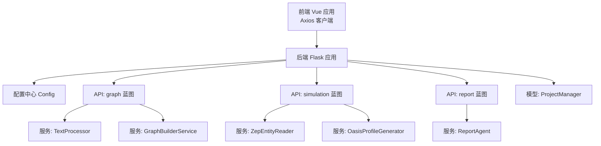
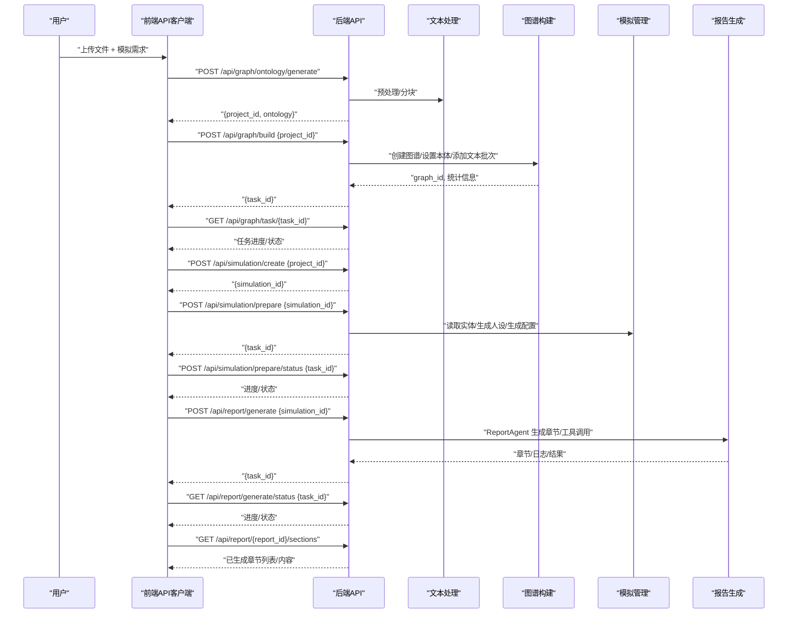
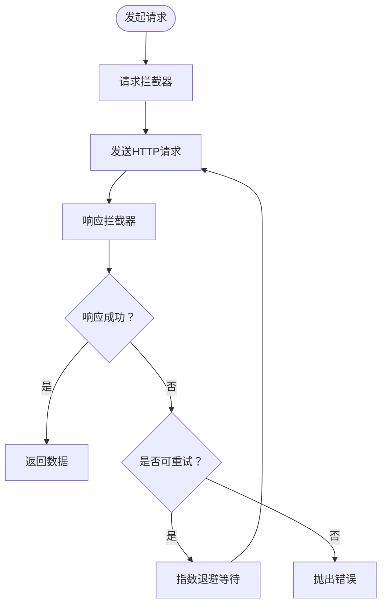
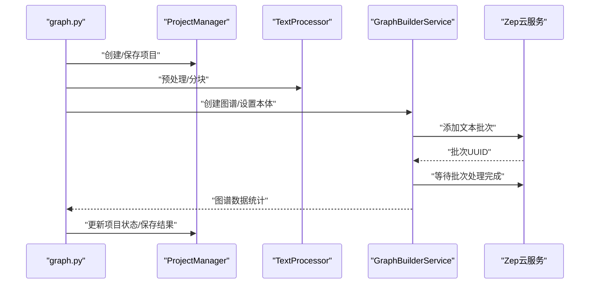
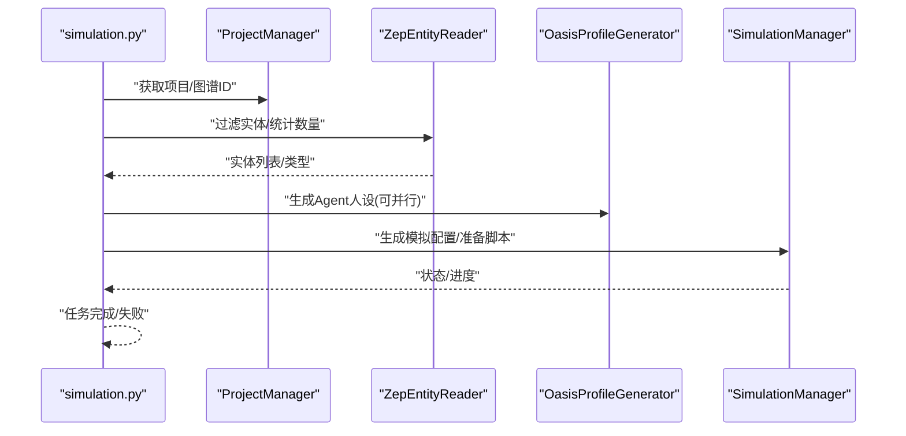
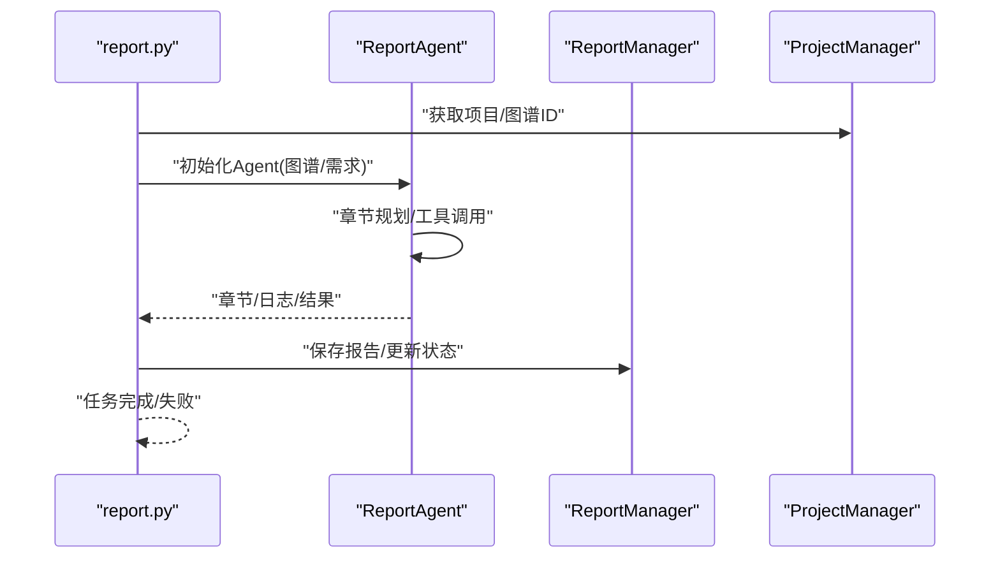
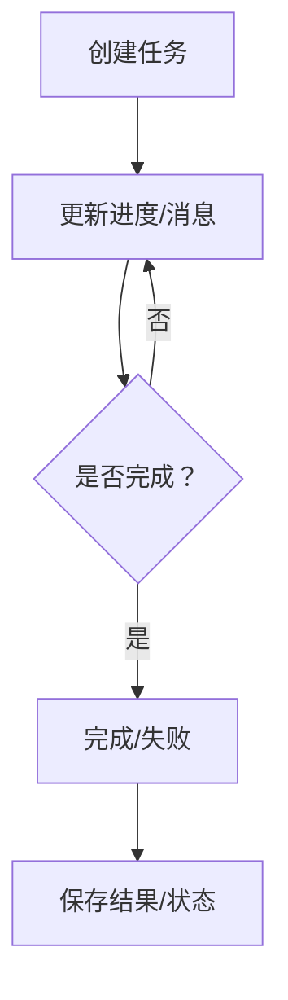
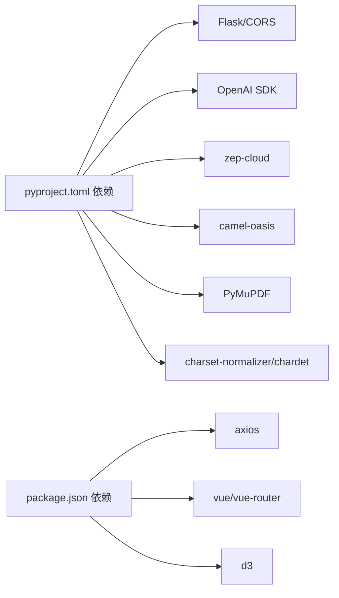

# 数据流设计

<cite>
**本文引用的文件**
- [README.md](file://README.md)
- [run.py](file://backend/run.py)
- [config.py](file://backend/app/config.py)
- [graph.py](file://backend/app/api/graph.py)
- [simulation.py](file://backend/app/api/simulation.py)
- [report.py](file://backend/app/api/report.py)
- [text_processor.py](file://backend/app/services/text_processor.py)
- [project.py](file://backend/app/models/project.py)
- [index.js](file://frontend/src/api/index.js)
- [graph.js](file://frontend/src/api/graph.js)
- [simulation.js](file://frontend/src/api/simulation.js)
- [report.js](file://frontend/src/api/report.js)
- [pyproject.toml](file://backend/pyproject.toml)
- [package.json](file://frontend/package.json)
</cite>

## 目录
1. [引言](#引言)
2. [项目结构](#项目结构)
3. [核心组件](#核心组件)
4. [架构总览](#架构总览)
5. [详细组件分析](#详细组件分析)
6. [依赖分析](#依赖分析)
7. [性能考虑](#性能考虑)
8. [故障排查指南](#故障排查指南)
9. [结论](#结论)
10. [附录](#附录)

## 引言
本文件面向MiroFish数据流设计，系统化梳理从“文件上传”到“最终报告输出”的完整数据流转过程，覆盖前端API客户端、HTTP请求处理机制、后端服务层的数据处理管道（文本预处理、图谱构建、模拟执行、报告生成）、异步任务管理与状态同步、数据验证与错误处理、缓存与性能优化、并发处理、数据安全与隐私保护等主题。目标是帮助开发者与产品人员快速理解端到端数据流，指导开发与运维实践。

## 项目结构
- 后端采用Flask微服务，按蓝图划分API域：graph、simulation、report；核心服务集中在app/services与app/api；配置集中于app/config.py；项目上下文持久化于app/models。
- 前端基于Vue 3与Axios，封装统一的API客户端与重试机制，分别对应graph、simulation、report三个业务域。
- 顶层README提供工作流程概览与部署指引，便于快速定位各阶段职责。

图表来源
- [graph.py](file://backend/app/api/graph.py#L1-L618)
- [simulation.py](file://backend/app/api/simulation.py#L1-L800)
- [report.py](file://backend/app/api/report.py#L1-L800)
- [text_processor.py](file://backend/app/services/text_processor.py#L1-L72)
- [project.py](file://backend/app/models/project.py#L1-L306)
- [config.py](file://backend/app/config.py#L1-L76)

章节来源
- [README.md](file://README.md#L81-L87)
- [run.py](file://backend/run.py#L1-L51)
- [config.py](file://backend/app/config.py#L1-L76)

## 核心组件
- 配置中心：集中管理LLM/Zep/OASIS等外部服务密钥、文件上传与文本处理参数、报告Agent配置等。
- 项目上下文：以项目为单位持久化状态（本体、图谱ID、任务ID、错误信息等），避免前端在接口间传递大量数据。
- 文本处理：负责文件解析、文本预处理、分块策略。
- 图谱构建：对接Zep，完成本体设置、文本分块入库、等待处理完成、拉取图谱数据。
- 模拟准备：从图谱读取实体、生成Agent人设、LLM生成模拟配置、准备脚本与资源。
- 报告生成：ReportAgent驱动章节级生成与工具调用，支持增量章节输出与对话交互。
- 前端API客户端：统一基地址、超时、拦截器与指数退避重试，适配长耗时任务轮询。

章节来源
- [config.py](file://backend/app/config.py#L20-L76)
- [project.py](file://backend/app/models/project.py#L17-L99)
- [text_processor.py](file://backend/app/services/text_processor.py#L9-L72)
- [graph.py](file://backend/app/api/graph.py#L119-L525)
- [simulation.py](file://backend/app/api/simulation.py#L358-L748)
- [report.py](file://backend/app/api/report.py#L24-L196)
- [index.js](file://frontend/src/api/index.js#L1-L68)
- [graph.js](file://frontend/src/api/graph.js#L1-L71)
- [simulation.js](file://frontend/src/api/simulation.js#L1-L188)
- [report.js](file://frontend/src/api/report.js#L1-L52)

## 架构总览
下图展示端到端数据流：前端上传文件与参数，后端生成本体、构建图谱、准备模拟、执行模拟、生成报告，期间通过任务管理器进行状态同步与进度反馈。

图表来源
- [graph.py](file://backend/app/api/graph.py#L119-L525)
- [simulation.py](file://backend/app/api/simulation.py#L164-L748)
- [report.py](file://backend/app/api/report.py#L24-L196)
- [graph.js](file://frontend/src/api/graph.js#L8-L34)
- [simulation.js](file://frontend/src/api/simulation.js#L7-L85)
- [report.js](file://frontend/src/api/report.js#L7-L17)

## 详细组件分析

### 前端API客户端设计与HTTP请求处理
- Axios实例：统一基地址、较长超时（适配本体生成等长任务）、JSON头。
- 请求拦截器：透传配置。
- 响应拦截器：校验success字段，非成功即抛错；网络/超时错误统一记录。
- 指数退避重试：封装requestWithRetry，支持最大重试次数与回退延迟。
- 业务API封装：graph.js/simulation.js/report.js分别导出对应方法，统一调用service与重试包装。

图表来源
- [index.js](file://frontend/src/api/index.js#L13-L65)

章节来源
- [index.js](file://frontend/src/api/index.js#L1-L68)
- [graph.js](file://frontend/src/api/graph.js#L1-L71)
- [simulation.js](file://frontend/src/api/simulation.js#L1-L188)
- [report.js](file://frontend/src/api/report.js#L1-L52)

### 后端API与服务层：文本预处理与图谱构建
- 本体生成：接收multipart/form-data，校验参数与文件类型，提取文本并预处理，调用本体生成器，保存项目状态与本体定义。
- 图谱构建：校验Zep密钥与项目状态，创建异步任务，分块文本、创建图谱、设置本体、批量添加文本、等待处理完成、拉取图谱数据，更新项目状态与任务结果。
- 任务查询：提供任务详情与列表查询，支持前端轮询进度。
- 图谱数据：获取节点/边统计，删除图谱。

图表来源
- [graph.py](file://backend/app/api/graph.py#L119-L525)
- [project.py](file://backend/app/models/project.py#L101-L306)
- [text_processor.py](file://backend/app/services/text_processor.py#L12-L34)

章节来源
- [graph.py](file://backend/app/api/graph.py#L119-L525)
- [project.py](file://backend/app/models/project.py#L101-L306)
- [text_processor.py](file://backend/app/services/text_processor.py#L9-L72)

### 模拟准备与执行：实体读取、人设生成、配置生成
- 实体读取：从Zep图谱过滤定义的实体类型，支持丰富边信息。
- 模拟准备：避免重复生成，同步预估实体数量，异步生成Agent人设与模拟配置，支持并行度与重试，提供阶段进度与明细。
- 模拟状态：提供创建、查询、列表、运行状态、时间线、动作历史、关闭环境等接口。

图表来源
- [simulation.py](file://backend/app/api/simulation.py#L358-L748)
- [project.py](file://backend/app/models/project.py#L101-L306)

章节来源
- [simulation.py](file://backend/app/api/simulation.py#L47-L160)
- [simulation.py](file://backend/app/api/simulation.py#L358-L748)

### 报告生成：章节级产出与对话交互
- 报告生成：异步任务，ReportAgent按章节规划与生成，支持进度回调、章节增量输出、下载Markdown。
- 对话交互：ReportAgent可检索图谱与模拟环境回答问题，支持聊天历史。
- 状态检查：前端可查询报告是否存在、是否完成，以解锁交互功能。

图表来源
- [report.py](file://backend/app/api/report.py#L24-L196)
- [project.py](file://backend/app/models/project.py#L101-L306)

章节来源
- [report.py](file://backend/app/api/report.py#L24-L196)
- [report.py](file://backend/app/api/report.py#L272-L463)
- [report.py](file://backend/app/api/report.py#L467-L560)

### 异步任务管理与状态同步
- 任务模型：任务ID、类型、状态、进度、消息、结果、错误、元数据等。
- 任务管理器：创建、更新、完成、失败、查询、列表。
- 状态同步：前端轮询任务接口，后端在后台线程推进步骤，更新任务状态与进度，必要时写入项目状态。

图表来源
- [graph.py](file://backend/app/api/graph.py#L363-L505)
- [simulation.py](file://backend/app/api/simulation.py#L489-L607)
- [report.py](file://backend/app/api/report.py#L112-L175)

章节来源
- [graph.py](file://backend/app/api/graph.py#L527-L560)
- [simulation.py](file://backend/app/api/simulation.py#L637-L748)
- [report.py](file://backend/app/api/report.py#L198-L268)

### 数据验证、错误处理与异常恢复
- 输入校验：文件类型白名单、必填参数校验、项目状态检查、配置完整性检查。
- 错误传播：统一返回success字段与错误信息；响应拦截器抛错；前端重试。
- 异常恢复：任务失败时更新项目状态与错误信息；准备阶段支持强制重新生成；图谱构建失败回滚状态。

章节来源
- [graph.py](file://backend/app/api/graph.py#L25-L31)
- [graph.py](file://backend/app/api/graph.py#L149-L255)
- [graph.py](file://backend/app/api/graph.py#L282-L525)
- [simulation.py](file://backend/app/api/simulation.py#L398-L635)
- [report.py](file://backend/app/api/report.py#L49-L196)
- [index.js](file://frontend/src/api/index.js#L23-L51)

### 数据缓存、性能优化与并发处理
- 文本分块：可配置chunk_size与overlap，减少LLM上下文压力。
- 并发策略：模拟准备阶段支持并行生成Agent人设；图谱构建批量添加文本。
- I/O优化：项目上下文持久化于本地文件系统，避免内存膨胀；报告章节增量输出，降低前端渲染压力。
- 外部服务：Zep与LLM调用均采用进度回调与阶段性日志，便于可观测与限流。

章节来源
- [config.py](file://backend/app/config.py#L43-L49)
- [text_processor.py](file://backend/app/services/text_processor.py#L18-L34)
- [simulation.py](file://backend/app/api/simulation.py#L578-L586)
- [graph.py](file://backend/app/api/graph.py#L435-L440)

### 数据安全、隐私保护与访问控制
- 环境变量：敏感配置（LLM/Zep密钥）集中于环境变量，避免硬编码。
- 文件上传：白名单扩展名、大小限制、安全命名与落盘；项目隔离目录。
- 传输安全：建议在生产环境启用HTTPS与反向代理；后端未内置鉴权中间件，建议在网关或反向代理层接入认证/授权。
- 日志与审计：任务与Agent日志可用于审计与排障，注意避免泄露敏感信息。

章节来源
- [config.py](file://backend/app/config.py#L30-L41)
- [graph.py](file://backend/app/api/graph.py#L25-L31)
- [project.py](file://backend/app/models/project.py#L241-L272)

## 依赖分析
- 后端依赖：Flask、CORS、OpenAI SDK、zep-cloud、camel-oasis、PyMuPDF、charset-normalizer、chardet、python-dotenv、pydantic等。
- 前端依赖：axios、vue、vue-router、d3等。

图表来源
- [pyproject.toml](file://backend/pyproject.toml#L11-L35)
- [package.json](file://frontend/package.json#L11-L21)

章节来源
- [pyproject.toml](file://backend/pyproject.toml#L1-L56)
- [package.json](file://frontend/package.json#L1-L22)

## 性能考虑
- 长任务超时：前端axios设置较长超时，适配本体生成与报告生成。
- 轮询策略：前端对任务状态与章节进行轮询，建议结合后端WebSocket或Server-Sent Events优化（当前未实现）。
- 批量与分块：图谱构建与人设生成采用批量/分块策略，降低单次调用成本。
- I/O与存储：项目上下文与报告章节落盘，避免内存峰值；建议使用SSD与合理磁盘配额。

## 故障排查指南
- 配置错误：启动时验证LLM/Zep密钥；若缺失，进程退出并提示。
- 任务失败：检查任务详情与后端日志；确认Zep可用性与网络连通性。
- 文件问题：确认扩展名在白名单内、大小未超过限制、编码可识别。
- 报告未生成：确认模拟已完成且图谱ID有效；检查ReportAgent日志与工具调用。

章节来源
- [run.py](file://backend/run.py#L25-L46)
- [config.py](file://backend/app/config.py#L66-L76)
- [graph.py](file://backend/app/api/graph.py#L282-L525)
- [simulation.py](file://backend/app/api/simulation.py#L398-L635)
- [report.py](file://backend/app/api/report.py#L49-L196)

## 结论
MiroFish通过清晰的阶段化数据流与异步任务管理，实现了从“种子材料”到“高保真数字世界”的自动化构建与预测。前端以Axios封装统一请求与重试，后端以蓝图与服务层解耦各阶段职责，项目上下文持久化保障跨接口状态一致性。建议在生产环境中完善鉴权、监控与可观测性，并评估引入事件推送以优化前端轮询体验。

## 附录
- 端到端工作流程参考：README中的“工作流程”章节。
- 启动与部署：README中的“快速开始”与“Docker部署”。

章节来源
- [README.md](file://README.md#L81-L87)
- [README.md](file://README.md#L149-L172)