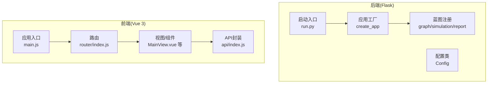
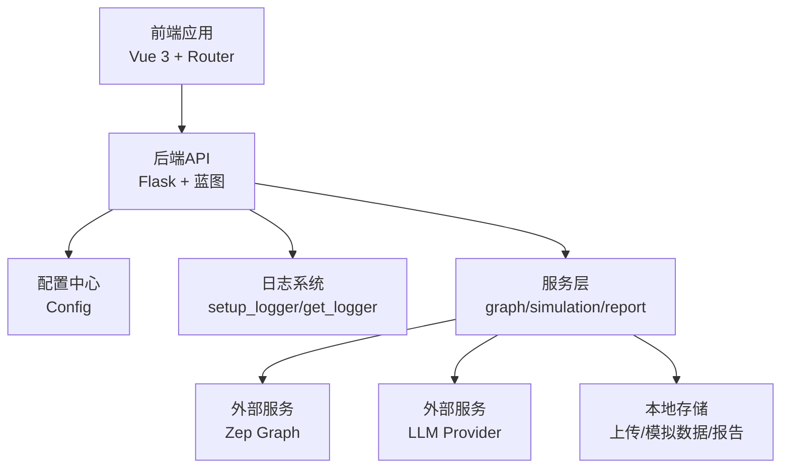
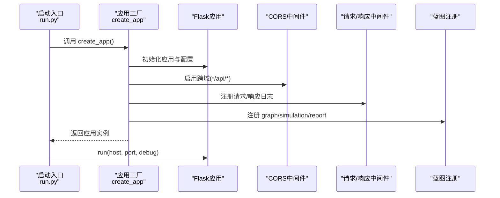
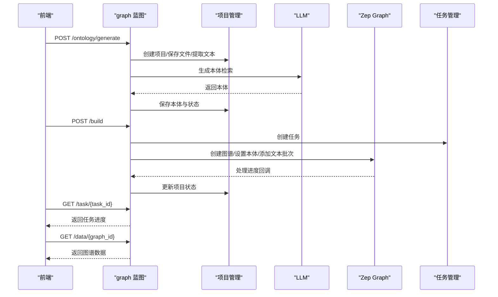
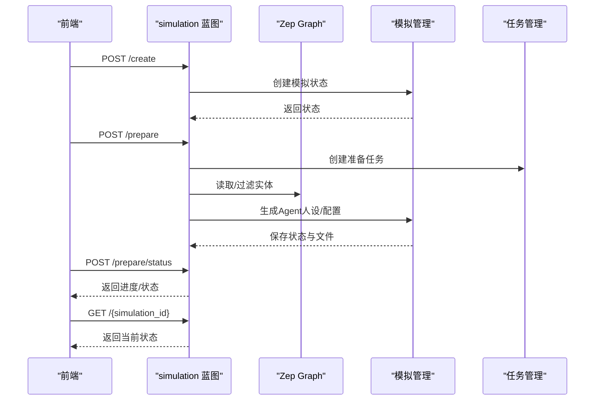
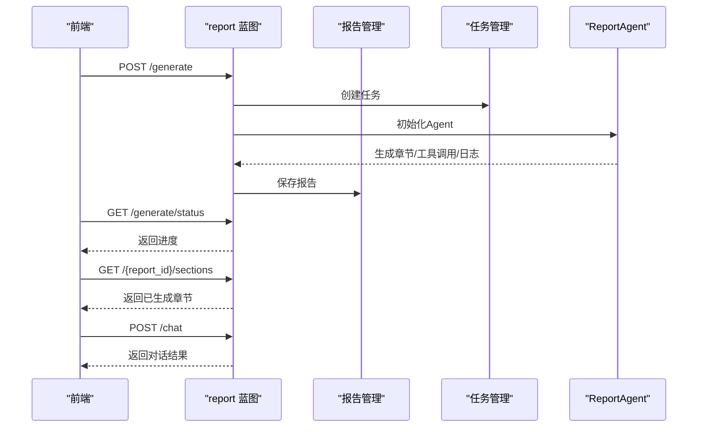
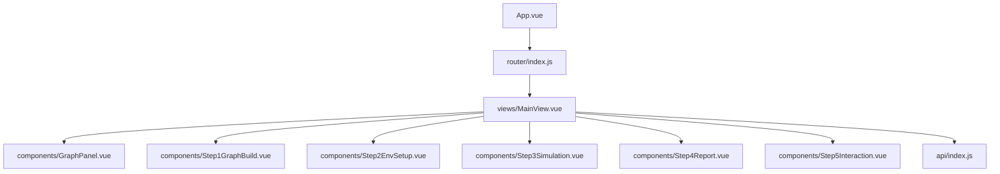
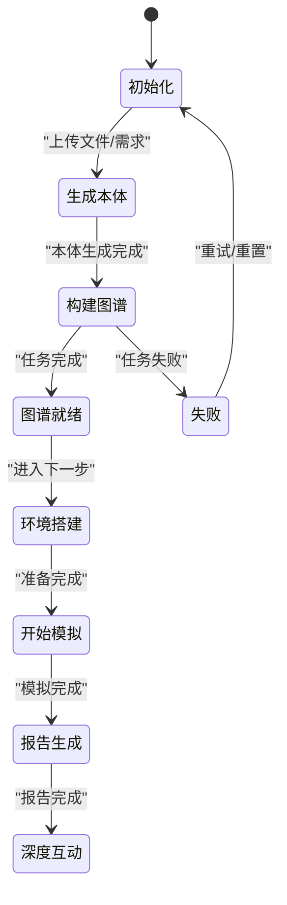
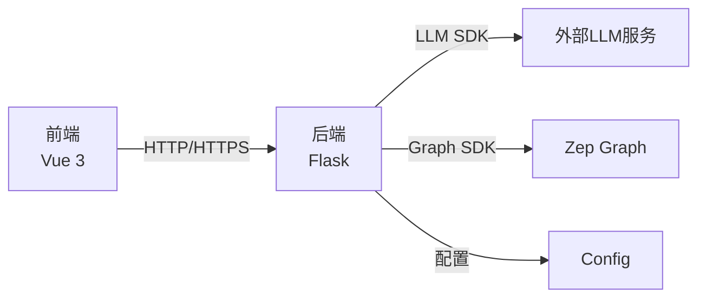

# 系统架构

<cite>
**本文引用的文件**
- [backend/app/__init__.py](file://backend/app/__init__.py)
- [backend/run.py](file://backend/run.py)
- [backend/app/config.py](file://backend/app/config.py)
- [backend/app/api/__init__.py](file://backend/app/api/__init__.py)
- [backend/app/api/graph.py](file://backend/app/api/graph.py)
- [backend/app/api/simulation.py](file://backend/app/api/simulation.py)
- [backend/app/api/report.py](file://backend/app/api/report.py)
- [frontend/src/main.js](file://frontend/src/main.js)
- [frontend/package.json](file://frontend/package.json)
- [frontend/src/router/index.js](file://frontend/src/router/index.js)
- [frontend/src/api/index.js](file://frontend/src/api/index.js)
- [frontend/src/views/MainView.vue](file://frontend/src/views/MainView.vue)
- [frontend/src/App.vue](file://frontend/src/App.vue)
- [README.md](file://README.md)
- [Dockerfile](file://Dockerfile)
</cite>

## 目录
1. [引言](#引言)
2. [项目结构](#项目结构)
3. [核心组件](#核心组件)
4. [架构总览](#架构总览)
5. [详细组件分析](#详细组件分析)
6. [依赖分析](#依赖分析)
7. [性能考量](#性能考量)
8. [故障排查指南](#故障排查指南)
9. [结论](#结论)
10. [附录](#附录)

## 引言
本文件面向架构师与高级开发者，系统性梳理 MiroFish 的前后端分离架构设计与实现细节。系统采用 Flask 应用工厂模式与蓝图组织，结合 Vue 3 前端工程化与路由体系，形成“数据驱动 + 流水线式工作流”的整体方案。后端围绕“本体生成—图谱构建—环境准备—模拟运行—报告生成—深度互动”五步流程提供 REST API；前端通过组件化视图与状态管理，串联各步骤并提供可视化与交互能力。系统同时强调可观测性（日志、健康检查）、可扩展性（模块化服务、中间件、容器化）与易用性（统一配置、自动清理、轮询进度反馈）。

## 项目结构
- 后端（Flask）
  - 应用工厂与启动入口：应用工厂负责配置、CORS、中间件与蓝图注册；启动入口负责配置校验与服务启动。
  - API 蓝图：graph、simulation、report 三大领域蓝图，分别承载图谱、模拟与报告相关接口。
  - 服务层：围绕本体生成、图谱构建、实体读取、模拟准备与运行、报告生成等业务能力封装。
  - 工具与配置：统一配置类、日志、重试、文件解析等。
- 前端（Vue 3）
  - 应用入口与路由：应用入口挂载路由；路由定义首页与五步流程视图。
  - 视图与组件：主视图承载五步流程与图谱面板；各步骤对应独立组件。
  - API 层：Axios 实例封装、拦截器与重试策略，统一错误处理。
  - 状态与存储：视图内状态与全局上传待处理状态管理。

图表来源
- [backend/app/__init__.py](file://backend/app/__init__.py#L19-L81)
- [backend/run.py](file://backend/run.py#L25-L50)
- [backend/app/api/__init__.py](file://backend/app/api/__init__.py#L1-L15)
- [frontend/src/main.js](file://frontend/src/main.js#L1-L10)
- [frontend/src/router/index.js](file://frontend/src/router/index.js#L1-L53)

章节来源
- [backend/app/__init__.py](file://backend/app/__init__.py#L19-L81)
- [backend/run.py](file://backend/run.py#L25-L50)
- [backend/app/config.py](file://backend/app/config.py#L20-L76)
- [backend/app/api/__init__.py](file://backend/app/api/__init__.py#L1-L15)
- [frontend/src/main.js](file://frontend/src/main.js#L1-L10)
- [frontend/src/router/index.js](file://frontend/src/router/index.js#L1-L53)
- [frontend/src/api/index.js](file://frontend/src/api/index.js#L1-L68)

## 核心组件
- 后端应用工厂与中间件
  - 应用工厂负责：配置注入、中文 JSON 输出、CORS、请求/响应日志中间件、蓝图注册、健康检查端点、模拟进程清理钩子。
  - 中间件：before_request 记录请求方法与 JSON 负载；after_request 记录响应状态码。
- API 蓝图与路由
  - graph：项目管理、本体生成、图谱构建、任务查询、图谱数据与删除。
  - simulation：实体读取、模拟创建、准备与进度查询、模拟状态与控制。
  - report：报告生成、进度与章节、下载、对话、状态检查与日志。
- 前端应用与路由
  - 应用入口创建 Vue 应用并挂载路由；路由覆盖首页、流程视图、模拟视图、报告视图、交互视图。
  - 主视图承载五步流程与图谱面板，配合轮询与状态机推进。
- API 封装与错误处理
  - Axios 实例统一 base URL、超时、拦截器；响应拦截器统一错误处理；提供指数退避重试工具。

章节来源
- [backend/app/__init__.py](file://backend/app/__init__.py#L19-L81)
- [backend/app/api/graph.py](file://backend/app/api/graph.py#L35-L618)
- [backend/app/api/simulation.py](file://backend/app/api/simulation.py#L47-L800)
- [backend/app/api/report.py](file://backend/app/api/report.py#L24-L1016)
- [frontend/src/router/index.js](file://frontend/src/router/index.js#L1-L53)
- [frontend/src/views/MainView.vue](file://frontend/src/views/MainView.vue#L1-L541)
- [frontend/src/api/index.js](file://frontend/src/api/index.js#L1-L68)

## 架构总览
系统采用前后端分离架构，后端以 Flask 提供 REST API，前端以 Vue 3 提供交互界面。数据流贯穿“上传/解析—本体生成—图谱构建—实体过滤—Agent人设与配置—模拟运行—报告生成—深度互动”。后端通过服务层解耦业务逻辑，前端通过视图与组件实现工作流编排与可视化。

图表来源
- [backend/app/config.py](file://backend/app/config.py#L20-L76)
- [backend/app/__init__.py](file://backend/app/__init__.py#L19-L81)
- [backend/app/api/graph.py](file://backend/app/api/graph.py#L121-L255)
- [backend/app/api/simulation.py](file://backend/app/api/simulation.py#L164-L237)
- [backend/app/api/report.py](file://backend/app/api/report.py#L24-L196)

## 详细组件分析

### 后端应用工厂与中间件
- 设计要点
  - 应用工厂集中初始化：配置、CORS、日志、蓝图、健康检查、模拟进程清理。
  - 中间件：请求/响应日志，便于调试与审计。
  - 统一 JSON 中文输出，避免客户端显示 Unicode 转义。
- 关键流程
  - 启动入口校验配置后创建应用，读取主机、端口与调试模式，启动服务。
  - 注册三个蓝图，分别挂载在 /api/graph、/api/simulation、/api/report 前缀下。
- 可观测性
  - 健康检查端点 /health 便于容器编排与负载均衡探测。
  - 清理函数确保服务器关闭时终止模拟进程，避免僵尸进程。

图表来源
- [backend/run.py](file://backend/run.py#L25-L50)
- [backend/app/__init__.py](file://backend/app/__init__.py#L19-L81)

章节来源
- [backend/app/__init__.py](file://backend/app/__init__.py#L19-L81)
- [backend/run.py](file://backend/run.py#L25-L50)

### API 蓝图与数据流

#### 图谱构建流程（graph 蓝图）
- 数据流
  - 上传文件与需求 → 本体生成（LLM）→ 保存项目状态 → 图谱构建（Zep）→ 任务进度轮询 → 图谱数据获取。
- 关键接口
  - 本体生成：接收 multipart/form-data，返回项目ID与本体检索信息。
  - 图谱构建：创建异步任务，后台线程分块写入、等待处理、获取数据并更新项目状态。
  - 任务查询：轮询任务状态，驱动前端进度展示。
  - 图谱数据与删除：获取图谱节点/边信息，或删除图谱。
- 错误处理
  - 统一返回 {success, data|error, traceback} 结构，便于前端统一处理。

图表来源
- [backend/app/api/graph.py](file://backend/app/api/graph.py#L121-L255)
- [backend/app/api/graph.py](file://backend/app/api/graph.py#L259-L525)
- [backend/app/api/graph.py](file://backend/app/api/graph.py#L529-L560)
- [backend/app/api/graph.py](file://backend/app/api/graph.py#L564-L618)

章节来源
- [backend/app/api/graph.py](file://backend/app/api/graph.py#L35-L618)

#### 模拟准备与运行流程（simulation 蓝图）
- 数据流
  - 创建模拟 → 从图谱读取实体（过滤）→ 生成Agent人设（可并行）→ LLM生成模拟配置 → 保存脚本与状态 → 准备完成 → 运行模拟。
- 关键接口
  - 实体读取：按类型/过滤获取实体，支持边信息增强。
  - 准备：异步任务，带阶段进度与详细进度信息；支持强制重新生成。
  - 状态查询：支持按 task_id 或 simulation_id 查询。
  - 模拟控制：创建、获取、停止、关闭环境等。
- 错误处理
  - 统一异常捕获与任务失败标记，前端可据此提示与重试。

图表来源
- [backend/app/api/simulation.py](file://backend/app/api/simulation.py#L164-L237)
- [backend/app/api/simulation.py](file://backend/app/api/simulation.py#L358-L635)
- [backend/app/api/simulation.py](file://backend/app/api/simulation.py#L637-L748)

章节来源
- [backend/app/api/simulation.py](file://backend/app/api/simulation.py#L47-L800)

#### 报告生成与交互流程（report 蓝图）
- 数据流
  - 触发报告生成 → 异步任务 → ReportAgent 逐步生成章节 → 章节级增量返回 → 对话与日志。
- 关键接口
  - 报告生成：创建任务，返回任务ID；支持强制重新生成。
  - 进度与章节：按章节增量返回，前端可逐步渲染。
  - 对话：与 ReportAgent 交互，支持检索工具调用。
  - 下载与状态：Markdown 下载、报告状态检查、Agent 日志流。
- 错误处理
  - 任务失败与异常捕获，统一返回错误信息。

图表来源
- [backend/app/api/report.py](file://backend/app/api/report.py#L24-L196)
- [backend/app/api/report.py](file://backend/app/api/report.py#L198-L268)
- [backend/app/api/report.py](file://backend/app/api/report.py#L272-L463)
- [backend/app/api/report.py](file://backend/app/api/report.py#L467-L560)

章节来源
- [backend/app/api/report.py](file://backend/app/api/report.py#L24-L1016)

### 前端应用结构与组件层次
- 应用入口与路由
  - 应用入口创建 Vue 应用并挂载路由；路由覆盖首页、流程视图、模拟视图、报告视图、交互视图。
- 主视图与工作流
  - 主视图承载五步流程：图谱构建、环境搭建、开始模拟、报告生成、深度互动；左侧图谱面板，右侧步骤组件。
  - 通过轮询与状态机推进：项目状态变更触发图谱刷新、任务进度轮询、最终进入下一步。
- API 封装
  - Axios 实例统一基地址、超时与拦截器；响应拦截器统一错误处理；提供指数退避重试工具。

图表来源
- [frontend/src/App.vue](file://frontend/src/App.vue#L1-L48)
- [frontend/src/router/index.js](file://frontend/src/router/index.js#L1-L53)
- [frontend/src/views/MainView.vue](file://frontend/src/views/MainView.vue#L1-L541)
- [frontend/src/api/index.js](file://frontend/src/api/index.js#L1-L68)

章节来源
- [frontend/src/main.js](file://frontend/src/main.js#L1-L10)
- [frontend/src/router/index.js](file://frontend/src/router/index.js#L1-L53)
- [frontend/src/views/MainView.vue](file://frontend/src/views/MainView.vue#L1-L541)
- [frontend/src/api/index.js](file://frontend/src/api/index.js#L1-L68)

### 状态管理与数据流
- 前端状态
  - 主视图维护当前步骤、视图模式、项目数据、图谱数据、任务进度、系统日志等。
  - 通过轮询与事件驱动更新状态，保证 UI 与后端状态一致。
- 后端状态
  - 项目状态机：created → ontology_generated → graph_building → graph_completed → failed。
  - 任务状态机：created → processing → completed/failed。
- 数据一致性
  - 前端通过 /task/{task_id} 与 /data/{graph_id} 拉取最新状态与数据，避免长连接带来的复杂性。

图表来源
- [backend/app/api/graph.py](file://backend/app/api/graph.py#L35-L117)
- [backend/app/api/simulation.py](file://backend/app/api/simulation.py#L164-L237)
- [backend/app/api/report.py](file://backend/app/api/report.py#L24-L196)

章节来源
- [frontend/src/views/MainView.vue](file://frontend/src/views/MainView.vue#L178-L405)

## 依赖分析
- 技术栈
  - 后端：Flask、flask-cors、第三方 LLM 与 Zep 服务。
  - 前端：Vue 3、vue-router、axios、d3（可视化）。
- 依赖关系
  - 前端通过 axios 与后端 API 通信；后端通过服务层调用外部 LLM/Zep；配置类集中管理密钥与参数。
- 外部集成
  - LLM：统一 OpenAI 格式兼容，支持多种供应商。
  - Zep：图谱创建、本体设置、数据写入与查询。
- 容器化
  - Dockerfile 同时安装 Node 与 Python，使用 uv 管理 Python 依赖，暴露 3000/5001 端口，开发模式一键启动。

图表来源
- [frontend/package.json](file://frontend/package.json#L11-L21)
- [backend/app/config.py](file://backend/app/config.py#L30-L64)
- [Dockerfile](file://Dockerfile#L1-L29)

章节来源
- [frontend/package.json](file://frontend/package.json#L1-L22)
- [backend/app/config.py](file://backend/app/config.py#L20-L76)
- [Dockerfile](file://Dockerfile#L1-L29)

## 性能考量
- 异步与轮询
  - 图谱构建、模拟准备、报告生成均采用异步任务 + 轮询，避免阻塞主线程，提升用户体验。
- 并行与批处理
  - 图谱构建支持分块与批量写入；模拟准备支持并行生成 Agent 人设。
- 超时与重试
  - 前端 axios 超时较长（5 分钟），适配本体生成等长耗时场景；提供指数退避重试。
- 资源清理
  - 应用关闭时注册模拟进程清理钩子，避免资源泄漏。

## 故障排查指南
- 常见错误与定位
  - 配置缺失：启动前配置校验失败，检查 .env 中 LLM_API_KEY、ZEP_API_KEY 等。
  - CORS 问题：确认 /api/* 已启用跨域。
  - 任务失败：通过 /task/{task_id} 查看任务错误信息；检查后端日志。
  - 图谱为空：确认图谱构建任务完成，graph_id 存在后再拉取 /data/{graph_id}。
- 建议排查步骤
  - 后端：查看启动日志、请求/响应日志、任务日志；确认外部服务可用。
  - 前端：检查 API 基地址、超时设置、重试策略；观察轮询与状态变化。
  - 容器：确认端口映射与 .env 读取；查看容器日志。

章节来源
- [backend/run.py](file://backend/run.py#L27-L35)
- [backend/app/__init__.py](file://backend/app/__init__.py#L42-L63)
- [backend/app/api/graph.py](file://backend/app/api/graph.py#L529-L560)
- [frontend/src/api/index.js](file://frontend/src/api/index.js#L23-L51)

## 结论
MiroFish 通过前后端分离架构实现了从“种子材料—本体—图谱—Agent—模拟—报告—互动”的完整闭环。后端以应用工厂与蓝图组织清晰、服务层职责明确、中间件与健康检查完善；前端以组件化与工作流驱动提升可用性。系统在可扩展性、可观测性与易用性方面具备良好基础，适合在多场景下进行二次开发与定制。

## 附录
- 快速启动与服务地址
  - 前端：http://localhost:3000
  - 后端 API：http://localhost:5001
- 环境变量示例
  - LLM_API_KEY、LLM_BASE_URL、LLM_MODEL_NAME、ZEP_API_KEY
- 容器化
  - docker compose up -d，默认读取根目录 .env，映射 3000/5001 端口。

章节来源
- [README.md](file://README.md#L149-L158)
- [README.md](file://README.md#L110-L123)
- [Dockerfile](file://Dockerfile#L26-L29)