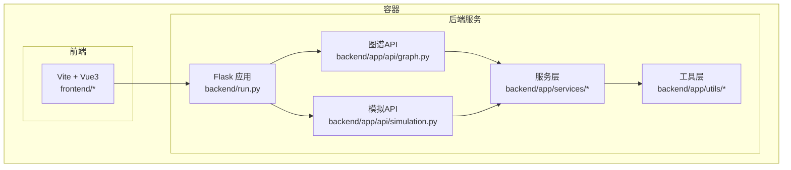
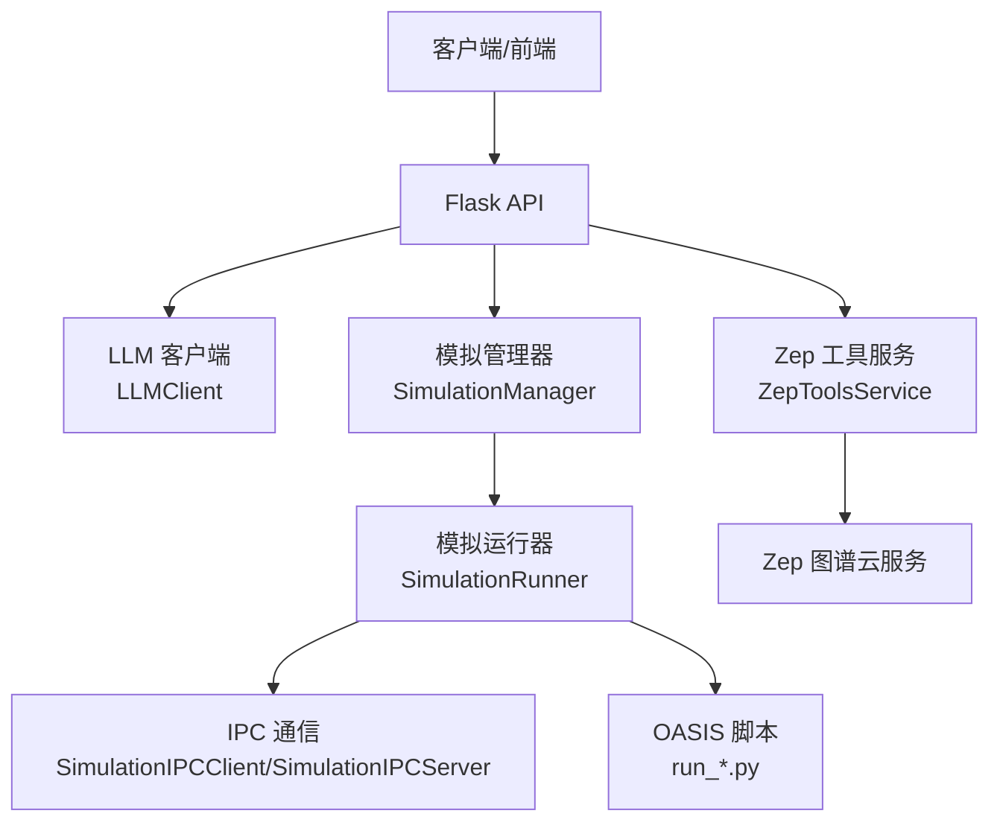
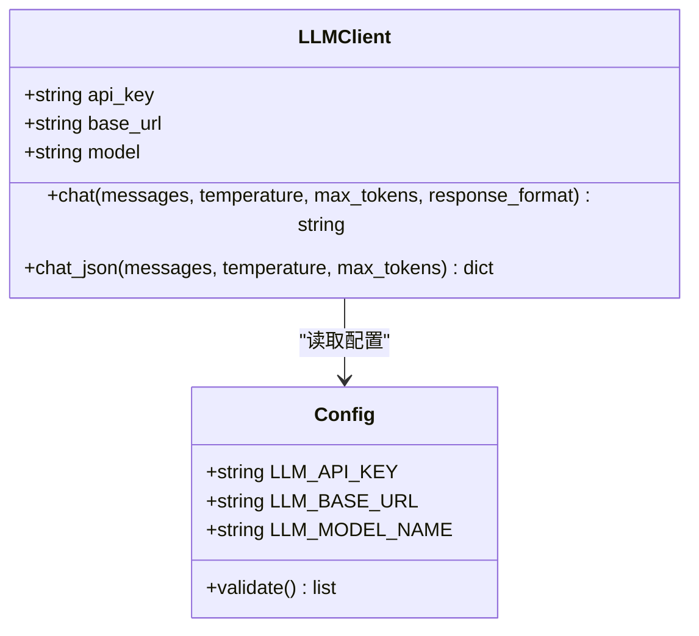
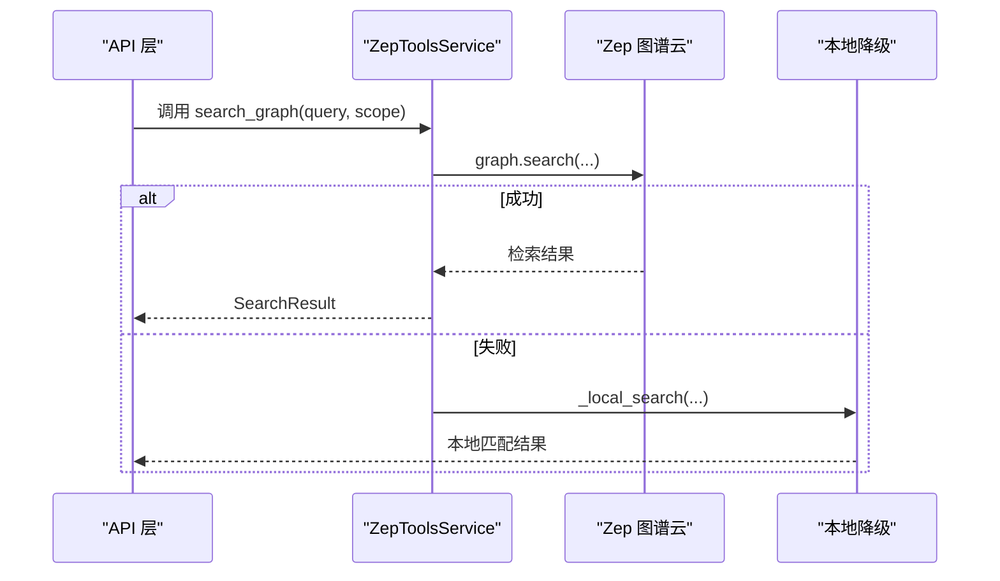
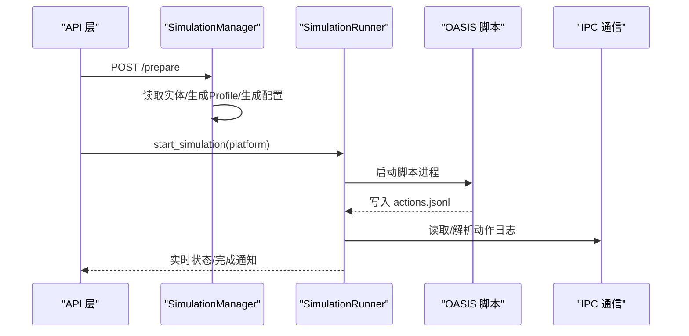
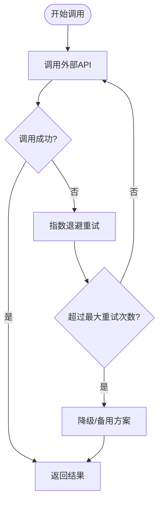
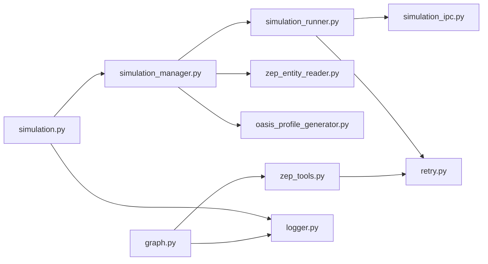

# 集成模式

<cite>
**本文档引用的文件**
- [backend/app/config.py](file://backend/app/config.py)
- [backend/app/utils/llm_client.py](file://backend/app/utils/llm_client.py)
- [backend/app/services/zep_tools.py](file://backend/app/services/zep_tools.py)
- [backend/app/services/zep_entity_reader.py](file://backend/app/services/zep_entity_reader.py)
- [backend/app/services/oasis_profile_generator.py](file://backend/app/services/oasis_profile_generator.py)
- [backend/app/services/simulation_manager.py](file://backend/app/services/simulation_manager.py)
- [backend/app/services/simulation_runner.py](file://backend/app/services/simulation_runner.py)
- [backend/app/services/simulation_ipc.py](file://backend/app/services/simulation_ipc.py)
- [backend/app/utils/retry.py](file://backend/app/utils/retry.py)
- [backend/app/utils/logger.py](file://backend/app/utils/logger.py)
- [backend/app/api/graph.py](file://backend/app/api/graph.py)
- [backend/app/api/simulation.py](file://backend/app/api/simulation.py)
- [backend/run.py](file://backend/run.py)
- [.env.example](file://.env.example)
- [Dockerfile](file://Dockerfile)
- [docker-compose.yml](file://docker-compose.yml)
</cite>

## 目录
1. [简介](#简介)
2. [项目结构](#项目结构)
3. [核心组件](#核心组件)
4. [架构概览](#架构概览)
5. [详细组件分析](#详细组件分析)
6. [依赖关系分析](#依赖关系分析)
7. [性能考虑](#性能考虑)
8. [故障排查指南](#故障排查指南)
9. [结论](#结论)
10. [附录](#附录)

## 简介
本文件面向MiroFish系统的集成模式，聚焦第三方服务集成策略与工程实践，涵盖：
- LLM API集成（统一OpenAI格式封装）
- Zep图谱数据库集成（检索、实体读取、图谱更新）
- OASIS模拟引擎集成（准备、运行、IPC通信）
- 外部API调用的封装模式与错误处理机制
- 配置管理策略（环境变量、API密钥、连接参数安全）
- 服务发现与负载均衡（容器化部署中的服务间通信）
- 集成测试、监控与故障转移
- API限流、重试机制与降级策略
- 容器化部署中的网络配置

## 项目结构
后端采用Python Flask + uv同步依赖，前端使用Vite + Vue3，容器化通过Dockerfile与docker-compose编排。核心集成逻辑集中在backend目录，API层负责对外暴露，服务层负责业务编排，工具层提供重试、日志、LLM封装等。

图表来源
- [backend/run.py](file://backend/run.py#L25-L46)
- [backend/app/api/graph.py](file://backend/app/api/graph.py#L1-L618)
- [backend/app/api/simulation.py](file://backend/app/api/simulation.py#L1-L800)

章节来源
- [backend/run.py](file://backend/run.py#L25-L46)
- [Dockerfile](file://Dockerfile#L1-L29)
- [docker-compose.yml](file://docker-compose.yml#L1-L14)

## 核心组件
- 配置管理：集中于Config类，统一从.env加载，支持LLM、Zep、OASIS、上传与报告Agent等配置项校验。
- LLM客户端：统一OpenAI格式封装，支持JSON模式响应与温度、token上限等参数。
- Zep工具服务：提供图谱检索、节点/边读取、实体过滤、深度洞察与广度搜索等能力，并内置重试与降级。
- 模拟管理器：从Zep读取实体、生成Agent Profile、LLM智能生成模拟配置、准备脚本与文件。
- 模拟运行器：后台运行OASIS脚本，解析动作日志，提供实时状态监控与图谱记忆更新。
- IPC通信：基于文件系统的命令/响应模式，实现Flask与模拟脚本的解耦通信。
- 重试与日志：统一的指数退避重试与多通道日志输出，便于集成测试与故障排查。

章节来源
- [backend/app/config.py](file://backend/app/config.py#L20-L76)
- [backend/app/utils/llm_client.py](file://backend/app/utils/llm_client.py#L13-L92)
- [backend/app/services/zep_tools.py](file://backend/app/services/zep_tools.py#L377-L440)
- [backend/app/services/simulation_manager.py](file://backend/app/services/simulation_manager.py#L114-L192)
- [backend/app/services/simulation_runner.py](file://backend/app/services/simulation_runner.py#L195-L320)
- [backend/app/services/simulation_ipc.py](file://backend/app/services/simulation_ipc.py#L95-L188)
- [backend/app/utils/retry.py](file://backend/app/utils/retry.py#L15-L77)
- [backend/app/utils/logger.py](file://backend/app/utils/logger.py#L30-L88)

## 架构概览
MiroFish采用“API网关 + 服务编排 + 外部服务”的三层架构：
- API层：提供图谱构建、实体读取、模拟准备与运行、报告生成等REST接口。
- 服务层：封装Zep检索、OASIS配置生成与运行、IPC通信与状态监控。
- 外部服务：LLM API（OpenAI格式）、Zep图谱云服务、OASIS模拟引擎脚本。

图表来源
- [backend/app/api/graph.py](file://backend/app/api/graph.py#L120-L255)
- [backend/app/api/simulation.py](file://backend/app/api/simulation.py#L164-L237)
- [backend/app/utils/llm_client.py](file://backend/app/utils/llm_client.py#L13-L92)
- [backend/app/services/zep_tools.py](file://backend/app/services/zep_tools.py#L377-L440)
- [backend/app/services/simulation_manager.py](file://backend/app/services/simulation_manager.py#L114-L192)
- [backend/app/services/simulation_runner.py](file://backend/app/services/simulation_runner.py#L195-L320)
- [backend/app/services/simulation_ipc.py](file://backend/app/services/simulation_ipc.py#L95-L188)

## 详细组件分析

### LLM API集成策略
- 统一封装：LLMClient基于OpenAI SDK封装，支持chat与chat_json两类接口，自动注入模型、温度、token上限与JSON响应格式。
- 配置来源：Config类从环境变量加载LLM_API_KEY、LLM_BASE_URL、LLM_MODEL_NAME；.env.example提供示例。
- 错误处理：构造函数校验LLM_API_KEY，调用失败时由上层捕获；可结合重试机制提升稳定性。

图表来源
- [backend/app/utils/llm_client.py](file://backend/app/utils/llm_client.py#L13-L92)
- [backend/app/config.py](file://backend/app/config.py#L30-L34)

章节来源
- [backend/app/utils/llm_client.py](file://backend/app/utils/llm_client.py#L13-L92)
- [backend/app/config.py](file://backend/app/config.py#L30-L34)
- [.env.example](file://.env.example#L1-L16)

### Zep图谱数据库集成
- 实体读取与过滤：ZepEntityReader从图谱读取节点/边，按标签过滤实体，支持边信息增强。
- 检索工具：ZepToolsService提供search_graph、get_all_nodes/edges、insight_forge、panorama_search等工具；内置指数退避重试与本地降级。
- 图谱更新：SimulationRunner可启用图谱记忆更新，将Agent动作实时写回Zep。

图表来源
- [backend/app/services/zep_tools.py](file://backend/app/services/zep_tools.py#L441-L522)
- [backend/app/services/zep_entity_reader.py](file://backend/app/services/zep_entity_reader.py#L222-L338)

章节来源
- [backend/app/services/zep_tools.py](file://backend/app/services/zep_tools.py#L377-L440)
- [backend/app/services/zep_tools.py](file://backend/app/services/zep_tools.py#L441-L522)
- [backend/app/services/zep_entity_reader.py](file://backend/app/services/zep_entity_reader.py#L70-L125)

### OASIS模拟引擎集成
- 准备阶段：SimulationManager从Zep读取实体，生成Agent Profile，使用LLM智能生成模拟配置，准备脚本与文件。
- 运行阶段：SimulationRunner后台启动OASIS脚本，解析actions.jsonl日志，提供实时状态与图谱记忆更新。
- IPC通信：SimulationIPCClient/SimulationIPCServer通过文件系统实现命令/响应模式，避免复杂网络通信。

图表来源
- [backend/app/api/simulation.py](file://backend/app/api/simulation.py#L358-L447)
- [backend/app/services/simulation_manager.py](file://backend/app/services/simulation_manager.py#L229-L447)
- [backend/app/services/simulation_runner.py](file://backend/app/services/simulation_runner.py#L312-L475)
- [backend/app/services/simulation_ipc.py](file://backend/app/services/simulation_ipc.py#L95-L188)

章节来源
- [backend/app/services/simulation_manager.py](file://backend/app/services/simulation_manager.py#L114-L192)
- [backend/app/services/simulation_runner.py](file://backend/app/services/simulation_runner.py#L195-L320)
- [backend/app/services/simulation_ipc.py](file://backend/app/services/simulation_ipc.py#L288-L395)

### 外部API调用封装与错误处理
- 统一重试：RetryableAPIClient与retry_with_backoff装饰器提供指数退避、抖动与最大重试次数控制。
- 工具内重试：ZepToolsService与ZepEntityReader对Zep API调用使用指数退避重试。
- 降级策略：当Zep Search API不可用时，自动降级为本地关键词匹配搜索。
- 日志与可观测性：统一日志器输出到文件与控制台，便于集成测试与故障排查。

图表来源
- [backend/app/utils/retry.py](file://backend/app/utils/retry.py#L15-L77)
- [backend/app/services/zep_tools.py](file://backend/app/services/zep_tools.py#L418-L440)
- [backend/app/services/zep_entity_reader.py](file://backend/app/services/zep_entity_reader.py#L87-L125)

章节来源
- [backend/app/utils/retry.py](file://backend/app/utils/retry.py#L15-L77)
- [backend/app/utils/logger.py](file://backend/app/utils/logger.py#L30-L88)

### 配置管理策略
- 环境变量：Config从项目根目录的.env加载，支持LLM、Zep、OASIS、上传与报告Agent等配置。
- 安全管理：.env.example提供示例，建议在生产环境通过环境变量注入；Config.validate()校验必要配置。
- 连接参数：LLM_BASE_URL支持任意OpenAI格式兼容服务；ZEP_API_KEY用于Zep图谱访问。

章节来源
- [backend/app/config.py](file://backend/app/config.py#L9-L17)
- [backend/app/config.py](file://backend/app/config.py#L66-L74)
- [.env.example](file://.env.example#L1-L16)

### 服务发现与负载均衡
- 容器化部署：Dockerfile与docker-compose提供前后端一体化开发模式，端口映射3000/5001。
- 服务间通信：IPC通过文件系统实现，避免复杂的网络服务发现；OASIS脚本通过相对路径调用。
- 负载均衡：当前未实现多实例横向扩展，建议在生产环境通过反向代理或容器编排实现。

章节来源
- [Dockerfile](file://Dockerfile#L26-L29)
- [docker-compose.yml](file://docker-compose.yml#L7-L13)
- [backend/app/services/simulation_ipc.py](file://backend/app/services/simulation_ipc.py#L102-L116)

### 集成测试、监控与故障转移
- 集成测试：通过API端点与服务层单元测试验证流程；日志输出便于定位问题。
- 监控：SimulationRunner解析actions.jsonl并维护实时状态；日志文件按天轮转。
- 故障转移：Zep API失败时自动降级；进程终止采用跨平台策略（Windows taskkill/Unix killpg）。

章节来源
- [backend/app/services/simulation_runner.py](file://backend/app/services/simulation_runner.py#L478-L577)
- [backend/app/utils/logger.py](file://backend/app/utils/logger.py#L66-L87)

### API限流、重试与降级策略
- 限流：未实现显式限流，建议在网关层或上游服务增加速率限制。
- 重试：统一使用指数退避与抖动，最大重试次数可配置；Zep工具与实体读取均内置重试。
- 降级：Zep Search API失败时本地关键词匹配；LLM生成Profile失败时回退规则生成。

章节来源
- [backend/app/utils/retry.py](file://backend/app/utils/retry.py#L15-L77)
- [backend/app/services/zep_tools.py](file://backend/app/services/zep_tools.py#L418-L440)
- [backend/app/services/oasis_profile_generator.py](file://backend/app/services/oasis_profile_generator.py#L523-L581)

### 容器化部署中的服务间通信
- 端口暴露：容器暴露3000/5001，映射至宿主机。
- 数据卷：后端上传目录挂载至容器，便于持久化。
- 网络：开发模式前后端在同一容器内通信；生产环境建议通过反向代理统一入口。

章节来源
- [Dockerfile](file://Dockerfile#L26-L29)
- [docker-compose.yml](file://docker-compose.yml#L10-L14)

## 依赖关系分析
- API层依赖服务层与工具层；服务层依赖配置与外部SDK；工具层提供重试与日志。
- Zep工具服务依赖Zep SDK与LLM客户端；模拟管理器依赖Zep实体读取与Profile生成器。
- 模拟运行器依赖IPC与脚本目录；可选启用图谱记忆更新。

图表来源
- [backend/app/api/graph.py](file://backend/app/api/graph.py#L1-L618)
- [backend/app/api/simulation.py](file://backend/app/api/simulation.py#L1-L800)
- [backend/app/services/zep_tools.py](file://backend/app/services/zep_tools.py#L377-L440)
- [backend/app/services/simulation_manager.py](file://backend/app/services/simulation_manager.py#L114-L192)
- [backend/app/services/simulation_runner.py](file://backend/app/services/simulation_runner.py#L195-L320)
- [backend/app/services/simulation_ipc.py](file://backend/app/services/simulation_ipc.py#L95-L188)
- [backend/app/utils/retry.py](file://backend/app/utils/retry.py#L15-L77)
- [backend/app/utils/logger.py](file://backend/app/utils/logger.py#L30-L88)

章节来源
- [backend/app/api/graph.py](file://backend/app/api/graph.py#L1-L618)
- [backend/app/api/simulation.py](file://backend/app/api/simulation.py#L1-L800)

## 性能考虑
- 批量与并行：Profile生成支持并行数量配置；Zep检索使用并行线程池提升效率。
- I/O与日志：统一日志轮转，避免磁盘膨胀；动作日志采用JSONL增量读取，减少内存占用。
- 外部依赖：合理设置LLM温度与token上限，避免不必要的长文本传输；Zep检索限制返回数量。

## 故障排查指南
- 配置错误：运行前通过Config.validate()检查必要配置；查看启动日志确认环境变量加载。
- LLM调用失败：检查LLM_API_KEY与LLM_BASE_URL；查看重试日志与异常栈。
- Zep调用失败：关注Zep API重试与降级日志；确认ZEP_API_KEY与图谱ID。
- 模拟运行异常：查看simulation.log与actions.jsonl；确认脚本路径与配置文件存在。
- 进程终止：跨平台终止策略确保子进程树被清理；检查进程PID与状态文件。

章节来源
- [backend/run.py](file://backend/run.py#L27-L34)
- [backend/app/utils/logger.py](file://backend/app/utils/logger.py#L66-L87)
- [backend/app/services/simulation_runner.py](file://backend/app/services/simulation_runner.py#L716-L800)

## 结论
MiroFish通过统一的配置管理、LLM封装、Zep工具与OASIS模拟集成，形成了可扩展的第三方服务集成模式。借助指数退避重试、本地降级与统一日志，系统具备良好的韧性与可观测性。建议在生产环境中完善限流、监控与多实例部署策略，持续优化外部依赖的性能与成本。

## 附录
- 环境变量参考：.env.example提供LLM、Zep与可选加速配置示例。
- 端口与卷：docker-compose暴露3000/5001，挂载上传目录。
- 启动流程：run.py加载配置并启动Flask应用，调试模式由Config.DEBUG控制。

章节来源
- [.env.example](file://.env.example#L1-L16)
- [docker-compose.yml](file://docker-compose.yml#L7-L13)
- [backend/run.py](file://backend/run.py#L40-L45)