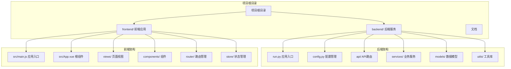
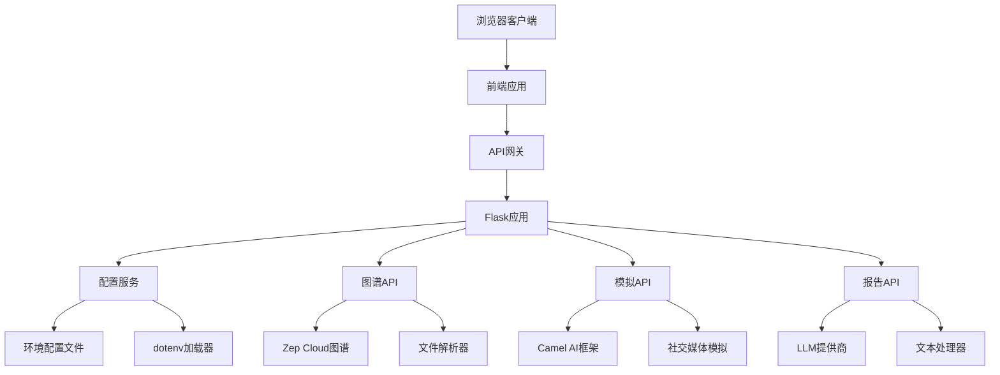
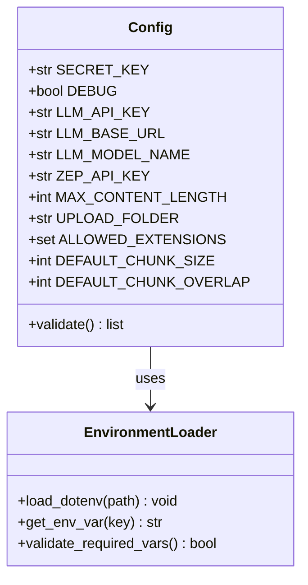
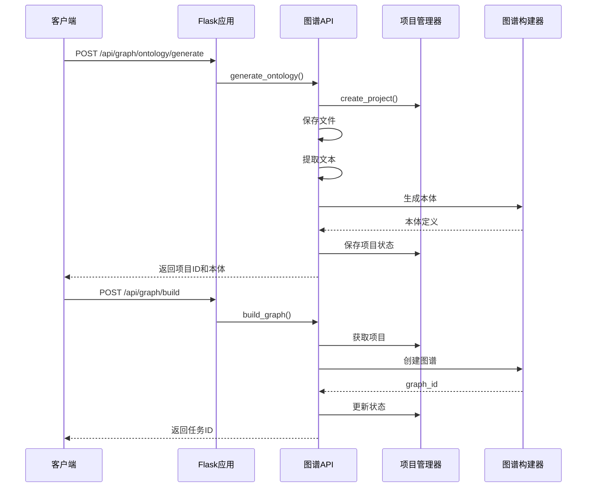
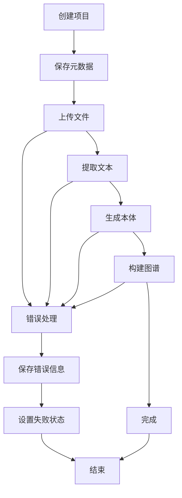
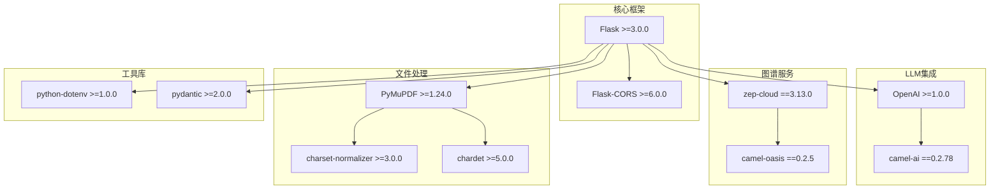

# Conda部署指南

<cite>
**本文档引用的文件**
- [README-CONDA.md](file://README-CONDA.md)
- [Dockerfile](file://Dockerfile)
- [docker-compose.yml](file://docker-compose.yml)
- [backend/pyproject.toml](file://backend/pyproject.toml)
- [backend/requirements.txt](file://backend/requirements.txt)
- [backend/run.py](file://backend/run.py)
- [backend/app/config.py](file://backend/app/config.py)
- [.env.example](file://.env.example)
- [package.json](file://package.json)
- [backend/app/__init__.py](file://backend/app/__init__.py)
- [backend/app/api/graph.py](file://backend/app/api/graph.py)
- [backend/app/models/project.py](file://backend/app/models/project.py)
- [frontend/package.json](file://frontend/package.json)
- [frontend/src/main.js](file://frontend/src/main.js)
- [frontend/src/App.vue](file://frontend/src/App.vue)
</cite>

## 目录
1. [简介](#简介)
2. [项目结构](#项目结构)
3. [核心组件](#核心组件)
4. [架构概览](#架构概览)
5. [详细组件分析](#详细组件分析)
6. [依赖分析](#依赖分析)
7. [性能考虑](#性能考虑)
8. [故障排除指南](#故障排除指南)
9. [结论](#结论)

## 简介

MiroFish是一个基于群体智能引擎的模拟推理平台，支持社交媒体模拟、知识图谱构建和智能报告生成。本文档提供了使用Conda环境部署MiroFish的完整指南，包括前置要求、安装步骤、配置说明和故障排除。

## 项目结构

MiroFish采用前后端分离的架构设计，主要包含以下核心组件：



**图表来源**
- [backend/run.py](file://backend/run.py#L1-L51)
- [backend/app/__init__.py](file://backend/app/__init__.py#L1-L81)
- [frontend/src/main.js](file://frontend/src/main.js#L1-L10)

**章节来源**
- [backend/run.py](file://backend/run.py#L1-L51)
- [backend/app/__init__.py](file://backend/app/__init__.py#L1-L81)
- [frontend/src/main.js](file://frontend/src/main.js#L1-L10)

## 核心组件

### 后端服务组件

后端采用Flask框架构建RESTful API服务，主要包含以下核心组件：

| 组件 | 功能 | 依赖 |
|------|------|------|
| Flask应用工厂 | 应用程序创建和配置 | Flask, Flask-CORS |
| 配置管理 | 环境变量加载和验证 | python-dotenv, pydantic |
| API路由 | 图谱构建、模拟执行、报告生成 | Flask蓝图 |
| 业务服务 | LLM调用、Zep图谱操作、文件处理 | camel-ai, zep-cloud |
| 数据模型 | 项目状态管理、任务调度 | Pydantic, 数据类 |

### 前端组件

前端基于Vue 3构建现代化用户界面：

| 组件 | 功能 | 技术栈 |
|------|------|--------|
| 视图组件 | 主页面、模拟页面、报告页面 | Vue Router |
| 图谱面板 | 图谱可视化展示 | D3.js |
| 步骤组件 | 四步工作流程引导 | Vue Composition API |
| API客户端 | 后端服务通信 | Axios |
| 状态管理 | 上传状态跟踪 | Pinia |

**章节来源**
- [backend/app/config.py](file://backend/app/config.py#L20-L76)
- [backend/app/api/graph.py](file://backend/app/api/graph.py#L1-L618)
- [frontend/package.json](file://frontend/package.json#L1-L22)

## 架构概览

MiroFish采用微服务架构，通过API网关统一对外提供服务：



**图表来源**
- [backend/app/__init__.py](file://backend/app/__init__.py#L19-L79)
- [backend/app/config.py](file://backend/app/config.py#L20-L76)
- [backend/app/api/graph.py](file://backend/app/api/graph.py#L1-L618)

## 详细组件分析

### 配置管理系统

配置管理系统负责从.env文件加载环境变量并进行验证：



**图表来源**
- [backend/app/config.py](file://backend/app/config.py#L20-L76)

配置系统支持多种外部服务集成：

| 服务类型 | 配置键 | 默认值 | 用途 |
|----------|--------|--------|------|
| LLM服务 | LLM_API_KEY | 无 | 大语言模型调用 |
| LLM服务 | LLM_BASE_URL | https://api.openai.com/v1 | API基础URL |
| LLM服务 | LLM_MODEL_NAME | gpt-4o-mini | 模型名称 |
| Zep服务 | ZEP_API_KEY | 无 | 图谱存储服务 |
| 文件上传 | MAX_CONTENT_LENGTH | 50MB | 文件大小限制 |
| 模拟配置 | OASIS_DEFAULT_MAX_ROUNDS | 10 | 模拟轮数 |

**章节来源**
- [backend/app/config.py](file://backend/app/config.py#L20-L76)
- [.env.example](file://.env.example#L1-L16)

### API路由系统

API路由系统采用Flask蓝图实现模块化设计：



**图表来源**
- [backend/app/api/graph.py](file://backend/app/api/graph.py#L121-L255)
- [backend/app/api/graph.py](file://backend/app/api/graph.py#L259-L525)

**章节来源**
- [backend/app/api/graph.py](file://backend/app/api/graph.py#L1-L618)

### 项目状态管理系统

项目状态管理系统使用数据类和文件存储实现持久化：



**图表来源**
- [backend/app/models/project.py](file://backend/app/models/project.py#L133-L165)
- [backend/app/models/project.py](file://backend/app/models/project.py#L168-L175)

**章节来源**
- [backend/app/models/project.py](file://backend/app/models/project.py#L1-L306)

## 依赖分析

### Python依赖关系

后端服务依赖关系如下：



**图表来源**
- [backend/pyproject.toml](file://backend/pyproject.toml#L11-L35)
- [backend/requirements.txt](file://backend/requirements.txt#L8-L36)

### 前端依赖关系

前端应用依赖关系：

```mermaid
graph LR
Vue[Vue 3.5.24] --> VueRouter[Vue Router 4.6.3]
Vue --> D3[D3.js 7.9.0]
Vue --> Axios[Axios 1.13.2]
Vite[Vite 7.2.4] --> PluginVue[@vitejs/plugin-vue 6.0.1]
VueRouter --> RouterIndex[路由配置]
D3 --> GraphVisualization[图谱可视化]
Axios --> APIClient[API客户端]
```

**图表来源**
- [frontend/package.json](file://frontend/package.json#L11-L20)

**章节来源**
- [backend/pyproject.toml](file://backend/pyproject.toml#L1-L56)
- [backend/requirements.txt](file://backend/requirements.txt#L1-L36)
- [frontend/package.json](file://frontend/package.json#L1-L22)

## 性能考虑

### Conda环境优化

使用Conda部署的优势：

1. **独立环境隔离**：避免全局Python环境污染
2. **科学计算库集成**：便于与NumPy、Pandas等库协同
3. **快速包管理**：conda install速度优于pip
4. **环境可移植性**：支持跨平台部署

### 依赖安装策略

针对大型依赖包的安装优化：

| 包名 | 版本 | 安装建议 | 备注 |
|------|------|----------|------|
| camel-ai | 0.2.78 | pip install --upgrade pip后单独安装 | 可能需要较长时间 |
| camel-oasis | 0.2.5 | pip install --upgrade pip后单独安装 | 编译时间较长 |
| zep-cloud | 3.13.0 | 使用默认安装 | 相对较小 |
| flask | >=3.0.0 | 使用pip安装 | 标准依赖 |

### 端口配置

服务端口分配：

| 服务 | 端口 | 用途 | 配置方式 |
|------|------|------|----------|
| 前端开发服务器 | 3000 | Vue开发环境 | npm run frontend |
| 后端API服务器 | 5001 | Flask REST API | python run.py |
| Docker容器 | 3000, 5001 | 容器映射端口 | docker-compose |

**章节来源**
- [README-CONDA.md](file://README-CONDA.md#L120-L127)
- [README-CONDA.md](file://README-CONDA.md#L143-L153)

## 故障排除指南

### 常见问题及解决方案

#### 依赖安装失败

**问题现象**：安装camel-oasis或camel-ai时失败

**解决步骤**：
1. 更新pip版本
2. 单独安装失败的包
3. 检查网络连接和代理设置

**参考命令**：
```bash
pip install --upgrade pip
pip install camel-ai==0.2.78
pip install camel-oasis==0.2.5
```

#### 端口占用问题

**问题现象**：启动服务时提示端口被占用

**解决方法**：
```bash
# Windows系统查找占用端口的进程
netstat -ano | findstr :5001
netstat -ano | findstr :3000

# Linux/macOS系统
lsof -i :5001
lsof -i :3000
```

#### 环境变量配置错误

**问题现象**：应用启动时报配置错误

**检查清单**：
1. 确认.env文件位于项目根目录
2. 验证LLM_API_KEY和ZEP_API_KEY配置
3. 检查端口配置是否冲突

**章节来源**
- [README-CONDA.md](file://README-CONDA.md#L128-L153)
- [backend/app/config.py](file://backend/app/config.py#L66-L75)

### Conda环境管理

常用Conda命令：

| 命令 | 功能 | 使用场景 |
|------|------|----------|
| conda create -n mirofish python=3.11 | 创建环境 | 首次部署 |
| conda activate mirofish | 激活环境 | 日常开发 |
| conda deactivate | 退出环境 | 切换项目 |
| conda remove -n mirofish --all | 删除环境 | 清理重装 |
| conda list | 查看包列表 | 检查依赖 |
| conda env export > environment.yml | 导出配置 | 环境备份 |

**章节来源**
- [README-CONDA.md](file://README-CONDA.md#L101-L118)

## 结论

MiroFish的Conda部署方案提供了稳定可靠的开发环境，具有以下优势：

1. **环境隔离**：使用Conda创建独立Python环境，避免依赖冲突
2. **配置灵活**：支持多种外部服务集成，包括LLM和图谱服务
3. **开发友好**：提供完整的开发工具链和调试支持
4. **易于维护**：清晰的项目结构和模块化设计

部署完成后，用户可以通过Web界面访问完整的功能，包括文档上传、本体生成、图谱构建、社交媒体模拟和智能报告等功能。建议在生产环境中使用Docker部署，在开发环境中使用Conda环境进行本地开发。