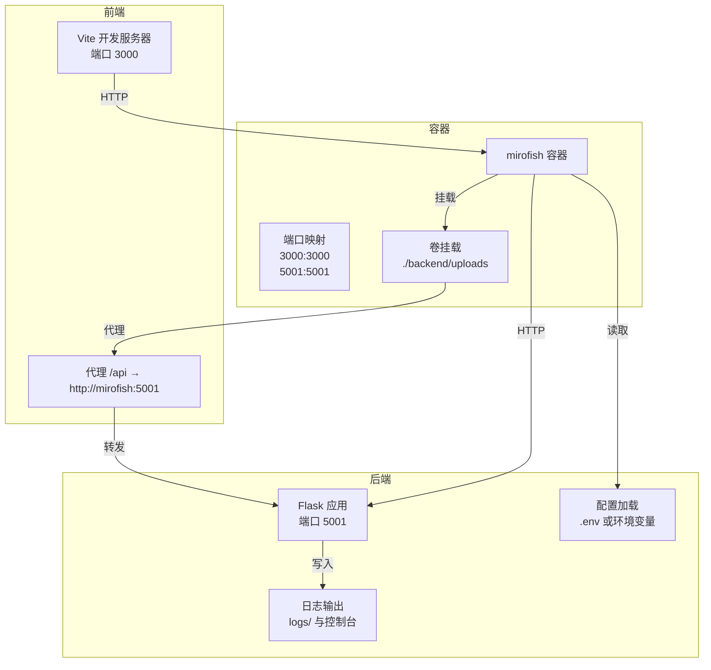
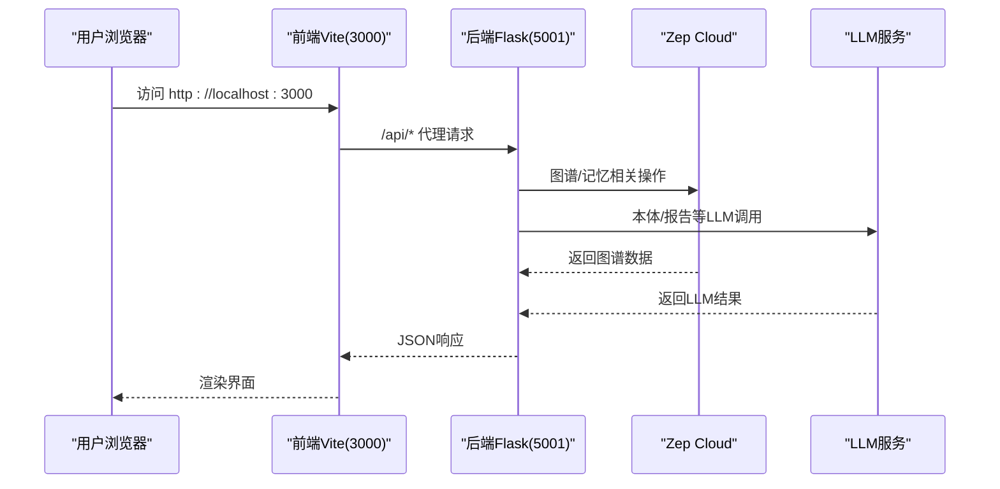
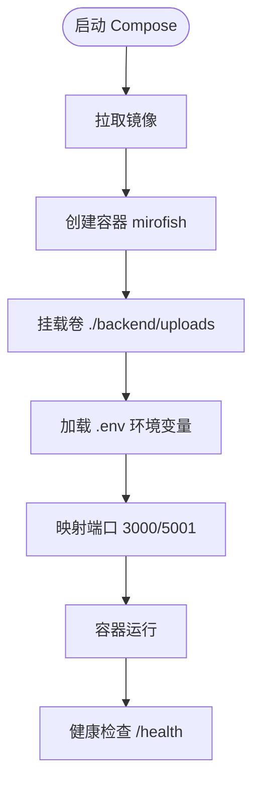
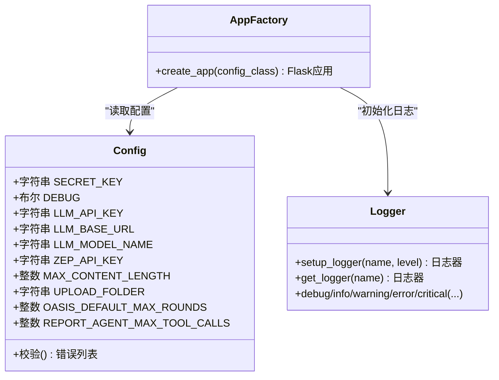
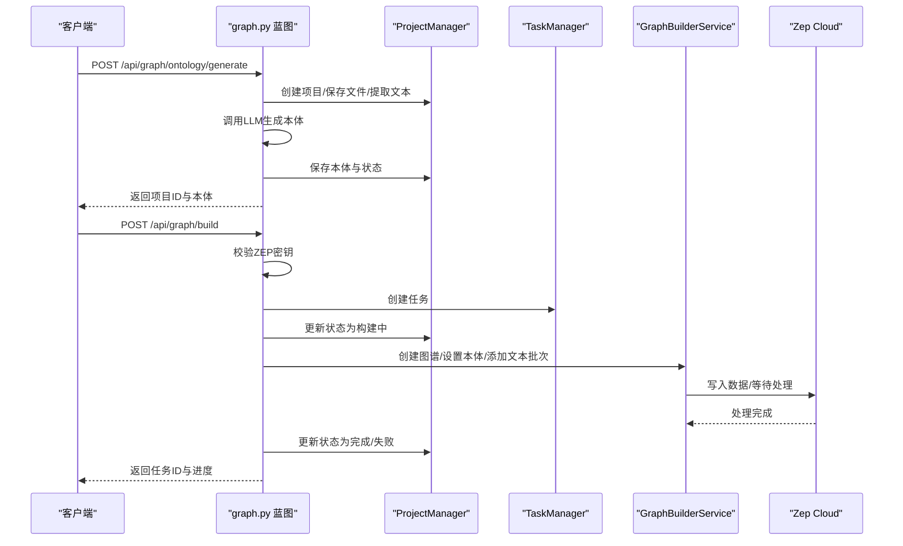
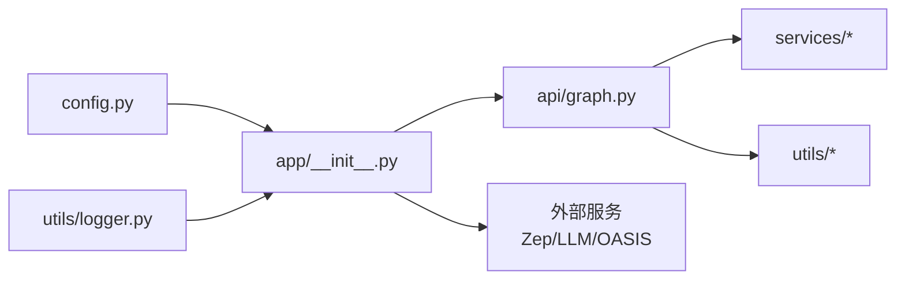

# 部署运维

<cite>
**本文引用的文件**
- [Dockerfile](file://Dockerfile)
- [docker-compose.yml](file://docker-compose.yml)
- [.env.example](file://.env.example)
- [README.md](file://README.md)
- [backend/pyproject.toml](file://backend/pyproject.toml)
- [backend/requirements.txt](file://backend/requirements.txt)
- [backend/run.py](file://backend/run.py)
- [backend/app/config.py](file://backend/app/config.py)
- [backend/app/utils/logger.py](file://backend/app/utils/logger.py)
- [backend/app/__init__.py](file://backend/app/__init__.py)
- [backend/app/api/graph.py](file://backend/app/api/graph.py)
- [frontend/vite.config.js](file://frontend/vite.config.js)
- [.github/workflows/docker-image.yml](file://.github/workflows/docker-image.yml)
- [.dockerignore](file://.dockerignore)
</cite>

## 目录
1. [简介](#简介)
2. [项目结构](#项目结构)
3. [核心组件](#核心组件)
4. [架构总览](#架构总览)
5. [详细组件分析](#详细组件分析)
6. [依赖分析](#依赖分析)
7. [性能考虑](#性能考虑)
8. [故障排除指南](#故障排除指南)
9. [结论](#结论)
10. [附录](#附录)

## 简介
本文件面向DevOps工程师与系统管理员，提供MiroFish的部署与运维全流程指导。内容涵盖Docker容器化部署、服务编排、环境配置与依赖管理、生产性能优化、监控与日志、故障排除、CI/CD与自动化、安全与备份恢复等，帮助您稳定高效地交付与维护该群体智能预测引擎。

## 项目结构
MiroFish采用前后端分离架构，后端基于Flask，前端基于Vue+Vite，通过Docker与Compose进行统一打包与编排。关键目录与文件职责如下：
- 后端：Flask应用工厂、API蓝图、配置与日志、服务层与模型层
- 前端：Vue单页应用，Vite开发服务器与代理
- 部署：Dockerfile、docker-compose.yml、.env.example、.dockerignore
- CI/CD：GitHub Actions工作流，自动构建与推送镜像

图表来源
- [docker-compose.yml](file://docker-compose.yml#L1-L14)
- [frontend/vite.config.js](file://frontend/vite.config.js#L7-L17)
- [backend/app/__init__.py](file://backend/app/__init__.py#L71-L78)
- [backend/app/utils/logger.py](file://backend/app/utils/logger.py#L27-L88)

章节来源
- [README.md](file://README.md#L160-L173)
- [docker-compose.yml](file://docker-compose.yml#L1-L14)
- [Dockerfile](file://Dockerfile#L1-L29)
- [.dockerignore](file://.dockerignore#L1-L24)

## 核心组件
- 容器镜像与编排
  - Dockerfile：多阶段构建，安装Node与Python依赖，暴露3000/5001端口，开发模式同时启动前后端
  - docker-compose.yml：定义服务、镜像、端口映射、重启策略、卷挂载
  - .dockerignore：排除无关文件与缓存，减少镜像体积
- 后端服务
  - run.py：应用入口，校验配置并启动Flask服务
  - app/config.py：集中配置加载与校验，支持.env与环境变量
  - app/utils/logger.py：统一日志配置，控制台与文件轮转输出
  - app/__init__.py：应用工厂，注册蓝图、CORS、健康检查、请求/响应日志
  - app/api/graph.py：图谱构建与任务管理API
- 前端服务
  - vite.config.js：本地开发服务器、端口3000、/api代理到后端
  - package.json：依赖与脚本（dev/build/preview）
- 依赖与包管理
  - backend/pyproject.toml：Python依赖清单与optional-dev分组
  - backend/requirements.txt：历史兼容的依赖清单
  - frontend/package.json：前端依赖与脚本
- CI/CD
  - .github/workflows/docker-image.yml：基于标签触发的镜像构建与推送

章节来源
- [Dockerfile](file://Dockerfile#L1-L29)
- [docker-compose.yml](file://docker-compose.yml#L1-L14)
- [.dockerignore](file://.dockerignore#L1-L24)
- [backend/run.py](file://backend/run.py#L25-L46)
- [backend/app/config.py](file://backend/app/config.py#L20-L76)
- [backend/app/utils/logger.py](file://backend/app/utils/logger.py#L30-L88)
- [backend/app/__init__.py](file://backend/app/__init__.py#L19-L79)
- [backend/app/api/graph.py](file://backend/app/api/graph.py#L35-L117)
- [frontend/vite.config.js](file://frontend/vite.config.js#L5-L18)
- [backend/pyproject.toml](file://backend/pyproject.toml#L11-L35)
- [backend/requirements.txt](file://backend/requirements.txt#L8-L36)
- [.github/workflows/docker-image.yml](file://.github/workflows/docker-image.yml#L1-L50)

## 架构总览
MiroFish的运行时架构由“容器层—服务层—应用层—外部服务”构成。容器内同时运行前端开发服务器与后端Flask服务；前端通过Vite代理访问后端API；后端通过Zep Cloud与LLM服务交互，并将上传文件与日志持久化到卷。

图表来源
- [frontend/vite.config.js](file://frontend/vite.config.js#L10-L16)
- [backend/app/api/graph.py](file://backend/app/api/graph.py#L564-L589)
- [backend/app/config.py](file://backend/app/config.py#L30-L36)

## 详细组件分析

### 容器化与编排
- 镜像构建要点
  - 基础镜像：Python 3.11，安装Node.js与npm
  - 依赖安装：先复制依赖描述文件，再执行uv/npm安装，提升缓存命中率
  - 源码复制：最后复制全部源码
  - 端口暴露：3000（前端）、5001（后端）
  - 启动命令：开发模式同时启动前后端
- Compose服务
  - 服务名与镜像：使用GHCR镜像，支持国内镜像加速
  - 环境变量：通过.env注入
  - 端口映射：3000/5001
  - 重启策略：unless-stopped
  - 卷挂载：将本地uploads目录挂载到容器内，持久化上传与模拟数据

图表来源
- [docker-compose.yml](file://docker-compose.yml#L1-L14)
- [backend/app/__init__.py](file://backend/app/__init__.py#L71-L74)

章节来源
- [Dockerfile](file://Dockerfile#L1-L29)
- [docker-compose.yml](file://docker-compose.yml#L1-L14)
- [.dockerignore](file://.dockerignore#L1-L24)

### 后端应用工厂与配置
- 应用工厂
  - 初始化Flask应用，设置JSON编码（中文显示）
  - 注册CORS，开放/api/*跨域
  - 注册蓝图：图谱、模拟、报告
  - 健康检查：/health
  - 请求/响应日志中间件
- 配置管理
  - 从项目根目录的.env加载，支持覆盖
  - 关键配置：LLM/Zep密钥、上传限制、OASIS模拟轮次、Report Agent参数
  - 配置校验：缺失关键密钥时拒绝启动
- 日志管理
  - 统一日志器，控制台INFO以上，文件DEBUG以上
  - 文件按日轮转，最大10MB，保留5份

图表来源
- [backend/app/config.py](file://backend/app/config.py#L20-L76)
- [backend/app/utils/logger.py](file://backend/app/utils/logger.py#L30-L104)
- [backend/app/__init__.py](file://backend/app/__init__.py#L19-L79)

章节来源
- [backend/app/__init__.py](file://backend/app/__init__.py#L19-L79)
- [backend/app/config.py](file://backend/app/config.py#L9-L17)
- [backend/app/config.py](file://backend/app/config.py#L30-L64)
- [backend/app/utils/logger.py](file://backend/app/utils/logger.py#L30-L88)

### 图谱构建与任务管理API
- 上传与本体生成
  - 支持PDF/MD/TXT上传，提取文本并调用LLM生成本体
  - 项目状态机：创建→本体生成→图谱构建→完成/失败
- 图谱构建
  - 校验ZEP密钥，创建异步任务，分块添加文本，等待处理完成
  - 进度回调与结果记录，失败时回滚项目状态
- 任务查询与图谱数据
  - 通过任务ID查询进度
  - 获取图谱节点/边数据，删除图谱

图表来源
- [backend/app/api/graph.py](file://backend/app/api/graph.py#L119-L255)
- [backend/app/api/graph.py](file://backend/app/api/graph.py#L257-L525)

章节来源
- [backend/app/api/graph.py](file://backend/app/api/graph.py#L35-L117)
- [backend/app/api/graph.py](file://backend/app/api/graph.py#L257-L525)

### 前端开发与代理
- Vite开发服务器默认监听3000端口，自动打开浏览器
- 通过代理将/api前缀请求转发到后端（默认http://localhost:5001）
- 生产构建产物位于frontend/dist，可通过静态服务器部署

章节来源
- [frontend/vite.config.js](file://frontend/vite.config.js#L5-L18)

### 依赖与包管理
- Python后端
  - pyproject.toml：声明核心依赖（Flask、Flask-CORS、OpenAI、Zep、OASIS、文件处理、dotenv、pydantic）
  - requirements.txt：历史兼容清单
- 前端
  - package.json：Vue生态与Vite

章节来源
- [backend/pyproject.toml](file://backend/pyproject.toml#L11-L35)
- [backend/requirements.txt](file://backend/requirements.txt#L8-L36)
- [frontend/package.json](file://frontend/package.json#L1-L22)

### CI/CD与自动化
- 工作流触发：打标签或手动触发
- 步骤：检出代码、设置QEMU/Buildx、登录GHCR、提取元数据、构建并推送镜像
- 标签策略：支持ref/tag、sha、latest标签

章节来源
- [.github/workflows/docker-image.yml](file://.github/workflows/docker-image.yml#L1-L50)

## 依赖分析
- 组件耦合
  - 后端应用工厂与配置、日志模块强耦合，保证启动一致性
  - API蓝图依赖服务层与工具模块，职责清晰
- 外部依赖
  - LLM服务（统一OpenAI格式）、Zep Cloud、OASIS模拟框架
- 潜在循环依赖
  - 当前结构无明显循环导入；注意蓝图注册顺序与模块导入顺序

图表来源
- [backend/app/config.py](file://backend/app/config.py#L15-L16)
- [backend/app/__init__.py](file://backend/app/__init__.py#L15-L16)
- [backend/app/api/graph.py](file://backend/app/api/graph.py#L13-L18)

## 性能考虑
- 镜像与构建
  - 优先使用uv同步Python依赖，减少安装时间
  - 复制依赖描述文件后再复制源码，提升缓存命中
- 运行时
  - 后端使用多线程处理异步任务（图谱构建），避免阻塞主线程
  - 前端代理仅在开发环境启用，生产建议静态资源由反向代理提供
- I/O与存储
  - 上传目录挂载到宿主机，避免容器重启丢失数据
  - 日志文件轮转，控制单文件大小与备份数量
- LLM与Zep
  - 合理设置OASIS轮次与批处理大小，平衡吞吐与成本
  - 对高频请求增加本地缓存（如任务状态、小体量查询）

## 故障排除指南
- 启动失败（配置错误）
  - 现象：启动即退出并提示配置错误
  - 排查：检查.env中LLM_API_KEY、ZEP_API_KEY是否填写
  - 参考：配置校验逻辑与启动入口
- 健康检查失败
  - 现象：/health不可达或返回异常
  - 排查：确认后端端口映射、容器状态、CORS配置
- 图谱构建失败
  - 现象：任务卡住或报错
  - 排查：检查ZEP密钥、网络连通性、文本分块与批处理参数
- 日志定位
  - 查看logs目录下当日日志文件，结合控制台输出定位问题
- 端口冲突
  - 现象：端口占用导致无法启动
  - 排查：修改docker-compose.yml端口映射或释放端口

章节来源
- [backend/run.py](file://backend/run.py#L25-L34)
- [backend/app/config.py](file://backend/app/config.py#L66-L74)
- [backend/app/__init__.py](file://backend/app/__init__.py#L71-L74)
- [backend/app/api/graph.py](file://backend/app/api/graph.py#L282-L294)
- [backend/app/utils/logger.py](file://backend/app/utils/logger.py#L66-L88)

## 结论
通过Docker与Compose，MiroFish实现了前后端一体化的容器化部署；借助统一的配置与日志体系，保障了生产环境的可观测性与稳定性。配合CI/CD自动化构建镜像，可实现快速迭代与可靠发布。建议在生产环境中进一步完善监控告警、日志聚合、备份与灾难恢复策略，持续优化性能与成本。

## 附录

### 环境变量与配置清单
- LLM相关
  - LLM_API_KEY：必填
  - LLM_BASE_URL：可选（默认OpenAI格式）
  - LLM_MODEL_NAME：可选
- Zep相关
  - ZEP_API_KEY：必填
- 加速LLM（可选）
  - LLM_BOOST_API_KEY、LLM_BOOST_BASE_URL、LLM_BOOST_MODEL_NAME
- 其他
  - FLASK_HOST/FLASK_PORT/FLASK_DEBUG：后端运行参数
  - OASIS_DEFAULT_MAX_ROUNDS、REPORT_AGENT_*：模拟与报告参数

章节来源
- [.env.example](file://.env.example#L1-L16)
- [backend/app/config.py](file://backend/app/config.py#L30-L64)

### 端口与卷
- 端口
  - 3000：前端开发服务器
  - 5001：后端Flask服务
- 卷
  - ./backend/uploads：上传文件与模拟数据持久化

章节来源
- [Dockerfile](file://Dockerfile#L26-L26)
- [docker-compose.yml](file://docker-compose.yml#L9-L14)

### 生产环境建议
- 监控与日志
  - 集中化日志：将logs目录挂载到日志收集系统
  - 健康检查：定期调用/health，结合告警
- 安全
  - 限制容器权限与只读根文件系统
  - 使用HTTPS与反向代理，开启TLS
  - 密钥管理：使用Secrets管理，避免硬编码
- 备份与恢复
  - 定期备份uploads与数据库（如使用）
  - 制定演练流程，验证恢复时间目标