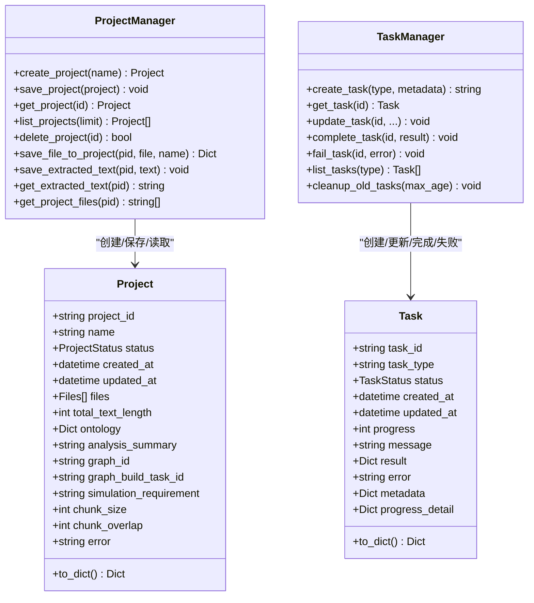

# 项目概述

<cite>
**本文引用的文件**
- [README.md](file://README.md)
- [README-EN.md](file://README-EN.md)
- [pyproject.toml](file://backend/pyproject.toml)
- [package.json](file://frontend/package.json)
- [run.py](file://backend/run.py)
- [__init__.py](file://backend/app/__init__.py)
- [config.py](file://backend/app/config.py)
- [graph.py](file://backend/app/api/graph.py)
- [simulation.py](file://backend/app/api/simulation.py)
- [simulation_manager.py](file://backend/app/services/simulation_manager.py)
- [logger.py](file://backend/app/utils/logger.py)
- [project.py](file://backend/app/models/project.py)
- [task.py](file://backend/app/models/task.py)
- [App.vue](file://frontend/src/App.vue)
- [main.js](file://frontend/src/main.js)
- [index.js](file://frontend/src/router/index.js)
- [pendingUpload.js](file://frontend/src/store/pendingUpload.js)
</cite>

## 目录
1. [引言](#引言)
2. [项目结构](#项目结构)
3. [核心组件](#核心组件)
4. [架构总览](#架构总览)
5. [详细组件分析](#详细组件分析)
6. [依赖分析](#依赖分析)
7. [性能考虑](#性能考虑)
8. [故障排查指南](#故障排查指南)
9. [结论](#结论)
10. [附录](#附录)

## 引言
MiroFish 是一款基于多智能体技术的新一代 AI 预测引擎。它通过提取现实世界的种子信息（如突发新闻、政策草案、金融信号），自动构建高保真的平行数字世界；在该世界中，成千上万个具备独立人格、长期记忆与行为逻辑的智能体进行自由交互与社会演化。用户可通过“上帝视角”动态注入变量，精准推演未来走向——“让未来在数字沙盘中预演，助决策在百战模拟后胜出”。

项目愿景涵盖宏观与微观两个层面：
- 宏观：为决策者提供零风险的政策与公关试错实验室；
- 微观：为个人用户提供创意沙盘，无论是推演小说结局还是探索脑洞，皆可有趣、好玩、触手可及。

工作流程分为五个阶段：
1) 图谱构建：种子提取、个体/集体记忆注入、GraphRAG 构建
2) 环境搭建：实体关系抽取、人设生成、Agent 配置注入
3) 开始模拟：双平台并行模拟、自动解析预测需求、动态更新时序记忆
4) 报告生成：ReportAgent 携带丰富工具集与模拟后环境深度交互
5) 深度互动：与模拟世界中的任意一位进行对话，与 ReportAgent 进行对话

**章节来源**
- [README.md](file://README.md#L26-L88)
- [README-EN.md](file://README-EN.md#L26-L88)

## 项目结构
MiroFish 采用前后端分离架构：
- 后端（Python/Flask）：提供图谱构建、模拟准备与运行、报告生成等核心能力，统一管理项目上下文与任务状态
- 前端（Vue3/Vite）：提供可视化流程引导与交互面板，串联“图谱构建—环境搭建—模拟运行—报告生成—深度互动”的全流程体验

**图表来源**
- [run.py](file://backend/run.py#L25-L46)
- [__init__.py](file://backend/app/__init__.py#L19-L79)
- [config.py](file://backend/app/config.py#L20-L76)
- [graph.py](file://backend/app/api/graph.py#L35-L117)
- [simulation.py](file://backend/app/api/simulation.py#L164-L237)
- [simulation_manager.py](file://backend/app/services/simulation_manager.py#L114-L228)
- [project.py](file://backend/app/models/project.py#L101-L166)
- [task.py](file://backend/app/models/task.py#L54-L99)
- [logger.py](file://backend/app/utils/logger.py#L30-L88)
- [App.vue](file://frontend/src/App.vue#L1-L48)
- [main.js](file://frontend/src/main.js#L1-L10)
- [index.js](file://frontend/src/router/index.js#L1-L53)
- [pendingUpload.js](file://frontend/src/store/pendingUpload.js#L1-L34)

**章节来源**
- [README.md](file://README.md#L81-L88)
- [README-EN.md](file://README-EN.md#L81-L88)
- [pyproject.toml](file://backend/pyproject.toml#L1-L56)
- [package.json](file://frontend/package.json#L1-L22)

## 核心组件
- 项目上下文管理（ProjectManager）
  - 负责项目生命周期的状态持久化与检索，支持文件上传、本体生成、图谱构建、模拟准备与运行等阶段的数据保存
- 任务状态管理（TaskManager）
  - 提供线程安全的任务状态跟踪，支持进度上报、详细进度、结果与错误记录
- 图谱构建与查询（Graph API）
  - 提供本体生成、图谱构建、任务查询、图谱数据获取与删除等接口
- 模拟管理（SimulationManager）
  - 负责从图谱读取实体、生成 Agent Profile、LLM 智能生成模拟配置、准备脚本与运行说明
- 模拟运行（Simulation API）
  - 提供实体读取、模拟创建、准备与状态查询、运行说明等接口
- 日志系统（Logger）
  - 统一日志配置，同时输出到控制台与文件，支持 UTF-8 编码与轮转
- 前端路由与状态
  - Vue3 路由组织流程视图，pendingUpload 用于跨页面传递上传与需求数据

**章节来源**
- [project.py](file://backend/app/models/project.py#L101-L306)
- [task.py](file://backend/app/models/task.py#L54-L185)
- [graph.py](file://backend/app/api/graph.py#L119-L255)
- [simulation_manager.py](file://backend/app/services/simulation_manager.py#L114-L529)
- [simulation.py](file://backend/app/api/simulation.py#L164-L781)
- [logger.py](file://backend/app/utils/logger.py#L30-L127)
- [index.js](file://frontend/src/router/index.js#L1-L53)
- [pendingUpload.js](file://frontend/src/store/pendingUpload.js#L1-L34)

## 架构总览
MiroFish 的整体架构围绕“项目上下文 + 任务状态 + API 层 + 服务层 + 外部集成”的设计展开。后端通过 Flask 应用工厂集中注册蓝图与中间件，统一处理请求日志、CORS 与健康检查；前端通过 Vue Router 组织流程视图，配合后端 API 实现端到端的预测工作流。

**图表来源**
- [__init__.py](file://backend/app/__init__.py#L52-L74)
- [simulation_manager.py](file://backend/app/services/simulation_manager.py#L229-L457)
- [graph.py](file://backend/app/api/graph.py#L259-L525)
- [simulation.py](file://backend/app/api/simulation.py#L358-L781)
- [logger.py](file://backend/app/utils/logger.py#L30-L88)

**章节来源**
- [__init__.py](file://backend/app/__init__.py#L19-L79)
- [config.py](file://backend/app/config.py#L20-L76)

## 详细组件分析

### 图谱构建流程（API 与服务）
图谱构建分为“本体生成”和“图谱构建”两大阶段，均通过异步任务与进度回调实现可观测性与可恢复性。

**图表来源**
- [graph.py](file://backend/app/api/graph.py#L119-L255)
- [graph.py](file://backend/app/api/graph.py#L259-L525)
- [project.py](file://backend/app/models/project.py#L101-L166)
- [task.py](file://backend/app/models/task.py#L73-L99)

**章节来源**
- [graph.py](file://backend/app/api/graph.py#L119-L525)
- [project.py](file://backend/app/models/project.py#L101-L306)
- [task.py](file://backend/app/models/task.py#L54-L185)

### 模拟准备与运行（双平台并行）
模拟准备通过“实体读取—Agent Profile 生成—LLM 智能配置—脚本准备”的流水线完成，支持 Twitter 与 Reddit 平台并行运行。

**图表来源**
- [simulation.py](file://backend/app/api/simulation.py#L164-L237)
- [simulation.py](file://backend/app/api/simulation.py#L358-L781)
- [simulation_manager.py](file://backend/app/services/simulation_manager.py#L229-L457)
- [simulation_manager.py](file://backend/app/services/simulation_manager.py#L506-L529)

**章节来源**
- [simulation.py](file://backend/app/api/simulation.py#L164-L781)
- [simulation_manager.py](file://backend/app/services/simulation_manager.py#L114-L529)

### 数据模型与状态流转（项目与任务）
项目与任务模型负责在服务端持久化状态，避免前端在接口间传递大量数据，提升一致性与可维护性。

**图表来源**
- [project.py](file://backend/app/models/project.py#L26-L98)
- [project.py](file://backend/app/models/project.py#L101-L306)
- [task.py](file://backend/app/models/task.py#L22-L52)
- [task.py](file://backend/app/models/task.py#L54-L185)

**章节来源**
- [project.py](file://backend/app/models/project.py#L1-L306)
- [task.py](file://backend/app/models/task.py#L1-L185)

### 前端流程与路由
前端采用 Vue3 + Vue Router，通过路由组织“首页—流程—模拟—报告—互动”五大视图，并通过全局状态暂存上传文件与需求，实现跨页面数据传递。

**图表来源**
- [index.js](file://frontend/src/router/index.js#L9-L45)
- [pendingUpload.js](file://frontend/src/store/pendingUpload.js#L1-L34)

**章节来源**
- [App.vue](file://frontend/src/App.vue#L1-L48)
- [main.js](file://frontend/src/main.js#L1-L10)
- [index.js](file://frontend/src/router/index.js#L1-L53)
- [pendingUpload.js](file://frontend/src/store/pendingUpload.js#L1-L34)

## 依赖分析
后端依赖以 Flask 为核心，结合 CORS、OpenAI SDK、Zep Cloud、OASIS 仿真引擎与文件处理工具库；前端依赖 Vue3、Vue Router、Axios 与可视化库 D3。

**图表来源**
- [pyproject.toml](file://backend/pyproject.toml#L11-L35)
- [package.json](file://frontend/package.json#L11-L21)

**章节来源**
- [pyproject.toml](file://backend/pyproject.toml#L1-L56)
- [package.json](file://frontend/package.json#L1-L22)

## 性能考虑
- 异步任务与进度回调：图谱构建与模拟准备均采用后台线程与任务管理器，避免阻塞主线程，提升用户体验
- 文本分块与批处理：图谱构建阶段对长文本进行分块与批量写入，降低单次请求压力
- 日志轮转与编码：统一日志输出与轮转策略，减少磁盘占用并保证中文显示
- 前后端分离：前端路由与状态管理降低后端负担，便于横向扩展

[本节为通用指导，不直接分析具体文件]

## 故障排查指南
- 配置校验
  - 后端启动前会校验 LLM 与 Zep 的 API Key，若缺失将直接退出并提示检查 .env
- 健康检查
  - 后端提供 /health 接口，可用于容器编排与运维监控
- 日志定位
  - 日志同时输出到控制台与按日轮转的文件，建议优先查看后端日志目录中的最新日志文件
- 常见问题
  - 图谱构建失败：检查 ZEP_API_KEY、网络连通性与文本分块参数
  - 模拟准备失败：确认项目已生成本体、图谱已构建完成，检查 LLM 配置与实体过滤条件
  - 前端无法访问：确认前端与后端端口映射（3000/5001），并检查 CORS 配置

**章节来源**
- [run.py](file://backend/run.py#L25-L46)
- [config.py](file://backend/app/config.py#L66-L76)
- [__init__.py](file://backend/app/__init__.py#L72-L74)
- [logger.py](file://backend/app/utils/logger.py#L30-L88)

## 结论
MiroFish 通过“多智能体 + 平行数字世界”的设计，将复杂预测转化为可交互、可复现、可迭代的仿真过程。其前后端解耦、任务驱动与状态持久化的架构，既满足初学者的易用性需求，也为经验丰富的开发者提供了清晰的扩展路径。依托 OASIS 仿真引擎与 LLM 的智能配置能力，MiroFish 能够在宏观政策与微观创意场景中实现“所想即所见”的预测体验。

[本节为总结性内容，不直接分析具体文件]

## 附录
- 快速开始
  - 源码部署与 Docker 部署两种方式，分别适用于开发与生产环境
  - 前置工具与版本要求明确，建议优先使用 uv 管理 Python 依赖
- 示例与演示
  - 提供武汉大学舆情推演与《红楼梦》结局预测的演示视频，便于理解应用场景与效果
- 致谢
  - 感谢 CAMEL-AI 团队提供的 OASIS 仿真引擎开源贡献

**章节来源**
- [README.md](file://README.md#L89-L173)
- [README-EN.md](file://README-EN.md#L89-L173)
- [README.md](file://README.md#L184-L189)
- [README-EN.md](file://README-EN.md#L184-L189)